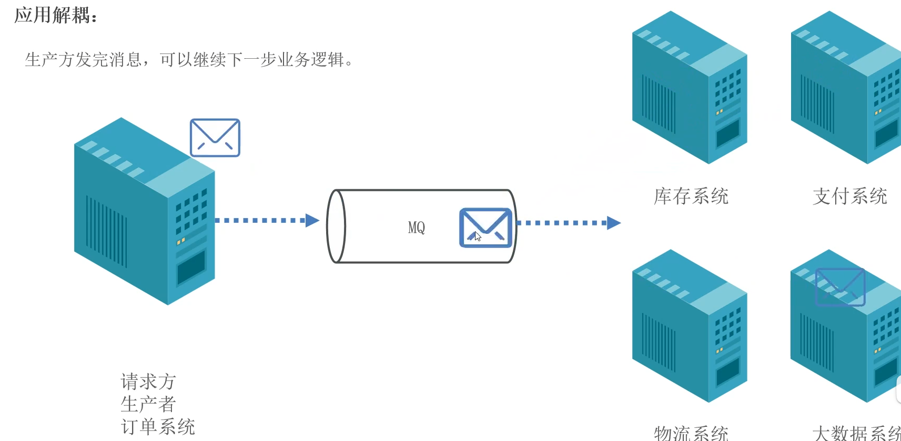

# Context Engineering 深度调研报告：混合检索、RAG、Memory 等云原生方案

## 摘要

本报告深入研究了 Context Engineering（上下文工程）及其在混合检索、RAG（检索增强生成）、Memory（记忆系统）等领域的云原生实现方案。报告系统分析了上下文工程的核心概念、技术架构、关键组件以及在企业级 AI 应用中的实践价值。通过对多个技术方案和应用案例的研究，揭示了上下文工程作为 AI 原生应用基础设施的核心地位，为企业构建智能应用提供了技术选型参考和实践指导。

**关键词：** Context Engineering；上下文工程；混合检索；RAG；AI Memory；云原生；AI 中间件

---

## 1. 引言

### 1.1 研究背景

在大语言模型（LLM）技术快速发展的背景下，企业 AI 应用正从简单的对话交互向复杂的智能决策系统演进。然而，多数 AI 应用的失败并非源于模型能力不足，而是上下文工程（Context Engineering）的缺失。随着模型上下文窗口的不断扩大，"语境腐烂" 现象日益突出，如何有效管理和优化上下文成为 AI 应用成功的关键因素。

Context Engineering 作为 AI 领域的新兴概念，关注的不是如何训练大型模型，而是如何精心设计和优化给模型的输入内容。它通过系统性地管理上下文信息，确保模型在有限的注意力资源中保持可靠表现，是 AI 应用从 "演示" 走向 "工业级" 的必经之路。

### 1.2 研究目标

- 深入理解 Context Engineering 的核心概念和技术架构

- 分析混合检索、RAG、Memory 等关键技术的云原生实现

- 研究 AI 中间件在上下文工程中的作用和价值

- 评估不同技术方案的优缺点和适用场景

- 提供企业级 AI 应用架构设计的实践建议

---

## 2. Context Engineering 核心概念与架构

### 2.1 重新定义 Context（上下文）

Context（上下文）是提供给大语言模型的、用来完成下一步推理或生成任务的全部信息集合。它远比 "聊天记录" 更丰富，可以系统地分为三大核心类别：

#### 2.1.1 指导性上下文（Guiding Context）

这类上下文的核心功能是指导模型该做什么以及如何去做，为模型的行为设定框架、目标和规则：

- **系统提示词（System Prompt）**：定义模型的角色和行为准则

- **任务描述（Task Description）**：明确当前需要完成的具体任务

- **少样本示例（Few-shot Examples）**：提供范例，指导模型输出的风格和逻辑

- **输出格式定义（Output Schema）**：规定模型应以何种格式返回结果

#### 2.1.2 信息性上下文（Informational Context）

这类上下文的核心功能是告诉模型需要知道什么知识，为其提供解决问题所必需的事实、数据和知识：

- **检索增强生成（RAG）**：从外部知识库中检索相关信息

- **记忆（Memory）**：包括短期记忆和长期记忆

- **State & Scratchpad**：模型的 "草稿本"，用于记录中间的思考过程和状态

#### 2.1.3 行动性上下文（Actionable Context）

这类上下文的核心功能是告诉模型能做什么以及做了之后的结果，赋予模型与外部世界交互的能力：

- **工具定义（Tool Definition）**：描述模型可以使用的工具及其功能

- **工具调用和结果（Tool Calls & Results）**：记录模型调用工具的动作和返回的结果

- **工具追踪（Tool Traces）**：追踪工具调用的完整链路

### 2.2 Context Engineering 的定义与价值

#### 2.2.1 定义

Context Engineering 是一门系统性的学科，专注于设计、构建并维护一个动态系统，该系统负责为 Agent 执行任务的每一步，智能地组装出最优的上下文组合，从而确保任务能够被可靠、高效地完成。

正如 Andrej Karpathy（OpenAI 创始成员）所言："在所有的工业级大模型应用中，上下文工程是一门微妙的艺术与科学，目的是在上下文窗口中填入恰到好处的信息，为下一步的推理做准备。"

#### 2.2.2 与相关技术的关系

Context Engineering 与提示词工程、RAG 等技术并非互相排斥，而是处于不同层级、互相协作的关系：

- **提示词工程**：更细粒度，专注于优化单次交互中的 "指导性上下文"

- **RAG**：是上下文工程的一部分，专注于从外部知识库中 "检索" 信息，填充 "信息性上下文"

- **上下文工程**：范畴远大于前两者，它是一个完整的系统，不仅要决定 "检索什么"，还要考虑如何将检索到的信息与指导性、行动性上下文进行动态组合

### 2.3 Context Engineering 的核心环节

有效的上下文工程包含四个核心环节：**写（Write）→ 选（Select）→ 压（Compress）→ 隔（Isolate）**

#### 2.3.1 Write Context（写入上下文）

写入上下文意味着把信息明确记录下来，而不是依赖模型的 "即时记忆"：

- **Scratchpads（便签本）**：临时工作区，记录模型的中间推理

- **Memories（记忆）**：将跨对话的重要事实、用户信息和环境状态保留下来

- **主动反思**：Agent 在每次行动后主动反思，把经历转化为 "抽象记忆"

#### 2.3.2 Select Context（选择上下文）

从海量信息中选择最相关的内容注入模型窗口：

- **相关性排序**：基于语义相似度选择最相关的信息片段

- **重要性评估**：识别对当前任务最关键的信息

- **多样性考虑**：确保信息来源的多样性，避免片面性

#### 2.3.3 Compress Context（压缩上下文）

在有限的上下文窗口内最大化信息密度：

- **摘要生成**：将长文本压缩为关键要点

- **信息提炼**：提取核心概念和关键数据

- **格式优化**：采用结构化格式提高信息传递效率

#### 2.3.4 Isolate Context（隔离上下文）

将不同类型的上下文进行有效隔离，避免相互干扰：

- **领域隔离**：不同业务领域的上下文分开管理

- **角色隔离**：不同 Agent 角色的上下文独立维护

- **安全隔离**：敏感信息与公共信息分离处理

---

## 3. 混合检索技术分析

### 3.1 混合检索的概念与挑战

#### 3.1.1 定义与价值

**混合检索**是指同时使用多种检索技术（向量召回、全文检索、标量过滤 / 聚合等）来满足业务层丰富的检索需求。在 AI Agent 场景中，混合检索能够：

- 处理多模态数据（文本、图像、音频等）

- 支持复杂条件的组合查询

- 提供更准确、更全面的检索结果

#### 3.1.2 传统方案的局限性

传统的混合检索方案存在诸多挑战：

**业务复杂性**：

- 需要组合使用多个不同系统

- 使用不同的 SDK 与查询语言

- 业务层需要编写复杂的跨系统回表与聚合计算逻辑

**运维复杂性**：

- 需要部署多个独立系统

- 系统间需要构建数据同步链路

- 组件数多带来高部署成本和重运维负担

### 3.2 混合检索的技术架构

#### 3.2.1 多模态数据处理与索引

**跨模态统一表征**：

- 使用多模态嵌入模型（如 CLIP、VL-BERT）将文本、图像、音频等数据映射到共享的向量空间

- 对图像 / 音频生成结构化描述，与原始文本共同构建索引

**分层索引策略**：

- 文本采用分块向量化存储

- 图像生成局部特征向量

- 音频分割为片段嵌入

- 结合知识图谱存储实体关系

#### 3.2.2 混合检索优化机制

**多路召回**：

- 关键词检索（BM25）

- 向量相似度匹配（KNN/HNSW）

- 图查询（知识图谱关联）

**重排序技术**：

- 交叉编码器模型计算细粒度相关性得分

- 减少噪声干扰，提高检索准确性

**查询理解增强**：

- 多模态解析：自动提取视觉特征融合到查询向量

- 查询分解 / 重写：将复杂问题拆解为多模态子查询

### 3.3 云原生混合检索方案

#### 3.3.1 一体化架构方案

**veDB-Search**是火山引擎推出的一站式混合检索服务，其核心优势包括：

- **SQL is Everything**：用户仅使用 SQL，即可完成对向量 + 全文 + 标量数据的存储和混合检索

- **插拔式服务**：按需开启，透明智能索引加速

- **兼容标准 SQL**：存量业务无需变更，新业务可使用扩展语法

- **自动优化**：自动识别混合索引，自动优化查询路径

#### 3.3.2 性能与可扩展性

- **10 亿级规模**：云原生分布式架构，秒级扩展只读能力

- **多种算法支持**：支持 HNSW、IVF 等主流索引算法

- **分布式并行检索**：支撑高吞吐的混合检索

- **企业级能力**：高可用、完善的监控告警

#### 3.3.3 应用案例：AIGC 混合检索

字节跳动内部的 AIGC 资产管理业务场景：

- 业务数据规模千万级，日增数据十万级

- 对同一份数字资产实现多维度的 embedding

- 检索时对多个维度做 topk 相似召回，结合元数据过滤

**方案价值**：

- 架构复杂度下降，减少 2/3 的运维成本

- 业务层不需要接入多个 SDK

- 不需要编写复杂的回表、过滤、聚合代码

---

## 4. RAG 技术与云原生实现

### 4.1 RAG 技术概述

#### 4.1.1 核心概念

\*\* 检索增强生成（RAG）\*\* 是结合信息检索与生成模型的技术，其核心思想是在生成回答之前，通过检索外部知识库中的相关信息，再结合大语言模型生成最终的回答。

RAG 有效解决了大模型的三大问题：

- **知识时效性**：通过检索最新数据保持回答的时效性

- **事实准确性**：减少模型幻觉，提高回答的准确性

- **数据安全性**：保护企业私有数据，避免信息泄露

#### 4.1.2 RAG 的技术挑战

**数据处理复杂性**：

- 数据采集、清洗、切块、向量化、入库、检索等多个环节

- 任何一个环节的故障都可能导致全链路瘫痪

**运维难度**：

- 数据源接口变更、数据质量问题、系统负载突增等突发状况

- 问题排查、修复和系统更新耗时耗力

**稳定性问题**：

- 数据丢失、重复、延迟、质量下降等问题

- 传统架构的紧耦合设计导致故障影响范围大

### 4.2 云原生 RAG 架构

#### 4.2.1 事件驱动架构

\*\* 事件驱动架构（EDA）\*\* 为 RAG 数据处理提供了理想的技术基础：

- **事件化处理**：将数据的产生、变更、处理、存储等环节抽象为事件

- **松耦合设计**：数据处理流程分解为独立的事件和处理单元

- **可扩展性**：每个组件可根据负载独立扩展

- **实时性**：事件一旦发生，便能被立即捕获并触发后续处理

#### 4.2.2 EventBridge 多源 RAG 处理方案

阿里云事件总线 EventBridge 提供的多源 RAG 处理方案：

**无缝对接多源数据**：

- 支持对象存储（OSS）、消息队列（Kafka、RocketMQ）

- 支持日志服务（SLS）、数据库服务（MySQL）

- 覆盖结构化、半结构化、非结构化数据

**智能化数据处理**：

- 自动完成文档解析（Loader）、文本切分（Chunking）和向量化（Embedding）

- 支持多种非结构化数据的智能解析和处理

- 提供完整的 Loader 技术体系

**一键式向量入库**：

- 统一的向量数据库接入接口

- 支持主流向量数据库（DashVector、Milvus）

- 简单的图形界面配置，自动生成处理流程

### 4.3 Agentic RAG 架构演进

#### 4.3.1 多智能体协作架构

**Agentic RAG**采用智能体协作架构：

- **调度智能体**：分配任务给专业处理模块

- **专业处理模块**：文本、图像、音频等专业处理

- **并行检索**：多模块并行检索后综合结果

- **动态工具调用**：实时搜索数据库、API 获取最新数据

#### 4.3.2 ViDoRAG：多模态文档 RAG

阿里巴巴通义实验室推出的 ViDoRAG（Visual Document Retrieval-Augmented Generation）：

**多模态混合检索机制**：

- 基于高斯混合模型（GMM）动态调整文本和视觉模态的检索结果数量

- 模态感知的嵌入方法整合检索结果

- 避免因页面不连续导致的相关性丢失

**三智能体协作推理**：

- **Seeker（探索者）**：负责信息检索

- **Inspector（检查者）**：验证信息准确性

- **Answer（回答者）**：生成最终答案

- 从粗到细的动态迭代推理过程

---

## 5. AI Memory 系统设计

### 5.1 Memory 系统的概念与价值

#### 5.1.1 记忆的重要性

Memory 系统在 AI 应用中扮演着类似人类 "海马体" 的角色：

- 将短期记忆、感受和经历转化为可被提取和利用的长期记忆

- 使模型能够记住之前的对话内容和交互经验

- 支持持续学习和动态适应未来的问题

#### 5.1.2 记忆的分类

**短期记忆（Short-term Memory）**：

- 保留最新 N 轮对话

- 超出部分用滑动窗口 + 摘要压缩

- 把 "讨论过什么" 压缩成关键要点

**长期记忆（Long-term Memory）**：

- 存储用户关键声明、成功案例、失败教训

- 用向量数据库存储文档摘要

- 每次生成回答时只拉回最相关的片段

### 5.2 云原生 Memory 系统架构

#### 5.2.1 分层存储架构

**内存层（In-memory）**：

- 存储最近的对话历史和临时状态

- 提供毫秒级的访问速度

- 支持高并发读写操作

**向量存储层（Vector Store）**：

- 存储长期记忆的向量表示

- 支持语义相似度检索

- 提供可扩展的存储容量

**持久化存储层（Persistent Storage）**：

- 存储原始对话记录和重要信息

- 支持数据备份和恢复

- 提供长期数据保留

#### 5.2.2 记忆管理策略

**主动记忆**：

- Agent 在每次行动后主动反思

- 将经历转化为 "抽象记忆"

- 在未来任务中反复使用记忆

**记忆检索优化**：

- 基于当前任务动态选择相关记忆

- 避免记忆过载导致的性能下降

- 支持记忆的过期和清理机制

### 5.3 Memory 系统的云原生实现

#### 5.3.1 MemOS：记忆操作系统

**MemOS**是专门为 AI Agent 设计的记忆操作系统：

- **记忆抽象**：将碎片化的对话沉淀为长期记忆

- **记忆检索**：在合适的时机调用过去的记忆和经验

- **持续学习**：动态适应未来的问题

- **跨会话迁移**：支持记忆在不同会话间的迁移

#### 5.3.2 云原生特性

**弹性扩展**：

- 基于云平台的弹性计算资源

- 支持按需扩展存储和计算能力

- 按量付费，降低成本

**高可用性**：

- 多可用区部署

- 数据冗余和备份

- 自动故障恢复

**安全与隐私**：

- 数据加密存储和传输

- 访问控制和权限管理

- 符合数据保护法规

---

## 6. 云原生 AI 中间件架构

### 6.1 AI 中间件的定位与价值

#### 6.1.1 从云原生到智能原生

**云原生时代**：

- 核心是调度和管理服务

- 围绕云环境设计应用

- 关键技术：微服务、容器化、持续交付、DevOps

**智能原生时代**：

- 核心是 AI 能力的最大化利用

- 围绕 AI 设计应用架构

- 服务载体从微服务变成 Agent 智能体

AI 中间件在智能原生架构中扮演着关键角色，它不是替代云原生，而是在云原生基础上的进化。

#### 6.1.2 AI 中间件的核心价值

AI 中间件在 AI 应用与大模型之间承担三大核心功能：

**连接与集成**：

- 把大模型、工具链、数据存储、微服务打通

- 让 Agent 可以无缝调用知识、使用工具、对接业务

**能力抽象**：

- 封装 A2A 通信、状态管理、数据集成等共性能力

- 屏蔽底层复杂度，让开发者聚焦业务创新

**工程化支撑**：

- 提供可观测、安全治理、弹性扩缩容等企业级能力

- 保障生产环境的稳定性与高效运维

### 6.2 云原生 AI 中间件架构

#### 6.2.1 阿里云 AI 中间件

阿里云发布的 AI 中间件是面向分布式多 Agent 架构的基座：

**核心组件**：

- **AgentScope-Java**：兼容 Spring AI Alibaba 生态的 AI 编程框架

- **AI MQ**：基于 Apache RocketMQ 的 AI 能力升级

- **AI 网关 Higress**：企业级 AI 流量中枢

- **AI 注册与配置中心 Nacos**：服务发现和配置管理

- **AI 可观测体系**：覆盖模型与算力的监控

#### 6.2.2 事件驱动中间件

**AI MQ（基于 RocketMQ）**：

- 支持 AI 事件的可靠传递

- 提供消息追溯和回放能力

- 支持复杂事件处理（CEP）

**事件总线 EventBridge**：

- 多源数据接入和处理

- 事件驱动的 RAG 数据管道

- 智能化的数据处理能力

### 6.3 AI 网关：企业级 AI 流量中枢

#### 6.3.1 核心功能

**统一代理**：

- 支持多模型路由

- MCP 协议适配

- Agent API 封装

**安全鉴权**：

- 集中管理 API-KEY

- 消费者身份验证

- AI 安全护栏

**高可用保障**：

- 多可用区部署

- Fallback 机制

- 精细化限流

**成本优化**：

- AI 缓存减少算力消耗

- Token 级成本监控

- 资源调度优化

#### 6.3.2 云原生特性

**弹性扩展**：

- 基于 Kubernetes 的自动扩缩容

- 支持 Serverless 部署模式

- 按需分配计算资源

**可观测性**：

- 全链路监控和追踪

- 实时性能指标收集

- 智能告警和故障定位

---

## 7. 技术挑战与解决方案

### 7.1 核心技术挑战

#### 7.1.1 上下文管理挑战

**语境腐烂问题**：

- 模型在长语境下性能下降

- 信息过载导致关键信息被稀释

- 上下文窗口限制导致信息丢失

**解决方案**：

- 实施上下文工程的 "写、选、压、隔" 四环节

- 采用动态上下文组装策略

- 优化信息压缩和摘要生成算法

#### 7.1.2 混合检索挑战

**多模态数据处理**：

- 不同模态数据的统一表征

- 跨模态检索的准确性

- 多模态结果的融合

**解决方案**：

- 使用多模态嵌入模型实现统一表征

- 采用混合索引策略优化检索性能

- 设计智能的结果融合算法

#### 7.1.3 系统复杂性挑战

**多 Agent 协作**：

- Agent 间的通信和协调

- 状态一致性维护

- 故障处理和恢复

**解决方案**：

- 采用事件驱动架构

- 实现 Agent 间的标准化通信协议

- 设计弹性的故障处理机制

### 7.2 工程化挑战

#### 7.2.1 开发效率挑战

**开发复杂度**：

- 手工编织记忆、决策、工具调用细节

- 缺少开箱即用的框架和工具

- 业务敏捷迭代困难

**解决方案**：

- 提供标准化的 AI 编程框架

- 封装通用的上下文管理组件

- 提供可视化的配置工具

#### 7.2.2 系统集成挑战

**异构系统对接**：

- 新 AI 应用与存量系统的集成

- 多数据源的统一接入

- 数据治理和质量保证

**解决方案**：

- 提供标准化的集成接口

- 实现数据的自动转换和映射

- 建立统一的数据治理体系

#### 7.2.3 稳定运行挑战

**性能波动**：

- 推理 Tokens 流量波动大

- 延迟不可控

- 资源消耗难以预测

**解决方案**：

- 采用弹性扩缩容策略

- 实现智能的资源调度

- 建立性能监控和优化机制

### 7.3 安全与合规挑战

#### 7.3.1 数据安全挑战

**敏感信息保护**：

- 上下文信息中的敏感数据

- 工具调用中的数据泄露风险

- 多 Agent 通信中的信息安全

**解决方案**：

- 实现数据加密和脱敏

- 建立细粒度的访问控制

- 实施安全审计和监控

#### 7.3.2 合规性挑战

**监管合规**：

- 数据隐私法规要求

- 算法透明度和可解释性

- 决策过程的可追溯性

**解决方案**：

- 实现模型决策的审计日志

- 提供算法解释和可视化工具

- 建立合规性检查机制

---

## 8. 应用案例分析

### 8.1 智能能源管理中的上下文工程

#### 8.1.1 业务背景

智能能源管理（IEM）是实现 "双碳" 目标的核心支撑技术，需要通过数据驱动的决策优化能源生产、传输、存储与消费的全链路效率。

#### 8.1.2 上下文工程应用

**上下文模型**：

- 统一多源数据的语义

- 定义上下文实体之间的关系

**上下文获取**：

- 物联网终端数据采集

- 第三方系统对接（天气、电价等）

- 用户界面交互数据收集

**上下文处理**：

- 数据清洗和融合

- 上下文存储和管理

- 实时数据分析和处理

**应用效果**：

- 实现 "按需服务" 的智能能源管理

- 提高能源利用效率

- 降低能源消耗成本

### 8.2 法律行业 AI 咨询机器人

#### 8.2.1 业务挑战

法律行业的咨询机器人需要：

- 准确理解法律问题

- 提供基于判例的专业建议

- 确保回答的准确性和合规性

#### 8.2.2 上下文工程方案

**知识库构建**：

- 判例库按三级编码（法域 - 法条 - 关键词）建立向量索引

- 用户身份和合同类型提前注入请求

- 工具输出用 Markdown 列表展示

**上下文优化**：

- 动态选择相关的法律条文和判例

- 优化信息展示格式

- 确保上下文的相关性和完整性

**应用效果**：

- 回答率从 57% 提升到 88%

- 显著提高咨询效率

- 降低人工咨询成本

### 8.3 电商退货对话机器人

#### 8.3.1 业务痛点

电商退货场景的主要痛点：

- 用户说不清商品型号和订单号

- 退货政策复杂难以理解

- 人工处理效率低下

#### 8.3.2 上下文工程解决方案

**上下文预加载**：

- 用订单 API 根据手机号查出最近订单列表

- 动态插入对话上下文

- 提前获取用户的购买历史和偏好

**知识检索优化**：

- 调用知识库过滤最新退货条款

- 输出结构化表格展示政策要点

- 提供清晰的操作指引

**应用效果**：

- 投诉率两周内下降 43%

- 显著提升用户满意度

- 降低人工客服工作量

---

## 9. 未来发展趋势

### 9.1 技术发展趋势

#### 9.1.1 Context Engineering 的成熟化

**标准化发展**：

- 上下文模型的标准化

- 上下文管理接口的统一

- 上下文质量评估体系的建立

**自动化演进**：

- 上下文的自动生成和优化

- 基于反馈的持续改进

- 自适应的上下文管理策略

#### 9.1.2 混合检索技术的创新

**多模态融合**：

- 更先进的跨模态嵌入模型

- 实时多模态检索能力

- 多模态结果的智能融合

**智能化优化**：

- 基于机器学习的检索策略优化

- 动态调整的检索参数

- 个性化的检索结果排序

### 9.2 架构演进趋势

#### 9.2.1 从云原生到 AI 原生

**AI 原生架构**：

- 以 Agent 为核心的应用架构

- 上下文工程作为核心基础设施

- 记忆系统成为必备组件

**Serverless AI**：

- 函数计算支持 AI 模型部署

- 按需弹性的 AI 服务

- 按量付费的成本优化

#### 9.2.2 中间件的平台化

**AI 中间件平台**：

- 提供完整的 AI 应用开发环境

- 集成上下文管理、RAG、Memory 等能力

- 支持低代码 / 无代码开发

**生态系统建设**：

- 开源社区的发展

- 合作伙伴生态的扩展

- 标准化接口的推广

### 9.3 应用场景扩展

#### 9.3.1 行业应用深化

**金融行业**：

- 智能投顾和风险管理

- 合规审查和监管报告

- 客户服务和个性化推荐

**医疗行业**：

- 辅助诊断和治疗建议

- 医学文献检索和分析

- 患者管理和健康咨询

#### 9.3.2 新兴应用场景

**数字员工**：

- 多 Agent 协作的数字团队

- 自主决策和执行的智能体

- 持续学习和进化的能力

**元宇宙应用**：

- 虚拟环境中的智能交互

- 多模态上下文理解

- 实时决策和响应

---

## 10. 结论与建议

### 10.1 主要结论

1. **Context Engineering 是 AI 应用成功的关键**：多数 AI 应用的失败并非模型能力不足，而是上下文工程的缺失。有效的上下文管理能够显著提升模型性能和应用效果。

2. **混合检索技术日趋成熟**：一体化的混合检索方案能够有效解决多模态数据处理和复杂查询的挑战，为 AI 应用提供强大的信息检索能力。

3. **RAG 技术向 Agentic 方向演进**：多智能体协作的 RAG 架构能够处理更复杂的任务，提供更准确、更全面的回答。

4. **Memory 系统成为 AI 应用的必备组件**：记忆系统使 AI 能够记住历史经验，实现持续学习和动态适应，是构建智能应用的重要基础。

5. **云原生 AI 中间件加速应用落地**：AI 中间件提供了连接、抽象和工程化支撑能力，是企业级 AI 应用规模化落地的关键基础设施。

### 10.2 技术选型建议

#### 10.2.1 上下文管理方案

**对于复杂 AI 应用**：

- 采用成熟的上下文工程框架

- 实施 "写、选、压、隔" 四环节管理

- 建立上下文质量评估体系

**对于简单应用**：

- 从基础的 RAG 方案开始

- 逐步引入上下文管理能力

- 关注关键信息的选择和优化

#### 10.2.2 混合检索方案

**对于企业级应用**：

- 选择一体化的混合检索服务

- 优先考虑云原生架构

- 关注性能、可扩展性和易用性

**对于初创项目**：

- 可以从开源方案开始

- 逐步过渡到商业解决方案

- 关注开发效率和快速迭代

#### 10.2.3 AI 中间件选型

**对于大型企业**：

- 选择成熟的云厂商 AI 中间件

- 关注系统集成和生态兼容性

- 重视安全和合规能力

**对于中小型企业**：

- 可以采用开源的 AI 中间件

- 关注成本效益和易用性

- 选择有活跃社区支持的项目

### 10.3 实施策略建议

#### 10.3.1 分阶段实施

**第一阶段：基础建设**

- 建立上下文管理的基础框架

- 部署基本的 RAG 能力

- 构建简单的记忆系统

**第二阶段：能力提升**

- 引入混合检索技术

- 优化上下文管理策略

- 增强记忆系统的能力

**第三阶段：智能化演进**

- 实现 Agentic RAG 架构

- 构建复杂的多 Agent 系统

- 实现持续学习和进化

#### 10.3.2 组织与人才建议

**团队建设**：

- 建立专门的 AI 工程团队

- 培养上下文工程专家

- 加强跨团队协作

**技能培养**：

- 培训开发人员的 AI 工程能力

- 提升对上下文工程的理解

- 掌握云原生 AI 技术栈

### 10.4 未来展望

Context Engineering 及其相关技术正在快速发展，成为 AI 应用开发的核心领域。随着大模型技术的不断进步和应用场景的不断扩展，上下文工程将在以下方面继续演进：

1. **技术标准化**：上下文模型、管理接口和评估体系将逐渐标准化，降低开发难度。

2. **自动化程度提升**：上下文的生成、选择和优化将更加自动化，减少人工干预。

3. **应用场景扩展**：从简单的对话系统扩展到复杂的智能决策和执行系统。

4. **生态系统完善**：围绕上下文工程的开源社区和商业生态将不断发展壮大。

企业应积极关注这一领域的发展，提前布局相关技术和人才，为未来的智能化转型做好准备。

---

## 参考文献

1. 深度解析上下文工程（Context Engineering）：提升大模型应用性能的关键

2. 上下文工程：超越 RAG，大模型应用开发的未来方向

3. RAG 技术如何整合多模态数据？

4. ViDoRAG 详解：多模态文档检索增强生成框架的革命性突破

5. 从传统架构到 AI 原生：深度剖析企业 AI 落地的 "三高" 痛点与 Serverless 化解决方案

6. 阿里云 AI 中间件重磅发布，打通 AI 应用落地 "最后一公里"

7. RAG 应用落地指南：基于 EventBridge 构建高可用、可扩展的数据处理管道

8. veDB-Search:AI 混合检索，懂 SQL 就行

9. 从 "云原生" 到 "智能原生"，AI 中间件走到哪一步了？

10. 智能能源管理中的上下文工程：场景化设计与个性化适配的技巧

---

**报告完成时间：** 2025 年 12 月 11 日

**报告版本：** v1.0

**调研范围：** Context Engineering 及相关 AI 技术领域

> （注：文档部分内容可能由 AI 生成）
