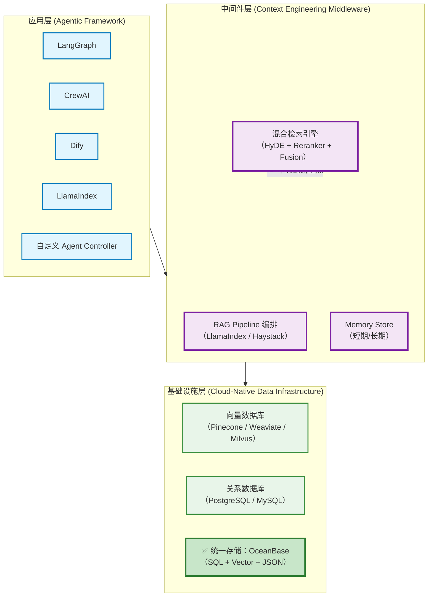
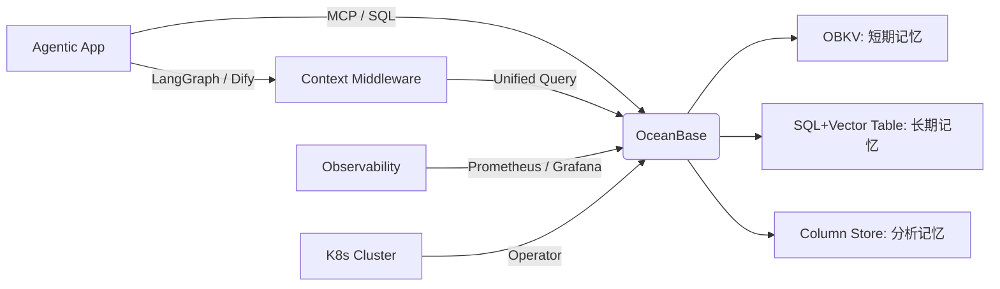

以下是对 **Context Engineering 云原生方案** 的深度调研报告，聚焦 **混合检索（Hybrid Retrieval）、RAG（Retrieval-Augmented Generation）、Agent Memory（长期/短期记忆）** 等中间件与基础框架层，结合前文对 OceanBase 的分析，构建面向 Agentic AI 时代的上下文工程云原生技术全景。

---

# Context Engineering 云原生方案深度调研

## ——面向 Agentic AI 的混合检索、RAG 与记忆基础设施

---

## 一、Context Engineering 的核心挑战与需求分析

Context Engineering 是 Agentic AI 的“神经系统”，负责管理、组织和输送上下文（Context）给 LLM，其核心任务包括：

| 功能模块         | 关键需求                                                               | 技术挑战                               |
| ---------------- | ---------------------------------------------------------------------- | -------------------------------------- |
| **混合检索**     | 支持结构化（SQL）、全文（BM25）、向量（ANN）、知识图谱（KG）等多源融合 | 查询融合、排序融合、延迟优化           |
| **RAG 流程**     | 支持多跳检索、查询改写、上下文压缩、重排序、答案溯源                   | 响应链路复杂、延迟容忍低、准确性要求高 |
| **Agent Memory** | 区分短期记忆（会话）、长期记忆（经验库）、可更新、可遗忘、可检索       | 一致性、持久化、状态隔离、版本控制     |
| **云原生特性**   | 弹性伸缩、多租户隔离、可观测性、安全合规、与 AI 平台无缝集成           | 架构复杂、运维成本高                   |

这些需求对底层基础设施提出了 **高一致性、低延迟、高并发、多模型融合、事务保障** 等严苛要求——而这正是 **OceanBase** 等新一代云原生数据库的核心能力切入口。

---

## 二、云原生 Context Engineering 架构范式

当前主流方案可分为 **三层架构**，OceanBase 主要赋能 **存储与一致性层**：



> **关键趋势**：从 **多存储拼接架构** 向 **统一事务化存储架构** 演进，以解决一致性、运维复杂性与成本问题。

---

## 三、核心组件深度分析

### 3.1 混合检索（Hybrid Retrieval）云原生方案

混合检索 = 关键词（BM25） + 语义（ANN） + 结构化过滤（SQL） + 重排序（Reranker）

#### 主流方案对比

| 方案                         | 架构特点                                       | 云原生支持                     | 与 OceanBase 对比                                                                      |
| ---------------------------- | ---------------------------------------------- | ------------------------------ | -------------------------------------------------------------------------------------- |
| **Vespa**                    | 原生支持 BM25 + 向量 + 排序模型，一体化引擎    | 强（K8s 支持）                 | Vespa 是专用检索引擎，但缺乏强事务；OceanBase 可通过 SQL 实现同等混合查询，且具备 ACID |
| **Weaviate**                 | 支持 BM25 + 向量 + GraphQL，模块化设计         | 中                             | Weaviate 无原生 SQL，结构化过滤能力弱；OceanBase 可通过 `WHERE` + `<~>` 实现更复杂过滤 |
| **Elasticsearch + 向量插件** | 生态成熟，但向量为扩展                         | 强                             | 写入一致性弱（最终一致），无法保证 Agent 记忆的事务性；OceanBase 提供强一致视图        |
| **✅ OceanBase**             | **原生 SQL 支持向量 + 结构化 + JSON 混合查询** | **强（K8s Operator, 多租户）** | **唯一支持 ACID 事务的混合检索方案**                                                   |

> **示例（OceanBase 混合检索 SQL）**：

```sql
SELECT content, metadata->>'source', embedding <-> '[0.1,0.9,...]' AS distance
FROM agent_memory
WHERE user_id = 'U123'
  AND metadata->>'type' = 'experience'
  AND MATCH(content) AGAINST ('travel recommendation' IN NATURAL LANGUAGE MODE)
ORDER BY distance
LIMIT 5;
```

> ✅ 同时完成：用户过滤 + 元数据结构化查询 + 全文检索 + 向量相似度排序

---

### 3.2 RAG 中间件框架云原生化

RAG 框架需支持 **可编排、可观测、可扩展** 的云原生部署。

#### 主流框架分析

| 框架           | 云原生特性                          | 存储抽象                        | 与 OceanBase 集成                                                  |
| -------------- | ----------------------------------- | ------------------------------- | ------------------------------------------------------------------ |
| **LlamaIndex** | 支持 FastAPI + Docker，但需自建 K8s | StorageContext 抽象，支持多后端 | ✅ 社区已支持 PostgreSQL；OceanBase 兼容 MySQL/PG 协议，可无缝替换 |
| **Haystack**   | 官方提供 Helm Chart，支持 K8s       | DocumentStore 抽象              | ✅ 可通过 SQLDocumentStore 连接 OceanBase                          |
| **Dify**       | 内置云原生部署方案（Docker/K8s）    | 内嵌 PostgreSQL                 | ✅ **v1.10.1+ 官方支持 OceanBase**（前文已述）                     |
| **LangChain**  | 无官方云原生方案，依赖用户部署      | VectorStore / SQLDatabase 抽象  | ✅ 可通过 `MySQLDatabase` 或自定义 `VectorStore` 集成              |

> **关键洞察**：主流 RAG 框架均采用 **存储抽象层**，使得 OceanBase 凭借 **MySQL/PG 兼容性** 和 **原生向量能力**，成为理想的统一后端。

---

### 3.3 Agent Memory 的云原生存储方案

Agent Memory = 短期记忆（会话上下文） + 长期记忆（经验/知识）

#### 存储需求分层

| 记忆类型     | 特性                           | 推荐存储        | OceanBase 方案                                                       |
| ------------ | ------------------------------ | --------------- | -------------------------------------------------------------------- |
| **短期记忆** | 高频读写、低延迟、会话隔离     | Redis / OBKV    | **OBKV（兼容 Redis）**，延迟 <1ms，事务可选                          |
| **长期记忆** | 可检索、可更新、强一致、多模态 | 向量库 + 关系库 | **统一表：含 embedding (VECTOR) + metadata (JSON) + context (TEXT)** |
| **全局记忆** | 多 Agent 共享、版本控制、审计  | 分布式数据库    | **OceanBase 多租户 + GTS 全局时间戳**，保障跨 Agent 一致性           |

> **OceanBase 内存分层策略**：

- **热数据** → OBKV（Redis 模式） → Agent 当前会话
- **温/冷数据** → OceanBase SQL 表（带 VECTOR/JSON） → 经验库、知识库
- **分析数据** → OceanBase 列式副本 → 用于 Agent 行为分析（HTAP）

> 这一策略实现了 **统一数据模型 + 分层性能优化**，避免了传统架构中 Redis + PG + Pinecone 的多系统维护成本。

---

## 四、云原生能力对标：OceanBase vs 专用中间件

| 能力维度         | 专用中间件（如 LangChain + Redis + Pinecone） | **OceanBase 统一方案**         |
| ---------------- | --------------------------------------------- | ------------------------------ |
| **架构复杂度**   | 高（3+ 系统，需同步）                         | **低（1 个系统）**             |
| **数据一致性**   | 弱（最终一致，需补偿）                        | **强（ACID + GTS）**           |
| **混合查询能力** | 需应用层拼接                                  | **原生 SQL 支持**              |
| **运维成本**     | 高（多套监控、备份、扩缩容）                  | **低（统一运维）**             |
| **成本（TCO）**  | 高（多许可证 + 资源冗余）                     | **低（资源复用 + 开源）**      |
| **云原生支持**   | 各组件独立支持                                | **统一 K8s Operator + 多租户** |

> **结论**：对于 **企业级 Agentic AI 应用**（如金融、医疗、客服），OceanBase 的统一架构在 **可靠性、一致性、TCO** 上具有显著优势；对于 **原型验证或轻量级场景**，专用中间件组合仍具灵活性。

---

## 五、生态与标准化：MCP 与 Context Protocol

Context Engineering 的未来在于 **标准化交互协议**，使 Agent 能安全、可控地访问上下文。

- **Model Context Protocol (MCP)**：定义 Agent 与数据源（如数据库）的交互标准。

  - OceanBase 已发布 **OceanBase MCP Server**，使 Agent 可通过 MCP 安全查询数据。
  - 支持 `list_resources`, `read_resource`, `call_tool` 等标准操作。
  - **价值**：避免 Agent 直接暴露 SQL，提升安全性与可审计性。

- **OpenAI Assistants API / Anthropic Tools**：云厂商推动的上下文管理方案。
  - OceanBase 可作为其底层 **持久化存储**，通过 MCP 或自定义 Tool 接入。

> **趋势**：Context Engineering 正从 **框架内嵌** 走向 **协议化、服务化**，OceanBase 的 MCP 支持使其成为 **标准上下文服务提供者**。

---

## 六、推荐架构：基于 OceanBase 的云原生 Context Engineering 方案



### 核心优势：

1. **统一存储**：消除数据孤岛，保证记忆一致性。
2. **事务保障**：Agent 操作（如“更新用户偏好 + 记录经验”）可原子提交。
3. **混合检索**：单 SQL 完成多模态上下文召回。
4. **弹性伸缩**：K8s Operator 支持自动扩缩容。
5. **安全合规**：MCP 协议隔离 Agent 与底层数据。

---

## 七、总结与建议

### 对 Agentic AI 研发人员：

- 若构建 **高一致性、多 Agent 协作** 系统，优先评估 **OceanBase + Dify/LlamaIndex** 方案。
- 利用 **OBKV** 管理会话状态，**SQL+Vector 表** 管理长期记忆。
- 通过 **MCP** 安全暴露数据给 Agent。

### 对技术决策者：

- **中期策略**：在新项目中采用 OceanBase 替代 “Redis + PG + 向量库” 三件套，降低 TCO。
- **长期战略**：将 OceanBase 定位为 **企业 Agentic AI 统一记忆基础设施**，支撑未来 AI 原生应用。
- **风险提示**：关注 OceanBase 向量性能（如 HNSW 优化、GPU 加速）与社区生态成熟度。

> **最终判断**：OceanBase 不仅是一个数据库，更是 **Context Engineering 云原生化的关键使能者**。其 **SQL+AI+事务+云原生** 的融合能力，使其在 Agentic AI 基础设施竞争中占据独特战略位置。
