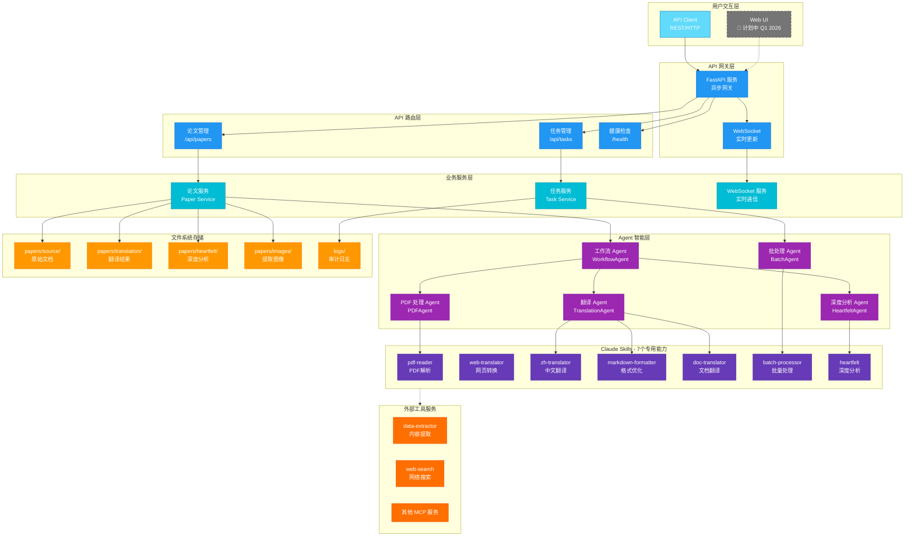

> [!NOTE]
>
> **开发状态**: 早期 MVP 阶段 · 后端优先 · [📋 查看完整路线图](docs/000-roadmap.md)
>
> 一个专注于 Agentic AI 研究的学术论文收集、翻译、理解、语义检索、应用的智能平台，为中文读者提供高质量的人工智能智能体领域技术资源与服务支持。

## 📊 当前进展

| 模块        | 完成度 | 说明                               |
| ----------- | ------ | ---------------------------------- |
| 🤖 核心后端 | 60%    | 智能体系统 90% + API 后端 95%      |
| 📚 内容建设 | 59%    | 27 篇论文收集，16 篇已翻译         |
| 🏗️ 基础设施 | 35%    | Docker 容器化完成，缺少 UI、数据库 |
| 🖥️ Web 前端 | 0%     | 计划于 Q1 2026 开发                |
| ✅ 测试覆盖 | 82%    | 针对后端代码的测试                 |

### ⚠️ 当前限制

- Web 界面尚未开发（计划 Q1 2026）
- Claude SDK 依赖问题导致 AI 功能暂不可用
- 仅支持文件存储，暂无数据库
- 无用户认证系统

## 🚀 快速开始

### 环境要求

- Python 3.12+
- Docker & Docker Compose（推荐）

### Docker Compose 部署

```bash
# 1. 克隆仓库
git clone https://github.com/ThreeFish-AI/agentic-ai-cognizes.git
cd agentic-ai-cognizes

# 2. 配置环境变量
cp .env.example .env
# 编辑 .env 文件，添加必要的 API Key

# 3. 启动服务
docker-compose up -d

# 4. 访问 API 文档
# http://localhost:8000/docs
```

### 本地开发

```bash
# 1. 安装依赖
pip install -e .

# 2. 启动 API 服务
uvicorn api.main:app --reload --host 0.0.0.0 --port 8000

# 3. 访问 API 文档
# http://localhost:8000/docs
```

## ✨ 功能特性

### ✅ 已实现

- 📚 **论文收集管理** - 系统性收集和分类 Agentic AI 领域论文
- 🔄 **基础工作流** - 自动化的论文处理流程
- 🖥️ **RESTful API** - 完整的异步 API 接口
- 🧪 **测试覆盖** - 82% 的后端测试覆盖率

### 🚧 开发中

- 🤖 **AI 驱动翻译** - 等待 Claude SDK 依赖解决
- 🔍 **检索功能** - 基于文件系统的搜索实现

### 📋 计划中

- 🌐 Web 用户界面（Q1 2026）
- 🗄️ 数据库支持（PostgreSQL）
- 🔐 用户认证系统
- 📊 高级分析功能

## 🏗️ 系统架构



**架构说明**：

- **蓝色系**：用户界面和 API 层
- **青色系**：业务服务层
- **紫色系**：Agent 智能层和 Skills 能力层
- **橙色系**：外部工具和存储层
- **灰色虚线**：计划中的组件
- 采用分层架构，职责清晰，易于扩展
- 异步优先设计，支持高并发处理
- 文件系统存储，简化部署和运维

## 📁 项目结构

```shell
agentic-ai-cognizes/
├── 📦 src/cognizes/           # Python 主包 (统一入口)
│   ├── __init__.py            # 包初始化
│   ├── engine/                # 核心引擎
│   ├── adapters/              # 适配器层
│   ├── agents/                # Agent 实现 (claude/adk)
│   ├── api/                   # FastAPI 服务
│   └── examples/              # 示例应用
├── 🌐 ui/                     # Next.js Web UI
├── 🧪 tests/                  # 测试套件
├── 📚 docs/                   # 文档
├── 🎨 assets/                 # 资源文件
│   ├── 📄 papers/             # 论文存储
│   │   ├── source/            # 原始论文
│   │   ├── translation/       # 中文翻译
│   │   └── images/            # 提取的图片
├── 🔧 scripts/                # 脚本工具
├── 📝 pyproject.toml          # Python 项目配置
├── 📝 README.md               # 项目说明
├── 📝 AGENTS.md               # Agent 实现说明
└── 📝 .gitignore              # Git 忽略文件
```

## 📚 文档

- [🗺️ 项目路线](docs/000-roadmap.md) - 项目整体开发计划和进度
- [📖 系统架构](docs/001-architecture.md) - 架构设计和技术栈
- [💻 开发指南](docs/002-development.md) - 开发环境和代码规范
- [👥 用户手册](docs/003-user-guide.md) - 安装部署和使用教程
- [🧪 测试方案](docs/004-testing.md) - 测试框架和 CI/CD
- [🚀 GitHub Actions](docs/005-github-actions.md) - 自动化工作流
- [🤖 AI Agents](docs/006-agents.md) - Claude SDK 与 Google ADK 实现方案
- [📡 API 文档](docs/007-apis.md) - RESTful API 和 WebSocket 详细文档

## 🤝 贡献指南

我们欢迎社区贡献！当前最需要的帮助：

1. **前端开发** - React/TypeScript Web UI 实现
2. **翻译工作** - 新论文的翻译和校对
3. **SDK 集成** - 帮助解决 Claude SDK 依赖问题
4. **测试** - 提高测试覆盖率
5. **文档** - 改进和完善文档

### 如何贡献

1. Fork 项目并创建功能分支
2. 遵循代码规范（见 [开发指南](docs/002-development.md)）
3. 提交 Pull Request

## 📜 许可证

本项目采用 [Apache License 2.0](LICENSE)，所有翻译内容仅供学术研究使用。

## 🔗 相关资源

- [Claude Agent SDK](https://github.com/anthropics/claude-agent-sdk-python)
- [Google Agent Development Kit](https://google.github.io/adk-docs/)
- [项目主页](https://threefish.site)

## 📞 联系我们

- 问题反馈: [GitHub Issues](https://github.com/ThreeFish-AI/agentic-ai-cognizes/issues)
- 邮箱: threefish.ai@gmail.com

---

**重要提醒**: 翻译内容仅供学术研究和教育目的使用，引用时请注明原始论文来源。
