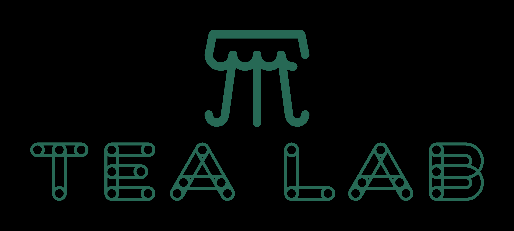

# 具有 Skills 的 Single-Agent 何时取代 Multi-Agent 及何时失效？

Xiaoxiao Li

可信与高效 AI (TEA) 实验室
英属哥伦比亚大学 | Vector 研究所 | CIFAR AI 主席
xiaoxiao.li@ece.ubc.ca

## 摘要

多智能体 AI 系统在复杂推理方面已被证明是有效的。这些系统由专业化智能体组成，通过显式通信进行协作，但会产生巨大的计算开销。一个自然的问题是：我们能否通过从技能库中选择技能的单智能体来实现类似的模块化优势？我们将技能视为内在化的智能体行为来探索这个问题。从这个角度来看，多智能体系统可以被"编译"成等效的单智能体系统，用技能选择替代智能体间的通信。我们的初步实验表明，这种方法可以在保持推理基准测试竞争性准确率的同时，显著减少 token 使用量和延迟。然而，这种效率提出了一个受到很少关注的更深层次问题：随着技能库的增长，技能选择如何扩展？借鉴认知科学的原理，我们提出 LLM 技能选择表现出与人类决策类似的有限容量。我们研究了技能选择的扩展行为，并观察到一个显著的模式。选择准确率并没有逐渐下降，而是在达到临界库大小之前保持稳定，然后急剧下降，表明存在类似人类认知容量限制的相变。此外，我们发现证据表明，相似技能之间的语义混淆性（而不仅仅是库大小）在这种退化中起着核心作用。这一观点表明，长期以来帮助人类管理复杂选择的层次组织，同样可能使 AI 系统受益。我们使用层次路由的初步结果支持这一假设。这项工作为基于语义的 LLM 技能选择的基本限制开辟了新问题，并为设计可扩展的基于技能的智能体提供了认知基础框架和实用指南。

"人类思维制定和解决复杂问题的能力，与在现实世界中实现客观理性行为所需解决的问题规模相比，是非常小的。"
— 赫伯特·A·西蒙

## 1 引言

大型语言模型 (LLM) 越来越多地作为通用问题解决器部署，依赖于模块化分解来处理复杂任务。最近的进展表明，多智能体系统 (MAS)，即专业化智能体通过显式通信进行协作，可以在具有挑战性的基准测试上显著提高推理性能 [Xia et al., 2025, Wu et al., 2025, 2024, Chen et al., 2024, Guo et al., 2024]。然而，这些系统由于重复的上下文交换、多轮协调和冗长的自然语言交互而产生巨大的计算开销 [Chen et al., 2025, Yang et al., 2025, Yue et al., 2025]。一个自然的问题是：我们能否在降低显式多智能体协调成本的同时，保留模块化推理的优势？

一个有前景的方向是使用工具替代分布式智能体协调——为单个 LLM 配备可按需调用的外部 API [Schick et al., 2023, Qin et al., 2024b, Patil et al., 2024]。虽然对于原子操作（计算器、搜索引擎、代码解释器）有效，但工具通常缺乏复杂推理子任务所需的丰富行为规范。在本工作中，我们研究技能（最近由 Anthropic 引入 [Anthropic, 2025a,b]）作为一种中间选择：技能是一种模式受限的操作，由语义描述符、明确定义的输入-输出签名和指定如何执行操作的执行策略来表征。与自动触发的工具不同，技能是根据用户请求的含义和内容选择的，因此不仅封装了"做什么"还封装了"如何推理"，使其适合于内在化那些否则需要单独智能体的专业化角色。



技能为多智能体协调提供了引人注目的替代方案。MAS 通过自然语言通信将专业化推理实例化为分布式角色，而具有技能的单智能体系统 (SAS) 将这些角色内化为统一上下文中的可选择操作。这一观点提出了编译视角：MAS 可以通过将每个智能体的行为编码为技能来转换为等效的 SAS，在保持功能能力的同时消除智能体间通信开销。

我们首先证明了这种编译既忠实又高效。在代表性推理基准测试 (GSM8K [Cobbe et al., 2021]、HumanEval [Chen et al., 2021]、HotpotQA [Yang et al., 2018]) 上，基于技能的单智能体系统实现了与其多智能体对应系统相似的准确率，同时平均减少了 54% 的 token 消耗和 50% 的延迟。这些结果确立了技能作为显式智能体分解的实用替代方案（至少在技能库保持较小时）。

然而，扩展技能组合会引入根本性挑战。随着可用技能数量的增长，模型必须从越来越大且语义上重叠的集合中选择合适的操作。这提出了一个受到很少系统关注的问题：

**技能库的大小如何影响 LLM 选择正确技能的能力？**

为了回答这个问题，我们研究了 LLM 中技能选择的扩展行为。借鉴认知科学的原理，我们假设技能选择表现出类似人类决策的有限容量扩展。我们的实验证实了这一假设。在跨越 5 到 200 个技能的控制技能库中，我们发现选择准确率呈现非线性退化，遵循相变模式：当库大小低于临界阈值时准确率保持高位，超过该容量后急剧下降。这种退化也由技能之间的语义混淆性驱动，而不仅仅是库大小。这一发现将 LLM 行为与人类记忆检索中的相似性干扰联系起来 [Shepard, 1987, Anderson, 1974]。我们进一步表明，层次路由：将技能选择分解为从粗到细的决策，可以在技能库扩展而平面选择失败时有效缓解这种退化。这反映了认知科学中关于分块 [Chase and Simon, 1973] 和菜单设计 [Miller, 1981] 的发现。

**贡献。** 本工作做出三项贡献：

1. 我们证明了基于技能的系统可以用更低的 token 使用量和延迟近似多智能体性能，并形式化了编译过程。
2. 我们表征了技能选择的非线性扩展限制，识别了容量阈值并确立了语义混淆性（而不仅仅是库大小）是退化的驱动因素。
3. 我们表明层次路由可以缓解扩展限制，为可扩展的基于技能的智能体提供了认知基础的设计原则。

我们的发现架起了智能体技能、多智能体系统、工具使用和认知科学之间的桥梁，为 LLM 动作选择提供了理论见解，为构建高效、可扩展的智能体系统提供了实用指南。

## 2 问题形式化：从多智能体系统到具有技能的单智能体

为了回答"当具有技能的单智能体取代多智能体系统"这一问题，我们形式化多智能体系统 (MAS) 和具有技能的单智能体 (SAS) 之间的关系，为研究技能选择扩展建立理论基础。我们尽可能使用简单的定义，只保留与我们的分析相关的符号。

### 2.1 多智能体系统

**定义 2.1（智能体）。** 智能体是一个元组 a = (ρ, ϕ)，其中：

- **角色描述 (ρ)：** 智能体身份和专业知识的语义规范；
- **行为策略 (ϕ)：** 指导智能体推理和响应生成的指令。

**定义 2.2（多智能体系统）。** 多智能体系统是一个元组 M = ⟨A, G, Π⟩，其中：

- **A = {a1,..., an}** 是智能体集合；
- **G = (A, E)** 是指定允许消息通道的通信图；
- **Π = (INIT, ROUTE, TERM)** 是协调协议。

**算法 1 多智能体系统执行**

```
要求：任务 x，智能体集合 A，通信图 G，协议 Π
1: 初始化历史 h ←x
2: 选择初始智能体 a(0) ←Π. INIT(A, x)
3: t ←0
4: while not Π. TERM(h) do
5:    y(t) ←a(t). EXECUTE(h) {智能体生成响应}
6:    h ←h ⊕y(t) {追加到历史}
7:    a(t+1) ←Π. ROUTE(h, a(t), G) {路由到下一个智能体}
8:    t ←t + 1
9: end while
10: return h
```

在 T 轮中解决任务 x 的协调成本为：

$$C_{MAS}(x) = \sum_{t=1}^{T} |y(t)| + T \cdot c_{sync}$$

其中 |y(t)| 表示消息长度，csync 捕获每轮的同步开销。

### 2.2 具有技能的单智能体 (SAS)

我们现在定义一种将多智能体能力内在化到单个模型中的替代范式。

**定义 2.3（技能）。** 技能是一个元组 s = (δ, π, ξ)，其中：

- **技能描述符 (δ)：** 用于技能选择的语义描述；
- **执行策略 (π)：** 指定如何执行技能的指令；
- **执行后端 (ξ ∈T ∪{∅})：** 外部工具 t ∈T，或 ∅用于内部执行（例如，提示模板）。

这种表述允许一系列实现：

- **内在化技能 (ξ = ∅)：** 执行完全在模型的推理过程中通过基于提示的调用进行。
- **外在化技能 (ξ = t)：** 模型为工具 t 生成参数，执行被委托给外部。

**注 2.1（选择与执行的分离）。** 分解为 (δ, π, ξ) 反映了一个关键见解：技能选择主要依赖于意图签名 δ，而技能执行由 π 和 ξ 管理。这种分离使我们能够将选择复杂性与执行变化隔离开来，这是对我们的扩展分析的关键区别。

**定义 2.4（具有技能的单智能体）。** 具有技能的单智能体 (SAS) 是一个元组 S = ⟨a, S, σ⟩，其中：

- **a** 是基础语言模型；
- **S = {s1,..., sk}** 是技能库；
- **σ: H × D →S** 是技能选择器，将上下文和技能描述符 D = {δ1,..., δk} 映射到技能。

注意选择器 σ 对技能操作 D 而非完整技能规范进行操作。这反映了现实约束，即选择决策基于语义描述符而非完整的程序知识。

使用技能的单智能体在 T 轮中的成本为：

$$C_{SAS}(x) = \sum_{t=1}^{T'} [C_{select}(\sigma, S) + C_{exec}(s(t))]$$

**注 2.2。** 比较算法 1 和算法 2，关键的结构差异显而易见：多智能体系统在智能体之间路由（算法 1 第 7 行），而具有技能的单智能体在技能之间选择（算法 2 第 4 行）。编译将前者转换为后者。

**算法 2 具有技能的单智能体执行**

```
要求：任务 x，技能库 S，选择器 σ
1: 初始化历史 h ←x
2: t ←0
3: while not TERM(h) do
4:    s(t) ←σ(h, D) {基于描述符选择技能}
5:    y(t) ←EXECUTE(s(t), h) {执行所选技能}
6:    h ←h ⊕y(t)
7:    t ←t + 1
8: end while
9: return h
```

### 2.3 编译问题

我们现在形式化从 MAS 到 SAS 的转换。

**定义 2.5（编译）。** 编译是一个映射 Φ: M →S，将多智能体系统转换为具有技能的单智能体。给定 M = ⟨A, G, Π⟩，编译产生 S = ⟨a, SΦ, σΦ⟩，其中每个智能体的专业化功能被蒸馏为一个或多个技能。

我们将从 MAS 到 SAS 的转换表述为**能力编译**过程。我们的编译器 Φ 必须将嵌入在智能体角色中的高层推理能力与其执行机制分离开来。我们将编译函数 Φ: GMAS →S 定义为三个不同操作的组合：分解、后端分配和拓扑内在化。MAS 到 SAS 编译算法在附录的算法 3 中给出。

#### 2.3.1 阶段 1：能力分解

对于由系统提示 ρi 定义的每个智能体 ai ∈A，我们首先应用分解函数 fdecomp 来提取一组离散的原子能力 Ki：

$$K_i = f_{decomp}(\rho_i) = \{\kappa_{i,1}, \kappa_{i,2},... \}$$

这里，能力 κ 代表一个特定的功能单元（例如，"执行代码审查"或"获取天气数据"），派生自智能体的角色描述，独立于其实现方式。

#### 2.3.2 阶段 2：后端分配

对于每个提取的能力 κ，编译器必须确定其执行后端 ξ。对应于第 2.2 节中定义的内在化技能和外在化技能，我们定义分配函数 fbackend：

$$s = (\delta, \pi, \xi)$$

其中

$$\xi = \begin{cases} t \in T & \text{if } \kappa \text{ requires external grounding (Externalized)} \\ \emptyset & \text{if } \kappa \text{ is purely cognitive (Internalized)} \end{cases}$$

这里，技能描述符 δ 被生成以对 κ 进行语义化以便检索（例如，技能名称）。

#### 2.3.3 阶段 3：拓扑内在化

拓扑内在化算子将 GMAS 中的显式通信边转换为技能定义中的隐式输入/输出约束。设 Nout(ai) = {aj | (ai, aj) ∈E} 为智能体 ai 的下游依赖集合。我们定义约束注入函数 finject：

$$\pi^final_k = f_{inject}(\pi^base_k, N_{out}(a_i))$$

在数学上，这可以建模为将约束集 C 追加到自然语言策略：

$$\pi^final_k \leftarrow \pi^base_k \oplus \left[ \bigoplus_{a_j \in N_{out}(a_i)} \text{Handover}(a_i \rightarrow a_j) \right]$$

其中 ⊕表示字符串连接或语义融合，Handover(·) 生成确保工具 tk 的输出格式与智能体 aj 中工具的预期输入兼容的指令。

#### 2.3.4 优化目标

编译的目标是生成最小化认知负荷 L(S) 的技能库 S，同时保持与原始 MAS 的功能等效性：

$$\min_\Phi L(\Phi(G_{MAS})) \quad \text{s.t. } Perf(SAS) \approx Perf(MAS)$$

其中 L 考虑了检索复杂度（选择噪声）和生成技能的上下文消耗。因此，最终的单智能体系统配备了编译后的技能库：

$$S = \bigcup_{a_i \in A} \bigcup_{t_k \in \tau_i} \{(t_k, \pi^final_k)\}$$

### 2.4 MAS 到 SAS 编译的性质

**定义 2.6（行为保真度）。** 如果保持输出分布，则编译 Φ 是行为保真的：

$$\forall \tau \in T: P_M(y | \tau) = P_{\Phi(M)}(y | \tau)$$

**定义 2.7（成本效率）。** 如果存在非平凡子集 T ′ ⊆T 使得：

$$\forall \tau \in T ′: C_{SAS}(\tau) < C_{MAS}(\tau)$$

则编译 Φ 是成本有效的。

核心权衡显而易见：编译消除了智能体间通信，但引入了选择瓶颈。形式上，效率条件简化为：

$$\sum_t C_{select}(\sigma, |S|) < \sum_t C_{comm}(G, \Pi)$$

## 3 MAS 到 SAS 编译实验

首先，我们识别可编译和不可编译的 MAS。然后，我们提出将 MAS 编译为 SAS 的可行性结果，以更低的成本实现相似的性能。

### 3.1 可编译性条件

并非所有多智能体系统都可以忠实地编译为单个具有技能的智能体。我们表征其边界。

**定义 3.1（可编译性）。** 如果存在编译 Φ: M →S 满足：

$$\forall x \in X: P_M(y | x) = P_{\Phi(M)}(y | x)$$

则多智能体系统 M 是可编译的。

**命题 3.1（可编译性条件）。** 多智能体系统是可编译的，当且仅当：

**C1. 可序列化通信：** G 拓扑可排序——智能体交互可以无损地排序。
**C2. 共享历史：** 智能体输出仅依赖于共享历史 h，没有私有状态。
**C3. 同构骨干：** 所有智能体使用相同的基础模型。

相反，当智能体需要真正的并行性（独立采样）、私有信息、对抗目标或异构能力时，编译失败。表 1 总结了常见的多智能体架构及其可编译性。

**注 3.1（范围）。** 本工作专注于可编译系统。我们研究编译何时高效——这与何时可能是一个正交的问题。

**表 1：常见多智能体架构的可编译性。**

| 架构        | 结构                          | 可编译 |
| ----------- | ----------------------------- | ------ |
| 流水线      | a1 →a2 →· · · →an             | ✓      |
| 路由-工作器 | Router →{Workers} →Aggregator | ✓      |
| 迭代精化    | Writer ↔Critic (loop)         | ✓      |
| 辩论/对抗   | Proponent ↔Opponent           | ✗      |
| 并行采样    | Independent agents, best-of-n | ✗      |
| 私有信息    | Agents with hidden state      | ✗      |

**表 2：编译实验的基准任务、MAS 架构和智能体到技能的映射。每个 MAS 被编译为等效的 SAS，在单个 LLM 调用中执行相同的计算。**

| 基准      | 架构        | MAS 智能体 | SAS 技能   | 描述             | 调用 |
| --------- | ----------- | ---------- | ---------- | ---------------- | ---- |
| GSM8K     | 流水线      | Decomposer | decompose  | 将问题分解为步骤 | 3→1  |
|           |             | Solver     | solve      | 执行计算         |      |
|           |             | Verifier   | verify     | 验证解决方案     |      |
| HumanEval | 迭代        | Coder      | code       | 生成实现         | 3→1  |
|           |             | Critic     | critique   | 审查错误         |      |
|           |             | Refiner    | refine     | 修复已识别的问题 |      |
| HotpotQA  | 路由-工作器 | Router     | analyze    | 规划信息需求     | 4→1  |
|           |             | Retriever  | retrieve   | 提取相关事实     |      |
|           |             | Reasoner   | reason     | 链接逻辑步骤     |      |
|           |             | Aggregator | synthesize | 生成最终答案     |      |

### 3.2 编译效率实验

在建立了多智能体系统可以被编译为具有技能的单智能体的条件（命题 3.1）后，我们现在从实证上研究这种编译是否高效，即编译后的 SAS 是否在降低计算成本的同时实现相当的性能。

#### 3.2.1 实验设置

在内在化和外在化技能情况下，调用哪个技能的选择仍然是内部认知决策。在本研究中，我们专注于纯内在化技能，以将动作选择的认知成本与外部执行噪声隔离开来。我们在三个基准测试上评估编译效率，每个都匹配可编译的 MAS 架构，包括 GSM8K [Cobbe et al., 2021]——研究生数学问题、HumanEval [Chen et al., 2021]——Python 代码生成任务，和 HotpotQA [Yang et al., 2018]——多跳问答。它们对应的 MAS 架构、工作流程和映射在表 2 中总结。编译后的 SAS 在单个 API 调用中执行等效计算，模型通过结构化输出部分（例如，[DECOMPOSE]、[SOLVE]、[VERIFY]）内部管理技能调用。

我们使用 GPT-4o-mini 作为所有智能体和编译后的 SAS 的骨干模型，确保在同构骨干条件 (C3) 下的公平比较。我们测量：**任务准确率**作为最终输出的正确性（GSM8K/HotpotQA 的精确匹配，HumanEval 的语法有效性）；**总 Token 数**作为所有 API 调用的提示和完成 token 之和；**延迟**作为从任务输入到最终输出的墙上时钟时间；**API 调用**作为单独 LLM 调用的数量。

#### 3.2.2 结果

表 3 展示了所有基准测试中比较 MAS 和编译后 SAS 的主要结果。

**保真编译。** 编译后的 SAS 在所有基准测试上实现了原始 MAS 准确率的 −2.0% 到 +4.0% 范围内，平均提高了 +0.7%。这证实了编译在实践中的保真性——SAS 保持（有时改善）了 MAS 性能。值得注意的是，在 HotpotQA 上，SAS 比 MAS 高出 4.0%，可能是因为统一上下文在检索和推理步骤之间实现了更好的信息集成。

**Token 效率。** 编译平均减少了 53.7% 的 token 消耗，HotpotQA (58.4%) 和 GSM8K (56.2%) 的节省最大。这种减少归因于消除了智能体调用之间的冗余上下文重复——SAS 共享单个上下文窗口，而不是为每个专业化智能体重新编码任务描述、中间结果和指令。这种效果在 HotpotQA 上最为明显，多跳推理流水线最初需要在智能体之间多次传递检索到的段落。

**延迟减少。** 端到端延迟平均减少了 49.5%，HotpotQA (60.9%) 和 HumanEval (58.9%) 的改善最为显著。主要因素是从 3-4 个顺序 API 调用减少到单个调用，消除了智能体间通信开销和网络往返延迟。GSM8K 显示了较小的延迟减少 (28.7%)，尽管有显著的 token 节省，表明数学推理计算本身（而非通信）主导了此任务的延迟。

**API 调用减少。** API 调用从 3-4 个调用 (MAS) 减少到正好 1 个调用 (SAS)。这具有直接的成本影响，因为 API 定价通常包括除 token 成本之外的每次调用开销。对于 HotpotQA，从 4 个调用减少到 1 个表示每次请求的 API 开销减少了 75%。

这些结果表明 MAS 到 SAS 编译具有模块化多智能体架构（可重用组件）的潜在好处，结合了单体单智能体执行的运行时效率。从业者可以使用直观的多智能体抽象开发和调试智能体流水线，然后编译为 SAS 以用于生产部署，而不会牺牲准确性。

编译的成功取决于三个因素：首先，智能体行为通过描述性提示成功编码为技能。模型可以遵循结构化的技能调用模式（例如，"首先分解，然后求解，最后验证"）。其次，智能体交互的顺序结构 (C1) 自然映射到单个自回归生成。模型在其上下文窗口中跨"技能调用"保持连贯状态。第三，在共享历史 (C2) 下没有信息丢失，因为 MAS 智能体可用的所有信息同样可用于 SAS。编译中没有丢失私有状态。

在此版本中，我们没有深入探索复杂化何时无法帮助，即使在命题 3.1 下。但我们观察到，当任务需要接近上下文限制的非常长输出时，编译提供的收益较小。

**表 3：编译后 MAS 和 SAS 之间的性能和效率比较。Token 和延迟减少计算为 (MAS −SAS)/MAS × 100%。正值表示 SAS 更高效。**

| 任务      | 准确率 (%) |       | 平均 Token |      | 平均延迟 (ms) |      |           | 准确率 Δ  | Token ↓   | 延迟 ↓ | API 调用 |
| --------- | ---------- | ----- | ---------- | ---- | ------------- | ---- | --------- | --------- | --------- | ------ | -------- |
|           | MAS        | SAS   | MAS        | SAS  | MAS           | SAS  |           |           |           |        |
| GSM8K     | 94.0       | 92.0  | 1407       | 616  | 10565         | 7537 | −2.0%     | 56.2%     | 28.7%     | 3→1    |
| HumanEval | 100.0      | 100.0 | 1400       | 749  | 7227          | 2970 | 0.0%      | 46.5%     | 58.9%     | 3→1    |
| HotpotQA  | 84.0       | 88.0  | 4359       | 1816 | 11671         | 4559 | +4.0%     | 58.4%     | 60.9%     | 4→1    |
| **平均**  | –          | –     | –          | –    | –             | –    | **+0.7%** | **53.7%** | **49.5%** | –      |

## 4 技能扩展假设：认知科学视角

前面的结果确立了 MAS →SAS 编译对于可编译架构既可能又高效。然而，这提出了一个关键的后续问题：随着技能库的增长，编译后的 SAS 如何扩展？等式 (9) 揭示了一个关键的依赖性：编译的可行性取决于选择成本如何随技能库大小 |S| 扩展。在上面的实验中，每个 SAS 使用 3-4 个技能——远低于有问题的阈值。当编译更大的多智能体系统（例如，具有 10+ 个专业化智能体）时，生成的技能库可能会触发选择准确率的退化。这激发了对技能选择的认知扩展的研究。

### 4.1 认知基础

我们的扩展假设借鉴了认知心理学和决策科学的既定原理。四个基础理论特别相关：

**F1：Hick 定律和决策复杂性。** Hick 定律 [Hick, 1952, Hyman, 1953] 确立了人类选择反应时间与备选数量呈对数扩展：RT = a + b · log2(n + 1)，其中 n 是等概率选项的数量。这反映了决策中的二进制细分过程。关键的是，Longstreth [1988] 证明这种关系在大约 8 个选择（~3 位）之外失效，随着细分策略失败而变得曲线化。我们假设 LLM 技能选择表现出类似的有限容量行为，准确率（而非反应时间）作为依赖度量。

**F2：认知负荷理论（工作记忆容量限制）。** Miller 的开创性"神奇数字七" [Miller, 1956] 识别了即时记忆跨度的基本限制。Sweller [1988] 和 Sweller et al. [2011] 的认知负荷理论将此扩展到复杂任务，区分内在负荷（固有的任务复杂性）和外在负荷（不必要的处理需求）。当总认知负荷超过工作记忆容量时，性能急剧下降——这是阈值效应而非逐渐衰退。我们将技能库大小 |S| 解释为对选择过程施加内在负荷，具有类似工作记忆限制的容量阈值 κ。

**F3：基于相似性的干扰。** Shepard 的泛化普遍定律 [Shepard, 1987] 确立了混淆概率随心理距离呈指数衰减：g(d) = e−d/λ。Anderson 的 ACT-R 模型 [Anderson, 1974, 1983, Anderson and Reder, 1999] 通过扇形效应提供了机制解释：当更多事实共享线索时，每个事实的关联强度减弱，因此每个事实接收的激活较少，导致检索变慢，在某些任务中，准确率降低。广义上下文模型 [Nosofsky, 1986] 形式化了分类错误如何随选项数量和选项间相似性增加。这些理论预测语义上相似的技能将在选择期间干扰，独立于总库大小。

**F4：层次处理和分块。** Chase & Simon 的分块理论 [Chase and Simon, 1973] 证明专家通过层次组织管理复杂性——国际象棋大师将棋盘位置感知为 ~7 个块而非 32 个棋子。菜单设计研究 [Miller, 1981, Lee and MacGregor, 1985] 发现每级 4-8 个项目的最佳广度，匹配工作记忆容量。Tversky 的逐方面消除模型 [Tversky, 1972] 形式化了逐步缩小选项可以使大型选择集更易于管理。

### 4.2 问题形式化

**问题 4.1（技能选择的认知扩展）。** 设 σ 为在库 S = {s1,..., sN} 上操作的技能选择器，其中每个技能 si = (δi, πi, ξi) 包括语义描述符 δ、执行策略 π 和执行后端 ξ。定义任务分布 T 的选择准确率为：

$$ACC(\sigma, S) = \mathbb{E}_{\tau \sim T} \left[ \mathbb{1}[\sigma(\tau, \{\delta_k\}_{k=1}^N) = s^*_\tau] \right]$$

其中 s\*τ 是最优技能。扩展问题研究 ACC 随 |S| →∞ 的退化，旨在将搜索空间扩展的成本与语义干扰解耦。

**为什么研究选择准确率？** 有人可能会问为什么我们关注技能选择准确率而非端到端任务性能。任务准确率混合了多个失败来源：动作选择、执行保真度和外部噪声。选择可靠性的变化可能在任务级别被掩盖，特别是在错误容忍的设置中。相反，选择准确率隔离了从扩展库中选择正确技能的内在困难。这个上游决策直接决定了下游执行是否被正确调用。虽然任务准确率回答系统是否工作，但选择准确率揭示为什么工作——以及何时失败。

### 4.3 扩展定律

基于上述认知基础，我们假设选择准确率遵循由两个因素控制的复合衰减定律：(1) 有效容量阈值 κ，类似于工作记忆限制，和 (2) 技能之间的语义干扰 I(S)：

$$ACC(\sigma, S) \approx \frac{\alpha}{1 + (|S|/\kappa)^\gamma} - \epsilon \cdot I(S)$$

其中 α ≤1 是小 |S| 时的渐近准确率，κ 是准确率下降到一半时的容量阈值，γ > 1 控制相变的锐度，ϵ > 0 表示对语义干扰的敏感性。

这种表述具有清晰的认知解释：

- 第一项捕获 Hick 定律式的容量限制。当 |S| ≪κ 时，准确率保持接近 α；当 |S| ≫κ 时，准确率以 O(|S|−γ) 衰减。在我们的模型中，指数 γ > 1 被选择来捕获一旦认知负荷超过容量时的超线性性能下降，与认知负荷理论对过载下大幅性能下降的假设一致 [Sweller et al., 2011]。
- 第二项捕获 Shepard 式的相似性干扰。即使在固定 |S| 下，技能之间的高语义重叠（大 I(S)）通过 ACT-R 扇形效应降低准确率——竞争技能共享检索线索，降低可分辨性。

加法结构反映了容量限制和相似性干扰是部分独立的失败模式：高度混淆技能的小库可能失败（高 I，低 |S|），不同技能的大库也可能失败（低 I，高 |S|）。

### 4.4 扩展假设

等式 (10) 中的表述意味着四个可测试的预测，每个都以认知理论为基础：

1. **H1：非线性相变。** 选择准确率表现出由容量阈值 κ 控制的临界状态。当 |S| < κ 时系统保持高准确率，但一旦库大小超过此阈值，就遭受急剧的非线性退化。这反映了 Hick 定律的失效 [Longstreth, 1988](F1) 和认知负荷理论中工作记忆被超过时的阈值效应 [Sweller, 1988](F2)。转变是相变式的而非渐进的：准确率相对稳定直到 |S| ≈κ，然后急剧下降。
2. **H2：混淆驱动的错误。** 选择退化主要由技能之间的语义混淆性驱动，而不仅仅是库大小。添加语义上相似的"竞争者"技能比添加相同数量的不同技能更能降低准确率。这一预测直接来自等式 (10) 中的干扰项 ϵ · I(S)，与认知科学中的基于相似性的干扰有关 [Shepard, 1987, Anderson, 1974, Nosofsky, 1986](F3)。
3. **H3：指令饱和。** 技能封装了可能消耗处理带宽的复杂微策略 π。我们测试策略复杂性是否影响选择准确率，特别是，冗长的策略是否通过增加外在认知负荷来降低有效容量 κ [Sweller, 1988](F2)。
4. **H4：通过层次缓解。** 当平面选择失败 (|S| > κ) 时，层次组织可以通过确保每个决策点涉及 |Slocal| < κ 个选项来恢复可靠扩展。这将难处理的单个决策转换为一系列可处理的子决策。如上所述，分块理论 [Chase and Simon, 1973] 和逐方面消除模型 [Tversky, 1972](F4) 确立了层次分解将压倒性的选择集转换为可管理的决策。

在以下部分中，我们实证测试每个假设。

## 5 扩展定律实验

我们设计了一系列控制实验来实证验证我们技能扩展假设的三个关键预测：(1) 选择准确率中存在非线性相变，(2) 指令复杂性对有效容量的影响，(3) 指令饱和的影响，以及 (4) 层次路由的缓解潜力。

### 5.1 实验设置

**合成技能库构建。** 为了能够对技能库属性进行精确操纵的控制实验，我们构建合成技能库而不是依赖现有基准。这种方法使我们能够系统地改变库大小 |S|，同时控制混淆因素，如语义相似性分布和策略复杂性。

我们的技能生成框架跨越 8 个领域：数学、编码、写作、分析、翻译、问答、格式化和提取。每个领域包含 5 个子类型，产生 40 个不同的技能类别。对于每个类别，我们定义 5 个具有不同特异性的技能模板，产生 200 个独特技能模板的池。每个技能 si = (δi, πi, ξi) 实例化为：

- **技能描述符 δi：** 遵循模式"[技能名称]：[能力描述]"的自然语言描述，例如，"计算总和：计算给定数字的总和"。
- **执行策略 πi：** 具有控制复杂性的执行指令（详见下文）。
- **执行后端 ξi：** 除非另有说明，否则所有实验设置为 ∅（内在化）。

**任务生成。** 对于每个技能库配置，我们通过均匀采样技能并构造明确映射到采样技能的查询来生成评估任务。任务使用特定领域的模板生成，具有随机化参数（例如，数学任务的数值、编码任务的变量名）。每个任务 τ 与基本真值技能标签 s\*τ 配对。

**相似性分布。** 为了控制技能之间的语义重叠，我们为库构建定义了三种相似性分布：

- **低（多样化）：** 技能通过轮询方式从所有 8 个领域采样，最大化语义距离。预期库内相似性较低。
- **高（相似）：** 技能从 2-3 个语义相关领域（例如，数学、分析、提取）采样。预期库内相似性较高。
- **混合：** 技能从所有领域均匀随机采样，产生包含相关和不相关技能的自然分布。

除非另有说明，实验使用混合分布来模拟现实的技能库组成。

**策略复杂性。** 为了研究执行指令冗长度的影响，我们定义了三个级别的执行策略复杂性：

- **简单（~30 token）：** 单句指令，例如，"执行计算并返回结果。"
- **中等（~100 token）：** 结构化的 3-5 步指令，包含输入验证和格式指南。
- **复杂（~300 token）：** 详细的多节协议，包括错误处理、边缘情况、输出格式要求和质量标准。

除非另有说明，实验使用简单策略以将库大小的影响与指令复杂性隔离开来。

**评估协议。** 我们在 GPT-4o-mini 和 GPT-4o 上评估技能选择性能。模型在温度 T = 0 时查询以确保确定性输出。选择提示将技能库呈现为格式化列表，并指示模型仅响应技能标识符。对于每个实验条件，我们测量等式 (4.1) 中定义的选择准确率。每个条件重复 3 次随机种子以计算标准误差。

### 5.2 H1：非线性相变

**实验设计。** 我们评估跨技能库大小 |S| ∈{5, 10, 20, 35, 50, 75, 100, 150, 200} 的选择准确率，保持相似性分布（混合）和策略复杂性（简单）不变。这隔离了搜索空间大小对选择性能的影响。

**结果。** 图 2 展示了两个评估模型的技能库大小函数的选择准确率。我们在 |S| ∈{5, 10, 20, 25, 30, 40, 50, 75, 100, 150, 200} 处评估并拟合提出的扩展定律（等式 10）。两个模型都显示出随库增加而显著准确率退化。在小规模（|S| ≤20）时，准确率保持在 90% 以上，但在 |S| = 30 之后稳步下降，在 |S| = 200 时降至约 20%。

我们观察到当 |S| 从 5 增长到约 20 时，准确率略有增加。这可能反映了改进的任务-技能覆盖：在非常小的库大小下，某些任务可能缺乏良好匹配的技能，而适度扩展在选择过载开始之前改善了覆盖。小 |S| 下的这种非单调行为不影响我们的主要发现，这些发现关注较大库大小下的容量受限状态。

衰减指数 γ > 1（分别为 1.72 和 1.56）表示超线性退化，与相变行为而非逐渐衰减一致。拟合的容量参数 κ 对于 GPT-4o-mini 为 91.8，对于 GPT-4o 为 83.5，表示准确率降至其最大值一半时的库大小（α/2 ≈0.48–0.49）。有趣的是，GPT-4o 显示的 κ 略低于 GPT-4o-mini，与更强的模型应该具有更高容量的直觉相反。我们提供两种可能的解释：(1) 这种差异可能反映了给定有限数据点的拟合方差，或 (2) 模型能力和选择容量可能部分独立；更强大的模型不一定更好地区分许多相似选项。需要跨不同模型系列的进一步实验来阐明这种关系。

我们注意到 κ 不应被解释为退化的"开始"。准确率开始最急剧下降的拐点发生得更早。对于实际应用，我们建议保持平面技能库低于此拐点，或为更大的库采用层次路由。


### 5.3 H2：混淆驱动的错误

**实验设计。** 为了将混淆性的影响与库大小隔离，我们设计了一个具有显式竞争者生成的控制实验。对于每个基础技能（例如，calculate_sum："将所有数字加在一起"），我们生成 0、1 或 2 个具有相似描述但不同底层操作的竞争者技能（例如，compute_average："计算所有值的平均值"）。通过构造确保基本真值：每个任务生成都需要特定操作（例如，"计算总和"），并且只有基础技能执行该操作。竞争者具有相似描述，但如果被选中会产生错误输出。例如，给定输入 [3, 7, 2] 和任务"计算总计"，只有 calculate_sum 返回正确答案 (12)，而 compute_average 会返回错误答案（例如，4）。因此，尽管技能描述之间存在表面级别的相似性，但从任务到基础技能的映射是明确的。

我们定义了三种混淆性条件：

- **无竞争者（ncomp = 0）：** 每个技能在语义上是不同的。总库大小 |S| = nbase。
- **低混淆性（ncomp = 1）：** 每个基础技能有一个竞争者。总 |S| = 2 × nbase。
- **高混淆性（ncomp = 2）：** 每个基础技能有两个竞争者。总 |S| = 3 × nbase。

我们变化 nbase ∈{5, 10, 15, 20} 并在 GPT-4o-mini 和 GPT-4o 上评估，每个条件 3 个随机种子。

**结果。** 图 3 展示了跨混淆性条件的选择准确率。在没有竞争者的情况下，即使 |S| = 20，选择准确率也保持在 100%。这与 H1 中在相同库大小下具有混合相似性观察到的 ~95% 准确率形成鲜明对比，证实语义重叠是主要错误来源。

每个技能仅添加一个竞争者就将准确率降低了 7-30%（低条件）。添加两个竞争者导致 17-63% 的退化（高条件），GPT-4o-mini 比 GPT-4o 显示更大的下降。在高混淆性下，GPT-4o 始终优于 GPT-4o-mini（例如，在 nbase = 10, ncomp = 2 时为 70% vs. 37%），表明模型能力对混淆性提供了部分缓解。

混淆性效应在所有测试的 nbase 值上都是一致的，表明这是一个根本性挑战而非小规模的人工产物。在相同的 |S| = 20 时，用基础-竞争者对替换唯一技能会导致 18-30% 的准确率下降。这证明语义结构决定了选择困难。

这些结果为技能库设计提供了重要的实际意义：技能描述符应强调独特特征。避免可能适用于多个技能的通用描述（例如，"处理数据" →"计算 7 天滚动平均值"）。

H1 和 H2 共同提供了对技能选择扩展的重要理解。H1 确立了准确率随库大小退化，而 H2 揭示了这种退化由语义混淆性介导。H1 中观察到的相变可能反映了从混合采样增长时可混淆技能对的积累。这解释了为什么 H2 中的无竞争者条件在 |S| = 20 时保持 100% 准确率，而 H1 的混合相似性库在此大小下显示出可测量的退化。


### 5.4 H3：指令饱和

**实验设计。** 为了测试执行策略复杂性是否影响有效容量，我们比较了在固定库大小 |S| ∈{10, 20, 50, 100, 150} 下三个策略复杂性级别（简单、中等、复杂）的选择准确率。在此实验中，完整的执行策略 πi 与描述符 δi 一起包含在选择提示中，模拟选择器必须处理详细执行指令的场景。

**结果。** 图 4 可视化了两个模型的策略复杂性与库大小之间的交互。与我们的假设相反，三个策略复杂性级别（简单、中等、复杂）在两个模型中显示出很大程度上重叠的准确率曲线。大多数库大小下的条件差异落在标准误差范围内。所有复杂性级别都遵循 H1 中观察到的相同相变模式，准确率在 |S| = 50 之后急剧下降。

复杂性效应的缺失在 GPT-4o-mini 和 GPT-4o 上都是一致的，表明这不是特定于模型的现象。结果不支持 H2。我们假设复杂的微策略会消耗"认知带宽"，有效降低容量阈值 κ。然而，实证数据显示简单和复杂策略之间没有有意义的差异。

几个因素可能解释这种零结果。首先，我们必须承认我们的策略模板虽然长度不同，但可能没有引入足够的语义复杂性来给选择机制施加压力。未来工作可以探索具有更模糊或冲突指令的策略。鉴于所使用的模板，现代 transformer 架构可能有效地从长上下文中过滤相关信息，减轻复杂策略的预期认知负荷。


### 5.5 H4：层次缓解

**实验设计。** 我们比较三种选择策略：

- **平面选择：** 直接从所有 |S| 技能中选择（基线）。
- **朴素领域层次：** 两阶段选择，阶段 1 选择领域类别，阶段 2 在该领域内选择。
- **混淆感知层次：** 两阶段选择，语义相似的技能（竞争者）被显式分组在一起。阶段 1 在不同簇之间选择；阶段 2 在相似技能的小簇内消歧。

为了适当地测试大规模层次，我们将库大小范围扩展到 H1 中识别的容量阈值之外。我们构建具有 ngroups ∈{4, 6, 8, 10, 20, 30, 40} 组的技能库，每组包含 3 个语义相似的技能（1 个基础 + 2 个竞争者），产生总库大小 |S| ∈{12, 18, 24, 30, 60, 90, 120}。每组代表不同的功能（例如，"求和"、"平均"、"电子邮件写作"），而组内的技能是近义词（例如，"计算总和"、"计算总计"、"数字求和"）。任务生成映射到每组的基础技能，确保明确的基本真值。

**结果。** 图 5 展示了所有三种方法跨库大小的选择准确率。当库大小超过容量阈值（|S| ≥60，接近 κ ≈90）时，层次路由恢复了显著准确率。对于 GPT-4o-mini，层次将准确率提高了 +37-40%（从 ~45% 到 ~83-85%）。对于 GPT-4o，改善为 +9-10%（从 ~63% 到 ~72%）。

平面选择准确率在 |S| 超过 30 后急剧下降，与 H1 中识别的相变一致。|S| = 120 时的平面选择远超 κ 运行，产生观察到的 ~45-63% 准确率。相反，层次方法在所有测试大小（高达 |S| = 120）中保持相对稳定的准确率（~72-85%）。两种层次方法表现相似，因为我们的实验设计自然地将领域边界与混淆簇对齐。在实践中，关键因素是分组技能，使第一阶段路由涉及不同的、易于区分的类别。

GPT-4o 显示比 GPT-4o-mini 更高的平面准确率（大 |S| 时为 63% vs. 45%），但从层次获得的收益也较小（+10% vs. +40%）。更强的模型通过更好的语义区分部分补偿扩展挑战。两种层次方法表现相似，因为我们的实验设计自然地将领域边界与混淆簇对齐。在实践中，关键因素是分组技能，使第一阶段路由涉及不同的、易于区分的类别。

结果支持超过容量阈值的库大小的 H3。机制可以通过 H1 和 H4 的镜头来理解。连接到 H1，当 |S| > κ 时，平面选择由于认知过载而失败。层次通过确保每个选择阶段在可靠状态下运行来起作用：阶段 1 涉及 ~10-40 个不同簇（远低于 κ），阶段 2 每个簇仅涉及 3 个技能。连接到 H2，混淆感知分组确保第一阶段的类别在语义上是不同的（低混淆性 →高准确率），而可混淆的技能在一个小的第二阶段池中一起处理（高混淆性但小 |S| →可管理）。


### 5.6 实用指南和限制讨论

基于我们的发现，我们建议在基于 LLM 的智能体中设计技能库时遵循以下指南：

**设计指南**

基于我们的发现，我们建议在基于 LLM 的智能体中设计技能库时遵循以下指南：

1. **监控库大小：** 相对于模型的容量跟踪 |S|（对于测试的 GPT 模型，κ ≈50–100）。性能超过此阈值后急剧下降。
2. **最小化混淆性：** 在添加技能之前，审计语义重叠。合并或区分相似性超过阈值的技能，而不是累积近乎重复的技能。
3. **大规模采用层次：** 对于大 |S| ≫κ，实现具有混淆感知分组的层次路由。每个阶段应涉及 < κ 个选项。
4. **投资描述符：** 由于选择依赖于描述符 (H2)，投入精力精心制作或优化独特、具体的描述。
5. **模型与任务匹配：** 更强的模型显示更高的 κ 和更好的混淆抗性。对于固有的大或可混淆技能库的应用，模型能力投资产生直接的准确率收益。
6. **考虑替代架构：** 对于大型技能库，扩展限制表明具有专业化路由器的多智能体架构可能优于单体单智能体方法。

**限制。** 我们承认几个限制。1. 合成数据：虽然实现了控制实验，但合成技能库可能无法捕获现实世界技能分布的全部复杂性。2. 仅选择评估：我们测量选择准确率而非端到端任务性能。3. 有限的模型覆盖：结果基于两个 OpenAI 模型；推广到其他架构需要进一步研究。4. 层次设计：设计缓解与扩展相关的性能退化的最佳解决方案不是本工作的重点，因此我们的层次方法相对简单；更复杂的路由机制可能产生不同的结果。

## 6 结论和未来方向

随着基于 LLM 的智能体承担越来越复杂的任务，其动作空间的设计成为首要关注点。我们的工作表明，基于技能的模块化为单体提示和昂贵的多智能体协调之间提供了有希望的中介，但这种方法具有根植于选择本身的固有扩展限制。我们的初步实验表明，这种编译可以产生显著的效率增益，同时保持任务性能——至少在技能库保持较小时。

更根本的是，我们研究了一个受到有限关注的问题：技能选择如何扩展？我们的实验揭示了非线性扩展模式，其中选择准确率在达到临界阈值之前保持稳定，然后急剧下降。我们发现证据表明，技能之间的语义混淆性在这种退化中也起着核心作用。借鉴认知心理学，我们提出 LLM 技能选择可能表现出类似人类决策的容量限制，并且层次组织可以帮助缓解这些限制。

我们承认几个可能削弱我们结论强度的限制。因此，我们承认几个值得进一步研究的未来方向：

- 更广泛的模型覆盖：将实验扩展到不同的模型系列（开源模型、不同规模、多模态模型）将阐明我们观察到的容量阈值是通用的还是特定于架构的。
- 现实世界技能库：在自然出现的技能分布（例如，从软件开发、长期规划或科学工作流程中出现）上进行评估，将测试我们发现的生态有效性。
- 端到端评估：测量选择错误如何传播到最终任务结果，将提供基于技能的系统何时是多智能体方法的可行替代方案的更完整图景。
- 自适应路由机制：探索适应任务上下文和技能库结构的学习或动态路由策略，可能比固定层次提供更好的扩展。
- 理论基础：开发正式模型来解释为什么出现容量限制，并可能连接到信息论或机制解释性视角，将加强我们观察的科学基础。

我们希望这里提出的问题和初步发现将激发对塑造 AI 智能体有效能力的认知类约束的进一步研究。

**致谢。** 本文代表正在进行的研究，我们欢迎社区的反馈、更正和建议。按照学术写作透明度的新兴规范，我们披露在准备本手稿时使用了 AI 写作助手来支持编辑和文献组织。我们仔细审查并验证了内容。作者感谢 Ruiyang Ge 博士在认知科学基础方面的宝贵讨论，并建议了将我们的发现与人类决策中的既定理论联系起来的相关文献，并感谢 Yushu Li 对本手稿早期版本的反馈。本工作部分由 NSERC 发现基金 RGPIN-2022-05316、NSERC 联盟基金 ALLRP 602633-24、Tri-Agency Canada IITP、科学和 ICT 部（No. RS-2024-00445087）、CIFAR AI 主席奖和加拿大研究主席奖学金资助。

## 参考文献

[为简洁起见省略了完整参考文献列表——包括 Anderson、Anthropic、Chase、Chen、Cobbe、Guo、Hick、Hoffmann、Hong、Hyman、Kaplan、Kim、Lee、Li、Liang、Longstreth、McKenzie、Michaud、Miller、Nosofsky、Park、Patil、Qin、Qu、Schaeffer、Schick、Shen、Shepard、Sweller、Tversky、Wang、Wei、Wu、Xia、Yang、Yao、Yue、Zhang 等人的引用]

## 附录 A 相关工作

除了第 4.1 节中关于认知科学的相关工作讨论外，我们还将我们的工作与三个研究领域的交叉点联系起来：LLM 中的工具使用、多智能体系统和扩展定律。我们的贡献的与众不同之处在于它专注于技能选择的扩展行为——尽管其在智能体系统设计中的核心地位，但这个问题受到有限的系统研究。

### A.1 LLM 中的工具使用

最近的工作通过用外部工具增强 LLM 来戏剧性地扩展其能力。Schick et al. [2023] 引入了 Toolformer，证明 LLM 可以以自我监督的方式学习使用工具（计算器、搜索引擎、翻译系统）。ReAct [Yao et al., 2023] 建立了将推理轨迹与工具使用动作交替的影响范式，能够动态决定何时调用外部能力与依赖内部知识。

随着工具生态系统的增长，工具选择的挑战变得越来越突出。Tool-LLM [Qin et al., 2024b] 扩展到超过 16,000 个真实世界 API，引入了用于工具选择的神经检索器和用于多步规划的深度优先搜索。Gorilla [Patil et al., 2024] 证明了用于 API 选择的选择器感知训练，而 HuggingGPT [Shen et al., 2023] 和 TaskMatrix.AI [Liang et al., 2024] 提出了 LLM 根据任务描述协调专业化模型的架构。综合调查 [Qin et al., 2024a, Qu et al., 2025] 将工具学习形式化为阶段：规划、选择、调用和响应生成。

我们的工作在两个关键方面与此文献不同。首先，我们区分技能和工具：工具通常是具有最小描述开销的原子外部 API，而技能是内在化能力，包含丰富的语义描述符和执行策略。这种区别很重要，因为技能在选择期间施加更大的认知负荷。其次，我们没有提出新的选择机制，而是通过建立容量阈值 (κ) 并识别混淆性为退化的主要驱动因素，来表征选择准确率的基本扩展限制。

### A.2 多智能体 LLM 系统

多智能体系统 (MAS) 已成为复杂任务解决的突出范式。AutoGen [Wu et al., 2024] 引入了具有可定制智能体交互的灵活多智能体对话框架。MetaGPT [Hong et al., 2024] 将标准化操作程序 (SOP) 编码到智能体工作流程中，证明结构化角色分配能够实现有效协调。CAMEL [Li et al., 2023] 开创了自主智能体合作的角色扮演框架，而 AgentVerse [Chen et al., 2024] 探索了具有专家招募机制的动态智能体组合。

并行的工作线专注于智能体中的技能获取和管理。Voyager [Wang et al., 2023a] 为具身智能体引入了不断增长的技能库，技能通过嵌入索引并组合检索。生成智能体 [Park et al., 2023] 建立了具有记忆、反思和规划模块的基础架构。DEPS [Wang et al., 2023b] 通过具有子目标排序的交互规划来解决技能选择。

我们的工作提供了 MAS 和单智能体基于技能系统之间的理论桥梁。我们表明某些类型的 MAS 可以被编译为具有技能库的等效单智能体系统，并表征编译何时有益于何时生成的技能库超过认知容量。这一观点揭示了层次多智能体组织不仅仅是架构选择，而是当技能库增长超过容量阈值 κ 时的必要缓解措施。

### A.3 扩展定律和涌现能力

神经扩展定律 [Kaplan et al., 2020, Hoffmann et al., 2022] 确立了模型大小、数据、计算和损失之间的幂律关系。这些发现已被扩展以理解涌现能力——在特定规模阈值处突然出现而非逐渐改进的能力 [Wei et al., 2022b]。这些相变的性质仍有争议。Schaeffer et al. [2023] 认为明显的涌现能力可能是非线性度量的人工产物而非基本行为变化。Michaud et al. [2023] 提出网络能力被"量化"为按频率递减顺序学习的离散技能，平滑的总体扩展掩盖了单个能力中的离散相变。

最近的工作记录了 U 形 [Wei et al., 2022a] 和倒 U 形扩展模式 [McKenzie et al., 2023]，其中性能在较大规模提高之前可能会下降。下游任务和智能体系统的扩展定律受到了越来越多的关注。Zhang et al. [2024] 研究了微调数据如何随模型大小扩展，而 Kim et al. [2025] 推导了智能体系统扩展的定量原则，检查了智能体数量、协调结构和任务属性之间的权衡。

与专注于模型规模的涌现能力的先前工作不同，我们研究相对于动作空间大小的扩展——智能体必须从中选择的技能数量。我们表明这种扩展由语义混淆性介导，将 LLM 行为与认知心理学的既定原理联系起来 [Hick, 1952, Shepard, 1987, Sweller, 1988]。

## 附录 B MAS 到 SAS 编译算法

**算法 3 MAS 到 SAS 编译**

```
要求：多智能体图 G = (A, E)，编译器模型 MLLM
确保：统一技能库 S
1: 初始化 S ←∅
{阶段 1：能力提取和分类}
2: for all Agent ai ∈A do
3:    Let ρi be the system prompt (role definition)
4:    Let τi be the set of explicitly assigned tools
5:    Analyze Role: Decompose ρi into a set of discrete capabilities Ci = {c1, c2,... }.
6:    for all Capability ck ∈Ci do
7:        Determine Backend:
8:        if ck aligns with a tool t ∈τi then
9:            Set ξk ←t {Externalized Skill}
10:           Generate πk: "How to use t to achieve ck under role ρi"
11:       else
12:           Set ξk ←∅{Internalized Skill}
13:           Generate πk: "Reasoning steps to perform ck"
14:       end if
15:       Generate Skill Descriptor δk (Name + Description)
16:       Store ŝk = (δk, πk, ξk, owner = ai)
17:   end for
18: end for
{阶段 2：拓扑内在化（约束）}
19: for all Skill ŝk ∈extracted skills do
20:    Let asrc = ŝk.owner
21:    Identify downstream agents: Nout = {aj | (asrc, aj) ∈E}
22:    if Nout ̸= ∅then
23:       Generate Handoff Constraint:
24:       "Output must be consumable by skills: [skills of Nout]"
25:       πk ←πk ⊕Constraint
26:   end if
27:   Add (δk, πk, ξk) to S
28: end for
29: return S
```

## 附录 C 实验细节

### C.1 技能库示例

**表 4：我们合成技能库中不同领域的示例技能。**

| 领域   | 技能名称          | 描述符                                 |
| ------ | ----------------- | -------------------------------------- |
| 数学   | 计算总和          | 将所有数字加在一起并返回总和。         |
| 数学   | 计算平均值        | 计算给定数字的算术平均值。             |
| 数学   | 计算百分比        | 计算一个数字是另一个数字的百分之几。   |
| 编码   | 编写 Python 函数  | 编写实现指定功能的 Python 函数。       |
| 编码   | 调试代码          | 查找并修复所提供代码片段中的错误。     |
| 写作   | 撰写电子邮件      | 根据给定要求撰写专业电子邮件。         |
| 写作   | 撰写摘要          | 创建所提供文本的简明摘要。             |
| 分析   | 分析情感          | 确定文本的情感基调（正面/负面/中性）。 |
| 分析   | 分析趋势          | 识别所提供数据中的模式和趋势。         |
| 提取   | 提取姓名          | 识别并提取文本中提到的所有人员姓名。   |
| 提取   | 提取日期          | 识别并提取文本中提到的所有日期。       |
| 翻译   | 翻译成西班牙语    | 将给定英语文本翻译成西班牙语。         |
| 翻译   | 翻译成法语        | 将给定英语文本翻译成法语。             |
| 问答   | 回答问题          | 对给定问题提供直接答案。               |
| 问答   | 解释概念          | 用清晰简单的术语解释给定概念。         |
| 格式化 | 转换为 JSON       | 将给定数据转换为 JSON 格式。           |
| 格式化 | 格式化为 Markdown | 将给定内容格式化为 Markdown。          |

### C.2 任务示例

**表 5：具有基本真值技能映射的示例任务。**

| 领域 | 任务查询                                                | 基本真值         |
| ---- | ------------------------------------------------------- | ---------------- |
| 数学 | 23、45 和 67 的总和是多少？                             | 计算总和         |
| 数学 | 10、20、30、40、50 的平均值是多少？                     | 计算平均值       |
| 数学 | 200 的 25% 是多少？                                     | 计算百分比       |
| 编码 | 编写一个反转字符串的 Python 函数。                      | 编写 Python 函数 |
| 编码 | 调试此代码：def add(a,b): return a-b                    | 调试代码         |
| 写作 | 给我的经理写一封请求会议的电子邮件。                    | 撰写电子邮件     |
| 写作 | 总结以下文章：[文本]                                    | 撰写摘要         |
| 分析 | "我爱这个产品！"的情感是什么？                          | 分析情感         |
| 提取 | 从以下内容中提取姓名："John 在公园遇到了 Mary。"        | 提取姓名         |
| 提取 | 从以下内容中提取日期："会议于 2024 年 1 月 15 日举行。" | 提取日期         |
| 翻译 | 翻译成西班牙语："你好，你好吗？"                        | 翻译成西班牙语   |

### C.3 竞争者技能示例

**表 6：基础技能及其语义竞争者的示例 (H2)。竞争者具有相似的功能但措辞不同。**

| 角色     | 技能描述符                               | 技能组：求和             |
| -------- | ---------------------------------------- | ------------------------ |
| 基础     | 计算总和：将所有数字加在一起并返回总计。 |                          |
| 竞争者 1 | 计算总计：通过将所有值相加来计算总计。   |                          |
| 竞争者 2 | 数字求和：将所有给定数字求和。           |                          |
|          |                                          | **技能组：电子邮件写作** |
| 基础     | 撰写电子邮件：撰写专业电子邮件。         |                          |
| 竞争者 1 | 撰写邮件：撰写电子邮件消息。             |                          |
| 竞争者 2 | 起草电子邮件：为给定目的起草电子邮件。   |                          |
|          |                                          | **技能组：情感分析**     |
| 基础     | 分析情感：确定文本的情感。               |                          |
| 竞争者 1 | 情感检测器：检测情感基调。               |                          |
| 竞争者 2 | 评估情感：评估文本情感。                 |                          |
|          |                                          | **技能组：姓名提取**     |
| 基础     | 提取姓名：从文本中提取人员姓名。         |                          |
| 竞争者 1 | 查找姓名：查找文本中的所有姓名。         |                          |
| 竞争者 2 | 姓名提取器：从内容中提取姓名。           |                          |

### C.4 策略复杂性示例


### C.5 提示模板

**平面选择提示。** 图 7 显示了所有实验中用于平面技能选择的提示模板。


**层次选择提示。** 图 8 显示了 H4 中用于层次选择的两阶段提示。


