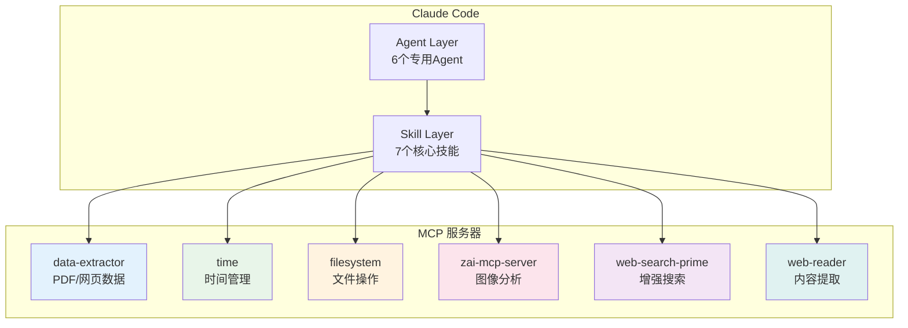
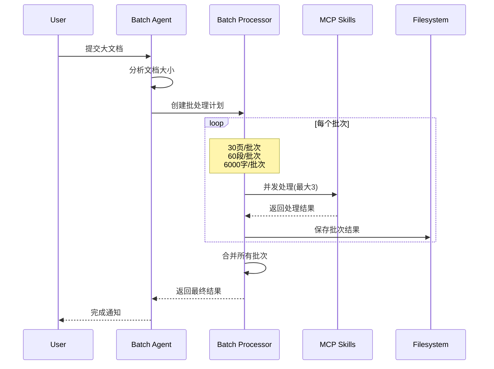
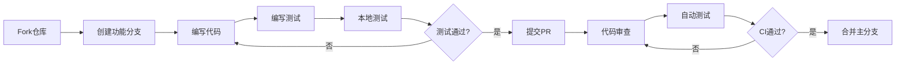
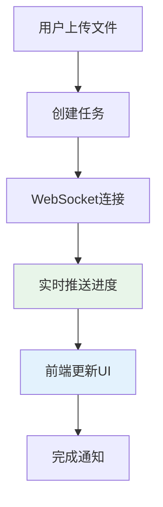

# 开发与维护手册

## 开发环境设置

### 环境要求

- Python 3.12+
- Git
- Docker & Docker Compose
- Claude API Key
- 代码编辑器（推荐 VS Code）

### 本地开发设置

```bash
# 1. 克隆仓库
git clone https://github.com/ThreeFish-AI/agentic-ai-cognizes.git
cd agentic-ai-cognizes

# 2. 创建虚拟环境
python -m venv venv
source venv/bin/activate  # Linux/Mac

# 3. 安装依赖
uv pip install -e ".[dev]"

# 4. 配置环境变量
cp .env.example .env
# 编辑 .env 添加 ANTHROPIC_API_KEY 和 ANTHROPIC_BASE_URL

# 5. 启动开发服务器
uvicorn agents.api.main:app --reload --host 0.0.0.0 --port 8000
```

### Docker 开发环境

```bash
# 启动开发环境
docker-compose up --build

# 后台运行
docker-compose up -d

# 启动包含 MCP 服务的完整环境
docker-compose --profile mcp up
```

## MCP 深度集成开发

### MCP 架构概览



### 7 大核心技能详解

| 技能名称               | 功能描述                           | 典型用例         |
| ---------------------- | ---------------------------------- | ---------------- |
| **pdf-reader**         | PDF 文档解析，支持图像、表格、公式 | 提取学术论文内容 |
| **zh-translator**      | 中文学术文档翻译，保留格式         | 论文中文化       |
| **web-translator**     | 网页内容抓取转换                   | 在线资源本地化   |
| **batch-processor**    | 批量文档处理协调                   | 大规模文档处理   |
| **markdown-formatter** | Markdown 格式优化                  | 后翻译格式整理   |
| **heartfelt**          | 深度理解分析                       | 知识提炼感悟     |
| **data-extractor**     | 结构化数据提取                     | 信息挖掘整理     |

### MCP 调用模式

```python
# 直接 MCP 工具调用示例
async def process_paper_workflow():
    # 1. 提取PDF内容
    pdf_result = await mcp__data_extractor__convert_pdf_to_markdown(
        pdf_source="/papers/source/example.pdf",
        extract_images=True,
        extract_tables=True,
        extract_formulas=True
    )

    # 2. 翻译内容
    if pdf_result.success:
        translation = await zh_translator(
            content=pdf_result.markdown_content
        )

    # 3. 保存结果
    await mcp__filesystem__write_file(
        path="/papers/translation/example.md",
        content=translation.translated_content
    )

    # 4. 深度分析
    await heartfelt(
        document_path="/papers/translation/example.md"
    )
```

### 批处理最佳实践



## 6 大专用 Agent 开发

### Agent 架构

```python
# 基础 Agent 类
from agents.claude.base import BaseAgent

class CustomAgent(BaseAgent):
    def __init__(self, config: Dict[str, Any]):
        super().__init__(config)
        self.agent_name = "custom"
        self.required_skills = ["skill1", "skill2"]

    async def process(self, input_data: Dict[str, Any]) -> Dict[str, Any]:
        # 1. 验证输入
        if not self.validate_input(input_data):
            raise ValueError("Invalid input")

        # 2. 调用技能
        result = await self.call_skill("skill1", input_data)

        # 3. 处理结果
        return self._process_result(result)
```

### 1. PDF 处理 Agent

```python
class PDFProcessingAgent(BaseAgent):
    """PDF文档处理专用Agent"""

    def __init__(self, config):
        super().__init__(config)
        self.required_skills = ["pdf-reader", "batch-processor"]

    async def process(self, pdf_path: str) -> Dict:
        # 大文件自动分批处理
        file_info = await mcp__filesystem__get_file_info(pdf_path)

        if file_info.size > 50 * 1024 * 1024:  # 50MB
            # 使用批处理
            return await self._batch_process(pdf_path)
        else:
            # 直接处理
            return await mcp__data_extractor__convert_pdf_to_markdown(
                pdf_source=pdf_path,
                extract_images=True,
                extract_tables=True
            )
```

### 2. 翻译 Agent

```python
class TranslationAgent(BaseAgent):
    """学术论文翻译专用Agent"""

    def __init__(self, config):
        super().__init__(config)
        self.terminology_cache = {}

    async def process(self, content: str, domain: str = "ai") -> Dict:
        # 1. 术语提取
        terms = await self._extract_terms(content, domain)

        # 2. 批量翻译
        result = await zh_translator(
            content=content,
            preserve_formatting=True,
            terminology=terms
        )

        # 3. 术语一致性检查
        await self._check_terminology_consistency(result)

        return result
```

### 3. 批处理 Agent

```python
class BatchProcessingAgent(BaseAgent):
    """批量处理协调Agent"""

    async def process_batch(self, documents: List[str]) -> Dict:
        # 创建批处理任务
        batches = self._create_batches(documents)

        # 并发执行
        semaphore = asyncio.Semaphore(3)  # 最大并发数
        tasks = [
            self._process_with_limit(batch, semaphore)
            for batch in batches
        ]

        results = await asyncio.gather(*tasks, return_exceptions=True)

        # 合并结果
        return self._merge_results(results)
```

## API 开发模式

### FastAPI 应用结构

```python
# agents/api/main.py
from fastapi import FastAPI
from fastapi.middleware.gzip import GZipMiddleware

app = FastAPI(
    title="Agentic AI Papers API",
    version="2.0.0"
)

# 性能优化中间件
app.add_middleware(GZipMiddleware, minimum_size=1000)
```

### 路由定义示例

```python
# agents/api/routes/papers.py
from fastapi import APIRouter, UploadFile, BackgroundTasks
from agents.api.services.paper_service import PaperService

router = APIRouter(prefix="/api/papers", tags=["papers"])

@router.post("/upload")
async def upload_paper(
    file: UploadFile,
    background_tasks: BackgroundTasks,
    service: PaperService = Depends()
):
    # 异步处理大文件
    task_id = await service.create_processing_task(file)

    # 后台执行
    background_tasks.add_task(
        service.process_paper,
        task_id,
        file.file_path
    )

    return {"task_id": task_id, "status": "processing"}
```

### WebSocket 实时进度

```python
@router.websocket("/ws/progress/{task_id}")
async def progress_ws(websocket: WebSocket, task_id: str):
    await websocket.accept()

    async for progress in service.stream_progress(task_id):
        await websocket.send_json({
            "task_id": task_id,
            "progress": progress.current,
            "total": progress.total,
            "status": progress.status
        })
```

## 性能优化策略

### 批处理优化

```python
# 批处理配置
BATCH_LIMITS = {
    "max_pages": 30,      # PDF页数/批次
    "max_paragraphs": 60, # 段落数/批次
    "max_words": 6000,    # 字数/批次
    "max_concurrent": 3   # 最大并发批次
}

class BatchProcessor:
    def __init__(self, limits=BATCH_LIMITS):
        self.limits = limits
        self.semaphore = asyncio.Semaphore(limits["max_concurrent"])

    async def process_document(self, doc_path: str):
        # 1. 分析文档
        doc_info = await self._analyze_document(doc_path)

        # 2. 计算批次
        batches = self._calculate_batches(doc_info)

        # 3. 并发处理
        results = []
        for batch in batches:
            async with self.semaphore:
                result = await self._process_batch(batch)
                results.append(result)

        # 4. 合并结果
        return self._merge_results(results)
```

### 内存管理

```python
# 流式处理大文件
async def stream_process_large_file(file_path: str):
    chunk_size = 1024 * 1024  # 1MB chunks

    async with aiofiles.open(file_path, 'rb') as f:
        while chunk := await f.read(chunk_size):
            # 处理数据块
            await process_chunk(chunk)

            # 及时释放
            del chunk
            gc.collect()
```

### 缓存策略

```python
from functools import lru_cache
import diskcache as dc

# 多级缓存
cache = dc.Cache("./cache")

@lru_cache(maxsize=128)
async def get_cached_translation(key: str):
    # L1: 内存缓存
    if cached := cache.get(key):
        return cached

    # L2: 磁盘缓存
    result = await translate(key)
    cache.set(key, result, expire=3600)

    return result
```

## 测试策略

### 测试结构

```
tests/
├── unit/          # 单元测试
├── integration/   # 集成测试
├── e2e/          # 端到端测试
├── fixtures/     # 测试数据
└── conftest.py   # 测试配置
```

### MCP 技能测试

```python
@pytest.mark.asyncio
async def test_pdf_processing():
    # 测试PDF提取
    result = await mcp__data_extractor__convert_pdf_to_markdown(
        pdf_source="tests/fixtures/sample.pdf"
    )

    assert result.success
    assert "markdown_content" in result
    assert len(result.markdown_content) > 0
```

### Agent 集成测试

```python
@pytest.mark.asyncio
async def test_translation_workflow():
    agent = TranslationAgent(test_config)

    # 模拟处理流程
    result = await agent.process({
        "content": "Sample AI paper content...",
        "source_lang": "en",
        "target_lang": "zh"
    })

    assert result["success"]
    assert "translated_content" in result
```

## Docker 最佳实践

### Dockerfile 优化

```dockerfile
# 多阶段构建
FROM python:3.12-slim as builder
WORKDIR /app
COPY requirements.txt .
RUN pip install --no-cache-dir -r requirements.txt

FROM python:3.12-slim
WORKDIR /app
COPY --from=builder /usr/local/lib/python3.12/site-packages .
COPY . .

# 健康检查
HEALTHCHECK --interval=30s --timeout=10s --start-period=60s \
    CMD curl -f http://localhost:8000/health || exit 1
```

### Docker Compose 配置

```yaml
version: "3.8"
services:
  api:
    build: .
    environment:
      - ANTHROPIC_API_KEY=${ANTHROPIC_API_KEY}
      - ANTHROPIC_BASE_URL=${ANTHROPIC_BASE_URL}
    volumes:
      - ./papers:/app/papers
      - ./cache:/app/cache

  mcp-data-extractor:
    image: mcp-data-extractor:latest
    profiles: ["mcp"]

  # 开发环境热重载
  dev:
    build:
      context: .
      dockerfile: Dockerfile.dev
    volumes:
      - .:/app
      - /app/__pycache__
    command: uvicorn --reload agents.api.main:app
```

## 安全考虑

### API 安全

```python
# 输入验证
from pydantic import BaseModel, validator

class PaperUploadRequest(BaseModel):
    title: str
    content: str

    @validator('content')
    def validate_content(cls, v):
        if len(v) > 10 * 1024 * 1024:  # 10MB limit
            raise ValueError('Content too large')
        return v
```

### 敏感信息保护

```python
# API密钥管理
class SecureConfig:
    def __init__(self):
        self.api_key = self._decrypt(
            os.environ.get("ENCRYPTED_API_KEY")
        )

    def _decrypt(self, encrypted: str) -> str:
        # 使用Fernet解密
        key = os.environ.get("MASTER_KEY").encode()
        cipher = Fernet(key)
        return cipher.decrypt(encrypted.encode()).decode()
```

## 贡献指南

### 开发流程



### 提交规范

```bash
# 使用Conventional Commits
feat(agent): 添加新的翻译Agent
fix(api): 修复WebSocket连接问题
docs(readme): 更新安装说明
perf(batch): 优化批处理性能
```

## 性能监控

### 关键指标

- **API 响应时间**: 目标 < 1 秒
- **批处理吞吐量**: 目标 > 100 页/分钟
- **内存使用**: 稳定在 2GB 以内
- **错误率**: 目标 < 1%

### 监控实现

```python
# Prometheus指标
from prometheus_client import Counter, Histogram

REQUEST_COUNT = Counter('api_requests_total', 'Total API requests')
REQUEST_DURATION = Histogram('api_request_duration_seconds', 'Request duration')

@app.middleware("http")
async def monitor_requests(request, call_next):
    start_time = time.time()

    response = await call_next(request)

    REQUEST_COUNT.inc()
    REQUEST_DURATION.observe(time.time() - start_time)

    return response
```

## 故障排查

### 常见问题

1. **MCP 服务不可用**

   ```bash
   # 检查MCP服务状态
   docker ps | grep mcp
   # 重启服务
   docker-compose restart mcp-data-extractor
   ```

2. **批处理内存溢出**

   ```python
   # 减小批次大小
   BATCH_LIMITS["max_pages"] = 20
   BATCH_LIMITS["max_words"] = 4000
   ```

3. **翻译质量不一致**
   ```python
   # 启用术语缓存
   agent = TranslationAgent({
       "use_terminology_cache": True,
       "domain": "computer_science"
   })
   ```

### 日志配置

```python
# 结构化日志
import structlog

logger = structlog.get_logger()

logger.info(
    "Processing document",
    document_id=doc_id,
    batch_id=batch_id,
    progress=0.5
)
```

## Web UI 开发前瞻

### 技术栈建议

- **前端框架**: React + TypeScript
- **状态管理**: Zustand
- **UI 组件**: Ant Design
- **实时通信**: WebSocket
- **构建工具**: Vite

### API 集成规范

```typescript
// API客户端示例
class PapersAPI {
  private ws: WebSocket;

  async uploadPaper(file: File): Promise<TaskId> {
    const formData = new FormData();
    formData.append("file", file);

    const response = await fetch("/api/papers/upload", {
      method: "POST",
      body: formData,
    });

    return response.json();
  }

  subscribeToProgress(taskId: TaskId, callback: Callback) {
    this.ws = new WebSocket(`/ws/progress/${taskId}`);
    this.ws.onmessage = (event) => {
      callback(JSON.parse(event.data));
    };
  }
}
```

### 实时进度展示



## Web UI 开发指引

### 1. API 集成

```javascript
// next.config.js
/** @type {import('next').NextConfig} */
const nextConfig = {
  async rewrites() {
    return [
      {
        source: "/api/:path*",
        destination: "http://localhost:8000/api/:path*",
      },
      {
        source: "/ws/:path*",
        destination: "http://localhost:8000/ws/:path*",
      },
    ];
  },
  images: {
    domains: ["localhost"],
  },
};

module.exports = nextConfig;
```

### 2. API 客户端设计

```typescript
// src/lib/api.ts
import axios from "axios";

const apiClient = axios.create({
  baseURL: process.env.NEXT_PUBLIC_API_BASE_URL || "http://localhost:8000",
  timeout: 30000,
});

// 请求拦截器
apiClient.interceptors.request.use(
  (config) => {
    // 添加认证头（预留）
    // config.headers.Authorization = `Bearer ${token}`
    return config;
  },
  (error) => Promise.reject(error)
);

// 响应拦截器
apiClient.interceptors.response.use(
  (response) => response.data,
  (error) => {
    // 统一错误处理
    const message = error.response?.data?.detail || error.message;
    return Promise.reject(new Error(message));
  }
);

export const api = {
  // 论文相关
  papers: {
    list: (params?: any) => apiClient.get("/api/papers", { params }),
    get: (id: string) => apiClient.get(`/api/papers/${id}`),
    upload: (formData: FormData) =>
      apiClient.post("/api/papers", formData, {
        headers: { "Content-Type": "multipart/form-data" },
      }),
    process: (id: string, workflow: string, options?: any) =>
      apiClient.post(`/api/papers/${id}/process`, { workflow, options }),
    delete: (id: string) => apiClient.delete(`/api/papers/${id}`),
  },

  // 任务相关
  tasks: {
    list: (params?: any) => apiClient.get("/api/tasks", { params }),
    get: (id: string) => apiClient.get(`/api/tasks/${id}`),
    cancel: (id: string) => apiClient.post(`/api/tasks/${id}/cancel`),
    logs: (id: string) => apiClient.get(`/api/tasks/${id}/logs`),
  },
};
```

### 3. 状态管理 (Zustand)

```typescript
// src/store/index.ts
import { create } from "zustand";
import { devtools } from "zustand/middleware";

interface AppState {
  // 论文状态
  papers: Paper[];
  currentPaper: Paper | null;
  papersLoading: boolean;
  papersError: string | null;

  // 任务状态
  tasks: Task[];
  currentTask: Task | null;
  taskUpdates: Map<string, TaskUpdate>;

  // UI 状态
  sidebarOpen: boolean;
  theme: "light" | "dark";
  notifications: Notification[];

  // Actions
  fetchPapers: () => Promise<void>;
  uploadPaper: (file: File) => Promise<string>;
  processPaper: (id: string, workflow: string) => Promise<void>;
  subscribeToTask: (taskId: string) => void;
  unsubscribeFromTask: (taskId: string) => void;
}

export const useAppStore = create<AppState>()(
  devtools((set, get) => ({
    // Initial state
    papers: [],
    currentPaper: null,
    papersLoading: false,
    papersError: null,

    tasks: [],
    currentTask: null,
    taskUpdates: new Map(),

    sidebarOpen: true,
    theme: "light",
    notifications: [],

    // Actions
    fetchPapers: async () => {
      set({ papersLoading: true, papersError: null });
      try {
        const papers = await api.papers.list();
        set({ papers, papersLoading: false });
      } catch (error) {
        set({ papersError: error.message, papersLoading: false });
      }
    },

    uploadPaper: async (file: File) => {
      const formData = new FormData();
      formData.append("file", file);
      const response = await api.papers.upload(formData);
      return response.task_id;
    },

    processPaper: async (id: string, workflow: string) => {
      const task = await api.papers.process(id, workflow);
      set((state) => ({
        tasks: [task, ...state.tasks],
      }));
      return task;
    },

    subscribeToTask: (taskId: string) => {
      // WebSocket 订阅逻辑
    },

    unsubscribeFromTask: (taskId: string) => {
      // WebSocket 取消订阅
    },
  }))
);
```

### 4. NextAdmin 组件集成示例

#### 论文列表组件

```typescript
// src/components/papers/PaperList.tsx
import { Table } from "@/components/ui/table";
import { Button } from "@/components/ui/button";
import { Badge } from "@/components/ui/badge";
import { Card } from "@/components/ui/card";

export function PaperList({ papers }: { papers: Paper[] }) {
  return (
    <Card>
      <Table>
        <Table.Header>
          <Table.Row>
            <Table.Head>标题</Table.Head>
            <Table.Head>作者</Table.Head>
            <Table.Head>状态</Table.Head>
            <Table.Head>上传时间</Table.Head>
            <Table.Head>操作</Table.Head>
          </Table.Row>
        </Table.Header>
        <Table.Body>
          {papers.map((paper) => (
            <Table.Row key={paper.id}>
              <Table.Cell className="font-medium">{paper.title}</Table.Cell>
              <Table.Cell>{paper.authors.join(", ")}</Table.Cell>
              <Table.Cell>
                <Badge
                  variant={
                    paper.status === "translated" ? "success" : "warning"
                  }
                >
                  {paper.status}
                </Badge>
              </Table.Cell>
              <Table.Cell>
                {new Date(paper.uploadedAt).toLocaleDateString()}
              </Table.Cell>
              <Table.Cell>
                <Button variant="outline" size="sm" asChild>
                  <Link href={`/papers/${paper.id}`}>查看</Link>
                </Button>
              </Table.Cell>
            </Table.Row>
          ))}
        </Table.Body>
      </Table>
    </Card>
  );
}
```

#### 任务进度组件

```typescript
// src/components/tasks/TaskProgress.tsx
import { Progress } from "@/components/ui/progress";
import { Card } from "@/components/ui/card";
import { Badge } from "@/components/ui/badge";

export function TaskProgress({ task }: { task: Task }) {
  const progress = task.progress || 0;

  return (
    <Card>
      <div className="p-4">
        <div className="flex justify-between items-center mb-2">
          <h3 className="font-semibold">{task.title}</h3>
          <Badge variant={task.status === "completed" ? "success" : "info"}>
            {task.status}
          </Badge>
        </div>
        <Progress value={progress} className="mb-2" />
        <p className="text-sm text-muted-foreground">
          {task.message || "处理中..."}
        </p>
      </div>
    </Card>
  );
}
```

#### 仪表板统计卡片

```typescript
// src/components/dashboard/StatsCard.tsx
import { Card } from "@/components/ui/card";
import { ApexChart } from "react-apexcharts";

export function StatsCard({ title, value, change, icon }: StatsCardProps) {
  return (
    <Card>
      <div className="p-6">
        <div className="flex items-center justify-between">
          <div>
            <p className="text-sm font-medium text-muted-foreground">{title}</p>
            <p className="text-2xl font-bold">{value}</p>
            {change && (
              <p
                className={`text-sm ${
                  change > 0 ? "text-green-600" : "text-red-600"
                }`}
              >
                {change > 0 ? "+" : ""}
                {change}%
              </p>
            )}
          </div>
          <div className="text-2xl text-muted-foreground">{icon}</div>
        </div>
      </div>
    </Card>
  );
}
```

#### 搜索表单组件

```typescript
// src/components/search/SearchForm.tsx
import { Input } from "@/components/ui/input";
import { Button } from "@/components/ui/button";
import { Select } from "@/components/ui/select";
import { Card } from "@/components/ui/card";

export function SearchForm() {
  return (
    <Card>
      <div className="p-4">
        <div className="grid grid-cols-1 md:grid-cols-4 gap-4">
          <Input placeholder="搜索论文标题或作者..." />
          <Select placeholder="选择分类">
            <option value="llm">LLM Agents</option>
            <option value="context">Context Engineering</option>
            <option value="reasoning">Reasoning</option>
          </Select>
          <Select placeholder="状态">
            <option value="all">全部</option>
            <option value="translated">已翻译</option>
            <option value="pending">待翻译</option>
          </Select>
          <Button>搜索</Button>
        </div>
      </div>
    </Card>
  );
}
```

### 5. WebSocket 集成

```typescript
// src/hooks/useWebSocket.ts
import { useEffect, useRef, useState } from "react";
import { useAppStore } from "@/store";

export const useWebSocket = (url: string) => {
  const wsRef = useRef<WebSocket | null>(null);
  const [isConnected, setIsConnected] = useState(false);
  const [error, setError] = useState<string | null>(null);
  const { subscribeToTask, unsubscribeFromTask } = useAppStore();

  const connect = () => {
    try {
      const ws = new WebSocket(url);
      wsRef.current = ws;

      ws.onopen = () => {
        setIsConnected(true);
        setError(null);
        console.log("WebSocket connected");
      };

      ws.onmessage = (event) => {
        try {
          const data = JSON.parse(event.data);
          if (data.type === "task_update") {
            // 更新任务状态
            subscribeToTask(data.task_id, data);
          }
        } catch (err) {
          console.error("Failed to parse WebSocket message:", err);
        }
      };

      ws.onclose = () => {
        setIsConnected(false);
        console.log("WebSocket disconnected");
        // 自动重连
        setTimeout(connect, 3000);
      };

      ws.onerror = (event) => {
        setError("WebSocket connection error");
        console.error("WebSocket error:", event);
      };
    } catch (err) {
      setError("Failed to create WebSocket connection");
    }
  };

  const disconnect = () => {
    if (wsRef.current) {
      wsRef.current.close();
      wsRef.current = null;
    }
  };

  const subscribe = (taskId: string) => {
    if (wsRef.current && isConnected) {
      wsRef.current.send(
        JSON.stringify({
          type: "subscribe",
          task_id: taskId,
        })
      );
    }
  };

  const unsubscribe = (taskId: string) => {
    if (wsRef.current && isConnected) {
      wsRef.current.send(
        JSON.stringify({
          type: "unsubscribe",
          task_id: taskId,
        })
      );
    }
  };

  useEffect(() => {
    connect();
    return () => disconnect();
  }, [url]);

  return { isConnected, error, subscribe, unsubscribe };
};
```

### 5. 环境配置

```bash
# .env.local
NEXT_PUBLIC_API_BASE_URL=http://localhost:8000
NEXT_PUBLIC_WS_URL=ws://localhost:8000/ws
NEXT_PUBLIC_MAX_FILE_SIZE=52428800  # 50MB
NEXT_PUBLIC_SUPPORTED_FORMATS=pdf
NEXT_PUBLIC_APP_NAME=Agentic AI 论文平台
NEXT_PUBLIC_APP_VERSION=1.0.0
```

## 关键实现文件

### 已存在的核心文件

1. **`src/app/layout.tsx`** - 根布局（已集成 NextAdmin 主题系统）
2. **`src/components/layout/`** - 布局组件（侧边栏、头部等）
3. **`src/components/ui/`** - NextAdmin 基础 UI 组件库
4. **`src/components/Auth/`** - 认证相关组件（已实现）
5. **`tailwind.config.js`** - Tailwind CSS 配置（已优化）

### 待实现的关键文件

1. **`src/lib/api.ts`** - API 客户端，统一处理后端通信
2. **`src/components/papers/PaperViewer.tsx`** - 核心论文内容查看组件
3. **`src/hooks/useWebSocket.ts`** - WebSocket 管理钩子，实现实时通信
4. **`src/store/index.ts`** - 全局状态管理，使用 Zustand
5. **`src/app/papers/page.tsx`** - 论文列表页面
6. **`src/app/tasks/page.tsx`** - 任务监控页面

## 性能优化策略

### 1. 代码优化

- **动态导入**: 对大型组件使用 `React.lazy()`
- **Tree Shaking**: 确保未使用代码被移除
- **Bundle 分析**: 使用 `@next/bundle-analyzer`

### 2. 运行时优化

- **图片优化**: 使用 Next.js Image 组件
- **缓存策略**: SWR 缓存 API 响应
- **虚拟滚动**: 大列表性能优化

### 3. 用户体验

- **加载状态**: 骨架屏和加载指示器
- **错误边界**: 优雅的错误处理
- **离线支持**: Service Worker（未来扩展）

## 注意事项

### 1. 安全考虑

- XSS 防护（使用 React 内置保护）
- CSRF 保护（API 请求）
- 文件上传验证（类型、大小）

### 2. 国际化准备

- 使用 `next-intl` 支持中英文切换
- 日期和数字格式本地化
- 文本外部化管理

### 3. 未来扩展

- 预留认证接口（JWT/OAuth）
- 设计插件系统架构
- PWA 功能支持
- 移动端适配优化

## 相关资源

### 官方文档

- **[Next.js 16 官方文档](https://nextjs.org/docs)** - App Router、Server Components、配置指南
- **[NextAdmin 官方文档](https://nextadmin.co/docs)** - 组件库使用、主题定制、最佳实践
- **[Zustand 状态管理](https://github.com/pmndrs/zustand)** - 状态管理、中间件、TypeScript 支持
- **[SWR 数据获取](https://swr.vercel.app)** - 数据获取、缓存、错误处理
- **[Tailwind CSS](https://tailwindcss.com/docs)** - 样式系统、响应式设计、自定义配置

### 额外资源

- **[React 19 文档](https://react.dev/)** - 最新特性和最佳实践
- **[ApexCharts](https://apexcharts.com/docs/)** - 图表配置和自定义（已集成）
- **[TypeScript](https://www.typescriptlang.org/docs/)** - 类型系统和配置

## 发布流程

### 版本管理

使用语义化版本 (SemVer)：

- **主版本**: 不兼容的 API 修改
- **次版本**: 向下兼容的新功能
- **修订号**: 向下兼容的问题修正

### 自动发布

```yaml
# .github/workflows/release.yml
name: Release
on:
  push:
    tags:
      - "v*"

jobs:
  release:
    runs-on: ubuntu-latest
    steps:
      - uses: actions/create-release@v1
        env:
          GITHUB_TOKEN: ${{ secrets.GITHUB_TOKEN }}
        with:
          tag_name: ${{ github.ref }}
          release_name: Release ${{ github.ref }}
```

---

_最后更新: 2025-12-14_
_版本: 2.0.0_
