> [!IMPORTANT] **立意**：Agentic AI 学术研究与工程应用方案定制

---

## 1. 产品愿景

### 1.1 核心定位

**一个专注于 Agentic AI 学术研究与工程应用方案定制的智能平台**，通过 Agents 协作，构建一个 **认知增强的学术研究与解决方案架构助手**，为中文读者提供高质量的内容与资料收集、翻译、理解、语义检索与应用定制服务 [1]。

- **内容采集**：自动化收集、解析 Agentic AI 领域前沿学术与理论研究（Papers）、主流技术工程实践（Industrial Products）
- **深度翻译**：保持学术术语准确性的高质量中英互译
- **语义理解**：基于 GraphRAG 的内容关联分析与知识图谱构建
- **智能检索**：混合检索（关键词 + 向量 + 图谱）支持多跳推理
- **应用研究**：内容综述与趋势分析、技术选型参考、认知增强与可视化、认知应用方案定制

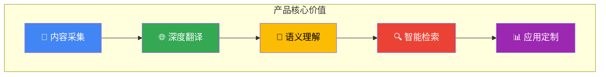

### 1.2 差异化价值

| 传统方案       | 本平台方案                   |
| -------------- | ---------------------------- |
| 孤立的文档翻译 | 跨内容知识图谱关联 [2]       |
| 单一向量检索   | GraphRAG 多跳推理检索 [3]    |
| 人工整理分类   | Agent 自动化处理与元数据抽取 |
| 静态翻译结果   | 实时任务监控与增量更新       |
| 无记忆能力     | Cognee 认知记忆层 [4]        |

### 1.3 设计理念

基于**认知增强**与 **Context Engineering** 理论 [5][15]，本平台采用以下核心设计理念：

1. **Agentic RAG 架构**：将传统 RAG 被动检索转变为 Agent 驱动的主动推理，实现 Adaptive + Corrective + Self-RAG 组合 [6]
2. **图谱增强记忆**：利用知识图谱解决 LLM 的"孤立上下文"问题，构建确定性知识结构 [7]
3. **多 Agent 协作**：借鉴 BettaFish 论坛协作机制，通过"论坛辩论"模式避免单模型思维局限和交流同质化 [8]
4. **三位一体存储**：基于 OceanBase 实现 TP/AP/Vector 统一存储，消除 ETL 同步延迟 [9]
5. **分层上下文管理**：采用短期/长期记忆分层架构，系统性管理 Agent 运行上下文 [15]

---

## 2. 用户画像与场景

### 2.1 目标用户

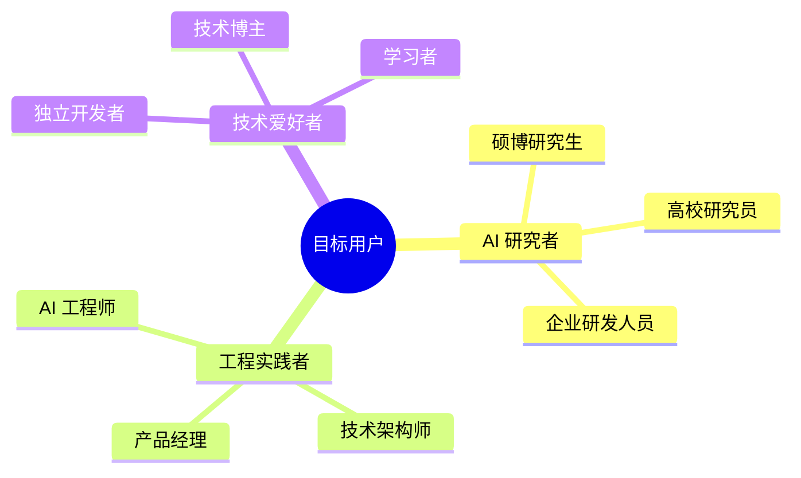

### 2.2 用户画像

| 角色           | 核心需求                     | 痛点                   | 期望价值             |
| -------------- | ---------------------------- | ---------------------- | -------------------- |
| **AI 研究者**  | 跟踪前沿、理解原理、发现关联 | 英文阅读门槛、内容孤立 | 高质量翻译、知识图谱 |
| **工程实践者** | 技术选型、方案设计、落地参考 | 理论到实践鸿沟         | 工程指引、代码示例   |
| **技术爱好者** | 学习入门、理解概念           | 内容碎片化             | 体系化知识、学习路径 |

### 2.3 核心使用场景

**场景 1：内容检索与阅读**

```
用户提问："有哪些论文研究了 Chain-of-Thought 和 ReAct 的结合应用？"
系统响应：
  1. 向量检索 → 语义相关论文
  2. 图谱检索 → 方法论关联论文
  3. 多跳推理 → 发现间接关联
  4. 生成回答 → 综述 + 引用链接
```

**场景 2：内容翻译与理解**

```
用户上传：新发布的 Agentic AI 相关资料（论文 PDF / 技术博客 URL / GitHub 仓库）
系统处理：
  1. Reader Agent → 提取内容与结构
  2. Translation Agent → 高质量翻译（保留术语）
  3. Heartfelt Agent → 深度分析与要点提炼
  4. Cognee → 更新知识图谱，建立关联
```

**场景 3：技术方案咨询**

```
用户提问："我需要为客服系统设计一个多 Agent 架构，有什么参考？"
系统响应：
  1. 检索相关内容（论文、文档、代码仓库）
  2. 图谱查询架构模式关联
  3. 结合 BettaFish 论坛协作机制
  4. 参考其他经典 Agents 模式
  5. 输出可落地的架构方案
```

---

## 3. 功能需求

### 3.1 功能概览

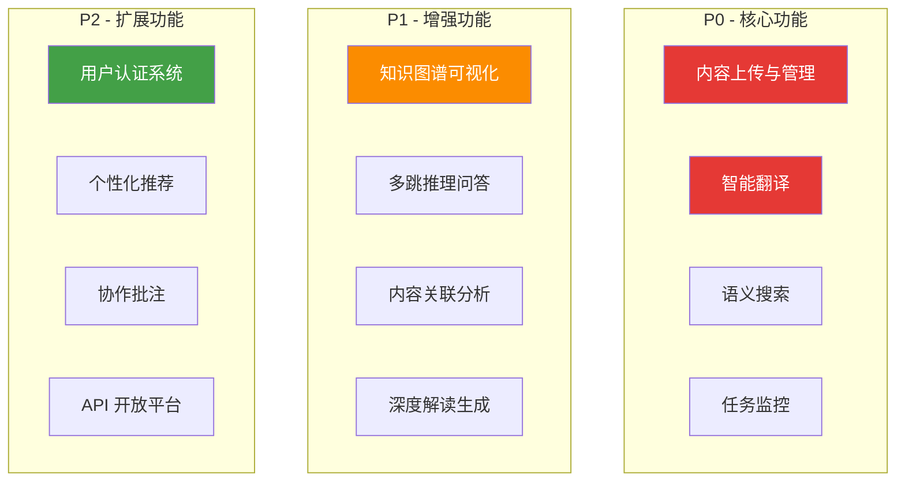

### 3.2 核心功能

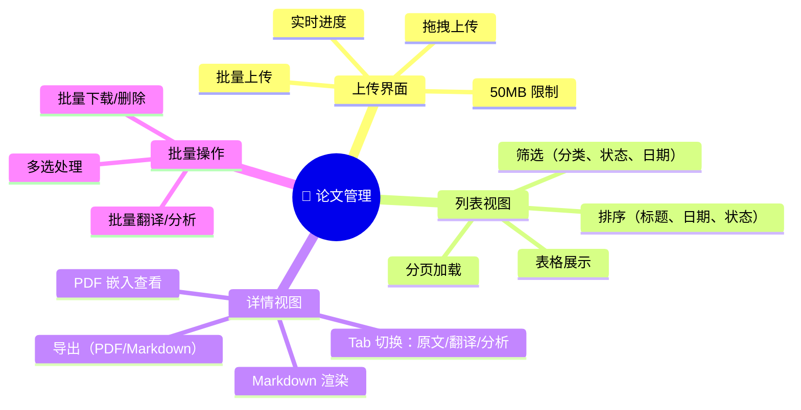

---

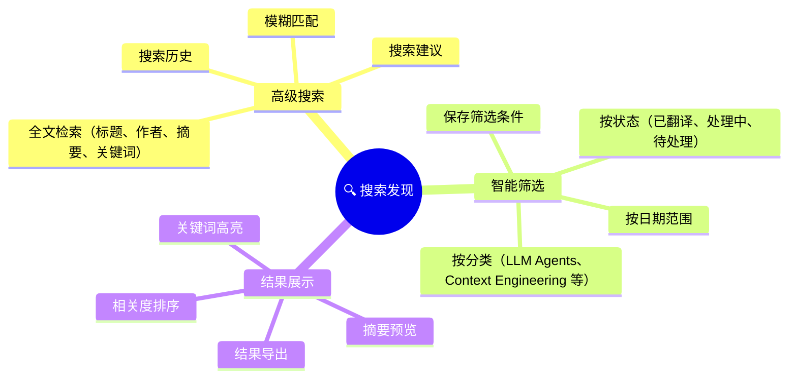

---

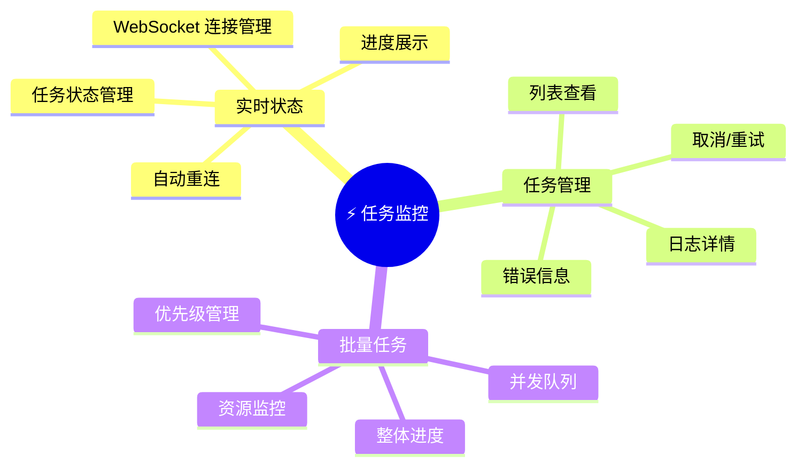

---

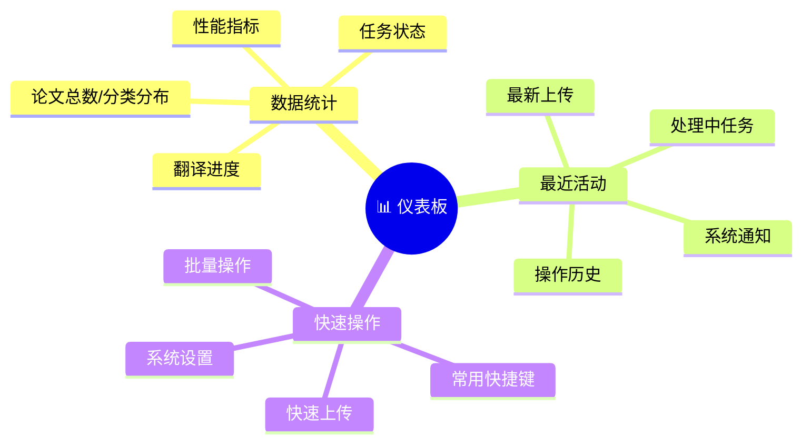

### 3.3 P0 核心功能

#### 3.3.1 内容上传与管理

| 功能点     | 描述                              | 验收标准             |
| ---------- | --------------------------------- | -------------------- |
| 拖拽上传   | 支持 PDF/Markdown/URL 格式        | 50MB 限制，实时进度  |
| 批量上传   | 多文件同时上传                    | 队列管理，并发控制   |
| 元数据提取 | 自动识别标题、作者、摘要          | 准确率 > 90%         |
| 分类管理   | 按主题分类（LLM Agents / RAG 等） | 支持自定义标签       |
| 状态追踪   | 处理状态可视化                    | 待处理/处理中/已完成 |

#### 3.3.2 智能翻译

| 功能点       | 描述                   | 验收标准          |
| ------------ | ---------------------- | ----------------- |
| 学术术语保留 | 专业术语中英对照       | 关键术语不翻译    |
| 结构保持     | 保留原文标题、段落结构 | Markdown 格式输出 |
| 增量翻译     | 支持部分翻译、继续翻译 | 断点续传          |
| 质量评估     | 翻译质量自动评估       | BLEU/人工评分     |

#### 3.3.3 语义搜索

| 功能点   | 描述                   | 验收标准        |
| -------- | ---------------------- | --------------- |
| 全文检索 | 标题、摘要、内容搜索   | 响应 < 500ms    |
| 向量检索 | 语义相似度匹配         | Top-K 召回      |
| 混合检索 | 关键词 + 向量融合      | RRF 重排序 [10] |
| 筛选过滤 | 按分类、日期、状态筛选 | 组合条件        |

#### 3.3.4 任务监控

| 功能点    | 描述                   | 验收标准   |
| --------- | ---------------------- | ---------- |
| 实时状态  | WebSocket 推送任务进度 | 延迟 < 1s  |
| 任务列表  | 查看所有任务状态       | 分页、筛选 |
| 取消/重试 | 任务控制操作           | 即时响应   |
| 日志查看  | 详细处理日志           | 错误定位   |

### 3.4 P1 增强功能

#### 3.4.1 知识图谱可视化

基于 Neo4j 知识图谱构建内容关联网络 [11]：

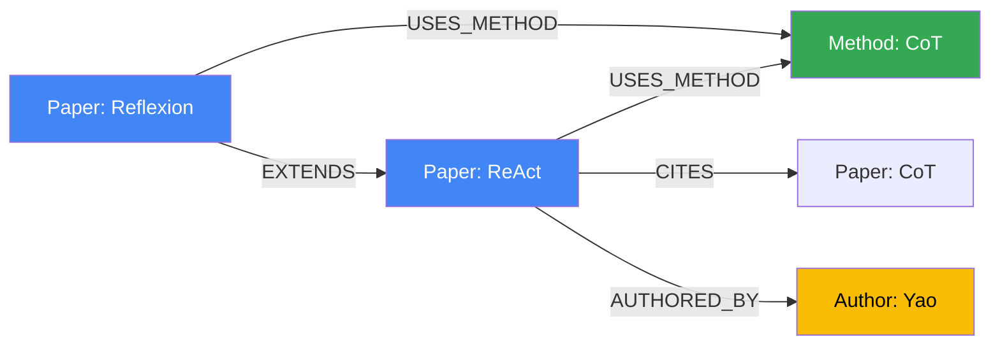

#### 3.4.2 多跳推理问答

基于 Agentic RAG 实现复杂问题推理 [6]：

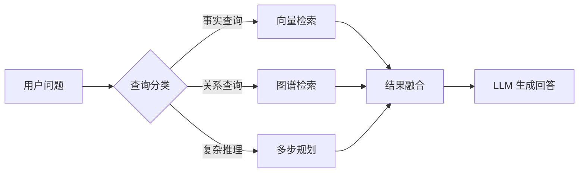

### 3.5 P2 扩展功能

| 功能       | 描述               | 优先级理由 |
| ---------- | ------------------ | ---------- |
| 用户认证   | 注册登录、收藏管理 | 个性化前提 |
| 个性化推荐 | 基于历史行为推荐   | 提升粘性   |
| 协作批注   | 多人协作翻译、评审 | 生态建设   |
| API 平台   | 开放能力给第三方   | 生态扩展   |

---

## 4. Agent 体系

### 4.1 双框架战略

基于调研结论 [12]，采用双框架战略平衡开发效率与生产稳定性：

| 框架           | 适用场景           | 核心优势                 |
| -------------- | ------------------ | ------------------------ |
| **Claude SDK** | 原型开发、定制需求 | 灵活、Agent Skills 生态  |
| **Google ADK** | 生产环境、批量处理 | 高性能、Multi-Agent 编排 |

### 4.2 Agents 协作架构

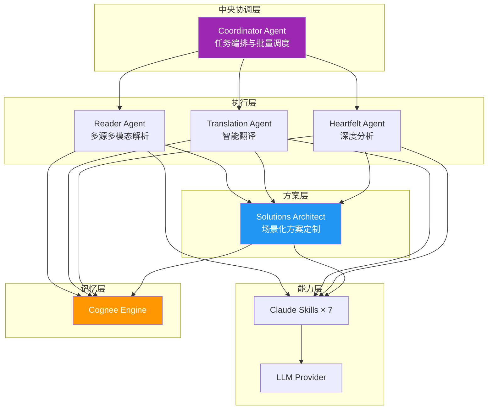

基于 **ReAct 框架**（Reasoning + Acting）设计，每个 Agent 交织推理与行动：

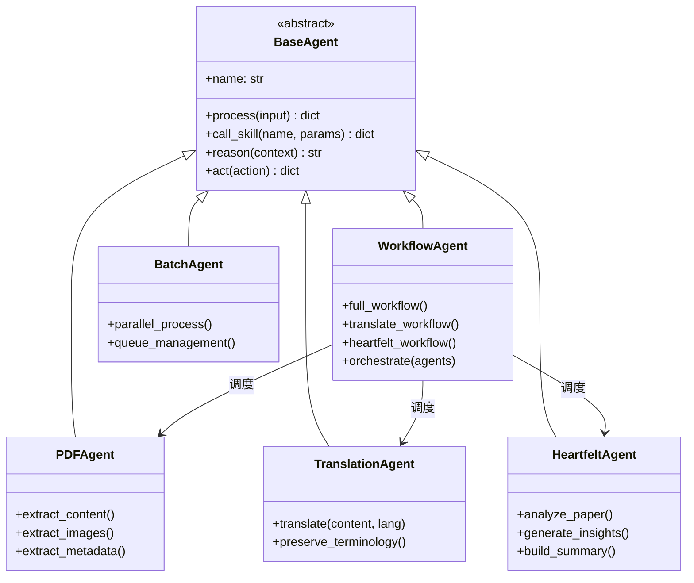

### 4.3 Agent 职责定义

| Agent                   | 职责                     | 核心能力                                                 | 设计模式             |
| ----------------------- | ------------------------ | -------------------------------------------------------- | -------------------- |
| **Coordinator Agent**   | 中央协调与任务编排       | 流程控制、状态管理、批量并行处理、队列管理               | Orchestrator [13]    |
| **Reader Agent**        | 多源多模态内容解析       | PDF/URL/Word/PPT/Excel 解析、图片/音视频处理、元数据提取 | Tool Use             |
| **Translation Agent**   | 高质量学术翻译           | 术语保留、结构保持                                       | Prompt Chaining      |
| **Heartfelt Agent**     | 深度分析与洞察生成       | 内容综述、要点提炼                                       | CoT + Reflection     |
| **Solutions Architect** | 场景化方案定制与架构设计 | 应用方案输出、解决方案设计、技术选型建议、方案质量评估   | Planning + Synthesis |

### 4.4 Reader Agent 多源多模态能力

Reader Agent 是内容采集的核心组件，支持广泛的数据源和模态：

| 类型         | 支持格式                                                      | 说明           |
| ------------ | ------------------------------------------------------------- | -------------- |
| **文档格式** | PDF, Markdown, Word (.docx), PPT (.pptx), Excel (.xlsx), Text | 结构化内容提取 |
| **网络资源** | URL (Web Page), arXiv, GitHub                                 | 自动抓取与解析 |
| **多模态**   | 文本, 图片 (PNG/JPG), 音频 (MP3/WAV), 视频 (MP4)              | LLM 多模态理解 |

### 4.5 Solutions Architect 场景化方案定制

Solutions Architect 是平台的核心差异化能力，负责将调研分析结果转化为可落地的工程方案：

| 能力维度         | 说明                                                      |
| ---------------- | --------------------------------------------------------- |
| **应用场景理解** | 分析用户的业务场景、技术约束、团队能力                    |
| **方案设计**     | 基于调研分析成果，输出架构设计、技术选型、实施路径        |
| **最佳实践整合** | 结合 BettaFish、Cognee 等框架，提供经过验证的工程模式 [8] |
| **定制化输出**   | 根据用户需求，生成定制的 PRD、技术文档、代码骨架          |
| **方案评估**     | 评估方案的质量、可行性、成本效益                          |

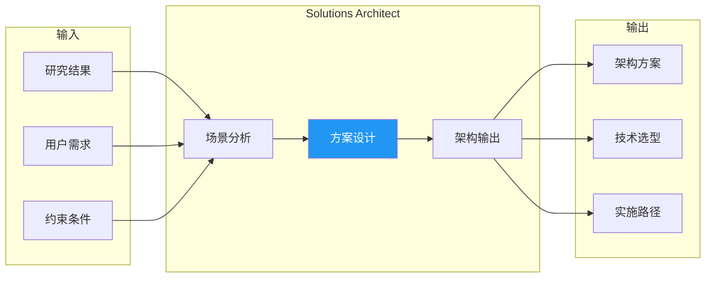

### 4.6 论坛协作机制

借鉴 BettaFish 创新设计 [8]，引入 Agent 论坛协作机制：

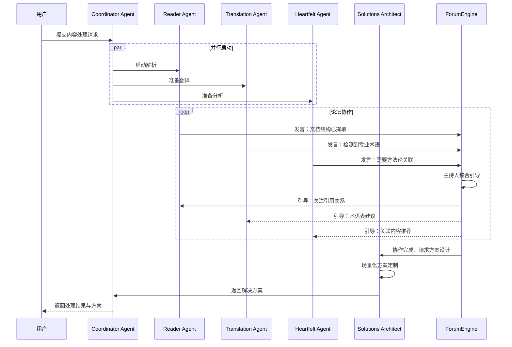

---

## 5. 认知增强体系

### 5.1 理论基础

本平台认知增强体系基于以下核心理论 [5][15]：

| 理论                    | 核心思想                    | 应用模块       |
| ----------------------- | --------------------------- | -------------- |
| **GraphRAG**            | LLM 构建知识图谱 + 社区检测 | 内容关联分析   |
| **Agentic RAG**         | Agent 驱动的自适应检索      | 智能问答       |
| **Memory Pattern**      | 短期/长期记忆分层           | Cognee 认知层  |
| **Context Engineering** | 系统性上下文管理            | 检索与生成     |
| **ReAct Framework**     | 推理与行动交织              | Agent 决策循环 |
| **Reflection**          | 自我评估与修正              | 生成质量保障   |

### 5.2 Cognee 记忆层

基于 **Cognee** 框架，为 Agent 提供认知记忆层：

- **长期记忆**：跨会话持久化，避免上下文遗忘
- **语义记忆**：知识图谱存储实体关系
- **情景记忆**：保留处理历史和决策轨迹

基于 Cognee 框架 [4] 构建认知记忆层：

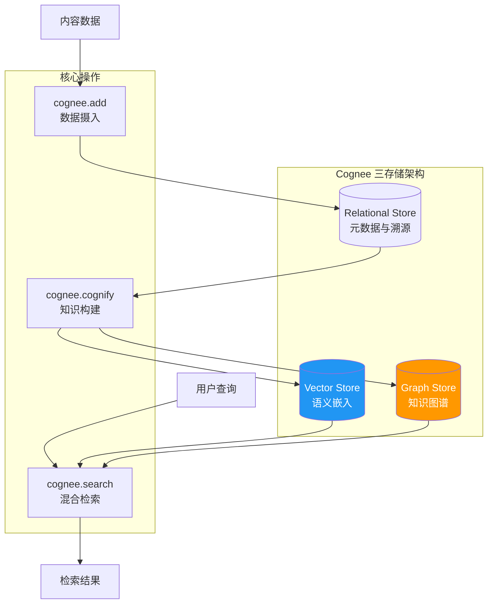

### 5.3 知识图谱设计

#### 节点类型

基于 Reader Agent 支持的多源多模态能力 [4]，知识图谱采用分层实体设计：

**内容来源类（Source 基类及其特化）**：

| 节点       | 属性                                            | 说明             |
| ---------- | ----------------------------------------------- | ---------------- |
| `Source`   | id, title, source_type, format, url, created_at | 内容来源基类     |
| `Paper`    | id, title, abstract, year, arxiv_id, venue, doi | 学术论文（特化） |
| `Article`  | id, title, summary, publish_date, platform      | 技术文章（特化） |
| `Document` | id, title, doc_type, version, organization      | 技术文档（特化） |
| `CodeRepo` | id, name, description, language, stars, url     | 代码仓库（特化） |

**知识实体类**：

| 节点        | 属性                             | 说明     |
| ----------- | -------------------------------- | -------- |
| `Author`    | name, affiliation, email         | 作者     |
| `Concept`   | name, definition, category       | 核心概念 |
| `Method`    | name, description, type          | 方法论   |
| `Dataset`   | name, size, domain               | 数据集   |
| `Framework` | name, version, url, license      | 技术框架 |
| `Tool`      | name, description, category, url | 工具     |

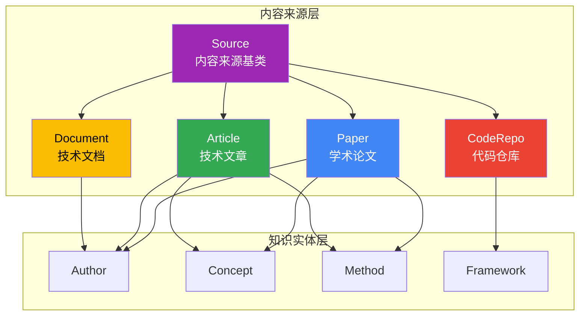

#### 关系类型

| 关系           | 起点     | 终点      | 属性    | 说明         |
| -------------- | -------- | --------- | ------- | ------------ |
| `AUTHORED_BY`  | Source   | Author    | order   | 作者关系     |
| `CITES`        | Paper    | Paper     | context | 论文引用     |
| `REFERENCES`   | Source   | Source    | type    | 通用引用关系 |
| `USES_METHOD`  | Source   | Method    | -       | 使用方法论   |
| `INTRODUCES`   | Source   | Concept   | -       | 引入概念     |
| `EXTENDS`      | Method   | Method    | -       | 方法扩展     |
| `EVALUATED_ON` | Paper    | Dataset   | metrics | 评估数据集   |
| `IMPLEMENTS`   | CodeRepo | Framework | -       | 实现框架     |
| `BASED_ON`     | Source   | Paper     | -       | 基于论文     |
| `RELATED_TO`   | Source   | Source    | score   | 相关性关联   |

### 5.4 混合检索策略

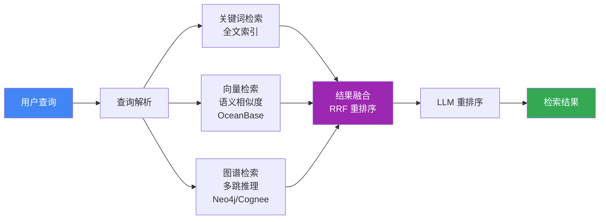

### 5.5 Agentic RAG 实现

基于调研结论 [6]，实现 Adaptive + Corrective + Self-RAG 组合，覆盖 RAG 2.0 全部核心能力：

| 模式               | 核心能力       | 实现方式                             |
| ------------------ | -------------- | ------------------------------------ |
| **Adaptive RAG**   | 自适应检索策略 | 智能路由器动态选择向量/图谱/Web 检索 |
| **Corrective RAG** | 纠错检索       | 相关性评估器 + Web 搜索补救          |
| **Self-RAG**       | 自反思生成     | 生成后评估，需修正时回退重生         |
| **Multi-Step**     | 多步推理       | LangGraph 状态机编排复杂检索任务     |

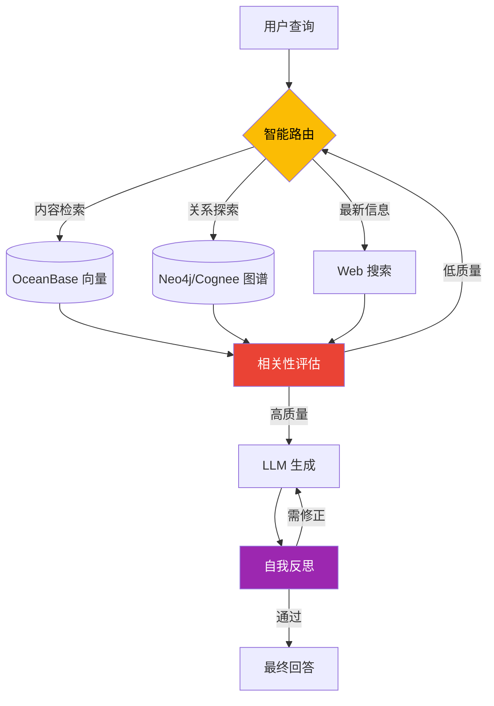

---

## 6. 数据架构

### 6.1 存储选型

基于调研结论 [9][11]，采用以下存储技术：

| 存储类型     | 技术选型        | 用途               | 核心优势            |
| ------------ | --------------- | ------------------ | ------------------- |
| **向量存储** | OceanBase V4.5+ | 语义检索           | 三位一体、HTAP 能力 |
| **图存储**   | Neo4j / Cognee  | 知识图谱           | 成熟生态、AI 集成   |
| **关系存储** | OceanBase       | 元数据、用户数据   | 金融级事务          |
| **文件存储** | 文件系统        | 原始文档、翻译结果 | 简化部署            |

### 6.2 OceanBase 数据模型

```sql
-- 内容元数据表 (TP 场景) - 对应知识图谱 Source 基类
CREATE TABLE sources (
    id BIGINT PRIMARY KEY AUTO_INCREMENT,
    source_type ENUM('paper', 'article', 'document', 'code_repo') NOT NULL,
    title VARCHAR(500) NOT NULL,
    abstract TEXT,
    authors JSON,
    url VARCHAR(1000),
    format VARCHAR(50),                    -- pdf, md, docx, pptx, xlsx, url, etc.
    publication_date DATE,
    category VARCHAR(100),
    status ENUM('pending', 'processing', 'translated', 'analyzed'),
    metadata JSON,                         -- 特化类型的扩展属性
    created_at TIMESTAMP DEFAULT CURRENT_TIMESTAMP,
    updated_at TIMESTAMP DEFAULT CURRENT_TIMESTAMP ON UPDATE CURRENT_TIMESTAMP,
    INDEX idx_source_type (source_type),
    INDEX idx_category (category),
    INDEX idx_status (status)
);

-- 内容向量表 (Vector DB 场景)
CREATE TABLE source_embeddings (
    id BIGINT PRIMARY KEY AUTO_INCREMENT,
    source_id BIGINT NOT NULL,
    chunk_index INT DEFAULT 0,
    chunk_text TEXT,
    embedding VECTOR(1536),
    FOREIGN KEY (source_id) REFERENCES sources(id)
);

-- 创建 HNSW 向量索引
CREATE INDEX idx_source_embedding_hnsw
ON source_embeddings USING HNSW (embedding vector_cosine_ops)
WITH (m = 16, ef_construction = 128);
```

### 6.3 Neo4j 知识图谱 Schema

```cypher
// 创建约束 - Source 基类及特化类型
CREATE CONSTRAINT source_id_unique FOR (s:Source) REQUIRE s.id IS UNIQUE
CREATE CONSTRAINT paper_id_unique FOR (p:Paper) REQUIRE p.id IS UNIQUE
CREATE CONSTRAINT article_id_unique FOR (a:Article) REQUIRE a.id IS UNIQUE
CREATE CONSTRAINT document_id_unique FOR (d:Document) REQUIRE d.id IS UNIQUE
CREATE CONSTRAINT code_repo_id_unique FOR (c:CodeRepo) REQUIRE c.id IS UNIQUE
CREATE CONSTRAINT author_name_unique FOR (a:Author) REQUIRE a.name IS UNIQUE

// 创建向量索引 - Source 级别通用语义检索
CREATE VECTOR INDEX source_embedding FOR (s:Source) ON (s.embedding)
OPTIONS {
  indexConfig: {
    `vector.dimensions`: 1536,
    `vector.similarity_function`: 'cosine'
  }
}

// 示例查询 1：查找使用相似方法的论文
MATCH (p1:Paper)-[:USES_METHOD]->(m:Method)<-[:USES_METHOD]-(p2:Paper)
WHERE p1.title = "ReAct"
RETURN p2.title, m.name

// 示例查询 2：跨内容类型查找相关资源
MATCH (s1:Source)-[:RELATED_TO]->(s2:Source)
WHERE s1.title CONTAINS "Agent"
RETURN s2.title, labels(s2) AS source_type
```

---

## 7. 技术架构

### 7.1 设计原则

| 原则           | 说明                                      |
| -------------- | ----------------------------------------- |
| **异步优先**   | 全链路异步处理，支持高并发论文处理        |
| **Agent 自治** | 每个 Agent 专注单一职责，通过编排层协作   |
| **记忆增强**   | Cognee 提供跨会话长期记忆，避免上下文遗忘 |
| **混合检索**   | 关键词 + 向量 + 图谱三路融合，RRF 重排序  |
| **可观测性**   | 任务实时监控，WebSocket 推送进度          |
| **渐进增强**   | 文件系统起步，逐步引入向量库和图数据库    |

### 7.2 整体架构

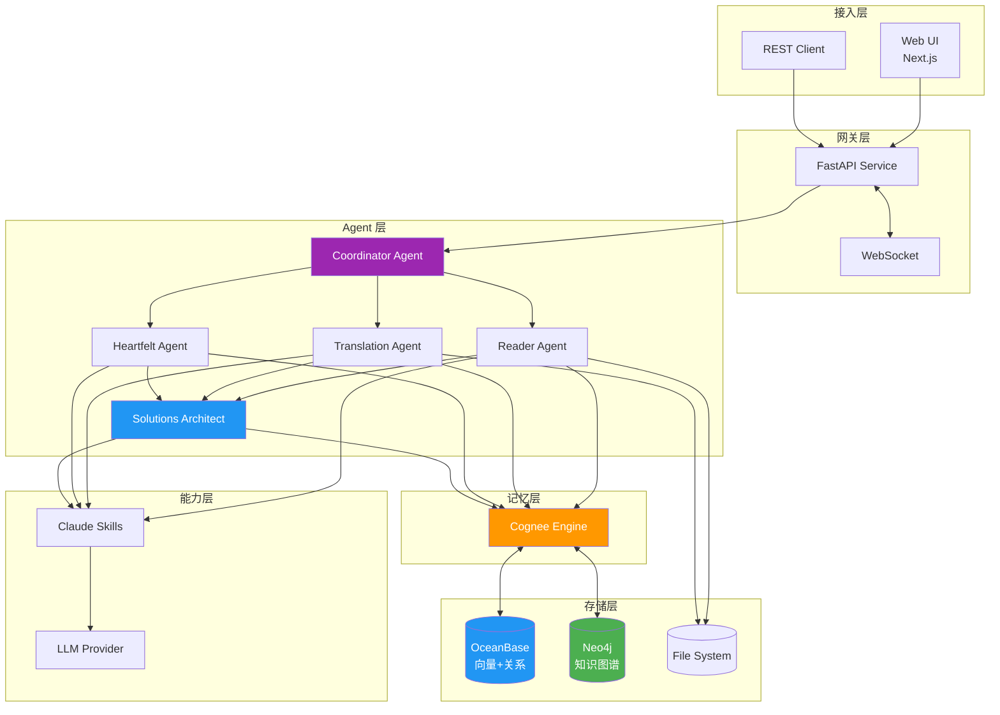

### 7.2.1 数据流图

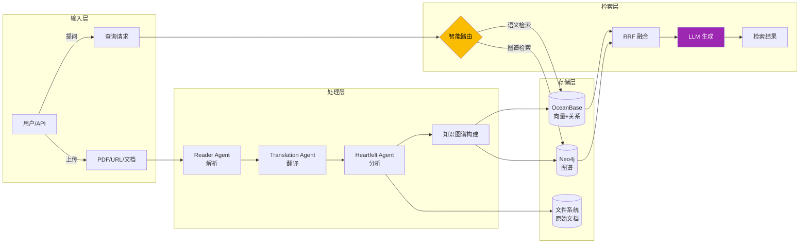

### 7.3 技术栈

| 层级      | 技术选型                     | 版本/说明    |
| --------- | ---------------------------- | ------------ |
| **前端**  | Next.js (App Router)         | 16.x         |
|           | Zustand + immer              | 状态管理     |
|           | TailwindCSS                  | 样式框架     |
| **后端**  | FastAPI + asyncio            | Python 3.14  |
|           | Pydantic                     | 数据验证     |
| **Agent** | Google ADK                   | 生产部署     |
|           | Claude Agent SDK             | 原型开发     |
|           | Claude Skills (Fallback)     | 7 个专用能力 |
| **记忆**  | Cognee                       | 认知记忆层   |
| **存储**  | OceanBase V4.5+              | 向量+关系    |
|           | Neo4j                        | 知识图谱     |
| **测试**  | Pytest + Vitest + Playwright | 82% 覆盖率   |
| **CI/CD** | GitHub Actions               | 自动化       |

### 7.4 目录结构

```shell
agentic-ai-cognizes/
├── cognizes/                   # 后端
│   ├── main.py                 # 应用入口
│   ├── api/                    # FastAPI 服务
│   │   ├── routes/             # API 路由
│   │   └── services/           # 业务服务
├── ├── agents/                 # Agents 核心
│   │   ├── adk/                # ADK Agent 实现
│   │   └── claude/             # Claude Agent 实现
│   └── core/                   # 核心组件
│       ├── models/             # Pydantic 模型
│       ├── config.py           # 配置管理
│       ├── memory.py           # Cognee 集成
│       └── exceptions.py       # 异常定义
├── ui/                         # 前端
│   └── src/
│       ├── app/                # App Router 页面
│       │   ├── papers/         # 论文管理
│       │   ├── tasks/          # 任务监控
│       │   └── search/         # 搜索页面
│       ├── components/         # React 组件
│       ├── hooks/              # useApi, useWebSocket
│       ├── store/              # Zustand Stores
│       └── lib/api.ts          # API 客户端
├── assets/                     # 资源文件
│   ├── source/                 # 原始文档
│   ├── translation/            # 翻译结果
│   └── heartfelt/              # 深度分析
├── tests/                      # 测试套件
├── docs/                       # 文档
└── .claude/skills/             # 7 个 Claude Skills
```

---

## 8. 质量保障

### 8.1 评估指标体系

基于 RAGAS 框架 [14] 建立检索与生成质量评估体系：

| 指标                  | 说明                       | 目标值 |
| --------------------- | -------------------------- | ------ |
| **Faithfulness**      | 生成内容与检索上下文一致性 | > 85%  |
| **Answer Relevancy**  | 答案与问题相关性           | > 90%  |
| **Context Precision** | 检索上下文信噪比           | > 80%  |
| **Context Recall**    | 相关信息召回率             | > 85%  |

### 8.2 技术指标

| 指标         | 当前 | 目标    |
| ------------ | ---- | ------- |
| 测试覆盖率   | 82%  | > 90%   |
| API 响应时间 | -    | < 500ms |
| 向量检索延迟 | -    | < 100ms |
| 翻译准确率   | -    | > 95%   |

---

## 9. 参考文献

| 序号 | 参考源                       | 来源                                                                                  | 核心思想                       | 本项目应用模块         |
| ---- | ---------------------------- | ------------------------------------------------------------------------------------- | ------------------------------ | ---------------------- |
| [1]  | 项目架构文档                 | [docs/001-architecture.md](./001-architecture.md)                                     | 项目整体架构与代码结构         | 全局                   |
| [2]  | Microsoft GraphRAG 论文      | [From Local to Global](https://arxiv.org/abs/2404.16130)                              | LLM 构建知识图谱 + 图机器学习  | 内容关联分析、多跳检索 |
| [3]  | 认知增强调研 - GraphRAG 原理 | [docs/research/000-cognitive-enhancement.md](./research/000-cognitive-enhancement.md) | 图谱增强检索生成               | 智能检索体系           |
| [4]  | Cognee 深度调研              | [docs/research/003-cognee.md](./research/003-cognee.md)                               | AI 记忆层 + 三存储架构         | 认知记忆层             |
| [5]  | 认知增强调研报告             | [docs/research/000-cognitive-enhancement.md](./research/000-cognitive-enhancement.md) | 理论基础与框架对比             | 整体设计参考           |
| [6]  | Agentic RAG 理论             | 认知增强调研 §2.4                                                                     | 主动推理、自适应检索、多步方案 | 智能问答、复杂检索     |
| [7]  | 知识图谱在 AI 中的应用       | 认知增强调研 §2.1.4                                                                   | 减少幻觉 40-60%、可解释决策    | 内容关联分析           |
| [8]  | BettaFish 深度调研           | [docs/research/006-bettafish.md](./research/006-bettafish.md)                         | 论坛协作机制、多 Agent 辩论    | Agent 协作设计         |
| [9]  | OceanBase 深度调研           | [docs/research/004-oceanbase.md](./research/004-oceanbase.md)                         | 三位一体：TP/AP/Vector         | 数据存储架构           |
| [10] | RRF 融合算法                 | 认知增强调研 §7.4                                                                     | 检索结果吾合重排序             | 混合检索               |
| [11] | Neo4j 深度调研               | [docs/research/005-neo4j.md](./research/005-neo4j.md)                                 | 原生图存储、O(1) 关系遍历      | 知识图谱存储           |
| [12] | Agent 框架调研               | [docs/research/002-agent-frameworks.md](./research/002-agent-frameworks.md)           | ADK/Claude SDK 对比            | 双框架战略             |
| [13] | Agentic Design Patterns      | 认知增强调研 §6                                                                       | Memory、Tool Use、Reflection   | Agent 设计模式         |
| [14] | RAGAS 评估框架               | [RAGAS Docs](https://docs.ragas.io/)                                                  | Faithfulness/Relevancy 评估    | 质量保障体系           |
| [15] | Context Engineering 调研     | [docs/research/001-context-engineering.md](./research/001-context-engineering.md)     | 分层记忆、上下文压缩           | 记忆管理、状态管理     |
| [16] | ReAct                        | [ReAct: Synergizing Reasoning and Acting](https://arxiv.org/abs/2210.03629)           | 推理与行动交织，减少幻觉       | Agent 决策循环         |
| [17] | CoT                          | [Chain-of-Thought Prompting](https://arxiv.org/abs/2201.11903)                        | 链式思维促进复杂推理           | Heartfelt Agent        |
| [18] | Cognee 官方文档              | [Cognee Docs](https://docs.cognee.ai/)                                                | 核心操作、构建块、存储配置     | Cognee 集成            |
| [19] | OceanBase 向量索引           | [OceanBase Vector Search](https://www.oceanbase.com/docs/common-oceanbase-database)   | HNSW/IVF 索引算法              | 向量检索               |
| [20] | Neo4j GDS 算法               | [Neo4j GDS Manual](https://neo4j.com/docs/graph-data-science/)                        | 50+ 图算法                     | 图分析                 |
