# 产品需求文档（PRD）

> **Agentic AI 学术研究与工程应用方案定制**
>
> **版本**：v1.0  
> **日期**：2025 年 12 月  
> **状态**：初稿

---

## 目录

1. [产品愿景](#1-产品愿景)
2. [用户画像与场景](#2-用户画像与场景)
3. [功能需求](#3-功能需求)
4. [Agent 体系](#4-agent-体系)
5. [认知增强体系](#5-认知增强体系)
6. [数据架构](#6-数据架构)
7. [技术架构](#7-技术架构)
8. [实施路线](#8-实施路线)
9. [质量保障](#9-质量保障)
10. [参考文献](#10-参考文献)

---

## 1. 产品愿景

### 1.1 核心定位

构建一个**专注于 Agentic AI 学术研究与工程应用方案定制的智能平台**，通过多 Agents 协作，为中文读者提供高质量的论文收集、翻译、理解、语义检索与应用定制服务 [1]。

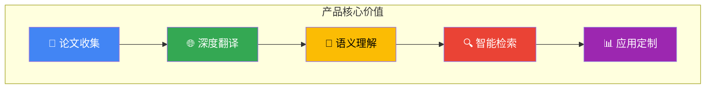

### 1.2 差异化价值

| 传统方案       | 本平台方案                   |
| -------------- | ---------------------------- |
| 孤立的文档翻译 | 跨论文知识图谱关联 [2]       |
| 单一向量检索   | GraphRAG 多跳推理检索 [3]    |
| 人工整理分类   | Agent 自动化处理与元数据抽取 |
| 静态翻译结果   | 实时任务监控与增量更新       |
| 无记忆能力     | Cognee 认知记忆层 [4]        |

### 1.3 设计理念

基于**认知增强**理论 [5]，本平台采用以下核心设计理念：

1. **Agentic RAG 架构**：将传统 RAG 被动检索转变为 Agent 驱动的主动推理 [6]
2. **图谱增强记忆**：利用知识图谱解决 LLM 的"孤立上下文"问题 [7]
3. **多 Agent 协作**：借鉴 BettaFish 论坛协作机制，避免单模型思维局限 [8]
4. **三位一体存储**：基于 OceanBase 实现 TP/AP/Vector 统一存储 [9]

---

## 2. 用户画像与场景

### 2.1 目标用户

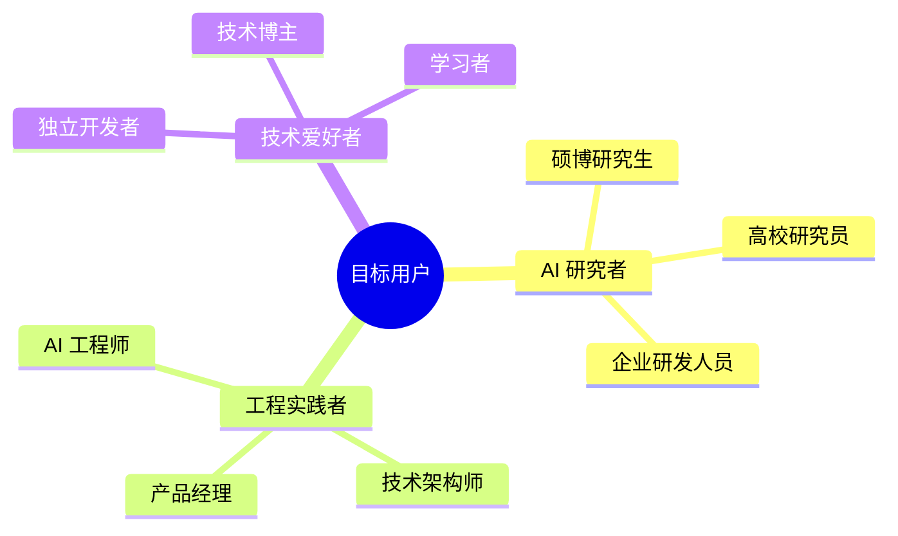

### 2.2 用户画像

| 角色           | 核心需求                     | 痛点                   | 期望价值             |
| -------------- | ---------------------------- | ---------------------- | -------------------- |
| **AI 研究者**  | 跟踪前沿、理解原理、发现关联 | 英文阅读门槛、论文孤立 | 高质量翻译、知识图谱 |
| **工程实践者** | 技术选型、方案设计、落地参考 | 理论到实践鸿沟         | 工程指引、代码示例   |
| **技术爱好者** | 学习入门、理解概念           | 内容碎片化             | 体系化知识、学习路径 |

### 2.3 核心使用场景

**场景 1：论文检索与阅读**

```
用户提问："有哪些论文研究了 Chain-of-Thought 和 ReAct 的结合应用？"
系统响应：
  1. 向量检索 → 语义相关论文
  2. 图谱检索 → 方法论关联论文
  3. 多跳推理 → 发现间接关联
  4. 生成回答 → 综述 + 引用链接
```

**场景 2：论文翻译与理解**

```
用户上传：一篇新发表的 Agentic AI 论文 PDF
系统处理：
  1. Reader Agent → 提取内容与结构
  2. Translation Agent → 高质量翻译（保留术语）
  3. Heartfelt Agent → 深度分析与要点提炼
  4. Cognee → 更新知识图谱，建立关联
```

**场景 3：技术方案咨询**

```
用户提问："我需要为客服系统设计一个多 Agent 架构，有什么参考？"
系统响应：
  1. 检索相关论文（Multi-Agent, Tool Use）
  2. 图谱查询架构模式关联
  3. 结合 BettaFish 论坛协作机制
  4. 参考其他经典 Agents 模式
  5. 输出可落地的架构方案
```

---

## 3. 功能需求

### 3.1 功能概览

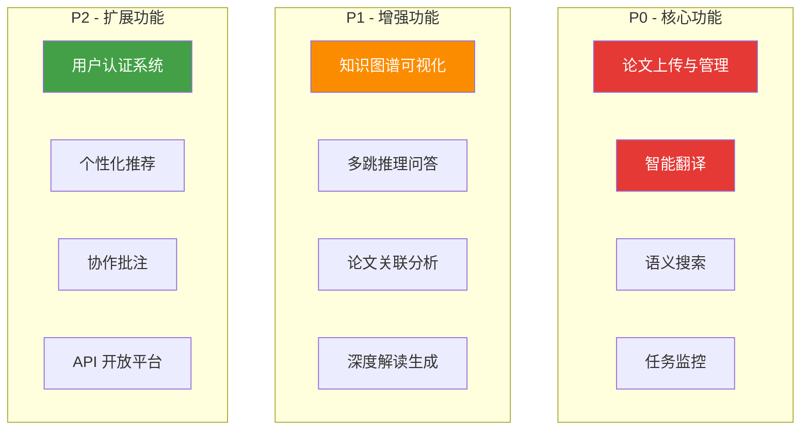

### 3.2 P0 核心功能

#### 3.2.1 论文上传与管理

| 功能点     | 描述                              | 验收标准             |
| ---------- | --------------------------------- | -------------------- |
| 拖拽上传   | 支持 PDF/Markdown/URL 格式        | 50MB 限制，实时进度  |
| 批量上传   | 多文件同时上传                    | 队列管理，并发控制   |
| 元数据提取 | 自动识别标题、作者、摘要          | 准确率 > 90%         |
| 分类管理   | 按主题分类（LLM Agents / RAG 等） | 支持自定义标签       |
| 状态追踪   | 处理状态可视化                    | 待处理/处理中/已完成 |

#### 3.2.2 智能翻译

| 功能点       | 描述                   | 验收标准          |
| ------------ | ---------------------- | ----------------- |
| 学术术语保留 | 专业术语中英对照       | 关键术语不翻译    |
| 结构保持     | 保留原文标题、段落结构 | Markdown 格式输出 |
| 增量翻译     | 支持部分翻译、继续翻译 | 断点续传          |
| 质量评估     | 翻译质量自动评估       | BLEU/人工评分     |

#### 3.2.3 语义搜索

| 功能点   | 描述                   | 验收标准        |
| -------- | ---------------------- | --------------- |
| 全文检索 | 标题、摘要、内容搜索   | 响应 < 500ms    |
| 向量检索 | 语义相似度匹配         | Top-K 召回      |
| 混合检索 | 关键词 + 向量融合      | RRF 重排序 [10] |
| 筛选过滤 | 按分类、日期、状态筛选 | 组合条件        |

#### 3.2.4 任务监控

| 功能点    | 描述                   | 验收标准   |
| --------- | ---------------------- | ---------- |
| 实时状态  | WebSocket 推送任务进度 | 延迟 < 1s  |
| 任务列表  | 查看所有任务状态       | 分页、筛选 |
| 取消/重试 | 任务控制操作           | 即时响应   |
| 日志查看  | 详细处理日志           | 错误定位   |

### 3.3 P1 增强功能

#### 3.3.1 知识图谱可视化

基于 Neo4j 知识图谱构建论文关联网络 [11]：

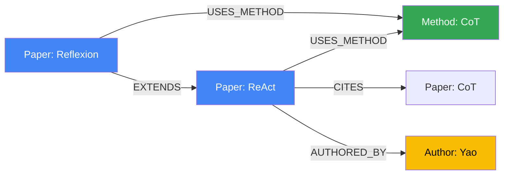

#### 3.3.2 多跳推理问答

基于 Agentic RAG 实现复杂问题推理 [6]：

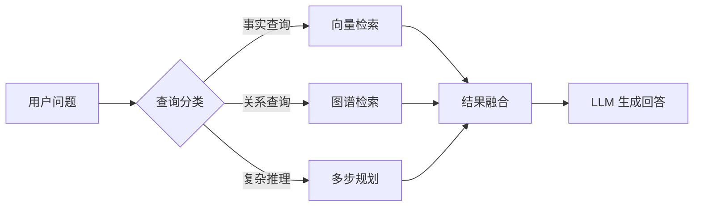

### 3.4 P2 扩展功能

| 功能       | 描述               | 优先级理由 |
| ---------- | ------------------ | ---------- |
| 用户认证   | 注册登录、收藏管理 | 个性化前提 |
| 个性化推荐 | 基于历史行为推荐   | 提升粘性   |
| 协作批注   | 多人协作翻译、评审 | 生态建设   |
| API 平台   | 开放能力给第三方   | 生态扩展   |

---

## 4. Agent 体系

### 4.1 双框架战略

基于调研结论 [12]，采用双框架战略平衡开发效率与生产稳定性：

| 框架           | 适用场景           | 核心优势                 |
| -------------- | ------------------ | ------------------------ |
| **Claude SDK** | 原型开发、定制需求 | 灵活、Agent Skills 生态  |
| **Google ADK** | 生产环境、批量处理 | 高性能、Multi-Agent 编排 |

### 4.2 Agent 协作架构

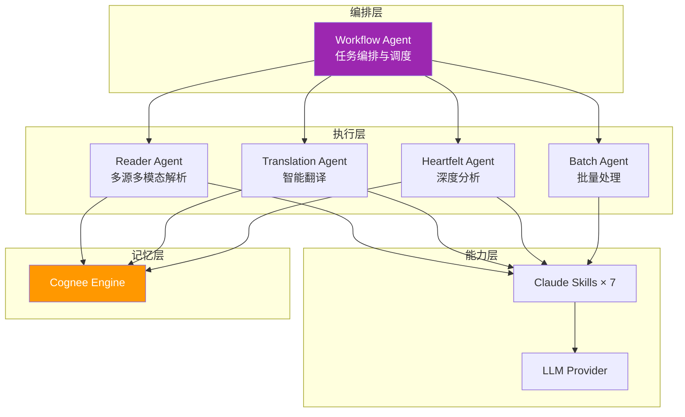

### 4.3 Agent 职责定义

| Agent                 | 职责               | 核心能力                                                 | 设计模式          |
| --------------------- | ------------------ | -------------------------------------------------------- | ----------------- |
| **Workflow Agent**    | 任务编排与调度     | 流程控制、状态管理                                       | Orchestrator [13] |
| **Reader Agent**      | 多源多模态内容解析 | PDF/URL/Word/PPT/Excel 解析、图片/音视频处理、元数据提取 | Tool Use          |
| **Translation Agent** | 高质量学术翻译     | 术语保留、结构保持                                       | Prompt Chaining   |
| **Heartfelt Agent**   | 深度分析与洞察生成 | 论文综述、要点提炼                                       | CoT + Reflection  |
| **Batch Agent**       | 批量任务并行处理   | 并发控制、队列管理                                       | Parallelization   |

### 4.4 Reader Agent 多源多模态能力

Reader Agent 是内容采集的核心组件，支持广泛的数据源和模态：

| 类型         | 支持格式                                                      | 说明           |
| ------------ | ------------------------------------------------------------- | -------------- |
| **文档格式** | PDF, Markdown, Word (.docx), PPT (.pptx), Excel (.xlsx), Text | 结构化内容提取 |
| **网络资源** | URL (Web Page), arXiv, GitHub                                 | 自动抓取与解析 |
| **多模态**   | 文本, 图片 (PNG/JPG), 音频 (MP3/WAV), 视频 (MP4)              | LLM 多模态理解 |

### 4.5 论坛协作机制

借鉴 BettaFish 创新设计 [8]，引入 Agent 论坛协作机制：

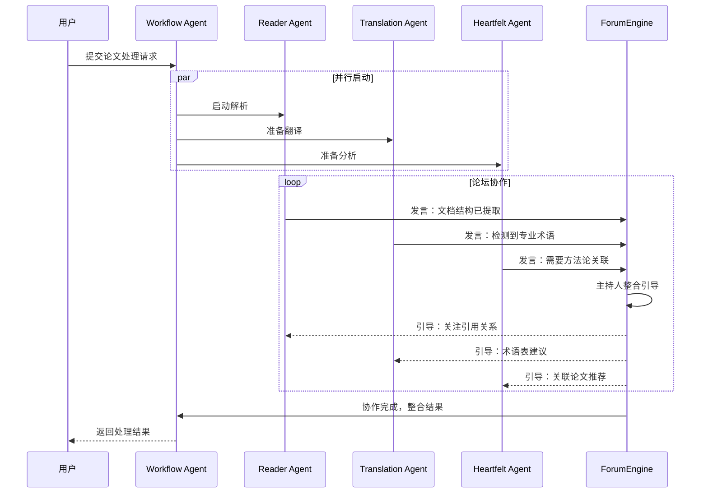

---

## 5. 认知增强体系

### 5.1 理论基础

本平台认知增强体系基于以下核心理论 [5]：

| 理论                    | 核心思想                    | 应用模块      |
| ----------------------- | --------------------------- | ------------- |
| **GraphRAG**            | LLM 构建知识图谱 + 社区检测 | 论文关联分析  |
| **Agentic RAG**         | Agent 驱动的自适应检索      | 智能问答      |
| **Memory Pattern**      | 短期/长期记忆分层           | Cognee 认知层 |
| **Context Engineering** | 系统性上下文管理            | 检索与生成    |

### 5.2 Cognee 记忆层

基于 Cognee 框架 [4] 构建认知记忆层：

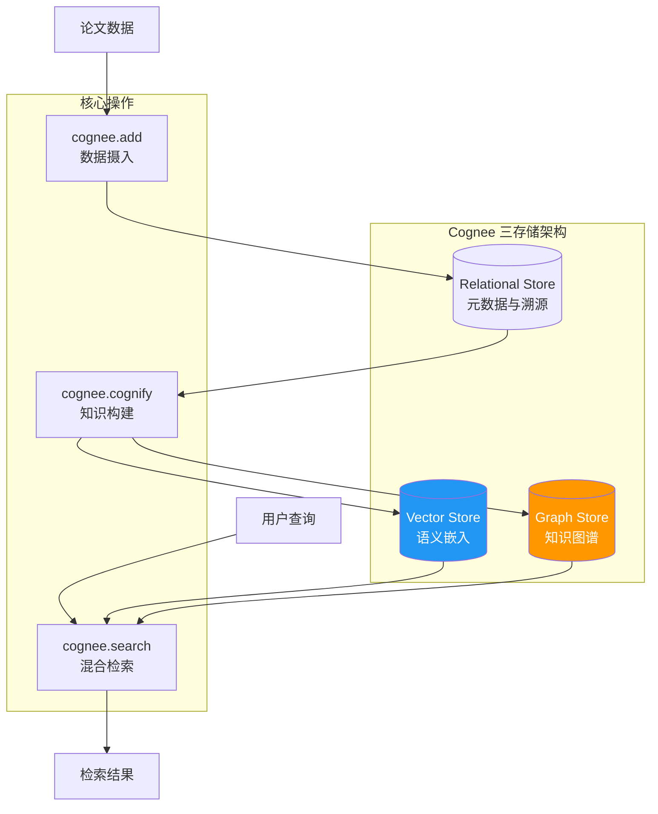

### 5.3 知识图谱设计

#### 节点类型

| 节点        | 属性                                | 说明     |
| ----------- | ----------------------------------- | -------- |
| `Paper`     | id, title, abstract, year, arxiv_id | 论文实体 |
| `Author`    | name, affiliation, email            | 作者     |
| `Concept`   | name, definition, category          | 核心概念 |
| `Method`    | name, description, type             | 方法论   |
| `Dataset`   | name, size, domain                  | 数据集   |
| `Framework` | name, version, url                  | 技术框架 |

#### 关系类型

| 关系           | 起点   | 终点    | 属性    |
| -------------- | ------ | ------- | ------- |
| `AUTHORED_BY`  | Paper  | Author  | order   |
| `CITES`        | Paper  | Paper   | context |
| `USES_METHOD`  | Paper  | Method  | -       |
| `INTRODUCES`   | Paper  | Concept | -       |
| `EXTENDS`      | Method | Method  | -       |
| `EVALUATED_ON` | Paper  | Dataset | metrics |

### 5.4 混合检索策略

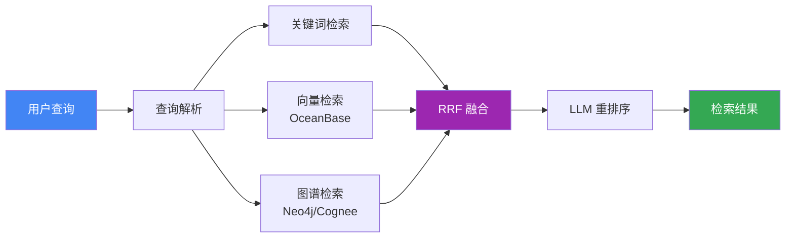

### 5.5 Agentic RAG 实现

基于调研结论 [6]，实现 Adaptive + Corrective + Self-RAG 组合：

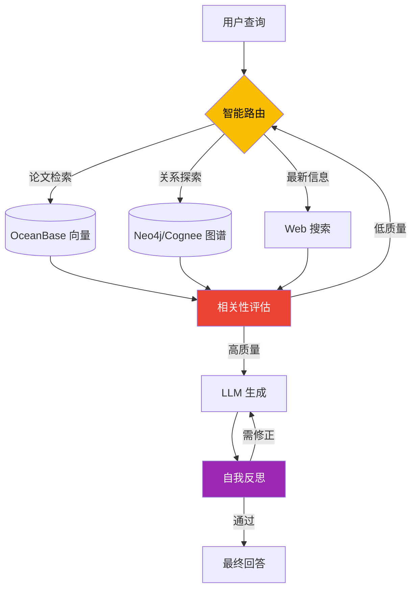

---

## 6. 数据架构

### 6.1 存储选型

基于调研结论 [9][11]，采用以下存储技术：

| 存储类型     | 技术选型        | 用途               | 核心优势            |
| ------------ | --------------- | ------------------ | ------------------- |
| **向量存储** | OceanBase V4.5+ | 语义检索           | 三位一体、HTAP 能力 |
| **图存储**   | Neo4j / Cognee  | 知识图谱           | 成熟生态、AI 集成   |
| **关系存储** | OceanBase       | 元数据、用户数据   | 金融级事务          |
| **文件存储** | 文件系统        | 原始文档、翻译结果 | 简化部署            |

### 6.2 OceanBase 数据模型

```sql
-- 论文元数据表 (TP 场景)
CREATE TABLE papers (
    id BIGINT PRIMARY KEY AUTO_INCREMENT,
    title VARCHAR(500) NOT NULL,
    abstract TEXT,
    authors JSON,
    publication_date DATE,
    category VARCHAR(100),
    status ENUM('pending', 'processing', 'translated', 'analyzed'),
    created_at TIMESTAMP DEFAULT CURRENT_TIMESTAMP,
    updated_at TIMESTAMP DEFAULT CURRENT_TIMESTAMP ON UPDATE CURRENT_TIMESTAMP,
    INDEX idx_category (category),
    INDEX idx_status (status)
);

-- 论文向量表 (Vector DB 场景)
CREATE TABLE paper_embeddings (
    id BIGINT PRIMARY KEY AUTO_INCREMENT,
    paper_id BIGINT NOT NULL,
    chunk_index INT DEFAULT 0,
    chunk_text TEXT,
    embedding VECTOR(1536),
    FOREIGN KEY (paper_id) REFERENCES papers(id)
);

-- 创建 HNSW 向量索引
CREATE INDEX idx_paper_embedding_hnsw
ON paper_embeddings USING HNSW (embedding vector_cosine_ops)
WITH (m = 16, ef_construction = 128);
```

### 6.3 Neo4j 知识图谱 Schema

```cypher
// 创建约束
CREATE CONSTRAINT paper_id_unique FOR (p:Paper) REQUIRE p.id IS UNIQUE
CREATE CONSTRAINT author_name_unique FOR (a:Author) REQUIRE a.name IS UNIQUE

// 创建向量索引
CREATE VECTOR INDEX paper_embedding FOR (p:Paper) ON (p.embedding)
OPTIONS {
  indexConfig: {
    `vector.dimensions`: 1536,
    `vector.similarity_function`: 'cosine'
  }
}

// 示例查询：查找使用相似方法的论文
MATCH (p1:Paper)-[:USES_METHOD]->(m:Method)<-[:USES_METHOD]-(p2:Paper)
WHERE p1.title = "ReAct"
RETURN p2.title, m.name
```

---

## 7. 技术架构

### 7.1 整体架构

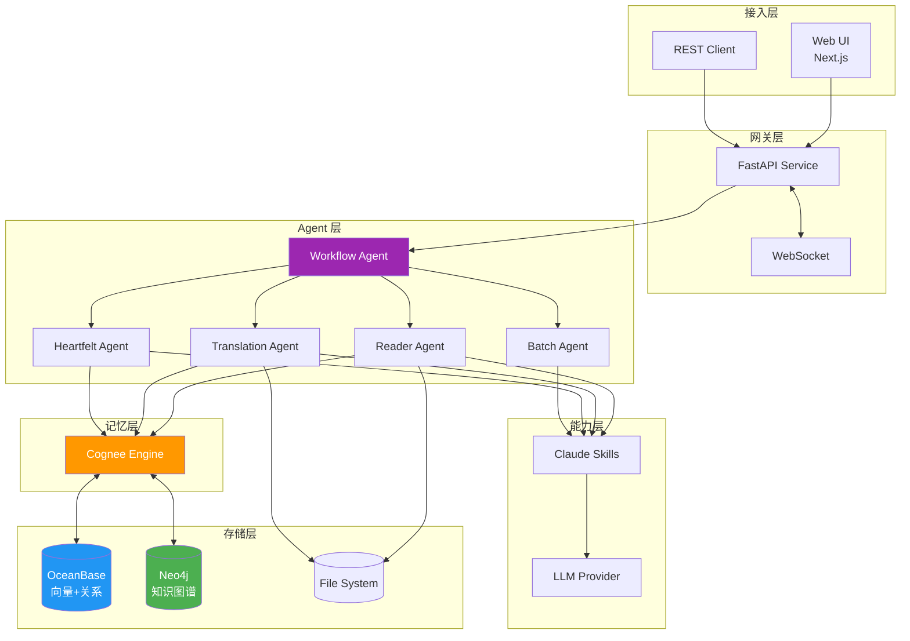

### 7.2 技术栈

| 层级      | 技术选型                     | 版本/说明   |
| --------- | ---------------------------- | ----------- |
| **前端**  | Next.js (App Router)         | 16.x        |
|           | Zustand + immer              | 状态管理    |
|           | TailwindCSS                  | 样式框架    |
| **后端**  | FastAPI + asyncio            | Python 3.12 |
|           | Pydantic                     | 数据验证    |
| **Agent** | Claude Agent SDK             | 原型开发    |
|           | Google ADK                   | 生产部署    |
| **记忆**  | Cognee                       | 认知记忆层  |
| **存储**  | OceanBase V4.5+              | 向量+关系   |
|           | Neo4j                        | 知识图谱    |
| **测试**  | Pytest + Vitest + Playwright | 82% 覆盖率  |
| **CI/CD** | GitHub Actions               | 自动化      |

---

## 8. 实施路线

### 8.1 里程碑规划

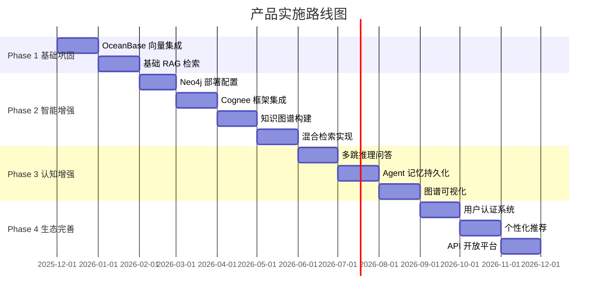

### 8.2 阶段目标

| 阶段        | 时间       | 目标         | 交付物               |
| ----------- | ---------- | ------------ | -------------------- |
| **Phase 1** | Q4 2025    | 基础能力完善 | 向量检索、基础 RAG   |
| **Phase 2** | Q1-Q2 2026 | 智能增强     | 知识图谱、混合检索   |
| **Phase 3** | Q2-Q3 2026 | 认知增强     | 多跳推理、记忆持久化 |
| **Phase 4** | Q3-Q4 2026 | 生态完善     | 用户系统、开放平台   |

---

## 9. 质量保障

### 9.1 评估指标体系

基于 RAGAS 框架 [14] 建立评估体系：

| 指标                  | 说明                       | 目标值 |
| --------------------- | -------------------------- | ------ |
| **Faithfulness**      | 生成内容与检索上下文一致性 | > 85%  |
| **Answer Relevancy**  | 答案与问题相关性           | > 90%  |
| **Context Precision** | 检索上下文信噪比           | > 80%  |
| **Context Recall**    | 相关信息召回率             | > 85%  |

### 9.2 技术指标

| 指标         | 当前 | 目标    |
| ------------ | ---- | ------- |
| 测试覆盖率   | 82%  | > 90%   |
| API 响应时间 | -    | < 500ms |
| 向量检索延迟 | -    | < 100ms |
| 翻译准确率   | -    | > 95%   |

---

## 10. 参考文献

| 序号 | 参考源                       | 来源                                                                                  |
| ---- | ---------------------------- | ------------------------------------------------------------------------------------- |
| [1]  | 项目架构文档                 | [docs/001-architecture.md](./001-architecture.md)                                     |
| [2]  | Microsoft GraphRAG 论文      | [From Local to Global](https://arxiv.org/abs/2404.16130)                              |
| [3]  | 认知增强调研 - GraphRAG 原理 | [docs/research/000-cognitive-enhancement.md](./research/000-cognitive-enhancement.md) |
| [4]  | Cognee 深度调研              | [docs/research/003-cognee.md](./research/003-cognee.md)                               |
| [5]  | 认知增强调研报告             | [docs/research/000-cognitive-enhancement.md](./research/000-cognitive-enhancement.md) |
| [6]  | Agentic RAG 理论             | 认知增强调研 §2.4                                                                     |
| [7]  | 知识图谱在 AI 中的应用       | 认知增强调研 §2.1.4                                                                   |
| [8]  | BettaFish 深度调研           | [docs/research/006-bettafish.md](./research/006-bettafish.md)                         |
| [9]  | OceanBase 深度调研           | [docs/research/004-oceanbase.md](./research/004-oceanbase.md)                         |
| [10] | RRF 融合算法                 | 认知增强调研 §7.4                                                                     |
| [11] | Neo4j 深度调研               | [docs/research/005-neo4j.md](./research/005-neo4j.md)                                 |
| [12] | Agent 框架调研               | [docs/research/002-agent-frameworks.md](./research/002-agent-frameworks.md)           |
| [13] | Agentic Design Patterns      | 认知增强调研 §6                                                                       |
| [14] | RAGAS 评估框架               | [RAGAS Docs](https://docs.ragas.io/)                                                  |
| [15] | Context Engineering 调研     | [docs/research/001-context-engineering.md](./research/001-context-engineering.md)     |

---

_最后更新：2025 年 12 月_
