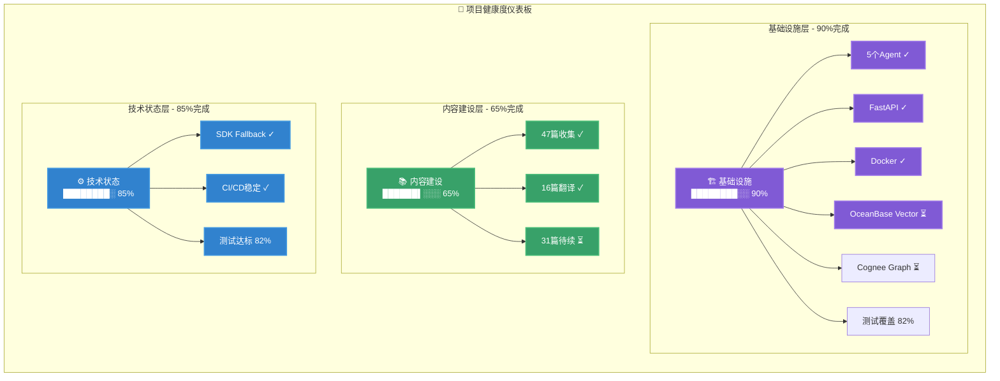
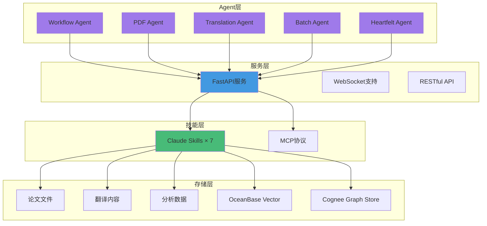
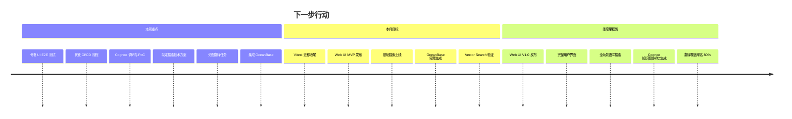
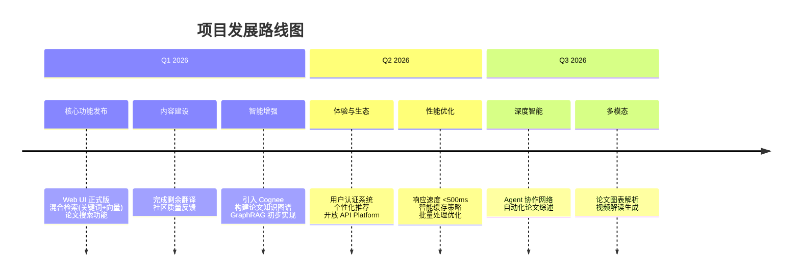
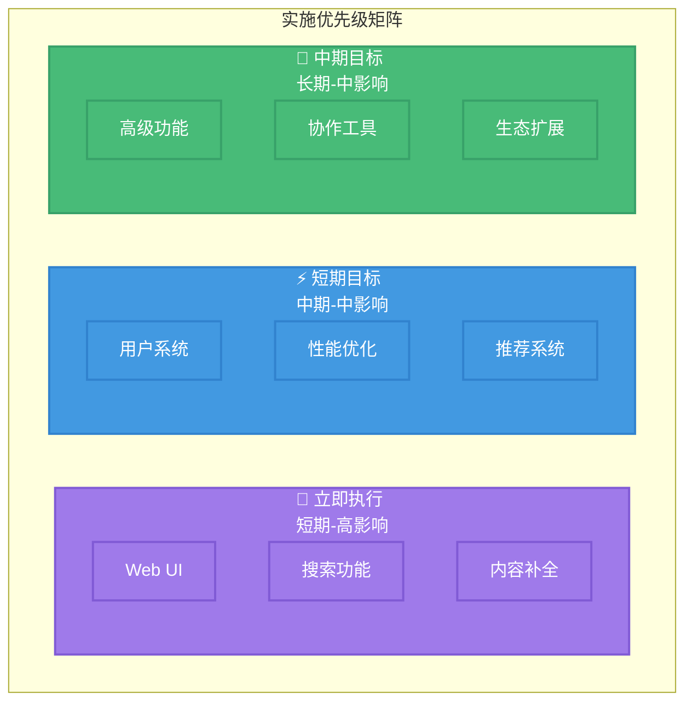
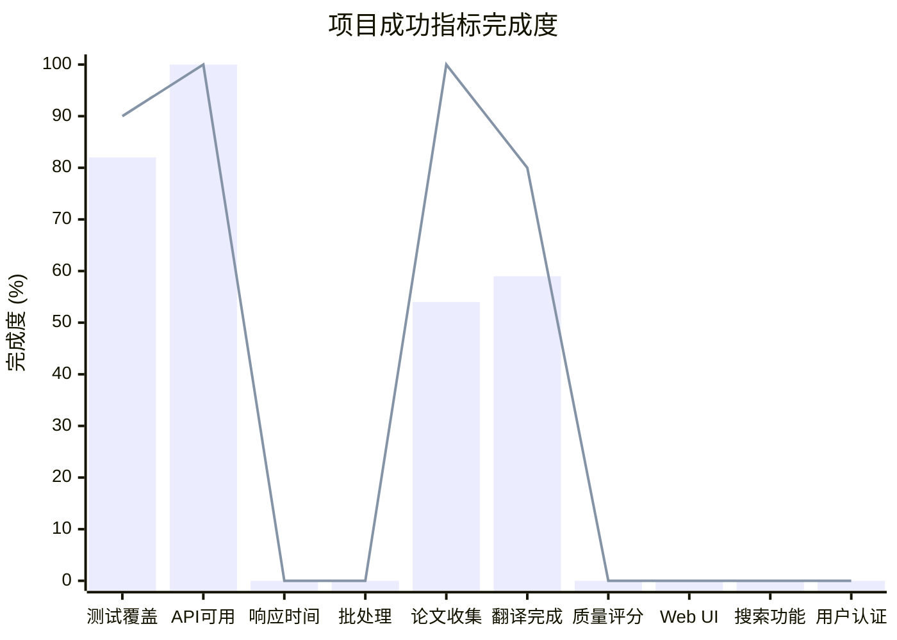

# 🗺️ Agentic AI 论文平台路线图

**生产就绪的 Agentic AI 研究论文平台**，为中文读者提供高质量技术资源。

## 核心指标

## 已实现模块

## 下一步行动

## 发展路线图

## 实施优先级

### 🚀 立即执行（12 月 - 1 月）

- **Web UI & E2E**：修复 CI 测试，确保 Web 界面基础功能稳定（Next.js + Vitest）。
- **Cognee Integration**：启动 Cognee 集成调研，探索基于 GraphRAG 的论文关联分析。
- **搜索功能**：全文搜索、分类筛选、结果优化。
- **Vector Search**：引入 OceanBase，实现向量索引与检索功能。
- **基础设施**：优化 CI/CD 流水线，解决依赖兼容性问题。
- **内容补全**：11 篇待翻译、质量评估、翻译优化。

### ⚡ 短期目标（Q1 2026）

- **正式发布**：Web UI 1.0 上线，提供完整的浏览、阅读、搜索体验。
- **用户系统**：实现基础的用户注册、登录和收藏功能。
- **内容补全**：完成当前 backlog 中的论文翻译。
- **推荐系统**：历史推荐、论文关联、个性化首页。

### 🎯 中期目标（Q2 2026）

- **生态扩展**：开放 API，允许第三方工具接入、移动端适配。
- **高级分析**：引入更深度的 Agent 分析能力（如跨论文综述）。
- **协作工具**：讨论区、翻译协作、专家评审。
- **高级功能**：批注笔记、引用管理、导出功能。

## 成功指标

### 详细指标

**技术指标**

- ✅ 测试覆盖率：82% → 目标 90%
- ✅ API 可用性：已达标 → 目标 99%
- ⏳ 响应时间：待优化 → 目标 < 1 秒
- ⏳ 批处理：待优化 → 目标 5x 提升

**内容指标**

- ✅ 论文收集：47 篇 → 目标 50+
- ⏳ 翻译完成：34% → 目标 80%
- ⏳ 质量评分：待建立 → 目标 4.5/5

**用户体验**

- ⏳ Web UI：开发测试中 → Q1 发布
- ⏳ 搜索功能：待集成 OceanBase → Q1 完成
- ⏳ 用户认证：待开发 → Q2 完成

---

_最后更新：2025 年 12 月_
