# 🗺️ Agentic AI 论文平台路线图

**生产就绪的 Agentic AI 研究论文平台**，为中文读者提供高质量技术资源。

## 核心指标

```mermaid
graph TD
    subgraph "🎯 项目健康度仪表板"
        direction TB

        subgraph "基础设施层 - 90%完成"
            A1[🏗️ 基础设施<br/><span style='color:#4CAF50;'>████████░░ 90%</span>]
            A1 --> A2["5个Agent ✓"]
            A1 --> A3["FastAPI ✓"]
            A1 --> A4["Docker ✓"]
            A1 --> A5["OceanBase Vector ⏳"]
            A1 --> A6["测试覆盖 82%"]
        end

        subgraph "内容建设层 - 65%完成"
            B1[📚 内容建设<br/><span style='color:#ed8936;'>██████▌░░░ 65%</span>]
            B1 --> B2["47篇收集 ✓"]
            B1 --> B3["16篇翻译 ✓"]
            B1 --> B4["31篇待续 ⏳"]
        end

        subgraph "技术状态层 - 85%完成"
            C1[⚙️ 技术状态<br/><span style='color:#4299e1;'>████████░ 85%</span>]
            C1 --> C2["SDK Fallback ✓"]
            C1 --> C3["CI/CD稳定 ✓"]
            C1 --> C4["测试达标 82%"]
        end
    end

    classDef infrastructure fill:#805ad5,color:#fff,stroke:#9f7aea,stroke-width:2px
    classDef content fill:#38a169,color:#fff,stroke:#48bb78,stroke-width:2px
    classDef technical fill:#3182ce,color:#fff,stroke:#4299e1,stroke-width:2px

    class A1,A2,A3,A4,A5 infrastructure
    class B1,B2,B3,B4 content
    class C1,C2,C3,C4 technical
```

## 已实现模块

```mermaid
graph TB
    subgraph "Agent层"
        A1[Workflow Agent]
        A2[PDF Agent]
        A3[Translation Agent]
        A4[Batch Agent]
        A5[Heartfelt Agent]
    end

    subgraph "服务层"
        B1[FastAPI服务]
        B2[WebSocket支持]
        B3[RESTful API]
    end

    subgraph "技能层"
        C1[Claude Skills × 7]
        C2[MCP协议]
    end

    subgraph "存储层"
        D1[论文文件]
        D2[翻译内容]
        D3[分析数据]
        D4[Vector Index]
    end

    A1 --> B1
    A2 --> B1
    A3 --> B1
    A4 --> B1
    A5 --> B1

    B1 --> C1
    B1 --> C2

    C1 --> D1
    C1 --> D2
    C1 --> D3
    C1 --> D4

    style A1 fill:#9f7aea
    style A2 fill:#9f7aea
    style A3 fill:#9f7aea
    style A4 fill:#9f7aea
    style A5 fill:#9f7aea
    style A5 fill:#9f7aea
    style B1 fill:#4299e1
    style C1 fill:#48bb78
```

## 下一步行动

```mermaid
timeline
    title 下一步行动
    section 本周重点
        修复 UI E2E 测试
        优化 CI/CD 流程
        制定搜索技术方案
        分配翻译任务
        集成 OceanBase
    section 本月目标
        Vitest 迁移收尾
        Web UI MVP 发布
        基础搜索上线
        OceanBase 完整集成
        Vector Search 验证
    section 季度里程碑
        Web UI V1.0 发布
        完整用户界面
        全功能语义搜索
        翻译覆盖率达 80%
```

## 发展路线图

```mermaid
timeline
    title 项目发展路线图
    section Q1 2026
        核心功能发布 : Web UI 正式版<br>混合检索(关键词+向量)<br>论文搜索功能
        内容建设 : 完成剩余翻译<br>社区质量反馈
    section Q2 2026
        体验与生态 : 用户认证系统<br>个性化推荐<br>开放 API Platform
        性能优化 : 响应速度 <500ms<br>智能缓存策略<br>批量处理优化
    section Q3 2026
        深度智能 : Agent 协作网络<br>自动化论文综述
        多模态 : 论文图表解析<br>视频解读生成
```

## 实施优先级

```mermaid
graph TD
    subgraph "实施优先级矩阵"
        direction LR

        subgraph Q1[🚀 立即执行<br/>短期-高影响]
            A1[Web UI]
            A2[搜索功能]
            A3[内容补全]
        end

        subgraph Q2[⚡ 短期目标<br/>中期-中影响]
            B1[用户系统]
            B2[性能优化]
            B3[推荐系统]
        end

        subgraph Q3[🎯 中期目标<br/>长期-中影响]
            C1[高级功能]
            C2[协作工具]
            C3[生态扩展]
        end
    end

    style Q1 fill:#9f7aea,stroke:#805ad5,stroke-width:2px,color:#fff
    style Q2 fill:#4299e1,stroke:#3182ce,stroke-width:2px,color:#fff
    style Q3 fill:#48bb78,stroke:#38a169,stroke-width:2px,color:#fff

    classDef urgent fill:#9f7aea,stroke:#805ad5,stroke-width:2px,color:#fff
    classDef medium fill:#4299e1,stroke:#3182ce,stroke-width:2px,color:#fff
    classDef longterm fill:#48bb78,stroke:#38a169,stroke-width:2px,color:#fff

    class A1,A2,A3 urgent
    class B1,B2,B3 medium
    class C1,C2,C3 longterm
```

### 🚀 立即执行（12 月 - 1 月）

- **Web UI & E2E**：修复 CI 测试，确保 Web 界面基础功能稳定（Next.js + Vitest）。
- **搜索功能**：全文搜索、分类筛选、结果优化。
- **Vector Search**：引入 OceanBase，实现向量索引与检索功能。
- **基础设施**：优化 CI/CD 流水线，解决依赖兼容性问题。
- **内容补全**：11 篇待翻译、质量评估、翻译优化。

### ⚡ 短期目标（Q1 2026）

- **正式发布**：Web UI 1.0 上线，提供完整的浏览、阅读、搜索体验。
- **用户系统**：实现基础的用户注册、登录和收藏功能。
- **内容补全**：完成当前 backlog 中的论文翻译。
- **推荐系统**：历史推荐、论文关联、个性化首页。

### 🎯 中期目标（Q2 2026）

- **生态扩展**：开放 API，允许第三方工具接入、移动端适配。
- **高级分析**：引入更深度的 Agent 分析能力（如跨论文综述）。
- **协作工具**：讨论区、翻译协作、专家评审。
- **高级功能**：批注笔记、引用管理、导出功能。

## 成功指标

```mermaid
xychart-beta
    title "项目成功指标完成度"
    x-axis ["测试覆盖", "API可用", "响应时间", "批处理", "论文收集", "翻译完成", "质量评分", "Web UI", "搜索功能", "用户认证"]
    y-axis "完成度 (%)" 0 --> 100
    bar [82, 100, 0, 0, 54, 59, 0, 0, 0, 0]
    line [90, 100, 0, 0, 100, 80, 0, 0, 0, 0]
```

### 详细指标

**技术指标**

- ✅ 测试覆盖率：82% → 目标 90%
- ✅ API 可用性：已达标 → 目标 99%
- ⏳ 响应时间：待优化 → 目标 < 1 秒
- ⏳ 批处理：待优化 → 目标 5x 提升

**内容指标**

- ✅ 论文收集：47 篇 → 目标 50+
- ⏳ 翻译完成：34% → 目标 80%
- ⏳ 质量评分：待建立 → 目标 4.5/5

**用户体验**

- ⏳ Web UI：开发测试中 → Q1 发布
- ⏳ 搜索功能：待集成 OceanBase → Q1 完成
- ⏳ 用户认证：待开发 → Q2 完成

---

_最后更新：2025 年 12 月_
