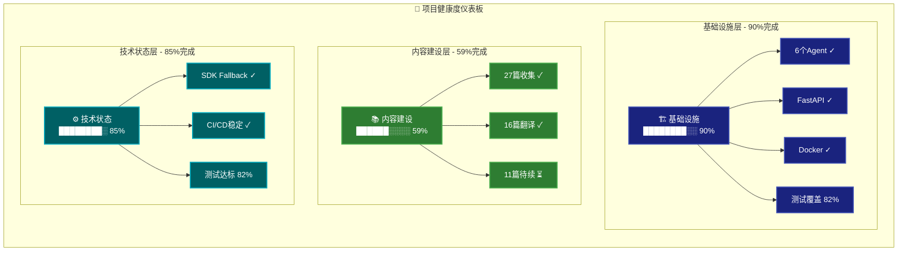
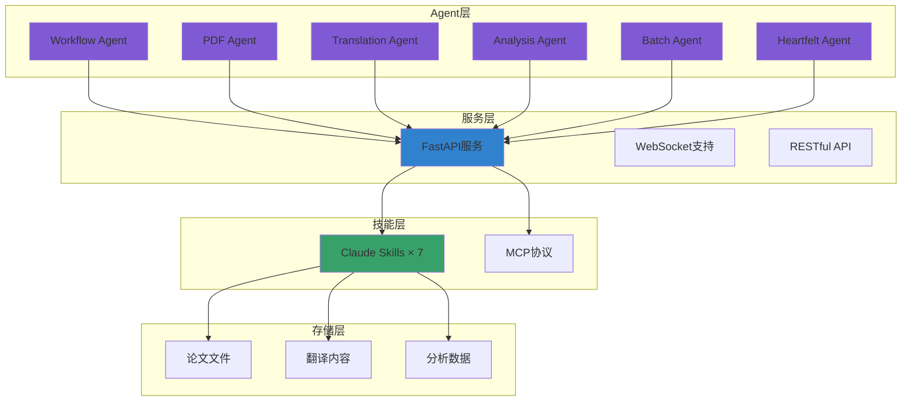
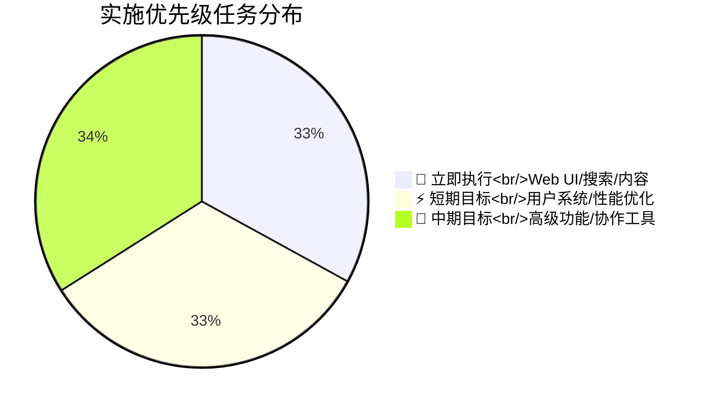
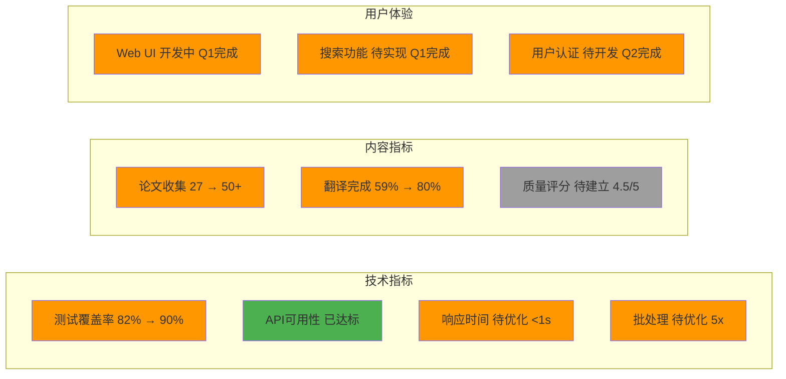

# 🗺️ Agentic AI 论文平台路线图

**生产就绪的 Agentic AI 研究论文平台**，为中文读者提供高质量技术资源。

## 核心指标

## 已实现模块

## 下一步行动

## 发展路线图

## 实施优先级

### 🚀 立即执行（2-4 周）

- Web UI 开发：响应式界面、浏览筛选、阅读模式
- 搜索功能：全文搜索、分类筛选、结果优化
- 内容补全：11 篇待翻译、质量评估、翻译优化

### ⚡ 短期目标（1-2 月）

- 用户系统：注册登录、个人收藏、阅读历史
- 性能优化：API 响应<1 秒、批处理提升、缓存优化
- 推荐系统：历史推荐、论文关联、个性化首页

### 🎯 中期目标（3-6 月）

- 高级功能：批注笔记、引用管理、导出功能
- 协作工具：讨论区、翻译协作、专家评审
- 生态扩展：开放 API、第三方集成、移动端适配

## 成功指标

---

_最后更新：2025 年 12 月_
