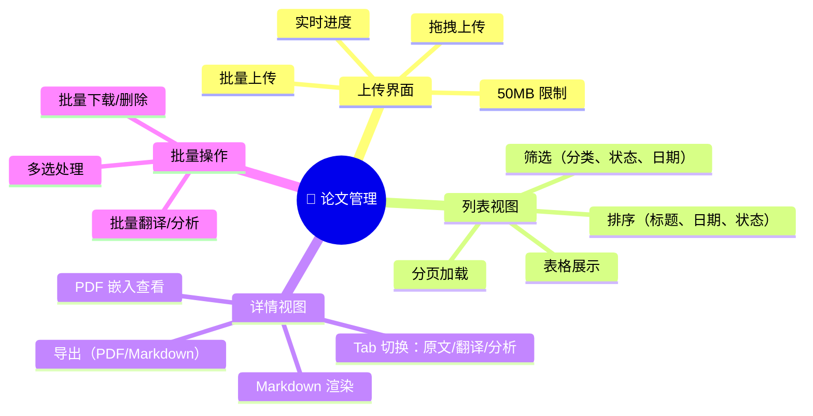
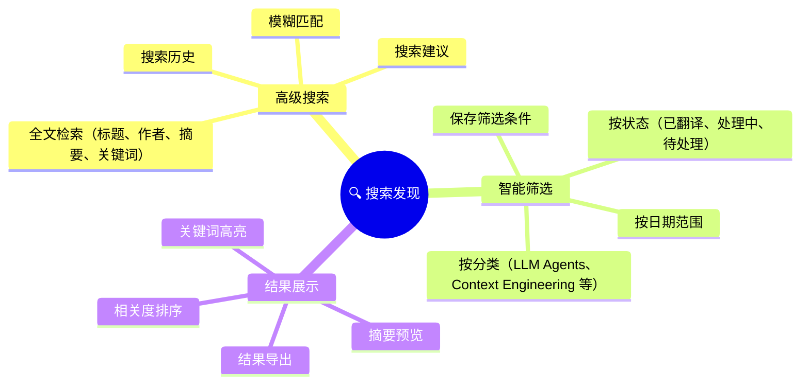
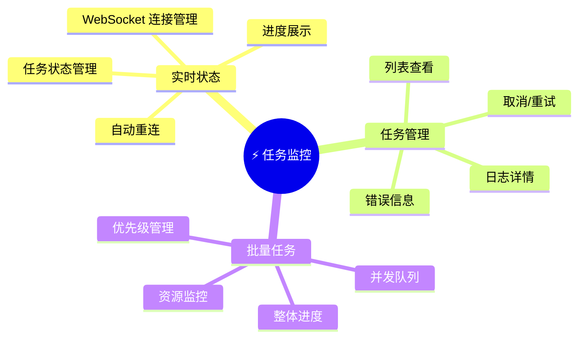
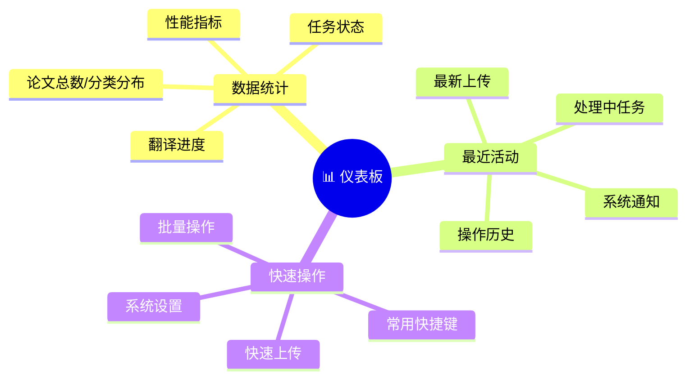
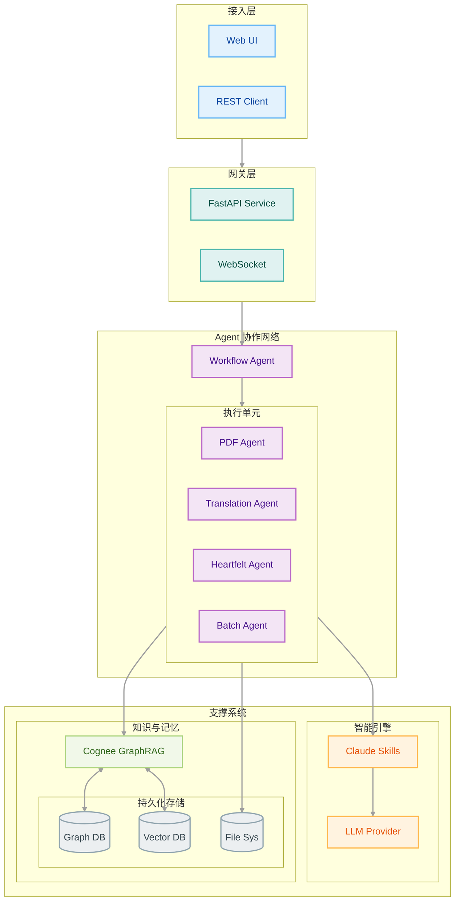
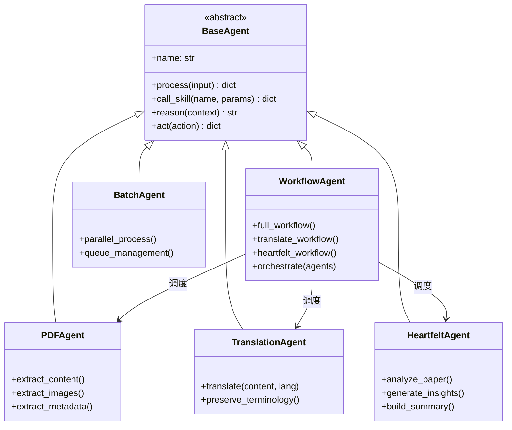
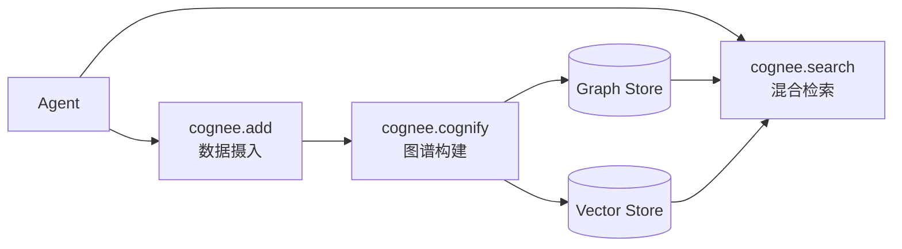
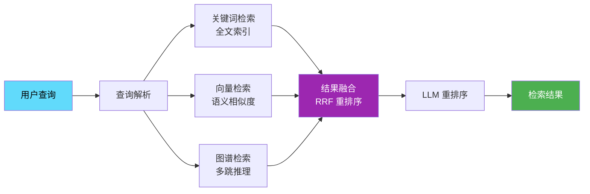

# 🏗️ 产品概要与系统架构

## 1. 产品概述

### 1.1 核心目标

### 1.2 差异化价值

| 传统方案       | 本平台方案                   |
| -------------- | ---------------------------- |
| 孤立的文档翻译 | 跨论文的知识图谱关联         |
| 单一向量检索   | GraphRAG 多跳推理检索        |
| 人工整理分类   | Agent 自动化处理与元数据提取 |
| 静态翻译结果   | 实时任务监控与增量更新       |

### 1.3 理论基础

本平台架构设计基于以下学术研究和工程实践：

| 理论/框架    | 核心论文/文档                                                                 | 核心思想                      | 本项目应用模块         |
| ------------ | ----------------------------------------------------------------------------- | ----------------------------- | ---------------------- |
| **GraphRAG** | [From Local to Global](https://arxiv.org/abs/2404.16130) (Microsoft, 2024)    | LLM 构建知识图谱 + 图机器学习 | 论文关联分析、多跳检索 |
| **ReAct**    | [ReAct: Synergizing Reasoning and Acting](https://arxiv.org/abs/2210.03629)   | 推理与行动交织，减少幻觉      | Agent 决策循环         |
| **CoT**      | [Chain-of-Thought Prompting](https://arxiv.org/abs/2201.11903) (Google, 2022) | 链式思维促进复杂推理          | Heartfelt Agent        |
| **Cognee**   | [Cognee Docs](https://docs.cognee.ai/)                                        | 认知记忆层，模拟人类记忆系统  | Memory 模块            |
| **RAGAS**    | [RAGAS Docs](https://docs.ragas.io/)                                          | RAG 评估指标体系              | 检索质量评估           |

### 1.4 关键决策

| 决策               | 原因                                |
| ------------------ | ----------------------------------- |
| Fallback Skills    | 规避 Claude SDK jsonschema 兼容问题 |
| 文件系统存储       | 简化部署，降低运维复杂度            |
| 异步优先架构       | 支持高并发论文处理                  |
| Next.js App Router | 现代 React 架构，良好 SEO 支持      |
| Zustand + immer    | 轻量级状态管理，简洁 API            |
| GraphRAG (Cognee)  | 解决孤立上下文问题，支持多跳推理    |
| 双框架战略         | 平衡开发速度与生产稳定性            |
| RAGAS 评估         | 量化检索与生成质量，持续优化        |

### 1.5 当前状态

| 模块     | 状态      | 详情                   |
| -------- | --------- | ---------------------- |
| Agent 层 | ✅ 已完成 | 5 个 Agent             |
| API 层   | ✅ 已完成 | papers/tasks/websocket |
| Skills   | ✅ 已完成 | 7 个 Fallback Skills   |
| Web UI   | ✅ MVP    | 论文/任务/搜索页面     |
| 测试     | ✅ 82%    | Pytest + Vitest        |
| 向量存储 | ⏳ 进行中 | OceanBase 集成         |
| 知识图谱 | 📋 规划中 | Cognee GraphRAG        |
| 用户系统 | 📋 规划中 | 认证与个性化           |

### 1.6 核心功能



---



---



---



## 2. 系统架构



### 2.1 技术栈

| 层级      | 技术选型                     | 版本/说明    |
| --------- | ---------------------------- | ------------ |
| **前端**  | Next.js (App Router)         | 16.0.10      |
|           | React                        | 19.2.0       |
|           | Zustand + immer              | 5.0.9        |
|           | TailwindCSS                  | 3.4          |
| **后端**  | FastAPI + asyncio            | Python 3.12  |
|           | Pydantic                     | 数据验证     |
| **Agent** | Claude Agent SDK             | 原型开发     |
|           | Google ADK                   | 生产批量处理 |
| **Skill** | Claude Skills (Fallback)     | 7 个专用能力 |
| **记忆**  | Cognee GraphRAG              | 知识图谱     |
| **存储**  | OceanBase (向量)             | V4.5+        |
|           | Neo4j / Kuzu (图谱)          | 图数据库     |
| **测试**  | Pytest + Vitest + Playwright | 82% 覆盖率   |
| **CI/CD** | GitHub Actions               | 自动化流水线 |

### 2.2 设计原则

| 原则           | 说明                                      |
| -------------- | ----------------------------------------- |
| **异步优先**   | 全链路异步处理，支持高并发论文处理        |
| **Agent 自治** | 每个 Agent 专注单一职责，通过编排层协作   |
| **记忆增强**   | Cognee 提供跨会话长期记忆，避免上下文遗忘 |
| **混合检索**   | 关键词 + 向量 + 图谱三路融合，RRF 重排序  |
| **可观测性**   | 任务实时监控，WebSocket 推送进度          |
| **渐进增强**   | 文件系统起步，逐步引入向量库和图数据库    |

### 2.3 目录结构

```shell
agentic-ai-papers/
├── agents/                     # 后端核心
│   ├── api/                    # FastAPI 服务
│   │   ├── main.py             # 应用入口
│   │   ├── routes/             # API 路由
│   │   ├── services/           # 业务服务
│   │   └── models/             # Pydantic 模型
│   ├── claude/                 # Agent 实现
│   │   ├── base.py             # BaseAgent 基类
│   │   ├── workflow_agent.py   # 流程编排
│   │   ├── pdf_agent.py        # PDF 处理
│   │   ├── translation_agent.py# 翻译处理
│   │   ├── heartfelt_agent.py  # 深度分析
│   │   └── skills.py           # Skill 调用封装
│   └── core/                   # 核心组件
│       ├── config.py           # 配置管理
│       ├── memory.py           # Cognee 集成
│       └── exceptions.py       # 异常定义
├── ui/                         # 前端
│   └── src/
│       ├── app/                # App Router 页面
│       │   ├── papers/         # 论文管理 ✅
│       │   ├── tasks/          # 任务监控 ✅
│       │   └── search/         # 搜索页面 ✅
│       ├── components/         # React 组件
│       ├── hooks/              # useApi, useWebSocket ✅
│       ├── store/              # Zustand Stores ✅
│       └── lib/api.ts          # API 客户端 ✅
├── papers/                     # 论文存储
│   ├── source/                 # 原始文档
│   ├── translation/            # 翻译结果
│   └── heartfelt/              # 深度分析
├── tests/                      # 测试套件
├── .claude/skills/             # 7 个 Claude Skills
└── docs/                       # 文档
```

## 3. Agents 体系

### 3.1 双框架战略

| 框架           | 适用场景           | 优势                 |
| -------------- | ------------------ | -------------------- |
| **Claude SDK** | 原型开发、定制需求 | 灵活、快速迭代       |
| **Google ADK** | 生产环境、批量处理 | 高性能、企业级稳定性 |

### 3.2 Agents 协作

基于 **ReAct 框架**（Reasoning + Acting）设计，每个 Agent 交织推理与行动：



## 4. 认知体系

### 4.1 记忆系统 (Cognee)

基于 **Cognee** 框架，为 Agent 提供认知记忆层：

- **长期记忆**：跨会话持久化，避免上下文遗忘
- **语义记忆**：知识图谱存储实体关系
- **情景记忆**：保留处理历史和决策轨迹



### 4.2 知识图谱设计

**节点类型**：

| 节点          | 说明                                          |
| ------------- | --------------------------------------------- |
| `Paper`       | 论文实体                                      |
| `Author`      | 作者                                          |
| `Institution` | 机构                                          |
| `Concept`     | 核心概念（Chain-of-Thought, ReAct, Reflexion) |
| `Method`      | 方法论                                        |
| `Dataset`     | 数据集                                        |

**关系类型**：

| 关系           | 方向            | 说明       |
| -------------- | --------------- | ---------- |
| `AUTHORED_BY`  | Paper → Author  | 作者关系   |
| `CITES`        | Paper → Paper   | 引用关系   |
| `USES_METHOD`  | Paper → Method  | 使用方法   |
| `EXTENDS`      | Method → Method | 方法演进   |
| `EVALUATES_ON` | Paper → Dataset | 评估数据集 |

### 4.3 智能检索

基于 **Microsoft GraphRAG** 研究成果，利用 LLM 从论文中构建知识图谱，结合图机器学习增强检索：

- **解决传统 RAG 痛点**：跨文档"连点成线"能力不足
- **支持多跳推理**：如"哪些论文使用了与 ReAct 相似的方法？"
- **提供溯源能力**：检索结果可追溯到图谱节点

### 4.4 混合检索



### 4.5 评估指标 (RAGAS)

采用 **RAGAS 框架**评估检索与生成质量：

| 指标                  | 说明                         |
| --------------------- | ---------------------------- |
| **Faithfulness**      | 生成内容与检索上下文的一致性 |
| **Answer Relevancy**  | 答案与问题的相关性           |
| **Context Precision** | 检索上下文的信噪比           |
| **Context Recall**    | 相关信息的召回率             |

## 5. 前端架构

### 5.1 状态管理

| Store           | 职责                  | 持久化 |
| --------------- | --------------------- | ------ |
| `usePaperStore` | 论文 CRUD、筛选、分页 | ✅     |
| `useTaskStore`  | 任务监控、WebSocket   | ❌     |
| `useUIStore`    | 主题、通知、侧边栏    | ❌     |

### 5.2 API 客户端

```typescript
api.papers.list(params); // 论文列表
api.papers.upload(formData); // 上传论文
api.papers.process(id, workflow); // 处理论文
api.tasks.list(params); // 任务列表
api.search.papers(query); // 语义搜索
api.search.graph(query); // 图谱查询
```

### 5.3 测试策略

- **单元测试**：Vitest (`tests/ui/unit/`)
- **E2E 测试**：Playwright (`tests/ui/e2e/`)
- **浏览器覆盖**：Chromium, Firefox, WebKit, Mobile

## 6. API 设计

### 6.1 核心端点

| 路由                       | 方法 | 功能             |
| -------------------------- | ---- | ---------------- |
| `/api/papers`              | GET  | 论文列表（分页） |
| `/api/papers`              | POST | 上传论文         |
| `/api/papers/{id}`         | GET  | 论文详情         |
| `/api/papers/{id}/process` | POST | 启动处理工作流   |
| `/api/tasks`               | GET  | 任务列表         |
| `/api/tasks/{id}/cancel`   | POST | 取消任务         |
| `/api/search/papers`       | GET  | 语义搜索         |
| `/api/search/graph`        | POST | 图谱查询         |
| `/ws/tasks`                | WS   | 任务实时更新     |

### 6.2 数据模型

```python
class Paper(BaseModel):
    id: str
    title: str
    authors: list[str]
    abstract: str
    category: str
    status: Literal["pending", "processing", "translated", "analyzed"]
    uploaded_at: datetime
    metadata: dict
```

## 7. 实施路线

### 第一阶段：基础巩固 (当前)

- [x] Agent 层实现（5 个 Agent）
- [x] FastAPI 服务层
- [x] Claude Skills (Fallback)
- [x] Web UI MVP
- [ ] OceanBase 向量存储集成

### 第二阶段：智能增强 (Q1 2026)

- [ ] Cognee GraphRAG 集成
- [ ] 混合检索（关键词 + 向量 + 图谱）
- [ ] 论文关系图谱可视化
- [ ] 多跳推理问答
- [ ] RAGAS 评估体系

### 第三阶段：生态完善 (Q2 2026)

- [ ] 用户认证系统
- [ ] 个性化推荐
- [ ] 开放 API Platform
- [ ] 移动端适配

## 8. 参考资料

### 学术论文

| 论文                                                                      | 作者/机构          | 年份 | 核心贡献                        |
| ------------------------------------------------------------------------- | ------------------ | ---- | ------------------------------- |
| From Local to Global: A Graph RAG Approach to Query-Focused Summarization | Microsoft Research | 2024 | GraphRAG 架构，LLM 构建知识图谱 |
| ReAct: Synergizing Reasoning and Acting in Language Models                | Google/Princeton   | 2023 | 推理与行动交织框架              |
| Chain-of-Thought Prompting Elicits Reasoning in LLMs                      | Google             | 2022 | 链式思维推理                    |
| RAGAS: Automated Evaluation of RAG Systems                                | Explorium AI       | 2024 | RAG 系统评估指标体系            |

### 技术框架

| 框架                   | 链接                                      | 说明                  |
| ---------------------- | ----------------------------------------- | --------------------- |
| **Cognee**             | https://docs.cognee.ai/                   | AI 认知记忆框架       |
| **Microsoft GraphRAG** | https://github.com/microsoft/graphrag     | 知识图谱增强 RAG      |
| **Claude Agent SDK**   | https://docs.anthropic.com/en/docs/agents | Anthropic Agent 开发  |
| **Google ADK**         | https://google.github.io/adk-docs/        | Google Agent 开发套件 |
| **RAGAS**              | https://docs.ragas.io/                    | RAG 评估框架          |
| **LangGraph**          | https://langchain-ai.github.io/langgraph/ | 多 Agent 编排框架     |

---

_最后更新：2025 年 12 月_
