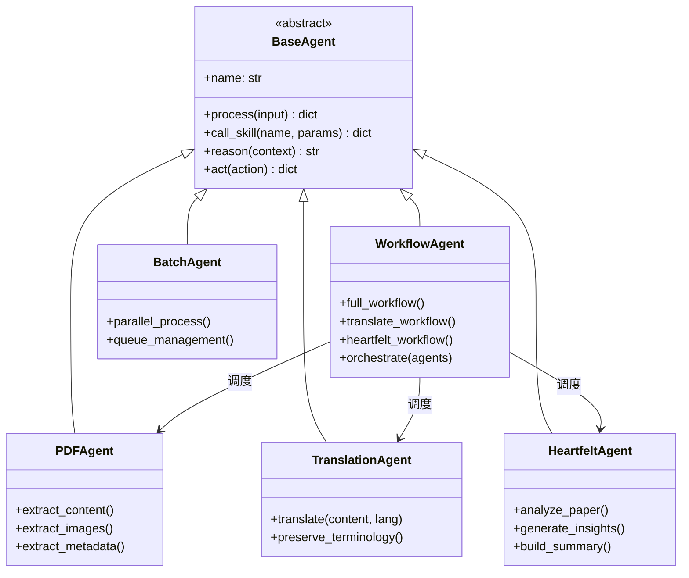
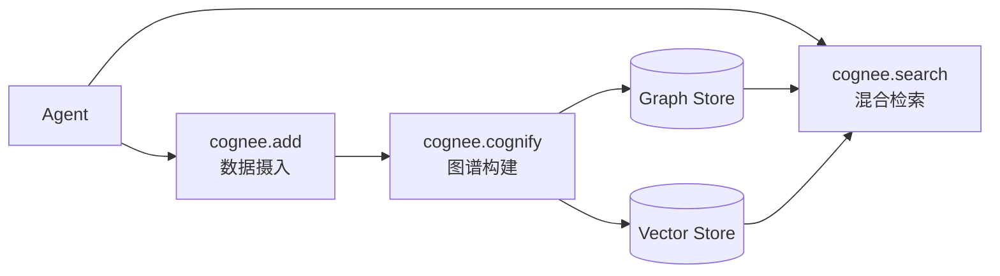
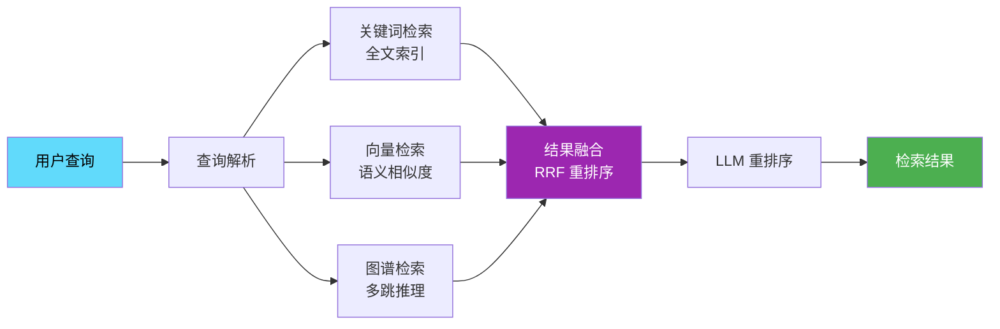

# 🏗️ 产品概要与系统架构

## 1. 产品概述

## 2. 系统架构

### 2.2 设计原则

| 原则           | 说明                                      |
| -------------- | ----------------------------------------- |
| **异步优先**   | 全链路异步处理，支持高并发论文处理        |
| **Agent 自治** | 每个 Agent 专注单一职责，通过编排层协作   |
| **认知增强**   | Cognee 提供跨会话长期记忆，避免上下文遗忘 |
| **混合检索**   | 关键词 + 向量 + 图谱三路融合，RRF 重排序  |
| **可观测性**   | 任务实时监控，WebSocket 推送进度          |
| **渐进增强**   | 文件系统起步，逐步引入向量库和图数据库    |

## 3. Agents 体系

### 3.1 双框架战略

| 框架           | 适用场景           | 优势                 |
| -------------- | ------------------ | -------------------- |
| **Claude SDK** | 原型开发、定制需求 | 灵活、快速迭代       |
| **Google ADK** | 生产环境、批量处理 | 高性能、企业级稳定性 |

### 3.2 Agents 协作

基于 **ReAct 框架**（Reasoning + Acting）设计，每个 Agent 交织推理与行动：



## 4. 认知体系

### 4.1 记忆系统 (Cognee)

基于 **Cognee** 框架，为 Agent 提供认知记忆层：

- **长期记忆**：跨会话持久化，避免上下文遗忘
- **语义记忆**：知识图谱存储实体关系
- **情景记忆**：保留处理历史和决策轨迹



### 4.2 知识图谱设计

**节点类型**：

| 节点          | 说明                                          |
| ------------- | --------------------------------------------- |
| `Paper`       | 论文实体                                      |
| `Author`      | 作者                                          |
| `Institution` | 机构                                          |
| `Concept`     | 核心概念（Chain-of-Thought, ReAct, Reflexion) |
| `Method`      | 方法论                                        |
| `Dataset`     | 数据集                                        |

**关系类型**：

| 关系           | 方向            | 说明       |
| -------------- | --------------- | ---------- |
| `AUTHORED_BY`  | Paper → Author  | 作者关系   |
| `CITES`        | Paper → Paper   | 引用关系   |
| `USES_METHOD`  | Paper → Method  | 使用方法   |
| `EXTENDS`      | Method → Method | 方法演进   |
| `EVALUATES_ON` | Paper → Dataset | 评估数据集 |

### 4.3 智能检索

基于 **Microsoft GraphRAG** 研究成果，利用 LLM 从论文中构建知识图谱，结合图机器学习增强检索：

- **解决传统 RAG 痛点**：跨文档"连点成线"能力不足
- **支持多跳推理**：如"哪些论文使用了与 ReAct 相似的方法？"
- **提供溯源能力**：检索结果可追溯到图谱节点

### 4.4 混合检索



### 4.5 评估指标 (RAGAS)

采用 **RAGAS 框架**评估检索与生成质量：

| 指标                  | 说明                         |
| --------------------- | ---------------------------- |
| **Faithfulness**      | 生成内容与检索上下文的一致性 |
| **Answer Relevancy**  | 答案与问题的相关性           |
| **Context Precision** | 检索上下文的信噪比           |
| **Context Recall**    | 相关信息的召回率             |

## 5. 前端架构

### 5.1 状态管理

| Store           | 职责                  | 持久化 |
| --------------- | --------------------- | ------ |
| `usePaperStore` | 论文 CRUD、筛选、分页 | ✅     |
| `useTaskStore`  | 任务监控、WebSocket   | ❌     |
| `useUIStore`    | 主题、通知、侧边栏    | ❌     |

### 5.2 API 客户端

```typescript
api.papers.list(params); // 论文列表
api.papers.upload(formData); // 上传论文
api.papers.process(id, workflow); // 处理论文
api.tasks.list(params); // 任务列表
api.search.papers(query); // 语义搜索
api.search.graph(query); // 图谱查询
```

### 5.3 测试策略

- **单元测试**：Vitest (`tests/ui/unit/`)
- **E2E 测试**：Playwright (`tests/ui/e2e/`)
- **浏览器覆盖**：Chromium, Firefox, WebKit, Mobile

## 6. API 设计

### 6.1 核心端点

| 路由                       | 方法 | 功能             |
| -------------------------- | ---- | ---------------- |
| `/api/papers`              | GET  | 论文列表（分页） |
| `/api/papers`              | POST | 上传论文         |
| `/api/papers/{id}`         | GET  | 论文详情         |
| `/api/papers/{id}/process` | POST | 启动处理工作流   |
| `/api/tasks`               | GET  | 任务列表         |
| `/api/tasks/{id}/cancel`   | POST | 取消任务         |
| `/api/search/papers`       | GET  | 语义搜索         |
| `/api/search/graph`        | POST | 图谱查询         |
| `/ws/tasks`                | WS   | 任务实时更新     |

### 6.2 数据模型

```python
class Paper(BaseModel):
    id: str
    title: str
    authors: list[str]
    abstract: str
    category: str
    status: Literal["pending", "processing", "translated", "analyzed"]
    uploaded_at: datetime
    metadata: dict
```

## 7. 实施路线

### 第一阶段：基础巩固 (当前)

- [x] Agent 层实现（5 个 Agent）
- [x] FastAPI 服务层
- [x] Claude Skills (Fallback)
- [x] Web UI MVP
- [ ] OceanBase 向量存储集成

### 第二阶段：智能增强 (Q1 2026)

- [ ] Cognee GraphRAG 集成
- [ ] 混合检索（关键词 + 向量 + 图谱）
- [ ] 论文关系图谱可视化
- [ ] 多跳推理问答
- [ ] RAGAS 评估体系

### 第三阶段：生态完善 (Q2 2026)

- [ ] 用户认证系统
- [ ] 个性化推荐
- [ ] 开放 API Platform
- [ ] 移动端适配

## 8. 参考资料

### 学术论文

| 论文                                                                      | 作者/机构          | 年份 | 核心贡献                        |
| ------------------------------------------------------------------------- | ------------------ | ---- | ------------------------------- |
| From Local to Global: A Graph RAG Approach to Query-Focused Summarization | Microsoft Research | 2024 | GraphRAG 架构，LLM 构建知识图谱 |
| ReAct: Synergizing Reasoning and Acting in Language Models                | Google/Princeton   | 2023 | 推理与行动交织框架              |
| Chain-of-Thought Prompting Elicits Reasoning in LLMs                      | Google             | 2022 | 链式思维推理                    |
| RAGAS: Automated Evaluation of RAG Systems                                | Explorium AI       | 2024 | RAG 系统评估指标体系            |

### 技术框架

| 框架                   | 链接                                      | 说明                  |
| ---------------------- | ----------------------------------------- | --------------------- |
| **Cognee**             | https://docs.cognee.ai/                   | AI 认知记忆框架       |
| **Microsoft GraphRAG** | https://github.com/microsoft/graphrag     | 知识图谱增强 RAG      |
| **Claude Agent SDK**   | https://docs.anthropic.com/en/docs/agents | Anthropic Agent 开发  |
| **Google ADK**         | https://google.github.io/adk-docs/        | Google Agent 开发套件 |
| **RAGAS**              | https://docs.ragas.io/                    | RAG 评估框架          |
| **LangGraph**          | https://langchain-ai.github.io/langgraph/ | 多 Agent 编排框架     |

---

_最后更新：2025 年 12 月_
