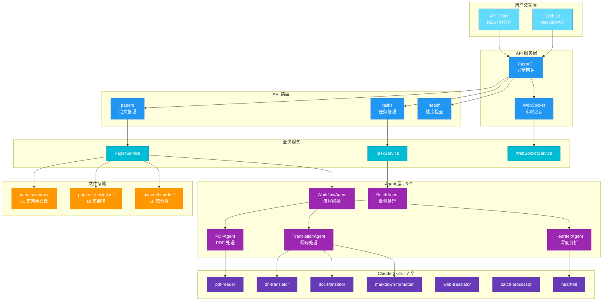
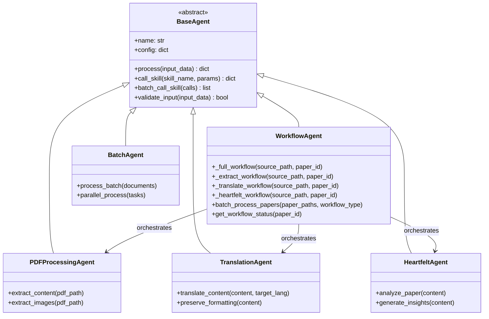

# 系统架构框架

## 架构总览

Agentic AI Papers 采用分层异步架构，包含 5 个核心 Agent、FastAPI 服务层和 Next.js 前端。



## 目录结构

```bash
agentic-ai-papers/
├── agents/                 # 后端核心
│   ├── api/               # FastAPI 服务
│   │   ├── main.py        # 应用入口
│   │   ├── routes/        # API 路由 (papers, tasks, websocket)
│   │   ├── services/      # 业务逻辑 (paper_service, task_service)
│   │   └── models/        # Pydantic 数据模型
│   ├── claude/            # Agent 实现
│   │   ├── base.py        # BaseAgent 抽象基类
│   │   ├── workflow_agent.py    # 工作流编排
│   │   ├── pdf_agent.py         # PDF 处理
│   │   ├── translation_agent.py # 翻译处理
│   │   ├── batch_agent.py       # 批量处理
│   │   ├── heartfelt_agent.py   # 深度分析
│   │   └── skills.py            # Skill 调用封装 (Fallback 实现)
│   └── core/              # 核心组件
│       ├── config.py      # 配置管理
│       ├── exceptions.py  # 异常处理
│       └── utils.py       # 工具函数
├── .claude/skills/        # 7 个 Claude Skills
├── ui/                    # Next.js 前端 (MVP)
│   └── src/
│       ├── app/           # App Router 页面
│       ├── components/    # React 组件
│       ├── hooks/         # 自定义 Hooks (useApi, useWebSocket)
│       ├── store/         # Zustand 状态管理
│       └── services/      # API 服务
├── papers/                # 论文存储
│   ├── source/            # 51 篇原始文档
│   ├── translation/       # 16 篇翻译
│   └── heartfelt/         # 16 篇深度分析
├── tests/                 # 测试套件 (82% 覆盖率)
└── docs/                  # 文档
```

## Agent 架构

采用 Agent-Skill 分层模式，通过 Fallback 实现规避 Claude SDK 依赖问题。



## 技术栈

| 层级     | 技术选型                          |
| -------- | --------------------------------- |
| 前端     | Next.js 14 + TypeScript + Zustand |
| 后端     | FastAPI + Python 3.12 + asyncio   |
| Agent    | 自研 Agent + Fallback Skills      |
| 测试     | Pytest + Vitest + Playwright      |
| PDF 处理 | pypdf2 + pdfplumber               |
| 代码质量 | Ruff + MyPy                       |
| CI/CD    | GitHub Actions                    |

## 关键技术决策

| 决策               | 原因                                | 影响            |
| ------------------ | ----------------------------------- | --------------- |
| Fallback Skills    | 规避 Claude SDK jsonschema 兼容问题 | 功能完整可用    |
| 文件系统存储       | 简化部署，降低运维复杂度            | 零数据库依赖    |
| 异步优先架构       | 优化资源利用率，支持高并发          | 3x 并发处理能力 |
| Next.js App Router | 现代 React 架构，支持 SSR/RSC       | 良好 SEO 支持   |
| Pydantic Models    | 类型安全的 API 数据验证             | 自动文档生成    |

## 当前状态

| 模块     | 状态          | 说明                   |
| -------- | ------------- | ---------------------- |
| Agent 层 | ✅ 已完成     | 5 个 Agent 全部实现    |
| API 层   | ✅ 已完成     | papers/tasks/websocket |
| Skills   | ✅ 已完成     | 7 个 Fallback Skills   |
| Web UI   | ✅ MVP 已实现 | Next.js 论文管理页面   |
| 测试     | ✅ 82% 覆盖率 | Pytest + Vitest        |
| 数据库   | ⏳ 进行中     | OceanBase 向量存储     |
| 知识图谱 | ⏳ 调研中     | Cognee GraphRAG        |

## 下一步计划

- **存储增强**：OceanBase 向量索引集成
- **智能检索**：混合检索（关键词 + 向量）
- **知识图谱**：Cognee 论文关联分析
- **用户系统**：认证与个性化推荐

---

_最后更新：2025 年 12 月_
