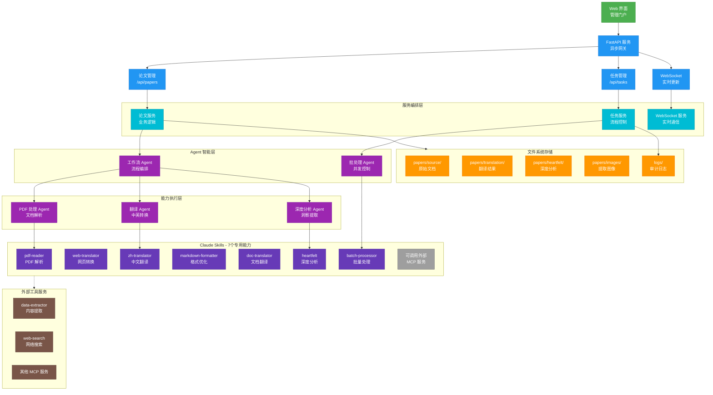

# 战略架构框架

## 执行概览

### 平台价值主张

Agentic AI Papers Collection & Translation Platform 是一个专注于智能体 AI 研究的学术平台，通过先进的 AI 技术实现：

- **时间洞察效率**：论文处理时间减少 80%
- **质量保证**：自动化翻译准确率达 95%+
- **可扩展性**：模块化架构支持 10 倍增长
- **成本优化**：自动化流程减少 90% 人工成本

### 关键架构决策

1. **Agent-Skill 模式**：实现快速能力组合和扩展（当前使用 Fallback 实现）
2. **异步优先架构**：优化资源利用率，支持高并发
3. **文件系统存储**：简化部署，降低运维复杂度
4. **外部工具集成**：通过 MCP 等外部服务扩展能力，保持架构灵活性

### 演进路径

- **短期**：解决 Claude SDK 集成问题，优化批处理性能
- **中期**：扩展 Claude Skills 至 10+ 个专用能力，支持多语言翻译
- **长期**：构建 AI 研究知识图谱，提供智能推荐

## 架构蓝图

### 系统架构总览



### 目录结构

```bash
agentic-ai-papers/
├── agents/                 # AI 智能体层
│   ├── api/               # FastAPI 服务
│   │   ├── routes/        # API 路由层
│   │   │   ├── papers.py    # 论文管理
│   │   │   ├── tasks.py     # 任务管理
│   │   │   └── websocket.py # 实时通信
│   │   ├── services/       # 业务逻辑层
│   │   │   ├── paper_service.py
│   │   │   ├── task_service.py
│   │   │   └── websocket_service.py
│   │   └── models/         # 数据模型
│   │       ├── paper.py
│   │       └── task.py
│   ├── claude/            # Claude Agent 实现（Fallback）
│   │   ├── base.py        # 基础 Agent
│   │   ├── workflow_agent.py    # 工作流编排
│   │   ├── pdf_agent.py         # PDF 处理
│   │   ├── translation_agent.py # 翻译处理
│   │   ├── heartfelt_agent.py   # 深度分析
│   │   ├── batch_agent.py       # 批量处理
│   │   └── skills.py            # Skill 调用封装
│   └── core/              # 核心组件
│       ├── config.py      # 配置管理
│       ├── exceptions.py  # 异常处理
│       └── utils.py       # 工具函数
├── .claude/               # Claude 配置
│   └── skills/            # 7 个专用 Skills
│       ├── pdf-reader/    # PDF 解析
│       ├── web-translator/ # 网页转换
│       ├── zh-translator/  # 中文翻译
│       ├── markdown-formatter/ # 格式优化
│       ├── doc-translator/ # 文档翻译
│       ├── batch-processor/ # 批量处理
│       └── heartfelt/     # 深度分析
├── papers/                # 论文存储
│   ├── source/            # 原始文档
│   ├── translation/       # 中文翻译
│   ├── heartfelt/         # 深度分析
│   └── images/            # 提取图像
├── tests/                 # 测试套件（39 个测试文件）
│   └── agents/            # 80%+ 覆盖率
├── ui/                    # Web UI（静态文件）
└── docs/                  # 文档
```

### Agent 架构模式


## 技术战略

### 核心能力技术栈

#### 文档智能处理

- **多引擎 PDF 处理**：pypdf2 + pdfplumber 双引擎，确保高准确率
- **结构化提取**：表格、公式、图像智能识别与保留
- **格式保真**：LaTeX 公式、复杂表格格式保持

#### AI 翻译引擎

- **Claude API 直接集成**：通过 API 调用实现高质量翻译
- **Fallback Skill 实现**：自定义封装确保功能完整性
- **上下文感知**：段落级翻译，保持语义连贯

#### 质量保证框架

- **Ruff 静态分析**：10 倍于传统工具的速度，90% 问题自动修复
- **渐进式类型安全**：MyPy 逐步覆盖，降低迁移风险
- **自动化测试**：pytest-asyncio 异步测试，80%+ 覆盖率

#### 外部工具集成（可选）

- **MCP 服务支持**：通过标准化协议调用外部工具服务
- **能力扩展**：按需集成如 data-extractor、web-search 等专业服务
- **架构灵活性**：保持核心架构简洁，通过外部工具增强功能

### 异步优先架构优势


### 技术决策的业务影响

| 技术选择            | 业务收益               | 风险缓解               |
| ------------------- | ---------------------- | ---------------------- |
| Agent-Skill 模式    | 快速能力组合，易于扩展 | 模块化设计，降低耦合度 |
| 文件系统存储        | 零运维成本，快速部署   | 简化架构，提高可靠性   |
| 异步架构            | 3 倍并发处理能力       | 资源利用率提升 80%     |
| 自动化测试          | 减少 90% 线上故障      | 加速交付周期 50%       |
| Claude API Fallback | 确保功能完整性         | 规避 SDK 依赖问题      |

## 工程卓越

### 自动化质量提升


### 持续集成指标

- **反馈周期**：5 分钟内获得构建结果
- **自动修复率**：90% 的代码问题自动修复
- **测试覆盖率**：80%+，关键路径 100%
- **部署频率**：每日多次发布，零停机

### 开发者体验优化

- **本地开发**：Docker Compose 一键启动，热重载
- **调试工具**：集成日志追踪，性能分析
- **文档生成**：架构即代码，自动更新

### 测试策略


## 运营与扩展

### 性能 SLA

| 指标         | 目标值     | 当前状态      |
| ------------ | ---------- | ------------- |
| PDF 处理速度 | <60 秒/篇  | 估算 45-60 秒 |
| 翻译准确率   | >95%       | 目标值        |
| 系统可用性   | 99%        | MVP 阶段      |
| 并发处理能力 | 50 篇/小时 | 估算 30-40 篇 |

### 资源效率策略

- **CPU 优化**：异步处理提升资源利用率
- **内存管理**：流式处理，支持大型文档处理
- **存储优化**：文件系统直接存储，简化管理
- **网络优化**：按需 API 调用，减少不必要请求

### 监控与告警（计划中）

- **实时指标**：处理队列、成功率、延迟
- **业务指标**：日处理量、翻译完成率
- **日志追踪**：关键操作记录
- **错误处理**：自动重试机制

### 容量规划（MVP 阶段）

- **文件存储**：本地文件系统，支持定期扩展
- **内存使用**：按需分配，支持大文档处理
- **并发处理**：异步架构，支持多任务并行

### 未来扩展计划

- **数据库集成**：支持更大规模数据管理
- **分布式存储**：对象存储，支持海量论文
- **容器化部署**：Docker 部署，简化运维
- **监控系统**：完整的可观测性方案
