# Agentic AI 学术研究与工程应用平台 - 实施计划方案

> **版本**：v1.0  
> **日期**：2025 年 12 月  
> **状态**：初稿  
> **基于**：[PRD & Architecture v1.1](./000-prd-architecture.md)

---

## 目录

1. [项目概述](#1-项目概述)
2. [实施规划](#2-实施规划)
3. [阶段一：基础巩固](#3-阶段一基础巩固)
4. [阶段二：智能增强](#4-阶段二智能增强)
5. [阶段三：认知增强](#5-阶段三认知增强)
6. [阶段四：生态完善](#6-阶段四生态完善)
7. [验证与质量保障](#7-验证与质量保障)
8. [风险与依赖管理](#8-风险与依赖管理)
9. [附录](#9-附录)

---

## 1. 项目概述

本实施计划基于 [PRD & Architecture v1.1](./000-prd-architecture.md) 制定，详细技术细节请参考相关研究文档。

**功能优先级**

| 优先级 | 功能分类 | 核心功能                                         |
| ------ | -------- | ------------------------------------------------ |
| **P0** | 核心功能 | 内容上传与管理、智能翻译、语义搜索、任务监控     |
| **P1** | 增强功能 | 知识图谱可视化、多跳推理问答、内容关联分析       |
| **P2** | 扩展功能 | 用户认证系统、个性化推荐、协作批注、API 开放平台 |

---

## 2. 实施规划

### 2.1 总体路线图

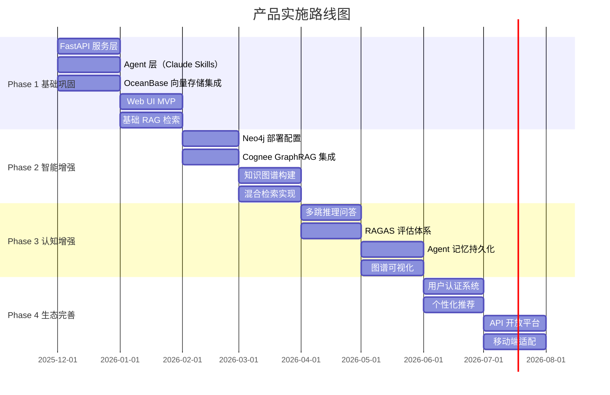

### 2.2 阶段目标概览

| 阶段        | 时间       | 目标     | 核心交付物                                   |
| ----------- | ---------- | -------- | -------------------------------------------- |
| **Phase 1** | Q4 2025    | 基础能力 | FastAPI 服务、Agent 层、向量检索、Web UI MVP |
| **Phase 2** | Q1-Q2 2026 | 智能增强 | Neo4j 图谱、Cognee 集成、混合检索            |
| **Phase 3** | Q1-Q2 2026 | 认知增强 | 多跳推理、RAGAS 评估、记忆持久化             |
| **Phase 4** | Q2-Q3 2026 | 生态完善 | 用户系统、推荐系统、API 平台                 |

### 2.3 里程碑检查点

| 里程碑 | 日期    | 验收标准                                            |
| ------ | ------- | --------------------------------------------------- |
| **M1** | 2026-01 | 单内容完整处理流程可用（上传 → 解析 → 翻译 → 分析） |
| **M2** | 2026-02 | Web UI MVP 上线，基础 RAG 检索可用                  |
| **M3** | 2026-04 | 知识图谱构建完成，混合检索实现                      |
| **M4** | 2026-06 | 多跳推理问答可用，RAGAS 评估达标                    |
| **M5** | 2026-08 | 完整平台上线，包含用户系统和 API 平台               |

---

## 3. 阶段一：基础巩固

> **时间**：2025-12 ~ 2026-02  
> **目标**：构建核心处理流程，实现单内容完整处理链路（上传 → 解析 → 翻译 → 分析）

### 3.1 任务分解

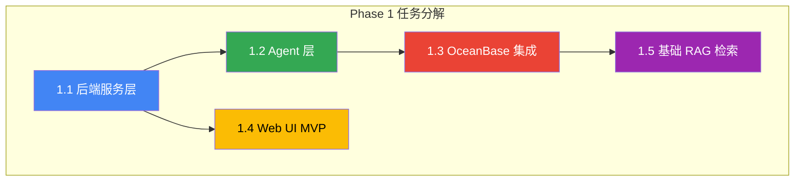

### 3.2 任务 1.1：后端服务层

**目标**：基于 FastAPI 构建异步高性能后端服务

#### 3.2.1 目录结构

```shell
cognizes/
├── api/
│   ├── __init__.py
│   ├── main.py                    # FastAPI 应用入口
│   ├── routes/
│   │   ├── sources.py             # 内容管理 API
│   │   ├── tasks.py               # 任务管理 API
│   │   ├── search.py              # 搜索 API
│   │   └── health.py              # 健康检查
│   ├── services/
│   │   ├── source_service.py      # 内容服务
│   │   ├── task_service.py        # 任务服务
│   │   └── search_service.py      # 搜索服务
│   └── websocket/
│       └── task_events.py         # WebSocket 任务事件
├── core/
│   ├── config.py                  # 配置管理
│   ├── database.py                # 数据库连接
│   ├── exceptions.py              # 异常定义
│   └── models/                    # Pydantic 模型
└── agents/                        # Agent 层 (Task 1.2)
```

#### 3.2.2 核心 API 设计

| 端点                        | 方法   | 功能             | 请求体/参数                     |
| --------------------------- | ------ | ---------------- | ------------------------------- |
| `/api/v1/sources`           | POST   | 上传内容         | `multipart/form-data`           |
| `/api/v1/sources`           | GET    | 列表查询         | `?page=1&size=20&status=`       |
| `/api/v1/sources/{id}`      | GET    | 获取详情         | -                               |
| `/api/v1/sources/{id}`      | DELETE | 删除内容         | -                               |
| `/api/v1/tasks`             | GET    | 任务列表         | `?status=pending`               |
| `/api/v1/tasks/{id}/cancel` | POST   | 取消任务         | -                               |
| `/api/v1/tasks/{id}/retry`  | POST   | 重试任务         | -                               |
| `/api/v1/search`            | POST   | 语义搜索         | `{"query": "...", "limit": 10}` |
| `/ws/tasks`                 | WS     | 任务状态实时推送 | -                               |

#### 3.2.3 验收标准

| 验收项         | 标准                     | 验证方式   |
| -------------- | ------------------------ | ---------- |
| API 响应时间   | < 500ms (P95)            | 性能测试   |
| 并发处理能力   | 支持 100+ 并发上传       | 压力测试   |
| WebSocket 连接 | 支持 1000+ 同时连接      | 连接测试   |
| 异常处理       | 统一错误响应格式         | 代码审查   |
| API 文档       | Swagger/OpenAPI 自动生成 | 访问 /docs |

### 3.3 任务 1.2：Agent 层

**目标**：基于 Claude SDK 实现核心 Agent，完成内容处理流程

#### 3.3.1 Agent 目录结构

```shell
cognizes/agents/
├── claude/
│   ├── base.py                    # BaseAgent 抽象基类
│   ├── coordinator_agent.py       # 中央协调 Agent
│   ├── reader_agent.py            # 多源内容解析 Agent
│   ├── translation_agent.py       # 翻译 Agent
│   ├── heartfelt_agent.py         # 深度分析 Agent
│   └── skills.py                  # Skill 调用封装
└── adk/                           # Phase 2 实现
```

#### 3.3.2 Agent 实现要点

**BaseAgent 接口规范**：

```python
class BaseAgent(ABC):
    """Agent 抽象基类"""

    @abstractmethod
    async def process(self, input_data: Dict) -> Dict:
        """处理输入，返回结果"""
        pass

    def reason(self, context: str) -> str:
        """基于上下文推理"""
        pass

    async def call_skill(self, skill_name: str, params: Dict) -> Dict:
        """调用 Claude Skill"""
        pass
```

**Reader Agent 支持格式**：

| 格式  | 解析库         | 优先级 |
| ----- | -------------- | ------ |
| PDF   | PyMuPDF (fitz) | P0     |
| MD    | markdown-it-py | P0     |
| DOCX  | python-docx    | P1     |
| URL   | httpx + bs4    | P0     |
| arXiv | arxiv API      | P1     |

**Translation Agent 策略**：

1. 保留学术术语（Chain-of-Thought, ReAct, RAG 等）
2. 分块翻译处理长文本（每块 < 4000 tokens）
3. 保持原文 Markdown 结构

#### 3.3.3 验收标准

| 验收项         | 标准                      | 验证方式 |
| -------------- | ------------------------- | -------- |
| PDF 解析准确率 | > 95% 文本提取正确        | 样本测试 |
| 翻译质量       | 术语保留 100%，BLEU > 0.7 | 人工评估 |
| 流程完整性     | 端到端流程无中断          | E2E 测试 |
| 元数据提取     | 准确率 > 90%              | 样本验证 |

### 3.4 任务 1.3：OceanBase 集成

**目标**：集成 OceanBase 向量数据库，实现内容存储与向量检索

#### 3.4.1 Schema 创建脚本

```sql
-- 1. 创建数据库
CREATE DATABASE IF NOT EXISTS cognizes DEFAULT CHARSET utf8mb4;

-- 2. 内容元数据表
CREATE TABLE sources (
    id BIGINT PRIMARY KEY AUTO_INCREMENT,
    source_type ENUM('paper', 'article', 'document', 'code_repo') NOT NULL,
    title VARCHAR(500) NOT NULL,
    abstract TEXT,
    authors JSON,
    url VARCHAR(1000),
    format VARCHAR(50),
    publication_date DATE,
    category VARCHAR(100),
    status ENUM('pending', 'processing', 'translated', 'analyzed') DEFAULT 'pending',
    metadata JSON,
    file_path VARCHAR(1000),
    translation_path VARCHAR(1000),
    analysis_path VARCHAR(1000),
    created_at TIMESTAMP DEFAULT CURRENT_TIMESTAMP,
    updated_at TIMESTAMP DEFAULT CURRENT_TIMESTAMP ON UPDATE CURRENT_TIMESTAMP
);

-- 3. 向量表
CREATE TABLE source_embeddings (
    id BIGINT PRIMARY KEY AUTO_INCREMENT,
    source_id BIGINT NOT NULL,
    chunk_index INT DEFAULT 0,
    chunk_text TEXT,
    embedding VECTOR(1536),
    FOREIGN KEY (source_id) REFERENCES sources(id) ON DELETE CASCADE
);

-- 4. HNSW 向量索引
CREATE INDEX idx_embedding_hnsw ON source_embeddings
USING HNSW (embedding vector_cosine_ops)
WITH (m = 16, ef_construction = 128);

-- 5. 任务表
CREATE TABLE tasks (
    id BIGINT PRIMARY KEY AUTO_INCREMENT,
    source_id BIGINT,
    task_type ENUM('parse', 'translate', 'analyze', 'full') NOT NULL,
    status ENUM('pending', 'running', 'completed', 'failed', 'cancelled') DEFAULT 'pending',
    progress FLOAT DEFAULT 0,
    error_message TEXT,
    started_at TIMESTAMP,
    completed_at TIMESTAMP,
    created_at TIMESTAMP DEFAULT CURRENT_TIMESTAMP,
    FOREIGN KEY (source_id) REFERENCES sources(id) ON DELETE CASCADE
);
```

#### 3.4.2 验收标准

| 验收项     | 标准              | 验证方式     |
| ---------- | ----------------- | ------------ |
| 数据库连接 | 连接池正常工作    | 连接测试     |
| CRUD 操作  | 增删改查正常      | 单元测试     |
| 向量索引   | HNSW 索引正确创建 | EXPLAIN 验证 |
| 相似度搜索 | Top-K 结果正确    | 准确率测试   |
| 检索延迟   | < 100ms (P95)     | 性能测试     |

### 3.5 任务 1.4：Web UI MVP

**目标**：构建基础 Web 界面，支持内容上传、列表查看、任务监控

#### 3.5.1 目录结构

```shell
ui/src/
├── app/
│   ├── layout.tsx             # 全局布局
│   ├── page.tsx               # 首页（仪表板）
│   ├── sources/
│   │   ├── page.tsx           # 内容列表
│   │   ├── [id]/page.tsx      # 内容详情
│   │   └── upload/page.tsx    # 上传页面
│   ├── tasks/page.tsx         # 任务监控
│   └── search/page.tsx        # 搜索页面
├── components/
│   ├── SourceCard.tsx         # 内容卡片
│   ├── UploadZone.tsx         # 上传区域
│   ├── TaskList.tsx           # 任务列表
│   └── SearchBox.tsx          # 搜索框
├── hooks/
│   ├── useApi.ts              # API 调用
│   └── useWebSocket.ts        # WebSocket 连接
└── store/
    ├── sourceStore.ts         # 内容状态 (Zustand)
    └── taskStore.ts           # 任务状态 (Zustand)
```

#### 3.5.2 核心功能页面

| 页面     | 功能                               | 优先级 |
| -------- | ---------------------------------- | ------ |
| 仪表板   | 统计概览、最近活动                 | P0     |
| 内容列表 | 表格展示、排序、筛选、分页         | P0     |
| 上传页面 | 拖拽上传、批量上传、进度显示       | P0     |
| 任务监控 | 实时状态、WebSocket 推送、取消重试 | P0     |
| 搜索页面 | 语义搜索、结果高亮                 | P1     |
| 内容详情 | Tab 切换（原文/翻译/分析）         | P1     |

#### 3.5.3 验收标准

| 验收项       | 标准                | 验证方式   |
| ------------ | ------------------- | ---------- |
| 页面加载     | < 2s (首屏)         | Lighthouse |
| 文件上传     | 50MB 文件 < 30s     | 功能测试   |
| 任务实时更新 | WebSocket 延迟 < 1s | 连接测试   |
| 响应式设计   | 适配移动端          | 视觉测试   |

### 3.6 任务 1.5：基础 RAG 检索

**目标**：实现基于向量的语义检索功能

#### 3.6.1 检索流程

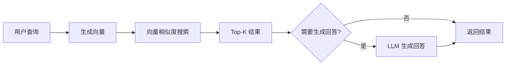

#### 3.6.2 验收标准

| 验收项       | 标准                      | 验证方式   |
| ------------ | ------------------------- | ---------- |
| 检索响应时间 | < 500ms                   | 性能测试   |
| 检索准确率   | 相关结果占 Top-10 的 80%+ | 人工评估   |
| 回答质量     | Faithfulness > 85%        | RAGAS 评估 |

### 3.7 阶段一验收清单

| 检查项                 | 状态 | 验收日期 |
| ---------------------- | ---- | -------- |
| FastAPI 服务启动正常   | ☐    |          |
| API 文档可访问 (/docs) | ☐    |          |
| WebSocket 连接正常     | ☐    |          |
| Reader Agent 解析 PDF  | ☐    |          |
| Translation Agent 翻译 | ☐    |          |
| Heartfelt Agent 分析   | ☐    |          |
| 完整流程端到端可用     | ☐    |          |
| OceanBase 连接正常     | ☐    |          |
| 向量索引创建成功       | ☐    |          |
| 向量检索功能可用       | ☐    |          |
| Web UI 首页可访问      | ☐    |          |
| 文件上传功能正常       | ☐    |          |
| 任务监控实时更新       | ☐    |          |
| 语义搜索功能可用       | ☐    |          |
| 测试覆盖率 > 80%       | ☐    |          |

---

## 4. 阶段二：智能增强

> **时间**：2026-02 ~ 2026-04  
> **目标**：集成 Neo4j 与 Cognee，构建知识图谱与混合检索能力

### 4.1 任务分解

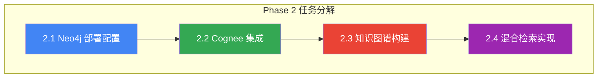

### 4.2 任务 2.1：Neo4j 部署配置

**目标**：部署 Neo4j 图数据库，创建知识图谱 Schema

#### 4.2.1 部署方式

| 环境 | 部署方式           | 配置                   |
| ---- | ------------------ | ---------------------- |
| 开发 | Docker Compose     | 单节点，社区版         |
| 测试 | Docker Compose     | 单节点，企业版（可选） |
| 生产 | Neo4j AuraDB / K8s | 集群模式，企业版       |

**Docker Compose 配置**：

```yaml
version: "3.8"
services:
  neo4j:
    image: neo4j:2025-community
    ports:
      - "7474:7474" # HTTP
      - "7687:7687" # Bolt
    environment:
      - NEO4J_AUTH=neo4j/password
      - NEO4J_PLUGINS=["apoc", "graph-data-science"]
    volumes:
      - neo4j_data:/data
      - neo4j_logs:/logs
    healthcheck:
      test: ["CMD", "curl", "-f", "http://localhost:7474"]
      interval: 30s
      timeout: 10s
      retries: 3

volumes:
  neo4j_data:
  neo4j_logs:
```

#### 4.2.2 Schema 创建

```cypher
// 1. 创建约束 - 确保唯一性
CREATE CONSTRAINT source_id_unique FOR (s:Source) REQUIRE s.id IS UNIQUE;
CREATE CONSTRAINT paper_id_unique FOR (p:Paper) REQUIRE p.id IS UNIQUE;
CREATE CONSTRAINT article_id_unique FOR (a:Article) REQUIRE a.id IS UNIQUE;
CREATE CONSTRAINT author_name_unique FOR (a:Author) REQUIRE a.name IS UNIQUE;
CREATE CONSTRAINT concept_name_unique FOR (c:Concept) REQUIRE c.name IS UNIQUE;
CREATE CONSTRAINT method_name_unique FOR (m:Method) REQUIRE m.name IS UNIQUE;

// 2. 创建向量索引
CREATE VECTOR INDEX source_embedding FOR (s:Source) ON (s.embedding)
OPTIONS {
  indexConfig: {
    `vector.dimensions`: 1536,
    `vector.similarity_function`: 'cosine'
  }
};

// 3. 创建全文索引
CREATE FULLTEXT INDEX source_fulltext FOR (s:Source) ON EACH [s.title, s.abstract];
```

#### 4.2.3 验收标准

| 验收项         | 标准                  | 验证方式         |
| -------------- | --------------------- | ---------------- |
| Neo4j 服务启动 | 健康检查通过          | 端口测试         |
| 约束创建成功   | 6 个唯一性约束        | SHOW CONSTRAINTS |
| 向量索引创建   | cosine 相似度索引可用 | SHOW INDEXES     |
| Python 连接    | neo4j-driver 正常连接 | 连接测试         |

### 4.3 任务 2.2：Cognee 集成

**目标**：集成 Cognee 框架，配置三存储架构

#### 4.3.1 Cognee 配置

```python
# cognizes/core/cognee_config.py
import cognee
from cognee.infrastructure.databases.graph import Neo4jConfig
from cognee.infrastructure.databases.vector import QdrantConfig

async def init_cognee():
    """初始化 Cognee 配置"""

    # 1. 配置 LLM
    cognee.config.set_llm_api_key(os.getenv("ANTHROPIC_API_KEY"))
    cognee.config.set_llm_provider("anthropic")
    cognee.config.set_llm_model("claude-sonnet-4-20250514")

    # 2. 配置 Embedding
    cognee.config.set_embedding_provider("openai")
    cognee.config.set_embedding_model("text-embedding-3-small")

    # 3. 配置图存储 (Neo4j)
    cognee.config.set_graph_db_config(Neo4jConfig(
        uri=os.getenv("NEO4J_URI", "bolt://localhost:7687"),
        username=os.getenv("NEO4J_USER", "neo4j"),
        password=os.getenv("NEO4J_PASSWORD", "password")
    ))

    # 4. 配置向量存储 (使用 OceanBase 或 Qdrant)
    # 注：Cognee 原生支持 Qdrant，OceanBase 需自定义适配器

    # 5. 重置数据（可选，开发时使用）
    # await cognee.prune.prune_data()
    # await cognee.prune.prune_system(metadata=True)
```

#### 4.3.2 Cognee 服务封装

```python
# cognizes/core/memory.py
import cognee
from typing import List, Dict, Any

class CogneeMemory:
    """Cognee 认知记忆层封装"""

    async def add_content(self, content: str, dataset: str = "default") -> None:
        """添加内容到记忆层"""
        await cognee.add(content, dataset_name=dataset)

    async def add_file(self, file_path: str, dataset: str = "default") -> None:
        """添加文件到记忆层"""
        await cognee.add(file_path, dataset_name=dataset)

    async def cognify(self) -> None:
        """处理数据，构建知识图谱"""
        await cognee.cognify()

    async def search(self, query: str, search_type: str = "INSIGHTS") -> List[Dict]:
        """混合检索"""
        results = await cognee.search(
            query_text=query,
            query_type=search_type  # INSIGHTS, SUMMARIES, CHUNKS, GRAPH_COMPLETION
        )
        return results

    async def get_graph_data(self) -> Dict[str, Any]:
        """获取图谱数据（用于可视化）"""
        graph = await cognee.get_knowledge_graph()
        return {
            "nodes": [{"id": n.id, "label": n.name, "type": type(n).__name__}
                      for n in graph.nodes],
            "edges": [{"source": e.source_id, "target": e.target_id, "type": e.type}
                      for e in graph.edges]
        }
```

#### 4.3.3 验收标准

| 验收项         | 标准         | 验证方式 |
| -------------- | ------------ | -------- |
| Cognee 初始化  | 无报错启动   | 日志检查 |
| cognee.add     | 成功添加文档 | API 测试 |
| cognee.cognify | 成功构建图谱 | 图谱查询 |
| cognee.search  | 返回相关结果 | 检索测试 |

### 4.4 任务 2.3：知识图谱构建

**目标**：实现内容到知识图谱的自动转换

#### 4.4.1 实体抽取流程

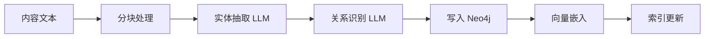

#### 4.4.2 自定义实体抽取

```python
# cognizes/agents/claude/entity_extractor.py
from typing import List, Dict
import anthropic

class EntityExtractor:
    """实体和关系抽取器"""

    ENTITY_TYPES = ["Paper", "Author", "Concept", "Method", "Framework", "Dataset"]
    RELATION_TYPES = ["AUTHORED_BY", "CITES", "USES_METHOD", "INTRODUCES", "EXTENDS"]

    def __init__(self):
        self.client = anthropic.Anthropic()

    async def extract(self, content: str) -> Dict:
        """从内容中抽取实体和关系"""
        prompt = f"""从以下学术内容中抽取实体和关系。

实体类型：{', '.join(self.ENTITY_TYPES)}
关系类型：{', '.join(self.RELATION_TYPES)}

内容：
{content[:4000]}

请返回 JSON 格式：
{{
    "entities": [
        {{"type": "...", "name": "...", "properties": {{...}}}}
    ],
    "relations": [
        {{"type": "...", "source": "...", "target": "...", "properties": {{...}}}}
    ]
}}
"""
        response = self.client.messages.create(
            model="claude-sonnet-4-20250514",
            max_tokens=4096,
            messages=[{"role": "user", "content": prompt}]
        )
        return self._parse_response(response.content[0].text)
```

#### 4.4.3 验收标准

| 验收项         | 标准             | 验证方式   |
| -------------- | ---------------- | ---------- |
| 实体抽取准确率 | > 80%            | 人工评估   |
| 关系识别准确率 | > 75%            | 人工评估   |
| 图谱完整性     | 核心实体全部入图 | 图遍历验证 |

### 4.5 任务 2.4：混合检索实现

**目标**：实现关键词 + 向量 + 图谱的三路混合检索

#### 4.5.1 混合检索架构

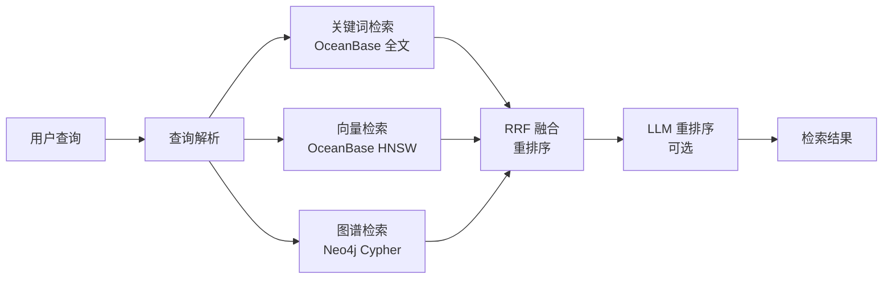

#### 4.5.2 RRF 融合算法

```python
# cognizes/api/services/hybrid_search.py
from typing import List, Dict

def reciprocal_rank_fusion(
    results_list: List[List[Dict]],
    k: int = 60
) -> List[Dict]:
    """RRF 融合多路检索结果

    RRF Score = Σ 1/(k + rank_i) for each result list
    """
    scores = {}

    for results in results_list:
        for rank, item in enumerate(results, 1):
            doc_id = item["id"]
            if doc_id not in scores:
                scores[doc_id] = {"item": item, "score": 0}
            scores[doc_id]["score"] += 1 / (k + rank)

    # 按分数排序
    sorted_results = sorted(
        scores.values(),
        key=lambda x: x["score"],
        reverse=True
    )

    return [r["item"] for r in sorted_results]
```

#### 4.5.3 智能路由器

```python
# cognizes/api/services/search_router.py
from enum import Enum

class QueryType(Enum):
    FACTUAL = "factual"      # 事实查询 → 向量检索
    RELATIONAL = "relational" # 关系查询 → 图谱检索
    COMPLEX = "complex"       # 复杂查询 → 混合检索

class SearchRouter:
    """智能查询路由器"""

    async def classify(self, query: str) -> QueryType:
        """分类查询类型"""
        # 使用 LLM 或规则判断查询类型
        if any(kw in query for kw in ["关系", "引用", "使用了", "基于"]):
            return QueryType.RELATIONAL
        elif any(kw in query for kw in ["什么是", "定义", "解释"]):
            return QueryType.FACTUAL
        else:
            return QueryType.COMPLEX

    async def route(self, query: str) -> List[str]:
        """返回应使用的检索方法"""
        query_type = await self.classify(query)

        if query_type == QueryType.FACTUAL:
            return ["vector"]
        elif query_type == QueryType.RELATIONAL:
            return ["graph", "vector"]
        else:
            return ["keyword", "vector", "graph"]
```

#### 4.5.4 验收标准

| 验收项       | 标准               | 验证方式 |
| ------------ | ------------------ | -------- |
| 三路检索可用 | 全部正常返回结果   | 功能测试 |
| RRF 融合正确 | 排序符合预期       | 单元测试 |
| 混合检索质量 | Precision@10 > 70% | 评估测试 |
| 响应时间     | < 1s               | 性能测试 |

### 4.6 阶段二验收清单

| 检查项                  | 状态 | 验收日期 |
| ----------------------- | ---- | -------- |
| Neo4j 服务正常          | ☐    |          |
| Neo4j Schema 创建完成   | ☐    |          |
| Cognee 初始化成功       | ☐    |          |
| cognee.add 功能正常     | ☐    |          |
| cognee.cognify 功能正常 | ☐    |          |
| 实体抽取功能可用        | ☐    |          |
| 知识图谱数据可查询      | ☐    |          |
| 关键词检索可用          | ☐    |          |
| 向量检索可用            | ☐    |          |
| 图谱检索可用            | ☐    |          |
| RRF 混合检索可用        | ☐    |          |
| 测试覆盖率 > 85%        | ☐    |          |

---

## 5. 阶段三：认知增强

> **时间**：2026-04 ~ 2026-06  
> **目标**：实现多跳推理问答、建立 RAGAS 评估体系、Agent 记忆持久化

### 5.1 任务分解

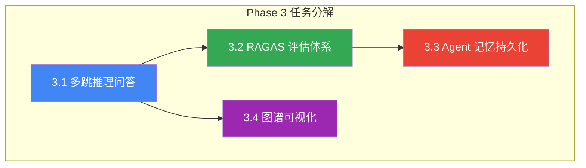

### 5.2 任务 3.1：多跳推理问答

**目标**：实现基于 Agentic RAG 的复杂问题推理

#### 5.2.1 Agentic RAG 架构

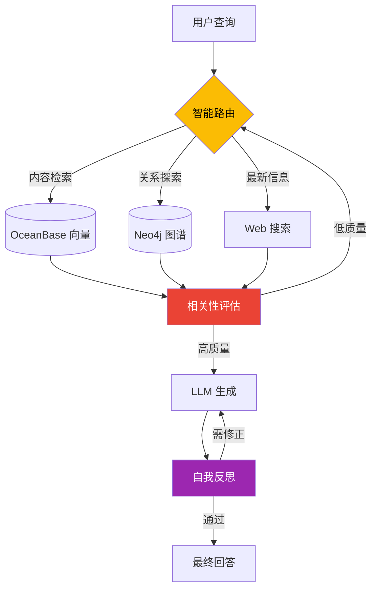

#### 5.2.2 多步推理实现

```python
# cognizes/agents/claude/reasoning_agent.py
from typing import List, Dict
from enum import Enum

class ReasoningStep(Enum):
    DECOMPOSE = "decompose"    # 分解问题
    RETRIEVE = "retrieve"      # 检索信息
    REASON = "reason"          # 推理分析
    SYNTHESIZE = "synthesize"  # 综合回答
    REFLECT = "reflect"        # 反思验证

class MultiHopReasoningAgent:
    """多跳推理 Agent"""

    async def answer(self, query: str) -> Dict:
        """执行多跳推理回答问题"""

        # Step 1: 分解复杂问题
        sub_questions = await self._decompose(query)

        # Step 2: 逐个回答子问题
        sub_answers = []
        for sq in sub_questions:
            # 检索相关内容
            context = await self._retrieve(sq)
            # 生成子答案
            answer = await self._reason(sq, context)
            sub_answers.append({"question": sq, "answer": answer})

        # Step 3: 综合最终答案
        final_answer = await self._synthesize(query, sub_answers)

        # Step 4: 自我反思与验证
        reflection = await self._reflect(query, final_answer)

        if reflection["needs_revision"]:
            final_answer = await self._revise(final_answer, reflection)

        return {
            "query": query,
            "sub_questions": sub_questions,
            "sub_answers": sub_answers,
            "answer": final_answer,
            "confidence": reflection["confidence"],
            "sources": self._collect_sources(sub_answers)
        }
```

#### 5.2.3 验收标准

| 验收项       | 标准                   | 验证方式   |
| ------------ | ---------------------- | ---------- |
| 问题分解准确 | 子问题覆盖完整         | 人工评估   |
| 多跳检索有效 | 能发现间接关联         | 案例测试   |
| 回答质量     | Answer Relevancy > 90% | RAGAS 评估 |
| 推理可解释   | 包含推理过程           | 输出检查   |

### 5.3 任务 3.2：RAGAS 评估体系

**目标**：建立基于 RAGAS 的检索与生成质量评估体系

#### 5.3.1 评估指标

| 指标                  | 说明                       | 目标值 |
| --------------------- | -------------------------- | ------ |
| **Faithfulness**      | 生成内容与检索上下文一致性 | > 85%  |
| **Answer Relevancy**  | 答案与问题相关性           | > 90%  |
| **Context Precision** | 检索上下文信噪比           | > 80%  |
| **Context Recall**    | 相关信息召回率             | > 85%  |

#### 5.3.2 评估实现

```python
# cognizes/core/evaluation.py
from ragas import evaluate
from ragas.metrics import (
    faithfulness,
    answer_relevancy,
    context_precision,
    context_recall
)
from datasets import Dataset

class RAGASEvaluator:
    """RAGAS 评估器"""

    def __init__(self):
        self.metrics = [
            faithfulness,
            answer_relevancy,
            context_precision,
            context_recall
        ]

    async def evaluate(self, test_cases: List[Dict]) -> Dict:
        """评估 RAG 系统质量"""

        # 构建数据集
        dataset = Dataset.from_dict({
            "question": [tc["question"] for tc in test_cases],
            "answer": [tc["answer"] for tc in test_cases],
            "contexts": [tc["contexts"] for tc in test_cases],
            "ground_truth": [tc.get("ground_truth", "") for tc in test_cases]
        })

        # 执行评估
        results = evaluate(dataset, metrics=self.metrics)

        return {
            "faithfulness": results["faithfulness"],
            "answer_relevancy": results["answer_relevancy"],
            "context_precision": results["context_precision"],
            "context_recall": results["context_recall"],
            "overall_score": sum(results.values()) / len(results)
        }
```

#### 5.3.3 验收标准

| 验收项       | 标准                | 验证方式 |
| ------------ | ------------------- | -------- |
| 评估管道运行 | 无报错完成评估      | 功能测试 |
| 评估数据集   | 至少 100 条测试用例 | 数据检查 |
| 指标达标     | 四项指标全部达标    | 评估运行 |

### 5.4 任务 3.3：Agent 记忆持久化

**目标**：实现 Agent 跨会话记忆持久化

#### 5.4.1 记忆类型

| 类型     | 存储位置  | 保留周期 | 用途               |
| -------- | --------- | -------- | ------------------ |
| 短期记忆 | 内存      | 会话内   | 当前对话上下文     |
| 长期记忆 | OceanBase | 永久     | 用户偏好、历史交互 |
| 情景记忆 | Neo4j     | 永久     | 处理历史、决策轨迹 |
| 语义记忆 | Cognee    | 永久     | 知识图谱、实体关系 |

#### 5.4.2 记忆管理器

```python
# cognizes/core/memory_manager.py
from typing import Dict, Any, Optional

class MemoryManager:
    """Agent 记忆管理器"""

    def __init__(self, user_id: str, session_id: str):
        self.user_id = user_id
        self.session_id = session_id
        self.short_term = []  # 短期记忆（内存）

    async def remember(self, content: str, memory_type: str = "short") -> None:
        """存储记忆"""
        if memory_type == "short":
            self.short_term.append({
                "content": content,
                "timestamp": datetime.now().isoformat()
            })
        elif memory_type == "long":
            await self._store_long_term(content)
        elif memory_type == "episodic":
            await self._store_episodic(content)

    async def recall(self, query: str, memory_type: str = "all") -> List[Dict]:
        """检索相关记忆"""
        results = []

        if memory_type in ["short", "all"]:
            results.extend(self._search_short_term(query))
        if memory_type in ["long", "all"]:
            results.extend(await self._search_long_term(query))
        if memory_type in ["episodic", "all"]:
            results.extend(await self._search_episodic(query))

        return results

    async def consolidate(self) -> None:
        """记忆固化：将短期记忆转移到长期记忆"""
        for memory in self.short_term:
            await self._store_long_term(memory["content"])
        self.short_term.clear()
```

#### 5.4.3 验收标准

| 验收项       | 标准             | 验证方式   |
| ------------ | ---------------- | ---------- |
| 短期记忆有效 | 会话内上下文保持 | 会话测试   |
| 长期记忆持久 | 重启后记忆保留   | 持久化测试 |
| 记忆检索准确 | 相关记忆正确召回 | 检索测试   |

### 5.5 任务 3.4：图谱可视化

**目标**：实现知识图谱的交互式可视化

#### 5.5.1 技术选型

| 技术            | 用途         | 特点           |
| --------------- | ------------ | -------------- |
| **vis-network** | 图可视化组件 | 轻量、易集成   |
| **D3.js**       | 备选方案     | 功能强大、复杂 |
| **Cytoscape**   | 备选方案     | 专业图可视化   |

#### 5.5.2 可视化 API

```python
# cognizes/api/routes/graph.py
from fastapi import APIRouter

router = APIRouter(prefix="/api/v1/graph", tags=["graph"])

@router.get("/")
async def get_graph_data(
    center_id: Optional[str] = None,
    depth: int = 2,
    limit: int = 100
):
    """获取图谱数据用于可视化"""

    if center_id:
        # 以某节点为中心展开
        query = """
        MATCH path = (center)-[*1..{depth}]-(related)
        WHERE center.id = $center_id
        RETURN path LIMIT $limit
        """
    else:
        # 获取全局概览
        query = """
        MATCH (n) OPTIONAL MATCH (n)-[r]->(m)
        RETURN n, r, m LIMIT $limit
        """

    # 执行查询并格式化为 vis-network 格式
    return {
        "nodes": [...],
        "edges": [...]
    }
```

#### 5.5.3 前端组件

```typescript
// ui/src/components/KnowledgeGraph.tsx
"use client";
import { useEffect, useRef } from "react";
import { Network } from "vis-network";

interface GraphProps {
  centerId?: string;
  depth?: number;
}

export function KnowledgeGraph({ centerId, depth = 2 }: GraphProps) {
  const containerRef = useRef<HTMLDivElement>(null);

  useEffect(() => {
    const fetchAndRender = async () => {
      const response = await fetch(
        `/api/v1/graph?center_id=${centerId}&depth=${depth}`
      );
      const data = await response.json();

      if (containerRef.current) {
        new Network(containerRef.current, data, {
          nodes: {
            shape: "dot",
            scaling: { min: 10, max: 30 },
          },
          edges: {
            arrows: "to",
            smooth: { type: "curvedCW" },
          },
          physics: {
            stabilization: { iterations: 100 },
          },
        });
      }
    };

    fetchAndRender();
  }, [centerId, depth]);

  return <div ref={containerRef} className="w-full h-[600px]" />;
}
```

#### 5.5.4 验收标准

| 验收项       | 标准                 | 验证方式 |
| ------------ | -------------------- | -------- |
| 图谱渲染正确 | 节点和边正确显示     | 视觉测试 |
| 交互功能     | 支持缩放、拖拽、点击 | 功能测试 |
| 性能表现     | 1000 节点渲染 < 3s   | 性能测试 |

### 5.6 阶段三验收清单

| 检查项                  | 状态 | 验收日期 |
| ----------------------- | ---- | -------- |
| 多跳推理问答可用        | ☐    |          |
| 问题分解功能正常        | ☐    |          |
| 自我反思机制有效        | ☐    |          |
| RAGAS 评估管道运行      | ☐    |          |
| Faithfulness > 85%      | ☐    |          |
| Answer Relevancy > 90%  | ☐    |          |
| Context Precision > 80% | ☐    |          |
| Context Recall > 85%    | ☐    |          |
| 短期记忆功能正常        | ☐    |          |
| 长期记忆持久化          | ☐    |          |
| 记忆检索准确            | ☐    |          |
| 图谱可视化页面可用      | ☐    |          |
| 测试覆盖率 > 90%        | ☐    |          |

---

## 6. 阶段四：生态完善

> **时间**：2026-06 ~ 2026-08  
> **目标**：完善用户系统、个性化推荐、API 开放平台

### 6.1 任务分解

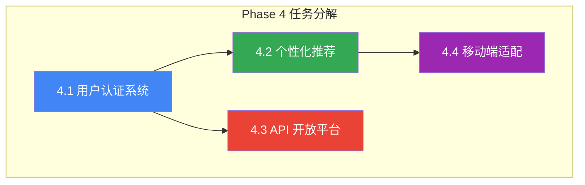

### 6.2 任务 4.1：用户认证系统

**目标**：实现用户注册、登录、权限管理

#### 6.2.1 认证方案

| 特性       | 方案                   |
| ---------- | ---------------------- |
| 认证方式   | JWT + OAuth2           |
| 密码存储   | bcrypt + salt          |
| Token 刷新 | Refresh Token 机制     |
| 第三方登录 | GitHub、Google（可选） |

#### 6.2.2 数据模型

```sql
-- 用户表
CREATE TABLE users (
    id BIGINT PRIMARY KEY AUTO_INCREMENT,
    email VARCHAR(255) UNIQUE NOT NULL,
    password_hash VARCHAR(255) NOT NULL,
    username VARCHAR(100),
    avatar_url VARCHAR(500),
    role ENUM('user', 'admin') DEFAULT 'user',
    is_active BOOLEAN DEFAULT TRUE,
    created_at TIMESTAMP DEFAULT CURRENT_TIMESTAMP,
    updated_at TIMESTAMP DEFAULT CURRENT_TIMESTAMP ON UPDATE CURRENT_TIMESTAMP
);

-- 用户收藏
CREATE TABLE user_favorites (
    id BIGINT PRIMARY KEY AUTO_INCREMENT,
    user_id BIGINT NOT NULL,
    source_id BIGINT NOT NULL,
    created_at TIMESTAMP DEFAULT CURRENT_TIMESTAMP,
    FOREIGN KEY (user_id) REFERENCES users(id),
    FOREIGN KEY (source_id) REFERENCES sources(id),
    UNIQUE KEY unique_favorite (user_id, source_id)
);

-- 用户阅读历史
CREATE TABLE user_reading_history (
    id BIGINT PRIMARY KEY AUTO_INCREMENT,
    user_id BIGINT NOT NULL,
    source_id BIGINT NOT NULL,
    read_at TIMESTAMP DEFAULT CURRENT_TIMESTAMP,
    read_progress FLOAT DEFAULT 0,
    FOREIGN KEY (user_id) REFERENCES users(id),
    FOREIGN KEY (source_id) REFERENCES sources(id)
);
```

#### 6.2.3 验收标准

| 验收项     | 标准                   | 验证方式 |
| ---------- | ---------------------- | -------- |
| 注册功能   | 邮箱验证、密码强度检查 | 功能测试 |
| 登录功能   | JWT 签发正确           | 功能测试 |
| Token 刷新 | 过期自动刷新           | 边界测试 |
| 权限控制   | 未授权访问返回 401     | 安全测试 |

### 6.3 任务 4.2：个性化推荐

**目标**：基于用户行为的个性化内容推荐

#### 6.3.1 推荐策略

| 策略     | 描述            | 数据来源        |
| -------- | --------------- | --------------- |
| 协同过滤 | 相似用户喜好    | 用户行为数据    |
| 内容推荐 | 相似内容关联    | 内容向量 + 图谱 |
| 热门推荐 | 高阅读/收藏内容 | 全局统计        |
| 趋势推荐 | 近期热门        | 时间衰减统计    |

#### 6.3.2 验收标准

| 验收项     | 标准               | 验证方式   |
| ---------- | ------------------ | ---------- |
| 推荐生成   | 新用户也能获得推荐 | 冷启动测试 |
| 推荐相关性 | 用户满意度 > 70%   | 用户调研   |
| 响应时间   | < 500ms            | 性能测试   |

### 6.4 任务 4.3：API 开放平台

**目标**：提供开放 API 供第三方调用

#### 6.4.1 API 设计

| API               | 功能      | 认证方式 |
| ----------------- | --------- | -------- |
| `/api/v1/sources` | 内容 CRUD | API Key  |
| `/api/v1/search`  | 语义搜索  | API Key  |
| `/api/v1/graph`   | 图谱查询  | API Key  |
| `/api/v1/chat`    | 对话接口  | API Key  |

#### 6.4.2 速率限制

| 套餐  | 请求限制      | 价格    |
| ----- | ------------- | ------- |
| Free  | 100 次/天     | 免费    |
| Basic | 10,000 次/天  | ¥99/月  |
| Pro   | 100,000 次/天 | ¥499/月 |

#### 6.4.3 验收标准

| 验收项       | 标准               | 验证方式 |
| ------------ | ------------------ | -------- |
| API 文档     | Swagger 完整可用   | 文档检查 |
| API Key 管理 | 创建、撤销功能正常 | 功能测试 |
| 速率限制     | 超限返回 429       | 压力测试 |
| 使用统计     | 调用量统计准确     | 数据验证 |

### 6.5 任务 4.4：移动端适配

**目标**：Web 端完全适配移动设备

#### 6.5.1 适配要点

| 要点       | 实现方式                 |
| ---------- | ------------------------ |
| 响应式布局 | TailwindCSS 断点         |
| 触摸优化   | 加大点击区域             |
| 性能优化   | 图片懒加载、分页加载     |
| PWA        | Service Worker、离线支持 |

#### 6.5.2 验收标准

| 验收项          | 标准           | 验证方式 |
| --------------- | -------------- | -------- |
| 移动端可用      | 核心功能正常   | 设备测试 |
| Lighthouse 评分 | Mobile > 80    | 性能测试 |
| 离线支持        | 缓存页面可访问 | 功能测试 |

### 6.6 阶段四验收清单

| 检查项               | 状态 | 验收日期 |
| -------------------- | ---- | -------- |
| 用户注册登录正常     | ☐    |          |
| JWT 认证正确         | ☐    |          |
| 用户收藏功能可用     | ☐    |          |
| 个性化推荐有效       | ☐    |          |
| API 文档完整         | ☐    |          |
| API Key 管理功能正常 | ☐    |          |
| 速率限制生效         | ☐    |          |
| 移动端完全适配       | ☐    |          |
| PWA 离线支持         | ☐    |          |
| 全平台测试通过       | ☐    |          |

---

## 7. 验证与质量保障

### 7.1 测试策略

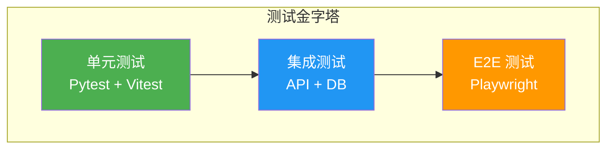

### 7.2 测试覆盖目标

| 阶段    | 单元测试 | 集成测试 | E2E 测试 | 总覆盖率 |
| ------- | -------- | -------- | -------- | -------- |
| Phase 1 | 70%      | 60%      | 50%      | > 80%    |
| Phase 2 | 75%      | 65%      | 55%      | > 85%    |
| Phase 3 | 80%      | 70%      | 60%      | > 90%    |
| Phase 4 | 85%      | 75%      | 65%      | > 90%    |

### 7.3 测试命令参考

```bash
# 后端单元测试
cd cognizes && pytest tests/unit -v --cov=.

# 后端集成测试
cd cognizes && pytest tests/integration -v

# 前端单元测试
cd ui && npm run test

# E2E 测试
cd ui && npx playwright test

# 全量测试
npm run test:all
```

### 7.4 质量指标监控

| 指标类别 | 指标             | 目标值     | 监控方式   |
| -------- | ---------------- | ---------- | ---------- |
| **代码** | 测试覆盖率       | > 90%      | CI 报告    |
|          | Lint 错误        | 0          | Pre-commit |
|          | 安全漏洞         | 0 Critical | Dependabot |
| **性能** | API P95 响应时间 | < 500ms    | APM        |
|          | 向量检索延迟     | < 100ms    | 日志分析   |
|          | 页面首屏加载     | < 2s       | Lighthouse |
| **RAG**  | Faithfulness     | > 85%      | RAGAS      |
|          | Answer Relevancy | > 90%      | RAGAS      |

### 7.5 CI/CD 流水线

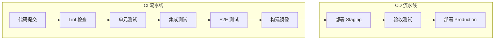

---

## 8. 风险与依赖管理

### 8.1 技术风险

| 风险                 | 影响 | 概率 | 缓解措施                   |
| -------------------- | ---- | ---- | -------------------------- |
| OceanBase 向量功能   | 高   | 中   | 备选 Milvus/Qdrant         |
| Cognee 兼容性        | 中   | 中   | 自研 GraphRAG 组件         |
| LLM API 限流         | 中   | 高   | 多 Provider 切换、本地缓存 |
| Neo4j 企业版功能限制 | 低   | 中   | 社区版 + 手动实现高级功能  |

### 8.2 项目风险

| 风险         | 影响 | 概率 | 缓解措施                |
| ------------ | ---- | ---- | ----------------------- |
| 开发周期延误 | 高   | 中   | 迭代交付、优先核心功能  |
| 人力资源不足 | 高   | 中   | 自动化工具、AI 辅助开发 |
| 需求变更     | 中   | 高   | 模块化设计、抽象层      |

### 8.3 外部依赖

| 依赖       | 类型      | 版本            | 替代方案              |
| ---------- | --------- | --------------- | --------------------- |
| OceanBase  | 数据库    | V4.5+           | PostgreSQL + pgvector |
| Neo4j      | 图数据库  | 5.x / 2025      | Memgraph              |
| Cognee     | 框架      | latest          | 自研 + LangGraph      |
| Claude API | LLM       | claude-sonnet-4 | GPT-4 / Gemini        |
| OpenAI API | Embedding | v3-small        | 本地模型              |

### 8.4 依赖版本锁定

```toml
# pyproject.toml 关键依赖
[project.dependencies]
fastapi = ">=0.110.0"
pydantic = ">=2.6.0"
anthropic = ">=0.40.0"
openai = ">=1.40.0"
cognee = ">=0.1.17"
neo4j = ">=5.20.0"
sqlalchemy = ">=2.0.0"
ragas = ">=0.1.0"
```

---

## 9. 附录

### 9.1 术语表

| 术语                    | 定义                                               |
| ----------------------- | -------------------------------------------------- |
| **Agentic RAG**         | Agent 驱动的检索增强生成，支持自适应、纠错、自反思 |
| **GraphRAG**            | 结合知识图谱的 RAG 技术                            |
| **Cognee**              | AI 认知记忆层框架，三存储架构                      |
| **HNSW**                | 分层可导航小世界图，近似最近邻搜索算法             |
| **RRF**                 | 倒数排名融合，多路检索结果融合算法                 |
| **RAGAS**               | RAG 评估框架，四项核心指标                         |
| **Context Engineering** | 系统性上下文管理方法论                             |

### 9.2 参考文档

| 文档                | 路径                                         |
| ------------------- | -------------------------------------------- |
| PRD & Architecture  | `docs/000-prd-architecture.md`               |
| 认知增强调研        | `docs/research/000-cognitive-enhancement.md` |
| Context Engineering | `docs/research/001-context-engineering.md`   |
| Agent Frameworks    | `docs/research/002-agent-frameworks.md`      |
| Cognee 调研         | `docs/research/003-cognee.md`                |
| OceanBase 调研      | `docs/research/004-oceanbase.md`             |
| Neo4j 调研          | `docs/research/005-neo4j.md`                 |
| BettaFish 调研      | `docs/research/006-bettafish.md`             |

### 9.3 环境配置模板

```bash
# .env.template
# LLM Configuration
ANTHROPIC_API_KEY=sk-ant-...
OPENAI_API_KEY=sk-...

# Database Configuration
OCEANBASE_HOST=localhost
OCEANBASE_PORT=2881
OCEANBASE_USER=root
OCEANBASE_PASSWORD=
OCEANBASE_DATABASE=cognizes

# Neo4j Configuration
NEO4J_URI=bolt://localhost:7687
NEO4J_USER=neo4j
NEO4J_PASSWORD=password

# Application Configuration
API_HOST=0.0.0.0
API_PORT=8000
CORS_ORIGINS=http://localhost:3000
```

### 9.4 启动命令

```bash
# 开发环境启动
# 1. 启动数据库
docker compose up -d oceanbase neo4j

# 2. 启动后端
cd cognizes && uvicorn api.main:app --reload --port 8000

# 3. 启动前端
cd ui && npm run dev

# 生产环境启动
docker compose -f docker-compose.prod.yml up -d
```
