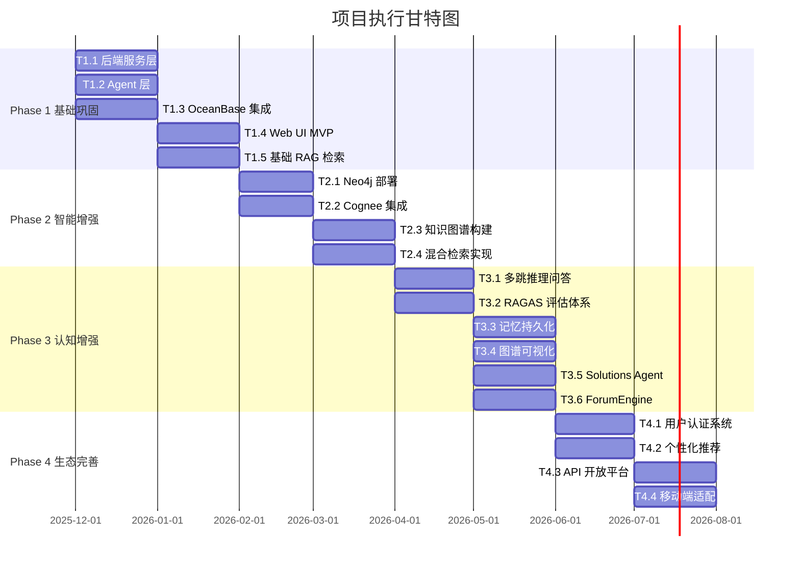
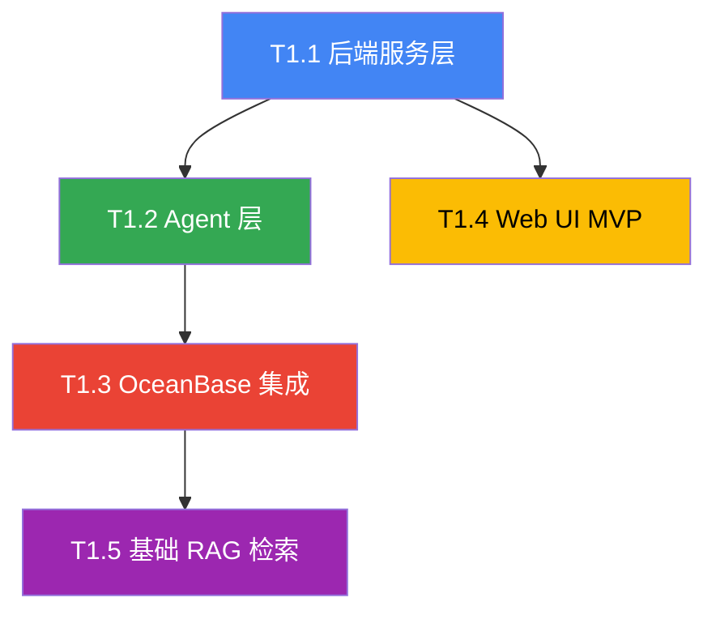
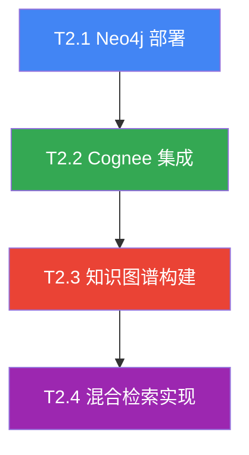
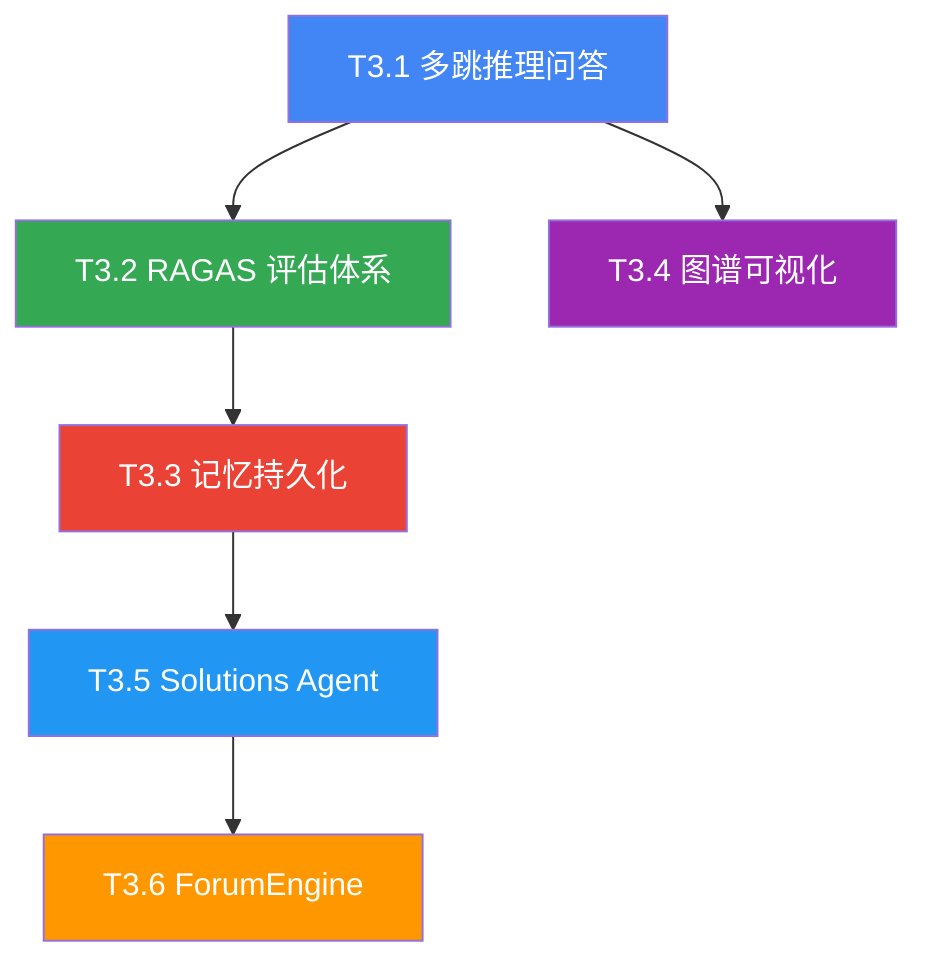
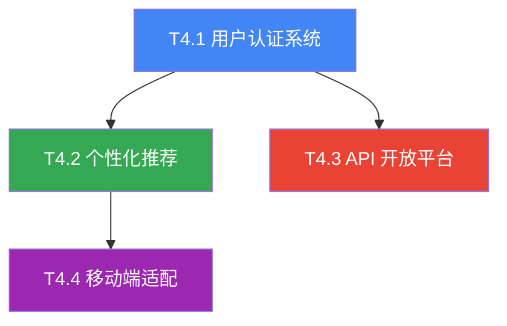
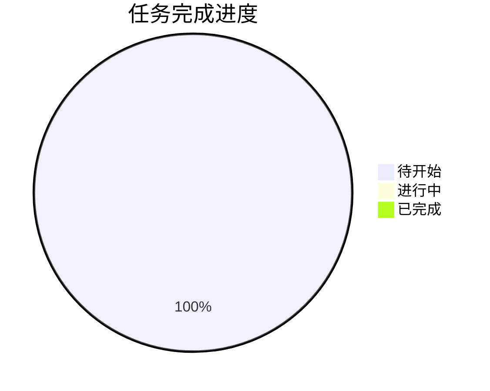

> [!IMPORTANT] **基于**：[Implementation Plan v1.1](./001-implementation-plan.md)  
> **对齐**：[PRD & Architecture v1.1](./000-prd-architecture.md)

---

## 目录

1. [项目概览](#1-项目概览)
2. [Phase 1: 基础巩固](#2-phase-1-基础巩固)
3. [Phase 2: 智能增强](#3-phase-2-智能增强)
4. [Phase 3: 认知增强](#4-phase-3-认知增强)
5. [Phase 4: 生态完善](#5-phase-4-生态完善)
6. [跨阶段验证任务](#6-跨阶段验证任务)
7. [进度追踪](#7-进度追踪)

---

## 1. 项目概览

### 1.1 总体路线图

### 1.2 里程碑

| 里程碑 | 目标日期 | 交付物         | 验收标准                          |
| ------ | -------- | -------------- | --------------------------------- |
| **M1** | 2026-01  | 单内容处理流程 | 上传 → 解析 → 翻译 → 分析完整可用 |
| **M2** | 2026-02  | Web UI MVP     | UI 上线，基础 RAG 可用            |
| **M3** | 2026-04  | 知识图谱       | 图谱构建完成，混合检索实现        |
| **M4** | 2026-06  | 认知增强       | 多跳推理可用，RAGAS 达标          |
| **M5** | 2026-08  | 完整平台       | 用户系统 + API 平台上线           |

### 1.3 优先级说明

- 🔴 **P0**：核心功能，必须完成
- 🟡 **P1**：增强功能，重要
- 🟢 **P2**：扩展功能，可延期
- ⚪ **可选**：锦上添花，视时间安排

---

## 2. Phase 1: 基础巩固

> **时间**：2025-12 ~ 2026-02  
> **目标**：构建核心处理流程，实现单内容完整处理链路

### 2.1 任务依赖关系

---

### T1.1 后端服务层 🔴

**目标**：基于 FastAPI 构建异步高性能后端服务

| 子任务  | 描述                 | 产出物                     | 验收标准           | 状态 |
| ------- | -------------------- | -------------------------- | ------------------ | ---- |
| T1.1.1  | 项目初始化与目录结构 | `cognizes/` 目录           | 符合设计规范       | ☐    |
| T1.1.2  | FastAPI 应用入口     | `api/main.py`              | 服务正常启动       | ☐    |
| T1.1.3  | 配置管理模块         | `core/config.py`           | 环境变量加载正确   | ☐    |
| T1.1.4  | 异常处理机制         | `core/exceptions.py`       | 统一错误响应格式   | ☐    |
| T1.1.5  | Pydantic 模型定义    | `core/models/`             | 数据验证正确       | ☐    |
| T1.1.6  | Sources API 实现     | `routes/sources.py`        | CRUD 接口可用      | ☐    |
| T1.1.7  | Tasks API 实现       | `routes/tasks.py`          | 任务管理接口可用   | ☐    |
| T1.1.8  | Search API 实现      | `routes/search.py`         | 搜索接口可用       | ☐    |
| T1.1.9  | Health Check API     | `routes/health.py`         | `/health` 返回正常 | ☐    |
| T1.1.10 | WebSocket 任务事件   | `websocket/task_events.py` | 实时推送正常       | ☐    |
| T1.1.11 | 单元测试编写         | `tests/unit/api/`          | 覆盖率 > 70%       | ☐    |

**验收标准**：

| 验收项         | 标准             | 验证方式   |
| -------------- | ---------------- | ---------- |
| API 响应时间   | < 500ms (P95)    | 性能测试   |
| 并发处理能力   | 100+ 并发上传    | 压力测试   |
| WebSocket 连接 | 1000+ 同时连接   | 连接测试   |
| API 文档       | Swagger 自动生成 | 访问 /docs |

---

### T1.2 Agent 层（Google ADK）🔴

**目标**：基于 Google ADK 实现核心 Agent，完成内容处理流程

| 子任务  | 描述              | 产出物                          | 验收标准                  | 状态 |
| ------- | ----------------- | ------------------------------- | ------------------------- | ---- |
| T1.2.1  | ADK 环境配置      | 依赖安装、认证配置              | API 调用成功              | ☐    |
| T1.2.2  | Agent 目录结构    | `agents/adk/`                   | 符合设计规范              | ☐    |
| T1.2.3  | Coordinator Agent | `coordinator.py`                | 流程编排正确              | ☐    |
| T1.2.4  | Reader Agent      | `reader_agent.py`               | PDF 解析准确率 > 95%      | ☐    |
| T1.2.5  | Translation Agent | `translation_agent.py`          | 术语保留 100%，BLEU > 0.7 | ☐    |
| T1.2.6  | Heartfelt Agent   | `heartfelt_agent.py`            | 生成结构化报告            | ☐    |
| T1.2.7  | PDF 解析工具      | `tools/pdf_parser.py`           | PyMuPDF 集成              | ☐    |
| T1.2.8  | Web 抓取工具      | `tools/web_scraper.py`          | URL 解析正确              | ☐    |
| T1.2.9  | 内容处理工作流    | `workflows/content_pipeline.py` | 端到端可用                | ☐    |
| T1.2.10 | Agent 单元测试    | `tests/unit/agents/`            | 覆盖率 > 70%              | ☐    |
| T1.2.11 | Markdown 解析工具 | `tools/md_parser.py`            | markdown-it-py 集成       | ☐    |
| T1.2.12 | arXiv API 工具    | `tools/arxiv_fetcher.py`        | arXiv API 调用成功        | ☐    |
| T1.2.13 | DOCX 解析工具     | `tools/docx_parser.py`          | python-docx 集成          | ☐    |

**验收标准**：

| 验收项         | 标准                      | 验证方式 |
| -------------- | ------------------------- | -------- |
| PDF 解析准确率 | > 95% 文本提取正确        | 样本测试 |
| 翻译质量       | 术语保留 100%，BLEU > 0.7 | 人工评估 |
| 流程完整性     | 端到端流程无中断          | E2E 测试 |
| 元数据提取     | 准确率 > 90%              | 样本验证 |

---

### T1.3 OceanBase 集成 🔴

**目标**：集成 OceanBase 向量数据库，实现内容存储与向量检索

| 子任务 | 描述                     | 产出物             | 验收标准       | 状态 |
| ------ | ------------------------ | ------------------ | -------------- | ---- |
| T1.3.1 | OceanBase 部署           | Docker 容器运行    | 服务启动正常   | ☐    |
| T1.3.2 | 数据库连接配置           | `core/database.py` | 连接池正常工作 | ☐    |
| T1.3.3 | sources 表创建           | Schema SQL         | 表结构正确     | ☐    |
| T1.3.4 | source_embeddings 表创建 | 向量表 + HNSW 索引 | 索引创建成功   | ☐    |
| T1.3.5 | tasks 表创建             | 任务状态表         | 表结构正确     | ☐    |
| T1.3.6 | 全文索引创建             | FULLTEXT 索引      | 关键词检索可用 | ☐    |
| T1.3.7 | ORM 模型实现             | SQLAlchemy 模型    | CRUD 操作正常  | ☐    |
| T1.3.8 | 向量存储服务             | 向量写入/检索      | 相似度搜索正确 | ☐    |
| T1.3.9 | 数据库测试               | 集成测试           | 全部通过       | ☐    |

**验收标准**：

| 验收项     | 标准              | 验证方式     |
| ---------- | ----------------- | ------------ |
| 数据库连接 | 连接池正常工作    | 连接测试     |
| CRUD 操作  | 增删改查正常      | 单元测试     |
| 向量索引   | HNSW 索引正确创建 | EXPLAIN 验证 |
| 检索延迟   | < 100ms (P95)     | 性能测试     |

---

### T1.4 Web UI MVP 🔴

**目标**：构建基础 Web 界面，支持内容上传、列表查看、任务监控

| 子任务  | 描述               | 产出物                        | 验收标准       | 状态 |
| ------- | ------------------ | ----------------------------- | -------------- | ---- |
| T1.4.1  | Next.js 项目初始化 | `ui/` 目录                    | 开发服务器启动 | ☐    |
| T1.4.2  | 全局布局实现       | `app/layout.tsx`              | 导航、主题正常 | ☐    |
| T1.4.3  | 仪表板页面         | `app/page.tsx`                | 统计概览展示   | ☐    |
| T1.4.4  | 内容列表页面       | `app/sources/page.tsx`        | 列表展示正常   | ☐    |
| T1.4.5  | 内容详情页面       | `app/sources/[id]/page.tsx`   | Tab 切换正常   | ☐    |
| T1.4.6  | 上传页面           | `app/sources/upload/page.tsx` | 拖拽上传可用   | ☐    |
| T1.4.7  | 任务监控页面       | `app/tasks/page.tsx`          | 实时状态更新   | ☐    |
| T1.4.8  | 搜索页面           | `app/search/page.tsx`         | 搜索功能可用   | ☐    |
| T1.4.9  | API 调用 Hook      | `hooks/useApi.ts`             | 数据请求正常   | ☐    |
| T1.4.10 | WebSocket Hook     | `hooks/useWebSocket.ts`       | 实时连接正常   | ☐    |
| T1.4.11 | 状态管理           | `store/*.ts` (Zustand)        | 状态同步正确   | ☐    |
| T1.4.12 | 前端测试           | Vitest + Playwright           | 覆盖率 > 60%   | ☐    |

**验收标准**：

| 验收项       | 标准                | 验证方式   |
| ------------ | ------------------- | ---------- |
| 页面加载     | < 2s (首屏)         | Lighthouse |
| 文件上传     | 50MB 文件 < 30s     | 功能测试   |
| 任务实时更新 | WebSocket 延迟 < 1s | 连接测试   |
| 响应式设计   | 适配移动端          | 视觉测试   |

---

### T1.5 基础 RAG 检索 🔴

**目标**：实现基于向量的语义检索功能

| 子任务 | 描述               | 产出物                      | 验收标准            | 状态 |
| ------ | ------------------ | --------------------------- | ------------------- | ---- |
| T1.5.1 | Embedding 服务     | 向量生成模块                | OpenAI API 调用成功 | ☐    |
| T1.5.2 | 向量相似度搜索     | 搜索服务                    | Top-K 结果正确      | ☐    |
| T1.5.3 | 检索 API 实现      | `/api/v1/search`            | 接口响应正常        | ☐    |
| T1.5.4 | LLM 回答生成       | 生成模块                    | 回答质量达标        | ☐    |
| T1.5.5 | OceanBase 搜索工具 | `tools/oceanbase_search.py` | Agent 可调用        | ☐    |
| T1.5.6 | 检索测试           | 集成测试                    | 准确率 > 80%        | ☐    |

**验收标准**：

| 验收项       | 标准                      | 验证方式   |
| ------------ | ------------------------- | ---------- |
| 检索响应时间 | < 500ms                   | 性能测试   |
| 检索准确率   | 相关结果占 Top-10 的 80%+ | 人工评估   |
| 回答质量     | Faithfulness > 85%        | RAGAS 评估 |

---

### Phase 1 验收清单

| 检查项                 | 状态 | 验收日期 | 验收人 |
| ---------------------- | ---- | -------- | ------ |
| FastAPI 服务启动正常   | ☐    |          |        |
| API 文档可访问 (/docs) | ☐    |          |        |
| WebSocket 连接正常     | ☐    |          |        |
| Reader Agent 解析 PDF  | ☐    |          |        |
| Translation Agent 翻译 | ☐    |          |        |
| Heartfelt Agent 分析   | ☐    |          |        |
| 完整流程端到端可用     | ☐    |          |        |
| OceanBase 连接正常     | ☐    |          |        |
| 向量索引创建成功       | ☐    |          |        |
| 向量检索功能可用       | ☐    |          |        |
| Web UI 首页可访问      | ☐    |          |        |
| 文件上传功能正常       | ☐    |          |        |
| 任务监控实时更新       | ☐    |          |        |
| 语义搜索功能可用       | ☐    |          |        |
| 测试覆盖率 > 80%       | ☐    |          |        |

---

## 3. Phase 2: 智能增强

> **时间**：2026-02 ~ 2026-04  
> **目标**：集成 Neo4j 与 Cognee，构建知识图谱与混合检索能力

### 3.1 任务依赖关系

---

### T2.1 Neo4j 部署配置 🔴

**目标**：部署 Neo4j 图数据库，创建知识图谱 Schema

| 子任务 | 描述                | 产出物                 | 验收标准             | 状态 |
| ------ | ------------------- | ---------------------- | -------------------- | ---- |
| T2.1.1 | Docker Compose 配置 | `docker-compose.yml`   | 服务启动正常         | ☐    |
| T2.1.2 | Neo4j 健康检查      | 端口测试               | 7474/7687 可访问     | ☐    |
| T2.1.3 | 唯一性约束创建      | Cypher 脚本            | 6 个约束创建         | ☐    |
| T2.1.4 | 向量索引创建        | 向量索引               | cosine 相似度索引    | ☐    |
| T2.1.5 | 全文索引创建        | 全文索引               | source_fulltext 可用 | ☐    |
| T2.1.6 | Python 驱动连接     | `neo4j-driver`         | 连接测试通过         | ☐    |
| T2.1.7 | Neo4j 工具封装      | `tools/neo4j_query.py` | CRUD 操作正常        | ☐    |

**验收标准**：

| 验收项         | 标准                  | 验证方式         |
| -------------- | --------------------- | ---------------- |
| Neo4j 服务启动 | 健康检查通过          | 端口测试         |
| 约束创建成功   | 6 个唯一性约束        | SHOW CONSTRAINTS |
| 向量索引创建   | cosine 相似度索引可用 | SHOW INDEXES     |
| Python 连接    | neo4j-driver 正常连接 | 连接测试         |

---

### T2.2 Cognee 集成 🔴

**目标**：集成 Cognee 框架，配置三存储架构

| 子任务  | 描述                   | 产出物                     | 验收标准            | 状态 |
| ------- | ---------------------- | -------------------------- | ------------------- | ---- |
| T2.2.1  | Cognee 依赖安装        | `pyproject.toml`           | 版本 >= 0.1.17      | ☐    |
| T2.2.2  | LLM 配置               | Anthropic 配置             | API 调用成功        | ☐    |
| T2.2.3  | Embedding 配置         | OpenAI 配置                | 向量生成成功        | ☐    |
| T2.2.4  | 图存储配置             | Neo4j 连接                 | cognee → Neo4j 成功 | ☐    |
| T2.2.5  | Cognee 初始化          | `core/cognee_config.py`    | 无报错启动          | ☐    |
| T2.2.6  | CogneeMemory 封装      | `core/memory.py`           | API 封装完成        | ☐    |
| T2.2.7  | cognee.add 测试        | 添加文档测试               | 成功添加            | ☐    |
| T2.2.8  | cognee.cognify 测试    | 构建图谱测试               | 成功构建            | ☐    |
| T2.2.9  | cognee.search 测试     | 混合检索测试               | 返回相关结果        | ☐    |
| T2.2.10 | OceanBase 适配器       | `core/cognee_oceanbase.py` | 向量存储透明        | ☐    |
| T2.2.11 | 适配器 BaseVectorStore | 继承实现                   | add/search/delete   | ☐    |
| T2.2.12 | 适配器单元测试         | `tests/unit/cognee/`       | pytest 全部通过     | ☐    |
| T2.2.13 | Cognee 透明集成验证    | 集成测试                   | cognee.search 正常  | ☐    |

**验收标准**：

| 验收项         | 标准         | 验证方式 |
| -------------- | ------------ | -------- |
| Cognee 初始化  | 无报错启动   | 日志检查 |
| cognee.add     | 成功添加文档 | API 测试 |
| cognee.cognify | 成功构建图谱 | 图谱查询 |
| cognee.search  | 返回相关结果 | 检索测试 |

---

### T2.3 知识图谱构建 🟡

**目标**：实现内容到知识图谱的自动转换

| 子任务  | 描述            | 产出物                | 验收标准                  | 状态 |
| ------- | --------------- | --------------------- | ------------------------- | ---- |
| T2.3.1  | 实体类型定义    | 节点类型规范          | 10 类实体定义(PRD 对齐)   | ☐    |
| T2.3.2  | 关系类型定义    | 边类型规范            | 10 类关系定义(PRD 对齐)   | ☐    |
| T2.3.3  | 实体抽取器      | `entity_extractor.py` | LLM 抽取实现              | ☐    |
| T2.3.4  | 关系识别器      | 关系抽取              | 准确率 > 75%              | ☐    |
| T2.3.5  | 图谱写入服务    | Neo4j 写入            | 批量写入正常              | ☐    |
| T2.3.6  | 向量嵌入服务    | 节点向量化            | 嵌入存储成功              | ☐    |
| T2.3.7  | 图谱查询 API    | Cypher 查询封装       | 查询接口可用              | ☐    |
| T2.3.8  | 图谱数据导出    | get_graph_data        | 可视化数据格式            | ☐    |
| T2.3.9  | Source 基类定义 | 节点模型              | Paper/Article/Doc/Repo    | ☐    |
| T2.3.10 | 知识实体类定义  | 节点模型              | Author/Concept/Method/etc | ☐    |

**验收标准**：

| 验收项         | 标准             | 验证方式   |
| -------------- | ---------------- | ---------- |
| 实体抽取准确率 | > 80%            | 人工评估   |
| 关系识别准确率 | > 75%            | 人工评估   |
| 图谱完整性     | 核心实体全部入图 | 图遍历验证 |

---

### T2.4 混合检索实现 🔴

**目标**：实现关键词 + 向量 + 图谱的三路混合检索

| 子任务  | 描述         | 产出物                  | 验收标准     | 状态 |
| ------- | ------------ | ----------------------- | ------------ | ---- |
| T2.4.1  | 查询解析器   | 查询类型分类            | 三类查询识别 | ☐    |
| T2.4.2  | 关键词检索   | OceanBase FULLTEXT      | 返回结果正确 | ☐    |
| T2.4.3  | 向量检索     | OceanBase HNSW          | Top-K 正确   | ☐    |
| T2.4.4  | 图谱检索     | Neo4j Cypher            | 关系查询正确 | ☐    |
| T2.4.5  | RRF 融合算法 | `hybrid_search.py`      | 排序正确     | ☐    |
| T2.4.6  | 智能路由器   | `search_router.py`      | 路由策略正确 | ☐    |
| T2.4.7  | 三路并发执行 | asyncio.gather          | 并发检索正常 | ☐    |
| T2.4.8  | LLM 重排序   | 可选增强                | 质量提升     | ☐    |
| T2.4.9  | 混合检索 API | `/api/v1/search/hybrid` | 接口可用     | ☐    |
| T2.4.10 | 检索质量评估 | Precision@10            | > 70%        | ☐    |

**验收标准**：

| 验收项       | 标准               | 验证方式 |
| ------------ | ------------------ | -------- |
| 三路检索可用 | 全部正常返回结果   | 功能测试 |
| RRF 融合正确 | 排序符合预期       | 单元测试 |
| 混合检索质量 | Precision@10 > 70% | 评估测试 |
| 响应时间     | < 1s               | 性能测试 |

---

### Phase 2 验收清单

| 检查项                  | 状态 | 验收日期 | 验收人 |
| ----------------------- | ---- | -------- | ------ |
| Neo4j 服务正常          | ☐    |          |        |
| Neo4j Schema 创建完成   | ☐    |          |        |
| Cognee 初始化成功       | ☐    |          |        |
| cognee.add 功能正常     | ☐    |          |        |
| cognee.cognify 功能正常 | ☐    |          |        |
| 实体抽取功能可用        | ☐    |          |        |
| 知识图谱数据可查询      | ☐    |          |        |
| 关键词检索可用          | ☐    |          |        |
| 向量检索可用            | ☐    |          |        |
| 图谱检索可用            | ☐    |          |        |
| RRF 混合检索可用        | ☐    |          |        |
| 测试覆盖率 > 85%        | ☐    |          |        |

---

## 4. Phase 3: 认知增强

> **时间**：2026-04 ~ 2026-06  
> **目标**：实现多跳推理问答、RAGAS 评估体系、Agent 记忆持久化

### 4.1 任务依赖关系

---

### T3.1 多跳推理问答 🔴

**目标**：实现基于 Agentic RAG 的复杂问题推理

| 子任务 | 描述         | 产出物             | 验收标准     | 状态 |
| ------ | ------------ | ------------------ | ------------ | ---- |
| T3.1.1 | 智能路由器   | 查询分类           | 三类路由正确 | ☐    |
| T3.1.2 | 问题分解模块 | 子问题生成         | 分解合理     | ☐    |
| T3.1.3 | 多步检索执行 | 逐步检索           | 信息累积正确 | ☐    |
| T3.1.4 | 推理分析模块 | 子答案生成         | 推理过程清晰 | ☐    |
| T3.1.5 | 答案综合模块 | 最终答案生成       | 结构完整     | ☐    |
| T3.1.6 | 自我反思机制 | 质量评估           | 修正能力有效 | ☐    |
| T3.1.7 | 相关性评估器 | Grader 实现        | 低质量可检测 | ☐    |
| T3.1.8 | Web 搜索补救 | 外部检索           | 补充信息正确 | ☐    |
| T3.1.9 | MultiHop API | `/api/v1/multihop` | 接口可用     | ☐    |

**验收标准**：

| 验收项       | 标准                   | 验证方式   |
| ------------ | ---------------------- | ---------- |
| 问题分解准确 | 子问题覆盖完整         | 人工评估   |
| 多跳检索有效 | 能发现间接关联         | 案例测试   |
| 回答质量     | Answer Relevancy > 90% | RAGAS 评估 |
| 推理可解释   | 包含推理过程           | 输出检查   |

---

### T3.2 RAGAS 评估体系 🔴

**目标**：建立基于 RAGAS 的检索与生成质量评估体系

| 子任务  | 描述                   | 产出物           | 验收标准        | 状态 |
| ------- | ---------------------- | ---------------- | --------------- | ---- |
| T3.2.1  | RAGAS 依赖安装         | `ragas` 包       | 版本 >= 0.1.0   | ☐    |
| T3.2.2  | 评估数据集框架         | JSON Schema 定义 | 符合 RAGAS 要求 | ☐    |
| T3.2.3  | 自建问答对             | 论文库抽取       | 100+ 条         | ☐    |
| T3.2.4  | 领域专属数据           | 人工标注         | 50+ 条          | ☐    |
| T3.2.5  | 标准测试集引入         | MS MARCO/NQ 子集 | 500+ 条         | ☐    |
| T3.2.6  | 评估器实现             | `evaluation.py`  | 四项指标计算    | ☐    |
| T3.2.7  | Faithfulness 达标      | 忠实度评估       | > 85%           | ☐    |
| T3.2.8  | Answer Relevancy 达标  | 相关性评估       | > 90%           | ☐    |
| T3.2.9  | Context Precision 达标 | 精确度评估       | > 80%           | ☐    |
| T3.2.10 | Context Recall 达标    | 召回率评估       | > 85%           | ☐    |
| T3.2.11 | 评估报告生成           | 自动化报告       | 格式清晰        | ☐    |
| T3.2.12 | CI 集成                | GitHub Actions   | 自动化评估      | ☐    |

**验收标准**：

| 验收项       | 标准                | 验证方式 |
| ------------ | ------------------- | -------- |
| 评估管道运行 | 无报错完成评估      | 功能测试 |
| 评估数据集   | 至少 100 条测试用例 | 数据检查 |
| 指标达标     | 四项指标全部达标    | 评估运行 |

---

### T3.3 Agent 记忆持久化 🟡

**目标**：实现 Agent 跨会话记忆持久化

| 子任务 | 描述         | 产出物              | 验收标准     | 状态 |
| ------ | ------------ | ------------------- | ------------ | ---- |
| T3.3.1 | 短期记忆实现 | 内存存储            | 会话内保持   | ☐    |
| T3.3.2 | 长期记忆实现 | OceanBase 存储      | 重启后保留   | ☐    |
| T3.3.3 | 情景记忆实现 | Neo4j 存储          | 历史轨迹记录 | ☐    |
| T3.3.4 | 语义记忆实现 | Cognee 存储         | 知识关联保持 | ☐    |
| T3.3.5 | 记忆管理器   | `memory_manager.py` | API 完整     | ☐    |
| T3.3.6 | 记忆检索功能 | 相关记忆召回        | 准确率达标   | ☐    |
| T3.3.7 | 记忆固化机制 | 短期 → 长期转移     | 自动执行     | ☐    |
| T3.3.8 | 记忆测试     | 跨会话测试          | 功能正常     | ☐    |

**验收标准**：

| 验收项       | 标准             | 验证方式   |
| ------------ | ---------------- | ---------- |
| 短期记忆有效 | 会话内上下文保持 | 会话测试   |
| 长期记忆持久 | 重启后记忆保留   | 持久化测试 |
| 记忆检索准确 | 相关记忆正确召回 | 检索测试   |

---

### T3.4 图谱可视化 🟡

**目标**：实现知识图谱的交互式可视化

| 子任务 | 描述             | 产出物               | 验收标准     | 状态 |
| ------ | ---------------- | -------------------- | ------------ | ---- |
| T3.4.1 | vis-network 集成 | 前端组件             | 渲染正常     | ☐    |
| T3.4.2 | 图谱数据 API     | `/api/v1/graph`      | 返回格式正确 | ☐    |
| T3.4.3 | 节点渲染         | 样式配置             | 类型区分清晰 | ☐    |
| T3.4.4 | 边渲染           | 关系展示             | 方向正确     | ☐    |
| T3.4.5 | 交互功能         | 缩放/拖拽/点击       | 响应流畅     | ☐    |
| T3.4.6 | 节点详情展示     | 点击展开             | 信息完整     | ☐    |
| T3.4.7 | 中心展开查询     | 指定节点展开         | 功能正常     | ☐    |
| T3.4.8 | 性能优化         | 1000+ 节点           | 渲染 < 3s    | ☐    |
| T3.4.9 | 图谱页面         | `app/graph/page.tsx` | 页面完整     | ☐    |

**验收标准**：

| 验收项       | 标准                 | 验证方式 |
| ------------ | -------------------- | -------- |
| 图谱渲染正确 | 节点和边正确显示     | 视觉测试 |
| 交互功能     | 支持缩放、拖拽、点击 | 功能测试 |
| 性能表现     | 1000 节点渲染 < 3s   | 性能测试 |

---

### T3.5 Solutions Architect Agent 🟡

**目标**：实现场景化方案定制 Agent

| 子任务 | 描述             | 产出物                   | 验收标准     | 状态 |
| ------ | ---------------- | ------------------------ | ------------ | ---- |
| T3.5.1 | Agent 定义       | `solutions_architect.py` | 结构完整     | ☐    |
| T3.5.2 | 需求分析能力     | Prompt 设计              | 场景理解准确 | ☐    |
| T3.5.3 | 方案检索能力     | 工具集成                 | 检索相关内容 | ☐    |
| T3.5.4 | 架构设计能力     | 输出模板                 | 结构化输出   | ☐    |
| T3.5.5 | Coordinator 注册 | 流程集成                 | Agent 可调度 | ☐    |
| T3.5.6 | API 端点         | `/api/v1/architect`      | 接口可用     | ☐    |
| T3.5.7 | 方案质量评估     | 人工评估                 | 匹配度 > 80% | ☐    |
| T3.5.8 | 最佳实践整合     | BettaFish/Cognee 模式    | 工程模式验证 | ☐    |
| T3.5.9 | 定制化输出       | PRD/代码骨架             | 多格式输出   | ☐    |

**验收标准**：

| 验收项     | 标准                   | 验证方式 |
| ---------- | ---------------------- | -------- |
| Agent 响应 | 生成结构化方案文档     | 功能测试 |
| 方案相关性 | 方案与场景匹配度 > 80% | 人工评估 |
| 响应时间   | < 30s（含检索）        | 性能测试 |

---

### T3.6 BettaFish ForumEngine ⚪ 可选

**目标**：实现 Agent 论坛协作机制

| 子任务 | 描述             | 产出物                  | 验收标准   | 状态 |
| ------ | ---------------- | ----------------------- | ---------- | ---- |
| T3.6.1 | ForumEngine 架构 | `forum_engine.py`       | 结构完整   | ☐    |
| T3.6.2 | 主持人 Agent     | Host LLM                | 引导讨论   | ☐    |
| T3.6.3 | 参与者 Agents    | 三种视角                | 多元观点   | ☐    |
| T3.6.4 | 讨论轮次控制     | 最多 3 轮               | 可收敛     | ☐    |
| T3.6.5 | 共识判断机制     | 共识检测                | 判断正确   | ☐    |
| T3.6.6 | 结论综合         | 综合器                  | 输出质量高 | ☐    |
| T3.6.7 | Forum API        | `/api/v1/forum/discuss` | 接口可用   | ☐    |

**验收标准**：

| 验收项   | 标准                         | 验证方式 |
| -------- | ---------------------------- | -------- |
| 多轮讨论 | 支持 3 轮以上辩论            | 功能测试 |
| 共识达成 | 论坛能收敛到结论             | 逻辑测试 |
| 输出质量 | 论坛输出 > 单 Agent 输出质量 | A/B 测试 |

---

### Phase 3 验收清单

| 检查项                   | 状态 | 验收日期 | 验收人 |
| ------------------------ | ---- | -------- | ------ |
| 多跳推理问答可用         | ☐    |          |        |
| 问题分解功能正常         | ☐    |          |        |
| 自我反思机制有效         | ☐    |          |        |
| RAGAS 评估管道运行       | ☐    |          |        |
| Faithfulness > 85%       | ☐    |          |        |
| Answer Relevancy > 90%   | ☐    |          |        |
| Context Precision > 80%  | ☐    |          |        |
| Context Recall > 85%     | ☐    |          |        |
| 短期记忆功能正常         | ☐    |          |        |
| 长期记忆持久化           | ☐    |          |        |
| 记忆检索准确             | ☐    |          |        |
| 图谱可视化页面可用       | ☐    |          |        |
| Solutions Architect 可用 | ☐    |          |        |
| ForumEngine 可用（可选） | ☐    |          |        |
| 测试覆盖率 > 90%         | ☐    |          |        |

---

## 5. Phase 4: 生态完善

> **时间**：2026-06 ~ 2026-08  
> **目标**：完善用户系统、个性化推荐、API 开放平台

### 5.1 任务依赖关系

---

### T4.1 用户认证系统 🟢

**目标**：实现用户注册、登录、权限管理

| 子任务 | 描述               | 产出物        | 验收标准           | 状态 |
| ------ | ------------------ | ------------- | ------------------ | ---- |
| T4.1.1 | users 表创建       | 用户数据模型  | 表结构正确         | ☐    |
| T4.1.2 | user_favorites 表  | 收藏数据模型  | 关联正确           | ☐    |
| T4.1.3 | reading_history 表 | 历史数据模型  | 记录完整           | ☐    |
| T4.1.4 | 注册功能           | 邮箱验证      | 密码强度检查       | ☐    |
| T4.1.5 | 登录功能           | JWT 签发      | Token 正确         | ☐    |
| T4.1.6 | Token 刷新         | Refresh Token | 过期自动刷新       | ☐    |
| T4.1.7 | 权限控制           | 中间件        | 未授权返回 401     | ☐    |
| T4.1.8 | 收藏功能           | 收藏 API      | CRUD 正常          | ☐    |
| T4.1.9 | 第三方登录         | OAuth2        | GitHub/Google 可选 | ☐    |

**验收标准**：

| 验收项     | 标准                   | 验证方式 |
| ---------- | ---------------------- | -------- |
| 注册功能   | 邮箱验证、密码强度检查 | 功能测试 |
| 登录功能   | JWT 签发正确           | 功能测试 |
| Token 刷新 | 过期自动刷新           | 边界测试 |
| 权限控制   | 未授权访问返回 401     | 安全测试 |

---

### T4.2 个性化推荐 🟢

**目标**：基于用户行为的个性化内容推荐

| 子任务 | 描述             | 产出物              | 验收标准   | 状态 |
| ------ | ---------------- | ------------------- | ---------- | ---- |
| T4.2.1 | 用户行为数据收集 | 埋点实现            | 数据完整   | ☐    |
| T4.2.2 | 协同过滤算法     | 相似用户推荐        | 推荐合理   | ☐    |
| T4.2.3 | 内容推荐算法     | 向量+图谱推荐       | 推荐相关   | ☐    |
| T4.2.4 | 热门推荐         | 全局统计            | 数据准确   | ☐    |
| T4.2.5 | 趋势推荐         | 时间衰减            | 新鲜度保证 | ☐    |
| T4.2.6 | 推荐 API         | `/api/v1/recommend` | 接口可用   | ☐    |
| T4.2.7 | 冷启动处理       | 新用户推荐          | 有效推荐   | ☐    |

**验收标准**：

| 验收项     | 标准               | 验证方式   |
| ---------- | ------------------ | ---------- |
| 推荐生成   | 新用户也能获得推荐 | 冷启动测试 |
| 推荐相关性 | 用户满意度 > 70%   | 用户调研   |
| 响应时间   | < 500ms            | 性能测试   |

---

### T4.3 API 开放平台 🟢

**目标**：提供开放 API 供第三方调用

| 子任务 | 描述         | 产出物     | 验收标准     | 状态 |
| ------ | ------------ | ---------- | ------------ | ---- |
| T4.3.1 | API Key 生成 | 密钥管理   | 安全生成     | ☐    |
| T4.3.2 | API Key 验证 | 中间件     | 验证正确     | ☐    |
| T4.3.3 | 速率限制     | 限流中间件 | 超限返回 429 | ☐    |
| T4.3.4 | 使用统计     | 调用量统计 | 数据准确     | ☐    |
| T4.3.5 | API 文档完善 | Swagger    | 完整可用     | ☐    |
| T4.3.6 | 开发者控制台 | 管理界面   | 功能完整     | ☐    |
| T4.3.7 | 套餐管理     | 计费逻辑   | 可配置       | ☐    |

**验收标准**：

| 验收项       | 标准               | 验证方式 |
| ------------ | ------------------ | -------- |
| API 文档     | Swagger 完整可用   | 文档检查 |
| API Key 管理 | 创建、撤销功能正常 | 功能测试 |
| 速率限制     | 超限返回 429       | 压力测试 |
| 使用统计     | 调用量统计准确     | 数据验证 |

---

### T4.4 移动端适配 🟢

**目标**：Web 端完全适配移动设备

| 子任务 | 描述            | 产出物           | 验收标准    | 状态 |
| ------ | --------------- | ---------------- | ----------- | ---- |
| T4.4.1 | 响应式布局      | TailwindCSS 断点 | 适配正确    | ☐    |
| T4.4.2 | 触摸优化        | 点击区域调整     | 易于操作    | ☐    |
| T4.4.3 | 图片懒加载      | 性能优化         | 加载顺畅    | ☐    |
| T4.4.4 | Service Worker  | PWA 支持         | 离线可用    | ☐    |
| T4.4.5 | 安装提示        | PWA Manifest     | 可安装      | ☐    |
| T4.4.6 | 移动端测试      | 多设备测试       | 兼容性好    | ☐    |
| T4.4.7 | Lighthouse 优化 | 性能评分         | Mobile > 80 | ☐    |

**验收标准**：

| 验收项          | 标准           | 验证方式 |
| --------------- | -------------- | -------- |
| 移动端可用      | 核心功能正常   | 设备测试 |
| Lighthouse 评分 | Mobile > 80    | 性能测试 |
| 离线支持        | 缓存页面可访问 | 功能测试 |

---

### Phase 4 验收清单

| 检查项               | 状态 | 验收日期 | 验收人 |
| -------------------- | ---- | -------- | ------ |
| 用户注册登录正常     | ☐    |          |        |
| JWT 认证正确         | ☐    |          |        |
| 用户收藏功能可用     | ☐    |          |        |
| 个性化推荐有效       | ☐    |          |        |
| API 文档完整         | ☐    |          |        |
| API Key 管理功能正常 | ☐    |          |        |
| 速率限制生效         | ☐    |          |        |
| 移动端完全适配       | ☐    |          |        |
| PWA 离线支持         | ☐    |          |        |
| 全平台测试通过       | ☐    |          |        |

---

## 6. 跨阶段验证任务

### 6.1 测试体系

| 测试类型   | 工具            | 目标覆盖率  | 执行频率 |
| ---------- | --------------- | ----------- | -------- |
| 单元测试   | Pytest / Vitest | > 85%       | 每次提交 |
| 集成测试   | Pytest          | > 70%       | 每次 PR  |
| E2E 测试   | Playwright      | > 60%       | 每日构建 |
| 性能测试   | k6              | P95 < 500ms | 每周     |
| RAGAS 评估 | ragas           | 四项达标    | 每周     |

### 6.2 E2E 测试场景

| 编号    | 场景             | 所属阶段 | 优先级 |
| ------- | ---------------- | -------- | ------ |
| E2E-001 | 论文上传完整流程 | Phase 1  | P0     |
| E2E-002 | 语义搜索验证     | Phase 1  | P0     |
| E2E-003 | 翻译流程验证     | Phase 1  | P0     |
| E2E-004 | 深度分析验证     | Phase 1  | P0     |
| E2E-005 | 知识图谱展示     | Phase 2  | P1     |
| E2E-101 | 多跳问答验证     | Phase 3  | P0     |
| E2E-102 | 跨会话记忆       | Phase 3  | P1     |
| E2E-103 | 方案生成验证     | Phase 3  | P1     |

### 6.3 性能基准

| 接口/功能              | 指标     | 目标值  |
| ---------------------- | -------- | ------- |
| `/api/v1/sources` POST | 响应时间 | < 200ms |
| `/api/v1/search` POST  | P95 延迟 | < 500ms |
| 向量检索               | 单次查询 | < 100ms |
| 图谱遍历 (2 跳)        | 单次查询 | < 200ms |
| 混合检索 (三路)        | 端到端   | < 1s    |
| 页面首屏               | LCP      | < 2s    |

### 6.4 RAGAS 评估数据集

| 编号  | 任务               | 产出物                     | 验收标准        |
| ----- | ------------------ | -------------------------- | --------------- |
| V-001 | 评估数据集格式定义 | JSON Schema                | 符合 RAGAS 要求 |
| V-002 | 自建问答对收集     | 从已分析论文抽取           | 100+ 条         |
| V-003 | 领域专属标注       | 人工 Ground Truth          | 50+ 条          |
| V-004 | 评估脚本实现       | `evaluation/ragas_eval.py` | 四项指标计算    |

### 6.5 翻译质量评估

| 编号  | 任务           | 产出物                    | 验收标准       |
| ----- | -------------- | ------------------------- | -------------- |
| V-101 | BLEU 评估脚本  | `evaluation/bleu_eval.py` | sacrebleu 集成 |
| V-102 | 参考翻译数据集 | 30+ 篇高质量翻译          | 人工翻译样本   |
| V-103 | 翻译质量验证   | 评估报告                  | BLEU > 0.7     |

---

## 7. 进度追踪

### 7.1 总体进度

### 7.2 阶段进度汇总

| 阶段     | 任务总数 | 子任务数 | 已完成 | 进度   |
| -------- | -------- | -------- | ------ | ------ |
| Phase 1  | 5        | 54       | 0      | 0%     |
| Phase 2  | 4        | 43       | 0      | 0%     |
| Phase 3  | 6        | 58       | 0      | 0%     |
| Phase 4  | 4        | 30       | 0      | 0%     |
| 跨阶段   | -        | 11       | 0      | 0%     |
| **总计** | **19**   | **196**  | **0**  | **0%** |

### 7.3 风险提示

| 风险               | 影响 | 概率 | 缓解措施           |
| ------------------ | ---- | ---- | ------------------ |
| OceanBase 向量功能 | 高   | 中   | 备选 Milvus/Qdrant |
| Cognee 兼容性      | 中   | 中   | 自研 GraphRAG 组件 |
| LLM API 限流       | 中   | 高   | 多 Provider 切换   |
| 开发周期延误       | 高   | 中   | 迭代交付、优先核心 |

---

## 附录

### A. 术语表

| 术语        | 定义                     |
| ----------- | ------------------------ |
| Agentic RAG | Agent 驱动的检索增强生成 |
| GraphRAG    | 结合知识图谱的 RAG 技术  |
| Cognee      | AI 认知记忆层框架        |
| HNSW        | 分层可导航小世界图算法   |
| RRF         | 倒数排名融合算法         |
| RAGAS       | RAG 评估框架             |

### B. 参考文档

| 文档                | 路径                                         |
| ------------------- | -------------------------------------------- |
| PRD & Architecture  | `docs/000-prd-architecture.md`               |
| Implementation Plan | `docs/001-implementation-plan.md`            |
| 认知增强调研        | `docs/research/000-cognitive-enhancement.md` |
| Context Engineering | `docs/research/001-context-engineering.md`   |
| Agent Frameworks    | `docs/research/002-agent-frameworks.md`      |
| Cognee 调研         | `docs/research/003-cognee.md`                |
| OceanBase 调研      | `docs/research/004-oceanbase.md`             |
| Neo4j 调研          | `docs/research/005-neo4j.md`                 |
| BettaFish 调研      | `docs/research/006-bettafish.md`             |

### C. 变更记录

| 版本 | 日期       | 变更内容                                          |
| ---- | ---------- | ------------------------------------------------- |
| v1.0 | 2025-12-22 | 初始版本                                          |
| v1.1 | 2025-12-22 | 精细化优化版：新增 31 个子任务项，与 PRD 完全对齐 |
