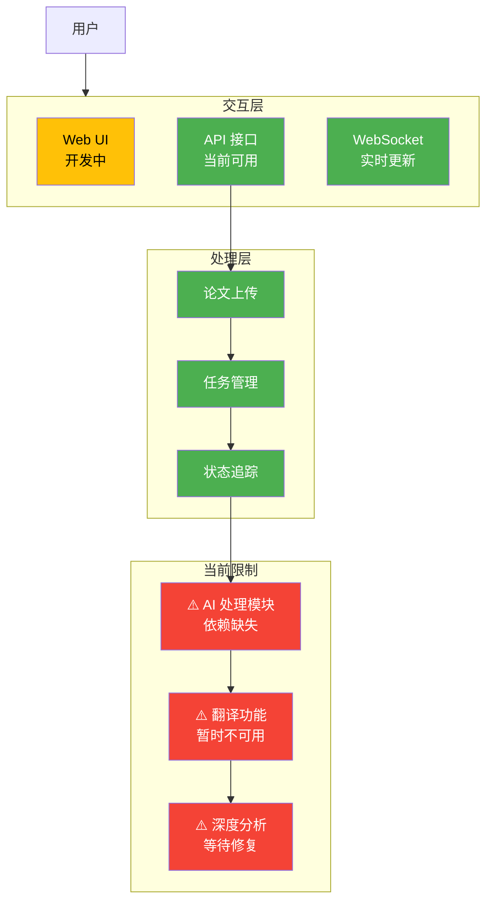
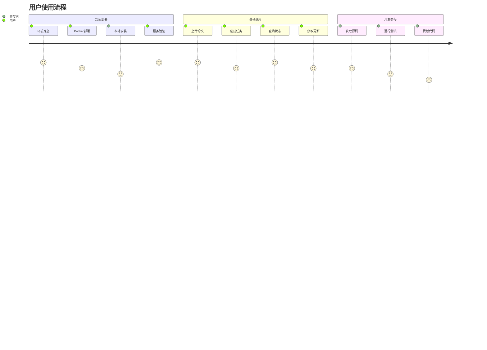
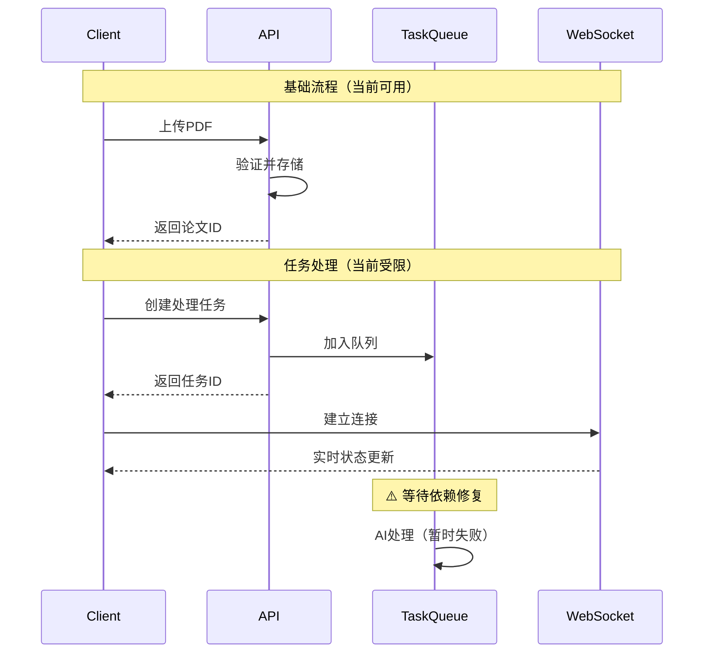
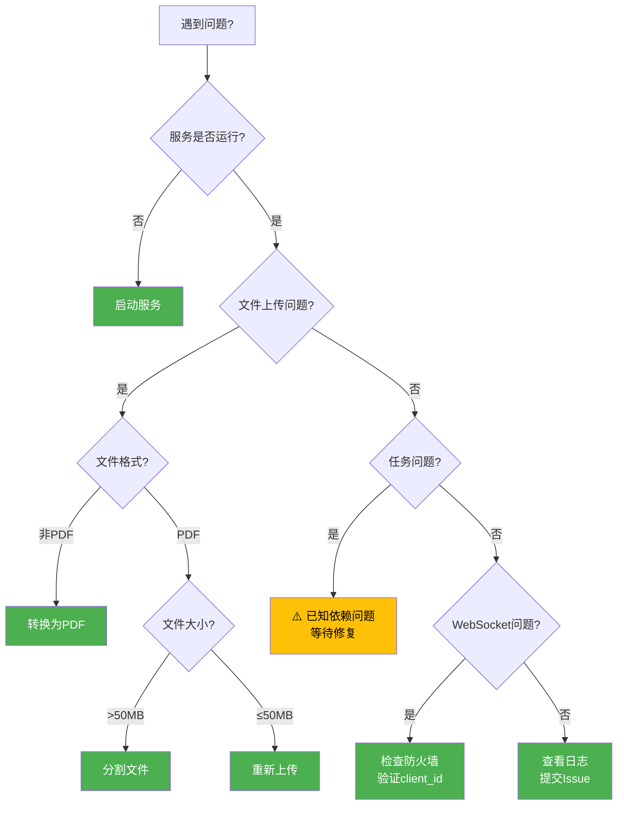

# 用户使用手册

## 项目概述

**Agentic AI 研究论文收集、翻译和管理平台** - 为中文读者提供高质量的 Agentic AI 领域技术资源。

### 当前状态

- **开发阶段**：早期开发 (MVP 阶段)
- **已实现**：API 框架、基础路由、任务管理、WebSocket 通信
- **主要限制**：claude-agent-sdk 依赖缺失，AI 处理功能暂时不可用
- **目标用户**：开发者、研究人员

### 系统架构



## 快速开始

### 环境要求

- Python 3.12+
- Docker & Docker Compose（推荐）
- ANTHROPIC_API_KEY（用于未来 AI 功能）

### 用户使用流程



### 安装方式

#### 方式一：Docker Compose 部署（推荐）

```bash
# 1. 克隆仓库
git clone https://github.com/ThreeFish-AI/agentic-ai-papers.git
cd agentic-ai-papers

# 2. 配置环境变量
cp .env.example .env
# 编辑 .env 文件，添加 ANTHROPIC_API_KEY（可选）

# 3. 启动服务
docker-compose up -d

# 4. 验证服务
curl http://localhost:8000/health
```

#### 方式二：本地开发安装

```bash
# 1. 克隆仓库并进入目录
git clone https://github.com/ThreeFish-AI/agentic-ai-papers.git
cd agentic-ai-papers

# 2. 创建虚拟环境
python -m venv venv
source venv/bin/activate  # Linux/Mac
# 或 venv\Scripts\activate  # Windows

# 3. 安装依赖
pip install -e .

# 4. 启动服务
uvicorn api.main:app --reload --host 0.0.0.0 --port 8000
```

### 验证安装

- API 文档：http://localhost:8000/docs
- 健康检查：http://localhost:8000/health

## 当前可用功能

### 1. 基础 API 接口

#### 上传论文

```bash
# 上传 PDF 文件
curl -X POST "http://localhost:8000/api/papers/upload" \
  -H "accept: application/json" \
  -H "Content-Type: multipart/form-data" \
  -F "file=@example.pdf" \
  -F "category=llm-agents"
```

#### 查询论文列表

```bash
# 获取所有论文
curl "http://localhost:8000/api/papers"

# 按分类筛选
curl "http://localhost:8000/api/papers?category=llm-agents"
```

#### 任务管理

```bash
# 获取任务列表
curl "http://localhost:8000/api/tasks"

# 查看特定任务状态
curl "http://localhost:8000/api/tasks/{task_id}"
```

### 2. WebSocket 连接



```javascript
// 实时获取任务更新
const ws = new WebSocket("ws://localhost:8000/ws/{client_id}");

ws.onmessage = (event) => {
  const data = JSON.parse(event.data);
  console.log(`任务更新: ${data}`);
};
```

## 开发中功能

以下功能正在开发中，目前不可用：

- **AI 处理功能**（PDF 提取、翻译、深度分析）

  - 正在解决 claude-agent-sdk 依赖问题

- **Web 界面**

  - React 前端开发中
  - 预计下个版本提供

- **搜索功能**

  - 全文搜索和筛选
  - 计划在 Q1 2025 实现

- **导出功能**
  - Markdown/PDF 导出
  - 批量下载
  - 计划在 Q2 2025 实现

## 论文分类说明

目前支持以下论文分类：

- **llm-agents**：大语言模型智能体
- **context-engineering**：上下文工程
- **knowledge-graphs**：知识图谱
- **multi-agent**：多智能体系统
- **tool-learning**：工具学习
- **planning**：规划与推理

### 论文管理流程

```mermaid
flowchart LR
    Upload[论文上传] --> Category[分类选择]

    subgraph Categories [支持分类]
        LLM[LLM Agents]
        CTX[Context Engineering]
        KG[Knowledge Graphs]
        MULTI[Multi-Agent]
        TOOL[Tool Learning]
        PLAN[Planning]
    end

    Category --> Categories

    subgraph Storage [存储结构]
        Source[papers/source/<br/>原始PDF]
        Images[papers/images/<br/>提取图片]
        Trans[papers/translation/<br/>中文翻译<br/>⚠️ 暂停]
        Heart[papers/heartfelt/<br/>深度分析<br/>⚠️ 暂停]
    end

    Categories --> Storage

    classDef storage fill:#2196F3,color:#fff
    classDef category fill:#FF9800,color:#fff
    classDef limited fill:#F44336,color:#fff

    class Source,Images storage
    class LLM,CTX,KG,MULTI,TOOL,PLAN category
    class Trans,Heart limited
```



## 常见问题

### 故障排除决策树



### Q1: claude-agent-sdk 依赖问题？

**问题描述**：
运行时出现 `ModuleNotFoundError: No module named 'claude_agent_sdk'`

**当前状态**：
这是项目的核心限制，导致 AI 处理功能暂时无法使用。

**解决方案**：

1. 项目正在寻找正确的 claude-agent-sdk 包
2. 未来版本将实现替代方案
3. 目前可使用基础的文件上传和管理功能

### Q2: 文件上传失败？

**可能原因**：

- 文件大小超过 50MB 限制
- 文件不是 PDF 格式
- 服务未正确启动

**检查步骤**：

```bash
# 检查服务状态
curl http://localhost:8000/health

# 检查上传响应
curl -v -X POST "http://localhost:8000/api/papers/upload" \
  -F "file=@test.pdf" \
  -F "category=llm-agents"
```

### Q3: WebSocket 连接失败？

**常见原因**：

- 端口 8000 被防火墙阻挡
- client_id 参数缺失

**解决方案**：

```javascript
// 使用唯一的客户端 ID
const clientId = `client_${Date.now()}_${Math.random()}`;
const ws = new WebSocket(`ws://localhost:8000/ws/${clientId}`);
```

### Q4: 为什么任务没有执行？

**当前限制**：
由于 claude-agent-sdk 依赖缺失，创建的任务无法实际执行 AI 处理。

**现状**：

- 任务可以创建并查询状态
- 但处理步骤（PDF 提取、翻译、分析）会失败
- 这是已知问题，正在积极解决

### Q5: 如何查看日志？

**日志位置**：

- Docker 部署：`docker-compose logs agentic-papers`
- 本地部署：控制台输出

## 参与开发

### 开发贡献流程

```mermaid
gitgraph
    commit id: "初始状态"
    branch feature
    checkout feature
    commit id: "Fork项目"
    commit id: "创建分支"
    commit id: "开发功能"
    commit id: "编写测试"
    checkout main
    pull feature
    commit id: "代码审查"
    commit id: "合并PR"
    commit id: "发布版本"
```

### 获取源码

```bash
git clone https://github.com/ThreeFish-AI/agentic-ai-papers.git
cd agentic-ai-papers
```

### 运行测试

```bash
# 安装测试依赖
pip install -e ".[test]"

# 运行所有测试
pytest tests/

# 运行特定测试
pytest tests/agents/unit/api/
```

### 报告问题

1. [GitHub Issues](https://github.com/ThreeFish-AI/agentic-ai-papers/issues)
2. 包含以下信息：
   - 错误描述
   - 操作步骤
   - 环境信息
   - 相关日志

## 贡献指南

欢迎贡献代码和文档！

### 开发环境

1. Fork 项目
2. 创建功能分支
3. 提交 Pull Request
4. 等待代码审查

### 文档更新

文档存放在 `docs/` 目录下，欢迎改进和补充。