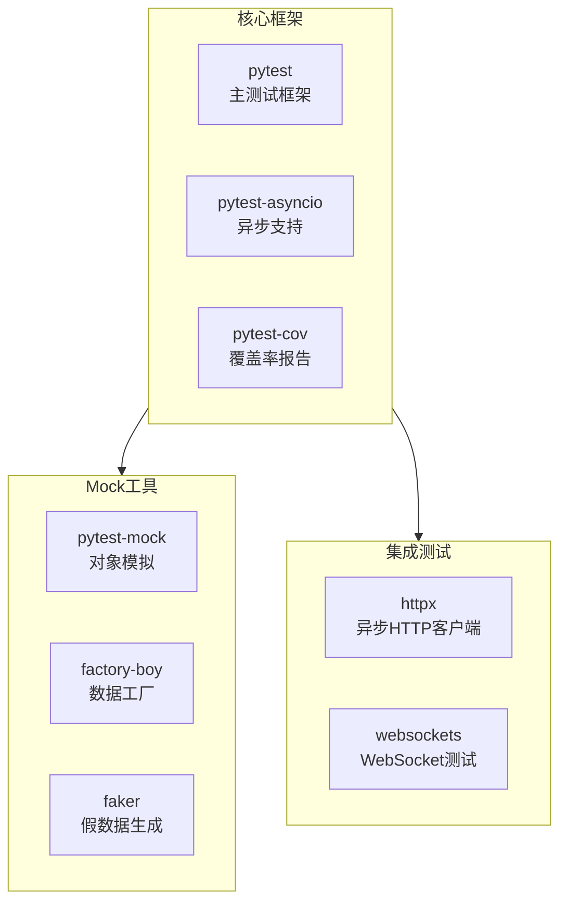
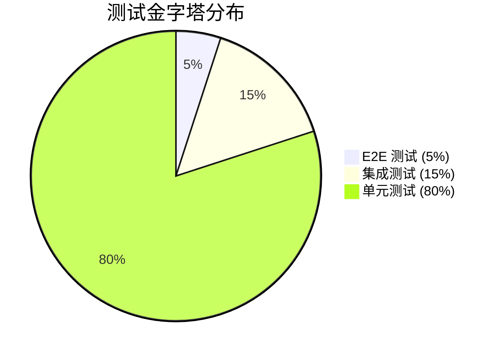

# 测试指南

## 测试架构

### 核心测试栈



### 测试层级



## 核心命令

### 运行测试

```bash
# 所有测试（推荐）
python tests/agents/run_tests.py

# 单元测试
python tests/agents/run_tests.py unit
pytest tests/agents/unit -v

# 集成测试 + 覆盖率
python tests/agents/run_tests.py integration
pytest tests/agents --cov=agents --cov-report=html

# 覆盖率报告
python tests/agents/run_tests.py coverage
```

### 测试标记

- `@pytest.mark.unit` - 单元测试（默认）
- `@pytest.mark.integration` - 集成测试
- `@pytest.mark.slow` - 慢速测试（可跳过）

运行特定标记：

```bash
pytest -m "not slow"  # 跳过慢速测试
pytest -m integration  # 只运行集成测试
```

## 异步测试模式

### 基本模式

```python
@pytest.mark.asyncio
async def test_agent_processing():
    agent = TestAgent()
    result = await agent.process({"input": "data"})
    assert result["success"]
```

### Mock 异步函数

```python
@pytest.fixture
def mock_async_service():
    service = AsyncMock()
    service.process.return_value = {"status": "success"}
    return service
```

## 测试结构

```
tests/agents/
├── unit/          # 单元测试（80%）
├── integration/   # 集成测试（15%）
├── e2e/          # 端到端测试（5%）
├── performance/  # 性能测试
└── fixtures/     # 测试数据和Mock
    ├── factories/  # 数据工厂
    └── mocks/      # Mock对象
```

## 常用 Fixtures

```python
def test_with_client(test_client):
    # FastAPI 测试客户端
    response = test_client.post("/papers", json=data)
    assert response.status_code == 200

async def test_with_async_client(async_client):
    # 异步测试客户端
    response = await async_client.post("/papers", json=data)
    assert response.status_code == 200

def test_with_sample_data(sample_paper_metadata):
    # 使用预定义的测试数据
    assert sample_paper_metadata["title"]
```

## Mock 策略

### 常用 Mock

```python
# Mock Agent
@pytest.fixture
def mock_pdf_agent():
    with patch("agents.claude.pdf_agent.PDFProcessingAgent") as mock:
        agent = AsyncMock()
        agent.extract_content.return_value = {"text": "content"}
        mock.return_value = agent
        yield agent

# Mock API 响应
@pytest.fixture
def mock_claude_response():
    return {
        "content": [{"text": "翻译内容", "type": "text"}],
        "usage": {"input_tokens": 100, "output_tokens": 50}
    }
```

## 调试技巧

```bash
# 详细输出
pytest -v -s tests/agents

# 只运行失败测试
pytest --lf

# 首次失败即停止
pytest -x

# 显示局部变量
pytest --tb=long
```

## 质量要求

- **覆盖率**: >80%
- **单元测试**: 占比 >70%
- **执行时间**: <5 分钟
- **稳定性**: >95%

## CI/CD 集成

测试在以下阶段自动运行：

1. Ruff 代码检查
2. MyPy 类型检查
3. 单元测试
4. 集成测试
5. 覆盖率报告（Codecov）

## 最佳实践

1. **测试隔离**: 每个测试独立，使用 fixtures
2. **异步测试**: 始终使用 `@pytest.mark.asyncio`
3. **命名规范**: `test_<function>_<condition>_<expected>()`
4. **覆盖率**: 聚焦业务逻辑，测试错误处理路径
