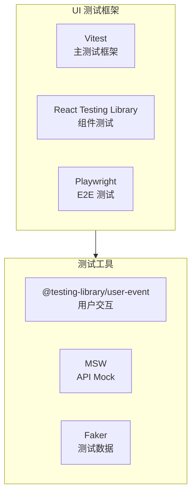

# 测试指南

## 测试架构

### 核心测试栈


### 测试层级


## 核心命令

### 运行测试

```bash
# 所有测试（推荐）
python tests/agents/run_tests.py

# 单元测试
python tests/agents/run_tests.py unit
pytest tests/agents/unit -v

# 集成测试 + 覆盖率
python tests/agents/run_tests.py integration
pytest tests/agents --cov=agents --cov-report=html

# 覆盖率报告
python tests/agents/run_tests.py coverage
```

### 测试标记

- `@pytest.mark.unit` - 单元测试（默认）
- `@pytest.mark.integration` - 集成测试
- `@pytest.mark.slow` - 慢速测试（可跳过）

运行特定标记：

```bash
pytest -m "not slow"  # 跳过慢速测试
pytest -m integration  # 只运行集成测试
```

## 异步测试模式

### 基本模式

```python
@pytest.mark.asyncio
async def test_agent_processing():
    agent = TestAgent()
    result = await agent.process({"input": "data"})
    assert result["success"]
```

### Mock 异步函数

```python
@pytest.fixture
def mock_async_service():
    service = AsyncMock()
    service.process.return_value = {"status": "success"}
    return service
```

## 测试结构

```
tests/agents/
├── unit/          # 单元测试（80%）
├── integration/   # 集成测试（15%）
├── e2e/          # 端到端测试（5%）
├── performance/  # 性能测试
└── fixtures/     # 测试数据和Mock
    ├── factories/  # 数据工厂
    └── mocks/      # Mock对象
```

## 常用 Fixtures

```python
def test_with_client(test_client):
    # FastAPI 测试客户端
    response = test_client.post("/papers", json=data)
    assert response.status_code == 200

async def test_with_async_client(async_client):
    # 异步测试客户端
    response = await async_client.post("/papers", json=data)
    assert response.status_code == 200

def test_with_sample_data(sample_paper_metadata):
    # 使用预定义的测试数据
    assert sample_paper_metadata["title"]
```

## Mock 策略

### 常用 Mock

```python
# Mock Agent
@pytest.fixture
def mock_pdf_agent():
    with patch("agents.claude.pdf_agent.PDFProcessingAgent") as mock:
        agent = AsyncMock()
        agent.extract_content.return_value = {"text": "content"}
        mock.return_value = agent
        yield agent

# Mock API 响应
@pytest.fixture
def mock_claude_response():
    return {
        "content": [{"text": "翻译内容", "type": "text"}],
        "usage": {"input_tokens": 100, "output_tokens": 50}
    }
```

## 调试技巧

```bash
# 详细输出
pytest -v -s tests/agents

# 只运行失败测试
pytest --lf

# 首次失败即停止
pytest -x

# 显示局部变量
pytest --tb=long
```

## 质量要求

- **覆盖率**: >80%
- **单元测试**: 占比 >70%
- **执行时间**: <5 分钟
- **稳定性**: >95%

## CI/CD 集成

测试在以下阶段自动运行：

1. Ruff 代码检查
2. MyPy 类型检查
3. 单元测试
4. 集成测试
5. 覆盖率报告（Codecov）

## 最佳实践

1. **测试隔离**: 每个测试独立，使用 fixtures
2. **异步测试**: 始终使用 `@pytest.mark.asyncio`
3. **命名规范**: `test_<function>_<condition>_<expected>()`
4. **覆盖率**: 聚焦业务逻辑，测试错误处理路径

### Web UI 测试

#### 测试技术栈



#### 测试层级分布


#### 测试命令

```bash
# 进入 UI 目录
cd ui

# 单元测试和集成测试 (Vitest)
npm run test                # 运行所有测试
npm run test:watch         # 监听模式
npm run test:coverage      # 生成覆盖率报告
npm run test:ui            # Vitest UI 界面

# E2E 测试 (Playwright)
npm run test:e2e           # 运行 E2E 测试
npm run test:e2e:ui        # Playwright UI 模式
npm run test:e2e:debug     # 调试模式

# 视觉回归测试
npm run test:visual        # 更新快照
```

#### 目录结构

```
tests/ui/                      # UI 测试统一目录
├── __mocks__/                 # Mock 定义
├── fixtures/                 # 测试数据
├── helpers/                  # 测试辅助函数
├── unit/                     # 单元测试
│   ├── components/           # 组件测试
│   └── hooks/                # Hooks 测试
├── integration/              # 集成测试
│   └── pages/                # 页面测试
└── e2e/                     # E2E 测试 (Playwright)

ui/                          # UI 项目配置
├── vitest.config.ts        # Vitest 配置
├── playwright.config.ts    # Playwright 配置
└── test/                   # 测试配置
    └── setup.ts            # 测试环境初始化
```

### 单元测试示例

#### 组件测试

```typescript
import { render, screen, fireEvent } from "../../helpers/render";
import { PaperCard } from "@/components/papers/PaperCard";
import { vi } from "vitest";

describe("PaperCard", () => {
  const mockPaper = {
    // ... paper data
  };

  it("renders paper information", () => {
    render(<PaperCard paper={mockPaper} />);
    // ... assertions
  });

  it("handles click events", () => {
    const onClick = vi.fn();
    render(<PaperCard paper={mockPaper} onClick={onClick} />);

    fireEvent.click(screen.getByRole("article"));
    expect(onClick).toHaveBeenCalledWith(mockPaper.id);
  });
});
```

#### Hooks 测试

```typescript
import { renderHook, act } from "@testing-library/react";
import { usePaperStore } from "@/store/paperStore";

describe("usePaperStore", () => {
  it("fetches papers successfully", async () => {
    const { result } = renderHook(() => usePaperStore());

    await act(async () => {
      await result.current.fetchPapers();
    });

    expect(result.current.loading).toBe(false);
    expect(result.current.papers).toHaveLength(3);
  });
});
```

### E2E 测试示例

```typescript
import { test, expect } from "@playwright/test";

test.describe("Paper Upload Flow", () => {
  test("user can upload and process a paper", async ({ page }) => {
    await page.goto("/papers");

    // 点击上传按钮
    await page.click('button:has-text("上传论文")');

    // 选择文件
    const fileInput = page.locator('input[type="file"]');
    await fileInput.setInputFiles("sample.pdf");

    // 等待上传完成
    await expect(page.locator("text=上传成功")).toBeVisible();

    // 验证论文出现在列表中
    await expect(page.locator("text=sample.pdf")).toBeVisible();
  });
});
```

### Mock 策略

#### MSW API Mock

````typescript
#### MSW API Mock

```typescript
// tests/__mocks__/handlers.ts
import { http, HttpResponse } from "msw";
import { papers } from "../fixtures/papers";

export const handlers = [
  http.get("/api/papers", ({ request }) => {
    // ... implementation
    return HttpResponse.json({
      success: true,
      data: papers,
    });
  }),
];
````

### 测试数据管理

#### 使用 Faker 生成测试数据

```typescript
// tests/helpers/factory.ts
import { faker } from "@faker-js/faker";
import { Paper } from "@/types";

export const createPaper = (overrides: Partial<Paper> = {}): Paper => ({
  id: faker.datatype.uuid(),
  title: faker.lorem.words(5),
  authors: [faker.name.fullName(), faker.name.fullName()],
  abstract: faker.lorem.paragraphs(3),
  status: faker.helpers.arrayElement(["uploaded", "processing", "processed"]),
  created_at: faker.date.past().toISOString(),
  ...overrides,
});
```

### CI/CD 集成

UI 测试已集成到 GitHub Actions 中：

1. **触发条件**: `ui/` 目录下的文件变更
2. **测试流程**:

   - 安装依赖
   - 运行单元测试（带覆盖率）
   - 构建应用
   - 运行 E2E 测试
   - 上传测试报告

3. **报告生成**:
   - 覆盖率报告上传到 Codecov
   - E2E 测试结果保存为 Artifacts
   - 失败时自动上传截图

### 质量标准

- **覆盖率要求**:

  - 全局：>80%
  - 核心组件：>90%
  - 状态管理：>95%

- **性能指标**:

  - 单元测试执行时间 < 2 分钟
  - E2E 测试执行时间 < 5 分钟
  - 测试稳定性 > 95%

- **测试策略**:
  - 每个组件必须有基础渲染测试
  - 关键用户流程必须有 E2E 测试
  - API 集成必须有 Mock 测试
