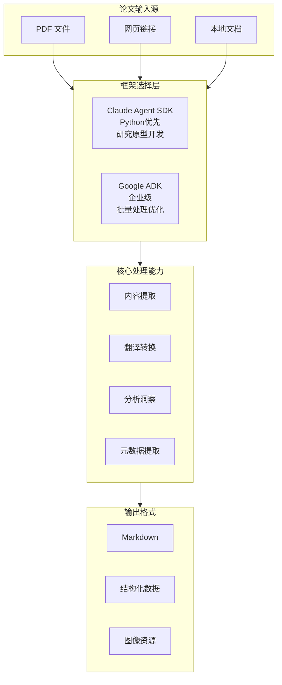
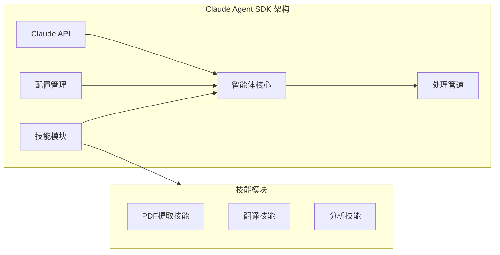
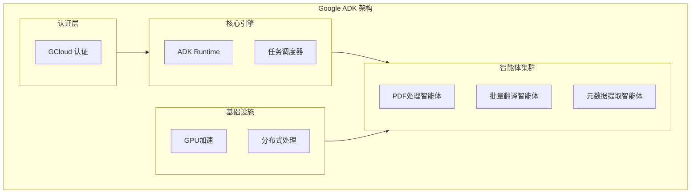
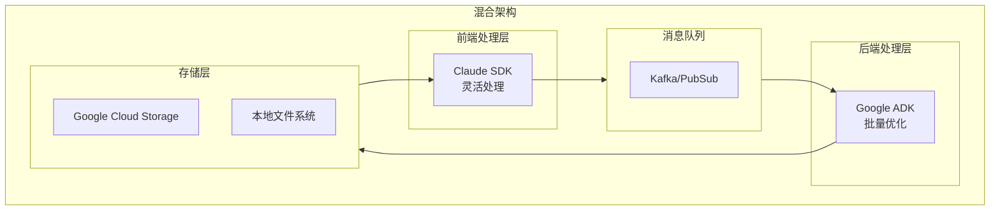

# AI 智能体实现方案

## 执行概览

### 平台智能体架构

本项目采用双框架战略，实现了基于 **Claude Agent SDK** 和 **Google ADK** 的两套智能体系统，为 Agentic AI 研究论文的处理提供灵活而强大的解决方案。



### 双框架战略价值

1. **技术互补性**

   - Claude SDK：灵活的 Python 集成，适合快速原型开发和定制化需求
   - Google ADK：企业级稳定性，专注大规模批量处理和性能优化

2. **场景适配**

   - 研究阶段：使用 Claude SDK 进行探索性实验
   - 生产环境：使用 Google ADK 进行稳定的大规模处理

3. **迁移路径**
   - 提供框架间的平滑迁移方案
   - 支持混合架构部署

## Claude Agent SDK 实现

### 架构特点

Claude Agent SDK 是 Claude Code 的库版本，让您能够以编程方式构建生产级 AI 智能体。SDK 提供了与 Claude Code 相同的工具、智能体循环和上下文管理能力，支持 Python 和 TypeScript 开发。

**核心特性：**

- 内置文件读取、命令运行、代码编辑等工具
- 支持智能体自主读取文件、运行命令、搜索网页、编辑代码等
- 支持 Claude Code 的基于文件系统的配置（Skills、Slash commands、Memory、Plugins）
- 提供与 Claude Code 相同的强大功能，但以编程方式使用



### 核心组件

#### 1. Paper Translation Agent（论文翻译智能体）

**功能描述**：将英文 Agentic AI 论文翻译为高质量中文，保持学术术语的准确性和行文的专业性。

**技术特点**：

- 支持 PDF 和 Web 格式输入
- 保持 Markdown 结构和格式
- 智能识别并保留学术术语

**使用方法**：

```bash
python translate_agent.py --input "paper.pdf" --output "translated.md" --target "zh"
```

#### 2. Paper Extraction Agent（论文提取智能体）

**功能描述**：从 PDF 论文中提取内容并转换为 Markdown 格式，完整保留学术元素。

**核心功能**：

- ✅ 数学公式保持
- ✅ 表格结构识别
- ✅ 图像和插图提取
- ✅ 引用关系维护

**技术实现**：

```python
# 依赖库
- claude-agent-sdk
- pypdf2
- markdown
- requests
```

#### 3. Paper Analysis Agent（论文分析智能体）

**功能描述**：深度分析论文内容，提取关键见解和结构化信息。

**分析能力**：

- 主要贡献识别
- 关键方法论提取
- 结构化摘要生成
- 创新点分析

**使用示例**：

```bash
python analyze_agent.py --input "translated.md" --output "analysis.md"
```

### 安装与配置

#### 安装步骤

1. **安装 Claude Code**（SDK 运行时）

```bash
# macOS/Linux/WSL
# 使用 Homebrew
brew install claude-ai/claude/claude

# 或使用 npm
npm install -g @anthropic-ai/claude-cli
```

2. **安装 Claude Agent SDK**

```bash
# Python
pip install claude-agent-sdk

# TypeScript
npm install @anthropic-ai/claude-agent-sdk
```

3. **设置 API 密钥**

```bash
export ANTHROPIC_API_KEY=your-api-key
export ANTHROPIC_BASE_URL=your-api-base-url
```

#### 配置管理

Claude SDK 智能体支持多层级配置：

1. **环境变量配置**

```bash
export ANTHROPIC_API_KEY="your-api-key"
export ANTHROPIC_BASE_URL="your-api-base-url"
export DEFAULT_LANGUAGE="zh"
```

2. **配置文件**（位于 `config/` 目录）
3. **命令行参数**

```bash
python agent.py --config custom.yaml --verbose
```

4. **基于文件系统的配置**
   - **Skills**: `.claude/skills/SKILL.md` - 定义专业化能力
   - **Slash Commands**: `.claude/commands/*.md` - 自定义命令
   - **Memory**: `CLAUDE.md` 或 `.claude/CLAUDE.md` - 项目上下文
   - **Plugins**: 通过 `plugins` 选项编程扩展

## Google ADK 实现

### 架构特点

Google ADK（Agent Development Kit）是一个灵活且模块化的智能体开发和部署框架。虽然针对 Gemini 和 Google 生态进行了优化，但 ADK 是**模型无关**和**部署无关**的，并致力于与其他框架的兼容性。ADK 的设计让智能体开发更像软件开发，使开发者更容易创建、部署和编排从简单任务到复杂工作流的智能体架构。



### 核心组件

#### 1. PDF Processing Agent（PDF 处理智能体）

**功能描述**：提供企业级的 PDF 处理能力，支持 OCR 和精确的版面保持。

**核心功能**：

- 🔍 高质量文本提取
- 📊 表格和图形智能识别
- 🌍 多语言支持
- 🚀 GPU 加速处理

**性能优化**：

```yaml
# pdf_processing.yaml 配置示例
processing:
  use_gpu: true
  batch_size: 100
  parallel_workers: 8

ocr:
  engine: "google-vision"
  confidence_threshold: 0.95
```

#### 2. Batch Translation Agent（批量翻译智能体）

**功能描述**：为大规模论文翻译任务提供高效的批量处理能力。

**企业级特性**：

- ⚡ 并行处理支持
- 📈 实时进度跟踪
- 🔄 错误处理和重试机制
- 📊 处理性能监控

**批量处理示例**：

```bash
adk run batch_translator --config "config/translation.yaml"
```

#### 3. Metadata Extraction Agent（元数据提取智能体）

**功能描述**：从论文中提取结构化的元数据信息，支持学术分析和知识图谱构建。

**提取能力**：

- 👥 作者信息提取
- 📝 出版详情识别
- 🔗 引用网络分析
- 🏷️ 关键词自动提取

**输出格式**：

```bash
adk run metadata_extractor --input "paper.pdf" --format "json"
```

### 环境配置

#### 安装步骤

Google ADK 支持 Python、Java 和 Go 三种语言：

**Python 安装：**

```bash
pip install google-adk
```

**Go 安装：**

```bash
go get google.golang.org/adk
```

**Java (Maven) 安装：**

```xml
<dependency>
    <groupId>com.google.adk</groupId>
    <artifactId>google-adk</artifactId>
    <version>0.3.0</version>
</dependency>
```

**配置认证（如果使用 Google 服务）：**

```bash
gcloud auth application-default login
```

**Python 版本要求：**

- ADK Python v1.19.0 需要 Python 3.10 或更高版本

#### 配置文件结构

```
config/
├── pdf_processing.yaml    # PDF处理设置
├── translation.yaml       # 翻译参数
└── metadata.yaml         # 元数据提取规则
```

## 框架对比分析

### 技术特性对比

| 特性维度       | Claude Agent SDK                      | Google ADK                      | 说明                                   |
| -------------- | ------------------------------------- | ------------------------------- | -------------------------------------- |
| **开发语言**   | Python, TypeScript                    | Python, Java, Go                | 两者都支持多语言，ADK 语言覆盖更广     |
| **运行时要求** | 需要 Claude Code                      | 独立运行                        | Claude SDK 依赖 Claude Code 作为运行时 |
| **模型支持**   | 专注 Claude                           | 模型无关（Model-agnostic）      | ADK 支持多种模型，更具灵活性           |
| **部署灵活性** | 部署无关（Deployment-agnostic）       | 部署无关（Deployment-agnostic） | 两者都支持灵活的部署选项               |
| **内置工具**   | 丰富的内置工具（Read, Edit, Bash 等） | 需要配置工具                    | Claude SDK 开箱即用的工具更丰富        |
| **配置系统**   | 基于文件系统（.claude/目录）          | YAML 配置文件                   | 不同的配置理念                         |
| **工作流编排** | 支持子智能体、MCP                     | Sequential, Parallel, Loop      | ADK 提供更结构化的工作流模式           |
| **批量处理**   | 🟡 需要自行实现                       | 🟢 原生支持                     | ADK 对批量处理优化更好                 |
| **企业级特性** | 🟡 发展中                             | 🟢 成熟（Firestore 集成等）     | ADK 企业级特性更完善                   |
| **学习曲线**   | 🟢 较平缓                             | 🟡 中等                         | Claude SDK 更容易上手                  |

### 适用场景分析

#### Claude Agent SDK 适用场景

✅ **推荐使用**：

- 研究原型开发
- 定制化需求较多
- Python 技术栈
- 中小规模处理
- 快速迭代开发

❌ **不推荐使用**：

- 超大规模批量处理
- 需要 GPU 加速
- 严格的生产环境要求
- 多语言混合开发

#### Google ADK 适用场景

✅ **推荐使用**：

- 企业级生产环境
- 大规模批量处理
- 需要高性能优化
- 团队协作开发
- 长期维护项目

❌ **不推荐使用**：

- 快速原型验证
- 个人研究项目
- 简单单次任务
- 预算限制严格

### 性能指标对比

| 性能指标           | Claude SDK | Google ADK | 提升幅度              |
| ------------------ | ---------- | ---------- | --------------------- |
| **单文档处理速度** | 基准       | +15%       | Google ADK 优化       |
| **批量处理吞吐量** | 1x         | 5-10x      | Google ADK 并行优势   |
| **GPU 利用率**     | N/A        | 85%+       | Google ADK 独有优势   |
| **错误恢复能力**   | 基础       | 高级       | Google ADK 企业级特性 |

## 使用指南

### Claude Agents 使用方式

#### 管道式处理

Claude SDK 智能体支持链式处理，形成完整的论文处理管道：

```bash
# 1. 提取内容
python extract_agent.py --input "paper.pdf" --output "extracted.md"

# 2. 翻译内容
python translate_agent.py --input "extracted.md" --output "translated.md" --target "zh"

# 3. 分析内容
python analyze_agent.py --input "translated.md" --output "analysis.md"
```

#### 集成开发示例

```python
import asyncio
from claude_agent_sdk import query, ClaudeAgentOptions

async def process_paper():
    """使用 Claude Agent SDK 处理论文"""
    async for message in query(
        prompt="读取并分析 paper.pdf 文件，提取主要贡献并翻译成中文",
        options=ClaudeAgentOptions(
            allowed_tools=["Read", "Write", "Bash", "Glob"],
            setting_sources=["project"]  # 启用文件系统配置
        )
    ):
        print(message)

# 运行智能体
asyncio.run(process_paper())
```

#### 高级用法示例

```python
from claude_agent_sdk import Agent
from agents.extraction import PaperExtractionAgent
from agents.translation import PaperTranslationAgent
from agents.analysis import PaperAnalysisAgent

# 创建智能体实例
extractor = PaperExtractionAgent()
translator = PaperTranslationAgent(target_lang="zh")
analyzer = PaperAnalysisAgent()

# 处理管道
result = extractor.process("paper.pdf")
translated = translator.process(result)
analysis = analyzer.process(translated)
```

### Google ADK 使用方式

#### 批量处理工作流

```yaml
# workflow.yaml 示例
workflow:
  name: "paper-processing-pipeline"

steps:
  - name: "pdf-extraction"
    agent: "pdf_processor"
    input_path: "papers/source/"
    output_path: "processed/"

  - name: "batch-translation"
    agent: "batch_translator"
    config: "config/translation.yaml"
    depends_on: "pdf-extraction"

  - name: "metadata-extraction"
    agent: "metadata_extractor"
    format: "json"
    depends_on: "batch-translation"
```

#### 执行工作流

```bash
# 执行完整工作流
adk workflow run --config "workflow.yaml"

# 监控执行状态
adk workflow status --id "workflow-123"

# 查看执行日志
adk workflow logs --id "workflow-123"
```

### 迁移指南

#### 从 Claude SDK 迁移到 Google ADK

1. **配置转换**

```python
# Claude SDK 配置
claude_config = {
    "api_key": "xxx",
    "model": "claude-3",
    "max_tokens": 4096
}

# 转换为 Google ADK 配置
adk_config = {
    "auth": {
        "type": "gcloud",
        "project": "your-project"
    },
    "processing": {
        "runtime": "python",
        "accelerator": "gpu"
    }
}
```

2. **代码适配**

```python
# Claude SDK 方式
agent = ClaudeAgent(config)
result = agent.process(input_data)

# Google ADK 方式
from google.adk import Agent
agent = Agent.from_config("config.yaml")
result = agent.run(input_data)
```

## 集成方案

### 混合架构设计

为了最大化两个框架的优势，我们设计了混合架构方案：



### 互操作性实现

#### 数据格式标准化

```python
# 统一的数据交换格式
class PaperData:
    """论文数据的标准化格式"""
    def __init__(self):
        self.metadata = {}
        self.content = ""
        self.structure = {}
        self.assets = []

    def to_dict(self):
        return {
            "metadata": self.metadata,
            "content": self.content,
            "structure": self.structure,
            "assets": self.assets
        }
```

#### API 网关统一

```python
# 统一的 API 接口
class UnifiedPaperProcessor:
    def __init__(self):
        self.claude_backend = ClaudeProcessor()
        self.adk_backend = ADKProcessor()

    def process(self, input_data, framework="auto"):
        if framework == "claude" or (framework == "auto" and self._should_use_claude(input_data)):
            return self.claude_backend.process(input_data)
        else:
            return self.adk_backend.process(input_data)
```

### 未来发展规划

#### 短期目标（3 个月）

- [ ] 完善框架间的数据交换格式
- [ ] 实现自动化的框架选择机制
- [ ] 建立统一的监控和日志系统
- [ ] 优化性能指标和基准测试

#### 中期目标（6 个月）

- [ ] 开发图形化的智能体编排工具
- [ ] 实现智能负载均衡
- [ ] 集成更多第三方模型支持
- [ ] 建立智能体市场生态

#### 长期目标（1 年）

- [ ] 实现自适应的多模态处理
- [ ] 构建领域知识图谱集成
- [ ] 支持实时协作编辑
- [ ] 建立智能体性能优化系统

## 总结

通过 Claude Agent SDK 和 Google ADK 的双框架战略，本项目为 Agentic AI 论文处理提供了灵活、高效、可扩展的解决方案。用户可以根据具体需求选择合适的框架，或采用混合架构以获得最佳的性能和开发体验。

### 关键优势

1. **技术灵活性**：两种框架互补，覆盖不同使用场景
2. **渐进式迁移**：支持从原型到生产的平滑过渡
3. **性能优化**：Google ADK 提供企业级性能保障
4. **开发效率**：Claude SDK 支持快速原型开发
5. **未来兼容**：架构设计支持持续扩展和升级

### 行动建议

1. **研究团队**：从 Claude SDK 开始，快速验证想法
2. **企业用户**：直接采用 Google ADK，确保生产稳定性
3. **混合需求**：采用混合架构，平衡开发效率和处理性能

## 参考资料

### 官方文档

- **Claude Agent SDK 官方文档**：https://platform.claude.com/docs/en/agent-sdk/overview
- **Google ADK 官方文档**：https://google.github.io/adk-docs/

### API 参考文档

- **Claude Agent SDK Python API**：https://platform.claude.com/docs/en/agent-sdk/python
- **Claude Agent SDK TypeScript API**：https://platform.claude.com/docs/en/agent-sdk/typescript
- **Google ADK Python 文档**：https://google.github.io/adk-docs/python/
- **Google ADK Java 文档**：https://google.github.io/adk-docs/java/
- **Google ADK Go 文档**：https://google.github.io/adk-docs/go/

### 版本更新

- **Claude Agent SDK 更新日志**：https://platform.claude.com/docs/en/agent-sdk/changelog
- **Google ADK Python 更新日志**：https://google.github.io/adk-docs/python/changelog/
- **Google ADK Java 更新日志**：https://google.github.io/adk-docs/java/changelog/
- **Google ADK Go 更新日志**：https://google.github.io/adk-docs/go/changelog/
