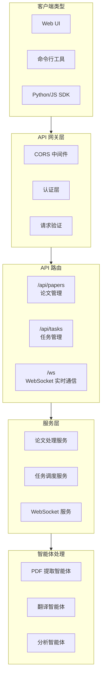

# API 接口文档

## 执行概览

### API 架构概览

本文档详细描述了 Agentic AI Papers 系统的 RESTful API 接口，为 Web UI 和远程客户端提供完整的使用指南。



### 核心功能

- 📄 **论文管理**：上传、处理、检索学术论文
- 🔄 **任务调度**：异步处理任务管理
- 📡 **实时更新**：WebSocket 实时进度推送
- 📊 **批量处理**：支持大规模批量操作
- 🔍 **智能分析**：基于 AI 的内容提取和分析

## 快速开始

### 基础信息

- **Base URL**: `http://localhost:8000`
- **API 版本**: `1.0.0`
- **文档地址**: `/docs` (Swagger UI)
- **替代文档**: `/redoc`

### 第一个请求

```bash
# 检查服务健康状态
curl -X GET "http://localhost:8000/health"

# 响应示例
{
  "status": "healthy",
  "service": "agentic-ai-papers-api",
  "version": "1.0.0"
}
```

### Python 快速示例

```python
import requests

# 上传论文
with open("paper.pdf", "rb") as f:
    response = requests.post(
        "http://localhost:8000/api/papers/upload",
        files={"file": f}
    )
    paper_id = response.json()["paper_id"]

# 处理论文
response = requests.post(
    f"http://localhost:8000/api/papers/{paper_id}/process",
    json={"workflow": "full", "options": {"extract_images": True}}
)

# 查询状态
status = requests.get(
    f"http://localhost:8000/api/papers/{paper_id}/status"
).json()
print(f"处理状态: {status['status']}")
```

### JavaScript 快速示例

```javascript
// 上传论文
const formData = new FormData();
formData.append("file", pdfFile);

const uploadResponse = await fetch("http://localhost:8000/api/papers/upload", {
  method: "POST",
  body: formData,
});
const { paper_id } = await uploadResponse.json();

// 处理论文
const processResponse = await fetch(
  `http://localhost:8000/api/papers/${paper_id}/process`,
  {
    method: "POST",
    headers: { "Content-Type": "application/json" },
    body: JSON.stringify({
      workflow: "full",
      options: { extract_images: true },
    }),
  }
);
```

## 认证与授权

### 当前状态

- ✅ **CORS 已启用**：支持 `http://localhost:3000` 和 `http://127.0.0.1:3000`
- ⚠️ **无需认证**：当前版本暂未实现认证机制
- 📋 **未来计划**：将支持 API Key 和 OAuth 2.0

### 请求头说明

```http
# 必需请求头
Content-Type: application/json  # 对于 JSON 请求体
Content-Type: multipart/form-data  # 对于文件上传

# 可选请求头
Accept: application/json  # 指定响应格式
X-Request-ID: uuid  # 请求追踪 ID
```

## Papers API (/api/papers)

### 1. 上传论文

**端点**: `POST /api/papers/upload`

上传 PDF 论文文件到系统。

**请求参数**:

- Query 参数:
  - `category` (string, 可选): 论文分类，默认 "general"

**请求体**: `multipart/form-data`

- `file` (file, 必需): PDF 文件，最大 50MB

**响应模型**:

```json
{
  "paper_id": "uuid-string",
  "filename": "paper.pdf",
  "category": "general",
  "size": 1024000,
  "upload_time": "2024-01-01T12:00:00Z"
}
```

**示例**:

```bash
curl -X POST "http://localhost:8000/api/papers/upload?category=ai" \
  -F "file=@paper.pdf"
```

### 2. 处理论文

**端点**: `POST /api/papers/{paper_id}/process`

启动论文处理工作流。

**路径参数**:

- `paper_id` (string, 必需): 论文 ID

**请求体**:

```json
{
  "workflow": "full",
  "options": {
    "extract_images": true,
    "extract_tables": true,
    "extract_formulas": true,
    "preserve_format": true
  }
}
```

**工作流类型**:

- `extract`: 仅提取内容
- `translate`: 仅翻译（需先提取）
- `analyze`: 仅分析
- `full`: 完整流程（提取 → 翻译 → 分析）
- `heartfelt`: 生成深度阅读报告

**响应**: 处理任务 ID 和初始状态

### 3. 获取论文状态

**端点**: `GET /api/papers/{paper_id}/status`

查询论文处理状态。

**响应模型**:

```json
{
  "paper_id": "uuid-string",
  "status": "processing",
  "workflows": {
    "extract": {
      "status": "completed",
      "updated_at": "2024-01-01T12:05:00Z"
    },
    "translate": {
      "status": "processing",
      "progress": 45
    },
    "analyze": {
      "status": "pending"
    }
  },
  "upload_time": "2024-01-01T12:00:00Z",
  "updated_at": "2024-01-01T12:05:00Z",
  "category": "ai",
  "filename": "paper.pdf"
}
```

### 4. 获取论文内容

**端点**: `GET /api/papers/{paper_id}/content`

获取处理后的论文内容。

**路径参数**:

- `paper_id` (string, 必需): 论文 ID

**查询参数**:

- `content_type` (string, 可选): 内容类型
  - `source`: 原始内容
  - `translation`: 翻译内容（默认）
  - `heartfelt`: 分析报告

**响应**: 包含请求内容的 Markdown 文本

### 5. 列出论文

**端点**: `GET /api/papers/`

分页获取论文列表。

**查询参数**:

- `category` (string, 可选): 按分类筛选
- `status` (string, 可选): 按状态筛选
- `limit` (integer, 可选, 默认 20, 最大 100): 返回数量
- `offset` (integer, 可选, 默认 0): 偏移量

**响应模型**:

```json
{
  "papers": [
    {
      "paper_id": "uuid-string",
      "filename": "paper.pdf",
      "category": "ai",
      "status": "completed",
      "upload_time": "2024-01-01T12:00:00Z",
      "updated_at": "2024-01-01T12:10:00Z",
      "size": 1024000,
      "metadata": {
        "title": "Attention Is All You Need",
        "authors": ["Ashish Vaswani", "Noam Shazeer"],
        "year": 2017,
        "venue": "NeurIPS",
        "abstract": "摘要内容...",
        "pages": 15,
        "doi": "10.5555/3295222.3295349",
        "keywords": ["attention", "transformer", "nlp"]
      }
    }
  ],
  "total": 100,
  "offset": 0,
  "limit": 20
}
```

### 6. 删除论文

**端点**: `DELETE /api/papers/{paper_id}`

删除论文及其所有相关数据。

**响应**:

```json
{
  "deleted": true,
  "paper_id": "uuid-string"
}
```

### 7. 批量处理论文

**端点**: `POST /api/papers/batch`

批量处理多篇论文。

**查询参数**:

- `workflow` (string, 可选, 默认 "full"): 工作流类型

**请求体**:

```json
["paper-id-1", "paper-id-2", "paper-id-3"]
```

**约束**: 最多 50 篇论文

**响应**:

```json
{
  "batch_id": "batch-uuid",
  "total_requested": 3,
  "total_files": 3,
  "workflow": "full",
  "stats": {
    "started": 3,
    "completed": 0,
    "failed": 0
  },
  "results": [
    {
      "paper_id": "paper-id-1",
      "task_id": "task-uuid-1",
      "status": "started"
    }
  ]
}
```

### 8. 获取分析报告

**端点**: `GET /api/papers/{paper_id}/report`

获取论文的深度分析报告。

**响应**: 包含见解、贡献、方法论等的结构化报告

### 9. 翻译论文

**端点**: `POST /api/papers/{paper_id}/translate`

单独启动翻译任务。

**响应**: 翻译任务状态和进度

### 10. 分析论文

**端点**: `POST /api/papers/{paper_id}/analyze`

单独启动分析任务。

**响应**: 分析任务状态和结果

### 11. Papers 健康检查

**端点**: `GET /api/papers/health`

检查 Papers 服务状态。

**响应**:

```json
{
  "status": "healthy",
  "message": "Service is running"
}
```

## Tasks API (/api/tasks)

### 1. 列出任务

**端点**: `GET /api/tasks/`

获取任务列表，支持筛选。

**查询参数**:

- `status` (string, 可选): 按状态筛选
- `paper_id` (string, 可选): 按论文 ID 筛选
- `workflow` (string, 可选): 按工作流筛选
- `limit` (integer, 可选, 默认 20, 最大 100)
- `offset` (integer, 可选, 默认 0)

**响应模型**:

```json
{
  "tasks": [
    {
      "task_id": "uuid-string",
      "paper_id": "uuid-string",
      "workflow": "full",
      "status": "processing",
      "progress": 65,
      "created_at": "2024-01-01T12:00:00Z",
      "updated_at": "2024-01-01T12:05:00Z"
    }
  ],
  "total": 50,
  "offset": 0,
  "limit": 20
}
```

### 2. 获取任务详情

**端点**: `GET /api/tasks/{task_id}`

获取任务的详细信息。

**响应模型**:

```json
{
  "task_id": "uuid-string",
  "paper_id": "uuid-string",
  "workflow": "translate",
  "status": "completed",
  "progress": 100,
  "message": "Translation completed successfully",
  "result": {
    "output_path": "/path/to/translation.md",
    "word_count": 5000,
    "processing_time": 120
  },
  "error": null,
  "created_at": "2024-01-01T12:00:00Z",
  "updated_at": "2024-01-01T12:02:00Z",
  "params": {
    "target_language": "zh",
    "preserve_format": true
  }
}
```

### 3. 取消任务

**端点**: `DELETE /api/tasks/{task_id}`

取消正在运行的任务。

**响应**:

```json
{
  "cancelled": true,
  "task_id": "uuid-string",
  "message": "Task successfully cancelled"
}
```

### 4. 获取任务日志

**端点**: `GET /api/tasks/{task_id}/logs`

获取任务执行日志。

**查询参数**:

- `lines` (integer, 可选, 默认 100, 最大 1000): 日志行数

**响应**:

```json
{
  "task_id": "uuid-string",
  "logs": "[2024-01-01 12:00:00] Task started\n[2024-01-01 12:00:05] Processing page 1/10\n..."
}
```

### 5. 清理已完成任务

**端点**: `DELETE /api/tasks/cleanup`

清理旧任务记录。

**查询参数**:

- `older_than_hours` (integer, 可选, 默认 24, 最小 1): 清理多少小时前的任务

**响应**:

```json
{
  "deleted_count": 25,
  "message": "Successfully cleaned up 25 completed tasks"
}
```

## WebSocket API (/ws)

### 连接端点

**WebSocket**: `ws://localhost:8000/ws/ws/{client_id}`

建立 WebSocket 连接以接收实时更新。

**路径参数**:

- `client_id` (string, 必需): 唯一客户端标识符

### 客户端消息格式

#### 订阅任务更新

```json
{
  "type": "subscribe",
  "task_id": "uuid-string"
}
```

#### 取消订阅

```json
{
  "type": "unsubscribe",
  "task_id": "uuid-string"
}
```

#### 心跳

```json
{
  "type": "ping"
}
```

### 服务器消息格式

#### 任务进度更新

```json
{
  "type": "task_update",
  "task_id": "uuid-string",
  "status": "processing",
  "progress": 45,
  "message": "Translating page 5/10",
  "timestamp": "2024-01-01T12:05:00Z"
}
```

#### 任务完成

```json
{
  "type": "task_completed",
  "task_id": "uuid-string",
  "success": true,
  "result": {
    "output_path": "/path/to/output"
  },
  "error": null,
  "timestamp": "2024-01-01T12:10:00Z"
}
```

#### 批量处理进度

```json
{
  "type": "batch_progress",
  "batch_id": "batch-uuid",
  "total": 10,
  "processed": 4,
  "progress": 40,
  "current_file": "paper4.pdf",
  "timestamp": "2024-01-01T12:05:00Z"
}
```

#### 订阅确认

```json
{
  "type": "subscription_confirmed",
  "task_id": "uuid-string",
  "timestamp": "2024-01-01T12:00:00Z"
}
```

### JavaScript WebSocket 客户端示例

```javascript
const clientId = `client-${Date.now()}`;
const ws = new WebSocket(`ws://localhost:8000/ws/ws/${clientId}`);

ws.onopen = () => {
  console.log("WebSocket 连接已建立");

  // 订阅任务更新
  ws.send(
    JSON.stringify({
      type: "subscribe",
      task_id: "your-task-id",
    })
  );
};

ws.onmessage = (event) => {
  const message = JSON.parse(event.data);

  switch (message.type) {
    case "task_update":
      console.log(`任务进度: ${message.progress}%`);
      break;
    case "task_completed":
      console.log("任务已完成:", message.result);
      break;
    case "batch_progress":
      console.log(`批量进度: ${message.processed}/${message.total}`);
      break;
  }
};

// 心跳维持
setInterval(() => {
  ws.send(JSON.stringify({ type: "ping" }));
}, 30000);
```

### Python WebSocket 客户端示例

```python
import asyncio
import websockets
import json

async def monitor_task(task_id):
    client_id = f"client-{asyncio.get_event_loop().time()}"
    uri = f"ws://localhost:8000/ws/ws/{client_id}"

    async with websockets.connect(uri) as websocket:
        # 订阅任务
        await websocket.send(json.dumps({
            "type": "subscribe",
            "task_id": task_id
        }))

        async for message in websocket:
            data = json.loads(message)

            if data["type"] == "task_update":
                print(f"进度: {data['progress']}% - {data['message']}")
            elif data["type"] == "task_completed":
                print(f"任务完成: {data['result']}")
                break

# 运行监控
asyncio.run(monitor_task("your-task-id"))
```

## 数据模型

### PaperMetadata

```json
{
  "title": "string",
  "authors": ["string"],
  "year": "integer",
  "venue": "string",
  "abstract": "string",
  "pages": "integer",
  "doi": "string",
  "keywords": ["string"]
}
```

### TaskStatus

可能的任务状态值：

- `pending`: 已排队，等待执行
- `processing`: 正在处理中
- `completed`: 已成功完成
- `failed`: 处理失败
- `cancelled`: 已取消

### WorkflowOptions

```json
{
  "extract_images": "boolean",
  "extract_tables": "boolean",
  "extract_formulas": "boolean",
  "preserve_format": "boolean",
  "target_language": "string",
  "batch_size": "integer"
}
```

## 错误处理

### HTTP 状态码

- `200 OK`: 请求成功
- `400 Bad Request`: 请求参数错误
- `404 Not Found`: 资源不存在
- `422 Unprocessable Entity`: 请求体验证失败
- `500 Internal Server Error`: 服务器内部错误

### 错误响应格式

```json
{
  "detail": "错误描述",
  "error": "详细错误信息",
  "error_code": "ERROR_CODE",
  "request_id": "uuid-string"
}
```

### 常见错误码

| 错误码                 | 描述             | 解决方案               |
| ---------------------- | ---------------- | ---------------------- |
| `INVALID_FILE_FORMAT`  | 不支持的文件格式 | 仅支持 PDF 文件        |
| `FILE_TOO_LARGE`       | 文件过大         | 文件大小限制为 50MB    |
| `PAPER_NOT_FOUND`      | 论文不存在       | 检查 paper_id 是否正确 |
| `TASK_NOT_FOUND`       | 任务不存在       | 检查 task_id 是否正确  |
| `WORKFLOW_IN_PROGRESS` | 工作流正在运行   | 等待当前工作流完成     |
| `INVALID_WORKFLOW`     | 无效的工作流类型 | 使用支持的工作流类型   |

## SDK 使用示例

### Python SDK 包装器

```python
import requests
import websocket
import json
import threading
from typing import Optional, Callable

class AgenticAIPapersClient:
    def __init__(self, base_url: str = "http://localhost:8000"):
        self.base_url = base_url
        self.session = requests.Session()

    def upload_paper(self, file_path: str, category: str = "general") -> str:
        """上传论文并返回 paper_id"""
        with open(file_path, "rb") as f:
            response = self.session.post(
                f"{self.base_url}/api/papers/upload",
                files={"file": f},
                params={"category": category}
            )
            response.raise_for_status()
            return response.json()["paper_id"]

    def process_paper(
        self,
        paper_id: str,
        workflow: str = "full",
        options: Optional[dict] = None
    ) -> str:
        """处理论文并返回 task_id"""
        response = self.session.post(
            f"{self.base_url}/api/papers/{paper_id}/process",
            json={
                "workflow": workflow,
                "options": options or {}
            }
        )
        response.raise_for_status()
        return response.json()["task_id"]

    def get_status(self, paper_id: str) -> dict:
        """获取论文状态"""
        response = self.session.get(
            f"{self.base_url}/api/papers/{paper_id}/status"
        )
        response.raise_for_status()
        return response.json()

    def get_content(self, paper_id: str, content_type: str = "translation") -> str:
        """获取论文内容"""
        response = self.session.get(
            f"{self.base_url}/api/papers/{paper_id}/content",
            params={"content_type": content_type}
        )
        response.raise_for_status()
        return response.json()["content"]

    def monitor_task(
        self,
        task_id: str,
        progress_callback: Optional[Callable] = None
    ) -> dict:
        """监控任务进度直到完成"""
        def on_message(ws, message):
            data = json.loads(message)
            if data["type"] == "task_update" and progress_callback:
                progress_callback(data)
            elif data["type"] == "task_completed":
                ws.result = data

        client_id = f"python-client-{threading.get_ident()}"
        ws = websocket.WebSocketApp(
            f"ws://localhost:8000/ws/ws/{client_id}",
            on_message=on_message,
            on_open=lambda ws: ws.send(json.dumps({
                "type": "subscribe",
                "task_id": task_id
            }))
        )

        ws.result = None
        wst = threading.Thread(target=ws.run_forever)
        wst.start()

        while ws.result is None:
            continue

        return ws.result

# 使用示例
client = AgenticAIPapersClient()

# 上传并处理论文
paper_id = client.upload_paper("paper.pdf")
task_id = client.process_paper(paper_id, workflow="full")

# 监控进度
def on_progress(data):
    print(f"进度: {data['progress']}%")

result = client.monitor_task(task_id, on_progress)
print("处理完成:", result)

# 获取翻译内容
content = client.get_content(paper_id, "translation")
print(content)
```

### Node.js SDK 包装器

```javascript
class AgenticAIPapersClient {
  constructor(baseUrl = "http://localhost:8000") {
    this.baseUrl = baseUrl;
  }

  async uploadPaper(filePath, category = "general") {
    const FormData = require("form-data");
    const fs = require("fs");

    const form = new FormData();
    form.append("file", fs.createReadStream(filePath));

    const response = await fetch(
      `${this.baseUrl}/api/papers/upload?category=${category}`,
      { method: "POST", body: form }
    );

    const data = await response.json();
    return data.paper_id;
  }

  async processPaper(paperId, workflow = "full", options = {}) {
    const response = await fetch(
      `${this.baseUrl}/api/papers/${paperId}/process`,
      {
        method: "POST",
        headers: { "Content-Type": "application/json" },
        body: JSON.stringify({ workflow, options }),
      }
    );

    const data = await response.json();
    return data.task_id;
  }

  async getStatus(paperId) {
    const response = await fetch(
      `${this.baseUrl}/api/papers/${paperId}/status`
    );
    return response.json();
  }

  async getContent(paperId, contentType = "translation") {
    const response = await fetch(
      `${this.baseUrl}/api/papers/${paperId}/content?content_type=${contentType}`
    );
    const data = await response.json();
    return data.content;
  }

  monitorTask(taskId, progressCallback) {
    const clientId = `node-client-${Date.now()}`;
    const WS = require("ws");

    return new Promise((resolve) => {
      const ws = new WS(`ws://localhost:8000/ws/ws/${clientId}`);

      ws.on("open", () => {
        ws.send(
          JSON.stringify({
            type: "subscribe",
            task_id: taskId,
          })
        );
      });

      ws.on("message", (data) => {
        const message = JSON.parse(data);

        if (message.type === "task_update" && progressCallback) {
          progressCallback(message);
        } else if (message.type === "task_completed") {
          ws.close();
          resolve(message);
        }
      });
    });
  }
}

// 使用示例
async function main() {
  const client = new AgenticAIPapersClient();

  // 上传并处理论文
  const paperId = await client.uploadPaper("paper.pdf");
  const taskId = await client.processPaper(paperId, "full");

  // 监控进度
  const result = await client.monitorTask(taskId, (data) => {
    console.log(`进度: ${data.progress}%`);
  });

  console.log("处理完成:", result);

  // 获取内容
  const content = await client.getContent(paperId);
  console.log(content);
}

main().catch(console.error);
```

## 最佳实践

### 1. 性能优化

#### 批量处理

```python
# 推荐：使用批量 API
papers = ["id1", "id2", "id3"]
batch_response = requests.post(
    "http://localhost:8000/api/papers/batch",
    json=papers
)

# 避免：循环单独处理
# for paper_id in papers:
#     requests.post(f"http://localhost:8000/api/papers/{paper_id}/process")
```

#### 分页查询

```python
# 使用分页避免大数据集
def get_all_papers(category=None):
    papers = []
    offset = 0
    limit = 50

    while True:
        response = requests.get(
            "http://localhost:8000/api/papers/",
            params={
                "category": category,
                "limit": limit,
                "offset": offset
            }
        )
        data = response.json()
        papers.extend(data["papers"])

        if len(data["papers"]) < limit:
            break

        offset += limit

    return papers
```

### 2. 错误处理

```python
import time
from requests.exceptions import RequestException

def process_with_retry(paper_id, max_retries=3):
    for attempt in range(max_retries):
        try:
            response = requests.post(
                f"http://localhost:8000/api/papers/{paper_id}/process",
                json={"workflow": "full"}
            )
            response.raise_for_status()
            return response.json()

        except RequestException as e:
            if attempt == max_retries - 1:
                raise

            time.sleep(2 ** attempt)  # 指数退避
            continue
```

### 3. 实时监控优化

```javascript
// 使用单个 WebSocket 监控多个任务
class TaskMonitor {
  constructor() {
    this.ws = null;
    this.subscriptions = new Set();
  }

  async connect() {
    const clientId = `monitor-${Date.now()}`;
    this.ws = new WebSocket(`ws://localhost:8000/ws/ws/${clientId}`);

    this.ws.onopen = () => {
      // 重新订阅所有任务
      this.subscriptions.forEach((taskId) => {
        this.ws.send(
          JSON.stringify({
            type: "subscribe",
            task_id: taskId,
          })
        );
      });
    };

    return new Promise((resolve) => {
      this.ws.onopen = resolve;
    });
  }

  subscribe(taskId, callback) {
    this.subscriptions.add(taskId);

    // 保存回调
    if (!this.callbacks) this.callbacks = {};
    this.callbacks[taskId] = callback;

    // 发送订阅
    if (this.ws && this.ws.readyState === WebSocket.OPEN) {
      this.ws.send(
        JSON.stringify({
          type: "subscribe",
          task_id: taskId,
        })
      );
    }
  }

  onmessage(event) {
    const data = JSON.parse(event.data);
    const callback = this.callbacks[data.task_id];

    if (callback) {
      callback(data);
    }
  }
}

// 使用示例
const monitor = new TaskMonitor();
await monitor.connect();

// 监控多个任务
monitor.subscribe(taskId1, (data) => console.log("Task 1:", data));
monitor.subscribe(taskId2, (data) => console.log("Task 2:", data));
```

### 4. 资源管理

```python
import atexit
from contextlib import contextmanager

@contextmanager
def paper_client():
    client = AgenticAIPapersClient()
    try:
        yield client
    finally:
        # 清理资源
        client.session.close()

# 使用
with paper_client() as client:
    paper_id = client.upload_paper("paper.pdf")
    content = client.get_content(paper_id)
```

## 故障排除

### 常见问题

#### 1. 文件上传失败

**问题**: 上传 PDF 时返回 400 错误
**解决方案**:

- 检查文件是否为有效的 PDF 格式
- 确认文件大小不超过 50MB
- 使用 `file` 命令验证文件类型

```bash
# 验证 PDF 文件
file paper.pdf
# 应输出: paper.pdf: PDF document
```

#### 2. WebSocket 连接断开

**问题**: WebSocket 连接频繁断开
**解决方案**:

- 实现自动重连机制
- 发送心跳包保持连接
- 检查网络稳定性

```javascript
class ReconnectingWebSocket {
  constructor(url) {
    this.url = url;
    this.reconnectInterval = 5000;
    this.connect();
  }

  connect() {
    this.ws = new WebSocket(this.url);

    this.ws.onopen = () => {
      console.log("WebSocket 已连接");
      this.reconnectInterval = 5000;
    };

    this.ws.onclose = () => {
      console.log("WebSocket 断开，尝试重连...");
      setTimeout(() => {
        this.reconnectInterval = Math.min(this.reconnectInterval * 2, 30000);
        this.connect();
      }, this.reconnectInterval);
    };
  }
}
```

#### 3. 任务处理缓慢

**问题**: 处理大型 PDF 时速度很慢
**解决方案**:

- 使用批量处理模式
- 调整处理选项（如禁用图像提取）
- 监控系统资源使用

```python
# 针对大型文档的优化选项
options = {
    "extract_images": False,  # 禁用图像提取以加快速度
    "extract_tables": True,
    "extract_formulas": True,
    "preserve_format": True
}
```

#### 4. 内存使用过高

**问题**: 处理多个文件时内存占用过高
**解决方案**:

- 使用流式处理
- 限制并发任务数
- 定期清理已完成任务

```python
# 清理旧任务释放内存
def cleanup_old_tasks():
    requests.delete(
        "http://localhost:8000/api/tasks/cleanup",
        params={"older_than_hours": 1}
    )
```

### 调试技巧

#### 1. 启用详细日志

```python
import logging

# 启用请求日志
logging.basicConfig(level=logging.DEBUG)
requests_log = logging.getLogger("requests.packages.urllib3")
requests_log.setLevel(logging.DEBUG)
```

#### 2. 使用请求追踪 ID

```python
import uuid

headers = {
    "X-Request-ID": str(uuid.uuid4()),
    "Content-Type": "application/json"
}

response = requests.post(
    "http://localhost:8000/api/papers/process",
    json=data,
    headers=headers
)
```

#### 3. 检查任务日志

```python
def debug_task(task_id):
    # 获取详细日志
    logs = requests.get(
        f"http://localhost:8000/api/tasks/{task_id}/logs",
        params={"lines": 1000}
    ).json()

    print("任务日志:")
    print(logs["logs"])

    # 获取任务状态
    status = requests.get(
        f"http://localhost:8000/api/tasks/{task_id}"
    ).json()

    print("\n任务详情:")
    print(f"状态: {status['status']}")
    print(f"进度: {status['progress']}%")
    if status['error']:
        print(f"错误: {status['error']}")
```

## 版本更新

### v1.0.0 特性

- ✅ 完整的论文管理 API
- ✅ 异步任务处理
- ✅ WebSocket 实时更新
- ✅ 批量处理支持
- ✅ 暂无认证机制

### 计划中的功能

- [ ] API Key 认证
- [ ] OAuth 2.0 支持
- [ ] 速率限制
- [ ] 更多导出格式
- [ ] 高级搜索功能
- [ ] 自定义工作流

## 总结

Agentic AI Papers API 提供了完整的论文处理和管理功能，支持：

1. **灵活的文件处理**：上传、处理、提取、翻译、分析
2. **强大的任务管理**：异步处理、进度跟踪、批量操作
3. **实时通信**：WebSocket 支持实时更新
4. **易于集成**：RESTful API 设计，支持多种客户端

通过遵循本文档的指南，您可以轻松地将论文处理功能集成到您的应用中。
