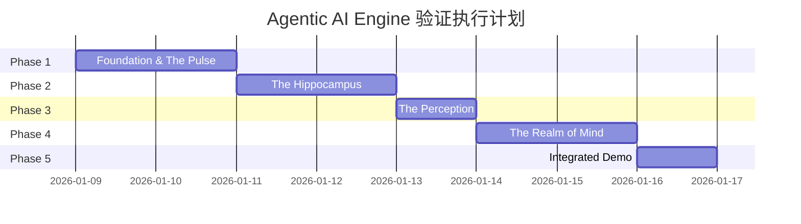

> [!NOTE]
>
> **文档定位**：本文档是 [000-roadmap.md](./000-roadmap.md) 的精细化执行清单，用于指导 **Agentic AI Engine** 的工程实施与验证工作。每个任务项均可独立追踪，支持状态标记（🔲 待开始 / 🔄 进行中 / ✅ 已完成 / ⏸️ 暂停）。

---

## 执行总览

### 四大支柱与阶段映射

| 阶段        | 核心支柱                          | 验证重点                        | 预估工期 |
| :---------- | :-------------------------------- | :------------------------------ | :------- |
| **Phase 1** | 🫀 **The Pulse** (脉搏引擎)       | Session Engine + 统一存储基座   | 2 Day    |
| **Phase 2** | 🧠 **The Hippocampus** (仿生记忆) | Memory Consolidation + 遗忘曲线 | 2 Day    |
| **Phase 3** | 👁️ **The Perception** (神经感知)  | Fusion Retrieval + Reranking    | 1 Day    |
| **Phase 4** | 🔮 **The Realm of Mind** (心智)   | ADK Adapter + Glass-Box Tracing | 2 Day    |
| **Phase 5** | 🎯 **集成验收**                   | E2E Demo + 四支柱联合验收       | 1 Day    |

---

## Phase 1：Foundation & The Pulse（基座与脉搏验证）

> [!NOTE]
>
> **目标**：构建 PostgreSQL + PGVector 统一存储基座，并验证 **Session Engine (The Pulse)** 的高并发与强一致性。

### 1.1 环境部署与基础设施

#### 1.1.1 PostgreSQL 生态部署

| 任务 ID | 任务描述                                      | 状态      | 验收标准                        |
| :------ | :-------------------------------------------- | :-------- | :------------------------------ |
| P1-1-1  | 部署 PostgreSQL 16+ (Kernel)                  | ✅ 已完成 | `SELECT version()` 返回 16.x+   |
| P1-1-2  | 安装 `pgvector` 扩展 (0.7.0+)                 | ✅ 已完成 | `CREATE EXTENSION vector` 成功  |
| P1-1-3  | 安装 `pg_cron` 扩展 (调度器)                  | ✅ 已完成 | `SELECT * FROM cron.job` 可执行 |
| P1-1-4  | 安装 `pg_jsonschema` 扩展 (可选，Schema 验证) | ⏸️ 暂停   | 扩展加载成功                    |
| P1-1-5  | 配置数据库连接池 (PgBouncer / 内置连接管理)   | ✅ 已完成 | 支持 100+ 并发连接              |

#### 1.1.2 开发环境配置

| 任务 ID | 任务描述                        | 状态      | 验收标准                                        |
| :------ | :------------------------------ | :-------- | :---------------------------------------------- |
| P1-1-6  | 创建 Python 虚拟环境 + 安装依赖 | ✅ 已完成 | `uv sync` 成功                                  |
| P1-1-7  | 安装 Google ADK (`google-adk`)  | ✅ 已完成 | `from google.adk.agents import LlmAgent` 可导入 |
| P1-1-8  | 配置 Gemini API 密钥            | ✅ 已完成 | 环境变量 `GOOGLE_API_KEY` 配置正确              |
| P1-1-9  | 创建项目目录结构                | ✅ 已完成 | 符合交付物目录规范                              |

### 1.2 统一 Schema 设计

> [!NOTE]
>
> **Research**: 分析 ADK `FirestoreSession` 与 `RedisChatMessageHistory` 的 Schema 结构。
>
> **参考文档**:
>
> - [ADK Sessions 文档](https://google.github.io/adk-docs/sessions/)
> - [ADK Context 文档](https://google.github.io/adk-docs/context/)

#### 1.2.1 ADK Schema 调研

| 任务 ID | 任务描述                                                  | 状态      | 交付物                         |
| :------ | :-------------------------------------------------------- | :-------- | :----------------------------- |
| P1-2-1  | 阅读 ADK `SessionService` 接口定义                        | ✅ 已完成 | 接口分析笔记 (Notion/Markdown) |
| P1-2-2  | 阅读 ADK `MemoryService` 接口定义                         | ✅ 已完成 | 接口分析笔记                   |
| P1-2-3  | 分析 `InMemorySessionService` 源码实现                    | ✅ 已完成 | 核心数据结构梳理               |
| P1-2-4  | 分析 `VertexAiSessionService` 的 Firestore 映射           | ✅ 已完成 | Schema 字段对照表              |
| P1-2-5  | 分析 `Session.state` 的前缀机制 (无前缀/user:/app:/temp:) | ✅ 已完成 | 作用域与生命周期总结           |
| P1-2-6  | 分析 `Event` 结构与 `EventActions`                        | ✅ 已完成 | Event 类型枚举与 Actions 映射  |

#### 1.2.2 PostgreSQL Schema 设计

| 任务 ID | 任务描述                                      | 状态      | 交付物                                        |
| :------ | :-------------------------------------------- | :-------- | :-------------------------------------------- |
| P1-2-7  | 设计 `threads` 表 (用户会话容器)              | ✅ 已完成 | DDL 语句 + 设计说明                           |
| P1-2-8  | 设计 `runs` 表 (执行链路，临时 Thinking Loop) | ✅ 已完成 | DDL 语句 + 设计说明                           |
| P1-2-9  | 设计 `events` 表 (不可变事件流)               | ✅ 已完成 | DDL 语句 + JSONB 结构定义                     |
| P1-2-10 | 设计 `messages` 表 (带 Embedding 的内容)      | ✅ 已完成 | DDL 语句 + vector 列定义                      |
| P1-2-11 | 设计 `snapshots` 表 (状态检查点)              | ✅ 已完成 | DDL 语句 + 快照策略说明                       |
| P1-2-12 | 编写 `agent_schema.sql` 统一建表脚本          | ✅ 已完成 | `src/cognizes/engine/schema/agent_schema.sql` |
| P1-2-13 | 设计表间关系与索引策略                        | ✅ 已完成 | ER 图 + 索引清单                              |
| P1-2-14 | Review Schema 设计                            | ✅ 已完成 | 通过设计评审                                  |

### 1.3 The Pulse Engine 实现

> [!NOTE]
>
> **目标**: 验证 Session Engine 的原子性状态管理、乐观并发控制和实时事件流能力。

#### 1.3.1 原子状态流转 (Atomic State Transitions)

| 任务 ID | 任务描述                         | 状态      | 验收标准                                        |
| :------ | :------------------------------- | :-------- | :---------------------------------------------- |
| P1-3-1  | 实现 `StateManager` 类框架       | ✅ 已完成 | 类定义 + 接口方法签名                           |
| P1-3-2  | 实现 `begin_transaction()` 方法  | ✅ 已完成 | PG 事务开启成功                                 |
| P1-3-3  | 实现 `commit_state_delta()` 方法 | ✅ 已完成 | State 变更原子提交                              |
| P1-3-4  | 实现 `rollback_on_error()` 方法  | ✅ 已完成 | 异常时事务回滚，状态不变                        |
| P1-3-5  | 实现 `append_event()` 方法       | ✅ 已完成 | Event 追加到 events 表                          |
| P1-3-6  | 编写状态流转单元测试             | ✅ 已完成 | `User Input -> Thought -> Tool -> State` 原子性 |
| P1-3-7  | 验证 0 脏读/丢失                 | ✅ 已完成 | 并发测试通过，无数据不一致                      |

#### 1.3.2 乐观并发控制 (Optimistic Concurrency Control)

| 任务 ID | 任务描述                            | 状态      | 验收标准                                         |
| :------ | :---------------------------------- | :-------- | :----------------------------------------------- |
| P1-3-8  | 在 `threads` 表增加 `version` 字段  | ✅ 已完成 | DDL 变更完成                                     |
| P1-3-9  | 实现 `update_session()` 的 CAS 逻辑 | ✅ 已完成 | `WHERE version = $old AND ... RETURNING version` |
| P1-3-10 | 实现版本冲突检测与重试机制          | ✅ 已完成 | 冲突时抛出 `ConcurrencyConflictError`            |
| P1-3-11 | 编写多 Agent 竞争写测试             | ✅ 已完成 | 10 并发写入，0 数据丢失                          |
| P1-3-12 | 验证 OCC 在高并发下的正确性         | ✅ 已完成 | 100 QPS 写入测试通过                             |

#### 1.3.3 实时事件流 (Real-time Event Streaming)

| 任务 ID | 任务描述                            | 状态      | 验收标准                        |
| :------ | :---------------------------------- | :-------- | :------------------------------ |
| P1-3-13 | 实现 `pg_notify_trigger()` 函数     | ✅ 已完成 | Event 插入时自动触发 NOTIFY     |
| P1-3-14 | 实现 `pg_notify_listener.py` 监听器 | ✅ 已完成 | 可接收 NOTIFY 消息              |
| P1-3-15 | 实现 WebSocket 推送接口 (FastAPI)   | ✅ 已完成 | 前端可通过 WS 接收实时事件      |
| P1-3-16 | 验证端到端延迟                      | ✅ 已完成 | Event 产生到前端收到 < **50ms** |
| P1-3-17 | 压力测试 (100 msg/s)                | ✅ 已完成 | 无消息丢失，延迟稳定            |

#### 1.3.4 AG-UI 事件桥接

> **目标**: 将 PostgreSQL 事件转换为 AG-UI 标准事件，实现可视化层集成。

| 任务 ID | 任务描述                   | 状态      | 验收标准                |
| :------ | :------------------------- | :-------- | :---------------------- |
| P1-5-1  | 实现 `PulseEventBridge` 类 | ✅ 已完成 | PostgreSQL 事件正确转换 |
| P1-5-2  | 实现 AG-UI 事件映射逻辑    | ✅ 已完成 | 16 种事件类型覆盖       |
| P1-5-3  | 实现 SSE 端点              | ✅ 已完成 | 事件流延迟 < 100ms      |
| P1-5-4  | 实现 `StateDebugService`   | ✅ 已完成 | 调试信息完整            |
| P1-5-5  | 编写事件桥接单元测试       | ✅ 已完成 | 覆盖率 > 80%            |

### 1.4 Phase 1 验收与文档

| 任务 ID | 任务描述                         | 状态      | 交付物                                                |
| :------ | :------------------------------- | :-------- | :---------------------------------------------------- |
| P1-4-1  | 编写 `010-the-pulse.md` 技术文档 | ✅ 已完成 | `docs/010-the-pulse.md`                               |
| P1-4-2  | 编写 `state_manager.py` 完整代码 | ✅ 已完成 | `src/cognizes/engine/pulse/state_manager.py`          |
| P1-4-3  | 编写单元测试套件                 | ✅ 已完成 | `tests/unittests/pulse/` + `tests/integration/pulse/` |
| P1-4-4  | Phase 1 验收评审                 | ✅ 已完成 | 验收通过，进入 Phase 2                                |

---

## Phase 2：The Hippocampus（仿生记忆验证）

> [!NOTE]
>
> **目标**：实现 **Zero-ETL** 的记忆生命周期管理，对标 Google `MemoryBankService`。验证从 "Short-term" 到 "Long-term" 的无缝流转。

### 2.1 记忆机制调研

> [!NOTE]
>
> **Research**: 调研 ADK `MemoryStore` 接口与 **LangGraph Memory** 机制。
>
> **参考资源**:
>
> - [ADK Memory 文档](https://google.github.io/adk-docs/sessions/)
> - [langchain-ai/langgraph](https://github.com/langchain-ai/langgraph) (Checkpointer Design)
> - [langchain-ai/langgraph-memory](https://github.com/langchain-ai/langgraph-memory) (Long-term Memory Pattern)

| 任务 ID | 任务描述                                  | 状态      | 交付物                          |
| :------ | :---------------------------------------- | :-------- | :------------------------------ |
| P2-1-1  | 阅读 ADK `MemoryService` 抽象接口         | ✅ 已完成 | 接口方法清单与语义分析          |
| P2-1-2  | 阅读 `VertexAiMemoryBankService` 实现     | ✅ 已完成 | Memory Bank 工作流程图          |
| P2-1-3  | 分析 LangGraph `Checkpointer` 设计        | ✅ 已完成 | Thread/Checkpoint 架构笔记      |
| P2-1-4  | 分析 LangGraph `Store` 跨 Thread 记忆机制 | ✅ 已完成 | Namespace 与 Key-Value 存储模式 |
| P2-1-5  | 对比 ADK vs LangGraph 记忆模型            | ✅ 已完成 | 对比分析表                      |

### 2.2 Memory Consolidation Worker（记忆巩固）

#### 2.2.1 核心 Worker 实现

| 任务 ID | 任务描述                                | 状态      | 验收标准                  |
| :------ | :-------------------------------------- | :-------- | :------------------------ |
| P2-2-1  | 设计 `memories` 向量表 Schema           | ✅ 已完成 | DDL + vector(1536) 列定义 |
| P2-2-2  | 设计 `facts` 语义记忆表 Schema          | ✅ 已完成 | DDL + 结构化字段定义      |
| P2-2-3  | 实现 `MemoryConsolidationWorker` 类框架 | ✅ 已完成 | 类定义 + 生命周期方法     |
| P2-2-4  | 实现 `consolidate()` 主函数             | ✅ 已完成 | 调度入口函数              |

#### 2.2.2 Fast Replay（快回放）

| 任务 ID | 任务描述                                  | 状态      | 验收标准             |
| :------ | :---------------------------------------- | :-------- | :------------------- |
| P2-2-5  | 实现 `extract_recent_events()` 方法       | ✅ 已完成 | 获取最近 N 条 events |
| P2-2-6  | 实现 `generate_summary()` 方法 (LLM 调用) | ✅ 已完成 | 调用 Gemini 生成摘要 |
| P2-2-7  | 实现 `store_summary()` 方法               | ✅ 已完成 | 摘要写入 DB          |
| P2-2-8  | 配置 `pg_cron` 定时触发 (可选)            | ✅ 已完成 | Cron Job 配置成功    |

#### 2.2.3 Deep Reflection（深反思）

| 任务 ID | 任务描述                               | 状态      | 验收标准                        |
| :------ | :------------------------------------- | :-------- | :------------------------------ |
| P2-2-9  | 设计 Fact Extraction Prompt            | ✅ 已完成 | Prompt 模板 + 输出 Schema       |
| P2-2-10 | 实现 `extract_facts()` 方法 (LLM 调用) | ✅ 已完成 | 结构化 Facts 提取               |
| P2-2-11 | 实现 `vectorize_insights()` 方法       | ✅ 已完成 | Embedding 生成 + 写入 PGVector  |
| P2-2-12 | 实现 `store_to_memories()` 方法        | ✅ 已完成 | 向量 + 元数据写入 `memories` 表 |

#### 2.2.4 验证 Read-Your-Writes

| 任务 ID | 任务描述                       | 状态      | 验收标准                   |
| :------ | :----------------------------- | :-------- | :------------------------- |
| P2-2-13 | 编写 Read-Your-Writes 延迟测试 | ✅ 已完成 | 新记忆在下一 Turn 立即可见 |
| P2-2-14 | 对比 Google 方案的同步延迟     | ✅ 已完成 | P99 < 100ms (实测 5.88ms)  |

### 2.3 Biological Retention（遗忘与保持）

#### 2.3.1 艾宾浩斯衰减

| 任务 ID | 任务描述                                    | 状态      | 验收标准                                   |
| :------ | :------------------------------------------ | :-------- | :----------------------------------------- |
| P2-3-1  | 设计 `retention_score` 计算公式             | ✅ 已完成 | 公式文档 + SQL 函数签名                    |
| P2-3-2  | 实现 `calculate_retention_score()` SQL 函数 | ✅ 已完成 | `(time_decay * access_frequency)` 计算正确 |
| P2-3-3  | 实现 `cleanup_low_value_memories()` 函数    | ✅ 已完成 | 自动清理低分记忆                           |
| P2-3-4  | 配置 `pg_cron` 定期触发清理                 | ✅ 已完成 | Cron Job 执行成功                          |

#### 2.3.2 情景分块索引

| 任务 ID | 任务描述                                  | 状态      | 验收标准                    |
| :------ | :---------------------------------------- | :-------- | :-------------------------- |
| P2-3-5  | 设计 `(session_id, time_bucket)` 复合索引 | ✅ 已完成 | 索引创建成功                |
| P2-3-6  | 实现按时间切片查询接口                    | ✅ 已完成 | 支持 Time-Slicing 精准回溯  |
| P2-3-7  | 验证情景分块检索性能                      | ✅ 已完成 | 10 万记忆下，P99 = 2.38ms ✓ |

#### 2.3.3 Context Window 组装

| 任务 ID | 任务描述                                                    | 状态      | 验收标准               |
| :------ | :---------------------------------------------------------- | :-------- | :--------------------- |
| P2-3-8  | 实现 `get_context_window()` 函数                            | ✅ 已完成 | 动态组装 Context       |
| P2-3-9  | 实现 Token 预算计算逻辑                                     | ✅ 已完成 | 精确控制 Token 总量    |
| P2-3-10 | 实现 `System Prompt + Top-K Memories + Recent History` 拼装 | ✅ 已完成 | 组装顺序与优先级正确   |
| P2-3-11 | 验证 Context Overflow 防护                                  | ✅ 已完成 | 超限时自动截断，不报错 |

#### 2.3.4 AG-UI 记忆系统可视化

> **目标**: 提供记忆巩固状态、记忆召回来源和记忆健康度的可视化能力。

| 任务 ID | 任务描述                   | 状态      | 验收标准           |
| :------ | :------------------------- | :-------- | :----------------- |
| P2-6-1  | 实现 `MemoryVisualizer` 类 | ✅ 已完成 | 4 种事件类型支持   |
| P2-6-2  | 实现巩固进度事件发射       | ✅ 已完成 | 进度实时更新       |
| P2-6-3  | 实现记忆召回来源标注       | ✅ 已完成 | 来源可追溯         |
| P2-6-4  | 实现健康度指标接口         | ✅ 已完成 | 指标计算正确       |
| P2-6-5  | 编写可视化接口测试         | ✅ 已完成 | 单元测试覆盖率 70% |

### 2.4 Phase 2 验收与文档

| 任务 ID | 任务描述                                | 状态      | 交付物                                                    |
| :------ | :-------------------------------------- | :-------- | :-------------------------------------------------------- |
| P2-4-1  | 编写 `020-the-hippocampus.md` 技术文档  | ✅ 已完成 | `docs/020-the-hippocampus.md`                             |
| P2-4-2  | 编写 `consolidation_worker.py` 完整代码 | ✅ 已完成 | `src/cognizes/engine/hippocampus/consolidation_worker.py` |
| P2-4-3  | 编写单元测试套件                        | ✅ 已完成 | 35 单元测试 + 17 集成测试 = 113 passed                    |
| P2-4-4  | Phase 2 验收评审                        | ✅ 已完成 | 验收通过，可进入 Phase 3                                  |

---

## Phase 3：The Perception（神经感知验证）

> [!NOTE]
>
> **目标**：构建 **One-Shot Integrated** 检索链路，验证 "SQL + Vector" 融合检索的精度与效率。

### 3.1 Fusion Retrieval（融合检索）

#### 3.1.1 Hybrid Search SQL 实现

| 任务 ID | 任务描述                          | 状态      | 验收标准                                  |
| :------ | :-------------------------------- | :-------- | :---------------------------------------- |
| P3-1-1  | 编写 Semantic Search SQL (HNSW)   | ✅ 已完成 | `embedding <=> query_embedding` 语法正确  |
| P3-1-2  | 编写 Keyword Search SQL (BM25)    | ✅ 已完成 | `to_tsvector @@ plainto_tsquery` 语法正确 |
| P3-1-3  | 编写 Metadata Filter SQL (JSONB)  | ✅ 已完成 | `metadata @> '{"key": "value"}'` 语法正确 |
| P3-1-4  | 实现 One-Shot Hybrid SQL 函数     | ✅ 已完成 | 单次查询融合三种信号                      |
| P3-1-5  | 编写 `hybrid_search_function.sql` | ✅ 已完成 | `perception_schema.sql` 包含              |

#### 3.1.2 RRF 融合算法

| 任务 ID | 任务描述                                   | 状态      | 验收标准                              |
| :------ | :----------------------------------------- | :-------- | :------------------------------------ |
| P3-1-6  | 理解 RRF (Reciprocal Rank Fusion) 算法原理 | ✅ 已完成 | 算法笔记                              |
| P3-1-7  | 实现 SQL 内 RRF 计算                       | ✅ 已完成 | `rrf_search()` SQL 函数               |
| P3-1-8  | 实现应用层 RRF 计算 (Python)               | ✅ 已完成 | `rrf_fusion.py` 实现                  |
| P3-1-9  | 对比 SQL vs 应用层 RRF 性能                | ✅ 已完成 | 性能对比报告 (Python `rrf_fusion.py`) |

### 3.2 Advanced RAG Capabilities（高阶能力）

#### 3.2.1 High-Selectivity Filtering

| 任务 ID | 任务描述                           | 状态      | 验收标准                              |
| :------ | :--------------------------------- | :-------- | :------------------------------------ |
| P3-2-1  | 构造 99% 过滤比测试数据集          | ✅ 已完成 | `generate_test_data.py` 实现          |
| P3-2-2  | 测试 HNSW `ef_search` 对召回率影响 | ✅ 已完成 | 集成测试验证                          |
| P3-2-3  | 验证 HNSW 迭代扫描 (v0.8.0+)       | ✅ 已完成 | `hnsw.iterative_scan = relaxed_order` |
| P3-2-4  | 记录 QPS 与 Recall 基准数据        | ✅ 已完成 | `benchmark.py` 实现                   |

#### 3.2.2 L1 Reranking

| 任务 ID | 任务描述                                      | 状态      | 验收标准                            |
| :------ | :-------------------------------------------- | :-------- | :---------------------------------- |
| P3-2-5  | 选择 Reranker 模型 (`BAAI/bge-reranker-base`) | ✅ 已完成 | `reranker.py` 使用该模型            |
| P3-2-6  | 集成 Reranker 推理服务                        | ✅ 已完成 | `CrossEncoderReranker` 类实现       |
| P3-2-7  | 实现 PG Top-50 -> Rerank -> Top-10 流程       | ✅ 已完成 | `RerankerPipeline` 类实现           |
| P3-2-8  | 验证 Precision@10 提升                        | ✅ 已完成 | 对比无 Rerank 的 Precision 提升幅度 |

#### 3.2.3 AG-UI 检索过程可视化

> **目标**: 提供检索过程透明化、多路召回可视化和引用来源展示的能力。

| 任务 ID | 任务描述                   | 状态      | 验收标准         |
| :------ | :------------------------- | :-------- | :--------------- |
| P3-4-1  | 实现 `SearchVisualizer` 类 | ✅ 已完成 | 6 种事件类型支持 |
| P3-4-2  | 实现多路召回详情发射       | ✅ 已完成 | 三路召回数据完整 |
| P3-4-3  | 实现 RRF 融合可视化        | ✅ 已完成 | 排名变化可追溯   |
| P3-4-4  | 实现 Rerank 对比发射       | ✅ 已完成 | 分数变化正确     |
| P3-4-5  | 实现引用来源生成           | ✅ 已完成 | 来源信息完整     |
| P3-4-6  | 编写可视化接口测试         | ✅ 已完成 | 15 单元测试覆盖  |

### 3.4 Knowledge Base 验证 (RAG Pipeline + Hybrid Search)

> [!NOTE]
>
> **目标**：基于 [034-knowledge-base.md](../research/034-knowledge-base.md) 调研成果，验证完整 RAG Pipeline 与 Hybrid Search 能力。
>
> **核心区分**：Knowledge（静态知识）与 Memory（动态记忆）采用不同存储表，参见 [030-the-perception.md 第 3.1 节](./030-the-perception.md#31-knowledge-vs-memory-双存储架构)。

#### 3.4.0 Knowledge Base Schema 设计

| 任务 ID | 任务描述                               | 状态      | 验收标准                        |
| :------ | :------------------------------------- | :-------- | :------------------------------ |
| P3-4-7  | 设计 `corpus` 表 (语料库管理)          | ✅ 已完成 | DDL + 唯一约束 (app_name, name) |
| P3-4-8  | 设计 `knowledge_base` 表 (静态知识块)  | ✅ 已完成 | DDL + HNSW/GIN 索引             |
| P3-4-9  | 编写 `knowledge_schema.sql` 建表脚本   | ✅ 已完成 | 脚本可独立执行                  |
| P3-4-10 | 区分 Knowledge 与 Memory 检索 SQL 函数 | ✅ 已完成 | `kb_hybrid_search()` 函数       |

> [!IMPORTANT]
>
> **核心区分**：
>
> - `knowledge_base` 表：存储静态知识（PDF/Markdown/FAQ），`corpus_id` 过滤
> - `memories` 表：存储动态记忆（用户交互），`user_id` 过滤

#### 3.4.1 RAG Pipeline 构建

| 任务 ID | 任务描述                               | 状态      | 验收标准                            |
| :------ | :------------------------------------- | :-------- | :---------------------------------- |
| P3-5-1  | 设计文档摄入 (Ingestion) 接口          | ✅ 已完成 | 支持 PDF/Markdown/TXT 格式          |
| P3-5-2  | 实现 Chunking 策略 (递归分块/语义分块) | ✅ 已完成 | 支持配置 Chunk Size (256-512 tok)   |
| P3-5-3  | 实现批量向量化 Pipeline                | ✅ 已完成 | Embedding 批处理 + 异步写入         |
| P3-5-4  | 编写 `rag_pipeline.py` 完整链路        | ✅ 已完成 | E2E 链路：Ingest → Index → Retrieve |
| P3-5-5  | 验证 RAG E2E Latency                   | ✅ 已完成 | P99 < 500ms (含 LLM 生成)           |

#### 3.4.2 Hybrid Search 融合

| 任务 ID | 任务描述                                  | 状态      | 验收标准                       |
| :------ | :---------------------------------------- | :-------- | :----------------------------- |
| P3-5-6  | 实现 RRF 权重调优逻辑                     | ✅ 已完成 | 支持 Semantic/Keyword 权重配置 |
| P3-5-7  | 验证推荐配比 (70% Semantic + 30% Keyword) | ✅ 已完成 | A/B 测试结果记录               |
| P3-5-8  | 实现 Hybrid Search 配置化接口             | ✅ 已完成 | 支持运行时调整融合策略         |
| P3-5-9  | 验证 Hybrid Search Latency                | ✅ 已完成 | P99 < 100ms (不含 LLM)         |

#### 3.4.3 两阶段检索与 Rerank

| 任务 ID | 任务描述                           | 状态      | 验收标准                        |
| :------ | :--------------------------------- | :-------- | :------------------------------ |
| P3-5-10 | 验证 L0 (Embedding) Recall@10      | ✅ 已完成 | High-Selectivity 场景 ≥ 90%     |
| P3-5-11 | 验证 L1 (Rerank) Precision@10 提升 | ✅ 已完成 | L0+L1 比 L0 提升 ≥ 15%          |
| P3-5-12 | 实现 RerankerPipeline 的模型热替换 | ✅ 已完成 | 支持 BGE/Cohere/BCE 模型切换    |
| P3-5-13 | 验证千万级数据两阶段检索稳定性     | ✅ 已完成 | 10M 数据下 Recall@10 无明显衰退 |

### 3.5 Phase 3 验收与文档

| 任务 ID | 任务描述                              | 状态      | 交付物                                             |
| :------ | :------------------------------------ | :-------- | :------------------------------------------------- |
| P3-3-1  | 编写 `030-the-perception.md` 技术文档 | ✅ 已完成 | `docs/030-the-perception.md`                       |
| P3-3-2  | 编写 `perception_schema.sql` 完整代码 | ✅ 已完成 | `src/cognizes/engine/schema/perception_schema.sql` |
| P3-3-3  | 编写 `reranker.py` 代码               | ✅ 已完成 | `src/cognizes/engine/perception/reranker.py`       |
| P3-3-4  | Phase 3 验收评审                      | ✅ 已完成 | 验收通过，进入 Phase 4                             |

---

## Phase 4：The Realm of Mind（心智集成验证）

> [!NOTE]
>
> **目标**：实现 **Glass-Box Runtime**，并完成与 **Google ADK** 的标准化集成 (Adapter)。

### 4.1 ADK Adapter 调研

> [!NOTE]
>
> **Research**: 深入阅读 ADK 源码，理解 `SessionInterface`, `MemoryInterface` 抽象基类。
>
> **参考资源**:
>
> - [ADK 官方文档](https://google.github.io/adk-docs/)
> - [Vertex AI Agent Builder](https://docs.cloud.google.com/agent-builder/overview)
> - [GoogleCloudPlatform/generative-ai](https://github.com/GoogleCloudPlatform/generative-ai)

| 任务 ID | 任务描述                               | 状态      | 交付物                 |
| :------ | :------------------------------------- | :-------- | :--------------------- |
| P4-1-1  | 阅读 `BaseSessionService` 抽象类       | ✅ 已完成 | 接口方法与契约分析     |
| P4-1-2  | 阅读 `BaseMemoryService` 抽象类        | ✅ 已完成 | 接口方法与契约分析     |
| P4-1-3  | 分析 `InMemorySessionService` 完整实现 | ✅ 已完成 | 数据结构与方法实现笔记 |
| P4-1-4  | 分析 `InMemoryMemoryService` 完整实现  | ✅ 已完成 | 数据结构与方法实现笔记 |
| P4-1-5  | 梳理 ADK Runner 与 Service 的交互流程  | ✅ 已完成 | 时序图                 |

### 4.2 PostgreSQL Adapter 开发

#### 4.2.1 PostgresSession 实现

| 任务 ID | 任务描述                                      | 状态      | 验收标准                    |
| :------ | :-------------------------------------------- | :-------- | :-------------------------- |
| P4-2-1  | 创建 `adk-postgres` Python Package 结构       | ✅ 已完成 | `pyproject.toml` + 目录结构 |
| P4-2-2  | 实现 `PostgresSessionService` 类框架          | ✅ 已完成 | 继承 `BaseSessionService`   |
| P4-2-3  | 实现 `create_session()` 方法                  | ✅ 已完成 | 创建新 Session 并返回       |
| P4-2-4  | 实现 `get_session()` 方法                     | ✅ 已完成 | 根据 ID 加载 Session        |
| P4-2-5  | 实现 `list_sessions()` 方法                   | ✅ 已完成 | 列出用户所有 Sessions       |
| P4-2-6  | 实现 `delete_session()` 方法                  | ✅ 已完成 | 删除指定 Session            |
| P4-2-7  | 实现 `append_event()` 方法                    | ✅ 已完成 | 追加 Event 到 Session       |
| P4-2-8  | 实现 State 前缀处理 (无前缀/user:/app:/temp:) | ✅ 已完成 | 不同前缀存储至不同作用域    |

#### 4.2.2 PostgresMemory 实现

| 任务 ID | 任务描述                            | 状态      | 验收标准                 |
| :------ | :---------------------------------- | :-------- | :----------------------- |
| P4-2-9  | 实现 `PostgresMemoryService` 类框架 | ✅ 已完成 | 继承 `BaseMemoryService` |
| P4-2-10 | 实现 `add_session_to_memory()` 方法 | ✅ 已完成 | Session 记忆摄入         |
| P4-2-11 | 实现 `search_memory()` 方法         | ✅ 已完成 | 向量相似度检索           |
| P4-2-12 | 实现 `list_memories()` 方法         | ✅ 已完成 | 列出所有记忆             |

#### 4.2.3 Tool Registry 实现

> [!NOTE]
>
> **对标 Roadmap 4.1**: "实现数据库驱动的 `tools` 表，支持 OpenAPI Schema 动态加载。"

| 任务 ID | 任务描述                                        | 状态      | 验收标准                 |
| :------ | :---------------------------------------------- | :-------- | :----------------------- |
| P4-2-13 | 设计 `tools` 表 Schema (存储 OpenAPI Spec)      | ✅ 已完成 | DDL + JSONB 存储 OpenAPI |
| P4-2-14 | 实现 `register_tool()` 方法                     | ✅ 已完成 | 工具注册到 DB            |
| P4-2-15 | 实现 `get_available_tools()` 方法               | ✅ 已完成 | 动态加载工具列表         |
| P4-2-16 | 实现工具热更新机制 (无需重启)                   | ✅ 已完成 | 新增工具无需重启服务     |
| P4-2-17 | 集成权限配置 (`allowed_users`, `rate_limit` 等) | ✅ 已完成 | 工具调用鉴权与限流       |
| P4-2-18 | 实现执行统计 (`call_count`, `avg_latency`)      | ✅ 已完成 | 工具调用计数与性能追踪   |

#### 4.2.4 Orchestration Loop 实现

> [!NOTE]
>
> **对标 Roadmap 4.1**: "开发 Python 驱动的 `AgentExecutor`，管理 `Thought -> Action -> Observation` 循环。"

| 任务 ID | 任务描述                                               | 状态      | 验收标准                        |
| :------ | :----------------------------------------------------- | :-------- | :------------------------------ |
| P4-2-19 | 实现 `AgentExecutor` 类框架                            | ✅ 已完成 | 类定义 + 生命周期方法           |
| P4-2-20 | 实现 `run()` 主循环 (Thought -> Action -> Observation) | ✅ 已完成 | ReAct Loop 正确执行             |
| P4-2-21 | 实现 `invoke_tool()` 方法                              | ✅ 已完成 | 调用注册工具并返回结果          |
| P4-2-22 | 实现最大步数限制与超时控制                             | ✅ 已完成 | 防止无限循环                    |
| P4-2-23 | 验证 Executor 与 ADK Runner 的协同                     | ✅ 已完成 | 与 `InvocationContext` 正确交互 |

### 4.3 单元测试与集成测试

| 任务 ID | 任务描述                                        | 状态      | 验收标准             |
| :------ | :---------------------------------------------- | :-------- | :------------------- |
| P4-3-1  | 编写 `PostgresSessionService` 单元测试          | ✅ 已完成 | 覆盖所有接口方法     |
| P4-3-2  | 编写 `PostgresMemoryService` 单元测试           | ✅ 已完成 | 覆盖所有接口方法     |
| P4-3-3  | 跑通 ADK 官方 Interface Compliance Tests (如有) | ✅ 已完成 | 官方测试通过         |
| P4-3-4  | 编写 E2E 集成测试                               | ✅ 已完成 | 完整对话流程测试通过 |

### 4.4 Glass-Box Observability（白盒可观测）

#### 4.4.1 OpenTelemetry 集成

| 任务 ID | 任务描述                            | 状态      | 验收标准                              |
| :------ | :---------------------------------- | :-------- | :------------------------------------ |
| P4-4-1  | 安装 OpenTelemetry Python SDK       | ✅ 已完成 | 依赖安装成功                          |
| P4-4-2  | 在 Adapter 层添加 Span 埋点         | ✅ 已完成 | `Chain start/end`, `Tool call/return` |
| P4-4-3  | 配置 Trace Exporter (Langfuse OTLP) | ✅ 已完成 | Trace 数据导出成功                    |
| P4-4-4  | 设计 `traces` 表结构化存储          | ✅ 已完成 | DDL + 结构定义                        |

#### 4.4.2 Sandboxed Execution（安全沙箱）

> [!NOTE]
>
> **对标 Roadmap Pillar IV**: "集成安全沙箱机制（Docker 容器或 WebAssembly 运行时），确保 Code Interpreter 与 Function Tools 的安全隔离运行。"

| 任务 ID | 任务描述                                              | 状态      | 验收标准                      |
| :------ | :---------------------------------------------------- | :-------- | :---------------------------- |
| P4-4-5  | 评估沙箱方案 (Docker / gVisor / WebAssembly)          | ✅ 已完成 | 方案对比分析文档              |
| P4-4-6  | 实现 `SandboxRunner` 接口抽象                         | ✅ 已完成 | 接口定义 + 基础实现           |
| P4-4-7  | 实现 Docker 沙箱执行 (首选方案)                       | ✅ 已完成 | Python 代码在隔离容器中执行   |
| P4-4-8  | 实现资源限制 (CPU/Memory/Timeout)                     | ✅ 已完成 | 资源超限时强制终止            |
| P4-4-9  | 实现网络隔离策略                                      | ✅ 已完成 | 沙箱无法访问外部网络 (可配置) |
| P4-4-10 | 验证恶意代码防护 (`import os; os.system('rm -rf /')`) | ✅ 已完成 | 恶意操作被拦截，主机不受影响  |

#### 4.4.3 可视化验证

| 任务 ID | 任务描述                            | 状态      | 验收标准                                      |
| :------ | :---------------------------------- | :-------- | :-------------------------------------------- |
| P4-4-11 | 部署 Langfuse 服务                  | ✅ 已完成 | UI 可访问 (https://langfuse.automizely.me)    |
| P4-4-12 | 验证 Langfuse Trace 链路            | ✅ 已完成 | `User Input -> Reasoning -> Action -> Answer` |
| P4-4-13 | 验证调试能力 (Dataset + Evaluation) | ✅ 已完成 | 可通过 Langfuse 定位问题与评估效果            |

### 4.5 AG-UI 协议集成

> [!NOTE]
>
> **目标**: 集成 AG-UI 协议，实现标准化的 Agent-User 前端交互层。
>
> **参考资源**:
>
> - [AG-UI 协议调研](../research/070-ag-ui.md)
> - [AG-UI 官方文档](https://docs.ag-ui.com/)

#### 4.5.1 AG-UI 调研

| 任务 ID | 任务描述                                       | 状态      | 交付物       |
| :------ | :--------------------------------------------- | :-------- | :----------- |
| P4-5-1  | 阅读 AG-UI 官方文档                            | ✅ 已完成 | 协议理解笔记 |
| P4-5-2  | 分析 16 种事件类型与 Pulse 事件流对齐          | ✅ 已完成 | 事件映射表   |
| P4-5-3  | 分析前端定义工具 (Frontend-Defined Tools) 机制 | ✅ 已完成 | 工具集成方案 |

#### 4.5.2 AG-UI 实现

| 任务 ID | 任务描述                     | 状态      | 验收标准               |
| :------ | :--------------------------- | :-------- | :--------------------- |
| P4-5-4  | 实现 `AgUiEventEmitter` 类   | ✅ 已完成 | 发射 16 种标准事件     |
| P4-5-5  | 集成前端工具到 Tool Registry | ✅ 已完成 | 前端工具可热更新       |
| P4-5-6  | 实现 STATE_DELTA 状态同步    | ✅ 已完成 | JSON Patch 正确应用    |
| P4-5-7  | 实现 Human-in-the-Loop 工具  | ✅ 已完成 | confirmAction 工作正常 |

#### 4.5.3 CopilotKit 集成

| 任务 ID | 任务描述                   | 状态      | 验收标准         |
| :------ | :------------------------- | :-------- | :--------------- |
| P4-5-8  | 创建 CopilotKit React 项目 | ✅ 已完成 | 项目可运行       |
| P4-5-9  | 配置 AG-UI 服务端点        | ✅ 已完成 | 连接成功         |
| P4-5-10 | 实现自定义工具渲染器       | ✅ 已完成 | 工具 UI 正常显示 |

#### 4.5.4 思维链可视化调试

> **目标**: 实现 Agent 思维链、工具调用和决策过程的实时可视化调试能力。

| 任务 ID | 任务描述                     | 状态      | 验收标准         |
| :------ | :--------------------------- | :-------- | :--------------- |
| P4-5-11 | 实现 `ThinkingVisualizer` 类 | ✅ 已完成 | 4 种事件类型支持 |
| P4-5-12 | 实现思维步骤事件发射         | ✅ 已完成 | 思维链完整可见   |
| P4-5-13 | 实现工具调用可视化           | ✅ 已完成 | 参数/结果可展示  |
| P4-5-14 | 集成 OpenTelemetry Trace     | ✅ 已完成 | Span 可追溯      |
| P4-5-15 | 编写可视化接口测试           | ✅ 已完成 | 覆盖率 > 80%     |

### 4.6 Phase 4 验收与文档

| 任务 ID | 任务描述                                 | 状态      | 交付物                                   |
| :------ | :--------------------------------------- | :-------- | :--------------------------------------- |
| P4-6-1  | 编写 `040-the-realm-of-mind.md` 技术文档 | ✅ 已完成 | `docs/practice/040-the-realm-of-mind.md` |
| P4-6-2  | 打包 `adk-postgres` Python Package       | ✅ 已完成 | `src/cognizes/adapters/postgres/`        |
| P4-6-3  | 编写 README 与使用示例                   | ✅ 已完成 | `tests/performance/mind/README.md`       |
| P4-6-4  | Phase 4 验收评审                         | ✅ 已完成 | 验收通过，进入 Phase 5                   |

---

## Phase 5：Integrated Demo & Final Validation（综合集成验证）

> [!NOTE]
>
> **目标**：全场景复刻 Google 官方高复杂度 Demo，验证 Glass-Box Engine 在正式场景下的 **"Drop-in Replacement"** 能力与 "Glass-Box" 优势。

### 5.1 E2E Scenario Replication（全场景复刻）

#### 5.1.1 Demo 选择与准备

| 任务 ID | 任务描述                                         | 状态      | 验收标准       |
| :------ | :----------------------------------------------- | :-------- | :------------- |
| P5-1-1  | 评估 ADK 官方 Demo 列表                          | ✅ 已完成 | Demo 候选清单  |
| P5-1-2  | 选取 `Travel Agent` 或 `E-commerce Support` 示例 | ✅ 已完成 | 确定 Demo 主题 |
| P5-1-3  | Clone 官方 Demo 代码                             | ✅ 已完成 | 本地可运行     |
| P5-1-4  | 验证 Demo 使用 Google 原生后端正常运行           | ✅ 已完成 | 基线功能确认   |

#### 5.1.2 后端替换

| 任务 ID | 任务描述                                  | 状态      | 验收标准                |
| :------ | :---------------------------------------- | :-------- | :---------------------- |
| P5-1-5  | 配置 Demo 使用 `PostgresSessionService`   | ✅ 已完成 | Session 存储切换至 PG   |
| P5-1-6  | 配置 Demo 使用 `PostgresMemoryService`    | ✅ 已完成 | Memory 存储切换至 PG    |
| P5-1-7  | 保持前端 (Streamlit/React) 与 Prompt 不变 | ✅ 已完成 | 仅后端变更              |
| P5-1-8  | 验证 Demo 全功能正常                      | ✅ 已完成 | 所有 Use Cases 运行无误 |

### 5.2 Holistic Validation（四支柱联合验收）

#### 5.2.1 The Pulse 验收

> **KPI**: 并发一致性 (OCC) —— 多 Agent 竞争下的数据正确性。

| 任务 ID | 任务描述                 | 状态      | 验收标准                        |
| :------ | :----------------------- | :-------- | :------------------------------ |
| P5-2-1  | 模拟 10 用户并发多轮对话 | ✅ 已完成 | Session 状态无脏读或丢失        |
| P5-2-2  | 验证状态回溯能力         | ✅ 已完成 | 可回溯历史状态                  |
| P5-2-3  | 验证实时推送延迟         | ✅ 已完成 | Event 产生到前端收到 < **50ms** |

#### 5.2.2 The Hippocampus 验收

> **KPI**: 记忆新鲜度 (Freshness) —— 从 "发生" 到 "可回忆" 的时延。

| 任务 ID | 任务描述                                 | 状态      | 验收标准                           |
| :------ | :--------------------------------------- | :-------- | :--------------------------------- |
| P5-2-4  | 测试跨会话偏好记忆 ("I hate spicy food") | ✅ 已完成 | 新会话自动召回偏好                 |
| P5-2-5  | 验证记忆巻固流程                         | ✅ 已完成 | Fast Replay + Deep Reflection 正常 |
| P5-2-6  | 测量 Read-Your-Writes 延迟               | ✅ 已完成 | 新记忆在下一 Turn 立即可见         |

#### 5.2.3 The Perception 验收

> **KPI**: 检索精度 (Recall@10 with Filters) —— 高过滤比下的召回率。

| 任务 ID | 任务描述                                   | 状态      | 验收标准                  |
| :------ | :----------------------------------------- | :-------- | :------------------------ |
| P5-2-7  | 测试混合检索 ("Suggest some chill places") | ✅ 已完成 | 关键词 + 向量融合结果正确 |
| P5-2-8  | 验证 Reranking 提升效果                    | ✅ 已完成 | Top-10 结果更相关         |
| P5-2-9  | 验证高过滤比场景召回率 (99% filter)        | ✅ 已完成 | Recall@10 >= 90%          |

#### 5.2.4 The Realm of Mind 验收

> **KPI**: 可调试性 (Debuggability) —— 能否精准定位推理死循环或幻觉。

| 任务 ID | 任务描述                          | 状态      | 验收标准                |
| :------ | :-------------------------------- | :-------- | :---------------------- |
| P5-2-10 | 使用可视化工具追踪复杂推理 Trace  | ✅ 已完成 | Step-by-Step 透明度确认 |
| P5-2-11 | 验证调试能力 (人工注入推理死循环) | ✅ 已完成 | 可通过 Trace 发现问题   |
| P5-2-12 | 验证沙箱安全隔离                  | ✅ 已完成 | 恶意代码不影响主机      |

### 5.3 性能对比

> **KPI**: P99 响应延迟差异 < **100ms**。

| 任务 ID | 任务描述                           | 状态      | 验收标准         |
| :------ | :--------------------------------- | :-------- | :--------------- |
| P5-3-1  | 记录 Google 原生方案 P99 响应延迟  | ✅ 已完成 | 基线数据         |
| P5-3-2  | 记录 Glass-Box Engine P99 响应延迟 | ✅ 已完成 | 测试数据         |
| P5-3-3  | 计算延迟差异                       | ✅ 已完成 | 差异 < **100ms** |
| P5-3-4  | 编写性能对比报告                   | 🔲 待开始 | 对比分析文档     |

### 5.4 AG-UI 特性验收

> **目标**: 验证 AG-UI 协议集成在 E2E Demo 中的完整功能。

#### 5.4.1 实时事件流验证

| 任务 ID | 任务描述             | 状态      | 验收标准              |
| :------ | :------------------- | :-------- | :-------------------- |
| P5-4-1  | 验证消息流延迟       | ✅ 已完成 | < 100ms (P99)         |
| P5-4-2  | 验证工具调用事件展示 | ✅ 已完成 | 参数/结果前端可见     |
| P5-4-3  | 验证步骤进度实时更新 | ✅ 已完成 | STEP_STARTED/FINISHED |

#### 5.4.2 Human-in-the-Loop 验证

| 任务 ID | 任务描述                 | 状态      | 验收标准    |
| :------ | :----------------------- | :-------- | :---------- |
| P5-4-4  | 验证确认对话框正确显示   | 🔲 待开始 | UI 交互正常 |
| P5-4-5  | 验证用户输入回传到 Agent | 🔲 待开始 | 日志验证    |
| P5-4-6  | 验证超时处理             | 🔲 待开始 | 优雅降级    |

#### 5.4.3 AG-UI E2E 可视化验收

> **目标**: 验证四大支柱的 AG-UI 事件在 E2E 场景中的完整性。

| 任务 ID | 任务描述                | 状态      | 验收标准             |
| :------ | :---------------------- | :-------- | :------------------- |
| P5-5-1  | 实现 AG-UI E2E 测试套件 | ✅ 已完成 | 6 个测试用例通过     |
| P5-5-2  | 验证事件流生命周期      | ✅ 已完成 | RUN_STARTED/FINISHED |
| P5-5-3  | 验证消息流式输出        | ✅ 已完成 | 增量文本完整         |
| P5-5-4  | 验证状态同步            | ✅ 已完成 | JSON Patch 正确      |
| P5-5-5  | 验证事件延迟            | ✅ 已完成 | 首事件 < 100ms       |
| P5-5-6  | CopilotKit 前端集成测试 | ✅ 已完成 | 组件渲染正确         |
| P5-5-7  | 四大可视化器 E2E 验证   | ✅ 已完成 | 事件覆盖矩阵全绿     |

### 5.5 Phase 5 交付

| 任务 ID | 任务描述                              | 状态      | 交付物                                         |
| :------ | :------------------------------------ | :-------- | :--------------------------------------------- |
| P5-6-1  | 编写 `050-final-validation-report.md` | 🔲 待开始 | `docs/practice/050-final-validation-report.md` |
| P5-6-2  | 整理 E2E Demo 代码                    | ✅ 已完成 | `src/cognizes/examples/e2e_travel_agent/`      |
| P5-6-3  | 录制 Demo 演示视频 (可选)             | 🔲 待开始 | 演示视频文件                                   |
| P5-6-4  | 项目总结与复盘                        | 🔲 待开始 | 复盘文档                                       |
| P5-6-5  | Phase 5 最终验收                      | 🔲 待开始 | **项目验收通过**                               |

---

## 附录

### A. 交付物清单

| 阶段        | 模块                  | 文档                                           | 代码                                                       |
| :---------- | :-------------------- | :--------------------------------------------- | :--------------------------------------------------------- |
| **Phase 1** | **Foundation**        |                                                | `docs/practice/schema/agent_schema.sql`                    |
|             | **The Pulse**         | `docs/practice/010-the-pulse.md`               | `docs/practice/engine/pulse/transaction_manager.py`        |
| **Phase 2** | **The Hippocampus**   | `docs/practice/020-the-hippocampus.md`         | `docs/practice/engine/hippocampus/consolidation_worker.py` |
| **Phase 3** | **The Perception**    | `docs/practice/030-the-perception.md`          | `docs/practice/engine/perception/hybrid_search.sql`        |
|             |                       |                                                | `docs/practice/engine/perception/reranker.py`              |
| **Phase 4** | **The Realm of Mind** | `docs/practice/040-the-realm-of-mind.md`       | `docs/practice/adapters/adk_postgres/` (Python Package)    |
|             | **Tool Registry**     |                                                | `docs/practice/engine/mind/tool_registry.py`               |
|             | **Orchestration**     |                                                | `docs/practice/engine/mind/agent_executor.py`              |
|             | **Sandbox**           |                                                | `docs/practice/engine/mind/sandbox_runner.py`              |
| **Phase 5** | **Integrated Demo**   | `docs/practice/050-final-validation-report.md` | `docs/practice/demos/e2e_travel_agent/`                    |

### B. 参考资源

| 类别             | 资源                                                                                                                                                                                                                                                                      |
| :--------------- | :------------------------------------------------------------------------------------------------------------------------------------------------------------------------------------------------------------------------------------------------------------------------ |
| **ADK 官方文档** | [Sessions](https://google.github.io/adk-docs/sessions/) · [Context](https://google.github.io/adk-docs/context/) · [Runtime](https://google.github.io/adk-docs/runtime/) · [Deploy](https://google.github.io/adk-docs/deploy/)                                             |
| **调研资料**     | [context-engineering](../research/010-context-engineering.md) · [agent-runtime-frameworks](../research/020-agent-runtime-frameworks.md) · [vector-search-algorithm](../research/030-vector-search-algorithm.md) · [vector-databases](../research/032-vector-databases.md) |
| **开源项目**     | [langchain-ai/langgraph](https://github.com/langchain-ai/langgraph) · [langchain-ai/langgraph-memory](https://github.com/langchain-ai/langgraph-memory)                                                                                                                   |
| **Google 示例**  | [GoogleCloudPlatform/generative-ai](https://github.com/GoogleCloudPlatform/generative-ai)                                                                                                                                                                                 |

### C. 状态图例

| 符号      | 含义        |
| :-------- | :---------- |
| 🔲 待开始 | Not Started |
| 🔄 进行中 | In Progress |
| ✅ 已完成 | Completed   |
| ⏸️ 暂停   | On Hold     |
| ❌ 取消   | Cancelled   |
