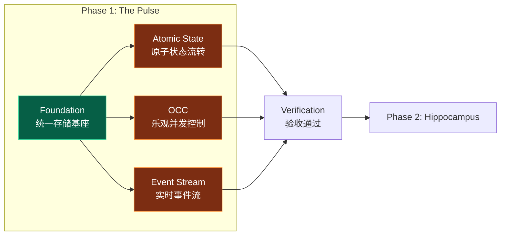
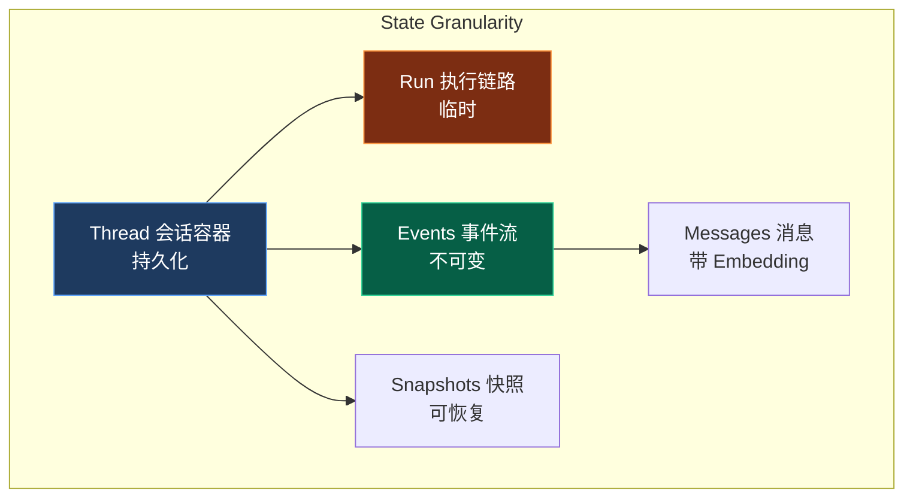
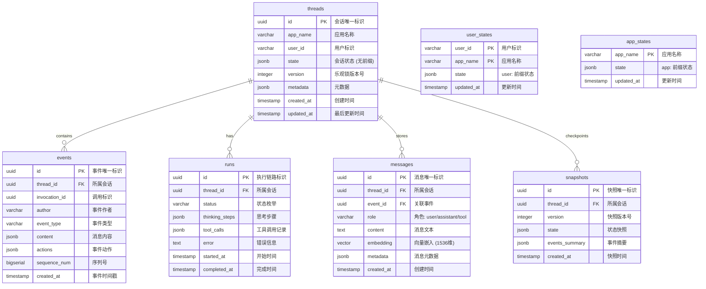
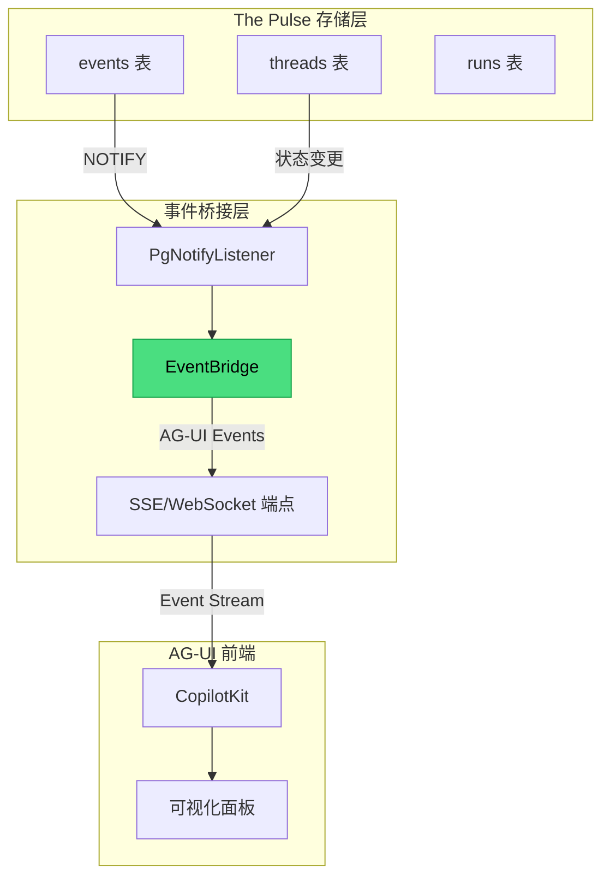

> [!NOTE]
>
> **文档定位**：本文档是 [000-roadmap.md](./000-roadmap.md) Phase 1 的详细工程实施方案，用于指导「**The Pulse (脉搏引擎)**」的完整落地验证工作。涵盖技术调研、架构设计、代码实现、测试验证等全流程。

---

## 1. 执行摘要

### 1.1 Phase 1 定位与目标

**Phase 1: Foundation & The Pulse** 是整个验证计划的基石阶段，核心目标是：

1. **构建统一存储基座**：部署 PostgreSQL 16+ 生态，建立 Unified Schema
2. **验证 Session Engine**：实现对标 Google ADK `SessionService` 的会话管理能力
3. **验证核心机制**：原子状态流转、乐观并发控制 (OCC)、实时事件流



### 1.2 对标分析：Google ADK Session 机制

基于 Google ADK 官方文档<sup>[[1]](#ref1)</sup>的分析，我们需要复刻以下核心能力：

| ADK 核心概念       | 定义                                                | PostgreSQL 复刻策略         |
| :----------------- | :-------------------------------------------------- | :-------------------------- |
| **Session**        | 单次用户-Agent 交互的容器，包含 `events` 和 `state` | `threads` 表 + `events` 表  |
| **State**          | 会话内的 Key-Value 数据，支持前缀作用域             | JSONB 列 + 前缀解析逻辑     |
| **Event**          | 交互中的原子操作记录                                | `events` 表 (append-only)   |
| **SessionService** | Session 生命周期管理接口                            | `OpenSessionService` 类实现 |

#### 1.2.1 ADK State 前缀机制

ADK 通过 Key 前缀实现不同作用域的状态管理：

| 前缀    | 作用域           | 生命周期              | 复刻策略                   |
| :------ | :--------------- | :-------------------- | :------------------------- |
| 无前缀  | Session Scope    | 取决于 SessionService | 存入 `threads.state` JSONB |
| `user:` | User Scope       | 持久化                | 存入 `user_states` 表      |
| `app:`  | App Scope        | 持久化                | 存入 `app_states` 表       |
| `temp:` | Invocation Scope | 仅当前调用            | 内存缓存，不持久化         |

#### 1.2.2 State Granularity (状态颗粒度)

> [!IMPORTANT]
>
> **对标 Roadmap Pillar I**：状态颗粒度是 The Pulse 的核心设计要素，决定了数据的存储层次和生命周期。



| 层次         | 表名        | 定义                                                  | 生命周期       | 对应 Roadmap             |
| :----------- | :---------- | :---------------------------------------------------- | :------------- | :----------------------- |
| **Thread**   | `threads`   | 持久化存储用户级交互历史 (Human-Agent Interaction)    | 长期持久化     | "作为长期记忆的输入源"   |
| **Run**      | `runs`      | 临时存储单次推理过程中的 Thinking Steps 和 Tool Calls | 仅执行期间存活 | "保障推理的可观测性"     |
| **Event**    | `events`    | 不可变事件记录 (Message, ToolCall, StateUpdate)       | Append-only    | "Immutable Stream"       |
| **Message**  | `messages`  | 带 Embedding 的消息内容                               | 持久化         | "Content with Embedding" |
| **Snapshot** | `snapshots` | 状态检查点，用于快速恢复会话                          | 按策略清理     | "State Checkpoints"      |

#### 1.2.3 任务-章节对照表

> [!NOTE]
>
> 以下表格将 [001-task-checklist.md](./001-task-checklist.md) 的任务 ID 与本文档章节进行对照，便于追踪执行进度。

| 任务模块            | 任务 ID 范围      | 对应章节                                                                                   |
| :------------------ | :---------------- | :----------------------------------------------------------------------------------------- |
| PostgreSQL 生态部署 | P1-1-1 ~ P1-1-5   | [4.1 Step 1: 环境部署](#41-step-1-环境部署与基础设施)                                      |
| 开发环境配置        | P1-1-6 ~ P1-1-9   | [4.1.2 开发环境配置](#412-开发环境配置)                                                    |
| ADK Schema 调研     | P1-2-1 ~ P1-2-6   | [2. 技术调研](#2-技术调研adk-sessionservice-深度分析)                                      |
| PostgreSQL Schema   | P1-2-7 ~ P1-2-14  | [3. 架构设计](#3-架构设计unified-schema) + [4.2 Schema 部署](#42-step-2-schema-设计与部署) |
| 原子状态流转        | P1-3-1 ~ P1-3-7   | [4.3.1 StateManager](#431-statemanager-类实现)                                             |
| 乐观并发控制        | P1-3-8 ~ P1-3-12  | [4.3.1 StateManager (OCC)](#431-statemanager-类实现)                                       |
| 实时事件流          | P1-3-13 ~ P1-3-17 | [4.3.2 PgNotifyListener](#432-pgnotifylistener-实现)                                       |
| 验收与文档          | P1-4-1 ~ P1-4-4   | [5. 验收标准](#5-验收标准) + [6. 交付物](#6-交付物清单)                                    |

### 1.4 工期规划

| 阶段 | 任务模块          | 任务 ID          | 预估工期 | 交付物                             |
| :--- | :---------------- | :--------------- | :------- | :--------------------------------- |
| 1.1  | 环境部署          | P1-1-1 ~ P1-1-9  | 0.5 Day  | PostgreSQL 16+ 环境就绪            |
| 1.2  | Schema 设计       | P1-2-1 ~ P1-2-14 | 0.5 Day  | `agent_schema.sql`                 |
| 1.3  | Pulse Engine 实现 | P1-3-1 ~ P1-3-17 | 1 Day    | `StateManager`, `PgNotifyListener` |
| 1.4  | 测试与验收        | P1-4-1 ~ P1-4-4  | 0.5 Day  | 测试报告 + 技术文档                |

---

## 2. 技术调研：ADK SessionService 深度分析

### 2.1 ADK Session 数据结构

基于 ADK 源码分析<sup>[[2]](#ref2)</sup>，`Session` 对象的核心结构如下：

```python
# ADK Session 核心结构 (简化版)
@dataclass
class Session:
    """代表一次用户-Agent 的交互会话"""

    # 标识符
    id: str                    # 会话唯一标识 (UUID)
    app_name: str              # 应用名称
    user_id: str               # 用户标识

    # 状态数据
    state: dict[str, Any]      # Key-Value 状态存储

    # 事件历史
    events: list[Event]        # 交互事件序列 (append-only)

    # 元数据
    last_update_time: float    # 最后更新时间戳
```

### 2.2 ADK Event 数据结构

`Event` 是 ADK 中记录交互的原子单元：

```python
@dataclass
class Event:
    """交互中的原子操作记录"""

    # 标识符
    id: str                    # 事件唯一标识
    invocation_id: str         # 调用标识 (一次用户请求)
    author: str                # 事件作者 (user/agent/tool)

    # 内容
    content: Content           # 消息内容 (文本/多模态)

    # 动作
    actions: EventActions      # 状态变更、工具调用等

    # 时间戳
    timestamp: float           # 事件发生时间
```

### 2.3 ADK SessionService 接口契约

我们需要实现的核心接口：

```python
class BaseSessionService(ABC):
    """Session 管理服务抽象基类"""

    @abstractmethod
    async def create_session(
        self,
        app_name: str,
        user_id: str,
        state: dict | None = None
    ) -> Session:
        """创建新会话"""
        ...

    @abstractmethod
    async def get_session(
        self,
        app_name: str,
        user_id: str,
        session_id: str
    ) -> Session | None:
        """获取会话"""
        ...

    @abstractmethod
    async def list_sessions(
        self,
        app_name: str,
        user_id: str
    ) -> list[Session]:
        """列出用户所有会话"""
        ...

    @abstractmethod
    async def delete_session(
        self,
        app_name: str,
        user_id: str,
        session_id: str
    ) -> None:
        """删除会话"""
        ...

    @abstractmethod
    async def append_event(
        self,
        session: Session,
        event: Event
    ) -> Event:
        """追加事件并应用 state_delta"""
        ...
```

### 2.4 关键行为分析

> [!IMPORTANT]
>
> **State Commit Timing (状态提交时机)**
>
> 根据 ADK 文档<sup>[[3]](#ref3)</sup>，`state_delta` 仅在 Event 被 Runner 处理后才提交。这意味着：
>
> - 执行逻辑在 yield Event **之后**才能看到其对 State 的更改生效
> - 这类似数据库事务的 "read-your-writes" 保证需要等待 commit
>
> ---
>
> **⚠️ 常见代码误区 (The "Airborne" Trap)**
>
> ```python
> # ❌ 错误的直觉：认为 yield 后状态立刻改变
> def my_agent_logic():
>     # 1. 发出指令：更新计数
>     yield UpdateState(key="count", value=100)
>
>     # 2. 立刻读取
>     # 此时指令还在“空中飞” (Airborne)，Runner 尚未落地执行
>     # 这里的 state.count 仍然是旧值（例如 0）
>     if state.count == 100:
>        logger.info("Success") # 永远不会执行！
> ```

> [!WARNING]
>
> **Dirty Reads Risk (脏读风险)**
>
> 在同一 Invocation (执行调用) 的生命周期内，可能有多个步骤连续执行 (如: Agent -> Tool A -> Tool B)。
> 后续步骤必须能看到前序步骤产生的**尚未 Commit 到数据库**的状态变更。
>
> **💡 直观理解：草稿纸 (Scratchpad)**
>
> - **场景**：考试时 (Invocation)，你在草稿纸 (Memory) 上演算出的中间结果 (State Delta)。
> - **Dirty Read**：下一道题需要用到这个中间结果，你必须直接从草稿纸上看，而不能等考试结束交卷 (Commit) 后再看。
> - **风险**：如果还没交卷就被“没收试卷” (Crash)，这些中间结果从未真正生效，但你后续的解题步骤已经依赖了它。
>
> **工程实现要求**：
> 我们的 `StateManager` 不能只读 DB，必须在内存中维护一个 **Overlay View (叠加视图)**，实现 `Get(Key) -> Delta | DB` 的透传读取机制。

---

## 3. 架构设计：Unified Schema

### 3.1 ER 图设计

> [!NOTE]
>
> **设计原则**：严格对标 roadmap 1.1 中的 Schema 要求，实现 7 张核心表的统一存储架构。



### 3.2 表职责说明

| 表名            | 职责                         | 对标 ADK 概念  | 生命周期   |
| :-------------- | :--------------------------- | :------------- | :--------- |
| **threads**     | 会话容器，存储用户级交互历史 | `Session`      | 持久化     |
| **events**      | 不可变事件流 (append-only)   | `Event`        | 持久化     |
| **runs**        | 临时执行链路 (Thinking Loop) | `Invocation`   | 执行期间   |
| **messages**    | 带 Embedding 的消息内容      | `Content`      | 持久化     |
| **snapshots**   | 状态检查点，用于快速恢复     | `Checkpoint`   | 按策略清理 |
| **user_states** | `user:` 前缀状态             | `user:*` State | 持久化     |
| **app_states**  | `app:` 前缀状态              | `app:*` State  | 持久化     |

### 3.3 Schema 设计

参见：[`src/cognizes/engine/schema/agent_schema.sql`](../../src/cognizes/engine/schema/agent_schema.sql)

---

## 4. 实施计划：分步执行指南

### 4.1 Step 1: 环境部署与基础设施

#### 4.1.1 PostgreSQL 生态部署

**任务清单**：

| 任务 ID | 任务描述             | 验收标准                        | 参考命令                     |
| :------ | :------------------- | :------------------------------ | :--------------------------- |
| P1-1-1  | 部署 PostgreSQL 16+  | `SELECT version()` 返回 16.x+   | `brew install postgresql@16` |
| P1-1-2  | 安装 pgvector 0.7.0+ | `CREATE EXTENSION vector` 成功  | 见下方安装指南               |
| P1-1-3  | 安装 pg_cron         | `SELECT * FROM cron.job` 可执行 | 见下方安装指南               |
| P1-1-4  | 配置连接池           | 支持 100+ 并发连接              | PgBouncer 或内置配置         |

**pgvector 安装指南**：

```bash
# macOS (Homebrew)
brew install pgvector

# 或从源码编译
git clone https://github.com/pgvector/pgvector.git
cd pgvector
make
make install

# 在 PostgreSQL 中启用
psql -d your_database -c "CREATE EXTENSION IF NOT EXISTS vector;"
```

**pg_cron 安装指南 (源码编译)**：

> [!TIP]
>
> **macOS 编译异常修复**
>
> 在 Apple Silicon (M1/M2/M3) 环境下编译 `pg_cron` 时，常遇到链接器错误：
> `Undefined symbols for architecture arm64: "_libintl_ngettext"`
>
> **原因**: 链接器未能找到 `gettext` 国际化库。
> **修复**: 需在 Makefile 中显式链接 `libintl`。修改 `Makefile` 第 22 行左右：
> 原文: `SHLIB_LINK = $(libpq)`
> 修改: `SHLIB_LINK = $(libpq) -L/opt/homebrew/opt/gettext/lib -lintl`

```bash
# 1. 下载源码 (推荐使用稳定版分支)
git clone https://github.com/citusdata/pg_cron.git
cd pg_cron

# 2. 修复 Makefile 链接问题 (macOS 必需，见上 Tip)
# 或手动修改 Makefile 追加 -lintl 参数

# 3. 编译与安装 (需确保 pg_config 指向目标 PG 版本)
export PATH="/opt/homebrew/opt/postgresql@16/bin:$PATH"
make clean
make && make install

# 4. 修改 postgresql.conf 配置
# 路径通常在 /opt/homebrew/var/postgresql@16/postgresql.conf
# 追加内容：
# shared_preload_libraries = 'pg_cron'
# cron.database_name = 'cognizes-engine'

# 5. 重启 PostgreSQL
brew services restart postgresql@16

# 6. 在目标数据库中启用扩展
psql -d postgres -c "CREATE EXTENSION IF NOT EXISTS pg_cron;"
```

> [!TIP]
>
> **配置详解**
>
> 1. **配置文件路径**: macOS 上通常位于 `/opt/homebrew/var/postgres@18/postgresql.conf` (Apple Silicon)。可通过 `psql -c "SHOW config_file;"` 精确查找。
> 2. **`shared_preload_libraries = 'pg_cron'`**: 启动 `pg_cron` 的后台调度进程 (Background Worker)。如果不设置，扩展仅加载函数但调度器不运行。修改后必须重启 PG。
> 3. **`cron.database_name`**: 指定存储 cron 元数据 (任务列表) 的主数据库。若不设置，默认只能在 `postgres` 库中管理任务。

#### 4.1.2 开发环境配置

**Python 环境**：

```bash
# 创建项目目录结构
mkdir -p src/cognizes/engine/pulse
mkdir -p src/cognizes/engine/schema
mkdir -p tests/pulse

# 创建虚拟环境
# python -m venv .venv
# source .venv/bin/activate
uv init --no-workspace .

# 安装依赖
uv add asyncpg 'psycopg[binary]' google-adk pydantic pytest pytest-asyncio
```

**依赖清单** (`pyproject.toml`):

```toml
dependencies = [
    # Core
    "asyncpg>=0.31.0",
    "psycopg[binary]>=3.3.2",
    "pydantic>=2.12.5",

    # Google ADK
    "google-adk>=1.22.0",

    # Testing
    "pytest>=9.0.2",
    "pytest-asyncio>=1.3.0",

    # Utilities
    # "python-dotenv>=1.2.1",
]
```

### 4.2 Step 2: Schema 部署与验证

```bash
# 部署 Schema
psql -d 'cognizes-engine' -f src/cognizes/engine/schema/agent_schema.sql

# 验证表创建
psql -d 'cognizes-engine' -c "\dt"

# 验证触发器
psql -d 'cognizes-engine' -c "\df notify_event_insert"
```

---

### 4.3 Step 3: Pulse Engine 核心实现

#### 4.3.1 StateManager 类实现

参见：[`src/cognizes/engine/pulse/state_manager.py`](../../src/cognizes/engine/pulse/state_manager.py)

#### 4.3.2 PgNotifyListener 实现

参见：[`src/cognizes/engine/pulse/pg_notify_listener.py`](../../src/cognizes/engine/pulse/pg_notify_listener.py)

---

### 4.4 Step 4: 测试与验收

#### 4.4.1 单元测试套件

参见：[`tests/unittests/pulse/test_state_manager.py`](../../tests/unittests/pulse/test_state_manager.py)

执行测试：

```bash
uv run pytest tests/unittests/pulse/test_state_manager.py -v
```

#### 4.4.2 端到端延迟测试

参见：[`tests/integration/pulse/test_notify_latency.py`](../../tests/integration/pulse/test_notify_latency.py)

执行测试：

```bash
uv run pytest tests/integration/pulse/test_notify_latency.py -v -s
```

---

### 4.5 Step 5: AG-UI 事件桥接层

> [!NOTE]
>
> **对标 AG-UI 协议**：本节实现 The Pulse 与 AG-UI 可视化层的事件桥接，确保所有会话状态变更、事件流都能实时推送到前端进行可视化展示。
>
> **参考资源**：
>
> - [AG-UI 协议调研](../research/070-ag-ui.md)
> - [AG-UI 官方文档](https://docs.ag-ui.com/)

#### 4.5.1 事件桥接架构



#### 4.5.2 AG-UI 事件映射表

| Pulse 事件源              | 触发条件     | AG-UI 事件类型         | 事件数据              |
| :------------------------ | :----------- | :--------------------- | :-------------------- |
| `runs` INSERT             | 新建执行链路 | `RUN_STARTED`          | `{run_id, thread_id}` |
| `runs` UPDATE (complete)  | 执行完成     | `RUN_FINISHED`         | `{run_id, status}`    |
| `events` INSERT (message) | 新消息创建   | `TEXT_MESSAGE_START`   | `{message_id}`        |
| `events` INSERT (content) | 消息内容追加 | `TEXT_MESSAGE_CONTENT` | `{delta}`             |
| `threads.state` UPDATE    | 状态变更     | `STATE_DELTA`          | `{json_patch}`        |
| `events` INSERT (tool)    | 工具调用     | `TOOL_CALL_START`      | `{tool_name, args}`   |

#### 4.5.3 EventBridge 实现

参见：[`src/cognizes/engine/pulse/event_bridge.py`](../../src/cognizes/engine/pulse/event_bridge.py)

#### 4.5.4 状态调试面板数据接口

参见：[`src/cognizes/engine/pulse/state_debug.py`](../../src/cognizes/engine/pulse/state_debug.py)

#### 4.5.5 任务清单

| 任务 ID | 任务描述                   | 状态      | 验收标准                |
| :------ | :------------------------- | :-------- | :---------------------- |
| P1-5-1  | 实现 `PulseEventBridge` 类 | 🔲 待开始 | PostgreSQL 事件正确转换 |
| P1-5-2  | 实现 AG-UI 事件映射逻辑    | 🔲 待开始 | 6 种事件类型覆盖        |
| P1-5-3  | 实现 SSE 端点              | 🔲 待开始 | 事件流延迟 < 100ms      |
| P1-5-4  | 实现 StateDebugService     | 🔲 待开始 | 调试信息完整            |
| P1-5-5  | 编写事件桥接单元测试       | 🔲 待开始 | 覆盖率 > 80%            |

#### 4.5.6 验收标准

| 验收项   | 验收标准                                 | 验证方法 |
| :------- | :--------------------------------------- | :------- |
| 事件转换 | PostgreSQL 6 类事件正确映射到 AG-UI 事件 | 单元测试 |
| 延迟     | 事件从 DB 到前端延迟 < 100ms (P99)       | 性能测试 |
| 可靠性   | 事件不丢失，顺序正确                     | 压力测试 |
| 调试面板 | 状态分组正确，历史可追溯                 | 集成测试 |

---

## 5. 验收标准

### 5.1 功能验收矩阵

> [!NOTE]
>
> 以下验收项与 [001-task-checklist.md](./001-task-checklist.md) 中的任务 ID 对应，确保每项需求都有验证。

| 验收项              | 任务 ID    | 验收标准                            | 验证方法      |
| :------------------ | :--------- | :---------------------------------- | :------------ |
| PostgreSQL 16+ 部署 | P1-1-1     | `SELECT version()` 返回 16.x+       | 命令行验证    |
| pgvector 安装       | P1-1-2     | `CREATE EXTENSION vector` 成功      | SQL 执行      |
| pg_cron 安装        | P1-1-3     | `SELECT * FROM cron.job` 可执行     | SQL 执行      |
| 连接池配置          | P1-1-5     | 支持 100+ 并发连接                  | 压力测试      |
| Schema 部署         | P1-2-12    | 7 张表 + 2 个触发器创建成功         | `\dt` + `\df` |
| Session CRUD        | P1-3-1~5   | 创建/读取/列表/删除操作正确         | 单元测试      |
| 原子状态流转        | P1-3-6~7   | 0 脏读/丢失                         | 并发测试      |
| 乐观锁 (OCC)        | P1-3-8~12  | 版本冲突正确检测 + 10 并发 0 丢失   | 冲突测试      |
| 实时事件流          | P1-3-13~17 | 端到端延迟 < 50ms, 100 msg/s 无丢失 | 延迟/压力测试 |

### 5.2 性能基准

| 指标             | 目标值    | 测试条件       | 对应任务 |
| :--------------- | :-------- | :------------- | :------- |
| Session 创建 QPS | > 1000    | 单节点         | P1-3-12  |
| Event 追加 QPS   | > 500     | 含 state_delta | P1-3-12  |
| NOTIFY 延迟 P99  | < 50ms    | 100 msg/s      | P1-3-16  |
| 并发写入成功率   | 100%      | 10 并发        | P1-3-11  |
| 消息吞吐量       | 100 msg/s | 稳定无丢失     | P1-3-17  |

### 5.3 验收检查清单

```markdown
## Phase 1 验收检查清单

### 环境部署

- [ ] PostgreSQL 16+ 安装并运行
- [ ] pgvector 扩展安装成功
- [ ] pg_cron 扩展安装成功 (可选)
- [ ] 连接池配置完成

### Schema 设计

- [ ] threads 表创建成功
- [ ] events 表创建成功
- [ ] runs 表创建成功
- [ ] messages 表创建成功
- [ ] snapshots 表创建成功
- [ ] user_states 表创建成功
- [ ] app_states 表创建成功
- [ ] NOTIFY 触发器创建成功
- [ ] updated_at 触发器创建成功

### 功能验证

- [ ] Session CRUD 测试通过
- [ ] 原子状态流转测试通过
- [ ] 乐观锁冲突检测测试通过
- [ ] 事务回滚测试通过
- [ ] 多 Agent 并发写测试通过

### 性能验证

- [ ] Session 创建 QPS > 1000
- [ ] NOTIFY 延迟 P99 < 50ms
- [ ] 100 msg/s 压力测试通过
```

---

## 6. 交付物清单

| 类别         | 文件路径                                           | 描述                           | 对应任务   |
| :----------- | :------------------------------------------------- | :----------------------------- | :--------- |
| **文档**     | `docs/010-the-pulse.md`                            | 本实施方案                     | P1-4-1     |
| **Schema**   | `src/cognizes/engine/schema/agent_schema.sql`      | 统一建表脚本 (7 表 + 2 触发器) | P1-2-12    |
| **代码**     | `src/cognizes/engine/pulse/state_manager.py`       | StateManager 实现              | P1-4-2     |
|              | `src/cognizes/engine/pulse/pg_notify_listener.py`  | NOTIFY 监听器                  | P1-3-14    |
|              | `src/cognizes/engine/pulse/event_bridge.py`        | 事件桥接器                     | P1-5-1     |
|              | `src/cognizes/engine/pulse/state_debug.py`         | 状态调试服务                   | P1-5-4     |
| **单元测试** | `tests/unittests/pulse/test_state_manager.py`      | 前缀解析、dataclass 纯逻辑     | P1-4-3     |
|              | `tests/unittests/pulse/test_pg_notify_listener.py` | 回调注册、JSON 解析逻辑        | P1-3-15    |
|              | `tests/unittests/pulse/test_event_bridge.py`       | SSE 格式、事件类型映射         | P1-5-2     |
|              | `tests/unittests/pulse/test_state_debug.py`        | 前缀分组逻辑                   | P1-5-5     |
| **集成测试** | `tests/integration/pulse/test_state_manager_db.py` | 数据库 CRUD、OCC、高并发       | P1-4-4     |
|              | `tests/integration/pulse/test_notify_latency.py`   | NOTIFY 延迟 & 吞吐量           | P1-3-16~17 |
|              | `tests/integration/pulse/test_event_bridge_e2e.py` | 端到端事件流测试               | P1-5-3     |
|              | `tests/integration/pulse/test_state_debug_db.py`   | 状态历史查询测试               | P1-5-6     |

---

## 7. Phase 1 验证 SOP

### 7.1 环境验证

```bash
# PostgreSQL 版本验证
psql -d 'cognizes-engine' -c "SELECT version();"

# 扩展状态检查
psql -d 'cognizes-engine' -c "SELECT * FROM pg_available_extensions WHERE name IN ('vector', 'pg_cron');"

# 数据库连接测试
psql -d cognizes-engine -c "\dt"

# Python 环境验证
uv run python -c "from cognizes.engine.pulse.state_manager import StateManager; print('✓ Import OK')"
```

### 7.2 单元测试验证

```bash
# 全部单元测试 (44 个测试用例，无数据库依赖)
uv run pytest tests/unittests/pulse/ -v

# 快速回归 (仅核心逻辑)
uv run pytest tests/unittests/pulse/test_state_manager.py -v --tb=short
```

### 7.3 集成测试验证

```bash
# StateManager 数据库集成测试
uv run pytest tests/integration/pulse/test_state_manager_db.py -v

# NOTIFY 延迟测试 (验证 < 50ms)
uv run pytest tests/integration/pulse/test_notify_latency.py -v -s

# EventBridge 端到端测试
uv run pytest tests/integration/pulse/test_event_bridge_e2e.py -v

# StateDebug 数据库测试
uv run pytest tests/integration/pulse/test_state_debug_db.py -v

# 全部集成测试
uv run pytest tests/integration/ -v
```

### 7.4 性能指标验收

| 指标         | 目标值 | 验证测试                                 | 验证命令                                                                                                                    |
| :----------- | :----- | :--------------------------------------- | :-------------------------------------------------------------------------------------------------------------------------- |
| NOTIFY 延迟  | < 50ms | `test_end_to_end_latency`                | `uv run pytest tests/integration/pulse/test_notify_latency.py::TestNotifyLatency::test_end_to_end_latency -v -s`            |
| 吞吐量丢失率 | 0%     | `test_100_msg_per_second_throughput`     | `uv run pytest tests/integration/pulse/test_notify_latency.py::TestNotifyLatency::test_100_msg_per_second_throughput -v -s` |
| OCC QPS      | > 100  | `test_100_qps_session_creation`          | `uv run pytest tests/unittests/pulse/test_state_manager.py::TestHighQPSPerformance -v -s`                                   |
| 并发写入     | 0 丢失 | `test_10_concurrent_writes_no_data_loss` | `uv run pytest tests/unittests/pulse/test_state_manager.py::TestMultiAgentConcurrency -v -s`                                |

---

## 8. 遗留任务指引

> [!NOTE]
>
> 以下任务需在 Phase 1 验收前完成。

### 8.1 P1-1-8：配置 GOOGLE_API_KEY

**目的**：为 Google ADK 提供 API 认证。

```bash
# 方式 1：环境变量 (推荐)
export GOOGLE_API_KEY="your-api-key-here"

# 方式 2：.env 文件
echo 'GOOGLE_API_KEY=your-api-key-here' >> .env

# 验证
uv run python -c "import os; print('✓ API Key:', os.getenv('GOOGLE_API_KEY', 'NOT SET')[:10] + '...')"
```

### 8.2 P1-3-15：实现 WebSocket 推送接口

**目的**：前端通过 WebSocket 接收实时事件流。

**实现路径**：

- `src/cognizes/engine/api/main.py` - FastAPI 应用入口
- `src/cognizes/engine/pulse/pg_notify_listener.py` - NOTIFY 监听器

#### 8.2.1 启动服务

```bash
# 终端 1：启动 FastAPI 服务
uv run uvicorn cognizes.engine.api.main:app --reload --host 0.0.0.0 --port 8000
```

预期输出：

```
INFO:     Uvicorn running on http://0.0.0.0:8000 (Press CTRL+C to quit)
INFO:     ✓ PgNotifyListener started
```

#### 8.2.2 验证健康检查

```bash
# 终端 2：验证服务状态
curl http://localhost:8000/health
```

预期输出：

```json
{ "status": "ok", "listener_running": true }
```

#### 8.2.3 验证 WebSocket 连接

```bash
# 方式 1：使用 websocat 工具 (需安装: brew install websocat)
websocat ws://localhost:8000/ws/events/test-thread

# 方式 2：使用 Python 脚本
uv run python -c "
import asyncio
import websockets
async def test():
    async with websockets.connect('ws://localhost:8000/ws/events/test-thread') as ws:
        print('✓ WebSocket connected')
        msg = await asyncio.wait_for(ws.recv(), timeout=30)
        print(f'Received: {msg}')
asyncio.run(test())
"
```

#### 8.2.4 触发测试事件

```bash
# 终端 3：发送测试 NOTIFY 消息
curl http://localhost:8000/api/test-notify
```

预期输出：

```json
{ "status": "sent", "payload": "{\"thread_id\":\"test-thread\",...}" }
```

WebSocket 客户端应立即收到事件。

#### 8.2.5 验证延迟

```bash
# 使用集成测试验证延迟 < 50ms
uv run pytest tests/integration/pulse/test_notify_latency.py -v -s
```

**验收标准**：

- [ ] 服务启动成功，listener_running 为 true
- [ ] 前端可通过 `ws://localhost:8000/ws/events/{thread_id}` 连接
- [ ] 收到 NOTIFY 事件后延迟 < 100ms

### 8.3 P1-5-3：实现 SSE 事件流端点

**目的**：通过 Server-Sent Events 推送 AG-UI 事件流。

**实现路径**：

- `src/cognizes/engine/api/main.py` - SSE 端点 `/api/runs/{run_id}/events`
- `src/cognizes/engine/pulse/event_bridge.py` - AG-UI 事件类型定义

#### 8.3.1 验证服务已启动

确保 FastAPI 服务正在运行（见 8.2.1）。

#### 8.3.2 验证 SSE 连接

```bash
# 终端 1：订阅 SSE 事件流 (使用 curl -N 保持长连接)
curl -N http://localhost:8000/api/runs/test-run/events
```

预期输出（立即收到连接事件）：

```
data: {"type":"CUSTOM","runId":"test-run","timestamp":...,"name":"connected","message":"SSE stream for run_id=test-run"}
```

#### 8.3.3 验证事件推送

```bash
# 终端 2：触发 SSE 测试事件
curl http://localhost:8000/api/test-sse-notify/test-run
```

预期输出：

```json
{ "status": "sent", "run_id": "test-run", "payload": "..." }
```

同时，终端 1 的 SSE 客户端应收到：

```
data: {"type":"RAW","runId":"test-run","timestamp":...,"payload":{...}}

```

#### 8.3.4 验证响应头

```bash
# 验证 Content-Type (使用 -D - 打印响应头，而非 -I)
curl -s -D - http://localhost:8000/api/runs/test-run/events 2>&1 | head -10
```

预期输出：

```
HTTP/1.1 200 OK
...
content-type: text/event-stream; charset=utf-8
```

> [!NOTE]
>
> 使用 `curl -I` 会发送 `HEAD` 请求，SSE 端点不支持 HEAD，会返回 `405 Method Not Allowed`。

#### 8.3.5 验证心跳机制

保持 SSE 连接 30 秒不发送事件，客户端应收到心跳：

```
data: {"type":"CUSTOM","runId":"test-run","timestamp":...,"name":"heartbeat"}

```

**验收标准**：

- [ ] 响应 Content-Type 为 `text/event-stream`
- [ ] 事件格式符合 SSE 规范 (`data: {...}\n\n`)
- [ ] 首事件延迟 < 100ms（连接事件立即返回）
- [ ] 心跳每 30 秒发送一次

---

## 参考文献

<a id="ref1"></a>1. Google. (2025). _ADK Sessions Documentation_. [https://google.github.io/adk-docs/sessions/](https://google.github.io/adk-docs/sessions/)

<a id="ref2"></a>2. Google. (2025). _ADK Session Overview_. [https://google.github.io/adk-docs/sessions/session/](https://google.github.io/adk-docs/sessions/session/)

<a id="ref3"></a>3. Google. (2025). _ADK State Documentation_. [https://google.github.io/adk-docs/sessions/state/](https://google.github.io/adk-docs/sessions/state/)

<a id="ref4"></a>4. Google. (2025). _ADK Context Documentation_. [https://google.github.io/adk-docs/context/](https://google.github.io/adk-docs/context/)
