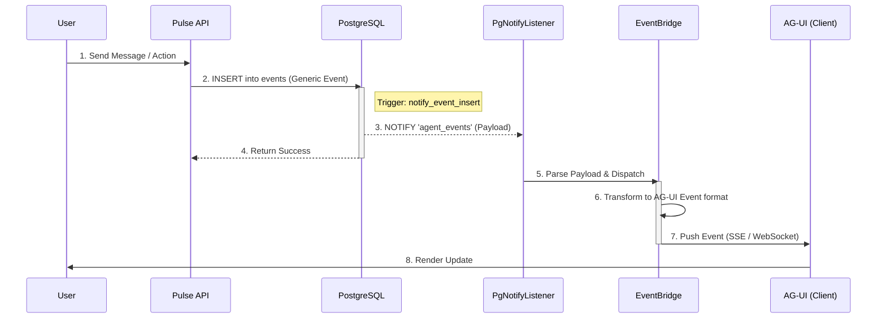
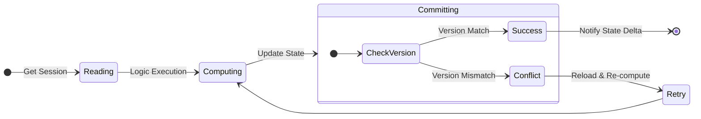

> [!NOTE]
>
> **文档定位**：本文档是 [000-roadmap.md](./000-roadmap.md) Phase 1 的详细工程实施方案，用于指导「**The Pulse (脉搏引擎)**」的完整落地验证工作。涵盖技术调研、架构设计、代码实现、测试验证等全流程。

---

## 1. 执行摘要

### 1.1 定位与目标 (Phase 1)

**Phase 1: Foundation & The Pulse** 是整个验证计划的基石阶段，核心目标是：

1. **构建统一存储基座**：部署 PostgreSQL 16+ 生态，建立 Unified Schema
2. **验证 Session Engine**：实现对标 Google ADK `SessionService` 的会话管理能力
3. **验证核心机制**：原子状态流转、乐观并发控制 (OCC)、实时事件流

```mermaid
graph LR
    subgraph "Phase 1: The Pulse"
        F[Foundation<br>统一存储基座] --> P1[Atomic State<br>原子状态流转]
        F --> P2[OCC<br>乐观并发控制]
        F --> P3[Event Stream<br>实时事件流]
    end

    P1 & P2 & P3 --> V[Verification<br>验收通过]
    V --> Phase2[Phase 2: Hippocampus]

    style F fill:#065f46,stroke:#34d399,color:#fff
    style P1 fill:#7c2d12,stroke:#fb923c,color:#fff
    style P2 fill:#7c2d12,stroke:#fb923c,color:#fff
    style P3 fill:#7c2d12,stroke:#fb923c,color:#fff
```



### 1.2 核心设计：ADK Session 机制复刻

基于 Google ADK 官方文档<sup>[[1]](#ref1)</sup>的深度分析，The Pulse 确立了以 **Session** 为核心容器，**State** 与 **Event** 为双轮驱动的架构模式。

#### 1.2.1 核心概念映射

我们采用 PostgreSQL 全栈生态来承载 ADK 的抽象模型，实现像素级对标：

| ADK 核心概念       | 定义                                                | PostgreSQL 落地策略         |
| :----------------- | :-------------------------------------------------- | :-------------------------- |
| **Session**        | 单次用户-Agent 交互的容器，包含 `events` 和 `state` | `threads` 表 (主容器)       |
| **State**          | 会话内的 Key-Value 数据，支持分层作用域             | JSONB + 前缀解析 (Scoped)   |
| **Event**          | 交互中的原子操作记录                                | `events` 表 (Append-only)   |
| **SessionService** | Session 生命周期管理接口                            | `OpenSessionService` 类实现 |

#### 1.2.2 状态作用域与生命周期 (State Scopes)

针对不同维度的状态管理需求，我们实现了 ADK 定义的分层作用域机制：

| 前缀      | 作用域           | 生命周期           | 存储策略                |
| :-------- | :--------------- | :----------------- | :---------------------- |
| (Default) | Session Scope    | 随会话存续         | `threads.state` (JSONB) |
| `user:`   | User Scope       | 跨会话持久化       | `user_states` 表        |
| `app:`    | App Scope        | Global 持久化      | `app_states` 表         |
| `temp:`   | Invocation Scope | 仅当前思维链路有效 | 内存缓存 (Volatile)     |

#### 1.2.3 状态颗粒度 (State Granularity)

> [!IMPORTANT]
> **对标 Roadmap Pillar I**：状态颗粒度设计决定了系统的记忆密度与回溯能力。

```mermaid
graph TB
    subgraph "State Granularity"
        T["Thread 会话容器<br/>持久化 (Persistent)"]
        R["Run 执行链路<br/>临时 (Ephemeral)"]
        E["Events 事件流<br/>不可变 (Immutable)"]
        M[Messages 消息<br/>Embedding]
        S["Snapshots 快照<br/>可恢复 (Recoverable)"]

        T --> R
        T --> E
        T --> S
        E --> M
    end

    style T fill:#1e3a5f,stroke:#60a5fa,color:#fff
    style R fill:#7c2d12,stroke:#fb923c,color:#fff
    style E fill:#065f46,stroke:#34d399,color:#fff
```



| 层次         | 表名        | 核心职责                                            | 生命周期     | 架构价值                     |
| :----------- | :---------- | :-------------------------------------------------- | :----------- | :--------------------------- |
| **Thread**   | `threads`   | 交互历史的主容器 (Human-Agent Interaction)          | 长期持久化   | 长期记忆的输入源             |
| **Run**      | `runs`      | 单次推理过程的思维链 (Thinking Steps / Tool Calls)  | 执行期间存活 | 推理过程的可观测性           |
| **Event**    | `events`    | 不可变的原子事件流 (Message, ToolCall, StateUpdate) | Append-only  | 确定的系统状态回溯           |
| **Message**  | `messages`  | 语义负载容器                                        | 持久化       | 向量检索的核心语料           |
| **Snapshot** | `snapshots` | 状态检查点                                          | 策略性清理   | 快速灾难恢复 (Fast Recovery) |

### 1.3 执行导图 (Execution Map)

为确保 Phase 1 的精准落地，我们将实施任务与技术文档进行了二维映射，并制定了基于 SOP 的工期计划。

#### 1.3.1 任务-文档锚定

> [!NOTE]
> 关联文档：[001-task-checklist.md](./001-task-checklist.md)

| 任务模块          | 任务 ID 范围     | 核心章节索引                                                                               |
| :---------------- | :--------------- | :----------------------------------------------------------------------------------------- |
| **Foundation**    | P1-1-1 ~ P1-1-9  | [4.1 Step 1: 环境部署](#41-step-1-环境部署与基础设施)                                      |
| **Schema Design** | P1-2-1 ~ P1-2-14 | [3. 架构设计](#3-架构设计unified-schema) / [4.2 Schema 部署](#42-step-2-schema-设计与部署) |
| **Pulse Engine**  | P1-3-1 ~ P1-3-17 | [4.3 核心实现](#43-step-3-pulse-engine-核心实现)                                           |
| **Event Bridge**  | P1-5-1 ~ P1-5-5  | [4.4 AG-UI 事件桥接](#44-step-4-ag-ui-事件桥接层)                                          |
| **Verification**  | P1-4-1 ~ P1-4-4  | [4.5 测试](#45-step-5-测试) / [5. Phase 1 验证 SOP](#5-phase-1-验证-sop)                   |

#### 1.3.2 工期规划 (3 Days)

| 阶段 | 任务模块          | 任务 ID          | 预估工期 | 关键交付物 (Deliverables)           |
| :--- | :---------------- | :--------------- | :------- | :---------------------------------- |
| 1.1  | 环境部署          | P1-1-1 ~ P1-1-9  | 0.5 Day  | PostgreSQL 16+ (pgvector/pg_cron)   |
| 1.2  | Schema 设计       | P1-2-1 ~ P1-2-14 | 0.5 Day  | `agent_schema.sql` (Unified Model)  |
| 1.3  | Pulse Engine 实现 | P1-3-1 ~ P1-3-17 | 1.0 Day  | `StateManager` / `PgNotifyListener` |
| 1.4  | AG-UI 事件桥接    | P1-5-1 ~ P1-5-5  | 0.5 Day  | `EventBridge` / `StateDebugService` |
| 1.5  | 全链路验收        | P1-4-1 ~ P1-4-4  | 0.5 Day  | 自动化测试报告 / 技术白皮书         |

---

## 2. 核心参考模型：Google ADK 契约与规范

### 2.1 模型定位

本节定义了 Pulse Engine 必须遵循的 **Normative Reference Model (规范性参考模型)**。我们的设计并非凭空创造，而是通过严格复刻 Google GenAI ADK 的 `SessionService` 契约，确保系统具备行业标准的可扩展性与互操作性。

### 2.2 ADK 核心对象建模

```mermaid
classDiagram
    direction LR
    class Session {
        +UUID id - 会话 ID
        +String app_name - 应用名称
        +String user_id - 用户标识
        +Dict state - 状态数据
        +List~Event~ events - 事件历史
        +Float last_update_time - 最后更新时间
    }

    class Event {
        +UUID id - 事件 ID
        +String invocation_id - Trace ID
        +String author - 事件作者
        +Content content - 消息内容
        +EventActions actions - 副作用
        +Float timestamp - 时间戳
    }

    class SessionService {
        <<Interface>>
        +create_session() - 创建会话
        +get_session() - 获取会话
        +append_event() - 追加事件
    }

    Session "1" *-- "0..*" Event : contains >
    SessionService ..> Session : manages >
```

基于 ADK 源码<sup>[[2]](#ref2)</sup>，我们建立了如下对象关系模型，直接指导后续 Schema 设计：



### 2.3 核心数据结构契约

#### 2.3.1 Session (会话容器)

`Session` 是状态管理的主体容器，对应数据库中的 `threads` 表：

```python
@dataclass
class Session:
    """
    Session Scope: 长期记忆容器
    Mapped to: table `threads`
    """
    id: str                    # Primary Key
    app_name: str              # Partition Key (Tenant)
    user_id: str               # Partition Key (User)

    # State Container (JSONB)
    # 关键：通过 version 字段实现 OCC (Optimistic Concurrency Control)
    state: dict[str, Any]

    events: list[Event]        # Event Sourcing History
```

#### 2.3.2 Event (原子事件)

`Event` 是不可变的交互记录，对应数据库中的 `events` 表：

```python
@dataclass
class Event:
    """
    Append-Only Ledger: 交互历史账本
    Mapped to: table `events`
    """
    id: str
    invocation_id: str         # Trace ID for Observability
    author: str                # 'user' | 'model' | 'tool'

    content: Content           # Payload (Text/Image/...)
    actions: EventActions      # Side Effects
```

### 2.4 服务接口契约 (Interface Contract)

`OpenSessionService` 必须完整实现以下抽象基类定义的操作原语：

```python
class BaseSessionService(ABC):
    """
    Core Abstraction: 状态管理服务标准接口
    """

    @abstractmethod
    async def create_session(
        self,
        app_name: str,
        user_id: str,
        state: dict | None = None
    ) -> Session:
        """初始化会话上下文"""
        ...

    @abstractmethod
    async def get_session(
        self,
        app_name: str,
        user_id: str,
        session_id: str
    ) -> Session | None:
        """获取强一致性会话快照"""
        ...

    @abstractmethod
    async def list_sessions(
        self,
        app_name: str,
        user_id: str
    ) -> list[Session]:
        """列出用户所有会话"""
        ...

    @abstractmethod
    async def delete_session(
        self,
        app_name: str,
        user_id: str,
        session_id: str
    ) -> None:
        """删除会话"""
        ...

    @abstractmethod
    async def append_event(
        self,
        session: Session,
        event: Event
    ) -> Event:
        """
        核心原子操作：
        1. 持久化 Event
        2. 应用 State Delta
        3. 验证 OCC Version
        """
        ...
```

### 2.5 前端集成规范：AG-UI 事件桥接

> [!NOTE]
>
> **Protocol Alignment (协议对齐)**：本节定义 The Pulse 与 AG-UI 可视化层之间的 **Event Bridge Protocol (事件桥接协议)**，确保状态变更与交互事件能够以毫秒级延迟实时投影到前端。
>
> **参考资源**：
>
> - [AG-UI 协议调研](../research/070-ag-ui.md)
> - [AG-UI 官方文档](https://docs.ag-ui.com/)

#### 2.5.1 事件流架构概览

```mermaid
graph BT
    subgraph "Pulse Engine - Storage"
        TH[threads 表]
        EV[events 表]
        RN[runs 表]
    end

    subgraph "Events Bridge Layer"
        PNL[PgNotifyListener<br>PG 监听器]
        EB[EventBridge<br>事件桥接器]
        SER[SSE Endpoint<br>推送端点]
    end

    subgraph "UI Layer (AG-UI)"
        CK[CopilotKit<br>SDK]
        UI[Visualization<br>可视化组件]
    end

    EV -->|NOTIFY: agent_events| PNL
    TH -->|NOTIFY: state_delta| PNL
    PNL --> EB
    EB -->|Transform| SER
    SER -->|Server-Sent Events| CK
    CK --> UI

    style EB fill:#4ade80,stroke:#16a34a,color:#000
    style PNL fill:#fcd34d,stroke:#f59e0b,color:#000
```



#### 2.5.2 事件映射契约 (Event Mapping Contract)

Pulse 产生的内部事件必须通过 `EventBridge` 转换为标准的 AG-UI 协议格式：

| Pulse Source | Trigger Condition        | AG-UI Event Type       | Payload Schema (Lite)        |
| :----------- | :----------------------- | :--------------------- | :--------------------------- |
| `runs`       | INSERT (Link Start)      | `RUN_STARTED`          | `{ run_id, thread_id }`      |
| `runs`       | UPDATE (Finalized)       | `RUN_FINISHED`         | `{ run_id, status, error? }` |
| `events`     | INSERT (Role=user/agent) | `TEXT_MESSAGE_START`   | `{ message_id, role }`       |
| `events`     | INSERT (Chunk Delta)     | `TEXT_MESSAGE_CONTENT` | `{ delta_content }`          |
| `threads`    | UPDATE (State Change)    | `STATE_DELTA`          | `{ json_patch_diff }`        |
| `events`     | INSERT (Tool Call)       | `TOOL_CALL_START`      | `{ tool_name, args_json }`   |

### 2.6 状态一致性模型 (Consistency Model)

#### 2.6.1 事务边界与可见性 (Transaction & Visibility)

> [!IMPORTANT]
>
> **Read-Your-Writes Constraint (写后读约束)**
>
> 根据 ADK 规范<sup>[[3]](#ref3)</sup>，状态变更 (`state_delta`) 仅在 `Event` 持久化事务提交后才对全局可见。这引入了**Visibility Latency (可见性延迟)**。

- **Rule 1 (Persist-then-Visible)**: 任何 Agent 逻辑产生的状态变更，必须在 `yield Event` 被 Runner 捕获并 commit 到 DB 后，才能被新的 Session `get()` 操作读取。
- **Engineering Pitfall**: "Airborne State" —— 开发者常错误地认为 `yield UpdateState(...)` 后，内存中的 `state` 对象会立即更新。实际上，在事务落地前，该指令处于“飞行中”状态，本地读取仍只能获取旧值。

**⚠️ 常见代码误区 (The "Airborne" Trap)**

```python
# ❌ 错误的直觉：认为 yield 后状态立刻改变
def my_agent_logic():
    # 1. 发出指令：更新计数
    yield UpdateState(key="count", value=100)

    # 2. 立刻读取
    # 此时指令还在“空中飞” (Airborne)，Runner 尚未落地执行
    # 这里的 state.count 仍然是旧值（例如 0）
    if state.count == 100:
       logger.info("Success") # 永远不会执行！
```

#### 2.6.2 易失性状态与叠加视图 (Overlay View)

为解决上述延迟问题，并在长链路调用（Invocation）中支持连续的状态依赖，Pulse Engine 必须在内存中维护一个叠加视图。

> [!TIP]
>
> **Analogy: The Scratchpad (草稿纸机制)**
>
> - **Scenario**: 考试（Invocation）过程中，你在草稿纸（Memory Overlay）上写下中间步骤。
> - **Requirement**: 下一题计算必须能直接引用草稿纸上的结果，而不需要等待考试结束（Commit）后再去查阅试卷。
> - **Risk**: 如果考试中途被终止（Crash），草稿纸内容丢弃，不污染正式试卷（Database）。

**核心实现要求**：
`StateManager` 必须实现 **Overlay Read** 机制：

$$
    State*{effective} = State*{persistent} + \sum Delta\_{pending}
$$

---

## 3. 架构设计：Unified Schema

### 3.1 ER 图设计

> [!NOTE]
>
> **设计原则**：严格对标 roadmap 1.1 中的 Schema 要求，实现 7 张核心表的统一存储架构。


**表职责说明**：

| 表名            | 职责                         | 对标 ADK 概念  | 生命周期   |
| :-------------- | :--------------------------- | :------------- | :--------- |
| **threads**     | 会话容器，存储用户级交互历史 | `Session`      | 持久化     |
| **events**      | 不可变事件流 (append-only)   | `Event`        | 持久化     |
| **runs**        | 临时执行链路 (Thinking Loop) | `Invocation`   | 执行期间   |
| **messages**    | 带 Embedding 的消息内容      | `Content`      | 持久化     |
| **snapshots**   | 状态检查点，用于快速恢复     | `Checkpoint`   | 按策略清理 |
| **user_states** | `user:` 前缀状态             | `user:*` State | 持久化     |
| **app_states**  | `app:` 前缀状态              | `app:*` State  | 持久化     |

### 3.2 系统交互设计 (System Interaction)

> [!TIP]
> **Data Flow**: `Write -> Notify -> Bridge -> Push`
> 本节描述从事件产生到端到端推送的完整时序。



### 3.3 状态管理与 OCC 机制

> [!IMPORTANT]
> **乐观并发控制 (OCC)**：为了防止多 Agent 同时修改状态导致的数据覆盖，我们引入 `version` 字段进行 CAS (Compare-And-Swap) 控制。

**核心逻辑**：

```sql
UPDATE threads
SET
  state = state || $new_state,
  version = version + 1
WHERE
  id = $thread_id AND version = $expected_version;
```

**状态流转图**：



### 3.4 Schema 部署

参见：[`src/cognizes/engine/schema/agent_schema.sql`](../../src/cognizes/engine/schema/agent_schema.sql)

---

## 4. 实施计划：分步执行指南

### 4.1 Step 1: 环境部署与基础设施

#### 4.1.1 PostgreSQL 生态部署

**任务清单**：

| 任务 ID | 任务描述             | 验收标准                        | 参考命令                     |
| :------ | :------------------- | :------------------------------ | :--------------------------- |
| P1-1-1  | 部署 PostgreSQL 16+  | `SELECT version()` 返回 16.x+   | `brew install postgresql@16` |
| P1-1-2  | 安装 pgvector 0.7.0+ | `CREATE EXTENSION vector` 成功  | 见下方安装指南               |
| P1-1-3  | 安装 pg_cron         | `SELECT * FROM cron.job` 可执行 | 见下方安装指南               |
| P1-1-4  | 配置连接池           | 支持 100+ 并发连接              | PgBouncer 或内置配置         |

**pgvector 安装指南**：

```bash
# macOS (Homebrew)
brew install pgvector

# 或从源码编译
git clone https://github.com/pgvector/pgvector.git
cd pgvector
make
make install

# 在 PostgreSQL 中启用
psql -d your_database -c "CREATE EXTENSION IF NOT EXISTS vector;"
```

**pg_cron 安装指南 (源码编译)**：

> [!TIP]
>
> **macOS 编译异常修复**
>
> 在 Apple Silicon (M1/M2/M3) 环境下编译 `pg_cron` 时，常遇到链接器错误：
> `Undefined symbols for architecture arm64: "_libintl_ngettext"`
>
> **原因**: 链接器未能找到 `gettext` 国际化库。
> **修复**: 需在 Makefile 中显式链接 `libintl`。修改 `Makefile` 第 22 行左右：
> 原文: `SHLIB_LINK = $(libpq)`
> 修改: `SHLIB_LINK = $(libpq) -L/opt/homebrew/opt/gettext/lib -lintl`

```bash
# 1. 下载源码 (推荐使用稳定版分支)
git clone https://github.com/citusdata/pg_cron.git
cd pg_cron

# 2. 修复 Makefile 链接问题 (macOS 必需，见上 Tip)
# 或手动修改 Makefile 追加 -lintl 参数

# 3. 编译与安装 (需确保 pg_config 指向目标 PG 版本)
export PATH="/opt/homebrew/opt/postgresql@16/bin:$PATH"
make clean
make && make install

# 4. 修改 postgresql.conf 配置
# 路径通常在 /opt/homebrew/var/postgresql@16/postgresql.conf
# 追加内容：
# shared_preload_libraries = 'pg_cron'
# cron.database_name = 'cognizes-engine'

# 5. 重启 PostgreSQL
brew services restart postgresql@16

# 6. 在目标数据库中启用扩展
psql -d postgres -c "CREATE EXTENSION IF NOT EXISTS pg_cron;"
```

> [!TIP]
>
> **配置详解**
>
> 1. **配置文件路径**: macOS 上通常位于 `/opt/homebrew/var/postgres@18/postgresql.conf` (Apple Silicon)。可通过 `psql -c "SHOW config_file;"` 精确查找。
> 2. **`shared_preload_libraries = 'pg_cron'`**: 启动 `pg_cron` 的后台调度进程 (Background Worker)。如果不设置，扩展仅加载函数但调度器不运行。修改后必须重启 PG。
> 3. **`cron.database_name`**: 指定存储 cron 元数据 (任务列表) 的主数据库。若不设置，默认只能在 `postgres` 库中管理任务。

#### 4.1.2 开发环境配置

**Python 环境**：

```bash
# 创建项目目录结构
mkdir -p src/cognizes/engine/pulse
mkdir -p src/cognizes/engine/schema
mkdir -p tests/pulse

# 创建虚拟环境
# python -m venv .venv
# source .venv/bin/activate
uv init --no-workspace .

# 安装依赖
uv add asyncpg 'psycopg[binary]' google-adk pydantic pytest pytest-asyncio
```

**依赖清单** (`pyproject.toml`):

```toml
dependencies = [
    # Core
    "asyncpg>=0.31.0",
    "psycopg[binary]>=3.3.2",
    "pydantic>=2.12.5",

    # Google ADK
    "google-adk>=1.22.0",

    # Testing
    "pytest>=9.0.2",
    "pytest-asyncio>=1.3.0",

    # Utilities
    # "python-dotenv>=1.2.1",
]
```

#### 4.1.3 P1-1-8：配置 GOOGLE_API_KEY

**目的**：为 Google ADK 提供 API 认证。

```bash
# 方式 1：环境变量 (推荐)
export GOOGLE_API_KEY="your-api-key-here"

# 方式 2：.env 文件
echo 'GOOGLE_API_KEY=your-api-key-here' >> .env

# 验证
uv run python -c "import os; print('✓ API Key:', os.getenv('GOOGLE_API_KEY', 'NOT SET')[:10] + '...')"
```

### 4.2 Step 2: Schema 部署与验证

```bash
# 部署 Schema
psql -d 'cognizes-engine' -f src/cognizes/engine/schema/agent_schema.sql

# 验证表创建
psql -d 'cognizes-engine' -c "\dt"

# 验证触发器
psql -d 'cognizes-engine' -c "\df notify_event_insert"
```

---

### 4.3 Step 3: Pulse Engine 核心实现

#### 4.3.1 StateManager 类实现

参见：[`src/cognizes/engine/pulse/state_manager.py`](../../src/cognizes/engine/pulse/state_manager.py)

#### 4.3.2 PgNotifyListener 实现

参见：[`src/cognizes/engine/pulse/pg_notify_listener.py`](../../src/cognizes/engine/pulse/pg_notify_listener.py)

#### 4.3.3 P1-3-15：实现 WebSocket 推送接口

**目的**：前端通过 WebSocket 接收实时事件流。

**实现路径**：

- `src/cognizes/engine/api/main.py` - FastAPI 应用入口
- `src/cognizes/engine/pulse/pg_notify_listener.py` - NOTIFY 监听器

---

### 4.4 Step 4: AG-UI 事件桥接层

#### 4.4.1 EventBridge 实现 (AG-UI 事件类型定义)

参见：[`src/cognizes/engine/pulse/event_bridge.py`](../../src/cognizes/engine/pulse/event_bridge.py)

#### 4.4.2 状态调试面板数据接口

参见：[`src/cognizes/engine/pulse/state_debug.py`](../../src/cognizes/engine/pulse/state_debug.py)

#### 4.4.3 P1-5-3：实现 SSE 事件流端点

**目的**：通过 Server-Sent Events 推送 AG-UI 事件流。

参见：[`src/cognizes/engine/api/main.py`](../../src/cognizes/engine/api/main.py) - SSE 端点 `/api/runs/{run_id}/events`

#### 4.4.4 任务清单

| 任务 ID | 任务描述                   | 状态      | 验收标准                |
| :------ | :------------------------- | :-------- | :---------------------- |
| P1-5-1  | 实现 `PulseEventBridge` 类 | 🔲 待开始 | PostgreSQL 事件正确转换 |
| P1-5-2  | 实现 AG-UI 事件映射逻辑    | 🔲 待开始 | 6 种事件类型覆盖        |
| P1-5-3  | 实现 SSE 端点              | 🔲 待开始 | 事件流延迟 < 100ms      |
| P1-5-4  | 实现 StateDebugService     | 🔲 待开始 | 调试信息完整            |
| P1-5-5  | 编写事件桥接单元测试       | 🔲 待开始 | 覆盖率 > 80%            |

---

### 4.5 Step 5: 测试

#### 4.5.1 单元测试套件

参见：[`tests/unittests/pulse/test_state_manager.py`](../../tests/unittests/pulse/test_state_manager.py)

执行测试：

```bash
uv run pytest tests/unittests/pulse/test_state_manager.py -v
```

#### 4.5.2 端到端延迟测试

参见：[`tests/integration/pulse/test_notify_latency.py`](../../tests/integration/pulse/test_notify_latency.py)

执行测试：

```bash
uv run pytest tests/integration/pulse/test_notify_latency.py -v -s
```

## 5. Phase 1 验证 SOP

### 5.1 环境验证

```bash
# PostgreSQL 版本验证
psql -d 'cognizes-engine' -c "SELECT version();"

# 扩展状态检查
psql -d 'cognizes-engine' -c "SELECT * FROM pg_available_extensions WHERE name IN ('vector', 'pg_cron');"

# 数据库连接测试
psql -d cognizes-engine -c "\dt"

# Python 环境验证
uv run python -c "from cognizes.engine.pulse.state_manager import StateManager; print('✓ Import OK')"
```

#### 5.1.1 启动服务

```bash
# 终端 1：启动 FastAPI 服务
uv run uvicorn cognizes.engine.api.main:app --reload --host 0.0.0.0 --port 8000
```

预期输出：

```
INFO:     Uvicorn running on http://0.0.0.0:8000 (Press CTRL+C to quit)
INFO:     ✓ PgNotifyListener started
```

#### 5.1.2 验证健康检查

```bash
# 终端 2：验证服务状态
curl http://localhost:8000/health
```

预期输出：

```json
{ "status": "ok", "listener_running": true }
```

#### 5.1.3 验证 WebSocket 连接

```bash
# 方式 1：使用 websocat 工具 (需安装: brew install websocat)
websocat ws://localhost:8000/ws/events/test-thread

# 方式 2：使用 Python 脚本
uv run python -c "
import asyncio
import websockets
async def test():
    async with websockets.connect('ws://localhost:8000/ws/events/test-thread') as ws:
        print('✓ WebSocket connected')
        msg = await asyncio.wait_for(ws.recv(), timeout=30)
        print(f'Received: {msg}')
asyncio.run(test())
"
```

#### 5.1.4 触发测试事件

```bash
# 终端 3：发送测试 NOTIFY 消息
curl http://localhost:8000/api/test-notify
```

预期输出：

```json
{ "status": "sent", "payload": "{\"thread_id\":\"test-thread\",...}" }
```

WebSocket 客户端应立即收到事件。

#### 5.1.5 验证 SSE 连接

```bash
# 终端 1：订阅 SSE 事件流 (使用 curl -N 保持长连接)
curl -N http://localhost:8000/api/runs/test-run/events
```

预期输出（立即收到连接事件）：

```
data: {"type":"CUSTOM","runId":"test-run","timestamp":...,"name":"connected","message":"SSE stream for run_id=test-run"}
```

#### 5.1.6 验证事件推送

```bash
# 终端 2：触发 SSE 测试事件
curl http://localhost:8000/api/test-sse-notify/test-run
```

预期输出：

```json
{ "status": "sent", "run_id": "test-run", "payload": "..." }
```

同时，终端 1 的 SSE 客户端应收到：

```
data: {"type":"RAW","runId":"test-run","timestamp":...,"payload":{...}}

```

#### 5.1.7 验证响应头

```bash
# 验证 Content-Type (使用 -D - 打印响应头，而非 -I)
curl -s -D - http://localhost:8000/api/runs/test-run/events 2>&1 | head -10
```

预期输出：

```
HTTP/1.1 200 OK
...
content-type: text/event-stream; charset=utf-8
```

> [!NOTE]
>
> 使用 `curl -I` 会发送 `HEAD` 请求，SSE 端点不支持 HEAD，会返回 `405 Method Not Allowed`。

#### 5.1.8 验证心跳机制

保持 SSE 连接 30 秒不发送事件，客户端应收到心跳：

```
data: {"type":"CUSTOM","runId":"test-run","timestamp":...,"name":"heartbeat"}

```

**验收标准**：

- [ ] 响应 Content-Type 为 `text/event-stream`
- [ ] 事件格式符合 SSE 规范 (`data: {...}\n\n`)
- [ ] 首事件延迟 < 100ms（连接事件立即返回）
- [ ] 心跳每 30 秒发送一次

### 5.2 单元测试验证

```bash
# 全部单元测试 (44 个测试用例，无数据库依赖)
uv run pytest tests/unittests/pulse/ -v

# 快速回归 (仅核心逻辑)
uv run pytest tests/unittests/pulse/test_state_manager.py -v --tb=short
```

### 5.3 集成测试验证

```bash
# StateManager 数据库集成测试
uv run pytest tests/integration/pulse/test_state_manager_db.py -v

# NOTIFY 延迟测试 (验证 < 50ms)
uv run pytest tests/integration/pulse/test_notify_latency.py -v -s

# EventBridge 端到端测试
uv run pytest tests/integration/pulse/test_event_bridge_e2e.py -v

# StateDebug 数据库测试
uv run pytest tests/integration/pulse/test_state_debug_db.py -v

# 全部集成测试
uv run pytest tests/integration/ -v
```

### 5.4 性能指标验收

```bash
# 使用集成测试验证延迟 < 50ms
uv run pytest tests/integration/pulse/test_notify_latency.py -v -s
```

**验收标准**：

- [ ] 服务启动成功，listener_running 为 true
- [ ] 前端可通过 `ws://localhost:8000/ws/events/{thread_id}` 连接
- [ ] 收到 NOTIFY 事件后延迟 < 100ms

**验证指标**：

| 指标         | 目标值 | 验证测试                                 | 验证命令                                                                                                                    |
| :----------- | :----- | :--------------------------------------- | :-------------------------------------------------------------------------------------------------------------------------- |
| NOTIFY 延迟  | < 50ms | `test_end_to_end_latency`                | `uv run pytest tests/integration/pulse/test_notify_latency.py::TestNotifyLatency::test_end_to_end_latency -v -s`            |
| 吞吐量丢失率 | 0%     | `test_100_msg_per_second_throughput`     | `uv run pytest tests/integration/pulse/test_notify_latency.py::TestNotifyLatency::test_100_msg_per_second_throughput -v -s` |
| OCC QPS      | > 100  | `test_100_qps_session_creation`          | `uv run pytest tests/unittests/pulse/test_state_manager.py::TestHighQPSPerformance -v -s`                                   |
| 并发写入     | 0 丢失 | `test_10_concurrent_writes_no_data_loss` | `uv run pytest tests/unittests/pulse/test_state_manager.py::TestMultiAgentConcurrency -v -s`                                |

---

## 6. 验收基准

### 6.1 功能验收矩阵

> [!NOTE]
>
> 以下验收项与 [001-task-checklist.md](./001-task-checklist.md) 中的任务 ID 对应，确保每项需求都有验证。

| 验收项              | 任务 ID    | 验收标准                            | 验证方法      |
| :------------------ | :--------- | :---------------------------------- | :------------ |
| PostgreSQL 16+ 部署 | P1-1-1     | `SELECT version()` 返回 16.x+       | 命令行验证    |
| pgvector 安装       | P1-1-2     | `CREATE EXTENSION vector` 成功      | SQL 执行      |
| pg_cron 安装        | P1-1-3     | `SELECT * FROM cron.job` 可执行     | SQL 执行      |
| 连接池配置          | P1-1-5     | 支持 100+ 并发连接                  | 压力测试      |
| Schema 部署         | P1-2-12    | 7 张表 + 2 个触发器创建成功         | `\dt` + `\df` |
| Session CRUD        | P1-3-1~5   | 创建/读取/列表/删除操作正确         | 单元测试      |
| 原子状态流转        | P1-3-6~7   | 0 脏读/丢失                         | 并发测试      |
| 乐观锁 (OCC)        | P1-3-8~12  | 版本冲突正确检测 + 10 并发 0 丢失   | 冲突测试      |
| 实时事件流          | P1-3-13~17 | 端到端延迟 < 50ms, 100 msg/s 无丢失 | 延迟/压力测试 |
| AG-UI 事件转换      | P1-5-1~2   | PostgreSQL 6 类事件正确映射         | 单元测试      |
| AG-UI SSE 端点      | P1-5-3     | 端到端事件流延迟 < 100ms            | 性能测试      |
| 状态调试面板        | P1-5-4~5   | 状态分组正确，历史可追溯            | 集成测试      |

### 6.2 性能基准

| 指标             | 目标值    | 测试条件               | 对应任务 |
| :--------------- | :-------- | :--------------------- | :------- |
| Session 创建 QPS | > 1000    | 单节点                 | P1-3-12  |
| Event 追加 QPS   | > 500     | 含 state_delta         | P1-3-12  |
| NOTIFY 延迟 P99  | < 50ms    | 100 msg/s              | P1-3-16  |
| 并发写入成功率   | 100%      | 10 并发                | P1-3-11  |
| 消息吞吐量       | 100 msg/s | 稳定无丢失             | P1-3-17  |
| 事件流延迟 (SSE) | < 100ms   | 包含消息追加与状态变更 | P1-5-3   |

### 6.3 验收检查清单

```markdown
## Phase 1 验收检查清单

### 环境部署

- [ ] PostgreSQL 16+ 安装并运行
- [ ] pgvector 扩展安装成功
- [ ] pg_cron 扩展安装成功 (可选)
- [ ] 连接池配置完成

### Schema 设计

- [ ] threads 表创建成功
- [ ] events 表创建成功
- [ ] runs 表创建成功
- [ ] messages 表创建成功
- [ ] snapshots 表创建成功
- [ ] user_states 表创建成功
- [ ] app_states 表创建成功
- [ ] NOTIFY 触发器创建成功
- [ ] updated_at 触发器创建成功

### 功能验证

- [ ] Session CRUD 测试通过
- [ ] 原子状态流转测试通过
- [ ] 乐观锁冲突检测测试通过
- [ ] 事务回滚测试通过
- [ ] 多 Agent 并发写测试通过

### 性能验证

- [ ] Session 创建 QPS > 1000
- [ ] NOTIFY 延迟 P99 < 50ms
- [ ] 100 msg/s 压力测试通过

### AG-UI 事件桥接验证

- [ ] EventBridge 事件映射测试通过
- [ ] SSE 端点延迟测试 (< 100ms)
- [ ] StateDebug 状态分组与历史查询验证
```

---

## 7. 限制与未来规划

> [!WARNING]
>
> **Phase 1 工程边界**：以下限制是当前架构设计的已知约束，将在后续 Phase 2 中优化。

| 组件/领域      | 限制描述                         | 影响评估                       | Phase 2 优化方向                          |
| :------------- | :------------------------------- | :----------------------------- | :---------------------------------------- |
| **PostgreSQL** | `NOTIFY` payload 最大 8000 bytes | 大消息可能被截断，需走回查机制 | 引入 Redis Pub/Sub 或 Hybrid Hybrid Queue |
| **pg_cron**    | 调度精度最小 1 分钟              | 无法支持秒级定时任务           | 引入专用 Job Scheduler (如 Temporal)      |
| **State**      | JSONB 整体读写                   | 状态过大时（>1MB）性能下降     | 引入 `jsonb_set` 局部更新或拆表存储       |
| **Throughput** | 单节点 DB 瓶颈                   | 预估上限 ~5k TPS               | 引入 Read Replica 或 Sharding             |

---

## 8. 交付物清单

| 类别         | 文件路径                                           | 描述                           | 对应任务    |
| :----------- | :------------------------------------------------- | :----------------------------- | :---------- |
| **文档**     | `docs/010-the-pulse.md`                            | 本实施方案                     | P1-4-1      |
| **Schema**   | `src/cognizes/engine/schema/agent_schema.sql`      | 统一建表脚本 (7 表 + 2 触发器) | P1-2-12     |
| **代码**     | `src/cognizes/engine/pulse/state_manager.py`       | StateManager 实现              | P1-4-2      |
|              | `src/cognizes/engine/pulse/pg_notify_listener.py`  | NOTIFY 监听器                  | P1-3-14     |
|              | `src/cognizes/engine/pulse/event_bridge.py`        | 事件桥接器                     | P1-5-1      |
|              | `src/cognizes/engine/pulse/state_debug.py`         | 状态调试服务                   | P1-5-4      |
|              | `src/cognizes/engine/api/main.py`                  | FastAPI 服务入口 (WS & SSE)    | P1-3-15/5-3 |
| **单元测试** | `tests/unittests/pulse/test_state_manager.py`      | 前缀解析、dataclass 纯逻辑     | P1-4-3      |
|              | `tests/unittests/pulse/test_pg_notify_listener.py` | 回调注册、JSON 解析逻辑        | P1-3-15     |
|              | `tests/unittests/pulse/test_event_bridge.py`       | SSE 格式、事件类型映射         | P1-5-2      |
|              | `tests/unittests/pulse/test_state_debug.py`        | 前缀分组逻辑                   | P1-5-5      |
| **集成测试** | `tests/integration/pulse/test_state_manager_db.py` | 数据库 CRUD、OCC、高并发       | P1-4-4      |
|              | `tests/integration/pulse/test_notify_latency.py`   | NOTIFY 延迟 & 吞吐量           | P1-3-16~17  |
|              | `tests/integration/pulse/test_event_bridge_e2e.py` | 端到端事件流测试               | P1-5-3      |
|              | `tests/integration/pulse/test_state_debug_db.py`   | 状态历史查询测试               | P1-5-6      |

---

## 9. 参考文献

<a id="ref1"></a>1. Google. (2025). _ADK Sessions Documentation_. [https://google.github.io/adk-docs/sessions/](https://google.github.io/adk-docs/sessions/)

<a id="ref2"></a>2. Google. (2025). _ADK Session Overview_. [https://google.github.io/adk-docs/sessions/session/](https://google.github.io/adk-docs/sessions/session/)

<a id="ref3"></a>3. Google. (2025). _ADK State Documentation_. [https://google.github.io/adk-docs/sessions/state/](https://google.github.io/adk-docs/sessions/state/)

<a id="ref4"></a>4. Google. (2025). _ADK Context Documentation_. [https://google.github.io/adk-docs/context/](https://google.github.io/adk-docs/context/)
