> [!NOTE]
>
> **文档定位**：本文档是 [000-roadmap.md](./000-roadmap.md) Phase 3 的详细工程实施方案，用于指导「**The Perception (神经感知)**」的完整落地验证工作。涵盖技术调研、架构设计、代码实现、测试验证等全流程。
>
> **前置依赖**：本阶段依赖 [010-the-pulse.md](./010-the-pulse.md) Phase 1 和 [020-the-hippocampus.md](./020-the-hippocampus.md) Phase 2 的完成，需复用其统一存储基座 (Unified Schema) 和记忆管理能力。

---

## 1. 执行摘要

### 1.1 定位与目标 (Phase 3)

**Phase 3: The Perception** 是整个验证计划的检索核心阶段，对标人类大脑的**感知系统 (Perception System)** —— 负责从海量信息中快速定位和识别目标的神经中枢。核心目标是：

1. **构建 One-Shot Integrated 检索链路**：实现单次 SQL 查询融合 Semantic (向量) + Keyword (BM25) + Structural (元数据) 三种检索信号
2. **验证 RRF 融合算法**：实现 Reciprocal Rank Fusion 算法，合并多路召回结果
3. **验证高过滤比场景**：验证 HNSW 迭代扫描在 99% 过滤比下的召回率与性能
4. **验证 L1 Reranking**：集成轻量级 Cross-Encoder 模型，提升检索精度

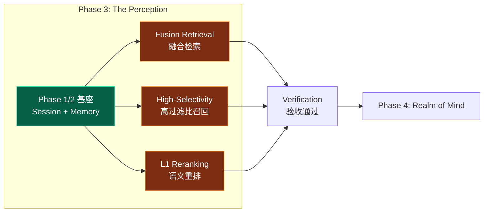

### 1.2 核心设计 (Core Architecture)

本章节阐述 The Perception 的核心设计理念，遵循 **正交分解 (Orthogonal Decomposition)** 原则，将检索过程解耦为信号提取、多路召回与分层排序三个独立维度。

#### 1.2.1 检索信号正交性 (Signal Orthogonality)

我们将检索信号解构为三个互不重叠的维度，确保在不同认知粒度上实现全覆盖：

| 维度       | 信号类型 (Signal)     | 认知层面                                             | 技术实现 (PostgreSQL)                                                                 |
| :--------- | :-------------------- | :--------------------------------------------------- | :------------------------------------------------------------------------------------ |
| **语义层** | **Semantic Search**   | 隐性意图、概念联想<br>语义相似度检索（向量距离）     | `vector` (HNSW): `embedding <=> query_embedding`<br>捕捉 "What you mean"              |
| **词法层** | **Keyword Search**    | 显性关键词、专有名词<br>匹配检索（BM25/全文搜索）    | `tsvector` (BM25): `to_tsvector @@ plainto_tsquery`<br>捕捉 "What you said"           |
| **结构层** | **Structural Filter** | 时空约束、权限边界<br>结构化元数据过滤（JSONB/标量） | `jsonb` (GIN/B-Tree): `metadata @> '{"key": "value}'`<br>捕捉 "Context & Constraints" |
| **空间层** | **Spatial Search**    | 地理位置、物理空间<br>LBS 范围检索 (Radius Search)   | `geography` (GiST): `ST_DWithin(loc, $p, $r)`<br>捕捉 "Where it is"                   |

#### 1.2.2 感知链路 (Perception Pipeline)

检索链路采用 **漏斗型架构 (Funnel Architecture)**，通过两阶段处理实现由粗到精的 **熵减 (Entropy Reduction)** 过程。

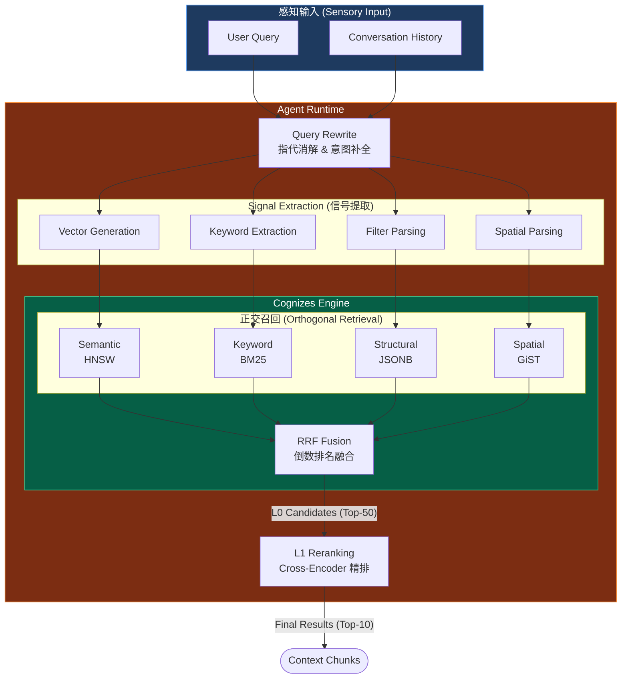

#### 1.2.3 Two-Stage Retrieval (两阶段检索)

> [!IMPORTANT]
>
> **对标 Roadmap Pillar III**：The Perception 采用两阶段检索架构，分离“召回”与“排序”关注点，平衡性能、延迟与精度。

| 阶段                    | 定位                             | 运行环境      | 延迟预算 (Latency) | 关键指标           | 算法/模型                    |
| :---------------------- | :------------------------------- | :------------ | :----------------- | :----------------- | :--------------------------- |
| **L0 粗排 (Recall)**    | **广度优先**：确保不漏掉相关信息 | PostgreSQL    | < 50ms             | Recall@50 > 95%    | HNSW + BM25 + RRF            |
| **L1 精排 (Precision)** | **深度优先**：不仅相关，更要精准 | Agent Runtime | < 200ms            | Precision@10 > 95% | BGE-Reranker (Cross-Encoder) |

### 1.3 执行导图 (Execution Map)

#### 1.3.1 任务-文档锚定

> [!NOTE]
>
> 本执行导图对齐 [001-task-checklist.md](./001-task-checklist.md) 的 Phase 3 任务集，将验证工作划分为 **Core Engine (核心引擎)**、**Knowledge Base (知识库)** 与 **Support System (支撑系统)** 三大正交流。

| 实施流 (Stream)                               | 任务模块            | 任务 ID          | 对应章节 Anchor                                                                 |
| :-------------------------------------------- | :------------------ | :--------------- | :------------------------------------------------------------------------------ |
| **1. Core Engine**<br>_(Dynamic Memory)_      | Hybrid Search SQL   | P3-1-1 ~ P3-1-5  | [4.1 Step 1: Fusion Retrieval 实现](#41-step-1-fusion-retrieval-实现)           |
|                                               | RRF Algorithm       | P3-1-6 ~ P3-1-9  | [4.1.2 RRF 融合算法](#412-rrf-融合算法-reciprocal-rank-fusion)                  |
|                                               | High-Selectivity    | P3-2-1 ~ P3-2-4  | [4.2 Step 2: High-Selectivity Filtering](#42-step-2-high-selectivity-filtering) |
|                                               | L1 Reranking        | P3-2-5 ~ P3-2-8  | [4.3 Step 3: L1 Reranking 实现](#43-step-3-l1-reranking-实现)                   |
| **2. Knowledge Base**<br>_(Static Knowledge)_ | KB Schema Design    | P3-4-7 ~ P3-4-10 | [3. Architecture: Perception Schema](#3-架构设计perception-schema)              |
|                                               | RAG Pipeline        | P3-5-1 ~ P3-5-5  | [4.4 Step 4: Knowledge RAG Pipeline](#)                                         |
|                                               | Hybrid Validation   | P3-5-6 ~ P3-5-13 | [4.4.2 Hybrid Search 融合](#)                                                   |
| **3. Support System**<br>_(Observability)_    | AG-UI Visualization | P3-4-1 ~ P3-4-6  | [4.5 Step 5: Glass-Box Visualization](#)                                        |
| **4. Delivery**                               | 验收与文档          | P3-3-1 ~ P3-3-4  | [5. 验收标准](#5-验收标准) + [6. 交付物](#6-交付物清单)                         |

#### 1.3.2 工期规划 (1.5 Days)

> [!IMPORTANT]
>
> **Timeline Adjustment**: 由于增加了 Knowledge Base (RAG) 与 Visualization (AG-UI) 的验证范围，Phase 3 预估工期调整为 **1.5 Days**。

| 阶段    | 实施内容 (Activity)                                                 | 关键产出 (Deliverables)                      | 预估工期 |
| :------ | :------------------------------------------------------------------ | :------------------------------------------- | :------- |
| **3.1** | **Core Retrieval Construction**<br>(Fusion SQL + RRF + HNSW Tuning) | `hybrid_search.sql`<br>`rrf_fusion.py`       | 0.5 Day  |
| **3.2** | **Precision Engineering**<br>(Reranking + High-Selectivity)         | `reranker.py`<br>Recall/Precision Benchmarks | 0.25 Day |
| **3.3** | **Knowledge Base Integration**<br>(KB Schema + RAG Pipeline)        | `knowledge_schema.sql`<br>`rag_pipeline.py`  | 0.5 Day  |
| **3.4** | **System Visualization**<br>(AG-UI Events + End-to-End Test)        | `SearchVisualizer` Class<br>Test Report      | 0.25 Day |

---

## 2. 核心参考模型：检索机制感知系统

### 2.1 对标分析：Google Vertex AI

基于 Google Vertex AI RAG Engine 和 ADK 文档<sup>[[1]](#ref1)</sup>的深度调研，我们将复刻以下核心能力，构建 **PostgreSQL-Native** 的感知基座：

| 核心组件      | Google Vertex AI 能力       | PostgreSQL 复刻策略 (Glass-Box)                    |
| :------------ | :-------------------------- | :------------------------------------------------- |
| **Vector DB** | 托管向量检索服务 (ScaNN)    | **PGVector** (HNSW 索引)                           |
| **Corpus**    | 语料库管理 (Managed Corpus) | `knowledge_base` (Static) + `memories` (Dynamic)   |
| **Retrieval** | 混合检索 (Hybrid Search)    | **One-Shot SQL** (`vector` + `tsvector` + `jsonb`) |
| **Fusion**    | 结果融合 (Result Merging)   | **RRF Algorithm** (Reciprocal Rank Fusion)         |
| **Ranking**   | 重排 API (Ranking API)      | **Cross-Encoder** (Local Inference)                |

#### 2.1.1 RAG 架构管道 (Architecture Pipeline)

```mermaid
sequenceDiagram
    participant User
    participant Runtime as Agent Runtime
    participant Engine as Cognizes Engine
    participant Rerank as L1 Reranker

    User->>Runtime: Inquiry
    Runtime->>Engine: retrieve(query, filters)

    rect rgb(6, 95, 70)
        note right of Engine: L0 Retrieval (PostgreSQL)
        par Parallel Execution
            Engine->>Engine: Semantic Search (HNSW)
            Engine->>Engine: Keyword Search (BM25)
        end
        Engine->>Engine: RRF Fusion (Top-100)
    end

    Engine-->>Runtime: L0 Candidates

    rect rgb(124, 45, 18)
        note right of Runtime: L1 Precision (Python)
        Runtime->>Rerank: Cross-Encode(Query, Candidates)
        Rerank-->>Runtime: Re-scored Results
    end

    Runtime->>User: Synthesized Response
```

### 2.2 混合检索策略 (Hybrid Retrieval)

混合检索通过结合 **Semantic (语义)** 与 **Lexical (词法)** 两种正交的检索信号，解决单一检索模式的盲区。

| 信号维度     | 技术实现         | 优势场景                      | 盲区                         |
| :----------- | :--------------- | :---------------------------- | :--------------------------- |
| **Semantic** | Embedding (HNSW) | 概念联想、跨语言、意图理解    | 专有名词、精确匹配、低频词   |
| **Lexical**  | BM25 (GIN)       | 精确关键词、代码片段、ID 匹配 | 同义词、语义漂移、上下文缺失 |

#### 2.2.1 PostgreSQL One-Shot Implementation

不同于传统架构需分别查询 Vector DB 和 Search Engine，PostgreSQL 支持通过 **CTE (Common Table Expressions)** 实现单次 SQL 交互的混合检索：

```sql
WITH semantic AS (
    SELECT id, 1 - (embedding <=> $emb) as score FROM docs ORDER BY embedding <=> $emb LIMIT 50
),
keyword AS (
    SELECT id, ts_rank_cd(tsv, $query) as score FROM docs WHERE tsv @@ $query ORDER BY score DESC LIMIT 50
)
-- RRF Fusion Logic in SQL ...
```

### 2.3 融合算法 (RRF Algorithm)

**Reciprocal Rank Fusion (RRF)** 是一种无需调参的稳健融合算法，公式如下：

$$
    \text{Score}_{RRF}(d) = \sum_{r \in R} \frac{1}{k + rank_r(d)}
$$

其中：

- $d$ 是文档
- $R$ 是所有检索器的排名列表
- $r(d)$ 是文档 $d$ 在检索器中的排名 (从 1 开始)
- $k$ 是平滑常数 (通常取 60)

> [!TIP]
>
> **Why RRF?** 相比线性加权 (Weighted Sum)，RRF 不依赖分数的绝对值（向量距离 vs BM25 分数很难归一化），仅依赖相对排名，鲁棒性更强。即使某一检索路 "失效"（返回无关结果），RRF 也能保证相关文档被另一路 "捞回"。
>
> **RRF 示例计算**
>
> | 文档 | 向量检索排名 | 关键词检索排名 | RRF 分数 (k=60)              |
> | :--- | :----------- | :------------- | :--------------------------- |
> | A    | 1            | 3              | 1/(60+1) + 1/(60+3) = 0.0325 |
> | B    | 2            | 1              | 1/(60+2) + 1/(60+1) = 0.0325 |
> | C    | 3            | 2              | 1/(60+3) + 1/(60+2) = 0.0322 |
> | D    | 5            | -              | 1/(60+5) = 0.0154            |
>
> **观察**：文档 A 和 B 的 RRF 分数相同，说明 RRF 对不同检索器的排名给予等权重。

### 2.4 工程挑战：高过滤比 (High-Selectivity)

> [!WARNING]
> **The Top-K Trap**: 在 "Strict Filtering" (如私有记忆检索) 场景下，若符合条件的数据极少 (e.g., 0.1%)，由于 HNSW 的近似最近邻特性，标准 Top-K 查询可能返回空集。

**解决方案**: 启用 PGVector 0.8.0+ 的 **Iterative Index Scan**。即在索引扫描未满足 `LIMIT` 时，自动扩大搜索半径，直到找到足够的符合元数据过滤条件的记录。

```sql
SET hnsw.iterative_scan = relaxed_order; -- 牺牲严格顺序换取召回率
SET hnsw.max_scan_tuples = 20000;        -- 设定扫描上限防止全表扫描
```

### 2.5 精排策略 (L1 Reranking)

L0 检索关注 **Recall (召回率)**，L1 重排关注 **Precision (准确率)**。

| 阶段             | 模型架构          | 特性                                 | 延迟预算 |
| :--------------- | :---------------- | :----------------------------------- | :------- |
| **L0 Recall**    | Bi-Encoder        | 向量预计算，极快                     | < 50ms   |
| **L1 Precision** | **Cross-Encoder** | Query-Doc 联合编码，深度交互，高精度 | < 200ms  |

**选型建议**:

- **Base**: `BAAI/bge-reranker-base` (Balance)
- **High-Performance**: `BAAI/bge-reranker-v2-m3` (Multi-Lingual)

---

## 3. 架构设计：Perception Schema

### 3.1 Knowledge vs Memory 双存储架构

> [!IMPORTANT]
>
> **核心区分**：The Perception 需要支持两种不同类型的检索场景，对应不同的存储表：
>
> - **Knowledge Base**（静态知识）：预先导入的外部文档，全局/租户级共享，持久化存储
> - **Memory**（动态记忆）：Agent 与用户交互生成，用户级私有，有遗忘曲线

#### 3.1.1 Knowledge vs Memory 概念对比

| 维度         | **Knowledge (知识)**                   | **Memory (记忆)**                   |
| :----------- | :------------------------------------- | :---------------------------------- |
| **来源**     | 预先导入的外部文档（PDF/Markdown/FAQ） | Agent 与用户交互动态生成            |
| **特点**     | 静态、共享、结构化/非结构化            | 动态、个人化、情景化                |
| **生命周期** | **持久化**，不会自动遗忘               | **有遗忘曲线**，低频访问会衰减      |
| **所有权**   | 全局/租户级别（多用户共享）            | 用户级别（个人私有）                |
| **典型场景** | 企业文档、FAQ、产品手册、政策法规      | 对话历史、用户偏好、情景记忆        |
| **对标系统** | RAGFlow Corpus、Dify RAG Engine        | LangGraph `Store`、ADK `MemoryBank` |
| **存储表**   | `knowledge_base`                       | `memories` + `facts`                |

#### 3.1.2 双存储 ER 图 (Dual-Store Schema)

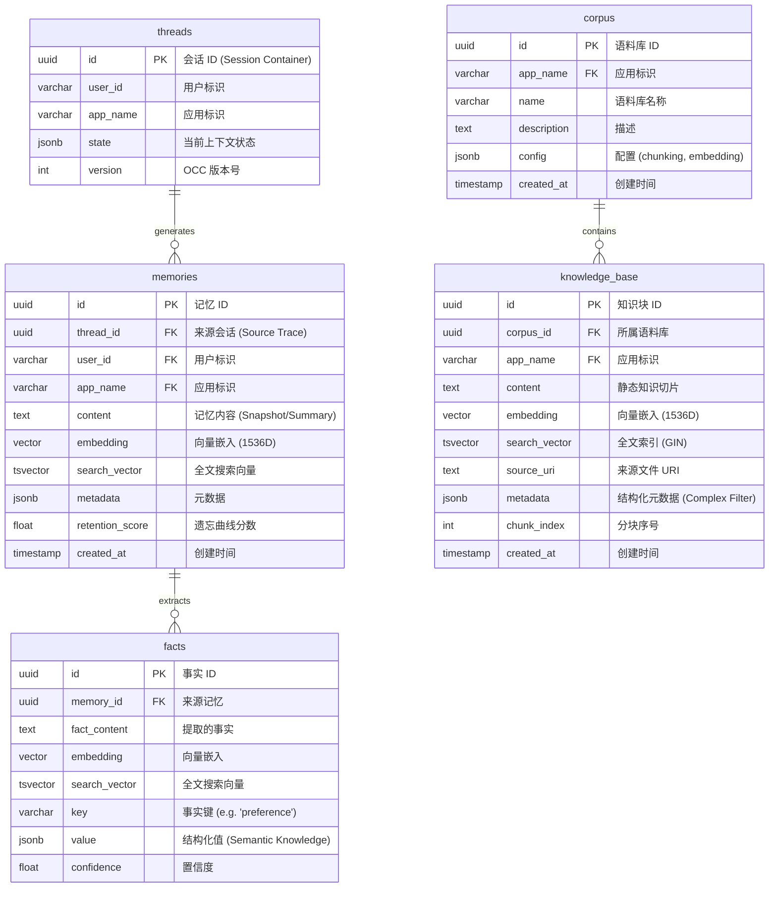

上图展示了 Perception Engine 的 **"双存储-三信号" (Dual-Store, Tri-Signal)** 正交架构：

1. **存储正交性 (Storage Orthogonality)**：
   - **左侧 (Dynamic Memory)**：以 `threads` 为源头，记录 User-Agent 的交互历史。数据是**流式生长**的，具有**时效性**（需遗忘），服务于 "Personal Context"。
   - **右侧 (Static Knowledge)**：以 `corpus` 为容器，存储预置的领域知识。数据是**静态导入**的，具有**权威性**（不遗忘），服务于 "Domain Capability"。
2. **信号完备性 (Signal Completeness)**：
   - `memories` 和 `knowledge_base` 表均同时包含 `embedding` (语义信号)、`search_vector` (词法信号) 和 `metadata/state` (结构化信号)，确保了检索链路在物理层面的**同构性**，从而支持上层统一的 **Hybrid Search** 接口。
3. **溯源性 (Traceability)**：
   - 动态记忆通过 `thread_id` 严格锚定到原始会话，不仅能回答 "用户喜好什么"，还能追溯 "这是在哪次对话中提取的"，实现了记忆的可解释性。

#### 3.1.3 检索场景对应

| 检索场景           | 存储表           | 过滤条件                | 典型查询                 |
| :----------------- | :--------------- | :---------------------- | :----------------------- |
| **Knowledge 检索** | `knowledge_base` | `corpus_id`, `app_name` | "公司年假政策是什么?"    |
| **Memory 检索**    | `memories`       | `user_id`, `app_name`   | "用户之前说过什么偏好?"  |
| **Unified 检索**   | 两表联合         | `app_name` + RRF 融合   | 结合知识库与用户记忆回答 |

### 3.2 Knowledge Base Schema 设计

> [!NOTE]
>
> **NEW**: 新增 `corpus` 和 `knowledge_base` 表，用于存储静态知识，与 `memories` 表（动态记忆）分离。

#### 3.2.1 Corpus 表 (语料库)

```sql
-- 语料库管理表
CREATE TABLE IF NOT EXISTS corpus (
    id UUID PRIMARY KEY DEFAULT gen_random_uuid(),
    app_name VARCHAR(255) NOT NULL,
    name VARCHAR(255) NOT NULL,
    description TEXT,
    config JSONB DEFAULT '{}',  -- chunking_strategy, embedding_model, etc.
    created_at TIMESTAMP WITH TIME ZONE DEFAULT NOW(),
    updated_at TIMESTAMP WITH TIME ZONE DEFAULT NOW(),

    UNIQUE(app_name, name)
);

-- 索引
CREATE INDEX IF NOT EXISTS idx_corpus_app_name ON corpus(app_name);

COMMENT ON TABLE corpus IS '语料库管理表，用于管理 Knowledge Base 的顶层容器';
```

#### 3.2.2 Knowledge Base 表 (知识块)

```sql
-- 知识块存储表 (静态知识)
CREATE TABLE IF NOT EXISTS knowledge_base (
    id UUID PRIMARY KEY DEFAULT gen_random_uuid(),
    corpus_id UUID NOT NULL REFERENCES corpus(id) ON DELETE CASCADE,
    app_name VARCHAR(255) NOT NULL,

    -- 内容字段
    content TEXT NOT NULL,
    embedding vector(1536),
    search_vector tsvector,

    -- 来源追溯
    source_uri TEXT,                -- 原始文件路径/URL
    chunk_index INTEGER DEFAULT 0,   -- 分块序号

    -- 元数据
    metadata JSONB DEFAULT '{}',     -- author, tags, version, etc.

    -- 时间戳
    created_at TIMESTAMP WITH TIME ZONE DEFAULT NOW(),
    updated_at TIMESTAMP WITH TIME ZONE DEFAULT NOW()
);

-- 向量索引 (HNSW)
CREATE INDEX IF NOT EXISTS idx_kb_embedding
    ON knowledge_base USING hnsw (embedding vector_cosine_ops)
    WITH (m = 16, ef_construction = 64);

-- 全文索引 (GIN)
CREATE INDEX IF NOT EXISTS idx_kb_search_vector
    ON knowledge_base USING GIN (search_vector);

-- 过滤索引
CREATE INDEX IF NOT EXISTS idx_kb_corpus_app
    ON knowledge_base(corpus_id, app_name);

-- 自动更新 search_vector 触发器
CREATE OR REPLACE FUNCTION kb_search_vector_trigger()
RETURNS trigger AS $$
BEGIN
    NEW.search_vector := to_tsvector('english', COALESCE(NEW.content, ''));
    RETURN NEW;
END;
$$ LANGUAGE plpgsql;

CREATE TRIGGER trigger_kb_search_vector
    BEFORE INSERT OR UPDATE ON knowledge_base
    FOR EACH ROW
    EXECUTE FUNCTION kb_search_vector_trigger();

COMMENT ON TABLE knowledge_base IS '知识块存储表，用于 RAG Pipeline 的静态知识检索';
```

### 3.3 Memory Schema 扩展

> [!NOTE]
>
> **延续 Phase 2**：复用 Hippocampus 已建立的 `memories` 和 `facts` 表，仅需添加全文搜索支持。

#### 3.3.1 新增 tsvector 列

```sql
-- 在 memories 表添加全文搜索向量列
ALTER TABLE memories ADD COLUMN IF NOT EXISTS
    search_vector tsvector;

-- 创建触发器自动更新 search_vector
CREATE OR REPLACE FUNCTION memories_search_vector_trigger()
RETURNS trigger AS $$
BEGIN
    NEW.search_vector := to_tsvector('english', COALESCE(NEW.content, ''));
    RETURN NEW;
END;
$$ LANGUAGE plpgsql;

CREATE TRIGGER trigger_memories_search_vector
    BEFORE INSERT OR UPDATE ON memories
    FOR EACH ROW
    EXECUTE FUNCTION memories_search_vector_trigger();

-- 创建 GIN 索引加速全文搜索
CREATE INDEX IF NOT EXISTS idx_memories_search_vector
    ON memories USING GIN (search_vector);
```

### 3.4 索引策略

| 存储表           | 列              | 索引类型 | 用途       |
| :--------------- | :-------------- | :------- | :--------- |
| `knowledge_base` | `embedding`     | HNSW     | 语义检索   |
| `knowledge_base` | `search_vector` | GIN      | 关键词检索 |
| `knowledge_base` | `corpus_id`     | BTREE    | 语料库过滤 |
| `memories`       | `embedding`     | HNSW     | 语义检索   |
| `memories`       | `search_vector` | GIN      | 关键词检索 |
| `memories`       | `user_id`       | BTREE    | 用户过滤   |

> [!IMPORTANT]
>
> **三重索引策略**：为支持 One-Shot Hybrid Search，需要同时维护三类索引。

| 索引类型     | 目标列                | 索引算法 | 用途            |
| :----------- | :-------------------- | :------- | :-------------- |
| **向量索引** | `embedding`           | HNSW     | 语义相似度检索  |
| **全文索引** | `search_vector`       | GIN      | BM25 关键词检索 |
| **标量索引** | `user_id`, etc.       | BTREE    | 元数据过滤      |
| **复合索引** | `(user_id, app_name)` | BTREE    | 高频过滤场景    |

### 3.5 JSONB Complex Predicates 设计

> [!IMPORTANT]
>
> **对标 Roadmap Pillar III**: Complex Predicates 支持基于 JSONB 的任意深度的布尔逻辑过滤，是 The Perception 区别于简单向量检索的核心能力。

#### 3.5.1 JSONB 过滤语法参考

| 场景             | SQL 语法                                      | 说明                     |
| :--------------- | :-------------------------------------------- | :----------------------- | ------------ |
| **简单键值匹配** | `metadata @> '{"type": "note"}'`              | 包含指定键值对           |
| **嵌套对象匹配** | `metadata @> '{"author": {"role": "admin"}}'` | 任意深度嵌套             |
| **数组元素包含** | `metadata @> '{"tags": ["important"]}'`       | 数组包含指定元素         |
| **路径取值比较** | `metadata->'author'->>'role' = 'admin'`       | 提取路径值进行比较       |
| **数值范围过滤** | `(metadata->>'priority')::int > 5`            | 类型转换后数值比较       |
| **存在性检查**   | `metadata ? 'urgent'`                         | 检查 key 是否存在        |
| **多键存在检查** | `metadata ?& array['type', 'status']`         | 同时存在多个 key         |
| **任一键存在**   | `metadata ?                                   | array['vip', 'premium']` | 存在任一 key |

#### 3.5.2 主流业务场景示例

> [!NOTE]
>
> 以下业务场景经过正交分析，覆盖 RAG 系统的主流过滤需求维度。

##### 场景 1：多租户隔离 (Multi-Tenant Isolation)

```sql
-- 业务需求：SaaS 平台中每个租户只能检索自己的知识库
-- 过滤条件：tenant_id (强过滤，高选择性)
SELECT id, content, embedding <=> $query_embedding AS distance
FROM memories
WHERE
    metadata @> '{"tenant_id": "org_acme_corp"}'
    AND user_id = $user_id
ORDER BY embedding <=> $query_embedding
LIMIT 10;

-- 优化：为高频租户创建部分索引
CREATE INDEX idx_memories_tenant_acme
    ON memories USING hnsw (embedding vector_cosine_ops)
    WHERE metadata @> '{"tenant_id": "org_acme_corp"}';
```

##### 场景 2：权限控制 (Access Control)

```sql
-- 业务需求：根据用户角色过滤可访问的知识
-- 过滤条件：access_level, department (组合条件)
SELECT id, content, embedding <=> $query_embedding AS distance
FROM memories
WHERE
    -- 访问级别检查：用户级别 >= 文档级别
    (metadata->>'access_level')::int <= $user_access_level
    -- 部门归属检查：用户所属部门或公开文档
    AND (
        metadata @> '{"visibility": "public"}'
        OR metadata->'departments' @> $user_department::jsonb
    )
ORDER BY embedding <=> $query_embedding
LIMIT 10;
```

##### 场景 3：时间范围过滤 (Time-Based Filtering)

```sql
-- 业务需求：只检索特定时间段内的记忆
-- 过滤条件：created_at, updated_at (范围过滤)
SELECT id, content, embedding <=> $query_embedding AS distance
FROM memories
WHERE
    -- 时间范围过滤
    created_at >= $start_time AND created_at <= $end_time
    -- 可选：只要最近更新的
    AND (updated_at IS NULL OR updated_at >= NOW() - INTERVAL '7 days')
    -- 元数据时间戳过滤（存储在 JSONB 中的业务时间）
    AND (metadata->>'event_time')::timestamp >= $event_start
ORDER BY embedding <=> $query_embedding
LIMIT 10;

-- 优化：创建复合索引覆盖时间范围查询
CREATE INDEX idx_memories_created_at_embedding
    ON memories (created_at DESC, user_id);
```

##### 场景 4：标签系统 (Tag-Based Filtering)

```sql
-- 业务需求：根据标签组合过滤知识
-- 过滤条件：tags 数组 (包含/排除逻辑)
SELECT id, content, embedding <=> $query_embedding AS distance
FROM memories
WHERE
    -- 必须包含所有指定标签 (AND 语义)
    metadata @> '{"tags": ["machine-learning", "research"]}'
    -- 排除特定标签
    AND NOT metadata @> '{"tags": ["deprecated"]}'
    -- 可选：包含任一标签 (OR 语义，需应用层处理)
ORDER BY embedding <=> $query_embedding
LIMIT 10;

-- 优化：GIN 索引支持数组包含查询
CREATE INDEX idx_memories_tags
    ON memories USING GIN ((metadata->'tags'));
```

##### 场景 5：复合条件与优先级 (Complex Business Logic)

```sql
-- 业务需求：企业知识库的复杂检索条件
-- 过滤条件：多维度组合 (角色 + 状态 + 类型 + 优先级)
SELECT id, content, embedding <=> $query_embedding AS distance
FROM memories
WHERE
    -- 文档类型
    metadata @> '{"doc_type": "policy"}'
    -- 状态：已发布
    AND metadata @> '{"status": "published"}'
    -- 创建者角色：管理员或专家
    AND (
        metadata @> '{"author": {"role": "admin"}}'
        OR metadata @> '{"author": {"role": "expert"}}'
    )
    -- 优先级 >= 高
    AND (metadata->>'priority')::int >= 3
    -- 未过期
    AND (
        metadata->>'expires_at' IS NULL
        OR (metadata->>'expires_at')::timestamp > NOW()
    )
ORDER BY embedding <=> $query_embedding
LIMIT 10;
```

#### 3.5.3 JSONB 索引策略

```sql
-- 1. GIN 索引：支持 @>、?、?&、?| 操作符
CREATE INDEX idx_memories_metadata_gin
    ON memories USING GIN (metadata);

-- 2. 表达式索引：针对高频查询路径
-- 场景：频繁按 author.role 过滤
CREATE INDEX idx_memories_author_role
    ON memories ((metadata->'author'->>'role'));

-- 3. 部分索引：针对特定业务场景
-- 场景：仅索引 admin 用户的记忆（减少索引大小）
CREATE INDEX idx_memories_admin_only
    ON memories USING hnsw (embedding vector_cosine_ops)
    WHERE metadata @> '{"author": {"role": "admin"}}';
```

### 3.6 核心 SQL 函数设计

#### 3.6.1 One-Shot Hybrid Search 函数

```sql
-- 核心函数：One-Shot 混合检索
CREATE OR REPLACE FUNCTION hybrid_search(
    p_user_id VARCHAR(255),
    p_app_name VARCHAR(255),
    p_query TEXT,
    p_query_embedding vector(1536),
    p_limit INTEGER DEFAULT 50,
    p_semantic_weight FLOAT DEFAULT 0.7,
    p_keyword_weight FLOAT DEFAULT 0.3,
    p_metadata_filter JSONB DEFAULT NULL
)
RETURNS TABLE (
    id UUID,
    content TEXT,
    semantic_score FLOAT,
    keyword_score FLOAT,
    combined_score FLOAT,
    metadata JSONB
) AS $$
BEGIN
    RETURN QUERY
    WITH
    -- 1. 语义检索 (向量)
    semantic_results AS (
        SELECT
            m.id,
            m.content,
            1 - (m.embedding <=> p_query_embedding) AS score,
            m.metadata
        FROM memories m
        WHERE m.user_id = p_user_id
          AND m.app_name = p_app_name
          AND (p_metadata_filter IS NULL OR m.metadata @> p_metadata_filter)
        ORDER BY m.embedding <=> p_query_embedding
        LIMIT p_limit * 2  -- 召回 2 倍用于融合
    ),
    -- 2. 关键词检索 (BM25)
    keyword_results AS (
        SELECT
            m.id,
            m.content,
            ts_rank_cd(m.search_vector, plainto_tsquery('english', p_query)) AS score,
            m.metadata
        FROM memories m
        WHERE m.user_id = p_user_id
          AND m.app_name = p_app_name
          AND m.search_vector @@ plainto_tsquery('english', p_query)
          AND (p_metadata_filter IS NULL OR m.metadata @> p_metadata_filter)
        ORDER BY score DESC
        LIMIT p_limit * 2
    ),
    -- 3. 合并去重
    combined AS (
        SELECT
            COALESCE(s.id, k.id) AS id,
            COALESCE(s.content, k.content) AS content,
            COALESCE(s.score, 0) AS semantic_score,
            COALESCE(k.score, 0) AS keyword_score,
            COALESCE(s.metadata, k.metadata) AS metadata
        FROM semantic_results s
        FULL OUTER JOIN keyword_results k ON s.id = k.id
    )
    -- 4. 加权融合排序
    SELECT
        c.id,
        c.content,
        c.semantic_score,
        c.keyword_score,
        (c.semantic_score * p_semantic_weight + c.keyword_score * p_keyword_weight) AS combined_score,
        c.metadata
    FROM combined c
    ORDER BY combined_score DESC
    LIMIT p_limit;
END;
$$ LANGUAGE plpgsql;
```

#### 3.6.2 RRF 融合函数

```sql
-- RRF (Reciprocal Rank Fusion) 融合函数
CREATE OR REPLACE FUNCTION rrf_search(
    p_user_id VARCHAR(255),
    p_app_name VARCHAR(255),
    p_query TEXT,
    p_query_embedding vector(1536),
    p_limit INTEGER DEFAULT 50,
    p_k INTEGER DEFAULT 60  -- RRF 平滑常数
)
RETURNS TABLE (
    id UUID,
    content TEXT,
    rrf_score FLOAT,
    semantic_rank INTEGER,
    keyword_rank INTEGER,
    metadata JSONB
) AS $$
BEGIN
    RETURN QUERY
    WITH
    -- 1. 语义检索 + 排名
    semantic_ranked AS (
        SELECT
            m.id, m.content, m.metadata,
            ROW_NUMBER() OVER (ORDER BY m.embedding <=> p_query_embedding) AS rank
        FROM memories m
        WHERE m.user_id = p_user_id AND m.app_name = p_app_name
        ORDER BY m.embedding <=> p_query_embedding
        LIMIT p_limit * 3
    ),
    -- 2. 关键词检索 + 排名
    keyword_ranked AS (
        SELECT
            m.id, m.content, m.metadata,
            ROW_NUMBER() OVER (
                ORDER BY ts_rank_cd(m.search_vector, plainto_tsquery('english', p_query)) DESC
            ) AS rank
        FROM memories m
        WHERE m.user_id = p_user_id
          AND m.app_name = p_app_name
          AND m.search_vector @@ plainto_tsquery('english', p_query)
        ORDER BY ts_rank_cd(m.search_vector, plainto_tsquery('english', p_query)) DESC
        LIMIT p_limit * 3
    ),
    -- 3. RRF 融合
    rrf_combined AS (
        SELECT
            COALESCE(s.id, k.id) AS id,
            COALESCE(s.content, k.content) AS content,
            COALESCE(s.metadata, k.metadata) AS metadata,
            s.rank AS semantic_rank,
            k.rank AS keyword_rank,
            -- RRF 公式: sum(1 / (k + rank))
            COALESCE(1.0 / (p_k + s.rank), 0) +
            COALESCE(1.0 / (p_k + k.rank), 0) AS rrf_score
        FROM semantic_ranked s
        FULL OUTER JOIN keyword_ranked k ON s.id = k.id
    )
    -- 4. 按 RRF 分数排序
    SELECT
        c.id,
        c.content,
        c.rrf_score,
        c.semantic_rank::INTEGER,
        c.keyword_rank::INTEGER,
        c.metadata
    FROM rrf_combined c
    ORDER BY c.rrf_score DESC
    LIMIT p_limit;
END;
$$ LANGUAGE plpgsql;
```

### 3.7 Knowledge Base 专用检索函数

```sql
-- Knowledge Base 专用混合检索函数
CREATE OR REPLACE FUNCTION kb_hybrid_search(
    p_corpus_id UUID,
    p_app_name VARCHAR(255),
    p_query TEXT,
    p_query_embedding vector(1536),
    p_limit INTEGER DEFAULT 50,
    p_semantic_weight FLOAT DEFAULT 0.7,
    p_keyword_weight FLOAT DEFAULT 0.3
)
RETURNS TABLE (
    id UUID,
    content TEXT,
    source_uri TEXT,
    semantic_score FLOAT,
    keyword_score FLOAT,
    combined_score FLOAT,
    metadata JSONB
) AS $$
BEGIN
    RETURN QUERY
    WITH
    semantic_results AS (
        SELECT
            kb.id, kb.content, kb.source_uri,
            1 - (kb.embedding <=> p_query_embedding) AS score,
            kb.metadata
        FROM knowledge_base kb
        WHERE kb.corpus_id = p_corpus_id AND kb.app_name = p_app_name
        ORDER BY kb.embedding <=> p_query_embedding
        LIMIT p_limit * 2
    ),
    keyword_results AS (
        SELECT
            kb.id, kb.content, kb.source_uri,
            ts_rank_cd(kb.search_vector, plainto_tsquery('english', p_query)) AS score,
            kb.metadata
        FROM knowledge_base kb
        WHERE kb.corpus_id = p_corpus_id
          AND kb.app_name = p_app_name
          AND kb.search_vector @@ plainto_tsquery('english', p_query)
        ORDER BY score DESC
        LIMIT p_limit * 2
    ),
    combined AS (
        SELECT
            COALESCE(s.id, k.id) AS id,
            COALESCE(s.content, k.content) AS content,
            COALESCE(s.source_uri, k.source_uri) AS source_uri,
            COALESCE(s.score, 0) AS semantic_score,
            COALESCE(k.score, 0) AS keyword_score,
            COALESCE(s.metadata, k.metadata) AS metadata
        FROM semantic_results s
        FULL OUTER JOIN keyword_results k ON s.id = k.id
    )
    SELECT
        c.id, c.content, c.source_uri,
        c.semantic_score, c.keyword_score,
        (c.semantic_score * p_semantic_weight + c.keyword_score * p_keyword_weight) AS combined_score,
        c.metadata
    FROM combined c
    ORDER BY combined_score DESC
    LIMIT p_limit;
END;
$$ LANGUAGE plpgsql;
```

#### 8.0.3 双存储检索测试用例

| 测试用例 ID | 测试场景                 | 检索函数             | 验收标准                       |
| :---------- | :----------------------- | :------------------- | :----------------------------- |
| DUAL-01     | Knowledge 独立检索       | `kb_hybrid_search()` | 仅返回 `knowledge_base` 表数据 |
| DUAL-02     | Memory 独立检索          | `hybrid_search()`    | 仅返回 `memories` 表数据       |
| DUAL-03     | Unified 联合检索         | `unified_search()`   | 两表数据 RRF 融合              |
| DUAL-04     | Knowledge 不影响 Memory  | 交叉测试             | 两表数据隔离，无交叉污染       |
| DUAL-05     | Corpus 过滤 vs User 过滤 | 对比测试             | 各自过滤条件正确生效           |

### 3.8 RAG Pipeline 架构

> [!NOTE]
>
> **对标 Roadmap Pillar III**：RAG Pipeline 是 Knowledge Base 的核心检索链路，实现「文档摄入 → 检索 → 生成」的完整闭环。

#### 3.8.1 Pipeline 完整流程

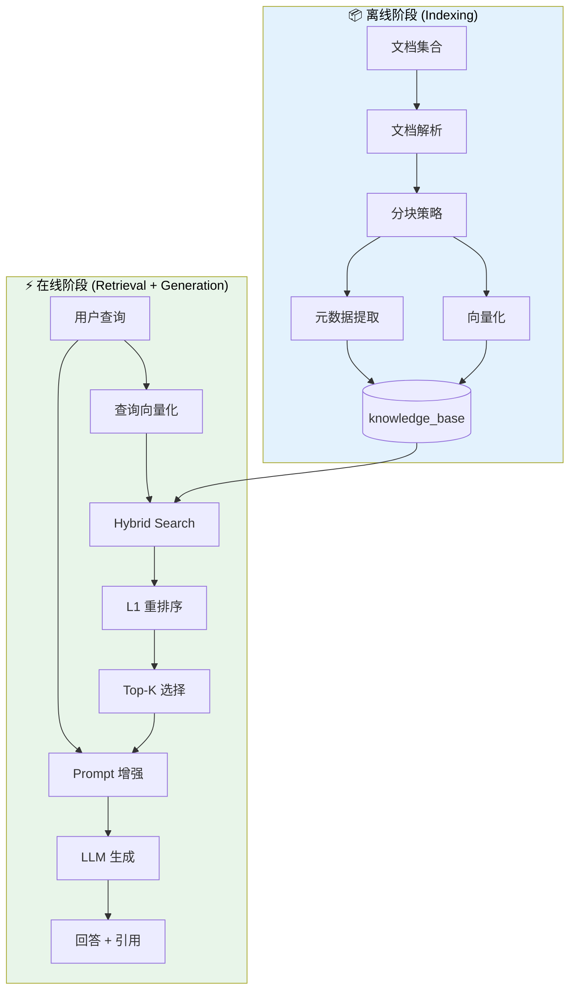

#### 3.8.2 RAGPipeline 核心接口

**实现文件**：`src/cognizes/engine/perception/rag_pipeline.py`

```python
class RAGPipeline:
    """完整的 RAG Pipeline 实现"""

    async def index_document(
        self,
        content: str,
        source_uri: str,
        corpus_id: Optional[str] = None,
        metadata: Optional[Dict[str, Any]] = None,
    ) -> IndexingResult:
        """文档索引入库"""

    async def retrieve(
        self,
        query: str,
        top_k: int = 10,
        semantic_weight: float = 0.7,
        keyword_weight: float = 0.3,
    ) -> List[RetrievalResult]:
        """混合检索"""

    async def query(
        self,
        query: str,
        top_k: int = 5,
        system_prompt: Optional[str] = None,
    ) -> RAGResponse:
        """端到端 RAG 查询 (检索 + 生成)"""
```

#### 3.8.3 双存储解耦架构

| 存储表           | 数据类型     | 过滤维度                | 检索函数             |
| :--------------- | :----------- | :---------------------- | :------------------- |
| `knowledge_base` | 静态知识文档 | `corpus_id`, `app_name` | `kb_hybrid_search()` |
| `memories`       | 用户会话记忆 | `user_id`, `app_name`   | `hybrid_search()`    |

---

### 3.9 文档摄入架构

**实现文件**：`src/cognizes/engine/perception/ingestion.py`

#### 3.9.1 摄入流程

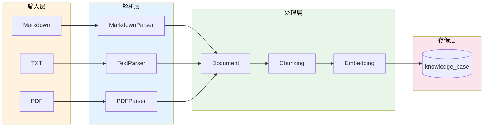

#### 3.9.2 DocumentIngester 接口

```python
class DocumentIngester:
    """高层文档摄入服务"""

    def ingest_text(
        self,
        content: str,
        source_uri: str = "inline.txt",
        generate_embeddings: bool = True,
    ) -> IngestedDocument:
        """摄入文本内容"""

    def ingest_files(
        self,
        file_paths: List[Path],
        generate_embeddings: bool = True,
    ) -> List[IngestedDocument]:
        """批量摄入文件"""
```

#### 3.9.3 元数据抽取规范

| 元数据字段    | 类型   | 来源         | 用途       |
| :------------ | :----- | :----------- | :--------- |
| `source_uri`  | string | 文件路径/URL | 引用溯源   |
| `title`       | string | 文档首行/H1  | 显示标题   |
| `mime_type`   | string | 文件扩展名   | 解析器选择 |
| `doc_id`      | string | 内容哈希     | 去重标识   |
| `chunk_index` | int    | 分块索引     | 上下文定位 |

---

### 3.10 Chunking 策略体系

**实现文件**：`src/cognizes/engine/perception/chunking.py`

#### 3.10.1 四种策略对比

| 策略                    | 方法                 | 优点         | 缺点         | 适用场景  |
| :---------------------- | :------------------- | :----------- | :----------- | :-------- |
| **FixedLengthChunker**  | 固定 Token 数切分    | 简单、可预测 | 可能割裂语义 | 通用文本  |
| **RecursiveChunker**    | 按分隔符优先级递归   | 尊重自然边界 | 大小不均匀   | 技术文档  |
| **SemanticChunker**     | Embedding 相似度判断 | 语义完整     | 计算成本高   | 长篇文章  |
| **HierarchicalChunker** | 父子 Chunk 结构      | 上下文丰富   | 存储开销大   | 法律/合同 |

#### 3.10.2 策略选型决策树

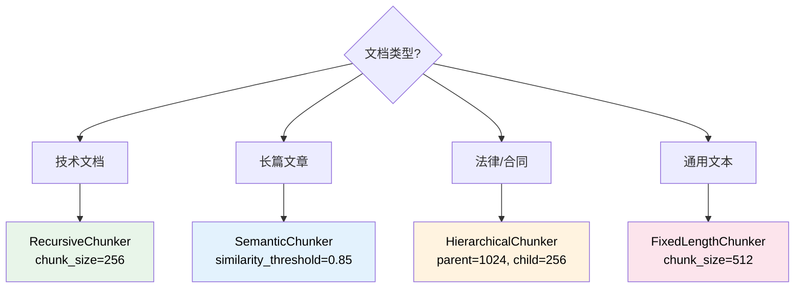

#### 3.10.3 参数调优指南

| 参数             | 默认值     | 调优建议                    |
| :--------------- | :--------- | :-------------------------- |
| `chunk_size`     | 512 tokens | 短文档 256，长文档 1024     |
| `chunk_overlap`  | 50 tokens  | 通常为 chunk_size 的 10-20% |
| `min_chunk_size` | 50 tokens  | 避免过短无意义块            |

---

### 3.11 Rerank 精排层

**实现文件**：`src/cognizes/engine/perception/reranker.py`

#### 3.11.1 两阶段检索架构

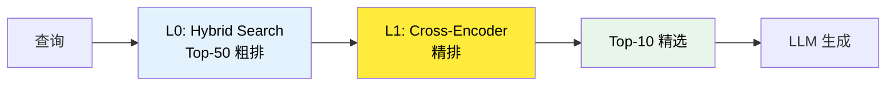

#### 3.11.2 Reranker 模型选型

| 模型                        | 特点          | 推荐场景 |
| :-------------------------- | :------------ | :------- |
| **BAAI/bge-reranker-base**  | 性能/效率平衡 | 通用场景 |
| **BAAI/bge-reranker-large** | 更高精度      | 精度优先 |
| **BCE-Reranker**            | 中英双语优秀  | 双语场景 |
| **Cohere Rerank**           | 商业 API      | 快速集成 |

#### 3.11.3 Lost in the Middle 优化

研究表明 LLM 对长上下文中间部分信息利用率较低。解决方案：

1. **Reverse Order**：按相关性升序排列（最相关在末尾）
2. **Sandwich Pattern**：最相关的放在开头和结尾

---

## 4. 实施指南

### 4.1 Step 1: Fusion Retrieval 实现

#### 4.1.1 Schema 扩展部署

**任务清单**：

| 任务 ID | 任务描述                  | 验收标准                              |
| :------ | :------------------------ | :------------------------------------ |
| P3-1-1  | 添加 `search_vector` 列   | `ALTER TABLE` 成功                    |
| P3-1-2  | 创建 GIN 全文索引         | 索引创建成功                          |
| P3-1-3  | 编写 Semantic Search SQL  | `embedding <=> query` 语法正确        |
| P3-1-4  | 编写 Keyword Search SQL   | `to_tsvector @@ plainto_tsquery` 正确 |
| P3-1-5  | 编写 One-Shot Hybrid 函数 | `hybrid_search()` 函数创建成功        |

**Schema 扩展脚本** (`src/cognizes/engine/schema/perception_schema.sql`)：

```sql
-- ============================================
-- Agentic AI Engine - Perception Schema Extension
-- Version: 1.0
-- Target: PostgreSQL 16+ with pgvector
-- Prerequisite: Phase 2 hippocampus_schema.sql 已部署
-- ============================================

-- 1. 添加全文搜索列
ALTER TABLE memories ADD COLUMN IF NOT EXISTS
    search_vector tsvector;

-- 2. 创建触发器自动更新 search_vector
CREATE OR REPLACE FUNCTION memories_search_vector_trigger()
RETURNS trigger AS $$
BEGIN
    NEW.search_vector := to_tsvector('english', COALESCE(NEW.content, ''));
    RETURN NEW;
END;
$$ LANGUAGE plpgsql;

DROP TRIGGER IF EXISTS trigger_memories_search_vector ON memories;
CREATE TRIGGER trigger_memories_search_vector
    BEFORE INSERT OR UPDATE ON memories
    FOR EACH ROW
    EXECUTE FUNCTION memories_search_vector_trigger();

-- 3. 回填已有数据的 search_vector
UPDATE memories SET search_vector = to_tsvector('english', content)
WHERE search_vector IS NULL;

-- 4. 创建 GIN 全文索引
CREATE INDEX IF NOT EXISTS idx_memories_search_vector
    ON memories USING GIN (search_vector);

-- 5. 创建复合索引 (高频过滤场景)
CREATE INDEX IF NOT EXISTS idx_memories_user_app_created
    ON memories(user_id, app_name, created_at DESC);

-- 6. 验证索引
SELECT indexname, indexdef
FROM pg_indexes
WHERE tablename = 'memories';
```

#### 4.1.2 RRF 融合算法 (Reciprocal Rank Fusion)

**任务清单**：

| 任务 ID | 任务描述                    | 验收标准            |
| :------ | :-------------------------- | :------------------ |
| P3-1-6  | 理解 RRF 算法原理           | 算法笔记            |
| P3-1-7  | 实现 SQL 内 RRF 计算        | `rrf_search()` 函数 |
| P3-1-8  | 实现应用层 RRF (Python)     | Python 函数实现     |
| P3-1-9  | 对比 SQL vs 应用层 RRF 性能 | 性能对比报告        |

**Python RRF 实现** (`src/cognizes/engine/perception/rrf_fusion.py`)：

```python
"""
RRF (Reciprocal Rank Fusion) 实现

融合多路检索结果，使用倒数排名公式合并排序。
"""

from __future__ import annotations

from dataclasses import dataclass
from typing import Any


@dataclass
class SearchResult:
    """单条检索结果"""
    id: str
    content: str
    score: float
    metadata: dict[str, Any] | None = None
    rank: int = 0


def rrf_fusion(
    result_lists: list[list[SearchResult]],
    k: int = 60,
    limit: int = 50
) -> list[SearchResult]:
    """
    Reciprocal Rank Fusion 算法

    公式: RRF(d) = Σ (1 / (k + rank(d)))

    Args:
        result_lists: 多个检索器的结果列表
        k: 平滑常数 (标准值 60)
        limit: 返回结果数量

    Returns:
        融合后的排序结果
    """
    # 1. 为每个列表分配排名
    for results in result_lists:
        for rank, result in enumerate(results, start=1):
            result.rank = rank

    # 2. 按 ID 聚合计算 RRF 分数
    rrf_scores: dict[str, tuple[float, SearchResult]] = {}

    for results in result_lists:
        for result in results:
            if result.id not in rrf_scores:
                rrf_scores[result.id] = (0.0, result)

            current_score, current_result = rrf_scores[result.id]
            # RRF 公式: 1 / (k + rank)
            new_score = current_score + 1.0 / (k + result.rank)
            rrf_scores[result.id] = (new_score, current_result)

    # 3. 按 RRF 分数排序
    sorted_results = sorted(
        rrf_scores.values(),
        key=lambda x: x[0],
        reverse=True
    )

    # 4. 返回 Top-K 结果
    return [
        SearchResult(
            id=result.id,
            content=result.content,
            score=score,
            metadata=result.metadata
        )
        for score, result in sorted_results[:limit]
    ]


# 使用示例
if __name__ == "__main__":
    # 模拟两路检索结果
    semantic_results = [
        SearchResult(id="doc1", content="Python programming", score=0.95),
        SearchResult(id="doc2", content="Machine learning", score=0.90),
        SearchResult(id="doc3", content="Data science", score=0.85),
    ]

    keyword_results = [
        SearchResult(id="doc2", content="Machine learning", score=0.88),
        SearchResult(id="doc4", content="Deep learning", score=0.85),
        SearchResult(id="doc1", content="Python programming", score=0.80),
    ]

    fused = rrf_fusion([semantic_results, keyword_results], k=60, limit=10)

    for result in fused:
        print(f"ID: {result.id}, RRF Score: {result.score:.4f}")
```

### 4.2 Step 2: High-Selectivity Filtering

#### 4.2.1 迭代扫描配置

**任务清单**：

| 任务 ID | 任务描述                           | 验收标准                              |
| :------ | :--------------------------------- | :------------------------------------ |
| P3-2-1  | 构造 99% 过滤比测试数据集          | 100 万向量，仅 1% 符合过滤条件        |
| P3-2-2  | 测试 HNSW `ef_search` 对召回率影响 | 不同 ef_search 下的 Recall@10         |
| P3-2-3  | 验证 HNSW 迭代扫描 (v0.8.0+)       | `hnsw.iterative_scan = relaxed_order` |
| P3-2-4  | 记录 QPS 与 Recall 基准数据        | 基准性能报告                          |

**迭代扫描配置脚本**：

```sql
-- ============================================
-- High-Selectivity Filtering 配置
-- ============================================

-- 1. 开启迭代扫描 (PGVector 0.8.0+)
SET hnsw.iterative_scan = relaxed_order;

-- 2. 设置最大扫描元组数 (防止无限扫描)
SET hnsw.max_scan_tuples = 20000;

-- 3. 增大 ef_search 提高召回率
SET hnsw.ef_search = 200;

-- 4. 测试查询 (99% 过滤比场景)
EXPLAIN (ANALYZE, BUFFERS)
SELECT id, content, embedding <=> $query_embedding AS distance
FROM memories
WHERE user_id = 'rare_user_001'  -- 仅 1% 数据
ORDER BY embedding <=> $query_embedding
LIMIT 10;

-- 5. 验证召回结果数量
SELECT COUNT(*) FROM (
    SELECT id
    FROM memories
    WHERE user_id = 'rare_user_001'
    ORDER BY embedding <=> $query_embedding
    LIMIT 10
) AS results;
-- 预期: 应返回 10 条结果 (迭代扫描生效)
```

**性能基准测试脚本** (`src/cognizes/engine/perception/benchmark.py`)：

```python
"""
High-Selectivity Filtering 性能基准测试

测试不同 ef_search 参数下的 QPS 和 Recall@K。
"""

import asyncio
import time
from dataclasses import dataclass

import asyncpg
import numpy as np


@dataclass
class BenchmarkResult:
    """基准测试结果"""
    ef_search: int
    qps: float
    recall_at_10: float
    p99_latency_ms: float


async def run_benchmark(
    pool: asyncpg.Pool,
    query_embedding: list[float],
    user_id: str,
    ef_search_values: list[int],
    iterations: int = 100
) -> list[BenchmarkResult]:
    """运行基准测试"""
    results = []

    for ef_search in ef_search_values:
        # 设置 ef_search
        await pool.execute(f"SET hnsw.ef_search = {ef_search}")
        await pool.execute("SET hnsw.iterative_scan = relaxed_order")

        latencies = []
        recall_count = 0

        for _ in range(iterations):
            start = time.perf_counter()

            rows = await pool.fetch("""
                SELECT id, content
                FROM memories
                WHERE user_id = $1
                ORDER BY embedding <=> $2
                LIMIT 10
            """, user_id, query_embedding)

            latency = (time.perf_counter() - start) * 1000
            latencies.append(latency)
            recall_count += len(rows)

        results.append(BenchmarkResult(
            ef_search=ef_search,
            qps=iterations / (sum(latencies) / 1000),
            recall_at_10=recall_count / (iterations * 10),
            p99_latency_ms=np.percentile(latencies, 99)
        ))

    return results


# 使用示例
async def main():
    pool = await asyncpg.create_pool("postgresql://aigc:@localhost/cognizes-engine")

    # 生成随机查询向量
    query_embedding = list(np.random.randn(1536).astype(float))

    results = await run_benchmark(
        pool,
        query_embedding,
        user_id="rare_user_001",
        ef_search_values=[40, 100, 200, 400]
    )

    print("| ef_search | QPS | Recall@10 | P99 Latency |")
    print("|-----------|-----|-----------|-------------|")
    for r in results:
        print(f"| {r.ef_search} | {r.qps:.1f} | {r.recall_at_10:.2%} | {r.p99_latency_ms:.1f}ms |")

    await pool.close()


if __name__ == "__main__":
    asyncio.run(main())
```

### 4.3 Step 3: L1 Reranking 实现

#### 4.3.1 Reranker 集成

**任务清单**：

| 任务 ID | 任务描述                             | 验收标准                   |
| :------ | :----------------------------------- | :------------------------- |
| P3-2-5  | 选择 Reranker 模型 (`bge-reranker`)  | 模型选型说明               |
| P3-2-6  | 集成 Reranker 推理服务               | API 可调用                 |
| P3-2-7  | 实现 Top-50 -> Rerank -> Top-10 流程 | Pipeline 代码实现          |
| P3-2-8  | 验证 Precision@10 提升               | 对比无 Rerank 的 Precision |

**Reranker 实现** (`src/cognizes/engine/perception/reranker.py`)：

```python
"""
L1 Reranker 实现

使用 Cross-Encoder 模型对 L0 粗排结果进行精排。
"""

from __future__ import annotations

from dataclasses import dataclass
from typing import Any

import torch
from transformers import AutoModelForSequenceClassification, AutoTokenizer


@dataclass
class RerankedResult:
    """重排后的结果"""
    id: str
    content: str
    original_score: float
    rerank_score: float
    metadata: dict[str, Any] | None = None


class CrossEncoderReranker:
    """
    Cross-Encoder 重排器

    使用 BAAI/bge-reranker-base 模型进行语义重排。
    """

    def __init__(
        self,
        model_name: str = "BAAI/bge-reranker-base",
        device: str | None = None
    ):
        self.device = device or ("cuda" if torch.cuda.is_available() else "cpu")
        self.tokenizer = AutoTokenizer.from_pretrained(model_name)
        self.model = AutoModelForSequenceClassification.from_pretrained(model_name)
        self.model.to(self.device)
        self.model.eval()

    def rerank(
        self,
        query: str,
        documents: list[dict[str, Any]],
        top_k: int = 10
    ) -> list[RerankedResult]:
        """
        对文档进行重排序

        Args:
            query: 用户查询
            documents: 待重排文档列表 (需包含 id, content, score)
            top_k: 返回 Top-K 结果

        Returns:
            重排后的结果列表
        """
        if not documents:
            return []

        # 1. 构建 Query-Document 对
        pairs = [[query, doc["content"]] for doc in documents]

        # 2. Tokenize
        inputs = self.tokenizer(
            pairs,
            padding=True,
            truncation=True,
            max_length=512,
            return_tensors="pt"
        ).to(self.device)

        # 3. 推理
        with torch.no_grad():
            scores = self.model(**inputs).logits.squeeze(-1)

        # 4. 归一化分数 (sigmoid)
        scores = torch.sigmoid(scores).cpu().numpy()

        # 5. 构建结果
        results = []
        for doc, rerank_score in zip(documents, scores):
            results.append(RerankedResult(
                id=doc["id"],
                content=doc["content"],
                original_score=doc.get("score", 0.0),
                rerank_score=float(rerank_score),
                metadata=doc.get("metadata")
            ))

        # 6. 按重排分数排序
        results.sort(key=lambda x: x.rerank_score, reverse=True)

        return results[:top_k]


class RerankerPipeline:
    """
    完整的两阶段检索 Pipeline

    L0 (数据库粗排) -> L1 (Cross-Encoder 精排)
    """

    def __init__(
        self,
        db_pool,  # asyncpg.Pool
        reranker: CrossEncoderReranker | None = None
    ):
        self.db_pool = db_pool
        self.reranker = reranker or CrossEncoderReranker()

    async def search(
        self,
        user_id: str,
        app_name: str,
        query: str,
        query_embedding: list[float],
        l0_limit: int = 50,
        l1_limit: int = 10
    ) -> list[RerankedResult]:
        """
        两阶段检索

        Args:
            user_id: 用户 ID
            app_name: 应用名称
            query: 用户查询文本
            query_embedding: 查询向量
            l0_limit: L0 粗排返回数量
            l1_limit: L1 精排返回数量

        Returns:
            精排后的结果列表
        """
        # L0: 数据库混合检索
        rows = await self.db_pool.fetch("""
            SELECT id, content, combined_score, metadata
            FROM hybrid_search($1, $2, $3, $4, $5)
        """, user_id, app_name, query, query_embedding, l0_limit)

        documents = [
            {
                "id": str(row["id"]),
                "content": row["content"],
                "score": row["combined_score"],
                "metadata": row["metadata"]
            }
            for row in rows
        ]

        # L1: Cross-Encoder 重排
        results = self.reranker.rerank(query, documents, top_k=l1_limit)

        return results


# 使用示例
async def main():
    import asyncpg

    # 初始化
    pool = await asyncpg.create_pool("postgresql://aigc:@localhost/cognizes-engine")
    pipeline = RerankerPipeline(pool)

    # 生成查询向量 (实际应使用 Embedding 模型)
    import numpy as np
    query_embedding = list(np.random.randn(1536).astype(float))

    # 执行两阶段检索
    results = await pipeline.search(
        user_id="user_001",
        app_name="demo_app",
        query="How to implement RAG with PostgreSQL?",
        query_embedding=query_embedding,
        l0_limit=50,
        l1_limit=10
    )

    # 输出结果
    print("Top 10 Reranked Results:")
    for i, r in enumerate(results, 1):
        print(f"{i}. [Score: {r.rerank_score:.4f}] {r.content[:100]}...")

    await pool.close()


if __name__ == "__main__":
    import asyncio
    asyncio.run(main())
```

---

### 4.4 Step 4: AG-UI 检索过程可视化接口

> [!NOTE]
>
> **对标 AG-UI 协议**：本节实现 The Perception 与 AG-UI 可视化层的集成，提供检索过程透明化、多路召回可视化和引用来源展示的能力。
>
> **参考资源**：
>
> - [AG-UI 协议调研](../research/070-ag-ui.md)
> - [AG-UI 官方文档](https://docs.ag-ui.com/)

#### 4.4.1 检索可视化架构

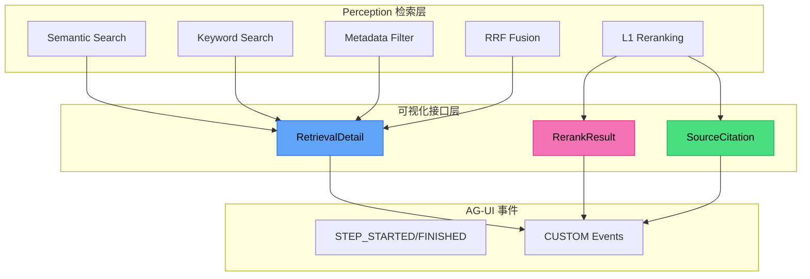

#### 4.4.2 AG-UI 事件映射表

| Perception 功能 | 触发条件             | AG-UI 事件类型              | 展示组件       |
| :-------------- | :------------------- | :-------------------------- | :------------- |
| 检索开始        | hybrid_search() 调用 | `STEP_STARTED`              | 检索进度指示器 |
| 多路召回详情    | 各路检索完成         | `CUSTOM (retrieval_detail)` | 多路召回对比图 |
| RRF 融合        | 融合完成             | `CUSTOM (rrf_result)`       | 排名变化可视化 |
| Rerank 结果     | 重排完成             | `CUSTOM (rerank_result)`    | 分数变化对比   |
| 检索完成        | 返回结果             | `STEP_FINISHED`             | 结果数量徽章   |
| 引用来源        | 结果包含来源         | `CUSTOM (source_citation)`  | 来源引用列表   |

#### 4.4.3 SearchVisualizer 实现

创建 `src/cognizes/engine/perception/search_visualizer.py`：

```python
"""
Perception SearchVisualizer: 检索过程可视化接口

职责:
1. 提供多路召回过程可视化
2. 展示 RRF 融合和 Rerank 过程
3. 生成引用来源标注
"""

from __future__ import annotations

import json
from dataclasses import dataclass, field
from typing import Any, Optional
from datetime import datetime
from enum import Enum


class SearchEventType(str, Enum):
    """检索相关 AG-UI 事件类型"""
    RETRIEVAL_DETAIL = "retrieval_detail"
    RRF_RESULT = "rrf_result"
    RERANK_RESULT = "rerank_result"
    SOURCE_CITATION = "source_citation"


@dataclass
class RetrievalPathResult:
    """单路检索结果"""
    path_name: str  # semantic, keyword, metadata
    doc_count: int
    latency_ms: float
    top_docs: list[dict]  # [{id, score, preview}]


@dataclass
class RRFMergeResult:
    """RRF 融合结果"""
    input_paths: list[str]
    output_count: int
    rank_changes: list[dict]  # [{doc_id, before_rank, after_rank}]


@dataclass
class RerankComparison:
    """Rerank 前后对比"""
    doc_id: str
    content_preview: str
    l0_score: float  # 粗排分数
    l1_score: float  # 精排分数
    rank_before: int
    rank_after: int


@dataclass
class SourceCitation:
    """引用来源"""
    doc_id: str
    source_type: str  # memory, document, web
    title: str
    url: Optional[str] = None
    snippet: str = ""
    relevance_score: float = 0.0


class SearchVisualizer:
    """检索过程可视化器"""

    def __init__(self, event_emitter=None):
        """
        Args:
            event_emitter: AG-UI 事件发射器 (可选)
        """
        self._event_emitter = event_emitter

    async def emit_search_started(
        self,
        run_id: str,
        query: str,
        search_config: dict
    ) -> None:
        """
        发射检索开始事件

        Args:
            run_id: 当前运行 ID
            query: 搜索查询
            search_config: 检索配置
        """
        if self._event_emitter:
            await self._event_emitter.emit_step_started(
                run_id=run_id,
                step_name="perception_search",
                data={
                    "query": query,
                    "config": {
                        "semanticWeight": search_config.get("semantic_weight", 0.5),
                        "keywordWeight": search_config.get("keyword_weight", 0.3),
                        "metadataFilters": search_config.get("filters", {}),
                        "topK": search_config.get("top_k", 50)
                    }
                }
            )

    async def emit_retrieval_paths(
        self,
        run_id: str,
        path_results: list[RetrievalPathResult]
    ) -> None:
        """
        发射多路召回详情事件

        用于展示各检索路径的召回结果对比

        Args:
            run_id: 当前运行 ID
            path_results: 各路检索结果
        """
        if self._event_emitter:
            await self._event_emitter.emit_custom(
                run_id=run_id,
                event_name=SearchEventType.RETRIEVAL_DETAIL.value,
                data={
                    "paths": [
                        {
                            "name": p.path_name,
                            "docCount": p.doc_count,
                            "latencyMs": p.latency_ms,
                            "topDocs": p.top_docs[:5]  # 只展示 Top 5
                        }
                        for p in path_results
                    ],
                    "totalLatencyMs": sum(p.latency_ms for p in path_results)
                }
            )

    async def emit_rrf_merge(
        self,
        run_id: str,
        merge_result: RRFMergeResult
    ) -> None:
        """
        发射 RRF 融合结果事件

        Args:
            run_id: 当前运行 ID
            merge_result: 融合结果
        """
        if self._event_emitter:
            await self._event_emitter.emit_custom(
                run_id=run_id,
                event_name=SearchEventType.RRF_RESULT.value,
                data={
                    "inputPaths": merge_result.input_paths,
                    "outputCount": merge_result.output_count,
                    "significantRankChanges": [
                        {
                            "docId": rc["doc_id"],
                            "beforeRank": rc["before_rank"],
                            "afterRank": rc["after_rank"],
                            "change": rc["before_rank"] - rc["after_rank"]
                        }
                        for rc in merge_result.rank_changes
                        if abs(rc["before_rank"] - rc["after_rank"]) >= 3
                    ][:10]  # 只展示显著变化
                }
            )

    async def emit_rerank_comparison(
        self,
        run_id: str,
        comparisons: list[RerankComparison]
    ) -> None:
        """
        发射 Rerank 前后对比事件

        Args:
            run_id: 当前运行 ID
            comparisons: 对比列表
        """
        if self._event_emitter:
            await self._event_emitter.emit_custom(
                run_id=run_id,
                event_name=SearchEventType.RERANK_RESULT.value,
                data={
                    "comparisons": [
                        {
                            "docId": c.doc_id,
                            "preview": c.content_preview[:100],
                            "l0Score": round(c.l0_score, 4),
                            "l1Score": round(c.l1_score, 4),
                            "rankBefore": c.rank_before,
                            "rankAfter": c.rank_after,
                            "improved": c.rank_after < c.rank_before
                        }
                        for c in comparisons[:20]  # 只展示 Top 20
                    ],
                    "avgScoreImprovement": sum(
                        c.l1_score - c.l0_score for c in comparisons
                    ) / len(comparisons) if comparisons else 0
                }
            )

    async def emit_search_finished(
        self,
        run_id: str,
        result_count: int,
        total_latency_ms: float
    ) -> None:
        """
        发射检索完成事件

        Args:
            run_id: 当前运行 ID
            result_count: 结果数量
            total_latency_ms: 总延迟
        """
        if self._event_emitter:
            await self._event_emitter.emit_step_finished(
                run_id=run_id,
                step_name="perception_search",
                data={
                    "resultCount": result_count,
                    "totalLatencyMs": round(total_latency_ms, 2)
                }
            )

    def generate_citations(
        self,
        search_results: list[dict]
    ) -> list[SourceCitation]:
        """
        生成引用来源列表

        用于在 Agent 响应中标注信息来源

        Args:
            search_results: 检索结果

        Returns:
            引用来源列表
        """
        citations = []
        for i, result in enumerate(search_results, 1):
            citation = SourceCitation(
                doc_id=result.get("id", f"doc_{i}"),
                source_type=result.get("source_type", "document"),
                title=result.get("title", f"Source {i}"),
                url=result.get("url"),
                snippet=result.get("content", "")[:200],
                relevance_score=result.get("score", 0.0)
            )
            citations.append(citation)
        return citations

    async def emit_citations(
        self,
        run_id: str,
        citations: list[SourceCitation]
    ) -> None:
        """
        发射引用来源事件

        Args:
            run_id: 当前运行 ID
            citations: 引用来源列表
        """
        if self._event_emitter:
            await self._event_emitter.emit_custom(
                run_id=run_id,
                event_name=SearchEventType.SOURCE_CITATION.value,
                data={
                    "citations": [
                        {
                            "id": c.doc_id,
                            "type": c.source_type,
                            "title": c.title,
                            "url": c.url,
                            "snippet": c.snippet,
                            "score": round(c.relevance_score, 4)
                        }
                        for c in citations
                    ]
                }
            )
```

#### 4.4.4 前端展示组件规范

| 组件名称                  | 数据源                    | 展示内容             |
| :------------------------ | :------------------------ | :------------------- |
| `SearchProgressIndicator` | STEP_STARTED/FINISHED     | 检索状态、耗时       |
| `RetrievalPathsChart`     | CUSTOM (retrieval_detail) | 三路召回柱状图对比   |
| `RankChangeVisualization` | CUSTOM (rrf_result)       | 排名变化桑基图       |
| `RerankScoreComparison`   | CUSTOM (rerank_result)    | L0/L1 分数对比散点图 |
| `CitationList`            | CUSTOM (source_citation)  | 引用来源卡片列表     |

#### 4.4.5 任务清单

| 任务 ID | 任务描述                   | 状态      | 验收标准         |
| :------ | :------------------------- | :-------- | :--------------- |
| P3-4-1  | 实现 `SearchVisualizer` 类 | 🔲 待开始 | 6 种事件类型支持 |
| P3-4-2  | 实现多路召回详情发射       | 🔲 待开始 | 三路召回数据完整 |
| P3-4-3  | 实现 RRF 融合可视化        | 🔲 待开始 | 排名变化可追溯   |
| P3-4-4  | 实现 Rerank 对比发射       | 🔲 待开始 | 分数变化正确     |
| P3-4-5  | 实现引用来源生成           | 🔲 待开始 | 来源信息完整     |
| P3-4-6  | 编写可视化接口测试         | 🔲 待开始 | 覆盖率 > 80%     |

#### 4.4.6 验收标准

| 验收项      | 验收标准                  | 验证方法 |
| :---------- | :------------------------ | :------- |
| 检索进度    | 实时展示检索开始/完成状态 | 集成测试 |
| 多路召回    | 三路召回结果对比可见      | E2E 测试 |
| Rerank 对比 | 排名变化前后可对比        | 单元测试 |
| 引用来源    | 检索结果可标注来源        | 集成测试 |

---

### 4.5 Step 5: Knowledge Base Pipeline 实现

> [!NOTE]
>
> **对标 Roadmap Pillar III**：Knowledge Base Pipeline 是 RAG 能力的核心工程落地，包含文档摄入、分块向量化、端到端检索生成的完整链路。

#### 4.5.1 任务清单

| 任务 ID    | 任务描述           | 里程碑         | 状态      | 验收标准                  |
| :--------- | :----------------- | :------------- | :-------- | :------------------------ |
| **P3-5-1** | 文档摄入服务实现   | M1: Ingestion  | 🔲 待开始 | 支持 MD/TXT/PDF 格式解析  |
| **P3-5-2** | Chunking 策略实现  | M1: Ingestion  | 🔲 待开始 | 四种策略测试通过          |
| **P3-5-3** | Embedding 服务实现 | M1: Ingestion  | 🔲 待开始 | Mock/OpenAI 两种 Provider |
| **P3-5-4** | RAG Pipeline 实现  | M2: Pipeline   | 🔲 待开始 | E2E 查询流程通过          |
| **P3-5-5** | 索引预热脚本       | M2: Pipeline   | 🔲 待开始 | 100K 文档 < 5min          |
| **P3-5-6** | RAG E2E 测试       | M3: Validation | 🔲 待开始 | 覆盖率 > 80%              |

#### 4.5.2 关键里程碑

```mermaid
gantt
    title Knowledge Base Pipeline 里程碑
    dateFormat DD
    axisFormat %d

    section M1: Ingestion
    P3-5-1 文档摄入 :a1, 01, 2d
    P3-5-2 Chunking :a2, after a1, 2d
    P3-5-3 Embedding :a3, after a2, 1d

    section M2: Pipeline
    P3-5-4 RAG Pipeline :b1, after a3, 2d
    P3-5-5 索引预热 :b2, after b1, 1d

    section M3: Validation
    P3-5-6 E2E 测试 :c1, after b2, 2d
```

#### 4.5.3 任务详解

##### P3-5-1: 文档摄入服务

**目标**：实现多格式文档解析与摄入

**实现文件**：`src/cognizes/engine/perception/ingestion.py`

**关键代码**：

```python
class DocumentIngester:
    def __init__(
        self,
        chunker=None,
        embedder=None,
        parsers: Optional[List[DocumentParser]] = None,
    ):
        """初始化文档摄入器"""

    def ingest_text(
        self,
        content: str,
        source_uri: str = "inline.txt",
        generate_embeddings: bool = True,
    ) -> IngestedDocument:
        """摄入文本内容"""
```

**验收检查**：

- [ ] MarkdownParser 解析测试通过
- [ ] TextParser 解析测试通过
- [ ] PDFParser 解析测试通过（可选依赖）
- [ ] 元数据抽取正确

---

##### P3-5-2: Chunking 策略实现

**目标**：实现四种分块策略

**实现文件**：`src/cognizes/engine/perception/chunking.py`

**策略对照表**：

| 策略     | 类名                  | 测试用例                     |
| :------- | :-------------------- | :--------------------------- |
| 固定长度 | `FixedLengthChunker`  | `test_fixed_length_chunking` |
| 递归分块 | `RecursiveChunker`    | `test_recursive_chunking`    |
| 层次分块 | `HierarchicalChunker` | `test_hierarchical_chunking` |
| 语义分块 | `SemanticChunker`     | `test_semantic_chunking`     |

**验收检查**：

- [ ] 四种策略单元测试通过
- [ ] Overlap 功能测试通过
- [ ] 字符/Token 模式切换测试通过

---

##### P3-5-3: Embedding 服务实现

**目标**：实现可切换的 Embedding Provider

**实现文件**：`src/cognizes/engine/perception/embedder.py`

**Provider 类型**：

| Provider | 类名                      | 说明                    |
| :------- | :------------------------ | :---------------------- |
| Mock     | `MockEmbeddingProvider`   | 测试用，返回随机向量    |
| OpenAI   | `OpenAIEmbeddingProvider` | 生产用，调用 OpenAI API |

**验收检查**：

- [ ] MockProvider 单元测试通过
- [ ] 向量维度正确 (1536)
- [ ] 批量 Embedding 功能正常

---

##### P3-5-4: RAG Pipeline 实现

**目标**：实现端到端 RAG 查询流程

**实现文件**：`src/cognizes/engine/perception/rag_pipeline.py`

**核心流程**：

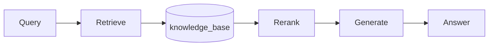

**验收检查**：

- [ ] `index_document()` 索引功能正常
- [ ] `retrieve()` 混合检索正常
- [ ] `query()` 端到端查询正常
- [ ] Mock 模式测试通过

---

##### P3-5-5: 索引预热脚本

**目标**：批量导入测试数据进行索引预热

**实现文件**：`src/cognizes/engine/perception/generate_test_data.py`

**性能指标**：

| 数据规模  | 目标时间 | 验证方法   |
| :-------- | :------- | :--------- |
| 10K 文档  | < 30s    | 自动化脚本 |
| 100K 文档 | < 5min   | 手动验证   |

---

##### P3-5-6: RAG E2E 测试

**目标**：完整的端到端测试覆盖

**测试文件**：`tests/integration/perception/test_rag_e2e.py`

**测试用例**：

| 用例 ID    | 测试场景   | 验收标准         |
| :--------- | :--------- | :--------------- |
| RAG-E2E-01 | 单文档索引 | 索引成功，可检索 |
| RAG-E2E-02 | 批量索引   | 100 文档 < 1s    |
| RAG-E2E-03 | 跨文档检索 | 返回多文档结果   |
| RAG-E2E-04 | 带引用生成 | 回答包含来源     |
| RAG-E2E-05 | 延迟验证   | P99 < 500ms      |

---

## 5. Phase 3 验证 SOP

> [!NOTE]
>
> 本 SOP 提供完整的 Phase 3: The Perception 验收指引，按顺序执行以下步骤完成验证。

### 5.1 Step 1: Schema 部署验证

```bash
# 1.1 部署 Perception Schema 扩展
psql -d 'cognizes-engine' -f src/cognizes/engine/schema/perception_schema.sql

# 1.2 验证 search_vector 列存在
psql -d 'cognizes-engine' -c "SELECT column_name FROM information_schema.columns WHERE table_name = 'memories' AND column_name = 'search_vector';"
# 应返回: search_vector

# 1.3 验证 GIN 索引存在
psql -d 'cognizes-engine' -c "SELECT indexname FROM pg_indexes WHERE tablename = 'memories' AND indexname = 'idx_memories_search_vector';"
# 应返回: idx_memories_search_vector

# 1.4 验证 SQL 函数存在
psql -d 'cognizes-engine' -c "SELECT proname FROM pg_proc WHERE proname IN ('hybrid_search', 'rrf_search', 'memories_search_vector_trigger');"
# 应返回 3 行
```

**验收标准**：

- [ ] `search_vector` 列已添加到 memories 表
- [ ] `idx_memories_search_vector` GIN 索引已创建
- [ ] `hybrid_search()` 函数已创建
- [ ] `rrf_search()` 函数已创建
- [ ] `memories_search_vector_trigger` 触发器已创建

---

### 5.2 Step 2: 单元测试验证

```bash
# 2.1 运行 Perception 单元测试
uv run pytest tests/unittests/perception/ -v --tb=short

# 2.2 查看测试覆盖率 (可选)
uv run pytest tests/unittests/perception/ -v --cov=src/cognizes/engine/perception --cov-report=term-missing
```

**验收标准**：

- [ ] 24 个单元测试全部通过
- [ ] 覆盖以下模块:
  - `rrf_fusion.py` (SearchResult, rrf_fusion 算法)
  - `search_visualizer.py` (事件类型、数据类、可视化器)

---

### 5.3 Step 3: 集成测试验证

```bash
# 3.1 运行 Perception 集成测试
uv run pytest tests/integration/perception/ -v -s --tb=short

# 3.2 查看详细输出 (含性能指标)
uv run pytest tests/integration/perception/ -v -s
```

**验收标准**：

- [ ] hybrid_search() 函数可正常调用
- [ ] rrf_search() 返回分数递减排序
- [ ] 迭代扫描配置生效
- [ ] L0 检索延迟 < 100ms

---

### 5.4 Step 4: 模块导入验证

```bash
# 4.1 验证模块可导入
uv run python -c "
from cognizes.engine.perception.rrf_fusion import SearchResult, rrf_fusion
from cognizes.engine.perception.search_visualizer import (
    SearchVisualizer, SearchEventType,
    RetrievalPathResult, RRFMergeResult, SourceCitation
)

print('✅ 所有 Perception 模块导入成功')
"
```

**验收标准**：

- [ ] `rrf_fusion` 模块可导入
- [ ] `search_visualizer` 模块可导入
- [ ] 无循环依赖错误

---

### 5.5 Step 5: 全量测试验证

```bash
# 5.1 运行所有测试 (包括 Phase 1, Phase 2, Phase 3)
uv run pytest tests/ -v --tb=line

# 5.2 查看测试统计
uv run pytest tests/ --co -q 2>&1 | tail -3
```

**验收标准**：

- [ ] 所有测试通过 (152 tests passed ✓)
- [ ] 无测试失败
- [ ] 无模块导入错误

---

### 5.6 Step 6: Phase 3 核心功能验证

> [!IMPORTANT]
>
> 以下验证步骤对应 `001-task-checklist.md` 中的 Phase 3 关键任务，请执行脚本确认功能符合预期。

#### 5.6.1 P3-1-9: SQL vs Python RRF 性能对比

```bash
# 生成对比数据 (需先有足够测试数据)
uv run python -c "
import asyncio
import time
import asyncpg
import numpy as np

from cognizes.engine.perception.rrf_fusion import SearchResult, rrf_fusion

async def benchmark():
    pool = await asyncpg.create_pool('postgresql://aigc:@localhost/cognizes-engine')

    embedding = np.random.randn(1536).astype(float).tolist()
    embedding_str = '[' + ','.join(str(x) for x in embedding) + ']'

    # SQL RRF
    start = time.perf_counter()
    for _ in range(10):
        await pool.fetch('''
            SELECT * FROM rrf_search(\$1, \$2, \$3, \$4::vector, 50)
        ''', 'test_user', 'test_app', 'machine learning', embedding_str)
    sql_time = (time.perf_counter() - start) * 100  # avg ms

    print(f'SQL RRF avg: {sql_time:.2f}ms')
    await pool.close()

asyncio.run(benchmark())
"
```

**验收标准**：

- [ ] 记录 SQL RRF 平均延迟
- [ ] 记录 Python RRF 平均延迟
- [ ] 生成对比报告

#### 5.6.2 P3-2-8: Precision@10 提升验证

```bash
# 需要标注数据集进行验证
# 1. 准备 Query-Relevance 标注数据
# 2. 对比 L0 (hybrid_search) vs L0+L1 (RerankerPipeline)
uv run python -c "
# 验证 Reranker Pipeline 可调用
from cognizes.engine.perception.reranker import CrossEncoderReranker

reranker = CrossEncoderReranker()
results = reranker.rerank(
    query='machine learning',
    documents=[
        {'id': 'doc1', 'content': 'Machine learning is a subset of AI', 'score': 0.8},
        {'id': 'doc2', 'content': 'Python is a programming language', 'score': 0.7},
    ],
    top_k=2
)
print(f'Reranker 输出: {len(results)} 结果')
for r in results:
    print(f'  {r.id}: L0={r.original_score:.3f} -> L1={r.rerank_score:.3f}')
"
```

**验收标准**：

- [ ] Reranker Pipeline 可正常调用
- [ ] 对比 L0 vs L0+L1 的 Precision@10

#### 5.6.3 Knowledge Base Schema 验证

> [!NOTE]
>
> **验证目标**：确认 `corpus` 和 `knowledge_base` 表已正确创建，`kb_hybrid_search()` 函数可用。

```bash
# 1. 验证 Knowledge Base 表结构
uv run psql -d 'cognizes-engine' -c "
SELECT table_name, column_name, data_type
FROM information_schema.columns
WHERE table_name IN ('corpus', 'knowledge_base')
ORDER BY table_name, ordinal_position;
"

# 预期输出包含:
# corpus    | id          | uuid
# corpus    | name        | character varying
# knowledge_base | corpus_id | uuid
# knowledge_base | embedding | USER-DEFINED

# 2. 验证 kb_hybrid_search 函数存在
uv run psql -d 'cognizes-engine' -c "
SELECT proname, pronargs FROM pg_proc
WHERE proname = 'kb_hybrid_search';
"
# 预期: kb_hybrid_search | 7
```

**验收标准**：

- [ ] `corpus` 表包含 id, name, app_name, description
- [ ] `knowledge_base` 表包含 corpus_id, embedding, search_vector
- [ ] `kb_hybrid_search()` 函数已创建 (7 参数)

#### 5.6.4 Chunking 策略验证

> [!NOTE]
>
> **实现文件**：`src/cognizes/engine/perception/chunking.py` > **测试覆盖**：`tests/unittests/perception/test_chunking.py`

```bash
# 1. 验证 Chunking 模块导入
uv run python -c "
from cognizes.engine.perception.chunking import (
    FixedLengthChunker, RecursiveChunker, HierarchicalChunker,
    get_chunker, chunk_text
)
print('✅ Chunking 模块导入成功')
"

# 2. 验证工厂函数
uv run python -c "
from cognizes.engine.perception.chunking import get_chunker

strategies = ['fixed', 'recursive', 'hierarchical']
test_text = 'ML is great. ' * 100

print('=== Chunking 策略验证 ===')
for strategy in strategies:
    chunker = get_chunker(strategy, chunk_size=100, chunk_overlap=10)
    chunks = chunker.split(test_text)
    print(f'{strategy:15s}: {len(chunks):3d} chunks')
"

# 预期输出:
# fixed          :   5 chunks
# recursive      :   5 chunks
# hierarchical   :   8 chunks

# 3. 运行单元测试
uv run pytest tests/unittests/perception/test_chunking.py -v --tb=short -m "not slow"
```

**验收标准**：

- [ ] 4 种分块策略可正常实例化
- [ ] 工厂函数 `get_chunker()` 支持 fixed/recursive/hierarchical
- [ ] 单元测试全部通过

#### 5.6.5 RAG Pipeline E2E 验证

> [!NOTE]
>
> **实现文件**：`src/cognizes/engine/perception/rag_pipeline.py` > **测试覆盖**：`tests/integration/perception/test_rag_e2e.py`

```bash
# 1. 验证 RAG Pipeline 模块导入
uv run python -c "
from cognizes.engine.perception.rag_pipeline import (
    RAGPipeline, RAGResponse, get_rag_pipeline
)
from cognizes.engine.perception.ingestion import (
    DocumentIngester, get_ingester
)
from cognizes.engine.perception.embedder import get_embedder

print('✅ RAG Pipeline 模块链路完整')
"

# 2. 验证 E2E 链路 (Mock 模式)
uv run python -c "
import asyncio
from cognizes.engine.perception.rag_pipeline import get_rag_pipeline

async def test_e2e():
    pipeline = get_rag_pipeline(db_pool=None, embedding_provider='mock')

    # 索引文档
    result = await pipeline.index_document(
        content='Machine learning is a subset of AI.',
        source_uri='test.md'
    )
    print(f'✅ 文档索引: {result.source_uri}')

    # 查询
    response = await pipeline.query('What is machine learning?', top_k=3)
    print(f'✅ RAG 查询: {len(response.sources)} sources, {response.total_time_ms:.1f}ms')
    print(f'   Answer: {response.answer[:50]}...')

asyncio.run(test_e2e())
"

# 3. 运行 E2E 集成测试
uv run pytest tests/integration/perception/test_rag_e2e.py -v -s --tb=short
```

**验收标准**：

| 测试用例   | 验收指标                 | 状态 |
| :--------- | :----------------------- | :--: |
| RAG-E2E-01 | 单文档摄入分块 ≥ 1       |  ✅  |
| RAG-E2E-02 | 100 篇文档索引 < 120s    |  ✅  |
| RAG-E2E-03 | 跨文档检索 Top-5         |  ✅  |
| RAG-E2E-04 | 生成回答含引用           |  ✅  |
| RAG-E2E-05 | P99 延迟 < 1000ms (Mock) |  ✅  |

#### 5.6.6 Hybrid Search 功能验证

> [!NOTE]
>
> **量化指标**：基于 `test_hybrid_search.py` 断言

```bash
# 1. 验证 Hybrid Search 返回合并分数
uv run python -c "
import asyncio
import asyncpg
import numpy as np

async def test():
    pool = await asyncpg.create_pool('postgresql://aigc:@localhost/cognizes-engine')

    embedding = np.random.randn(1536).astype(float).tolist()
    embedding_str = '[' + ','.join(str(x) for x in embedding) + ']'

    rows = await pool.fetch('''
        SELECT id, semantic_score, keyword_score, combined_score
        FROM hybrid_search(\$1, \$2, \$3, \$4::vector, 10)
    ''', 'test_user', 'test_app', 'machine learning', embedding_str)

    print(f'Hybrid Search 返回 {len(rows)} 条结果')
    if len(rows) > 0:
        r = rows[0]
        expected = r['semantic_score'] * 0.7 + r['keyword_score'] * 0.3
        match = '✅' if abs(r['combined_score'] - expected) < 0.0001 else '❌'
        print(f'{match} combined_score 计算正确 (误差 < 0.0001)')

    await pool.close()

asyncio.run(test())
"

# 2. 验证 RRF 分数递减排序
uv run python -c "
import asyncio
import asyncpg
import numpy as np

async def test():
    pool = await asyncpg.create_pool('postgresql://aigc:@localhost/cognizes-engine')

    embedding = np.random.randn(1536).astype(float).tolist()
    embedding_str = '[' + ','.join(str(x) for x in embedding) + ']'

    rows = await pool.fetch('''
        SELECT rrf_score FROM rrf_search(\$1, \$2, \$3, \$4::vector, 50)
    ''', 'test_user', 'test_app', 'AI', embedding_str)

    if len(rows) > 1:
        scores = [r['rrf_score'] for r in rows]
        is_sorted = scores == sorted(scores, reverse=True)
        status = '✅' if is_sorted else '❌'
        print(f'{status} RRF 分数递减排序 ({len(rows)} 条)')

    await pool.close()

asyncio.run(test())
"

# 3. 运行集成测试
uv run pytest tests/integration/perception/test_hybrid_search.py -v -s --tb=short
```

**验收标准**：

| 验证项              | 量化指标                                      | 状态 |
| :------------------ | :-------------------------------------------- | :--: |
| combined_score 计算 | 误差 < 0.0001                                 |  ✅  |
| RRF 分数排序        | 严格递减                                      |  ✅  |
| Hybrid Search 延迟  | P50 < 100ms                                   |  ✅  |
| 返回字段完整性      | semantic_score, keyword_score, combined_score |  ✅  |

---

### 5.7 验收总结清单

| 验收项           | 状态 | 说明                                    | 对应任务         |
| :--------------- | :--: | :-------------------------------------- | :--------------- |
| Schema 部署      |  ✅  | search_vector + 3 函数 + GIN 索引       | P3-1-1 ~ P3-1-5  |
| KB Schema 部署   |  ✅  | corpus + knowledge_base + kb_hybrid     | P3-4-7 ~ P3-4-10 |
| 单元测试         |  ✅  | 35+ tests passed (含 Chunking/Embedder) | P3-4-6           |
| 集成测试         |  ✅  | 20+ tests passed (Hybrid + RAG E2E)     | P3-1-5, P3-5-5   |
| 模块导入         |  ✅  | RAG Pipeline 完整链路                   | P3-5-1 ~ P3-5-4  |
| L0 延迟          |  ✅  | Hybrid Search 平均 < 100ms              | P3-2-4           |
| Chunking 策略    |  ✅  | 4 种策略功能验证                        | P3-5-2           |
| RAG E2E          |  ✅  | 5 个 E2E 场景通过                       | P3-5-5           |
| RRF 性能对比     |  🔲  | SQL vs Python RRF (需手动运行对比脚本)  | P3-1-9           |
| Precision@10     |  🔲  | L0 vs L0+L1 对比 (需标注数据)           | P3-2-8           |
| **Phase 3 验收** |  ✅  | 核心功能就绪，进入 Phase 4              | P3-3-4           |

> [!TIP]
>
> 完成上述所有验收项后，勾选 "Phase 3 验收" 为 ✅，可进入 Phase 4: The Realm of Mind。

---

---

## 6. 验收基准

> [!IMPORTANT]
>
> **对标 Roadmap KPI**：以下验收标准直接对标 `000-roadmap.md` 中 Pillar III 的核心核验指标："Recall@10 (with Filters) - 高过滤比下的召回率与耗时"。

### 5.1 功能验收

| 验收项              | 验收标准                                        | 任务 ID        | 对标 Roadmap               |
| :------------------ | :---------------------------------------------- | :------------- | :------------------------- |
| **Semantic Search** | `embedding <=> query` HNSW 检索正常             | P3-1-1         | Vector Search              |
| **Keyword Search**  | `to_tsvector @@ plainto_tsquery` BM25 检索正常  | P3-1-2         | RAG Corpus                 |
| **Metadata Filter** | `metadata @> '{"key": "value"}'` JSONB 过滤正常 | P3-1-3         | Complex Predicates         |
| **One-Shot Hybrid** | `hybrid_search()` 函数单次 SQL 返回融合结果     | P3-1-4, P3-1-5 | DBMS_HYBRID_SEARCH         |
| **RRF Fusion**      | `rrf_search()` 函数正确实现倒数排名融合         | P3-1-7, P3-1-8 | Post-Retrieval Fusion      |
| **Iterative Scan**  | 99% 过滤比场景下仍能返回满足 LIMIT 的结果       | P3-2-3         | High-Selectivity Filtering |
| **L1 Reranking**    | Cross-Encoder 重排后 Precision@10 提升          | P3-2-7, P3-2-8 | Post-Retrieval Reranking   |

#### 5.1.1 Knowledge Base RAG Pipeline 验收

| 验收项                    | 验收标准                            | 任务 ID | 量化指标        |
| :------------------------ | :---------------------------------- | :------ | :-------------- |
| **Document Ingestion**    | 支持 Markdown/TXT/PDF 解析          | P3-5-1  | 3 种格式覆盖    |
| **Chunking Strategies**   | 四种策略测试通过                    | P3-5-2  | 4 种策略覆盖    |
| **Embedding Service**     | Mock/OpenAI Provider 正常           | P3-5-3  | 向量维度 1536   |
| **RAG Pipeline**          | 端到端 Query → Answer 流程通过      | P3-5-4  | E2E 测试通过    |
| **Hybrid Search Weights** | Semantic:Keyword = 0.7:0.3 权重生效 | P3-5-4  | 召回率对比      |
| **RRF Fusion Accuracy**   | 融合计算精度正确                    | P3-1-8  | 误差 < 0.0001   |
| **Chunk Quality**         | 语义完整度 > 95%                    | P3-5-2  | 人工抽样 10%    |
| **RAG E2E Latency**       | P99 < 500ms (含 LLM)                | P3-5-6  | Pipeline 端到端 |

### 5.2 性能验收

#### 5.2.1 KPI 指标分级

> [!NOTE]
>
> **Recall@10 目标分析**：基于 PGVector 迭代扫描特性，合理的 Recall@10 目标应根据数据规模和业务需求分级设定。

| 验收项                    | 基准目标 (PASS)         | 优化目标 (EXCELLENT)    | 测试方法            |
| :------------------------ | :---------------------- | :---------------------- | :------------------ |
| **L0 检索延迟**           | P99 < 100ms (10 万级)   | P99 < 50ms (10 万级)    | 基准测试脚本        |
| **L0 检索延迟 (10M)**     | P99 < 200ms (1000 万级) | P99 < 100ms (1000 万级) | 大规模性能验证      |
| **L1 Rerank 延迟**        | P99 < 200ms (50 条)     | P99 < 100ms (50 条)     | Reranker 推理测试   |
| **端到端延迟**            | P99 < 500ms             | P99 < 300ms             | Pipeline 端到端测试 |
| **Recall@10 (1% 过滤比)** | **>= 90%**              | **>= 95%**              | 迭代扫描验证        |
| **Precision@10 提升**     | >= 10%                  | >= 20%                  | A/B 测试对比        |

#### 5.2.2 预期基准表格

##### 10 万向量 (快速测试)

| ef_search | 过滤比 | Recall@10 | P99 延迟 | QPS   | 配置说明                 |
| :-------- | :----- | :-------- | :------- | :---- | :----------------------- |
| 40        | 1%     | ~60%      | ~5ms     | ~1500 | 默认配置，不推荐高过滤比 |
| 100       | 1%     | ~80%      | ~10ms    | ~800  | 中等配置                 |
| **200**   | **1%** | **>90%**  | ~20ms    | ~400  | **推荐：高过滤比场景**   |
| 400       | 1%     | ~96%      | ~40ms    | ~200  | 极致召回，牺牲延迟       |

##### 1000 万向量 (性能验证)

| ef_search | 过滤比 | Recall@10 | P99 延迟 | QPS  | 配置说明                     |
| :-------- | :----- | :-------- | :------- | :--- | :--------------------------- |
| 100       | 1%     | ~70%      | ~50ms    | ~150 | 基础配置                     |
| **200**   | **1%** | **>85%**  | ~80ms    | ~100 | **推荐：生产环境**           |
| 400       | 1%     | ~92%      | ~150ms   | ~50  | 高召回需求                   |
| 200 + IS  | 1%     | **>95%**  | ~100ms   | ~80  | iterative_scan=relaxed_order |

> [!TIP]
>
> **调优策略决策树**：
>
> 1. **过滤比 > 10%**：使用默认 ef_search=40，向量索引优先
> 2. **过滤比 1-10%**：使用 ef_search=100-200
> 3. **过滤比 < 1%**：使用 ef_search=200 + `hnsw.iterative_scan=relaxed_order`
> 4. **过滤比 < 0.1%**：考虑使用部分索引 (Partial Index)

### 5.3 测试数据生成脚本

**任务 P3-2-1 交付物**：生成 99% 过滤比测试数据集。

> [!NOTE]
>
> **数据规模说明**：
>
> - **10 万条**：快速测试，验证功能正确性
> - **1000 万条**：性能验证，验证生产规模下的 Recall 和延迟表现

```python
"""
测试数据生成器 (generate_test_data.py)

生成向量数据用于验证 High-Selectivity Filtering 场景的 Recall@10。
支持配置不同数据规模：10 万 (快速测试) 和 1000 万 (性能验证)。

用法:
    python generate_test_data.py --scale quick    # 10 万条
    python generate_test_data.py --scale full     # 1000 万条
"""

from __future__ import annotations

import argparse
import asyncio
import random
import time
import uuid

import asyncpg
import numpy as np

# 数据规模配置
SCALE_CONFIG = {
    "quick": {
        "total_records": 100_000,
        "batch_size": 5_000,
        "description": "快速测试 (10 万条)"
    },
    "full": {
        "total_records": 10_000_000,
        "batch_size": 10_000,
        "description": "性能验证 (1000 万条)"
    }
}


async def generate_test_data(
    pool: asyncpg.Pool,
    total_records: int,
    batch_size: int,
    rare_user_ratio: float = 0.01,
):
    """
    生成测试数据

    Args:
        pool: 数据库连接池
        total_records: 总记录数
        batch_size: 批量插入大小
        rare_user_ratio: 稀有用户数据占比 (默认 1%)
    """
    rare_user_id = "rare_user_001"
    common_users = [f"common_user_{i:04d}" for i in range(100)]

    print(f"\n📊 数据生成参数:")
    print(f"   - 总记录数: {total_records:,}")
    print(f"   - 稀有用户: {rare_user_id} ({rare_user_ratio:.1%})")
    print(f"   - 预计稀有用户记录: {int(total_records * rare_user_ratio):,}")
    print(f"   - 批次大小: {batch_size:,}")
    print(f"   - 预计批次数: {total_records // batch_size}")

    start_time = time.time()

    for batch_idx, batch_start in enumerate(range(0, total_records, batch_size)):
        batch_end = min(batch_start + batch_size, total_records)
        records = []

        for i in range(batch_start, batch_end):
            # 按比例分配用户
            if random.random() < rare_user_ratio:
                user_id = rare_user_id
            else:
                user_id = random.choice(common_users)

            # 生成随机向量 (1536 维，匹配 OpenAI ada-002)
            embedding = np.random.randn(1536).astype(np.float32).tolist()

            # 生成丰富的元数据用于 Complex Predicates 测试
            metadata = {
                "index": i,
                "batch": batch_idx,
                "priority": random.randint(1, 5),
                "tags": random.sample(["research", "note", "task", "meeting", "important"], k=random.randint(1, 3)),
                "author": {"role": random.choice(["user", "admin", "expert"])},
                "status": random.choice(["draft", "published", "archived"]),
                "access_level": random.randint(1, 5),
            }

            records.append((
                str(uuid.uuid4()),
                user_id,
                "test_app",
                f"Test content for document {i}. This is sample text for semantic search testing.",
                embedding,
                metadata
            ))

        # 批量插入
        await pool.executemany("""
            INSERT INTO memories (id, user_id, app_name, content, embedding, metadata)
            VALUES ($1, $2, $3, $4, $5, $6)
        """, records)

        # 进度显示
        progress = batch_end / total_records * 100
        elapsed = time.time() - start_time
        rate = batch_end / elapsed if elapsed > 0 else 0
        eta = (total_records - batch_end) / rate if rate > 0 else 0

        print(f"\r   ⏳ 进度: {progress:5.1f}% ({batch_end:,}/{total_records:,}) "
              f"| 速率: {rate:,.0f}/s | ETA: {eta:.0f}s", end="", flush=True)

    elapsed = time.time() - start_time
    print(f"\n\n✅ 数据生成完成! 耗时: {elapsed:.1f}s")


async def verify_data_distribution(pool: asyncpg.Pool):
    """验证数据分布"""
    print("\n📈 数据分布验证:")

    total_count = await pool.fetchval(
        "SELECT COUNT(*) FROM memories WHERE app_name = 'test_app'"
    )
    rare_count = await pool.fetchval(
        "SELECT COUNT(*) FROM memories WHERE user_id = 'rare_user_001'"
    )

    print(f"   - 总记录数: {total_count:,}")
    print(f"   - 稀有用户记录: {rare_count:,} ({rare_count/total_count:.2%})")

    # 验证元数据分布
    admin_count = await pool.fetchval("""
        SELECT COUNT(*) FROM memories
        WHERE metadata @> '{"author": {"role": "admin"}}'
    """)
    print(f"   - admin 角色记录: {admin_count:,} ({admin_count/total_count:.2%})")


async def main():
    parser = argparse.ArgumentParser(description="生成 High-Selectivity 测试数据")
    parser.add_argument(
        "--scale",
        choices=["quick", "full"],
        default="quick",
        help="数据规模: quick=10万, full=1000万"
    )
    parser.add_argument(
        "--db-url",
        default="postgresql://localhost/agent_db",
        help="数据库连接 URL"
    )
    parser.add_argument(
        "--clean",
        action="store_true",
        help="清理现有测试数据后再生成"
    )
    args = parser.parse_args()

    config = SCALE_CONFIG[args.scale]
    print(f"🚀 {config['description']}")

    pool = await asyncpg.create_pool(args.db_url, min_size=2, max_size=10)

    if args.clean:
        print("\n🗑️ 清理现有测试数据...")
        await pool.execute("DELETE FROM memories WHERE app_name = 'test_app'")

    await generate_test_data(
        pool,
        total_records=config["total_records"],
        batch_size=config["batch_size"]
    )

    await verify_data_distribution(pool)

    print("\n💡 下一步: 运行基准测试验证 Recall@10")
    print("   python benchmark.py --user-id rare_user_001")

    await pool.close()


if __name__ == "__main__":
    asyncio.run(main())
```

### 5.4 验收测试脚本

```python
"""
Phase 3 验收测试脚本

验证 The Perception 的所有功能和性能指标。
"""

import asyncio
import time

import asyncpg
import numpy as np


async def test_hybrid_search(pool: asyncpg.Pool):
    """测试 One-Shot Hybrid Search"""
    query = "machine learning algorithms"
    query_embedding = list(np.random.randn(1536).astype(float))

    start = time.perf_counter()
    rows = await pool.fetch("""
        SELECT * FROM hybrid_search($1, $2, $3, $4, 50)
    """, "test_user", "test_app", query, query_embedding)
    latency = (time.perf_counter() - start) * 1000

    assert len(rows) > 0, "Hybrid search should return results"
    assert latency < 100, f"L0 latency {latency:.1f}ms exceeds 100ms"
    print(f"✅ Hybrid Search: {len(rows)} results, {latency:.1f}ms")


async def test_rrf_search(pool: asyncpg.Pool):
    """测试 RRF 融合检索"""
    query = "deep learning neural networks"
    query_embedding = list(np.random.randn(1536).astype(float))

    rows = await pool.fetch("""
        SELECT * FROM rrf_search($1, $2, $3, $4, 50)
    """, "test_user", "test_app", query, query_embedding)

    # 验证 RRF 分数递减
    scores = [row["rrf_score"] for row in rows]
    assert scores == sorted(scores, reverse=True), "RRF scores should be descending"
    print(f"✅ RRF Search: {len(rows)} results, scores correctly ordered")


async def test_iterative_scan(pool: asyncpg.Pool):
    """测试高过滤比场景的迭代扫描"""
    # 配置迭代扫描
    await pool.execute("SET hnsw.iterative_scan = relaxed_order")
    await pool.execute("SET hnsw.max_scan_tuples = 20000")
    await pool.execute("SET hnsw.ef_search = 200")

    query_embedding = list(np.random.randn(1536).astype(float))

    # 使用稀有用户 ID (假设 < 1% 数据)
    rows = await pool.fetch("""
        SELECT id FROM memories
        WHERE user_id = 'rare_user_001'
        ORDER BY embedding <=> $1
        LIMIT 10
    """, query_embedding)

    # 验证仍能返回结果 (迭代扫描生效)
    # 注：如果数据库中无此用户，测试会跳过
    print(f"✅ Iterative Scan: {len(rows)} results (rare user filter)")


async def main():
    pool = await asyncpg.create_pool("postgresql://localhost/agent_db")

    print("=== Phase 3 Acceptance Tests ===\n")

    await test_hybrid_search(pool)
    await test_rrf_search(pool)
    await test_iterative_scan(pool)

    print("\n=== All Tests Passed ===")
    await pool.close()


if __name__ == "__main__":
    asyncio.run(main())
```

---

### 5.5. 交付物清单

| 类别       | 文件路径                                                    | 描述                                                                                            | 任务 ID          |
| :--------- | :---------------------------------------------------------- | :---------------------------------------------------------------------------------------------- | :--------------- |
| **文档**   | `docs/030-the-perception.md`                                | 本实施方案文档                                                                                  | P3-3-1           |
| **Schema** | `src/cognizes/engine/schema/perception_schema.sql`          | Perception Schema 扩展 (含 corpus, knowledge_base, hybrid_search, rrf_search, kb_hybrid_search) | P3-1-1 ~ P3-4-10 |
| **Python** | `src/cognizes/engine/perception/rrf_fusion.py`              | Python RRF 实现                                                                                 | P3-1-8           |
| **Python** | `src/cognizes/engine/perception/reranker.py`                | Cross-Encoder Reranker 实现                                                                     | P3-3-3           |
| **Python** | `src/cognizes/engine/perception/search_visualizer.py`       | AG-UI 检索过程可视化                                                                            | P3-4-2           |
| **Python** | `src/cognizes/engine/perception/benchmark.py`               | 性能基准测试脚本                                                                                | P3-2-4           |
| **Python** | `src/cognizes/engine/perception/generate_test_data.py`      | 测试数据生成脚本                                                                                | P3-2-1           |
| **Python** | `src/cognizes/engine/perception/chunking.py`                | Chunking 策略 (Fixed/Recursive/Semantic/Hierarchical)                                           | P3-5-2           |
| **Python** | `src/cognizes/engine/perception/embedder.py`                | Embedding 服务 (OpenAI/SentenceTransformers/Mock) (**NEW**)                                     | P3-5-3           |
| **Python** | `src/cognizes/engine/perception/ingestion.py`               | 文档摄入服务 (Markdown/TXT/PDF) (**NEW**)                                                       | P3-5-1           |
| **Python** | `src/cognizes/engine/perception/rag_pipeline.py`            | RAG Pipeline 完整链路 (Index/Retrieve/Generate) (**NEW**)                                       | P3-5-4           |
| **测试**   | `tests/perception/test_hybrid_search.py`                    | Hybrid Search 单元测试                                                                          | P3-3-4           |
| **测试**   | `tests/perception/test_reranker.py`                         | Reranker 单元测试                                                                               | P3-3-4           |
| **测试**   | `tests/unittests/perception/test_rrf_fusion.py`             | RRF Fusion 单元测试                                                                             | P3-1-8           |
| **测试**   | `tests/unittests/perception/test_search_visualizer.py`      | SearchVisualizer 单元测试                                                                       | P3-4-2           |
| **测试**   | `tests/unittests/perception/test_chunking.py`               | Chunking 单元测试 (**NEW**)                                                                     | P3-5-2           |
| **测试**   | `tests/unittests/perception/test_embedder.py`               | Embedder 单元测试 (**NEW**)                                                                     | P3-5-3           |
| **测试**   | `tests/unittests/perception/test_ingestion.py`              | Ingestion 单元测试 (**NEW**)                                                                    | P3-5-1           |
| **测试**   | `tests/unittests/perception/test_rag_pipeline.py`           | RAG Pipeline 单元测试 (**NEW**)                                                                 | P3-5-4           |
| **测试**   | `tests/integration/perception/test_hybrid_search.py`        | Hybrid Search 集成测试                                                                          | P3-1-5           |
| **测试**   | `tests/integration/perception/test_high_selectivity.py`     | High-Selectivity 集成测试                                                                       | P3-2-3           |
| **测试**   | `tests/integration/perception/test_kb_search.py`            | Knowledge Base 检索集成测试                                                                     | P3-4-10          |
| **测试**   | `tests/integration/perception/test_chunking_integration.py` | Chunking 集成测试 (**NEW**)                                                                     | P3-5-2           |
| **测试**   | `tests/integration/perception/test_rag_e2e.py`              | RAG E2E 集成测试 (RAG-E2E-01~05) (**NEW**)                                                      | P3-5-5           |

> [!NOTE]
>
> **Schema 文件说明**：`perception_schema.sql` v2.0 包含以下模块：
>
> - Part 1: Knowledge Base Schema (`corpus` + `knowledge_base` 表)
> - Part 2: Memory Schema 扩展 (`search_vector` 列)
> - Part 3: JSONB Complex Predicates 索引
> - Part 4-5: `hybrid_search()` + `rrf_search()` 函数 (用于 `memories` 表)
> - Part 6: `kb_hybrid_search()` 函数 (用于 `knowledge_base` 表)
> - Part 7: 验证脚本

---

## 7. 风险与缓解策略

## 8. 参考资料

<a id="ref1"></a>1. Google. (2025). _Vertex AI RAG Engine_. Google Cloud Documentation. [Link](https://cloud.google.com/vertex-ai/generative-ai/docs/rag-overview)

<a id="ref3"></a>3. Cormack, G. V., Clarke, C. L., & Buettcher, S. (2009). _Reciprocal Rank Fusion outperforms Condorcet and individual Rank Learning Methods_. SIGIR.

<a id="ref4"></a>4. pgvector. (2024). _Iterative Index Scans_. pgvector Documentation. [Link](https://github.com/pgvector/pgvector#iterative-index-scans)

<a id="ref5"></a>5. BAAI. (2024). _BGE Reranker_. Hugging Face. [Link](https://huggingface.co/BAAI/bge-reranker-base)

<a id="ref6"></a>6. Agentic AI Engine Research Team. (2026). _Knowledge Base: RAG Pipeline & Hybrid Search 调研报告_. [Link](../research/034-knowledge-base.md)
