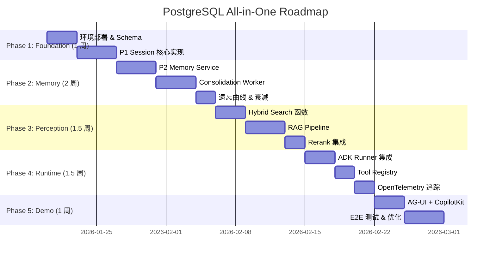

## 1. 具体事项对比

### 1.1 PostgreSQL All-in-One 方案

**核心技术栈**：PostgreSQL 16+ + PGVector + PostGIS + pg_cron

| 阶段               | 工作事项               | 技术细节                                          |  人天估算   |
| :----------------- | :--------------------- | :------------------------------------------------ | :---------: |
| **基础设施**       | RDS 实例配置           | 复用现有 PostgreSQL RDS，仅需开启 pgvector 扩展   |     0.5     |
|                    | Schema 设计            | 统一 `threads/events/memories/knowledge` 四表结构 |      2      |
|                    | 索引优化               | HNSW 索引 + GIN 全文索引 + JSONB 索引             |      1      |
| **P1: Session**    | PostgresSessionService | 实现 ADK `BaseSessionService` 接口                |      3      |
|                    | 乐观锁 + LISTEN/NOTIFY | 并发控制与实时推送                                |      2      |
| **P2: Memory**     | PostgresMemoryService  | 实现 ADK `BaseMemoryService` 接口                 |      3      |
|                    | Consolidation Worker   | pg_cron 定时任务 + LLM 萃取 Facts                 |      3      |
|                    | Ebbinghaus Decay       | 记忆衰减与清理逻辑                                |      1      |
| **P3: Perception** | hybrid_search() 函数   | RRF 融合检索 (Semantic + Keyword + Metadata)      |      2      |
|                    | 两阶段 Rerank          | Cross-Encoder 精排集成                            |      2      |
|                    | RAG Pipeline           | Chunking + Embedding + Ingestion                  |      3      |
| **P4: Runtime**    | ADK Runner 集成        | OpenTelemetry 追踪 + Langfuse 可视化              |      2      |
|                    | ToolRegistry           | 动态工具注册表                                    |      2      |
|                    | Sandbox                | Microsandbox 代码执行环境                         |      2      |
| **集成测试**       | E2E 验证               | 全链路功能验证 + 性能压测                         |      3      |
| **前端**           | AG-UI + CopilotKit     | 标准化 Agent-UI 协议集成                          |      3      |
| **总计**           |                        |                                                   | **34 人天** |

---

### 1.2 Weaviate 方案

**核心技术栈**：Weaviate Cloud/Self-hosted + PostgreSQL (Session Only)

| 阶段               | 工作事项               | 技术细节                              |  人天估算   |
| :----------------- | :--------------------- | :------------------------------------ | :---------: |
| **基础设施**       | Weaviate 集群部署      | Docker Compose 或 Weaviate Cloud 配置 |      2      |
|                    | PostgreSQL 会话存储    | 仅用于 Session/State 管理             |      1      |
|                    | 双数据源配置           | 连接管理 + 故障切换逻辑               |      1      |
| **P1: Session**    | PostgresSessionService | 与 PG 方案一致                        |      3      |
|                    | 实时推送               | 仍需依赖 PG LISTEN/NOTIFY             |      2      |
| **P2: Memory**     | WeaviateMemoryService  | 实现新的 Memory Adapter (非 ADK 原生) |      5      |
|                    | Schema 设计            | Weaviate Collection + Cross-Reference |      2      |
|                    | Consolidation Worker   | 需处理跨数据源事务一致性              |      4      |
| **P3: Perception** | Hybrid Search          | Weaviate 原生 BM25 + Vector           |      2      |
|                    | 两阶段 Rerank          | 外部 Reranker 集成                    |      2      |
|                    | RAG Pipeline           | Chunking + 批量导入 Weaviate          |      4      |
| **P4: Runtime**    | ADK Runner 集成        | 需额外开发 Weaviate Adapter           |      3      |
|                    | ToolRegistry           | 可复用 PG 方案                        |      2      |
| **数据同步**       | PG ↔ Weaviate 同步     | ETL Pipeline + 一致性保障             |      5      |
| **集成测试**       | E2E 验证               | 跨系统功能验证 + 性能压测             |      4      |
| **前端**           | AG-UI + CopilotKit     | 与 PG 方案一致                        |      3      |
| **运维手册**       | Weaviate 运维文档      | 备份恢复、监控告警、扩容指南          |      2      |
| **总计**           |                        |                                       | **47 人天** |

---

### 1.3 关键差异对比表

| 维度              | PostgreSQL All-in-One | Weaviate                     | 差异分析          |
| :---------------- | :-------------------- | :--------------------------- | :---------------- |
| **组件数量**      | 1 套 (PostgreSQL)     | 2 套 (Weaviate + PostgreSQL) | PG 方案架构熵更低 |
| **Hybrid Search** | 单 SQL 完成           | 原生支持，但结果需应用层处理 | 开发体验 PG 更优  |
| **运维复杂度**    | 复用现有 DBA          | 需专人维护 VectorDB          | PG 运维成本更低   |
| **数据主权**      | 单一存储点            | 数据分散两处                 | PG 数据治理更简单 |

---

## 2. 成本对比

### 2.1 基础设施成本 (月度)

以 **1M Vectors + 100 QPS** 规模估算：

| 成本项目                    | PostgreSQL All-in-One | Weaviate + PostgreSQL | 说明                |
| :-------------------------- | --------------------: | --------------------: | :------------------ |
| **计算 (RDS/EC2)**          |                  $200 |                  $350 | Weaviate 需额外实例 |
| **存储 (SSD)**              |                   $80 |                  $120 | 向量数据分散两处    |
| **网络 (Cross-AZ)**         |                   $20 |                   $80 | 跨服务数据同步      |
| **备份 (Snapshot)**         |                   $30 |                   $60 | 双系统备份          |
| **Weaviate Cloud (如选用)** |                    $0 |                  $500 | SaaS 订阅费         |
| **月度总计**                |              **$330** |     **$610 ~ $1,110** | 取决于自建或 SaaS   |

### 2.2 人力成本对比

| 成本项目          | PostgreSQL All-in-One | Weaviate + PostgreSQL | 说明                |
| :---------------- | --------------------: | --------------------: | :------------------ |
| **初期开发**      |               34 人天 |               47 人天 | 详见上文工作量估算  |
| **持续运维 (月)** |                2 人天 |                5 人天 | VectorDB 调优、监控 |
| **学习曲线**      |    低 (复用 SQL 技能) |         中 (新技术栈) | 团队上手成本        |

### 2.3 总体拥有成本 (TCO) 一年期

假设人天成本 $500/天：

| 方案                      | 开发成本 | 运维成本 (12月) | 基础设施 (12月) |    一年 TCO |
| :------------------------ | -------: | --------------: | --------------: | ----------: |
| **PostgreSQL All-in-One** |  $17,000 |         $12,000 |          $3,960 | **$32,960** |
| **Weaviate 自建**         |  $23,500 |         $30,000 |          $7,320 | **$60,820** |
| **Weaviate Cloud**        |  $23,500 |         $15,000 |         $13,320 | **$51,820** |

> [!IMPORTANT]
>
> **结论**：PostgreSQL All-in-One 方案 TCO 约为 Weaviate 方案的 **55%~65%**。在当前千万级数据规模下，PG 方案是成本最优选择。

---

## 3. Roadmap 与人天评估

### 3.1 PostgreSQL All-in-One 执行路线图

### 3.2 分阶段执行计划

| 阶段                            | 周期          | 核心交付物                            | 人天 |    累计     |
| :------------------------------ | :------------ | :------------------------------------ | :--: | :---------: |
| **Phase 1: Foundation & Pulse** | Week 1 (5d)   | Schema + PostgresSessionService       |  7   |      7      |
| **Phase 2: Hippocampus**        | Week 2-3 (7d) | PostgresMemoryService + Consolidation |  10  |     17      |
| **Phase 3: Perception**         | Week 3-4 (6d) | hybrid_search() + RAG Pipeline        |  9   |     26      |
| **Phase 4: Realm of Mind**      | Week 4-5 (5d) | ADK Runner + ToolRegistry + Tracing   |  5   |     31      |
| **Phase 5: Integrated Demo**    | Week 5-6 (4d) | AG-UI + E2E 验证                      |  3   |     34      |
| **总计**                        | **6 周**      |                                       |      | **34 人天** |

### 3.3 里程碑与验收标准

| 里程碑                | 预计日期   | 验收标准                                      |
| :-------------------- | :--------- | :-------------------------------------------- |
| **M1: MVP Session**   | Week 1 End | ADK Runner 可正常启动，Session CRUD 100% 通过 |
| **M2: Memory Loop**   | Week 3 End | 跨 Session 记忆可被自动召回 (Recall > 90%)    |
| **M3: Hybrid Search** | Week 4 Mid | 混合检索 P99 < 100ms, Recall@10 > 90%         |
| **M4: Glass-Box**     | Week 5 End | Langfuse 可完整追踪 Trace 链路                |
| **M5: Demo Ready**    | Week 6 End | Travel Agent Demo 全功能可运行                |

---

## 4. 建议与下一步

### 4.1 推荐方案

> **Decision**: 采用 **PostgreSQL All-in-One** 作为当前阶段首选方案。

**理由**：

1. **成本优势**：TCO 降低 40%~45%，复用现有 RDS 资源
2. **开发效率**：单一数据源，无需处理跨库一致性
3. **ADK 兼容**：原生 Interface 实现，迁移成本为零
4. **战略期权**：通过 Adapter Pattern 保留未来升级至 Weaviate/Milvus 的通道

### 4.2 Weaviate 升级触发条件

当以下条件 **任一** 满足时，启动向 Weaviate 的迁移规划：

| 触发条件   | 阈值            | 监控指标                         |
| :--------- | :-------------- | :------------------------------- |
| 向量规模   | > 50M           | `SELECT count(*) FROM knowledge` |
| 检索延迟   | P99 > 200ms     | Prometheus `pg_query_latency`    |
| 召回率下降 | Recall@10 < 85% | E2E 测试报告                     |
| 并发瓶颈   | QPS > 1000      | 连接池饱和度                     |

### 4.3 下一步行动

1. [ ] **确认执行周期**：基于团队资源确认 6 周计划是否可行
2. [ ] **启动 Phase 1**：部署测试环境，实施 Schema 设计
3. [ ] **建立追踪机制**：更新 `docs/001-task-checklist.md` 细化任务
4. [ ] **设定评审节点**：每周 Demo 进度同步会

---

## 附录：关键假设

| 假设项目 | 假设值                   | 风险           |
| :------- | :----------------------- | :------------- |
| 数据规模 | 1M~10M 向量              | 超出需提前迁移 |
| 团队配置 | 1~2 人全职投入           | 资源不足会延期 |
| 现有 RDS | 可复用且资源充足         | 需评估实例规格 |
| ADK 版本 | 稳定版无 Breaking Change | 需跟踪官方更新 |
