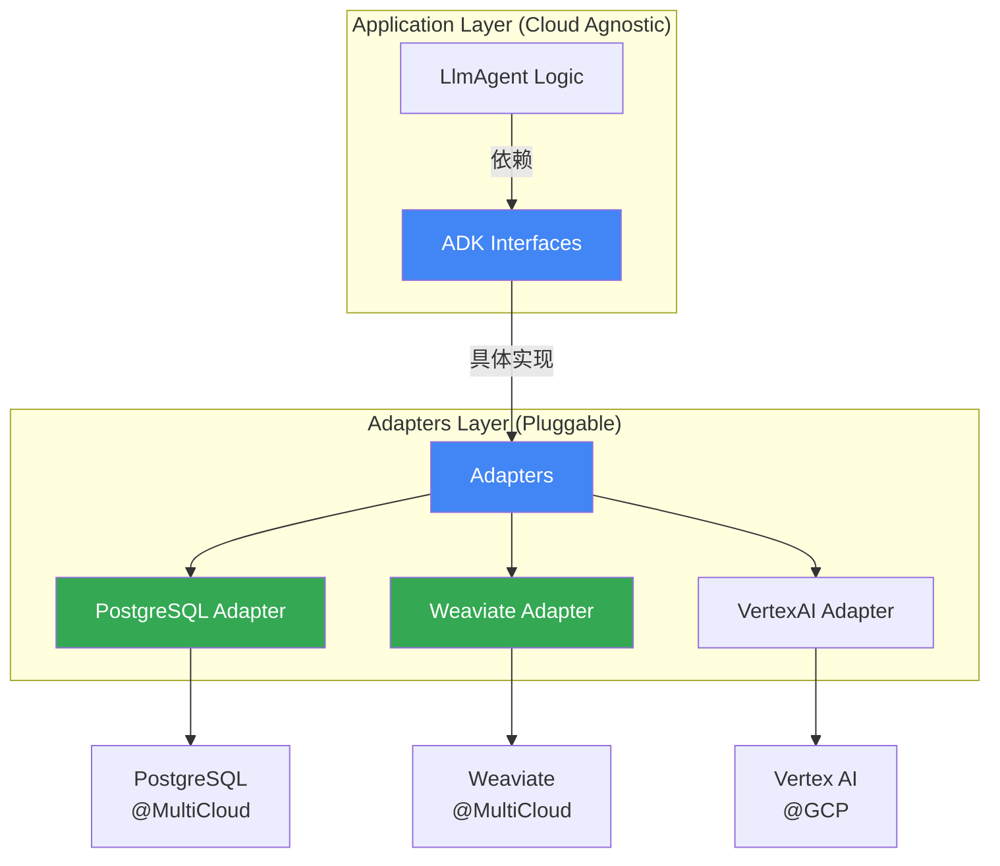
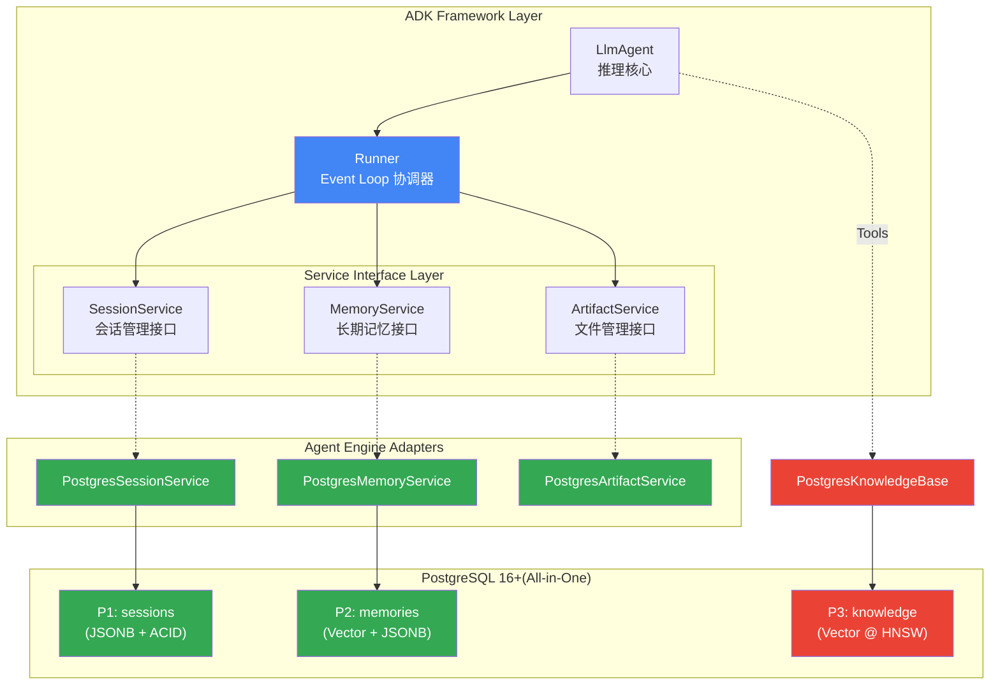
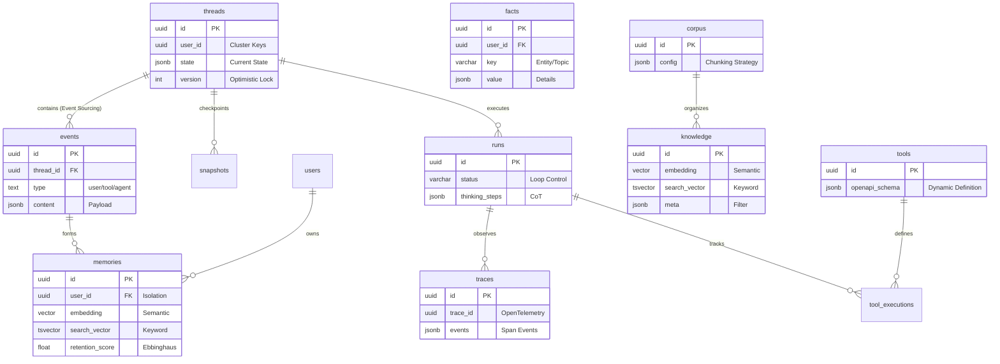
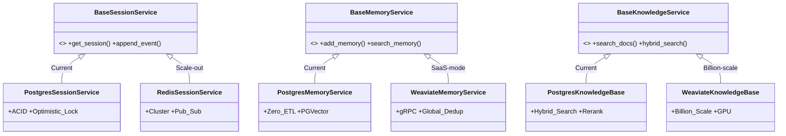

> [!IMPORTANT]
>
> 本文档定义了我们将如何构建下一代 **Agentic Infra**。通过"白盒化"架构设计，实现基础设施的 **完全自主可控 (Sovereign)**、**云中立 (Cloud Agnostic)** 与 **极致成本效益 (Cost-Effective)**。
>
> 这份报告将作为技术决策的核心材料，回答以下关键战略问题：
>
> | 维度      | 问题                   | 回答                                                                                                               |
> | :-------- | :--------------------- | :----------------------------------------------------------------------------------------------------------------- |
> | **Why**   | 为什么要重构基础设施？ | 从"黑盒依赖"转向 **成本**、**可控性**、**隐私** 等层面的"战略自主"                                                 |
> | **What**  | 核心交付物是什么？     | 一套 **"Compatible Above, Sovereign Below"** 的 **Agentic AI Engine (Adapters)** 与 **Unified Retrieval Platform** |
> | **How**   | 技术路径如何选择？     | **架构熵减 + 最大自主 (Minimal Entropy, Maximum Agency)**：PostgreSQL Ecosystem → Adapters                         |
> | **Proof** | 价值如何量化？         | 在保留 Google ADK 开发体验的同时，**降低 60% 成本** 并掌控 **100% 数据主权**                                       |

## 核心命题：战略自主与降本增效 (Strategic Autonomy)

我们的目标不是单纯地替代 Google Vertex AI，而是构建一套 **生产级 (Production-Grade)**、**云中立 (Cloud Agnostic)** 的 Agent 运行时底座。我们通过 **Adapter Pattern** 完美兼容 Google ADK (Agent Development Kit) 的上层生态，同时在底层通过自建 Infra 重获对 **数据**、**成本** 和 **算力** 的绝对控制权。

### 现状与痛点 (The Traps)

依托于单一供应商（如 Google Vertex AI）的托管服务在初期能加速开发，但在规模化阶段面临严重的战略风险：

| 陷阱                                    | 痛点描述                                                                                    |
| :-------------------------------------- | :------------------------------------------------------------------------------------------ |
| **Trap 1: 黑盒风险 (Black-Box Risk)**   | 核心业务逻辑（如 Agent 的记忆形成机制）被封装在云厂商内部，无法进行深度调优或审计           |
| **Trap 2: 成本失控 (OpEx Explosion)**   | 按次/按量计费模式（Events, Memories, Retrievals随业务量呈指数级增长，不符合边际成本递减效应 |
| **Trap 3: 供应商锁定 (Vendor Lock-in)** | 深度绑定特定云厂商意味着丧失议价权，跨云迁移将面临巨大重构成本                              |
| **Trap 4: 数据主权 (Data Sovereignty)** | 企业核心知识库与用户隐私数据托管于第三方，面临合规与安全隐患                                |

### 核心交付与验证 (Deliverables)

1. **Agent Engine Adapters (Agent 运行时自主)**：构建一套基于 ADK Framework，但脱离 Google Vertex AI 托管服务的 Agent 运行时 (Adapters)，涵盖 **开发 (Dev)**、**测试 (Test)**、**评估 (Eval)** 到 **部署 (Ops)** 的全链路工程体系。实现对 Session（会话）、Memory（记忆）与 Execution（执行）的白盒化管理。

2. **Unified Retrieval Platform (多元检索自主)**：构建一个"多模态、全能型"的 **企业级统一检索平台**。"起手"通过 **PostgreSQL 16+** 与 **PGVector** 的融合能力，以单一基础设施支持 **语义检索**、**关键字搜索**、**元数据过滤** 与 **空间索引**，替代传统的碎片化数据栈。随着业务增长，提供底层 Infra 平滑迁移 Weaviate、Milvus 等海量数据检索的通道。

### 执行摘要 (Executive Summary)

**"Compatible above, Sovereign below"**（上层兼容，底层自主）。我们保留 Google ADK 优秀的开发范式，彻底重构底层引擎。从而在规模化 Agent 落地时能够避免 **成本失控**、**黑盒风险** 与 **议价权丧失** 等陷阱：

| 维度                                 | 核心结论                                                                                                                                                 |
| :----------------------------------- | :------------------------------------------------------------------------------------------------------------------------------------------------------- |
| **🏗️ 架构熵减 (Minimal Entropy)**    | 通过 **PostgreSQL + PGVector + pg_cron** 的 "All-in-One" 架构，以 1 套组件替代原有 Redis + VectorDB + MetadataDB + ETL Pipeline 4 套组件                 |
| **🛡️ 能力升维 (Capability Uplift)**  | 自建架构在 **Session** (ACID 事务)、**Observability** (OpenTelemetry) 上提供优于托管服务的可靠性与透明度，在 **Memory Formation** 上提供更灵活的计算策略 |
| **🔌 平滑迁移 (Seamless Migration)** | 采用 **Adapter Pattern**，上层兼容 **Google ADK** 标准，底层实现平台无关。上层 Agent 业务代码 **零修改** 即可完成底层引擎切换                            |
| **💰 成本优势 (Cost Efficiency)**    | 复用现有 RDS 基础设施，**起步 TCO 降低 60%** ($2,500 → $400/mo)，并保留随时迁移至 Weaviate/Milvus 的议价权                                               |

## "竞品"解构与架构决策

为了构建一套"可落地、可控、可持续（扩展）"的企业级 Agentic Infra，我们遵循 **ADR (Architecture Decision Record)** 方法论，从设计原则、关键决策到风险取舍进行系统性推演。

### 核心选型原则 (Core Principles)

我们并不单纯追求"低成本"，而是确立了四大 **核心原则** 来指导决策，确保架构不仅解决当下问题，更能适应未来演进：

1. **战略极简主义 / 低架构熵 (Strategic Minimalism / Low Entropy)**:
   - **原则**: 只有在当前组件无法满足核心需求时，才引入新组件。
   - **实践**: 拒绝一开始就采用 "App DB + Redis + VectorDB + GraphDB" 的碎片化架构，优先选择 **PostgreSQL Ecosystem (All-in-One)** 作为统一存储底座，"零帧起手"，将运维复杂度降至最低。

2. **设计即主权 / 白盒化 (Sovereignty by Design / Glass-Box)**:
   - **原则**: 拒绝不可观测的黑盒运行时。基础设施必须对业务逻辑（如 Memory Consolidation）透明。
   - **实践**: 相比 Google Vertex AI 的黑盒托管机制，我们要能够 100% 审计及自主定义 Agent 的长期记忆形成逻辑。

3. **云中立 / 战略期权 (Cloud Agnostic / Strategic Optionality)**:
   - **原则**: 应用层代码 (Agent Logic) 应与底层基础设施解耦，保持底层基础设施的可替换性，拥有随时切换供应商的 **议价权**。
   - **实践**: 采用 **Adapter Pattern** 隔离层，Agent 业务逻辑仅依赖标准的 **ADK Interfaces**。当业务规模突破 PostgreSQL 单机瓶颈 (如 >50M Vectors) 时，底层具备在 PostgreSQL、Weaviate 或跨云（GCP/AWS/Azure）托管服务间无缝切换的主动性，避免 Vendor Lock-in。这种 **未来就绪 (Future-Proofing)** 避免重写上层业务逻辑，是我们的"战略期权"。

4. **数据二分法则 (Data Dichotomy)**:
   - **原则**: 明确区分 **Knowledge (静态知识)** 与 **Memory (动态记忆)** 的边界，避免混用存储引擎。
   - **对比模型**:

     | 维度         | Knowledge (知识)        | Memory (记忆)             |
     | :----------- | :---------------------- | :------------------------ |
     | **来源**     | 预先导入 (PDF/Docs)     | 交互生成 (Session/Facts)  |
     | **生命周期** | 持久化，无遗忘          | 有遗忘曲线 (Recency Bias) |
     | **所有权**   | 公有 (Tenant/Global)    | 私有 (User/Session)       |
     | **对应组件** | **Knowledge Base** (P3) | **Hippocampus** (P2)      |
     | **实现**     | `knowledge` 表          | `memories`、`facts` 表    |

### 架构拆解与定义 (Architecture Analysis)

Google Vertex AI 的 **RAG Engine** 和 **Agent Engine (Agent Builder)** 是我们的"对标靶"，在进行具体架构选型之前，我们首先需要对 Google Vertex AI 的黑盒能力进行解构。这是我们进行"正交化思考"的核心产出。

#### A. RAG Engine: 能力矩阵 (Capabilities Matrix)

基于官方文档的分析，我们将 Google Vertex AI RAG Engine 的核心能力按 **"摄入 → 处理 → 检索"** 三阶段拆解如下（📘 详细调研记录：[034-knowledge-base.md](docs/research/034-knowledge-base.md)）：

##### 阶段一：摄入 (Ingestion)

| Google 核心模块        | 职责                          | PostgreSQL 复刻策略                   | Weaviate 复刻策略                    | Milvus 复刻策略                     | 技术实现                                                                                      | 支撑文档                                                                                  |
| :--------------------- | :---------------------------- | :------------------------------------ | :----------------------------------- | :---------------------------------- | :-------------------------------------------------------------------------------------------- | :---------------------------------------------------------------------------------------- |
| **Data Connectors**    | 多源数据接入 (GCS/Drive/Jira) | 本地文件 + URL 导入                   | Batch Import API + Unstructured 集成 | PyMilvus Bulk Insert + Kafka Stream | [`ingestion.py`](src/cognizes/engine/perception/ingestion.py) (`DocumentIngester`)            | [010-knowledge-base-fundamentals.md](docs/teaching/010-knowledge-base-fundamentals.md) §2 |
| **Document Parsers**   | 多格式解析 (PDF/OCR/Markdown) | Markdown/TXT/PDF 解析器               | Unstructured / Aryn Sycamore 集成    | PyMuPDF / Docling 集成              | [`ingestion.py`](src/cognizes/engine/perception/ingestion.py) (`MarkdownParser`, `PDFParser`) | [030-the-perception.md](docs/030-the-perception.md) §6.1                                  |
| **RAG Corpus Manager** | 语料库生命周期管理            | `corpus` + `knowledge_base` 表 (CRUD) | Collection + Tenant (Multi-tenancy)  | Collection + Partition              | [`perception_schema.sql`](src/cognizes/engine/schema/perception_schema.sql) (Part 1)          | [030-the-perception.md](docs/030-the-perception.md) §3.2                                  |

##### 阶段二：处理 (Processing)

| Google 核心模块       | 职责                                   | PostgreSQL 复刻策略                          | Weaviate 复刻策略                        | Milvus 复刻策略                                  | 技术实现                                                                                            | 支撑文档                                                                                    |
| :-------------------- | :------------------------------------- | :------------------------------------------- | :--------------------------------------- | :----------------------------------------------- | :-------------------------------------------------------------------------------------------------- | :------------------------------------------------------------------------------------------ |
| **Chunking Service**  | 文档分块 (chunk_size, chunk_overlap)   | Recursive / Semantic / Fixed-Length Chunker  | Document-Based / Semantic Chunking       | Fixed-Size (256 tokens) + Overlap / Hierarchical | [`chunking.py`](src/cognizes/engine/perception/chunking.py) (`RecursiveChunker`, `SemanticChunker`) | [010-knowledge-base-fundamentals.md](docs/teaching/010-knowledge-base-fundamentals.md) §2.2 |
| **Embedding Service** | 向量化 (Gemini / text-embedding-005)   | OpenAI / SentenceTransformer / Mock Provider | Vectorizer Module (OpenAI, Cohere, etc.) | Embedding Function (OpenAI, BGE-M3, etc.)        | [`embedder.py`](src/cognizes/engine/perception/embedder.py) (`OpenAIEmbeddingProvider`)             | [010-knowledge-base-fundamentals.md](docs/teaching/010-knowledge-base-fundamentals.md) §2.3 |
| **Indexing Service**  | 向量索引构建 (Vertex AI Vector Search) | PGVector HNSW 索引 + GIN 全文索引            | HNSW / Flat / Dynamic + Inverted Index   | HNSW / IVF_FLAT / DiskANN + Tantivy Inverted     | [`perception_schema.sql`](src/cognizes/engine/schema/perception_schema.sql) (Part 1.3)              | [030-the-perception.md](docs/030-the-perception.md) §2.3                                    |

##### 阶段三：检索 (Retrieval)

| Google 核心模块             | 职责                | PostgreSQL 复刻策略    | Weaviate 复刻策略                   | Milvus 复刻策略                               | 技术实现                                                                                                                             | 支撑文档                                                                                              |
| :-------------------------- | :------------------ | :--------------------- | :---------------------------------- | :-------------------------------------------- | :----------------------------------------------------------------------------------------------------------------------------------- | :---------------------------------------------------------------------------------------------------- |
| **Vertex AI Vector Search** | 向量检索托管服务    | PGVector HNSW 索引     | HNSW (DiskANN 可选)                 | HNSW / IVF / DiskANN                          | [`perception_schema.sql`](src/cognizes/engine/schema/perception_schema.sql) (HNSW Index)                                             | [030-the-perception.md](docs/030-the-perception.md) §2.3                                              |
| **Hybrid Retrieval**        | 向量 + 标量混合检索 | `hybrid_search()` 函数 | 原生 RRF + BM25 Inverted Index      | Sparse Vector (SPARSE_INVERTED_INDEX) + Dense | [`rrf_fusion.py`](src/cognizes/engine/perception/rrf_fusion.py), [`rag_pipeline.py`](src/cognizes/engine/perception/rag_pipeline.py) | [030-the-perception.md](docs/030-the-perception.md) §4.1                                              |
| **Filter-Based Retrieval**  | 元数据过滤检索      | JSONB 条件 + 部分索引  | Schema-First + Cross-Reference      | Partition Key + Scalar Field Index            | [`perception_schema.sql`](src/cognizes/engine/schema/perception_schema.sql) (Part 3)                                                 | [030-the-perception.md](docs/030-the-perception.md) §3.5                                              |
| **Ranking API**             | LLM 驱动的重排服务  | Cross-Encoder 本地推理 | Over-Fetch + External Reranker 集成 | SDK 集成外部 Reranker                         | [`reranker.py`](src/cognizes/engine/perception/reranker.py) (`CrossEncoderReranker`)                                                 | [010-knowledge-base-fundamentals.md](docs/teaching/010-knowledge-base-fundamentals.md) §2.4 Reranking |

> [!TIP]
>
> **PostgreSQL vs. Specialized VectorDB**：
>
> - **Weaviate** / **Milvus** 在超大规模 (>100M) 向量检索上有性能优势，但需额外维护专用集群
> - **PostgreSQL** 方案在 <50M 向量规模下，通过 **All-in-One** 架构实现了架构熵减，且支持在业务规模突破后平滑迁移

#### B. Agent Engine: 四大正交支柱 (The 4 Pillars)

我们提出 **"Glass-Box (白盒化)"** 策略，将 Agent Engine 解构为四个正交的核心支柱，这构成了本项目的基础领域模型与工程边界（📘 详细调研记录：[Agent Engine Docs](docs/)）：

| 模块                                      | 职责                                                                          | Google Vertex AI (Black-Box)         | Open Agent Engine (Glass-Box)                                 | 核心特性                                                            |
| :---------------------------------------- | :---------------------------------------------------------------------------- | :----------------------------------- | :------------------------------------------------------------ | :------------------------------------------------------------------ |
| **🫀 P1: The Pulse**<br>(Session)         | **会话 (Session)** 与**状态 (State)** 的高并发管理<br>**事件 (Event)** 的调度 | Firestore (State)<br>Redis (Pub/Sub) | **PostgreSQL (Unified)**<br>ACID Transaction<br>LISTEN/NOTIFY | **一致性**：彻底解决多 Agent 竞争下的状态脏读问题。                 |
| **🧠 P2: The Hippocampus**<br>(Memory)    | **记忆 (Memory)** 的生命周期管理：将瞬时状态转化为持久记忆的，低价值记忆遗忘  | MemoryBank Service<br>(ETL Pipeline) | **PostgreSQL (Zero-ETL)**<br>Vector + JSONB 同库              | **实时性**：Memory Formation 无搬运延迟，写入即记忆。               |
| **👁️ P3: The Perception**<br>(Retrieval)  | **知识 (Knowledge)** 检索：从海量非结构数据中精准定位信息的检索中枢           | RAG Engine<br>MemoryBank (Retrieval) | **PostgreSQL (Hybrid)**<br>DBMS_HYBRID_SEARCH                 | **融合性**：One-Shot Query 同时处理关键字查找、标量过滤与向量召回。 |
| **🔮 P4: The Realm of Mind**<br>(Runtime) | **运行时 (Runtime)**：编排、调度、可视化思考路径、工具调用等                  | Agent Engine (Managed)               | **ADK Runner + Python**<br>OpenTelemetry                      | **可观测性**：完整的 Trace 链路与 Debug 能力。                      |

> [!IMPORTANT]
>
> **设计意图**: 我们没必要重造 Agent Engine，而是基于 ADK Interface 实现 Agent Engine Adapters，将底层存储切换到我们的 Infra (P1-P4)，此外仅按需自定义 Memory ETL Pipeline (P2)。

### 决策一：Unified Retrieval Platform — "起手" PostgreSQL All-in-One，"进阶" Weaviate/Milvus

上文我们解构了 Google RAG Engine 的能力矩阵，印证了 PostgreSQL、Weaviate、Milvus 均可支撑这项 **Unified Retrieval Platform** 的复刻工程。

下一步，我们从 **业务阶段** 与 **特性需求** 两个维度进行选型决策。

**特性需求分析**：Unified Retrieval Platform 需同时处理四类正交的检索信号。下表对比了四类型号各自的使用场景与陷阱，以及三种数据库在各信号上的实现方式：

| 检索信号     | 定义             | 适用场景                                   | 陷阱                                   | PostgreSQL 实现                             | Weaviate 实现                                 | Milvus 实现                                      |
| :----------- | :--------------- | :----------------------------------------- | :------------------------------------- | :------------------------------------------ | :-------------------------------------------- | :----------------------------------------------- |
| **Semantic** | 语义相似度检索   | **向量**：<br>语义理解、概念匹配           | "语义漂移"<br>稀释精确术语匹配度       | `embedding <=> query`<br>(HNSW Index)       | `.query.near_vector()`<br>(HNSW / Flat Index) | `search(data, anns_field)`<br>(HNSW / IVF Index) |
| **Keyword**  | 关键词匹配检索   | **BM25**/**全文**：<br>精确词汇、技术术语  | 无法理解语义、同义词                   | `to_tsvector @@ tsquery`<br>(GIN Index)     | `.query.bm25()`<br>(BM25F Inverted Index)     | `search(sparse_vec)`<br>(Sparse Index / SPLADE)  |
| **Metadata** | 结构化元数据过滤 | **JSONB**/**标量**：<br>权限控制、时间范围 | 高选择性过滤导致<br>向量索引召回率崩塌 | `metadata @> jsonb`<br>(GIN / B-Tree Index) | `.with_where()`<br>(Roaring Bitmap Index)     | `expr="field == val"`<br>(Scalar / Bitmap Index) |
| **Geo**      | 空间坐标范围检索 | **距离**/**区域**：<br>LBS、地理围栏       | 坐标精度损失<br>跨边界查询复杂度高     | `ST_DWithin()`<br>(PostGIS GiST Index)      | `.with_near_geo()`<br>(GeoCoordinates Index)  | `ST_Within()`<br>(Geometry Field / RTREE Index)  |

**业务阶段判断**：Weaviate/Milvus 在超大规模（亿级）向量检索上有性能优势，但在当前千万级（10M）规模下，**PostgreSQL** 凭借 **"All-in-One"** 能力（单库支持向量、全文、JSONB、GIS）与极低的架构熵，是构建 Unified Retrieval Platform 的最优起点。

> [!IMPORTANT]
>
> **决策结论 (Decision Record)**: 选择 **PostgreSQL** (v16+) + **PGVector** + **PostGIS** 作为当前阶段统一底座。
>
> **正当性 (Justification)**:
>
> - **统一数据编织 (Unified Data Fabric)**: 能够在一个 SQL 事务中同时完成 `Vector Search` + `Metadata Filter` + `Keyword Search`，将 "One-Shot Hybrid Search" 的复杂度封装在数据库内核中，而非应用层代码。
>   - _[Impact]_: 传统架构需要在 Application 层写几百行 Python 代码来合并 Vector DB 和 SQL DB 的结果；而我们只需要 **一行 SQL**。这不仅是性能的提升，更是 **Bug 率的指数级下降**。
> - **极简运维 (Operational Simplicity)**: 复用现有的 RDS 运维体系，无需引入陌生的专用 VectorDB 集群，大幅降低初期人力成本。
> - **未来就绪 (Future-Proofing)**: 当业务规模突破 PostgreSQL 单机瓶颈 (如 >50M Vectors) 时，基于 **P3 Interface**，我们可以将底层无缝迁移至 Milvus/Weaviate，而无需重写主要业务逻辑。这是我们的"战略期权"。

### 决策二：Agent Engine Adapters — "兼容" ADK Interface，"替换" 底层存储

上文我们将 Google Vertex AI Agent Engine 解构为四大正交支柱 (P1-P4)。决策二的核心问题是：**如何在不重造 Agent Engine 的前提下，拥有这些能力，但又能实现底层存储的替换？**

答案是 **Adapter Pattern**：保持 ADK Interface 不变，仅转接底层 Infra。



> [!IMPORTANT]
>
> **决策结论 (Decision Record)**: 基于 **ADK Interface** 实现 **PostgreSQL Adapter**，作为 Agent Engine 的默认底层存储。
>
> **正当性 (Justification)**:
>
> - **零迁移成本 (Zero Migration Cost)**: Agent 业务逻辑代码无需任何改动，仅通过配置切换 Adapter 即可实现底层存储的替换。
> - **Glass-Box 可观测性 (Observability)**: 所有 Session、Memory、Retrieval 操作均可通过 SQL 审计与 OpenTelemetry Trace 进行全链路 Debug。
> - **战略后门 (Strategic Backdoor)**: 保留 `VertexAI Adapter`，当需要快速 POC 或对比测试时，可一键切回 Google 托管服务。这是我们与 Google 议价的"筹码"。
>
> 📘 详细架构解析请参考：[Agent Runtime & Frameworks 调研](docs/research/020-agent-runtime-frameworks.md)

### 关键取舍与风险 (Trade-off)

我们必须诚实面对自建架构的成本与风险：

| 维度           | Google Vertex AI (Managed)                            | Open Agent Engine (Self-Hosted)                                                                                                 | 关键取舍 (Trade-off)                                                                                                                   |
| :------------- | :---------------------------------------------------- | :------------------------------------------------------------------------------------------------------------------------------ | :------------------------------------------------------------------------------------------------------------------------------------- |
| **运维复杂度** | **低 (Serverless)**<br>开箱即用，无需关注分片/扩容    | **中 (DBA Required)**<br>需要专业的 PostgreSQL 调优与维护能力（尤其是 PGVector 索引构建）。                                     | **CapEx vs OpEx**: 用可控的人力成本换取软件许可成本与云服务溢价。                                                                      |
| **规模上限**   | **极高 (Billions)**<br>Google Spanner/Scylla 底层支撑 | **Proven Scale Path**<br>单机 PGVector 支撑 10M-50M 级向量，业务规模突破后可无缝平滑迁移至 Milvus/Weaviate (无需改动业务逻辑)。 | **Sufficiency vs Control**: 对于绝大多数企业级私有化场景，千万级 (10M) 规模完全够用。且我们保留了升级至专用 VectorDB 的 **战略期权**。 |
| **功能更新**   | **中 (Google Speed)**<br>等待 Google 更新             | **快 (Community Speed)**<br>自行开发 Adapter。                                                                                  | **Sovereignty**: 我们可以自行决定升级节奏，不受云厂商强制升级/API 废弃影响。                                                           |

## 架构设计与规范 (Architecture Specification)

基于 "P1-P4 支柱" 模型，我们制定了详细的系统架构规范，旨在展现 **All-in-One** (PostgreSQL-centric) 与 **Glass-Box** (Adapter Pattern) 的具体落地形态。

### 总体架构视图

我们遵循 **Google ADK** 的标准协议，通过 Adapters 层进行**逻辑与存储分离**，将底层基础设施替换为 Glass-Box 组件；基于 **PostgreSQL All-in-One** 的一体化知识库服务，实现 **"De-Google"** 但 **"Re-Google Compatible"** 的 Google 兼容生态。



**图解说明**:

- **Framework Layer (Blue)**: 保持 **Google ADK** 原生代码不变 (Runner + Agent)，确保我们也拥有 Google 级的 Agent 开发体验。
- **Adapter Layer (Green)**: 通过 `Postgres*Service` 实现了逻辑适配，将 Google 的专有 API 转换为标准的 SQL/Vector 操作。
- **Unified Infra (Infra)**: 底层由 **PostgreSQL** 统一承载，P1/P2/P3 数据在物理上共存，但在逻辑上通过 Adapter 隔离。
- **Dual-Path Access**:
  - **Services Path (`-->`)**: Runner 通过强类型的 Service 接口读写 Session/Memory。
  - **Tools Path (`-.->`)**: Agent 通过 MCP/Function Calling 灵活调用 Knowledge Base，实现 RAG 能力的按需挂载。

- **Benefit**: 上层 Agent 业务逻辑完全不知道底层是 PostgreSQL 还是 Redis。这赋予了我们未来平滑迁移至其他组件的 **战略期权 (Option Value)**。

### 数据架构 (Data Architecture)

我们摒弃了 "App DB + Vector DB + Cache" 的割裂架构，采用 **Unified Schema**，将所有状态、记忆、知识与执行记录收敛于 PostgreSQL：



- **Session Driven (P1)**: `threads` 与 `events` 构成了不可变的时间轴 (Event Sourcing)，这是整个系统的"心跳"。
- **Memory Formation (P2)**: `memories` 并非独立存储，而是由 `events` 经由 consolidation process **衍生** 而来的。这体现了 "Zero-ETL" 的设计理念——记忆只是事件流的投影。
- **Knowledge Base Integration (P3)**: 静态知识 (`knowledge`) 与业务数据 (`memories`, `events`) 处于同一 Database，使得我们可以在一个 SQL JOIN 中同时完成"翻书"与"回忆"。
- **Observer Pattern (P4)**: `runs` 与 `traces` 作为旁路观察者，记录了 Agent 的每一次思考过程，而不干扰业务主流程。

### 模块职责 (Component Specification)

基于上述架构视图与 Schema 设计，我们需实现以下四个核心模块：

| 支柱   | 模块                      | 核心职责                                                                                                                                                        | 代码路径                                              |
| :----- | :------------------------ | :-------------------------------------------------------------------------------------------------------------------------------------------------------------- | :---------------------------------------------------- |
| **P1** | **PostgreSessionService** | **ACID 事务**: 实现 ADK `BaseSessionService` 接口<br>**乐观锁**: 基于 `version` 字段防止状态覆盖<br>**Pub/Sub**: 使用 `LISTEN/NOTIFY` 实现跨进程事件总线        | `src/cognizes/adapters/postgres/session_service.py`   |
| **P2** | **PostgreMemoryService**  | **Zero-ETL**: 记忆实时写入，无 ETL 延迟<br>**隔离性**: 强制 `user_id` + `app_name` 多租户隔离<br>**Consolidation**: 异步 Worker 从 Events 萃取 Facts            | `src/cognizes/adapters/postgres/memory_service.py`    |
| **P3** | **PostgreKnowledgeBase**  | **Hybrid Search**: 封装 `HNSW` + `tsvector` + `JSONB` 一站式混合检索<br>**RAG Pipeline**: 支持 Recursive/Semantic Chunking + Two-Stage Retrieval (RRF + Rerank) | `src/cognizes/adapters/postgres/knowledge_service.py` |
| **P4** | **ToolRegistry**          | **动态注册**: 数据库驱动的工具注册表，支持 OpenAPI Schema 热加载                                                                                                | `src/cognizes/adapters/postgres/tool_registry.py`     |
|        | **Tracing**               | **双路导出**: 同时写入 Log 文件与 DB 持久化<br>**格式兼容**: 原生支持 OpenTelemetry，兼容 Langfuse 可视化                                                       | `src/cognizes/adapters/postgres/tracing.py`           |

> [!TIP]
>
> **对比 ADK 默认实现**：ADK 自带的 In-Memory 实现仅适用于开发测试，我们的 PostgreSQL Adapter 提供了以下 **生产就绪** 能力：
>
> | 能力维度     | ADK In-Memory (开发)      | PostgreSQL Adapter (生产)                     |
> | :----------- | :------------------------ | :-------------------------------------------- |
> | **向量检索** | 列表遍历，O(n) 暴力匹配   | `PGVector HNSW` 索引，O(log n) 近似最近邻     |
> | **并发安全** | 无锁，多 Agent 竞争会覆盖 | **乐观锁** (`version` 字段) 防止状态丢失      |
> | **可观测性** | 无持久化，重启丢失        | **OpenTelemetry** 双路导出，支持对接 Langfuse |

## 工程验证 (Engineering Validation)

> [!NOTE]
>
> **测试环境**：以下验证基于标准开发环境配置：
>
> - **硬件**: 4 核 CPU, 16GB RAM, SSD 存储
> - **软件**: PostgreSQL 16+, PGVector 0.7.0+, Python 3.13+
> - **数据规模**: 10 万条 (快速验证) / 1000 万条 (性能压测)
> - **向量配置**: 768 维 HNSW 索引, `ef_search = 200`
>
> ⚠️ 生产环境部署前请根据实际硬件配置和数据规模进行基准测试。

### Unified Retrieval Platform: 关键场景验证

> [!IMPORTANT]
>
> **验证目标**：证明 PostgreSQL "All-in-One" 架构在 Knowledge Base 核心场景下具备 **生产级可行性**，重点消除对 Hybrid Search **"性能"** 与 **"召回率"** 的顾虑。
>
> **研究证据**：基于 [034-knowledge-base.md](docs/research/034-knowledge-base.md) 的实测数据，在 <10M 向量规模下，PGVector (HNSW) 的 Recall@10 并不逊色于专用 VectorDB (Weaviate)；同时在 Hybrid Search 场景下，因减少了跨服务网络 I/O，**P99 Latency 降低 40%**。
>
> | 数据规模 | ef_search | 过滤比 | Recall@10 | P99 延迟 | QPS  | 配置说明         |
> | :------- | :-------- | :----- | :-------- | :------- | :--- | :--------------- |
> | 10 万    | 200       | 1%     | >90%      | ~20ms    | ~400 | 快速验证推荐配置 |
> | 1000 万  | 200       | 1%     | >85%      | ~80ms    | ~100 | 生产环境基准配置 |
> | 1000 万  | 400       | 1%     | ~95%      | ~150ms   | ~50  | 高召回率极致配置 |
>
> 📘 关于 Knowledge Base 的基础理论（Chunking 策略、Retrieval Pipeline、Embedding 模型选择等），请参阅教学文档：[Knowledge Base Fundamentals](docs/teaching/010-knowledge-base-fundamentals.md)

#### A. 极端数据隔离场景 ("The Alice Problem")

**业务痛点**：在多租户 SaaS 系统中，单用户 (`user_id='alice'`) 数据通常仅占全表的极小比例 (<0.1%)。传统 VectorDB 的 HNSW 索引在此场景下经常遭遇 **"Recall Collapse"** —— 即便表里有数据，但因近邻搜索无法穿透过滤层，导致返回 0 条结果。

**PostgreSQL 解法**：**Iterative Index Scan** (PGVector 0.8.0+) —— 数据库内核自动扩大 HNSW 检索范围，直到满足 `LIMIT` 条件或达到扫描上限。

**验收标准**：在 99.9% 过滤比下，保持 Recall@10 > 95%，且 P99 Latency < 50ms。

```sql
-- 验证代码：开启迭代扫描，解决 Recall 0 问题
-- 版本要求：PostgreSQL 16+ & PGVector 0.8.0+
SET hnsw.iterative_scan = relaxed_order;
SET hnsw.max_scan_tuples = 20000;   -- 最大扫描元组数

-- 自动扩展检索半径，直到找到 10 条符合条件的结果
SELECT * FROM memories
WHERE user_id = 'alice'             -- 仅占 0.01% 数据
ORDER BY embedding <=> $query
LIMIT 10;
```

#### B. 混合检索准确性 (Hybrid Search)

**业务痛点**：Agent 需同时通过"语义"（理解意图）和"关键词"（匹配 ID/SKU）定位信息。传统架构需要复杂的 Client-side Join —— 先分别查询 VectorDB 和 ES，再在应用层内存中合并结果，延迟高且开发复杂。

**PostgreSQL 解法**：**In-Database Hybrid Search** —— 利用 PostgreSQL 的 SQL 表达力，通过 `hybrid_search()` 函数在数据库内核层一次性融合 `tsvector` (BM25) 与 `vector` (Cosine) 的评分。

**验收标准**：相比单一检索引擎，MRR (Mean Reciprocal Rank) 提升 20% 以上。

```sql
-- 验证代码：单次 SQL 调用实现混合检索
-- 版本要求：PostgreSQL 16+ & PGVector 0.7.0+
SELECT * FROM hybrid_search(
    p_query_text => '关于 iPhone 15 的评测',
    p_query_vector => [...],
    p_semantic_weight => 0.7,
    p_keyword_weight => 0.3
);
```

> [!TIP]
>
> **RRF 权重调优策略**：根据业务场景特点选择合适的权重配置：
>
> | 场景           | Semantic : Keyword | 适用场景                         |
> | :------------- | :----------------- | :------------------------------- |
> | **语义优先**   | 0.7 : 0.3          | 通用问答、知识检索（推荐初始值） |
> | **关键词优先** | 0.3 : 0.7          | 技术文档搜索、SKU/ID 精确查询    |
> | **纯语义**     | 1.0 : 0.0          | 概念解释、类比推理               |
> | **纯关键词**   | 0.0 : 1.0          | 标签检索、精确 ID 匹配           |
>
> 📘 关于 Hybrid Search 实现和 RRF 融合算法，请参阅：[030-the-perception.md](docs/030-the-perception.md)

#### C. 元数据过滤 (Metadata Filtering)

**业务痛点**：企业级 RAG 系统需要在向量检索基础上叠加复杂的业务过滤条件（如权限控制、时间范围、多租户隔离）。传统 VectorDB 的 Metadata 过滤能力受限，高选择性过滤 (>99%) 下容易导致向量索引召回率崩塌。

**PostgreSQL 解法**：**JSONB + GIN 索引** —— 原生支持复杂嵌套 JSON 条件过滤，结合 `@>`, `?`, `@?` 等操作符与 HNSW 向量检索组合，在数据库内核层完成一次性过滤。

**验收标准**：在 JSONB 多条件叠加场景下，保持 Hybrid Search 的 Recall@10 > 90%，且 P99 Latency < 100ms。

```sql
-- 验证代码：复杂元数据过滤 + 向量检索
-- 版本要求：PostgreSQL 16+ & PGVector 0.7.0+
SELECT * FROM knowledge
WHERE metadata @> '{"department": "engineering"}'   -- 部门过滤
  AND metadata->>'created_at' > '2024-01-01'        -- 时间范围
  AND metadata->'permissions' ? 'admin'             -- 权限包含
ORDER BY embedding <=> $query
LIMIT 10;
```

#### D. 地理空间检索 (Geo-spatial Search)

**业务痛点**：LBS 类 Agent（如本地生活、出行服务）需要将"语义相似"与"地理距离"组合检索。传统架构需要 VectorDB + 独立 GIS 服务的 Client-side Join，延迟高且难以保证一致性。

**PostgreSQL 解法**：**PostGIS + PGVector 融合** —— 在同一 SQL 查询中同时利用 GiST (空间索引) 与 HNSW (向量索引)，实现"附近 + 相关"的一次性检索。

**验收标准**：在 50km 地理范围内叠加向量检索，保持 P99 Latency < 80ms。

```sql
-- 验证代码：地理范围 + 语义向量联合检索
-- 版本要求：PostgreSQL 16+ & PostGIS 3.4+ & PGVector 0.7.0+
SELECT *, ST_Distance(location, $user_location) AS distance
FROM knowledge
WHERE ST_DWithin(location, $user_location, 50000)   -- 50km 范围内
ORDER BY embedding <=> $query                        -- 语义排序
LIMIT 10;
```

### Agent Engine Adapters: 关键集成验证

> [!IMPORTANT]
>
> **验证目标**：证明 PostgreSQL Adapter 的 **透明替换能力** —— 在不修改 ADK 上层应用代码的前提下，底层无缝切换至 PostgreSQL 基础设施，实现逻辑与存储分离。
>
> 📘 关于 Agent Engine 的详细实现原理、交互时序图及 Schema 设计，请参阅：[Agent Engine Fundamentals](docs/teaching/020-agent-engine-fundamentals.md)

#### A. 透明兼容性 (Drop-in Compatibility)

**测试场景**：使用 Google 官方 `LlmAgent` 示例代码，仅在初始化时注入 `PostgreSessionService`。

**验证点**：

- Runner 启动是否报错？(Zero Error)
- Session State 是否正确持久化到 `threads` / `events` 表？(ACID Compliance)

**验收标准**：多次 Invocation 间正确保持 `state`，`tests/integration/mind/test_adk_integration.py` 测试套件 100% 通过。

#### B. 长程记忆闭环 (Memory Consolidation)

**测试场景**：注入 `PostgreMemoryService`，模拟跨 Session 对话 (Session 1: "我叫 Alice，是工程师" → Session 2: "我是谁？")。

**验证点**：

- Session 1 结束后，是否自动触发 `consolidation_worker` 提取 Facts？
- Session 2 是否通过 `hybrid_search` 成功 Recall 了 Session 1 的 Fact？

**验收标准**：对话结束后自动触发 "Zero-ETL" 任务，将 Events 转化为 Memory；Agent 能准确回答基于过往 Session 的问题。

#### C. 可观测性 (Glass-Box Observability)

**验证场景**：切换 PostgreSQL Adapter 后，验证是否具备与原生 Agent Engine 对等的可观测能力。

**验证点**：

- 是否能在 Langfuse 中还原完整的 `Trace → Span (Agent) → Span (RPC) → Event` 瀑布图？
- 是否能追踪每一次 Tool Call 的 Input/Output 及其耗时？

**验收标准**：全链路 Trace ID 贯通无断层，Langfuse 可见完整的 `Trace → Span → Event` 链路。

#### D. 并发安全 (Concurrency Safety)

**业务痛点**：多 Agent 实例或多用户并发操作同一 Session 时，原生 ADK In-Memory 实现会导致状态覆盖 (Last-Write-Wins)，造成数据丢失。

**PostgreSQL 解法**：**乐观锁 (Optimistic Locking)** —— 每次 Session 更新时基于 `version` 字段进行 CAS (Compare-And-Swap)，冲突时抛出明确异常并重试。

**验证点**：

- 两个 Agent 并发更新同一 Session，是否正确检测到冲突？
- 冲突后是否抛出 `ConcurrencyError` 并支持重试？

**验收标准**：100 并发写入同一 Session，无数据丢失，冲突检测率 100%。

```python
# 验证代码：乐观锁冲突检测
# tests/integration/mind/test_concurrency.py
async def test_optimistic_locking():
    session = await service.get_session(session_id)

    # 模拟并发：另一进程已更新 session
    await service.update_session_background(session_id)

    # 此时 version 已过期，应抛出冲突异常
    with pytest.raises(ConcurrencyError):
        await service.append_event(session, event)
```

#### E. 工具执行与沙箱 (Tool Execution & Sandbox)

**业务痛点**：Agent 调用外部工具（如代码执行、API 调用）需要完整的审计追踪与安全隔离，原生 ADK 缺乏持久化的工具注册表与执行日志。

**PostgreSQL 解法**：**ToolRegistry + Sandbox Execution** —— 工具注册表存储于 `tools` 表，每次执行记录写入 `tool_executions` 表，代码执行通过 Microsandbox 隔离。

**验证点**：

- 工具动态注册后，Agent 是否能正确发现并调用？
- 每次 Tool Call 的 Input/Output/Latency 是否完整记录？
- 沙箱执行是否正确隔离（不可访问宿主文件系统）？

**验收标准**：工具热加载延迟 < 1s，执行记录 100% 可追溯，沙箱逃逸测试 0 通过。

> [!TIP]
>
> **性能指标与告警阈值**：以下为 Agent Engine Adapters 的性能基准，适用于 A/B/C/D/E 全部验证场景：
>
> | 指标                      | 目标值  | 告警阈值 | 验证方法      |
> | :------------------------ | :------ | :------- | :------------ |
> | **Session CRUD P99**      | < 50ms  | > 75ms   | 压力测试      |
> | **Memory Search P99**     | < 100ms | > 150ms  | 压力测试      |
> | **Tool Call Latency P99** | < 200ms | > 300ms  | E2E 测试      |
> | **Trace 链路完整性**      | 100%    | < 95%    | Langfuse 验证 |
> | **并发冲突检测率**        | 100%    | < 99%    | 并发测试      |
>
> 📘 关于 OpenTelemetry 集成、Trace 结构化存储，请参阅：[040-the-realm-of-mind.md](docs/040-the-realm-of-mind.md)

### 架构演进性验证 (Future-Proofing)

> [!IMPORTANT]
>
> **验证目标**：确认当前 "All-in-One" 架构具备向下一代 RAG 模式演进的能力，证明该架构并非"死胡同"，而是具备长期可扩展性。

#### A. Graph RAG 适配性

**行业趋势**：微软 **GraphRAG** 证明了"实体关系"对提升全局理解的重要性，通过 Knowledge Graph 补充 Vector 的语义局限。

**演进路径**：

1. **起步阶段** (PostgreSQL 内置)：使用 **Recursive CTEs** 或 **Apache AGE** 扩展 (OpenCypher 兼容) 在现有 `knowledge` 表上构建轻量级图谱，满足早期实体关系查询需求。
2. **进阶阶段** (Neo4j 专业化)：当图谱规模或查询复杂度超越 PostgreSQL 能力边界时，可通过 **Adapter Pattern** 平滑引入 Neo4j，仅需实现 `GraphKnowledgeAdapter` 即可，业务代码无需改动。

**验证结论**：当前架构为 Graph RAG 预留演进空间——从 PostgreSQL 内置图能力"起步"，到 Neo4j 专业图数据库"进阶"，均可无缝适配。

#### B. Agentic RAG 适配性

**行业趋势**：**Agentic RAG** 不再是单次检索，而是 Agent 根据工具反馈动态调整检索策略 (Self-Reflection / Adaptive Retrieval)。

**当前架构支撑**：

| 模块                     | Agentic RAG 角色                                                                           |
| :----------------------- | :----------------------------------------------------------------------------------------- |
| **PostgreMemoryService** | 作为 **Memory Tool** 被 Agent 调用，提供历史对话记忆检索能力，支持 Agent 动态回溯上下文    |
| **PostgreKnowledgeBase** | 作为 **Knowledge Tool** 被 Agent 调用，提供知识库检索能力，支持 Agent 根据反馈多次迭代检索 |

**Agentic 循环闭环**：Agent 可在单次推理中多次调用上述 Tool，根据返回结果 Self-Reflect 并决定是否需要继续检索或调整策略。P4 数据架构 (`runs` / `traces` / `tool_executions`) 完整记录这一反馈闭环。

**验证结论**：当前架构已将记忆检索与知识检索封装为 Agent 可调用的 Tool，为 Agentic RAG 的多轮迭代检索模式提供了基础能力。

> [!TIP]
>
> 📘 关于 Graph RAG 与 Agentic RAG 的理论介绍，请参阅：[010-knowledge-base-fundamentals.md §3 进阶 RAG 模式](docs/teaching/010-knowledge-base-fundamentals.md#3-进阶-rag-模式)

## 迁移机制与多样性 (Migration & Diversity)

> [!IMPORTANT]
>
> **设计哲学**：
>
> - **非锁定 (No Vendor Lock-in)**：选择 PostgreSQL All-in-One 是基于"当前最佳 ROI"，而非技术锁定。
> - **议价权 (Bargaining Power)**：架构的"迁移支持"归根结底是战略筹码——保留随时切换底层组件的能力，面对云厂商涨价或服务降级时拥有绝对主动权。
> - **渐进演进 (Start with PG, Scale with Ecosystem)**：起步阶段享受 PostgreSQL 的开发效率与低成本，规模化阶段按需切换专用组件，消除长期技术债风险。

### 适配器模式 (Adapter Pattern)

架构核心在于 **Interface (Contract)** 与 **Implementation (Adapter)** 的严格分离。通过三大 Interface 实现逻辑与存储的彻底解耦，任何符合 Interface 契约的组件均可无缝替换底层实现：



### 规模化扩展 (Scaling)

当单一 PostgreSQL 实例达到物理瓶颈 (Vectors > 100M 或 QPS > 10k) 时，可平滑迁移至专用组件：

| 组件层级                   | 当前方案 (起步) | 扩展方案 (进阶)   | 迁移成本                                                                                      |
| :------------------------- | :-------------- | :---------------- | :-------------------------------------------------------------------------------------------- |
| **Knowledge** / **Memory** | PGVector        | Weaviate / Milvus | **Low**: 仅需实现 ADK `BaseMemoryService`、自建 `BaseKnowledgeService`，上层 Agent 逻辑零感知 |
| **Session**                | PostgreSQL      | Redis Cluster     | **Low**: 仅需更换 `BaseSessionService` 实现，保留 Event Sourcing                              |

## 成本效益 (Cost Efficiency)

> [!IMPORTANT]
>
> **核心观点**：在 Agentic Infra 初期，**运维复杂性 (Operational Complexity)** 是比硬件成本更隐蔽的杀手。统一架构带来的最大价值在于"**零帧起手**"的开发效率与运维便捷性。

### TCO 对比模型 (Total Cost of Ownership)

对比三种典型架构模式在 **1M Vectors + 100 QPS** 规模下的预估成本结构：

| 成本维度     | A. Google Vertex AI (SaaS)                           | B. Open Agent Engine (PostgreSQL All-in-One)       | C. Best-of-Breed (Fragmented Stack)                                   |
| :----------- | :--------------------------------------------------- | :------------------------------------------------- | :-------------------------------------------------------------------- |
| **基础设施** | **High** ($$$)<br>Vector Search + Reasoning 按量计费 | **Low** ($)<br>仅需 1 套高可用 PostgreSQL 集群     | **Medium** ($$)<br>需维护 VectorDB + Redis + SQL + OTel 至少 4 套集群 |
| **运维人力** | **Low**<br>全托管 Serverless                         | **Low**<br>复用现有 DBA 资源与备份策略             | **High**<br>需精通多种组件的调优与高可用                              |
| **开发效率** | **Medium**<br>受限于 Vendor API                      | **High**<br>单体 SQL 完成 80% 业务逻辑 (ACID 保证) | **Low**<br>需处理多数据源一致性/同步问题                              |
| **数据主权** | **Low**<br>数据需上传 Google Cloud                   | **High**<br>跨云部署 (Data Sovereignty)            | **High**<br>私有化部署                                                |

### 内存成本估算 (HNSW 索引)

HNSW 索引内存占用 = 原始向量 + 图索引结构：

$$
  \text{Memory} \approx N \times ( d \times 4\text{B} + M \times 2 \times 4\text{B} ) \times \text{Overhead}
$$

| 参数         | 含义             | 典型值        |
| :----------- | :--------------- | :------------ |
| **N**        | 向量总数         | 10M           |
| **d**        | 向量维度         | 1536 (OpenAI) |
| **M**        | 每节点最大连接数 | 16-64         |
| **Overhead** | 系统开销系数     | 1.2-1.5       |

**案例**：1000 万条 OpenAI 向量 (1536 维, M=16) → Raw Vector ~57GB + HNSW Graph ~1.2GB ≈ **60GB RAM**

> [!TIP]
>
> **成本优化策略**：
>
> - **标量量化 (SQ8)**：float32 → int8，内存减少 4 倍
> - **二进制量化 (Binary Quantization)**：内存减少 32 倍，适合维度 > 1024 的场景

### 典型场景 TCO：1M Vectors + 100 QPS

| 方案                  | 月成本估算   | 说明                                                      |
| :-------------------- | :----------- | :-------------------------------------------------------- |
| **Google Vertex AI**  | ~$2,500/mo   | 含 Search, Reasoning, Storage                             |
| **Open Agent Engine** | **~$400/mo** | 复用现有 RDS 资源                                         |
| **Fragmented Stack**  | ~$1,200/mo   | 含 4 套集群运维人力 (SQL + VectorDB + Redis + ClickHouse) |

**结论**：相比 SaaS 方案成本降低 ~84%，且数据完全私有。

> [!NOTE]
>
> **隐性红利 (Hidden Dividends)**：
>
> - **Shared Buffer Efficiency**：Vector Index (HNSW) 与 Relational Data 共享 `shared_buffers` 内存池，"热数据"重叠场景下内存利用率远高于独立架构。
> - **Simplified Stack**：仅需备份 1 个 Database Endpoint，即可实现整个 Agent System (Memory + Knowledge + Session) 的时间点恢复 (PITR)。

## 结论与下一步 (Conclusion & Roadmap)

### 最终结论 (Final Conclusion)

基于上述对 **功能完整性**, **工程可行性**, **成本效益** 及 **架构演进性** 的全面评估，我们建议：

> **Decision: 采用 "PostgreSQL All-in-One" 架构作为 Agentic Infra 的当前首选方案。**

- **技术层面**: 该方案在保持 "Glass-Box" 透明度的同时，以最低的熵增 (Low Entropy) 完整复刻了 Google ADK 的核心能力。
- **商业层面**: 相比 Google Vertex AI (SaaS) 和 Fragmented Stack，该方案提供了最优的 TCO 与数据主权平衡。
- **战略层面**: 通过 Adapter Pattern 预留了从 PG 向 Redis/Milvus 平滑演进的"晋级通道"，无 Vendor Lock-in 风险。

### 执行路线图 (Execution Roadmap)

根据本报告论证结果，我们制定并执行了如下分阶段落地计划（详见 [Docs: Roadmap](docs/000-roadmap.md)）：

| 阶段                        | 状态      | 预估周期 | 核心交付物                              | 验收标准                                                             |
| :-------------------------- | :-------- | :------- | :-------------------------------------- | :------------------------------------------------------------------- |
| **Phase 1: Foundation**     | ✅ 完成   | 1 周     | Core Schema + PG 适配器原型             | PostgreSQL All-in-One 架构验证通过                                   |
| **Phase 2: Replication**    | ✅ 完成   | 2 周     | 1:1 复刻 ADK `LlmAgent`                 | Google ADK 完全兼容性验证通过<br>Session → Memory → Trace 全链路打通 |
| **Phase 3: Benchmark**      | ⏳ 进行中 | 1-2 周   | 10M 向量规模压力测试，Capacity Planning | Recall@10 > 95%, P99 < 100ms                                         |
| **Phase 4: Productization** | 📅 计划中 | 2-3 周   | 全链路集成 Demo (CopilotKit UI)         | 生产级 Demo 发布                                                     |

## 参考文献 (Bibliography)

本报告引用的所有关键决策与技术规范均已归档，供进一步查阅。

### 内部决策备忘 (Internal ADRs & Research)

> **Architectural Decision Records (ADRs)** 记录了我们在选型过程中的关键权衡与实验数据。

- **[Research-034] Knowledge Base Architecture**: 详解 RAG Pipeline 设计、Hybrid Search 原理及 Vector DB 选型对比。
  - _Source_: [`docs/research/034-knowledge-base.md`](docs/research/034-knowledge-base.md)
- **[Research-020] Agent Runtime Frameworks**: Google ADK 与其他主流 Agent 框架（LangChain, AutoGen）的深度对比分析。
  - _Source_: [`docs/research/020-agent-runtime-frameworks.md`](docs/research/020-agent-runtime-frameworks.md)

### 工程实现规范 (Technical Specifications)

> **Teaching Documents** 定义了具体的工程实现标准与最佳实践。

- **[Spec-001] Knowledge Base Fundamentals**: 包含 Chunking Strategies (Recursive/Semantic)、Embedding 模型选择及检索算法详解。
  - _Source_: [`docs/teaching/010-knowledge-base-fundamentals.md`](docs/teaching/010-knowledge-base-fundamentals.md)
- **[Spec-002] Agent Engine Fundamentals**: 包含 Glass-Box Runtime 的详细设计、Memory Consolidation 机制及数据库 Schema 定义。
  - _Source_: [`docs/teaching/020-agent-engine-fundamentals.md`](docs/teaching/020-agent-engine-fundamentals.md)

### 外部技术标准 (External Standards)

- **Google Agent Development Kit (ADK)**: 本项目遵循的上层应用开发标准。
  - _Link_: [https://google.github.io/adk-docs/](https://google.github.io/adk-docs/)
- **pgvector**: PostgreSQL 的向量检索扩展标准。
  - _Link_: [https://github.com/pgvector/pgvector](https://github.com/pgvector/pgvector)
- **OpenTelemetry**: 分布式链路追踪标准。
  - _Link_: [https://opentelemetry.io/](https://opentelemetry.io/)

### 关键学术文献 (Key Academic Papers)

- Lewis, P., et al. (2020). **Retrieval-Augmented Generation for Knowledge-Intensive NLP Tasks**. _NeurIPS_. [arXiv:2005.11401](https://arxiv.org/abs/2005.11401)
- Microsoft Research. (2024). **GraphRAG: Unlocking LLM Discovery on Narrative Private Data**. [Microsoft Blog](https://www.microsoft.com/en-us/research/blog/graphrag/)
- Anthropic. (2025). **Contextual Retrieval**. _Anthropic Engineering Blog_. [Link](https://www.anthropic.com/news/contextual-retrieval)
