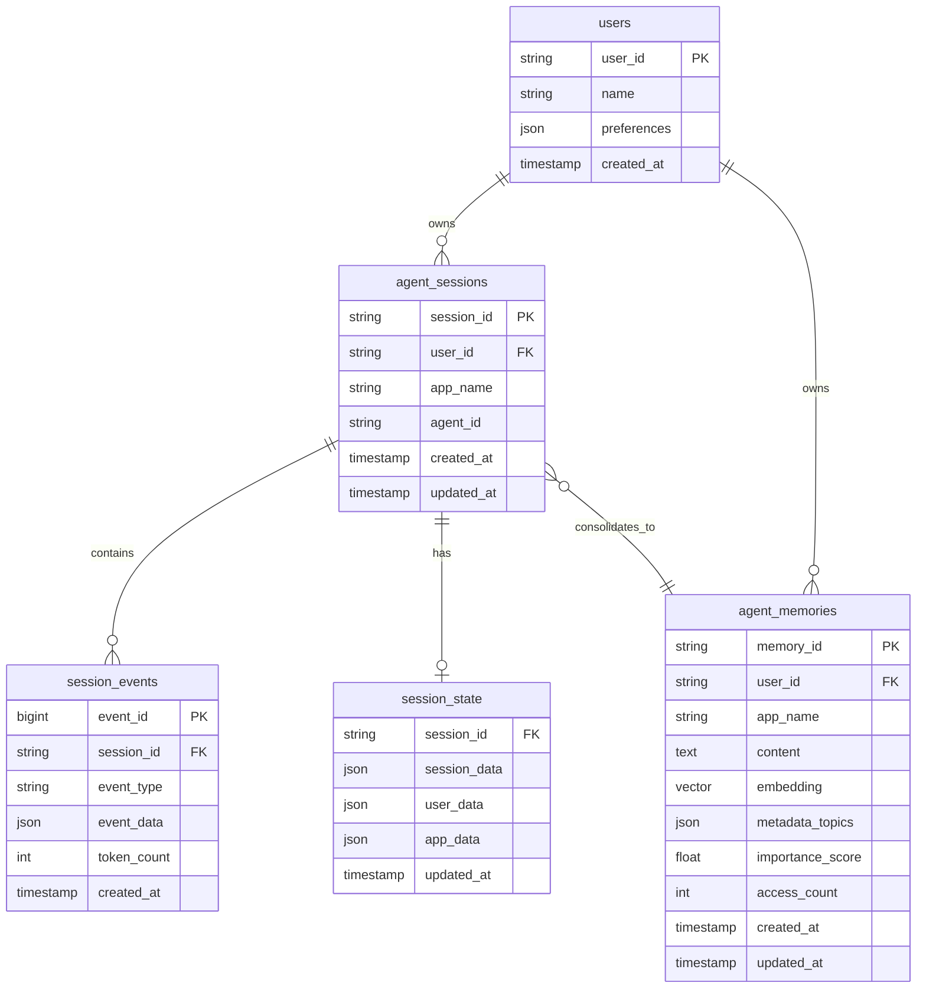

## 4. 工程验证

### 4.1 Unified Context Store (PGVector)

基于调研，建议以下统一 Schema 设计：



### 4.2 Unified Service Interface

```python
# Agentic AI Engine - 统一 Service 接口
from abc import ABC, abstractmethod
from typing import List, Dict, Optional

class BaseSessionService(ABC):
    """会话服务抽象基类"""

    @abstractmethod
    async def create_session(
        self, user_id: str, app_name: str, agent_id: str
    ) -> str: ...

    @abstractmethod
    async def get_session(
        self, session_id: str
    ) -> Optional[Dict]: ...

    @abstractmethod
    async def append_event(
        self, session_id: str, event_type: str, event_data: Dict
    ) -> int: ...

    @abstractmethod
    async def update_state(
        self, session_id: str, state_delta: Dict
    ) -> None: ...

class BaseMemoryService(ABC):
    """记忆服务抽象基类"""

    @abstractmethod
    async def add_memory(
        self, user_id: str, content: str, topics: List[str], importance: float
    ) -> str: ...

    @abstractmethod
    async def search_memory(
        self, user_id: str, query: str, limit: int = 10
    ) -> List[Dict]: ...

    @abstractmethod
    async def update_access(
        self, memory_id: str
    ) -> None: ...

class PGSessionService(BaseSessionService):
    """PG 会话服务实现"""

    def __init__(self, connection_pool):
        self.pool = connection_pool

    async def create_session(self, user_id: str, app_name: str, agent_id: str) -> str:
        session_id = str(uuid.uuid4())
        await self.pool.execute("""
            INSERT INTO agent_sessions (session_id, user_id, app_name, agent_id)
            VALUES (?, ?, ?, ?)
        """, [session_id, user_id, app_name, agent_id])
        return session_id

    async def append_event(self, session_id: str, event_type: str, event_data: Dict) -> int:
        result = await self.pool.execute("""
            INSERT INTO session_events (session_id, event_type, event_data, token_count)
            VALUES (?, ?, ?, ?)
            RETURNING event_id
        """, [session_id, event_type, json.dumps(event_data), self._count_tokens(event_data)])
        return result[0]["event_id"]

class PGMemoryService(BaseMemoryService):
    """PG 记忆服务实现"""

    def __init__(self, connection_pool, embedding_client):
        self.pool = connection_pool
        self.embedder = embedding_client

    async def search_memory(self, user_id: str, query: str, limit: int = 10) -> List[Dict]:
        query_embedding = await self.embedder.embed(query)

        return await self.pool.execute("""
            SELECT
                memory_id, content, topics, importance_score,
                vec_l2_distance(embedding, ?) as distance
            FROM agent_memories
            WHERE user_id = ?
            ORDER BY distance ASC
            LIMIT ?
        """, [query_embedding, user_id, limit])
```

### 4.3 Unified Context Model

```python
# Agentic AI Engine 项目的 Context 定义
from dataclasses import dataclass
from typing import Dict, List, Optional
from enum import Enum

class ContextScope(Enum):
    """上下文作用域"""
    INVOCATION = "invocation"  # 单次调用
    SESSION = "session"        # 会话级别
    USER = "user"              # 用户级别
    APP = "app"                # 应用级别

@dataclass
class Context:
    """统一上下文数据结构"""
    # 系统指令
    system_instruction: str
    # 用户输入
    user_message: str
    # 对话历史（短期记忆）
    chat_history: List[Dict]
    # 长期记忆
    memories: List[Dict]
    # 检索到的知识（RAG）
    knowledge: List[Dict]
    # 工具定义
    tools: List[Dict]
    # 状态
    state: Dict
    # 作用域
    scope: ContextScope
```

### 4.4 Unified Context Collection

```python
# Agentic AI Engine - 统一上下文收集器
from typing import List, Dict, Optional
from dataclasses import dataclass

@dataclass
class CollectionConfig:
    """收集配置"""
    include_system_instruction: bool = True
    include_chat_history: bool = True
    max_history_turns: int = 10
    include_memories: bool = True
    max_memories: int = 5
    include_knowledge: bool = True
    max_knowledge_chunks: int = 3

class ContextCollector:
    """统一上下文收集器"""

    def __init__(
        self,
        session_service,      # 会话服务
        memory_service,       # 记忆服务
        knowledge_service,    # 知识服务
        config: CollectionConfig = None
    ):
        self.session_service = session_service
        self.memory_service = memory_service
        self.knowledge_service = knowledge_service
        self.config = config or CollectionConfig()

    async def collect(
        self,
        user_id: str,
        session_id: str,
        user_message: str,
        agent_config: Dict
    ) -> Context:
        """收集完整上下文"""

        # 1. 系统指令（来自 Agent 配置）
        system_instruction = agent_config.get("system_instruction", "")

        # 2. 对话历史（短期记忆）
        chat_history = []
        if self.config.include_chat_history:
            session = await self.session_service.get_session(
                user_id=user_id,
                session_id=session_id
            )
            chat_history = session.events[-self.config.max_history_turns:]

        # 3. 长期记忆
        memories = []
        if self.config.include_memories:
            memories = await self.memory_service.search_memory(
                user_id=user_id,
                query=user_message,
                limit=self.config.max_memories
            )

        # 4. 知识检索 (RAG)
        knowledge = []
        if self.config.include_knowledge:
            knowledge = await self.knowledge_service.search(
                query=user_message,
                limit=self.config.max_knowledge_chunks
            )

        return Context(
            system_instruction=system_instruction,
            user_message=user_message,
            chat_history=chat_history,
            memories=memories,
            knowledge=knowledge,
            tools=agent_config.get("tools", []),
            state=session.state if session else {},
            scope=ContextScope.SESSION
        )
```

### 4.5 Unified Context Management

```python
# Agentic AI Engine - 统一上下文管理器
from enum import Enum
from typing import List, Dict

class CompressionStrategy(Enum):
    NONE = "none"
    TRIM = "trim"
    SUMMARIZE = "summarize"
    SLIDING_WINDOW = "sliding_window"

class ContextManager:
    """统一上下文管理器"""

    def __init__(
        self,
        pg_client,
        llm_client,
        compression_strategy: CompressionStrategy = CompressionStrategy.SLIDING_WINDOW,
        max_context_tokens: int = 8000,
        window_size: int = 10,
        overlap_size: int = 2
    ):
        self.db = pg_client
        self.llm = llm_client
        self.strategy = compression_strategy
        self.max_tokens = max_context_tokens
        self.window_size = window_size
        self.overlap_size = overlap_size

    async def compress_history(
        self,
        session_id: str,
        events: List[Dict]
    ) -> List[Dict]:
        """压缩对话历史"""

        if self.strategy == CompressionStrategy.NONE:
            return events

        if self.strategy == CompressionStrategy.TRIM:
            return events[-self.window_size:]

        if self.strategy == CompressionStrategy.SUMMARIZE:
            # 获取需要摘要的老事件
            old_events = events[:-self.window_size]
            recent_events = events[-self.window_size:]

            if old_events:
                summary = await self._generate_summary(old_events)
                return [{"type": "summary", "content": summary}] + recent_events
            return recent_events

        if self.strategy == CompressionStrategy.SLIDING_WINDOW:
            # ADK 风格的滑动窗口
            if len(events) <= self.window_size:
                return events

            # 分批次管理
            batches = []
            for i in range(0, len(events) - self.window_size, self.window_size - self.overlap_size):
                batch = events[i:i + self.window_size]
                summary = await self._generate_summary(batch)
                batches.append({"type": "summary", "content": summary})

            # 最后一个窗口保留完整
            batches.extend(events[-self.window_size:])
            return batches

    async def transfer_to_long_term(
        self,
        user_id: str,
        session_id: str,
        events: List[Dict]
    ) -> List[str]:
        """记忆迁移：短期 → 长期"""

        # 使用 LLM 提取重要信息
        insights = await self._extract_insights(events)

        memory_ids = []
        for insight in insights:
            # 向量化并存储
            embedding = await self._embed(insight["content"])

            memory_id = await self.db.execute("""
                INSERT INTO agent_memories
                (user_id, content, embedding, importance_score, topics)
                VALUES (?, ?, ?, ?, ?)
                RETURNING memory_id
            """, [
                user_id,
                insight["content"],
                embedding,
                insight["importance"],
                insight["topics"]
            ])
            memory_ids.append(memory_id)

        return memory_ids

    async def _generate_summary(self, events: List[Dict]) -> str:
        """生成摘要"""
        prompt = f"Summarize the following conversation:\n{events}"
        return await self.llm.generate(prompt)

    async def _extract_insights(self, events: List[Dict]) -> List[Dict]:
        """提取重要洞察"""
        prompt = f"""Extract important user preferences, facts, and learnings from this conversation.
        Return as JSON list with fields: content, importance (0-1), topics (list).
        Conversation: {events}"""
        return await self.llm.generate_json(prompt)
```

### 4.6 Context Usage - Hibrid Search

```sql
-- 混合检索：语义相似度 + 时间邻近性 + 访问频率
SELECT
    memory_id,
    content,
    topics,
    -- 综合评分 (值越小越相关)
    (
        0.5 * vec_l2_distance(embedding, :query_embedding) +
        0.3 * (DATEDIFF(NOW(), updated_at) / 30.0) +
        0.2 * (1.0 - access_count / (SELECT MAX(access_count) FROM agent_memories WHERE user_id = :user_id))
    ) AS relevance_score
FROM agent_memories
WHERE user_id = :user_id
  AND app_name = :app_name
  AND vec_l2_distance(embedding, :query_embedding) < 0.8
ORDER BY relevance_score ASC
LIMIT 10;
```

```python
# Agentic AI Engine - 混合检索
class HybridRetriever:
    """混合检索器：语义 + 时间 + 频率"""

    def __init__(self, pg_client):
        self.db = pg_client

    async def retrieve(
        self,
        user_id: str,
        query: str,
        query_embedding: List[float],
        weights: Dict[str, float] = None
    ) -> List[Dict]:
        """
        混合检索，支持权重调整

        Args:
            weights: {"semantic": 0.5, "recency": 0.3, "frequency": 0.2}
        """
        weights = weights or {
            "semantic": 0.5,
            "recency": 0.3,
            "frequency": 0.2
        }

        # PG 混合检索 SQL
        result = await self.db.execute("""
            SELECT
                memory_id,
                content,
                topics,
                -- 综合评分
                (
                    ? * (1 - vec_l2_distance(embedding, ?)) +
                    ? * (1 - DATEDIFF(NOW(), updated_at) / 30.0) +
                    ? * (access_count / (SELECT MAX(access_count) FROM agent_memories WHERE user_id = ?))
                ) AS relevance_score
            FROM agent_memories
            WHERE user_id = ?
              AND vec_l2_distance(embedding, ?) < 0.8
            ORDER BY relevance_score DESC
            LIMIT 10
        """, [
            weights["semantic"], query_embedding,
            weights["recency"],
            weights["frequency"], user_id,
            user_id,
            query_embedding
        ])

        return result
```

### 4.7 Context Usage - Proactive Intent Inference

```python
# Agentic AI Engine - 意图推断器
class IntentInferrer:
    """主动意图推断器"""

    def __init__(self, llm_client, memory_service):
        self.llm = llm_client
        self.memory = memory_service

    async def infer_hidden_intent(
        self,
        user_id: str,
        current_query: str,
        chat_history: List[Dict]
    ) -> Dict:
        """推断用户隐藏意图"""

        # 检索用户偏好
        preferences = await self.memory.search_memory(
            user_id=user_id,
            query="user preferences and habits"
        )

        prompt = f"""Analyze the user's query and conversation history to infer their hidden intent.

User Query: {current_query}

Recent Conversation:
{chat_history}

Known User Preferences:
{preferences}

Infer:
1. Explicit Intent: What the user is directly asking for
2. Hidden Intent: What the user might actually need but didn't explicitly say
3. Potential Follow-ups: What the user might ask next
4. Proactive Suggestions: What help we can offer proactively

Return as JSON.
"""
        return await self.llm.generate_json(prompt)
```

### 4.8 Context Usage - Dynamic Context Assembly

```python
# Agentic AI Engine - 动态上下文组装器
from typing import List, Dict, Optional
import tiktoken

class ContextAssembler:
    """动态上下文组装器"""

    def __init__(
        self,
        max_tokens: int = 8000,
        reserved_output_tokens: int = 1000,
        tokenizer: str = "cl100k_base"
    ):
        self.max_tokens = max_tokens
        self.reserved = reserved_output_tokens
        self.encoding = tiktoken.get_encoding(tokenizer)

        # 各部分优先级（数字越小优先级越高）
        self.priorities = {
            "system_instruction": 1,
            "tools": 2,
            "user_message": 3,
            "memories": 4,
            "knowledge": 5,
            "chat_history": 6
        }

    def count_tokens(self, text: str) -> int:
        return len(self.encoding.encode(text))

    def assemble(self, context: Context) -> str:
        """组装最终上下文"""

        available_tokens = self.max_tokens - self.reserved
        components = []
        used_tokens = 0

        # 按优先级排序组装
        parts = [
            ("system_instruction", context.system_instruction),
            ("tools", self._format_tools(context.tools)),
            ("user_message", context.user_message),
            ("memories", self._format_memories(context.memories)),
            ("knowledge", self._format_knowledge(context.knowledge)),
            ("chat_history", self._format_history(context.chat_history)),
        ]

        parts.sort(key=lambda x: self.priorities[x[0]])

        for name, content in parts:
            tokens_needed = self.count_tokens(content)

            if used_tokens + tokens_needed <= available_tokens:
                components.append((name, content))
                used_tokens += tokens_needed
            else:
                # 尝试截断
                remaining = available_tokens - used_tokens
                truncated = self._truncate(content, remaining)
                if truncated:
                    components.append((name, truncated))
                    used_tokens += self.count_tokens(truncated)
                break

        return self._format_prompt(components)

    def _format_prompt(self, components: List[tuple]) -> str:
        """格式化最终 Prompt"""
        sections = {
            "system_instruction": "## System Instructions\n{content}\n",
            "tools": "## Available Tools\n{content}\n",
            "memories": "## Relevant Memories\n{content}\n",
            "knowledge": "## Retrieved Knowledge\n{content}\n",
            "chat_history": "## Conversation History\n{content}\n",
            "user_message": "## Current User Message\n{content}\n",
        }

        result = []
        for name, content in components:
            if content and name in sections:
                result.append(sections[name].format(content=content))

        return "\n".join(result)

    def _truncate(self, text: str, max_tokens: int) -> str:
        """智能截断"""
        tokens = self.encoding.encode(text)
        if len(tokens) <= max_tokens:
            return text
        return self.encoding.decode(tokens[:max_tokens]) + "..."
```
