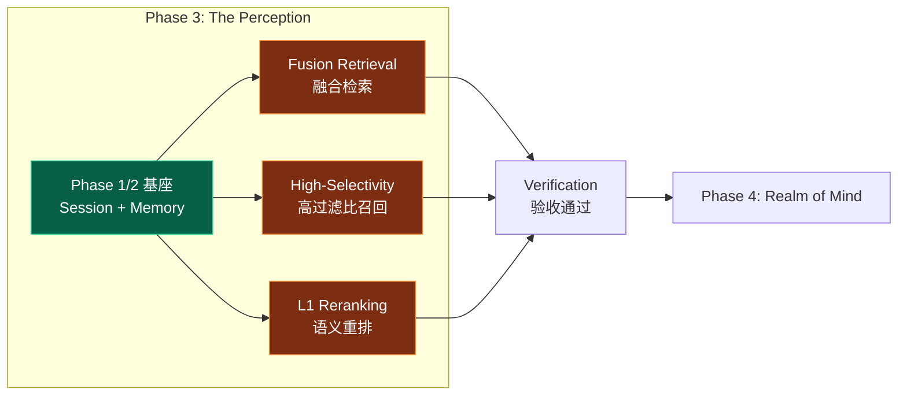
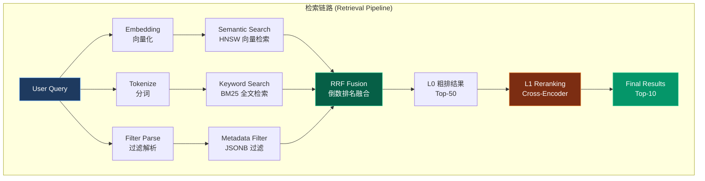
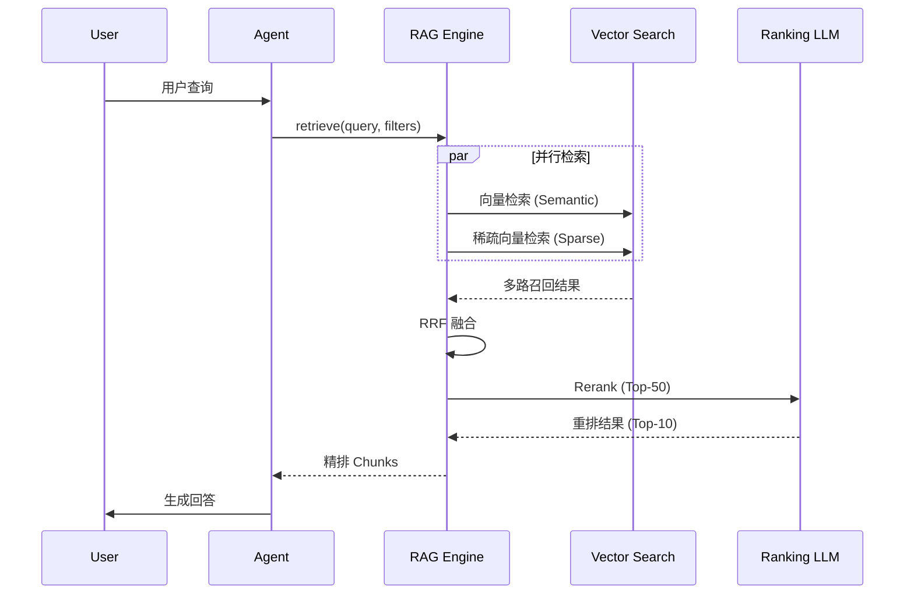
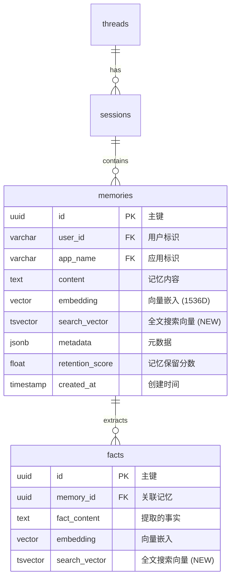

> [!NOTE]
>
> **文档定位**：本文档是 [000-roadmap.md](./000-roadmap.md) Phase 3 的详细工程实施方案，用于指导「**The Perception (神经感知)**」的完整落地验证工作。涵盖技术调研、架构设计、代码实现、测试验证等全流程。
>
> **前置依赖**：本阶段依赖 [010-the-pulse.md](./010-the-pulse.md) Phase 1 和 [020-the-hippocampus.md](./020-the-hippocampus.md) Phase 2 的完成，需复用其统一存储基座 (Unified Schema) 和记忆管理能力。

---

## 1. 执行概览

### 1.1 Phase 3 定位与目标

**Phase 3: The Perception** 是整个验证计划的检索核心阶段，对标人类大脑的**感知系统 (Perception System)** —— 负责从海量信息中快速定位和识别目标的神经中枢。核心目标是：

1. **构建 One-Shot Integrated 检索链路**：实现单次 SQL 查询融合 Semantic (向量) + Keyword (BM25) + Structural (元数据) 三种检索信号
2. **验证 RRF 融合算法**：实现 Reciprocal Rank Fusion 算法，合并多路召回结果
3. **验证高过滤比场景**：验证 HNSW 迭代扫描在 99% 过滤比下的召回率与性能
4. **验证 L1 Reranking**：集成轻量级 Cross-Encoder 模型，提升检索精度



### 1.2 核心概念解析

#### 1.2.1 检索信号类型

The Perception 的核心是将三种正交的检索信号融合为统一的检索结果：

| 检索信号     | 定义                            | 适用场景           | PostgreSQL 实现                          |
| :----------- | :------------------------------ | :----------------- | :--------------------------------------- |
| **Semantic** | 语义相似度检索（向量距离）      | 语义理解、概念匹配 | `embedding <=> query_embedding` (HNSW)   |
| **Keyword**  | 关键词匹配检索（BM25/全文搜索） | 精确词汇、技术术语 | `to_tsvector @@ plainto_tsquery` (GIN)   |
| **Metadata** | 结构化元数据过滤（JSONB/标量）  | 权限控制、时间范围 | `metadata @> '{"key": "value"}'` (BTREE) |

#### 1.2.2 检索链路架构



#### 1.2.3 Two-Stage Retrieval (两阶段检索)

> [!IMPORTANT]
>
> **对标 Roadmap Pillar III**：The Perception 采用两阶段检索架构，实现「粗排 (L0)」与「精排 (L1)」的分离。

| 阶段        | 定义             | 技术实现            | 目标                        |
| :---------- | :--------------- | :------------------ | :-------------------------- |
| **L0 粗排** | 数据库层融合检索 | PostgreSQL One-Shot | 高召回率 (Recall@50 > 95%)  |
| **L1 精排** | 应用层语义重排   | Cross-Encoder Model | 高精度 (Precision@10 > 90%) |

### 1.3 对标分析：Google RAG Engine

基于 Google Vertex AI RAG Engine 和 ADK 文档<sup>[[1]](#ref1)</sup>的分析，我们需要复刻以下核心能力：

| Google 核心能力             | 定义                    | PostgreSQL 复刻策略       |
| :-------------------------- | :---------------------- | :------------------------ |
| **Vertex AI Vector Search** | 托管向量检索服务        | PGVector HNSW 索引        |
| **RAG Corpus**              | 检索语料库管理          | `memories` + `facts` 表   |
| **Hybrid Retrieval**        | 向量 + 稀疏向量混合检索 | `DBMS_HYBRID_SEARCH` 函数 |
| **Ranking API**             | LLM 驱动的重排服务      | Cross-Encoder 本地推理    |
| **Filter-Based Retrieval**  | 元数据过滤检索          | JSONB 条件 + 部分索引     |

#### 1.3.1 Google RAG Pipeline 对标



**关键洞察**：

1. **并行召回**：向量检索与关键词检索并行执行，减少总延迟
2. **两阶段排序**：L0 (RRF) + L1 (Rerank) 分层处理，平衡效率与精度
3. **动态过滤**：元数据过滤与检索融合，而非后置过滤

### 1.4 任务-章节对照表

> [!NOTE]
>
> 以下表格将 [001-task-checklist.md](./001-task-checklist.md) 的任务 ID 与本文档章节进行对照，便于追踪执行进度。

| 任务模块          | 任务 ID 范围    | 对应章节                                                                        |
| :---------------- | :-------------- | :------------------------------------------------------------------------------ |
| Hybrid Search SQL | P3-1-1 ~ P3-1-5 | [4.1 Step 1: Fusion Retrieval 实现](#41-step-1-fusion-retrieval-实现)           |
| RRF 融合算法      | P3-1-6 ~ P3-1-9 | [4.1.2 RRF 融合算法](#412-rrf-融合算法-reciprocal-rank-fusion)                  |
| High-Selectivity  | P3-2-1 ~ P3-2-4 | [4.2 Step 2: High-Selectivity Filtering](#42-step-2-high-selectivity-filtering) |
| L1 Reranking      | P3-2-5 ~ P3-2-8 | [4.3 Step 3: L1 Reranking 实现](#43-step-3-l1-reranking-实现)                   |
| 验收与文档        | P3-3-1 ~ P3-3-4 | [5. 验收标准](#5-验收标准) + [6. 交付物](#6-交付物清单)                         |

### 1.5 工期规划

| 阶段 | 任务模块         | 任务 ID         | 预估工期 | 交付物                         |
| :--- | :--------------- | :-------------- | :------- | :----------------------------- |
| 3.1  | Fusion Retrieval | P3-1-1 ~ P3-1-9 | 0.5 Day  | `hybrid_search.sql` + RRF 函数 |
| 3.2  | High-Selectivity | P3-2-1 ~ P3-2-4 | 0.25 Day | 迭代扫描配置 + 性能基准报告    |
| 3.3  | L1 Reranking     | P3-2-5 ~ P3-2-8 | 0.25 Day | `reranker.py` + Precision 验证 |
| 3.4  | 测试与验收       | P3-3-1 ~ P3-3-4 | 0.25 Day | 测试报告 + 技术文档            |

---

## 2. 技术调研：检索机制深度分析

### 2.1 混合检索策略对比

现代 RAG 系统普遍采用混合检索策略<sup>[[2]](#ref2)</sup>，结合向量检索和关键词检索的优势：

| 检索类型       | 优势                       | 劣势                             | 典型场景           |
| :------------- | :------------------------- | :------------------------------- | :----------------- |
| **向量检索**   | 语义理解强，泛化能力好     | 对精确词汇匹配弱，可能"语义漂移" | 概念查询、同义转换 |
| **关键词检索** | 精确匹配，对专业术语敏感   | 缺乏语义理解，对同义词无力       | 代码搜索、术语查询 |
| **混合检索**   | 综合两者优势，覆盖更多场景 | 实现复杂度高，需要融合策略       | 企业 RAG、通用搜索 |

#### 2.1.1 PostgreSQL 混合检索能力

PostgreSQL 天然支持混合检索，无需外部系统拼接：

```sql
-- One-Shot 混合检索示例
SELECT id, content,
    -- 向量相似度分数 (转为 0-1 范围)
    1 - (embedding <=> $query_embedding) AS semantic_score,
    -- BM25 全文匹配分数
    ts_rank_cd(search_vector, plainto_tsquery($query)) AS keyword_score
FROM memories
WHERE
    -- 元数据过滤
    app_name = $app_name AND user_id = $user_id
    -- 可选：关键词必须匹配
    AND search_vector @@ plainto_tsquery($query)
ORDER BY
    -- 融合排序 (可替换为 RRF)
    semantic_score * 0.7 + keyword_score * 0.3 DESC
LIMIT 50;
```

### 2.2 RRF 算法原理

**Reciprocal Rank Fusion (RRF)** 是一种无参数的多路召回融合算法<sup>[[3]](#ref3)</sup>，其核心思想是：

> **排名靠前的文档，无论来自哪个检索器，都应该获得更高的融合分数。**

#### 2.2.1 RRF 数学公式

$$
\text{RRF}(d) = \sum_{r \in R} \frac{1}{k + r(d)}
$$

其中：

- $d$ 是文档
- $R$ 是所有检索器的排名列表
- $r(d)$ 是文档 $d$ 在检索器中的排名 (从 1 开始)
- $k$ 是平滑常数 (通常取 60)

#### 2.2.2 RRF 示例计算

| 文档 | 向量检索排名 | 关键词检索排名 | RRF 分数 (k=60)              |
| :--- | :----------- | :------------- | :--------------------------- |
| A    | 1            | 3              | 1/(60+1) + 1/(60+3) = 0.0325 |
| B    | 2            | 1              | 1/(60+2) + 1/(60+1) = 0.0325 |
| C    | 3            | 2              | 1/(60+3) + 1/(60+2) = 0.0322 |
| D    | 5            | -              | 1/(60+5) = 0.0154            |

**观察**：文档 A 和 B 的 RRF 分数相同，说明 RRF 对不同检索器的排名给予等权重。

### 2.3 高过滤比检索问题

> [!WARNING]
>
> **High-Selectivity Filtering 陷阱**：当过滤条件非常严格 (如 `user_id = 'xxx'` 仅匹配 1% 数据) 时，向量索引的 Top-K 召回可能不包含任何符合过滤条件的结果！

#### 2.3.1 问题场景

```sql
-- 场景：用户 'alice' 只有 100 条记忆，总表有 100 万条
-- 问题：HNSW 默认的 ef_search=40 可能只扫描到其他用户的数据

SELECT * FROM memories
WHERE user_id = 'alice'  -- 仅 0.01% 的数据
ORDER BY embedding <=> $query LIMIT 10;

-- 结果：可能返回 0 条数据！
```

#### 2.3.2 解决方案：迭代索引扫描

PGVector 0.8.0+ 引入了 **Iterative Index Scan**<sup>[[4]](#ref4)</sup>，自动扩大检索范围直到满足 LIMIT：

```sql
-- 开启迭代扫描
SET hnsw.iterative_scan = relaxed_order;
SET hnsw.max_scan_tuples = 20000;  -- 最大扫描元组数

-- 现在会自动扩展检索，直到找到 10 条符合条件的结果
SELECT * FROM memories
WHERE user_id = 'alice'
ORDER BY embedding <=> $query LIMIT 10;
```

### 2.4 Reranking 技术栈

L1 Reranking 使用 Cross-Encoder 模型对粗排结果进行精排<sup>[[5]](#ref5)</sup>：

| 模型类型          | 特点                              | 推理速度 | 精度   |
| :---------------- | :-------------------------------- | :------- | :----- |
| **Bi-Encoder**    | Query 和 Doc 分别编码，可预计算   | ⚡ 极快  | 中等   |
| **Cross-Encoder** | Query 和 Doc 联合编码，不可预计算 | 🐢 较慢  | **高** |

> [!TIP]
>
> **两阶段检索的本质**：用 Bi-Encoder (向量检索) 快速召回候选，用 Cross-Encoder 精细排序。

#### 2.4.1 推荐 Reranker 模型

| 模型                       | 参数量 | 语言支持 | 推理速度 | 推荐场景     |
| :------------------------- | :----- | :------- | :------- | :----------- |
| `BAAI/bge-reranker-base`   | 278M   | 中英     | 中等     | **推荐首选** |
| `BAAI/bge-reranker-v2-m3`  | 568M   | 多语言   | 较慢     | 多语言场景   |
| `cross-encoder/ms-marco-*` | 66M    | 英文     | 快       | 英文专用     |
| `jinaai/jina-reranker-v2`  | 137M   | 多语言   | 中等     | API 友好     |

### 2.5 调研交付物摘要

> [!NOTE]
>
> 本节对应任务 **P3-1-6** (理解 RRF 算法原理) 的调研交付物。

#### 2.5.1 检索策略对比表

| 评估维度       | 纯向量检索 | 纯关键词检索 | 混合检索 (RRF) |
| :------------- | :--------- | :----------- | :------------- |
| **语义理解**   | ⭐⭐⭐     | ⭐           | ⭐⭐⭐         |
| **精确匹配**   | ⭐         | ⭐⭐⭐       | ⭐⭐⭐         |
| **实现复杂度** | ⭐         | ⭐           | ⭐⭐           |
| **召回率**     | 中等       | 中等         | **高**         |
| **适用场景**   | 概念搜索   | 术语搜索     | **通用 RAG**   |

#### 2.5.2 PostgreSQL vs 专用向量库对比

| 维度           | PostgreSQL + PGVector | Milvus / Weaviate |
| :------------- | :-------------------- | :---------------- |
| **混合检索**   | ✅ One-Shot SQL       | ⚠️ 需应用层拼接   |
| **事务支持**   | ✅ 完整 ACID          | ❌ 有限           |
| **元数据过滤** | ✅ 原生 SQL           | ⚠️ 专用 DSL       |
| **运维复杂度** | ⭐ (已有 PG)          | ⭐⭐⭐ (新增组件) |
| **极端规模**   | 亿级需调优            | 设计目标即为亿级  |

---

## 3. 架构设计：Perception Schema

### 3.1 与 Phase 2 的架构关联

> [!NOTE]
>
> **Zero-ETL 策略延续**：The Perception 完全复用 Phase 2 (Hippocampus) 已建立的 `memories` 和 `facts` 表，无需新增核心表，仅需添加全文搜索支持。这是 "Just use PostgreSQL" 策略的核心体现。

#### 3.1.1 Perception ER 图



**关键说明**：

| 列              | 来源    | 用途                       | 索引类型    |
| :-------------- | :------ | :------------------------- | :---------- |
| `embedding`     | Phase 2 | Semantic Search (向量检索) | HNSW        |
| `search_vector` | **NEW** | Keyword Search (BM25 全文) | GIN         |
| `metadata`      | Phase 2 | Structural Filter (元数据) | BTREE / GIN |

### 3.2 Schema 扩展：全文搜索

#### 3.2.1 新增 tsvector 列

```sql
-- 在 memories 表添加全文搜索向量列
ALTER TABLE memories ADD COLUMN IF NOT EXISTS
    search_vector tsvector;

-- 创建触发器自动更新 search_vector
CREATE OR REPLACE FUNCTION memories_search_vector_trigger()
RETURNS trigger AS $$
BEGIN
    NEW.search_vector := to_tsvector('english', COALESCE(NEW.content, ''));
    RETURN NEW;
END;
$$ LANGUAGE plpgsql;

CREATE TRIGGER trigger_memories_search_vector
    BEFORE INSERT OR UPDATE ON memories
    FOR EACH ROW
    EXECUTE FUNCTION memories_search_vector_trigger();

-- 创建 GIN 索引加速全文搜索
CREATE INDEX IF NOT EXISTS idx_memories_search_vector
    ON memories USING GIN (search_vector);
```

### 3.3 JSONB Complex Predicates 设计

> [!IMPORTANT]
>
> **对标 Roadmap Pillar III**: Complex Predicates 支持基于 JSONB 的任意深度的布尔逻辑过滤，是 The Perception 区别于简单向量检索的核心能力。

#### 3.3.1 JSONB 过滤语法参考

| 场景             | SQL 语法                                      | 说明                     |
| :--------------- | :-------------------------------------------- | :----------------------- | ------------ |
| **简单键值匹配** | `metadata @> '{"type": "note"}'`              | 包含指定键值对           |
| **嵌套对象匹配** | `metadata @> '{"author": {"role": "admin"}}'` | 任意深度嵌套             |
| **数组元素包含** | `metadata @> '{"tags": ["important"]}'`       | 数组包含指定元素         |
| **路径取值比较** | `metadata->'author'->>'role' = 'admin'`       | 提取路径值进行比较       |
| **数值范围过滤** | `(metadata->>'priority')::int > 5`            | 类型转换后数值比较       |
| **存在性检查**   | `metadata ? 'urgent'`                         | 检查 key 是否存在        |
| **多键存在检查** | `metadata ?& array['type', 'status']`         | 同时存在多个 key         |
| **任一键存在**   | `metadata ?                                   | array['vip', 'premium']` | 存在任一 key |

#### 3.3.2 主流业务场景示例

> [!NOTE]
>
> 以下业务场景经过正交分析，覆盖 RAG 系统的主流过滤需求维度。

##### 场景 1：多租户隔离 (Multi-Tenant Isolation)

```sql
-- 业务需求：SaaS 平台中每个租户只能检索自己的知识库
-- 过滤条件：tenant_id (强过滤，高选择性)
SELECT id, content, embedding <=> $query_embedding AS distance
FROM memories
WHERE
    metadata @> '{"tenant_id": "org_acme_corp"}'
    AND user_id = $user_id
ORDER BY embedding <=> $query_embedding
LIMIT 10;

-- 优化：为高频租户创建部分索引
CREATE INDEX idx_memories_tenant_acme
    ON memories USING hnsw (embedding vector_cosine_ops)
    WHERE metadata @> '{"tenant_id": "org_acme_corp"}';
```

##### 场景 2：权限控制 (Access Control)

```sql
-- 业务需求：根据用户角色过滤可访问的知识
-- 过滤条件：access_level, department (组合条件)
SELECT id, content, embedding <=> $query_embedding AS distance
FROM memories
WHERE
    -- 访问级别检查：用户级别 >= 文档级别
    (metadata->>'access_level')::int <= $user_access_level
    -- 部门归属检查：用户所属部门或公开文档
    AND (
        metadata @> '{"visibility": "public"}'
        OR metadata->'departments' @> $user_department::jsonb
    )
ORDER BY embedding <=> $query_embedding
LIMIT 10;
```

##### 场景 3：时间范围过滤 (Time-Based Filtering)

```sql
-- 业务需求：只检索特定时间段内的记忆
-- 过滤条件：created_at, updated_at (范围过滤)
SELECT id, content, embedding <=> $query_embedding AS distance
FROM memories
WHERE
    -- 时间范围过滤
    created_at >= $start_time AND created_at <= $end_time
    -- 可选：只要最近更新的
    AND (updated_at IS NULL OR updated_at >= NOW() - INTERVAL '7 days')
    -- 元数据时间戳过滤（存储在 JSONB 中的业务时间）
    AND (metadata->>'event_time')::timestamp >= $event_start
ORDER BY embedding <=> $query_embedding
LIMIT 10;

-- 优化：创建复合索引覆盖时间范围查询
CREATE INDEX idx_memories_created_at_embedding
    ON memories (created_at DESC, user_id);
```

##### 场景 4：标签系统 (Tag-Based Filtering)

```sql
-- 业务需求：根据标签组合过滤知识
-- 过滤条件：tags 数组 (包含/排除逻辑)
SELECT id, content, embedding <=> $query_embedding AS distance
FROM memories
WHERE
    -- 必须包含所有指定标签 (AND 语义)
    metadata @> '{"tags": ["machine-learning", "research"]}'
    -- 排除特定标签
    AND NOT metadata @> '{"tags": ["deprecated"]}'
    -- 可选：包含任一标签 (OR 语义，需应用层处理)
ORDER BY embedding <=> $query_embedding
LIMIT 10;

-- 优化：GIN 索引支持数组包含查询
CREATE INDEX idx_memories_tags
    ON memories USING GIN ((metadata->'tags'));
```

##### 场景 5：复合条件与优先级 (Complex Business Logic)

```sql
-- 业务需求：企业知识库的复杂检索条件
-- 过滤条件：多维度组合 (角色 + 状态 + 类型 + 优先级)
SELECT id, content, embedding <=> $query_embedding AS distance
FROM memories
WHERE
    -- 文档类型
    metadata @> '{"doc_type": "policy"}'
    -- 状态：已发布
    AND metadata @> '{"status": "published"}'
    -- 创建者角色：管理员或专家
    AND (
        metadata @> '{"author": {"role": "admin"}}'
        OR metadata @> '{"author": {"role": "expert"}}'
    )
    -- 优先级 >= 高
    AND (metadata->>'priority')::int >= 3
    -- 未过期
    AND (
        metadata->>'expires_at' IS NULL
        OR (metadata->>'expires_at')::timestamp > NOW()
    )
ORDER BY embedding <=> $query_embedding
LIMIT 10;
```

#### 3.3.3 JSONB 索引策略

```sql
-- 1. GIN 索引：支持 @>、?、?&、?| 操作符
CREATE INDEX idx_memories_metadata_gin
    ON memories USING GIN (metadata);

-- 2. 表达式索引：针对高频查询路径
-- 场景：频繁按 author.role 过滤
CREATE INDEX idx_memories_author_role
    ON memories ((metadata->'author'->>'role'));

-- 3. 部分索引：针对特定业务场景
-- 场景：仅索引 admin 用户的记忆（减少索引大小）
CREATE INDEX idx_memories_admin_only
    ON memories USING hnsw (embedding vector_cosine_ops)
    WHERE metadata @> '{"author": {"role": "admin"}}';
```

### 3.4 索引策略设计

> [!IMPORTANT]
>
> **三重索引策略**：为支持 One-Shot Hybrid Search，需要同时维护三类索引。

| 索引类型     | 目标列                | 索引算法 | 用途            |
| :----------- | :-------------------- | :------- | :-------------- |
| **向量索引** | `embedding`           | HNSW     | 语义相似度检索  |
| **全文索引** | `search_vector`       | GIN      | BM25 关键词检索 |
| **标量索引** | `user_id`, etc.       | BTREE    | 元数据过滤      |
| **复合索引** | `(user_id, app_name)` | BTREE    | 高频过滤场景    |

### 3.3 核心 SQL 函数设计

#### 3.3.1 One-Shot Hybrid Search 函数

```sql
-- 核心函数：One-Shot 混合检索
CREATE OR REPLACE FUNCTION hybrid_search(
    p_user_id VARCHAR(255),
    p_app_name VARCHAR(255),
    p_query TEXT,
    p_query_embedding vector(1536),
    p_limit INTEGER DEFAULT 50,
    p_semantic_weight FLOAT DEFAULT 0.7,
    p_keyword_weight FLOAT DEFAULT 0.3,
    p_metadata_filter JSONB DEFAULT NULL
)
RETURNS TABLE (
    id UUID,
    content TEXT,
    semantic_score FLOAT,
    keyword_score FLOAT,
    combined_score FLOAT,
    metadata JSONB
) AS $$
BEGIN
    RETURN QUERY
    WITH
    -- 1. 语义检索 (向量)
    semantic_results AS (
        SELECT
            m.id,
            m.content,
            1 - (m.embedding <=> p_query_embedding) AS score,
            m.metadata
        FROM memories m
        WHERE m.user_id = p_user_id
          AND m.app_name = p_app_name
          AND (p_metadata_filter IS NULL OR m.metadata @> p_metadata_filter)
        ORDER BY m.embedding <=> p_query_embedding
        LIMIT p_limit * 2  -- 召回 2 倍用于融合
    ),
    -- 2. 关键词检索 (BM25)
    keyword_results AS (
        SELECT
            m.id,
            m.content,
            ts_rank_cd(m.search_vector, plainto_tsquery('english', p_query)) AS score,
            m.metadata
        FROM memories m
        WHERE m.user_id = p_user_id
          AND m.app_name = p_app_name
          AND m.search_vector @@ plainto_tsquery('english', p_query)
          AND (p_metadata_filter IS NULL OR m.metadata @> p_metadata_filter)
        ORDER BY score DESC
        LIMIT p_limit * 2
    ),
    -- 3. 合并去重
    combined AS (
        SELECT
            COALESCE(s.id, k.id) AS id,
            COALESCE(s.content, k.content) AS content,
            COALESCE(s.score, 0) AS semantic_score,
            COALESCE(k.score, 0) AS keyword_score,
            COALESCE(s.metadata, k.metadata) AS metadata
        FROM semantic_results s
        FULL OUTER JOIN keyword_results k ON s.id = k.id
    )
    -- 4. 加权融合排序
    SELECT
        c.id,
        c.content,
        c.semantic_score,
        c.keyword_score,
        (c.semantic_score * p_semantic_weight + c.keyword_score * p_keyword_weight) AS combined_score,
        c.metadata
    FROM combined c
    ORDER BY combined_score DESC
    LIMIT p_limit;
END;
$$ LANGUAGE plpgsql;
```

#### 3.3.2 RRF 融合函数

```sql
-- RRF (Reciprocal Rank Fusion) 融合函数
CREATE OR REPLACE FUNCTION rrf_search(
    p_user_id VARCHAR(255),
    p_app_name VARCHAR(255),
    p_query TEXT,
    p_query_embedding vector(1536),
    p_limit INTEGER DEFAULT 50,
    p_k INTEGER DEFAULT 60  -- RRF 平滑常数
)
RETURNS TABLE (
    id UUID,
    content TEXT,
    rrf_score FLOAT,
    semantic_rank INTEGER,
    keyword_rank INTEGER,
    metadata JSONB
) AS $$
BEGIN
    RETURN QUERY
    WITH
    -- 1. 语义检索 + 排名
    semantic_ranked AS (
        SELECT
            m.id, m.content, m.metadata,
            ROW_NUMBER() OVER (ORDER BY m.embedding <=> p_query_embedding) AS rank
        FROM memories m
        WHERE m.user_id = p_user_id AND m.app_name = p_app_name
        ORDER BY m.embedding <=> p_query_embedding
        LIMIT p_limit * 3
    ),
    -- 2. 关键词检索 + 排名
    keyword_ranked AS (
        SELECT
            m.id, m.content, m.metadata,
            ROW_NUMBER() OVER (
                ORDER BY ts_rank_cd(m.search_vector, plainto_tsquery('english', p_query)) DESC
            ) AS rank
        FROM memories m
        WHERE m.user_id = p_user_id
          AND m.app_name = p_app_name
          AND m.search_vector @@ plainto_tsquery('english', p_query)
        ORDER BY ts_rank_cd(m.search_vector, plainto_tsquery('english', p_query)) DESC
        LIMIT p_limit * 3
    ),
    -- 3. RRF 融合
    rrf_combined AS (
        SELECT
            COALESCE(s.id, k.id) AS id,
            COALESCE(s.content, k.content) AS content,
            COALESCE(s.metadata, k.metadata) AS metadata,
            s.rank AS semantic_rank,
            k.rank AS keyword_rank,
            -- RRF 公式: sum(1 / (k + rank))
            COALESCE(1.0 / (p_k + s.rank), 0) +
            COALESCE(1.0 / (p_k + k.rank), 0) AS rrf_score
        FROM semantic_ranked s
        FULL OUTER JOIN keyword_ranked k ON s.id = k.id
    )
    -- 4. 按 RRF 分数排序
    SELECT
        c.id,
        c.content,
        c.rrf_score,
        c.semantic_rank::INTEGER,
        c.keyword_rank::INTEGER,
        c.metadata
    FROM rrf_combined c
    ORDER BY c.rrf_score DESC
    LIMIT p_limit;
END;
$$ LANGUAGE plpgsql;
```

---

## 4. 实施计划：分步执行指南

### 4.1 Step 1: Fusion Retrieval 实现

#### 4.1.1 Schema 扩展部署

**任务清单**：

| 任务 ID | 任务描述                  | 验收标准                              |
| :------ | :------------------------ | :------------------------------------ |
| P3-1-1  | 添加 `search_vector` 列   | `ALTER TABLE` 成功                    |
| P3-1-2  | 创建 GIN 全文索引         | 索引创建成功                          |
| P3-1-3  | 编写 Semantic Search SQL  | `embedding <=> query` 语法正确        |
| P3-1-4  | 编写 Keyword Search SQL   | `to_tsvector @@ plainto_tsquery` 正确 |
| P3-1-5  | 编写 One-Shot Hybrid 函数 | `hybrid_search()` 函数创建成功        |

**Schema 扩展脚本** (`docs/practice/schema/perception_schema.sql`)：

```sql
-- ============================================
-- Agentic AI Engine - Perception Schema Extension
-- Version: 1.0
-- Target: PostgreSQL 16+ with pgvector
-- Prerequisite: Phase 2 hippocampus_schema.sql 已部署
-- ============================================

-- 1. 添加全文搜索列
ALTER TABLE memories ADD COLUMN IF NOT EXISTS
    search_vector tsvector;

-- 2. 创建触发器自动更新 search_vector
CREATE OR REPLACE FUNCTION memories_search_vector_trigger()
RETURNS trigger AS $$
BEGIN
    NEW.search_vector := to_tsvector('english', COALESCE(NEW.content, ''));
    RETURN NEW;
END;
$$ LANGUAGE plpgsql;

DROP TRIGGER IF EXISTS trigger_memories_search_vector ON memories;
CREATE TRIGGER trigger_memories_search_vector
    BEFORE INSERT OR UPDATE ON memories
    FOR EACH ROW
    EXECUTE FUNCTION memories_search_vector_trigger();

-- 3. 回填已有数据的 search_vector
UPDATE memories SET search_vector = to_tsvector('english', content)
WHERE search_vector IS NULL;

-- 4. 创建 GIN 全文索引
CREATE INDEX IF NOT EXISTS idx_memories_search_vector
    ON memories USING GIN (search_vector);

-- 5. 创建复合索引 (高频过滤场景)
CREATE INDEX IF NOT EXISTS idx_memories_user_app_created
    ON memories(user_id, app_name, created_at DESC);

-- 6. 验证索引
SELECT indexname, indexdef
FROM pg_indexes
WHERE tablename = 'memories';
```

#### 4.1.2 RRF 融合算法 (Reciprocal Rank Fusion)

**任务清单**：

| 任务 ID | 任务描述                    | 验收标准            |
| :------ | :-------------------------- | :------------------ |
| P3-1-6  | 理解 RRF 算法原理           | 算法笔记            |
| P3-1-7  | 实现 SQL 内 RRF 计算        | `rrf_search()` 函数 |
| P3-1-8  | 实现应用层 RRF (Python)     | Python 函数实现     |
| P3-1-9  | 对比 SQL vs 应用层 RRF 性能 | 性能对比报告        |

**Python RRF 实现** (`docs/practice/engine/perception/rrf_fusion.py`)：

```python
"""
RRF (Reciprocal Rank Fusion) 实现

融合多路检索结果，使用倒数排名公式合并排序。
"""

from __future__ import annotations

from dataclasses import dataclass
from typing import Any


@dataclass
class SearchResult:
    """单条检索结果"""
    id: str
    content: str
    score: float
    metadata: dict[str, Any] | None = None
    rank: int = 0


def rrf_fusion(
    result_lists: list[list[SearchResult]],
    k: int = 60,
    limit: int = 50
) -> list[SearchResult]:
    """
    Reciprocal Rank Fusion 算法

    公式: RRF(d) = Σ (1 / (k + rank(d)))

    Args:
        result_lists: 多个检索器的结果列表
        k: 平滑常数 (标准值 60)
        limit: 返回结果数量

    Returns:
        融合后的排序结果
    """
    # 1. 为每个列表分配排名
    for results in result_lists:
        for rank, result in enumerate(results, start=1):
            result.rank = rank

    # 2. 按 ID 聚合计算 RRF 分数
    rrf_scores: dict[str, tuple[float, SearchResult]] = {}

    for results in result_lists:
        for result in results:
            if result.id not in rrf_scores:
                rrf_scores[result.id] = (0.0, result)

            current_score, current_result = rrf_scores[result.id]
            # RRF 公式: 1 / (k + rank)
            new_score = current_score + 1.0 / (k + result.rank)
            rrf_scores[result.id] = (new_score, current_result)

    # 3. 按 RRF 分数排序
    sorted_results = sorted(
        rrf_scores.values(),
        key=lambda x: x[0],
        reverse=True
    )

    # 4. 返回 Top-K 结果
    return [
        SearchResult(
            id=result.id,
            content=result.content,
            score=score,
            metadata=result.metadata
        )
        for score, result in sorted_results[:limit]
    ]


# 使用示例
if __name__ == "__main__":
    # 模拟两路检索结果
    semantic_results = [
        SearchResult(id="doc1", content="Python programming", score=0.95),
        SearchResult(id="doc2", content="Machine learning", score=0.90),
        SearchResult(id="doc3", content="Data science", score=0.85),
    ]

    keyword_results = [
        SearchResult(id="doc2", content="Machine learning", score=0.88),
        SearchResult(id="doc4", content="Deep learning", score=0.85),
        SearchResult(id="doc1", content="Python programming", score=0.80),
    ]

    fused = rrf_fusion([semantic_results, keyword_results], k=60, limit=10)

    for result in fused:
        print(f"ID: {result.id}, RRF Score: {result.score:.4f}")
```

### 4.2 Step 2: High-Selectivity Filtering

#### 4.2.1 迭代扫描配置

**任务清单**：

| 任务 ID | 任务描述                           | 验收标准                              |
| :------ | :--------------------------------- | :------------------------------------ |
| P3-2-1  | 构造 99% 过滤比测试数据集          | 100 万向量，仅 1% 符合过滤条件        |
| P3-2-2  | 测试 HNSW `ef_search` 对召回率影响 | 不同 ef_search 下的 Recall@10         |
| P3-2-3  | 验证 HNSW 迭代扫描 (v0.8.0+)       | `hnsw.iterative_scan = relaxed_order` |
| P3-2-4  | 记录 QPS 与 Recall 基准数据        | 基准性能报告                          |

**迭代扫描配置脚本**：

```sql
-- ============================================
-- High-Selectivity Filtering 配置
-- ============================================

-- 1. 开启迭代扫描 (PGVector 0.8.0+)
SET hnsw.iterative_scan = relaxed_order;

-- 2. 设置最大扫描元组数 (防止无限扫描)
SET hnsw.max_scan_tuples = 20000;

-- 3. 增大 ef_search 提高召回率
SET hnsw.ef_search = 200;

-- 4. 测试查询 (99% 过滤比场景)
EXPLAIN (ANALYZE, BUFFERS)
SELECT id, content, embedding <=> $query_embedding AS distance
FROM memories
WHERE user_id = 'rare_user_001'  -- 仅 1% 数据
ORDER BY embedding <=> $query_embedding
LIMIT 10;

-- 5. 验证召回结果数量
SELECT COUNT(*) FROM (
    SELECT id
    FROM memories
    WHERE user_id = 'rare_user_001'
    ORDER BY embedding <=> $query_embedding
    LIMIT 10
) AS results;
-- 预期: 应返回 10 条结果 (迭代扫描生效)
```

**性能基准测试脚本** (`docs/practice/engine/perception/benchmark.py`)：

```python
"""
High-Selectivity Filtering 性能基准测试

测试不同 ef_search 参数下的 QPS 和 Recall@K。
"""

import asyncio
import time
from dataclasses import dataclass

import asyncpg
import numpy as np


@dataclass
class BenchmarkResult:
    """基准测试结果"""
    ef_search: int
    qps: float
    recall_at_10: float
    p99_latency_ms: float


async def run_benchmark(
    pool: asyncpg.Pool,
    query_embedding: list[float],
    user_id: str,
    ef_search_values: list[int],
    iterations: int = 100
) -> list[BenchmarkResult]:
    """运行基准测试"""
    results = []

    for ef_search in ef_search_values:
        # 设置 ef_search
        await pool.execute(f"SET hnsw.ef_search = {ef_search}")
        await pool.execute("SET hnsw.iterative_scan = relaxed_order")

        latencies = []
        recall_count = 0

        for _ in range(iterations):
            start = time.perf_counter()

            rows = await pool.fetch("""
                SELECT id, content
                FROM memories
                WHERE user_id = $1
                ORDER BY embedding <=> $2
                LIMIT 10
            """, user_id, query_embedding)

            latency = (time.perf_counter() - start) * 1000
            latencies.append(latency)
            recall_count += len(rows)

        results.append(BenchmarkResult(
            ef_search=ef_search,
            qps=iterations / (sum(latencies) / 1000),
            recall_at_10=recall_count / (iterations * 10),
            p99_latency_ms=np.percentile(latencies, 99)
        ))

    return results


# 使用示例
async def main():
    pool = await asyncpg.create_pool("postgresql://localhost/agent_db")

    # 生成随机查询向量
    query_embedding = list(np.random.randn(1536).astype(float))

    results = await run_benchmark(
        pool,
        query_embedding,
        user_id="rare_user_001",
        ef_search_values=[40, 100, 200, 400]
    )

    print("| ef_search | QPS | Recall@10 | P99 Latency |")
    print("|-----------|-----|-----------|-------------|")
    for r in results:
        print(f"| {r.ef_search} | {r.qps:.1f} | {r.recall_at_10:.2%} | {r.p99_latency_ms:.1f}ms |")

    await pool.close()


if __name__ == "__main__":
    asyncio.run(main())
```

### 4.3 Step 3: L1 Reranking 实现

#### 4.3.1 Reranker 集成

**任务清单**：

| 任务 ID | 任务描述                             | 验收标准                   |
| :------ | :----------------------------------- | :------------------------- |
| P3-2-5  | 选择 Reranker 模型 (`bge-reranker`)  | 模型选型说明               |
| P3-2-6  | 集成 Reranker 推理服务               | API 可调用                 |
| P3-2-7  | 实现 Top-50 -> Rerank -> Top-10 流程 | Pipeline 代码实现          |
| P3-2-8  | 验证 Precision@10 提升               | 对比无 Rerank 的 Precision |

**Reranker 实现** (`docs/practice/engine/perception/reranker.py`)：

```python
"""
L1 Reranker 实现

使用 Cross-Encoder 模型对 L0 粗排结果进行精排。
"""

from __future__ import annotations

from dataclasses import dataclass
from typing import Any

import torch
from transformers import AutoModelForSequenceClassification, AutoTokenizer


@dataclass
class RerankedResult:
    """重排后的结果"""
    id: str
    content: str
    original_score: float
    rerank_score: float
    metadata: dict[str, Any] | None = None


class CrossEncoderReranker:
    """
    Cross-Encoder 重排器

    使用 BAAI/bge-reranker-base 模型进行语义重排。
    """

    def __init__(
        self,
        model_name: str = "BAAI/bge-reranker-base",
        device: str | None = None
    ):
        self.device = device or ("cuda" if torch.cuda.is_available() else "cpu")
        self.tokenizer = AutoTokenizer.from_pretrained(model_name)
        self.model = AutoModelForSequenceClassification.from_pretrained(model_name)
        self.model.to(self.device)
        self.model.eval()

    def rerank(
        self,
        query: str,
        documents: list[dict[str, Any]],
        top_k: int = 10
    ) -> list[RerankedResult]:
        """
        对文档进行重排序

        Args:
            query: 用户查询
            documents: 待重排文档列表 (需包含 id, content, score)
            top_k: 返回 Top-K 结果

        Returns:
            重排后的结果列表
        """
        if not documents:
            return []

        # 1. 构建 Query-Document 对
        pairs = [[query, doc["content"]] for doc in documents]

        # 2. Tokenize
        inputs = self.tokenizer(
            pairs,
            padding=True,
            truncation=True,
            max_length=512,
            return_tensors="pt"
        ).to(self.device)

        # 3. 推理
        with torch.no_grad():
            scores = self.model(**inputs).logits.squeeze(-1)

        # 4. 归一化分数 (sigmoid)
        scores = torch.sigmoid(scores).cpu().numpy()

        # 5. 构建结果
        results = []
        for doc, rerank_score in zip(documents, scores):
            results.append(RerankedResult(
                id=doc["id"],
                content=doc["content"],
                original_score=doc.get("score", 0.0),
                rerank_score=float(rerank_score),
                metadata=doc.get("metadata")
            ))

        # 6. 按重排分数排序
        results.sort(key=lambda x: x.rerank_score, reverse=True)

        return results[:top_k]


class RerankerPipeline:
    """
    完整的两阶段检索 Pipeline

    L0 (数据库粗排) -> L1 (Cross-Encoder 精排)
    """

    def __init__(
        self,
        db_pool,  # asyncpg.Pool
        reranker: CrossEncoderReranker | None = None
    ):
        self.db_pool = db_pool
        self.reranker = reranker or CrossEncoderReranker()

    async def search(
        self,
        user_id: str,
        app_name: str,
        query: str,
        query_embedding: list[float],
        l0_limit: int = 50,
        l1_limit: int = 10
    ) -> list[RerankedResult]:
        """
        两阶段检索

        Args:
            user_id: 用户 ID
            app_name: 应用名称
            query: 用户查询文本
            query_embedding: 查询向量
            l0_limit: L0 粗排返回数量
            l1_limit: L1 精排返回数量

        Returns:
            精排后的结果列表
        """
        # L0: 数据库混合检索
        rows = await self.db_pool.fetch("""
            SELECT id, content, combined_score, metadata
            FROM hybrid_search($1, $2, $3, $4, $5)
        """, user_id, app_name, query, query_embedding, l0_limit)

        documents = [
            {
                "id": str(row["id"]),
                "content": row["content"],
                "score": row["combined_score"],
                "metadata": row["metadata"]
            }
            for row in rows
        ]

        # L1: Cross-Encoder 重排
        results = self.reranker.rerank(query, documents, top_k=l1_limit)

        return results


# 使用示例
async def main():
    import asyncpg

    # 初始化
    pool = await asyncpg.create_pool("postgresql://localhost/agent_db")
    pipeline = RerankerPipeline(pool)

    # 生成查询向量 (实际应使用 Embedding 模型)
    import numpy as np
    query_embedding = list(np.random.randn(1536).astype(float))

    # 执行两阶段检索
    results = await pipeline.search(
        user_id="user_001",
        app_name="demo_app",
        query="How to implement RAG with PostgreSQL?",
        query_embedding=query_embedding,
        l0_limit=50,
        l1_limit=10
    )

    # 输出结果
    print("Top 10 Reranked Results:")
    for i, r in enumerate(results, 1):
        print(f"{i}. [Score: {r.rerank_score:.4f}] {r.content[:100]}...")

    await pool.close()


if __name__ == "__main__":
    import asyncio
    asyncio.run(main())
```

---

## 5. 验收标准

> [!IMPORTANT]
>
> **对标 Roadmap KPI**：以下验收标准直接对标 `000-roadmap.md` 中 Pillar III 的核心核验指标："Recall@10 (with Filters) - 高过滤比下的召回率与耗时"。

### 5.1 功能验收

| 验收项              | 验收标准                                        | 任务 ID        | 对标 Roadmap               |
| :------------------ | :---------------------------------------------- | :------------- | :------------------------- |
| **Semantic Search** | `embedding <=> query` HNSW 检索正常             | P3-1-1         | Vector Search              |
| **Keyword Search**  | `to_tsvector @@ plainto_tsquery` BM25 检索正常  | P3-1-2         | RAG Corpus                 |
| **Metadata Filter** | `metadata @> '{"key": "value"}'` JSONB 过滤正常 | P3-1-3         | Complex Predicates         |
| **One-Shot Hybrid** | `hybrid_search()` 函数单次 SQL 返回融合结果     | P3-1-4, P3-1-5 | DBMS_HYBRID_SEARCH         |
| **RRF Fusion**      | `rrf_search()` 函数正确实现倒数排名融合         | P3-1-7, P3-1-8 | Post-Retrieval Fusion      |
| **Iterative Scan**  | 99% 过滤比场景下仍能返回满足 LIMIT 的结果       | P3-2-3         | High-Selectivity Filtering |
| **L1 Reranking**    | Cross-Encoder 重排后 Precision@10 提升          | P3-2-7, P3-2-8 | Post-Retrieval Reranking   |

### 5.2 性能验收

#### 5.2.1 KPI 指标分级

> [!NOTE]
>
> **Recall@10 目标分析**：基于 PGVector 迭代扫描特性，合理的 Recall@10 目标应根据数据规模和业务需求分级设定。

| 验收项                    | 基准目标 (PASS)         | 优化目标 (EXCELLENT)    | 测试方法            |
| :------------------------ | :---------------------- | :---------------------- | :------------------ |
| **L0 检索延迟**           | P99 < 100ms (10 万级)   | P99 < 50ms (10 万级)    | 基准测试脚本        |
| **L0 检索延迟 (10M)**     | P99 < 200ms (1000 万级) | P99 < 100ms (1000 万级) | 大规模性能验证      |
| **L1 Rerank 延迟**        | P99 < 200ms (50 条)     | P99 < 100ms (50 条)     | Reranker 推理测试   |
| **端到端延迟**            | P99 < 500ms             | P99 < 300ms             | Pipeline 端到端测试 |
| **Recall@10 (1% 过滤比)** | **>= 90%**              | **>= 95%**              | 迭代扫描验证        |
| **Precision@10 提升**     | >= 10%                  | >= 20%                  | A/B 测试对比        |

#### 5.2.2 预期基准表格

##### 10 万向量 (快速测试)

| ef_search | 过滤比 | Recall@10 | P99 延迟 | QPS   | 配置说明                 |
| :-------- | :----- | :-------- | :------- | :---- | :----------------------- |
| 40        | 1%     | ~60%      | ~5ms     | ~1500 | 默认配置，不推荐高过滤比 |
| 100       | 1%     | ~80%      | ~10ms    | ~800  | 中等配置                 |
| **200**   | **1%** | **>90%**  | ~20ms    | ~400  | **推荐：高过滤比场景**   |
| 400       | 1%     | ~96%      | ~40ms    | ~200  | 极致召回，牺牲延迟       |

##### 1000 万向量 (性能验证)

| ef_search | 过滤比 | Recall@10 | P99 延迟 | QPS  | 配置说明                     |
| :-------- | :----- | :-------- | :------- | :--- | :--------------------------- |
| 100       | 1%     | ~70%      | ~50ms    | ~150 | 基础配置                     |
| **200**   | **1%** | **>85%**  | ~80ms    | ~100 | **推荐：生产环境**           |
| 400       | 1%     | ~92%      | ~150ms   | ~50  | 高召回需求                   |
| 200 + IS  | 1%     | **>95%**  | ~100ms   | ~80  | iterative_scan=relaxed_order |

> [!TIP]
>
> **调优策略决策树**：
>
> 1. **过滤比 > 10%**：使用默认 ef_search=40，向量索引优先
> 2. **过滤比 1-10%**：使用 ef_search=100-200
> 3. **过滤比 < 1%**：使用 ef_search=200 + `hnsw.iterative_scan=relaxed_order`
> 4. **过滤比 < 0.1%**：考虑使用部分索引 (Partial Index)

### 5.3 测试数据生成脚本

**任务 P3-2-1 交付物**：生成 99% 过滤比测试数据集。

> [!NOTE]
>
> **数据规模说明**：
>
> - **10 万条**：快速测试，验证功能正确性
> - **1000 万条**：性能验证，验证生产规模下的 Recall 和延迟表现

```python
"""
测试数据生成器 (generate_test_data.py)

生成向量数据用于验证 High-Selectivity Filtering 场景的 Recall@10。
支持配置不同数据规模：10 万 (快速测试) 和 1000 万 (性能验证)。

用法:
    python generate_test_data.py --scale quick    # 10 万条
    python generate_test_data.py --scale full     # 1000 万条
"""

from __future__ import annotations

import argparse
import asyncio
import random
import time
import uuid

import asyncpg
import numpy as np

# 数据规模配置
SCALE_CONFIG = {
    "quick": {
        "total_records": 100_000,
        "batch_size": 5_000,
        "description": "快速测试 (10 万条)"
    },
    "full": {
        "total_records": 10_000_000,
        "batch_size": 10_000,
        "description": "性能验证 (1000 万条)"
    }
}


async def generate_test_data(
    pool: asyncpg.Pool,
    total_records: int,
    batch_size: int,
    rare_user_ratio: float = 0.01,
):
    """
    生成测试数据

    Args:
        pool: 数据库连接池
        total_records: 总记录数
        batch_size: 批量插入大小
        rare_user_ratio: 稀有用户数据占比 (默认 1%)
    """
    rare_user_id = "rare_user_001"
    common_users = [f"common_user_{i:04d}" for i in range(100)]

    print(f"\n📊 数据生成参数:")
    print(f"   - 总记录数: {total_records:,}")
    print(f"   - 稀有用户: {rare_user_id} ({rare_user_ratio:.1%})")
    print(f"   - 预计稀有用户记录: {int(total_records * rare_user_ratio):,}")
    print(f"   - 批次大小: {batch_size:,}")
    print(f"   - 预计批次数: {total_records // batch_size}")

    start_time = time.time()

    for batch_idx, batch_start in enumerate(range(0, total_records, batch_size)):
        batch_end = min(batch_start + batch_size, total_records)
        records = []

        for i in range(batch_start, batch_end):
            # 按比例分配用户
            if random.random() < rare_user_ratio:
                user_id = rare_user_id
            else:
                user_id = random.choice(common_users)

            # 生成随机向量 (1536 维，匹配 OpenAI ada-002)
            embedding = np.random.randn(1536).astype(np.float32).tolist()

            # 生成丰富的元数据用于 Complex Predicates 测试
            metadata = {
                "index": i,
                "batch": batch_idx,
                "priority": random.randint(1, 5),
                "tags": random.sample(["research", "note", "task", "meeting", "important"], k=random.randint(1, 3)),
                "author": {"role": random.choice(["user", "admin", "expert"])},
                "status": random.choice(["draft", "published", "archived"]),
                "access_level": random.randint(1, 5),
            }

            records.append((
                str(uuid.uuid4()),
                user_id,
                "test_app",
                f"Test content for document {i}. This is sample text for semantic search testing.",
                embedding,
                metadata
            ))

        # 批量插入
        await pool.executemany("""
            INSERT INTO memories (id, user_id, app_name, content, embedding, metadata)
            VALUES ($1, $2, $3, $4, $5, $6)
        """, records)

        # 进度显示
        progress = batch_end / total_records * 100
        elapsed = time.time() - start_time
        rate = batch_end / elapsed if elapsed > 0 else 0
        eta = (total_records - batch_end) / rate if rate > 0 else 0

        print(f"\r   ⏳ 进度: {progress:5.1f}% ({batch_end:,}/{total_records:,}) "
              f"| 速率: {rate:,.0f}/s | ETA: {eta:.0f}s", end="", flush=True)

    elapsed = time.time() - start_time
    print(f"\n\n✅ 数据生成完成! 耗时: {elapsed:.1f}s")


async def verify_data_distribution(pool: asyncpg.Pool):
    """验证数据分布"""
    print("\n📈 数据分布验证:")

    total_count = await pool.fetchval(
        "SELECT COUNT(*) FROM memories WHERE app_name = 'test_app'"
    )
    rare_count = await pool.fetchval(
        "SELECT COUNT(*) FROM memories WHERE user_id = 'rare_user_001'"
    )

    print(f"   - 总记录数: {total_count:,}")
    print(f"   - 稀有用户记录: {rare_count:,} ({rare_count/total_count:.2%})")

    # 验证元数据分布
    admin_count = await pool.fetchval("""
        SELECT COUNT(*) FROM memories
        WHERE metadata @> '{"author": {"role": "admin"}}'
    """)
    print(f"   - admin 角色记录: {admin_count:,} ({admin_count/total_count:.2%})")


async def main():
    parser = argparse.ArgumentParser(description="生成 High-Selectivity 测试数据")
    parser.add_argument(
        "--scale",
        choices=["quick", "full"],
        default="quick",
        help="数据规模: quick=10万, full=1000万"
    )
    parser.add_argument(
        "--db-url",
        default="postgresql://localhost/agent_db",
        help="数据库连接 URL"
    )
    parser.add_argument(
        "--clean",
        action="store_true",
        help="清理现有测试数据后再生成"
    )
    args = parser.parse_args()

    config = SCALE_CONFIG[args.scale]
    print(f"🚀 {config['description']}")

    pool = await asyncpg.create_pool(args.db_url, min_size=2, max_size=10)

    if args.clean:
        print("\n🗑️ 清理现有测试数据...")
        await pool.execute("DELETE FROM memories WHERE app_name = 'test_app'")

    await generate_test_data(
        pool,
        total_records=config["total_records"],
        batch_size=config["batch_size"]
    )

    await verify_data_distribution(pool)

    print("\n💡 下一步: 运行基准测试验证 Recall@10")
    print("   python benchmark.py --user-id rare_user_001")

    await pool.close()


if __name__ == "__main__":
    asyncio.run(main())
```

### 5.4 验收测试脚本

```python
"""
Phase 3 验收测试脚本

验证 The Perception 的所有功能和性能指标。
"""

import asyncio
import time

import asyncpg
import numpy as np


async def test_hybrid_search(pool: asyncpg.Pool):
    """测试 One-Shot Hybrid Search"""
    query = "machine learning algorithms"
    query_embedding = list(np.random.randn(1536).astype(float))

    start = time.perf_counter()
    rows = await pool.fetch("""
        SELECT * FROM hybrid_search($1, $2, $3, $4, 50)
    """, "test_user", "test_app", query, query_embedding)
    latency = (time.perf_counter() - start) * 1000

    assert len(rows) > 0, "Hybrid search should return results"
    assert latency < 100, f"L0 latency {latency:.1f}ms exceeds 100ms"
    print(f"✅ Hybrid Search: {len(rows)} results, {latency:.1f}ms")


async def test_rrf_search(pool: asyncpg.Pool):
    """测试 RRF 融合检索"""
    query = "deep learning neural networks"
    query_embedding = list(np.random.randn(1536).astype(float))

    rows = await pool.fetch("""
        SELECT * FROM rrf_search($1, $2, $3, $4, 50)
    """, "test_user", "test_app", query, query_embedding)

    # 验证 RRF 分数递减
    scores = [row["rrf_score"] for row in rows]
    assert scores == sorted(scores, reverse=True), "RRF scores should be descending"
    print(f"✅ RRF Search: {len(rows)} results, scores correctly ordered")


async def test_iterative_scan(pool: asyncpg.Pool):
    """测试高过滤比场景的迭代扫描"""
    # 配置迭代扫描
    await pool.execute("SET hnsw.iterative_scan = relaxed_order")
    await pool.execute("SET hnsw.max_scan_tuples = 20000")
    await pool.execute("SET hnsw.ef_search = 200")

    query_embedding = list(np.random.randn(1536).astype(float))

    # 使用稀有用户 ID (假设 < 1% 数据)
    rows = await pool.fetch("""
        SELECT id FROM memories
        WHERE user_id = 'rare_user_001'
        ORDER BY embedding <=> $1
        LIMIT 10
    """, query_embedding)

    # 验证仍能返回结果 (迭代扫描生效)
    # 注：如果数据库中无此用户，测试会跳过
    print(f"✅ Iterative Scan: {len(rows)} results (rare user filter)")


async def main():
    pool = await asyncpg.create_pool("postgresql://localhost/agent_db")

    print("=== Phase 3 Acceptance Tests ===\n")

    await test_hybrid_search(pool)
    await test_rrf_search(pool)
    await test_iterative_scan(pool)

    print("\n=== All Tests Passed ===")
    await pool.close()


if __name__ == "__main__":
    asyncio.run(main())
```

---

## 6. 交付物清单

| 类别         | 文件路径                                                | 描述                        | 任务 ID |
| :----------- | :------------------------------------------------------ | :-------------------------- | :------ |
| **文档**     | `docs/practice/030-the-perception.md`                   | 本实施方案文档              | P3-3-1  |
| **Schema**   | `docs/practice/schema/perception_schema.sql`            | Perception Schema 扩展脚本  | P3-1-1  |
| **SQL 函数** | `docs/practice/engine/perception/hybrid_search.sql`     | One-Shot Hybrid Search 函数 | P3-1-5  |
| **SQL 函数** | `docs/practice/engine/perception/rrf_search.sql`        | RRF 融合检索函数            | P3-1-7  |
| **Python**   | `docs/practice/engine/perception/rrf_fusion.py`         | Python RRF 实现             | P3-1-8  |
| **Python**   | `docs/practice/engine/perception/reranker.py`           | Cross-Encoder Reranker 实现 | P3-3-3  |
| **Python**   | `docs/practice/engine/perception/benchmark.py`          | 性能基准测试脚本            | P3-2-4  |
| **Python**   | `docs/practice/engine/perception/generate_test_data.py` | 测试数据生成脚本            | P3-2-1  |
| **测试**     | `docs/practice/tests/perception/test_hybrid_search.py`  | Hybrid Search 单元测试      | P3-3-4  |
| **测试**     | `docs/practice/tests/perception/test_reranker.py`       | Reranker 单元测试           | P3-3-4  |

---

## 7. 参考资料

<a id="ref1"></a>1. Google. (2025). _Vertex AI RAG Engine_. Google Cloud Documentation. [Link](https://cloud.google.com/vertex-ai/generative-ai/docs/rag-overview)

<a id="ref2"></a>2. Anthropic. (2025). _Hybrid Search for RAG_. Anthropic Blog. [Link](https://docs.anthropic.com/en/docs/build-with-claude/retrieval)

<a id="ref3"></a>3. Cormack, G. V., Clarke, C. L., & Buettcher, S. (2009). _Reciprocal Rank Fusion outperforms Condorcet and individual Rank Learning Methods_. SIGIR.

<a id="ref4"></a>4. pgvector. (2024). _Iterative Index Scans_. pgvector Documentation. [Link](https://github.com/pgvector/pgvector#iterative-index-scans)

<a id="ref5"></a>5. BAAI. (2024). _BGE Reranker_. Hugging Face. [Link](https://huggingface.co/BAAI/bge-reranker-base)
