> [!IMPORTANT] **项目背景**：为 Agentic AI 学术研究与工程应用智能平台提供认知增强技术调研支撑

---

## 1. 执行摘要

### 1.1 研究背景

本项目旨在构建一个 **认知增强的学术研究助手**，通过 Agents 协作为中文读者提供高质量的论文收集、翻译、理解、语义检索与应用服务。传统 RAG 系统存在以下局限：

- **孤立上下文**：无法跨文档建立关联
- **单跳检索**：难以回答需要多步推理的复杂问题
- **无记忆能力**：每次会话独立，无法积累知识

**智能认知增强** 通过引入知识图谱、长期记忆和多模态检索，突破这些限制。

### 1.2 核心发现

| 维度            | 关键洞察                                                        |
| --------------- | --------------------------------------------------------------- |
| **Agentic RAG** | RAG 2.0 通过 Agent 驱动实现多步推理、自适应检索和自我修正       |
| **GraphRAG**    | Microsoft GraphRAG 通过社区检测和分层摘要，显著提升全局理解能力 |
| **记忆框架**    | Cognee 提供图+向量统一架构，支持自学习优化                      |
| **图数据库**    | Neo4j 成熟稳定，FalkorDB 在 AI 场景性能领先                     |
| **设计模式**    | Memory 模式是认知增强的核心，需区分短期/长期记忆                |

### 1.3 关键建议

1. **采用 Cognee 作为记忆框架**：统一图谱与向量存储，简化架构
2. **实施 Agentic RAG 架构**：Adaptive + Corrective + Self-RAG 组合
3. **Neo4j 作为图数据库首选**：成熟生态，与 LangChain/LlamaIndex 深度集成
4. **保持 OceanBase 向量存储**：多模一体化，满足混合检索需求
5. **分阶段实施**：向量增强 → 图谱增强 → Agentic RAG 完整实现

---

## 2. 理论基础

> 本章系统阐述智能认知增强的理论支撑，从知识图谱基础概念出发，逐步深入 GraphRAG 原理、Agentic AI 范式，直至最前沿的 Agentic RAG 架构，为后续框架选型和方案设计奠定理论基础。

### 2.1 知识图谱基础

#### 2.1.1 定义与核心概念

知识图谱（Knowledge Graph, KG）是一种以图结构组织结构化知识的抽象方式，由 **节点**（实体）和 **边**（关系）组成<sup>[[1]](#ref1)</sup>。

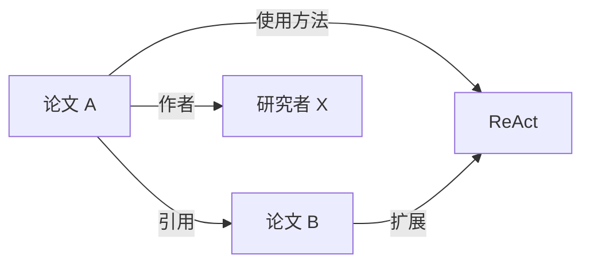

**核心特征**：

- **实体**：论文、作者、概念、方法等
- **关系**：引用、作者关系、方法演进等
- **属性**：发表时间、摘要、关键词等

#### 2.1.2 历史演进

| 阶段         | 时间  | 代表                   | 特点               |
| ------------ | ----- | ---------------------- | ------------------ |
| 语义网       | 2001  | W3C                    | RDF/OWL 标准化     |
| 企业知识图谱 | 2012  | Google Knowledge Graph | 大规模商业应用     |
| AI 增强      | 2023+ | GraphRAG               | LLM 自动构建与推理 |

#### 2.1.3 与其他存储的关系

| 存储类型       | 优势               | 劣势           | 适用场景       |
| -------------- | ------------------ | -------------- | -------------- |
| **关系数据库** | 事务一致性、成熟   | 关系查询复杂   | 结构化业务数据 |
| **向量数据库** | 语义相似检索       | 无结构关系     | 模糊匹配、推荐 |
| **图数据库**   | 关系遍历、多跳推理 | 大规模扩展挑战 | 知识网络、推理 |

#### 2.1.4 知识图谱在 AI 中的应用（2024-2025 前沿）

基于 2024-2025 年最新研究和产业实践，知识图谱在现代 AI 系统中的应用已显著扩展：

**1. GraphRAG - 知识图谱增强检索生成（2024 年突破）**

将 KG 集成到 RAG 流程中，是 2024 年最重要的技术突破之一：

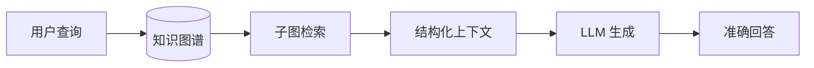

**核心优势**：

- 减少 LLM 幻觉 40-60%
- 支持多跳推理和复杂关系查询
- 提供可解释的决策路径

**2. KG-Enhanced LLMs - 知识增强大模型**

| 企业应用          | 技术方案        | 效果提升            |
| ----------------- | --------------- | ------------------- |
| **智能问答**      | KG + SQL + LLM  | 准确率 +35%         |
| **元数据管理**    | KG 语义层       | 数据治理效率 2x     |
| **多 Agent 协作** | KG 作为知识枢纽 | 复杂任务成功率 +50% |

**3. 行业垂直应用（2024 年实践）**

- **医疗健康**：临床决策支持、生命历程风险路径重构
- **金融服务**：风险评估、合规检查、客户 360° 视图
- **网络安全**：威胁与漏洞关系图谱
- **电商零售**：产品图谱、供应链优化、个性化推荐

**4. 自动化 KG 构建与维护**

LLM 正在革新传统知识工程：

- **LLM 驱动的实体关系抽取**：减少 70% 手动标注
- **自动图谱更新**：实时知识增量融合
- **图谱质量评估**：AI 辅助的知识验证

> **市场规模**：知识图谱市场预计从 2024 年 $10.6 亿增长至 2030 年 $69.3 亿（CAGR 37%）

**5. 前沿趋势（2025+）**

| 趋势                 | 描述                             |
| -------------------- | -------------------------------- |
| **实时 KG**          | 动态自更新知识图谱               |
| **多模态 KG**        | 跨文本、图像、视频的统一知识表示 |
| **Agentic GraphRAG** | Agent 驱动的图谱原生推理         |
| **边缘 KG**          | 分布式图谱部署，降低延迟         |

### 2.2 GraphRAG 原理深入

#### 2.2.1 传统 RAG 的局限

传统 RAG（Retrieval-Augmented Generation）工作流程：

```
用户问题 → 向量检索 → Top-K 文档块 → LLM 生成回答
```

**核心问题**：

1. **点状检索**：只能找到孤立的相似文档，无法"连点成线"
2. **全局盲区**：无法回答"整个语料库的主题是什么"这类问题
3. **多跳困难**：难以回答"哪些论文使用了与 ReAct 相似的方法"

#### 2.2.2 GraphRAG 架构

Microsoft GraphRAG 采用两阶段架构<sup>[[2]](#ref2)</sup>：

**阶段一：离线索引（知识图谱构建）**

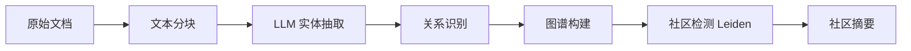

**阶段二：在线查询**

| 查询模式          | 机制                 | 适用场景     |
| ----------------- | -------------------- | ------------ |
| **Local Search**  | 图遍历，跟随关系路径 | 实体特定问题 |
| **Global Search** | 社区摘要 Map-Reduce  | 全局理解问题 |
| **Hybrid Search** | 向量 + 图谱结合      | 复杂推理问题 |

#### 2.2.3 社区检测与分层摘要

GraphRAG 的创新在于 **Leiden 社区检测算法**<sup>[[2]](#ref2)</sup>：

1. 将图谱划分为紧密连接的社区
2. 为每个社区生成 LLM 摘要
3. 支持多层级粒度（高层主题 → 细节实体）

```
Level 0: 整个语料库主题摘要
Level 1: 子领域摘要（如"Agent设计模式"、"记忆管理"）
Level 2: 具体主题摘要（如"ReAct框架"、"Tool Use模式"）
```

### 2.3 Agentic AI 与认知增强

#### 2.3.1 Agent 核心特征

根据《Agentic Design Patterns》<sup>[[10]](#ref10)</sup>，Agent 区别于传统软件的核心是：

> **代理性（Agency）**：能够感知环境、做出决策、采取行动以自主实现目标

**Agent 工作循环**：

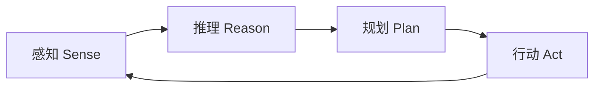

#### 2.3.2 认知记忆系统

借鉴人类认知科学，Agent 记忆分为三类：

| 记忆类型       | 人类对应 | Agent 实现              | 示例               |
| -------------- | -------- | ----------------------- | ------------------ |
| **语义记忆**   | 事实知识 | 用户画像、领域知识      | "用户偏好简洁表达" |
| **情景记忆**   | 过往经历 | 历史会话、成功案例      | Few-shot 示例      |
| **程序性记忆** | 技能规则 | System Prompt、行为模式 | Agent 指令集       |

#### 2.3.3 从 ReAct 到认知增强

**ReAct 框架**（Reasoning + Acting）奠定了现代 Agent 基础<sup>[[5]](#ref5)</sup>：

```
Think: 我需要查找关于 GraphRAG 的论文
Act: search("GraphRAG papers 2024")
Observe: 找到 5 篇相关论文...
Think: 需要进一步分析这些论文的关系
Act: analyze_relationships(papers)
...
```

**认知增强扩展**：

- **长期记忆**：跨会话保留知识
- **知识图谱**：结构化存储实体关系
- **自我反思**：评估并改进自身行为
- **多 Agent 协作**：任务分解与专业化

### 2.4 Agentic RAG 深入解读（RAG 2.0）

Agentic RAG 代表了检索增强生成技术的重大演进，将传统 RAG 的被动检索转变为主动推理，是构建智能认知增强系统的核心范式<sup>[[8]](#ref8)</sup><sup>[[9]](#ref9)</sup>。

#### 2.4.1 RAG 技术演进

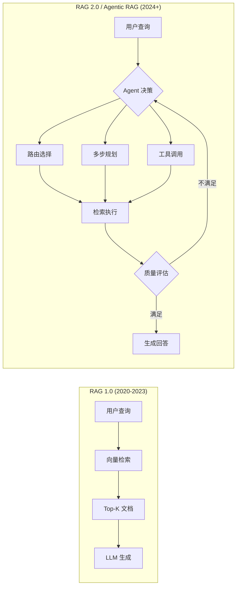

| 阶段             | 时间      | 特征              | 代表技术           |
| ---------------- | --------- | ----------------- | ------------------ |
| **Naive RAG**    | 2020-2022 | 简单检索-生成     | 基础向量检索       |
| **Advanced RAG** | 2022-2023 | 预处理/后处理优化 | 查询重写、重排序   |
| **Modular RAG**  | 2023-2024 | 组件化架构        | 可插拔检索器       |
| **Agentic RAG**  | 2024+     | 智能代理驱动      | 自主决策、多步推理 |

#### 2.4.2 Agentic RAG 核心定义

> **Agentic RAG** 是一种将自主 AI Agent 嵌入 RAG 流程的范式，使 LLM 不再仅仅是被动的内容生成器，而是成为能够主动规划、决策、检索和自我修正的智能编排者。

**核心能力差异**：

| 能力维度       | 传统 RAG       | Agentic RAG      |
| -------------- | -------------- | ---------------- |
| **执行模式**   | 线性流水线     | 循环迭代         |
| **决策能力**   | 无（固定流程） | 有（动态选择）   |
| **检索策略**   | 单次静态检索   | 多轮自适应检索   |
| **工具使用**   | 无             | 多工具动态调用   |
| **自我修正**   | 无             | 内置评估反馈循环 |
| **多步推理**   | 困难           | 原生支持         |
| **上下文管理** | 简单拼接       | 智能压缩与选择   |

#### 2.4.3 Agentic RAG 关键模式

**1. Adaptive RAG（自适应检索）**

Agent 根据查询特征动态选择检索策略：

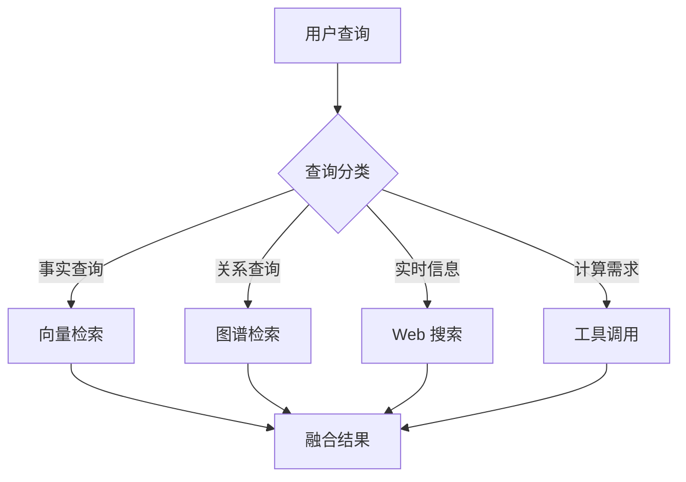

**2. Corrective RAG（纠错检索）**

引入文档相关性评估器，低质量时触发补救措施：

```python
# Corrective RAG 核心流程
def corrective_rag(query, documents):
    # 1. 评估检索文档的相关性
    grades = grade_documents(query, documents)

    relevant_docs = [d for d, g in zip(documents, grades) if g == "relevant"]

    # 2. 如果相关文档不足，触发纠错机制
    if len(relevant_docs) < threshold:
        # 策略 A: 查询重写后重新检索
        rewritten_query = rewrite_query(query)
        additional_docs = retrieve(rewritten_query)

        # 策略 B: 补充 Web 搜索
        web_results = web_search(query)
        relevant_docs.extend(web_results)

    # 3. 基于优化后的文档生成回答
    return generate(query, relevant_docs)
```

**3. Self-RAG（自反思检索）**

系统自主评估生成内容的质量和事实性：

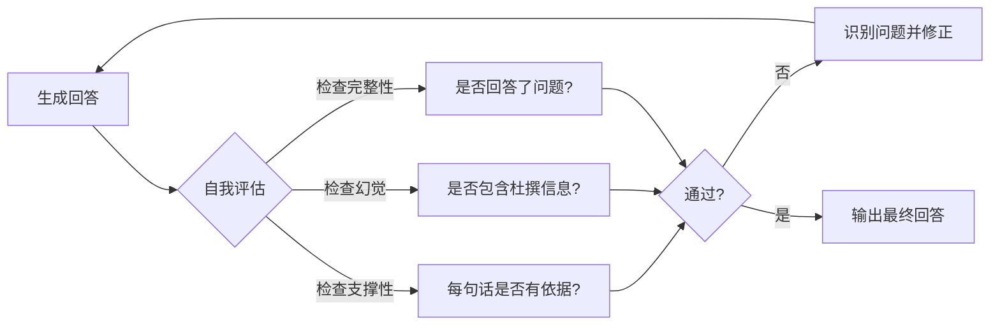

**4. Multi-Step Reasoning（多步推理）**

将复杂问题分解为子任务序列：

```
用户问题：哪些 2024 年发表的论文同时引用了 ReAct 和 Chain-of-Thought？

Agent 规划：
  Step 1: 搜索引用 ReAct 的 2024 年论文 → 结果集 A
  Step 2: 搜索引用 Chain-of-Thought 的 2024 年论文 → 结果集 B
  Step 3: 计算 A ∩ B → 交集论文
  Step 4: 提取论文标题和摘要
  Step 5: 生成总结回答
```

#### 2.4.4 Agentic RAG 架构模式

**单 Agent 架构**

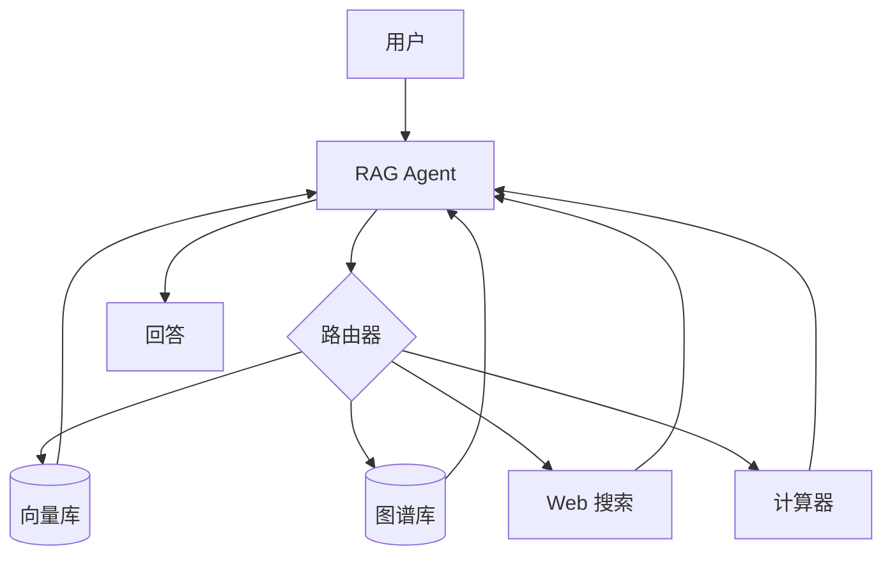

**多 Agent 协作架构**

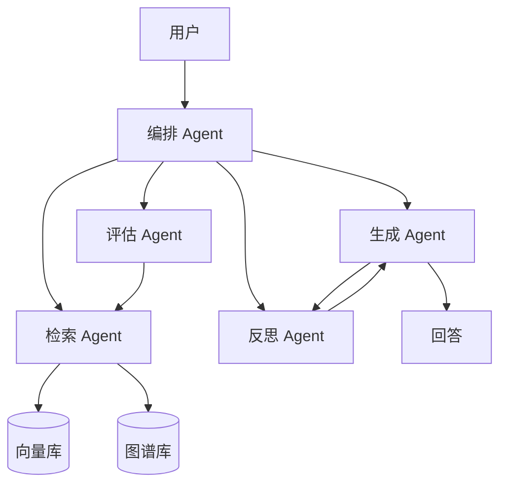

#### 2.4.5 主流实现框架

**LangGraph 实现**

LangGraph 是构建 Agentic RAG 的主流框架，基于图结构编排工作流：

```python
from langgraph.graph import StateGraph, END
from typing import TypedDict, List

class AgentState(TypedDict):
    query: str
    documents: List[str]
    generation: str
    grade: str

def retrieve(state: AgentState) -> AgentState:
    """检索相关文档"""
    docs = retriever.invoke(state["query"])
    return {"documents": docs}

def grade_documents(state: AgentState) -> AgentState:
    """评估文档相关性"""
    grades = [grade_doc(state["query"], doc) for doc in state["documents"]]
    return {"grade": "pass" if sum(grades) > len(grades) * 0.5 else "fail"}

def decide_next(state: AgentState) -> str:
    """决定下一步动作"""
    if state["grade"] == "fail":
        return "web_search"  # 触发 Web 搜索补救
    return "generate"

def generate(state: AgentState) -> AgentState:
    """生成回答"""
    response = llm.invoke(build_prompt(state["query"], state["documents"]))
    return {"generation": response}

# 构建 Agentic RAG 工作流
workflow = StateGraph(AgentState)
workflow.add_node("retrieve", retrieve)
workflow.add_node("grade", grade_documents)
workflow.add_node("web_search", web_search)
workflow.add_node("generate", generate)

workflow.set_entry_point("retrieve")
workflow.add_edge("retrieve", "grade")
workflow.add_conditional_edges("grade", decide_next)
workflow.add_edge("web_search", "generate")
workflow.add_edge("generate", END)

agentic_rag = workflow.compile()
```

**LlamaIndex 实现**

LlamaIndex 提供 Router Query Engine 实现自适应检索：

```python
from llama_index.core.query_engine import RouterQueryEngine
from llama_index.core.selectors import LLMSingleSelector

# 定义多个检索工具
vector_tool = QueryEngineTool.from_defaults(
    query_engine=vector_index.as_query_engine(),
    description="适用于语义相似性搜索的向量检索"
)

graph_tool = QueryEngineTool.from_defaults(
    query_engine=graph_index.as_query_engine(),
    description="适用于关系探索的知识图谱检索"
)

summary_tool = QueryEngineTool.from_defaults(
    query_engine=summary_index.as_query_engine(),
    description="适用于全局理解的文档摘要检索"
)

# 构建路由查询引擎
router_engine = RouterQueryEngine(
    selector=LLMSingleSelector.from_defaults(),
    query_engine_tools=[vector_tool, graph_tool, summary_tool]
)

# Agent 自动选择最佳检索策略
response = router_engine.query("What is the relationship between ReAct and CoT?")
```

#### 2.4.6 Agentic RAG 评估指标

| 指标类别       | 具体指标                | 说明                   |
| -------------- | ----------------------- | ---------------------- |
| **检索质量**   | Context Precision       | 检索内容与问题的相关性 |
|                | Context Recall          | 关键信息的召回率       |
| **生成质量**   | Faithfulness            | 回答是否有检索内容支撑 |
|                | Answer Relevancy        | 回答与问题的相关性     |
| **Agent 效能** | Tool Selection Accuracy | 工具选择正确率         |
|                | Reasoning Steps         | 推理步骤合理性         |
|                | Self-Correction Rate    | 自我修正成功率         |

**RAGAS 评估示例**：

```python
from ragas import evaluate
from ragas.metrics import faithfulness, answer_relevancy, context_precision

result = evaluate(
    dataset,
    metrics=[faithfulness, answer_relevancy, context_precision]
)
print(result)
# {'faithfulness': 0.87, 'answer_relevancy': 0.92, 'context_precision': 0.85}
```

#### 2.4.7 本项目 Agentic RAG 应用建议

基于调研结果，针对本项目的 Agentic RAG 实施建议：

| 组件         | 建议方案                                | 优先级 |
| ------------ | --------------------------------------- | ------ |
| **检索策略** | Adaptive RAG（向量 + 图谱路由）         | P0     |
| **质量保障** | Corrective RAG（相关性评估 + Web 补充） | P1     |
| **多步推理** | LangGraph 状态机编排                    | P1     |
| **自我反思** | Self-RAG 生成后评估                     | P2     |
| **评估体系** | RAGAS 集成                              | P0     |

**推荐架构**：

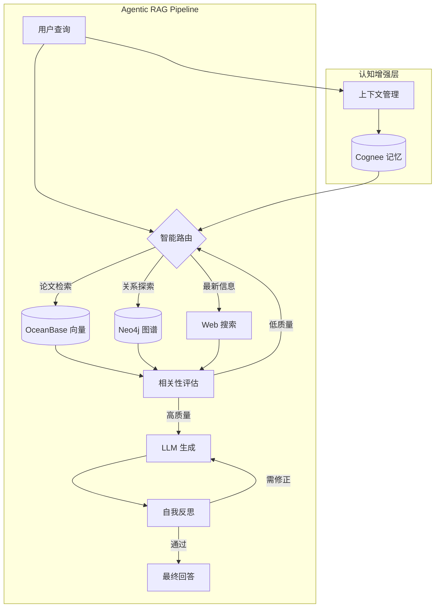

---

## 3. 主流框架解读与对比

> 理论基础已明确，本章进入工程实践层面，深入解读五大主流认知增强框架：Cognee、Microsoft GraphRAG、LlamaIndex、LangGraph 和 MemGPT。通过对比分析，为本项目技术选型提供依据。

### 3.1 Cognee

#### 3.1.1 核心定位

Cognee 是一个开源的 **AI 记忆层框架**，将原始数据转换为可搜索、可连接的智能记忆<sup>[[11]](#ref11)</sup><sup>[[20]](#ref20)</sup>。

> **核心理念**：图+向量混合存储，支持语义搜索与结构推理统一

#### 3.1.2 三存储架构

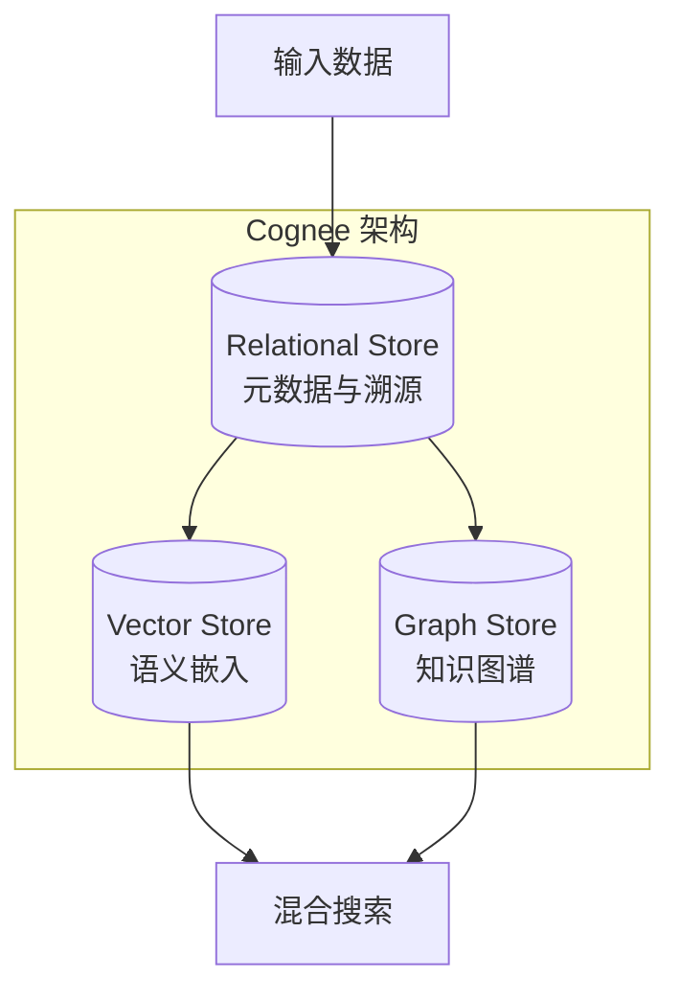

| 存储           | 职责                 | 使用阶段           |
| -------------- | -------------------- | ------------------ |
| **Relational** | 文档元数据、分块溯源 | Cognify 时追踪来源 |
| **Vector**     | 嵌入向量、语义指纹   | Search 时语义匹配  |
| **Graph**      | 实体、关系、知识结构 | Search 时结构推理  |

#### 3.1.3 核心操作

**Add（数据摄入）**

```python
import cognee

# 添加文件/目录/文本
await cognee.add(
    "papers/source/",
    dataset_name="research_papers"
)
```

**Cognify（知识构建）**

```python
# 构建嵌入、图谱、摘要
await cognee.cognify()
```

内部执行 6 个有序任务：

1. Classify documents → 包装为 Document 对象
2. Check permissions → 验证写入权限
3. Extract chunks → 分块处理
4. Extract graph → LLM 抽取实体关系
5. Summarize text → 生成摘要
6. Add data points → 写入向量和图存储

**Search（智能检索）**

| 搜索模式           | 说明                    | 适用场景     |
| ------------------ | ----------------------- | ------------ |
| `INSIGHTS`         | 默认模式，综合向量+图谱 | 一般问答     |
| `CHUNKS`           | 仅向量相似度            | 快速语义匹配 |
| `GRAPH_TRAVERSAL`  | 图遍历扩展              | 关系探索     |
| `NATURAL_LANGUAGE` | 自然语言转 Cypher       | 结构化查询   |
| `CYPHER`           | 直接执行 Cypher         | 高级用户     |
| `FEELING_LUCKY`    | 自动选择最佳模式        | 不确定时使用 |

```python
from cognee.api.v1.search import SearchType

results = await cognee.search(
    SearchType.INSIGHTS,
    query="What are the main approaches in knowledge graph construction?"
)
```

#### 3.1.4 优势与局限

| 优势                | 局限                 |
| ------------------- | -------------------- |
| 图+向量统一架构     | 相对较新，社区规模小 |
| 自学习反馈机制      | 文档相对简洁         |
| 多数据源支持（30+） | 大规模部署案例少     |
| 开源可自托管        | LLM 依赖成本         |

### 3.2 Microsoft GraphRAG

#### 3.2.1 核心架构

Microsoft Research 开源的 GraphRAG 专注于 **知识图谱增强的 RAG**：

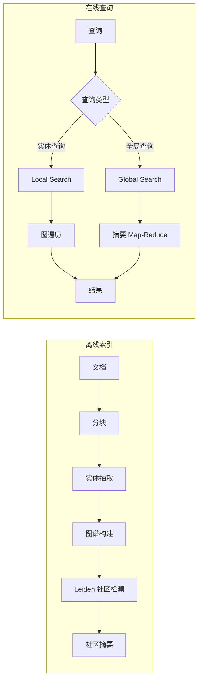

#### 3.2.2 安装与配置

```bash
# 安装
pip install graphrag

# 初始化工作区
graphrag init --root ./my_project

# 配置 .env
GRAPHRAG_API_KEY=your_openai_api_key

# 执行索引
graphrag index --root ./my_project

# 查询
graphrag query --root ./my_project --method local "What is ReAct?"
```

#### 3.2.3 优势与局限

| 优势                     | 局限                     |
| ------------------------ | ------------------------ |
| Microsoft 背书，持续维护 | 索引成本高（LLM tokens） |
| 社区检测创新             | 实时更新困难             |
| 全局搜索能力强           | 配置相对复杂             |

### 3.3 LlamaIndex Knowledge Graph

#### 3.3.1 核心组件

LlamaIndex 提供灵活的知识图谱构建与查询能力<sup>[[14]](#ref14)</sup><sup>[[22]](#ref22)</sup>：

- **PropertyGraphIndex**：属性图索引，支持节点/边属性
- **KnowledgeGraphRAGRetriever**：图谱检索器

#### 3.3.2 使用示例

```python
from llama_index.core import PropertyGraphIndex
from llama_index.graph_stores.neo4j import Neo4jGraphStore

# 连接 Neo4j
graph_store = Neo4jGraphStore(
    username="neo4j",
    password="password",
    url="bolt://localhost:7687"
)

# 从文档构建图谱
index = PropertyGraphIndex.from_documents(
    documents,
    graph_store=graph_store,
    max_triplets_per_chunk=10
)

# 查询
query_engine = index.as_query_engine()
response = query_engine.query("What papers cite ReAct?")
```

#### 3.3.3 Text2Cypher

LlamaIndex 支持自然语言转 Cypher 查询：

```python
from llama_index.core.query_engine import KnowledgeGraphQueryEngine

kg_query_engine = KnowledgeGraphQueryEngine(
    storage_context=storage_context,
    llm=llm,
    verbose=True
)

response = kg_query_engine.query(
    "Find all papers published after 2023 that mention GraphRAG"
)
```

### 3.4 LangGraph

#### 3.4.1 核心定位

LangGraph 是 LangChain 生态的 **Agent 工作流编排框架**<sup>[[15]](#ref15)</sup><sup>[[23]](#ref23)</sup>：

- **状态管理**：跨步骤保持状态
- **条件分支**：动态决策路由
- **循环支持**：迭代优化

#### 3.4.2 Agentic RAG 示例

```python
from langgraph.graph import StateGraph, END
from langchain_openai import ChatOpenAI

def retrieve(state):
    """检索相关文档"""
    query = state["query"]
    docs = retriever.invoke(query)
    return {"documents": docs}

def grade_documents(state):
    """评估文档相关性"""
    docs = state["documents"]
    relevant_docs = [d for d in docs if is_relevant(d, state["query"])]
    return {"documents": relevant_docs, "needs_web_search": len(relevant_docs) < 2}

def web_search(state):
    """补充 Web 搜索"""
    results = web_search_tool.run(state["query"])
    return {"documents": state["documents"] + results}

def generate(state):
    """生成回答"""
    response = llm.invoke(build_prompt(state["query"], state["documents"]))
    return {"response": response}

# 构建图
workflow = StateGraph(AgentState)
workflow.add_node("retrieve", retrieve)
workflow.add_node("grade", grade_documents)
workflow.add_node("web_search", web_search)
workflow.add_node("generate", generate)

workflow.set_entry_point("retrieve")
workflow.add_edge("retrieve", "grade")
workflow.add_conditional_edges(
    "grade",
    lambda s: "web_search" if s["needs_web_search"] else "generate"
)
workflow.add_edge("web_search", "generate")
workflow.add_edge("generate", END)

app = workflow.compile()
```

### 3.5 MemGPT / Letta AI

#### 3.5.1 核心创新

MemGPT（现更名为 Letta AI）采用 **操作系统式内存管理**<sup>[[4]](#ref4)</sup><sup>[[16]](#ref16)</sup>：

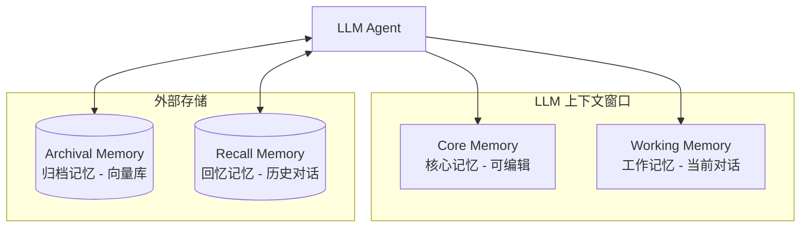

#### 3.5.2 自编辑记忆

Agent 通过工具调用管理自己的记忆：

```python
# Agent 可调用的记忆操作
core_memory_append(content)  # 追加核心记忆
core_memory_replace(old, new)  # 替换核心记忆
archival_memory_insert(content)  # 存入归档
archival_memory_search(query)  # 检索归档
conversation_search(query)  # 搜索历史对话
```

**示例**：Agent 学习用户偏好

```
User: 我更喜欢简洁的回答
Agent thinks: 用户表达了偏好，需要记录
Agent action: core_memory_append("用户偏好：简洁回答")
Agent: 好的，我会保持简洁。
```

### 3.6 框架对比总结

| 特性         | Cognee      | GraphRAG    | LlamaIndex  | LangGraph  | MemGPT    |
| ------------ | ----------- | ----------- | ----------- | ---------- | --------- |
| **核心定位** | AI 记忆层   | 图谱 RAG    | 通用框架    | Agent 编排 | 长期记忆  |
| **图谱构建** | ✅ LLM 抽取 | ✅ LLM 抽取 | ✅ LLM 抽取 | ❌         | ❌        |
| **向量检索** | ✅ 内置     | ✅ 内置     | ✅ 内置     | ✅ 集成    | ✅ 内置   |
| **社区检测** | ❌          | ✅ Leiden   | ❌          | ❌         | ❌        |
| **自学习**   | ✅ 反馈优化 | ❌          | ❌          | ❌         | ✅ 自编辑 |
| **状态管理** | ✅ Session  | ❌          | ❌          | ✅ 核心    | ✅ 核心   |
| **多 Agent** | ❌          | ❌          | ❌          | ✅ 核心    | ✅ 支持   |
| **开源**     | ✅ MIT      | ✅ MIT      | ✅ MIT      | ✅ MIT     | ✅ MIT    |
| **成熟度**   | 🟡 新兴     | 🟢 稳定     | 🟢 成熟     | 🟢 成熟    | 🟡 新兴   |

**选型建议**：

- **全栈记忆解决方案**：Cognee（图+向量+自学习）
- **知识图谱增强 RAG**：Microsoft GraphRAG（全局理解）
- **灵活通用开发**：LlamaIndex（生态丰富）
- **复杂 Agent 工作流**：LangGraph（状态管理）
- **长期个性化记忆**：MemGPT/Letta（对话 Agent）

---

## 4. 图数据库支撑

> 认知增强系统的核心是知识图谱，而图谱的存储与查询需要专业图数据库支撑。本章对比分析 Neo4j、FalkorDB、Kuzu 和 Memgraph 四大图数据库，为项目图存储选型提供参考。

### 4.1 Neo4j

#### 4.1.1 核心优势

Neo4j 是最成熟的原生图数据库，事实上的行业标准<sup>[[13]](#ref13)</sup>。

| 特性            | 说明                        |
| --------------- | --------------------------- |
| **成熟生态**    | 10+ 年历史，企业级支持      |
| **Cypher 语言** | 声明式图查询语言            |
| **ACID 合规**   | 完整事务支持                |
| **AI 集成**     | LLM Knowledge Graph Builder |

#### 4.1.2 AI 特性

**LLM Knowledge Graph Builder**：

- 支持 OpenAI、Gemini、Claude 等
- 从非结构化文本自动抽取实体/关系
- 可视化图谱浏览

**与框架集成**：

```python
# LangChain 集成
from langchain_community.graphs import Neo4jGraph

graph = Neo4jGraph(
    url="bolt://localhost:7687",
    username="neo4j",
    password="password"
)

# LlamaIndex 集成
from llama_index.graph_stores.neo4j import Neo4jGraphStore
```

#### 4.1.3 适用场景

- 企业级知识图谱
- 需要成熟生态和支持
- 复杂图算法需求

### 4.2 FalkorDB

#### 4.2.1 核心优势

FalkorDB 是为 AI/ML 工作负载优化的高性能图数据库<sup>[[18]](#ref18)</sup><sup>[[25]](#ref25)</sup>。

| 特性           | 说明                            |
| -------------- | ------------------------------- |
| **极低延迟**   | 比 Neo4j 快 10-496x（特定场景） |
| **稀疏矩阵**   | 创新架构，内存高效              |
| **Redis 兼容** | 基于 Redis 模块                 |
| **OpenCypher** | 兼容 Cypher 语法                |

#### 4.2.2 性能对比

| 指标     | FalkorDB     | Neo4j  |
| -------- | ------------ | ------ |
| P99 延迟 | <140ms       | 高延迟 |
| 图遍历   | 10.5-344x 快 | 基准   |
| 内存效率 | 高           | 中等   |

#### 4.2.3 适用场景

- 实时 AI 推理场景
- 高吞吐 GraphRAG
- 对延迟敏感的应用

### 4.3 Kuzu

#### 4.3.1 核心优势

Kuzu 是嵌入式高性能图数据库，类似"图数据库的 DuckDB"。

| 特性         | 说明           |
| ------------ | -------------- |
| **嵌入式**   | 无需独立服务器 |
| **列式存储** | OLAP 优化      |
| **MCP 支持** | LLM 直接交互   |
| **MIT 许可** | 完全开源       |

#### 4.3.2 LLM 集成

```python
# MCP 接口让 LLM 直接查询图数据库
# 自然语言 → Cypher → 执行 → 结果

from kuzu import Connection

conn = Connection(database)
result = conn.execute("MATCH (p:Paper)-[:CITES]->(c) RETURN p.title, c.title")
```

### 4.4 Memgraph

#### 4.4.1 核心优势

Memgraph 是内存图数据库，专注实时处理。

| 特性           | 说明          |
| -------------- | ------------- |
| **内存优先**   | 极低延迟      |
| **流处理**     | 实时图更新    |
| **GraphChat**  | 自然语言查询  |
| **AI Toolkit** | Python 工具集 |

#### 4.4.2 性能对比

- 比 Neo4j 低 41x 延迟
- 节点插入快 10x

### 4.5 图数据库对比与选型

| 特性         | Neo4j       | FalkorDB   | Kuzu    | Memgraph  |
| ------------ | ----------- | ---------- | ------- | --------- |
| **部署模式** | 独立服务    | Redis 模块 | 嵌入式  | 独立/容器 |
| **性能**     | 🟡 中等     | 🟢 极高    | 🟢 高   | 🟢 极高   |
| **成熟度**   | 🟢 最成熟   | 🟡 新兴    | 🟡 新兴 | 🟢 成熟   |
| **AI 集成**  | 🟢 最丰富   | 🟢 良好    | 🟡 基础 | 🟢 良好   |
| **开源**     | 🟡 开放核心 | 🟢 完全    | 🟢 完全 | 🟢 完全   |

**本项目建议**：

1. **首选 Neo4j**：生态成熟，与 LangChain/LlamaIndex 深度集成
2. **备选 FalkorDB**：如对延迟要求极高
3. **评估 Kuzu**：如需嵌入式部署

---

## 5. 向量数据库支撑

> 除图存储外，向量检索是认知增强的另一核心能力。本章重点介绍项目已选的 OceanBase 向量能力，并与其他主流向量数据库进行对比。

### 5.1 OceanBase（项目已选）

#### 5.1.1 核心优势

OceanBase 是多模一体化分布式数据库，支持向量检索<sup>[[17]](#ref17)</sup>。

| 特性             | 说明                         |
| ---------------- | ---------------------------- |
| **一体化存储**   | 结构化 + 向量数据统一        |
| **原生向量计算** | `COSINE_DISTANCE` 等内置函数 |
| **分布式扩展**   | PB 级数据支持                |
| **高可用**       | RPO=0, RTO<30s               |

#### 5.1.2 向量索引

支持的索引类型：

- **HNSW**：高效近似最近邻
- **IVFFlat**：倒排文件索引

```sql
-- 创建向量表
CREATE TABLE papers_embedding (
    id INT PRIMARY KEY,
    title VARCHAR(255),
    embedding VECTOR(1536)
);

-- 创建 HNSW 索引
CREATE VECTOR INDEX idx_embedding ON papers_embedding(embedding)
USING HNSW WITH (M=16, ef_construction=256);

-- 相似度查询
SELECT title, COSINE_DISTANCE(embedding, ?) as distance
FROM papers_embedding
ORDER BY distance
LIMIT 5;
```

#### 5.1.3 与 AI 框架集成

**LlamaIndex 集成**：

```python
from llama_index.vector_stores.oceanbase import OceanBaseVectorStore

vector_store = OceanBaseVectorStore(
    host="localhost",
    port=2881,
    user="root",
    password="",
    db_name="test"
)
```

**LangChain 集成**：

```python
from langchain_community.vectorstores import OceanBase

vectorstore = OceanBase.from_documents(
    documents,
    embeddings,
    connection_string="..."
)
```

### 5.2 其他向量数据库对比

| 数据库       | 特点                 | 适用场景     |
| ------------ | -------------------- | ------------ |
| **Weaviate** | GraphQL 接口、模块化 | 灵活集成需求 |
| **Qdrant**   | Rust 高性能、过滤强  | 高性能检索   |
| **Milvus**   | 大规模、分布式       | 十亿级向量   |
| **Chroma**   | 轻量、开发友好       | 快速原型     |

**本项目建议**：继续使用 OceanBase，充分利用其多模一体化能力。

---

## 6. Agentic Design Patterns 解读

> 在技术选型清晰后，本章归纳構建智能系统的核心设计模式。这些模式是跨框架的通用方法论，可与前述框架和数据库组合应用。

基于《Agentic Design Patterns: A Hands-On Guide to Building Intelligent Systems》<sup>[[10]](#ref10)</sup> 整理。

### 6.1 Prompt Chaining（提示链）

**定义**：将复杂任务分解为顺序执行的多个 LLM 调用。

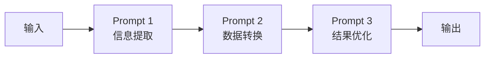

**应用场景**：

- 多步骤数据处理
- 内容生成工作流
- 代码生成与优化

**示例**：

```python
# LangChain 实现
extraction_chain = prompt_extract | llm | parser
transform_chain = prompt_transform | llm | parser
full_chain = extraction_chain | transform_chain
```

### 6.2 Routing（路由）

**定义**：根据输入动态选择处理路径。

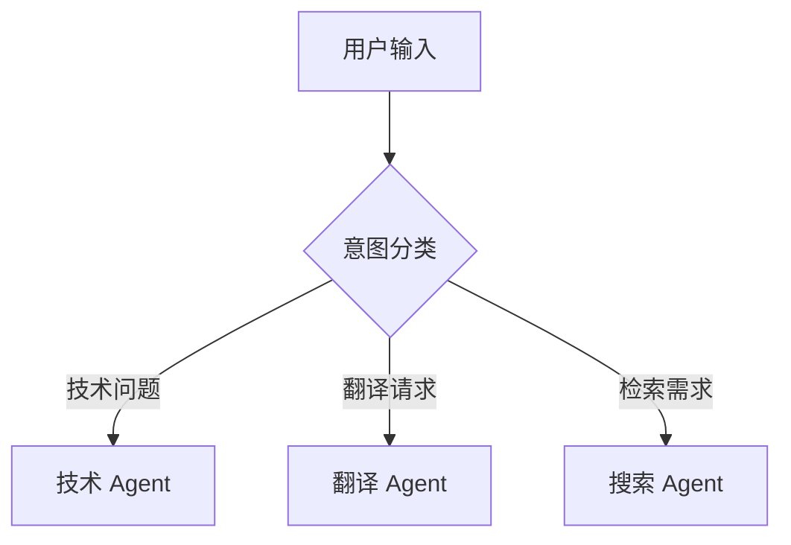

**实现方式**：

- LLM 分类器路由
- 基于规则的路由
- 语义相似度路由

### 6.3 Parallelization（并行化）

**定义**：同时执行多个独立任务以提高效率。

```python
# Google ADK 实现
parallel_agent = ParallelAgent(
    name="ParallelResearcher",
    sub_agents=[
        researcher_agent_1,  # 研究论文 A
        researcher_agent_2,  # 研究论文 B
        researcher_agent_3   # 研究论文 C
    ]
)
```

**适用场景**：

- 多源数据采集
- 批量文档处理
- 多角度分析

### 6.4 Tool Use（工具使用）

**定义**：Agent 通过函数调用与外部系统交互。

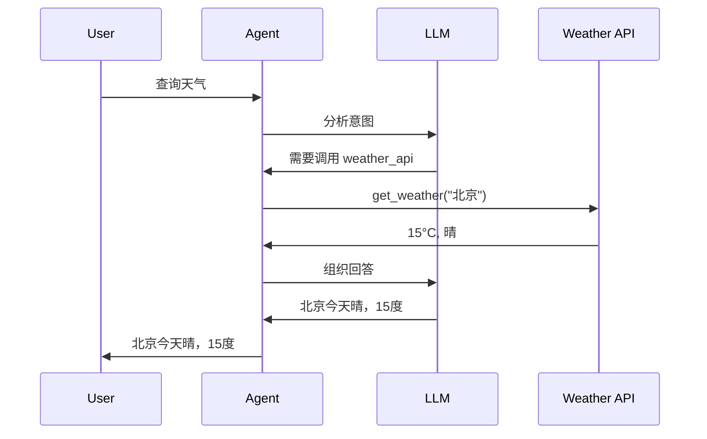

**工具定义**：

```python
@tool
def search_papers(query: str) -> list:
    """搜索相关论文"""
    return paper_database.search(query)
```

### 6.5 Planning（规划）

**定义**：Agent 自主制定实现目标的步骤序列。

**关键特征**：

- 目标分解
- 步骤排序
- 动态调整

**示例**：

```
目标：总结最近的 GraphRAG 研究进展

计划：
1. 搜索 2024 年 GraphRAG 相关论文
2. 筛选高引用论文
3. 提取各论文核心创新点
4. 分类整理（架构/应用/评估）
5. 生成综述报告
```

### 6.6 Reflection（反思）

**定义**：Agent 评估自身输出并迭代改进。

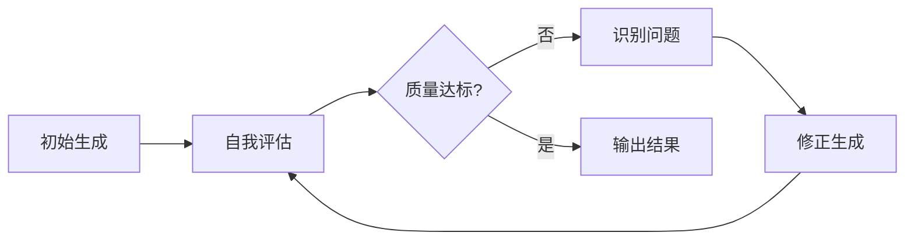

**实现**：

```python
def reflect(output, criteria):
    evaluation = llm.evaluate(output, criteria)
    if evaluation.needs_improvement:
        improved = llm.improve(output, evaluation.feedback)
        return reflect(improved, criteria)
    return output
```

### 6.7 Multi-Agent（多代理）

**定义**：多个专业化 Agent 协作完成复杂任务。

**协作模式**：

| 模式          | 说明                   | 适用场景     |
| ------------- | ---------------------- | ------------ |
| **主管-工人** | 主管分配任务，工人执行 | 任务分解明确 |
| **对等协作**  | Agent 平等讨论         | 需要多角度   |
| **流水线**    | 顺序处理传递           | 阶段性任务   |

**本项目应用**：

- WorkflowAgent（主管）
- PDFAgent / TranslationAgent / HeartfeltAgent（工人）

### 6.8 Guardrails（护栏）

**定义**：为 Agent 设置安全边界和约束。

**类型**：

- **输入护栏**：过滤恶意/无效输入
- **输出护栏**：验证生成内容合规性
- **工具护栏**：限制可执行操作

### 6.9 Memory（记忆）

**定义**：Agent 跨交互保持信息的能力。

**双组件架构**：

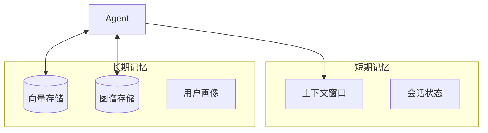

**LangGraph 实现**：

```python
from langgraph.store.memory import InMemoryStore

store = InMemoryStore(index={"embed": embed_fn, "dims": 1536})

# 存储记忆
store.put(namespace, "key", {"rules": ["用户偏好简洁"]})

# 检索记忆
items = store.search(namespace, query="用户偏好")
```

### 6.10 MCP（Model Context Protocol）

**定义**：LLM 与外部系统交互的标准化协议。

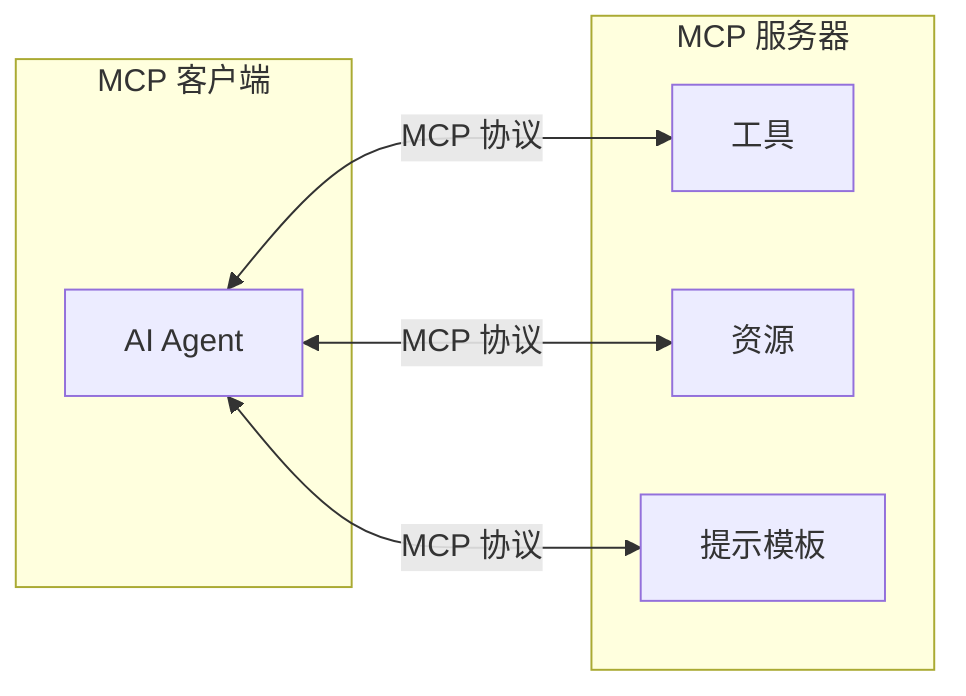

**优势**：

- 标准化接口，可复用
- 动态发现能力
- 跨平台兼容

---

## 7. 方案设计参考

> 基于前述理论基础、框架对比和设计模式，本章将调研成果转化为本项目的具体技术选型、架构设计和实施路线建议。

### 7.1 本项目技术选型建议

基于调研结果，针对本项目的技术选型建议：

| 组件           | 推荐方案         | 备选方案   | 理由                    |
| -------------- | ---------------- | ---------- | ----------------------- |
| **向量存储**   | OceanBase        | Qdrant     | 项目已选，多模一体化    |
| **图存储**     | Neo4j            | FalkorDB   | 成熟生态，AI 工具链完善 |
| **记忆框架**   | Cognee           | LlamaIndex | 图+向量统一，自学习能力 |
| **Agent 框架** | Claude SDK + ADK | -          | 双框架战略已定，保持    |
| **评估框架**   | RAGAS            | -          | RAG 质量评估标准        |

### 7.2 认知增强架构设计

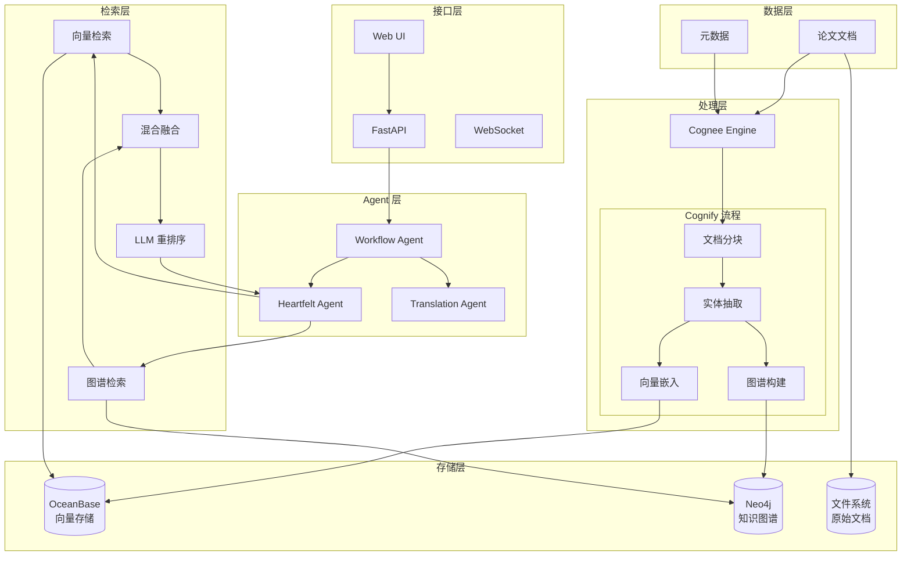

### 7.3 知识图谱 Schema 设计

**节点类型**：

| 节点        | 属性                                | 说明     |
| ----------- | ----------------------------------- | -------- |
| `Paper`     | id, title, abstract, year, arxiv_id | 论文实体 |
| `Author`    | name, affiliation                   | 作者     |
| `Concept`   | name, definition                    | 核心概念 |
| `Method`    | name, description                   | 方法论   |
| `Dataset`   | name, size, domain                  | 数据集   |
| `Framework` | name, version, url                  | 技术框架 |

**关系类型**：

| 关系           | 起点   | 终点      | 属性    |
| -------------- | ------ | --------- | ------- |
| `AUTHORED_BY`  | Paper  | Author    | order   |
| `CITES`        | Paper  | Paper     | context |
| `USES_METHOD`  | Paper  | Method    | -       |
| `INTRODUCES`   | Paper  | Concept   | -       |
| `EXTENDS`      | Method | Method    | -       |
| `EVALUATED_ON` | Paper  | Dataset   | metrics |
| `IMPLEMENTS`   | Paper  | Framework | -       |

**Cypher 示例**：

```cypher
// 查找使用相似方法的论文
MATCH (p1:Paper)-[:USES_METHOD]->(m:Method)<-[:USES_METHOD]-(p2:Paper)
WHERE p1.title = "ReAct"
RETURN p2.title, m.name

// 查找引用链
MATCH path = (p1:Paper)-[:CITES*1..3]->(p2:Paper)
WHERE p1.title CONTAINS "GraphRAG"
RETURN path
```

### 7.4 混合检索策略

```mermaid
flowchart LR
    Query[用户查询] --> Parse[查询解析]

    Parse --> KW[关键词检索]
    Parse --> Vec[向量检索]
    Parse --> Graph[图谱检索]

    KW --> Fusion[RRF 融合]
    Vec --> Fusion
    Graph --> Fusion

    Fusion --> Rerank[LLM 重排序]
    Rerank --> Result[检索结果]
```

**融合算法（RRF - Reciprocal Rank Fusion）**：

```python
def rrf_fusion(rankings, k=60):
    """融合多路检索结果"""
    scores = {}
    for ranking in rankings:
        for rank, doc in enumerate(ranking):
            if doc not in scores:
                scores[doc] = 0
            scores[doc] += 1 / (k + rank + 1)
    return sorted(scores.items(), key=lambda x: x[1], reverse=True)
```

### 7.5 实施路线建议

```mermaid
gantt
    title 智能认知增强实施路线
    dateFormat  YYYY-MM
    section Phase 1 向量增强
    OceanBase 集成完善      :2025-12, 2026-01
    基础 RAG 检索           :2026-01, 2026-02
    RAGAS 评估集成          :2026-02, 2026-02
    section Phase 2 图谱增强
    Neo4j 部署配置          :2026-02, 2026-03
    Cognee 框架集成         :2026-03, 2026-04
    知识图谱构建            :2026-04, 2026-05
    混合检索实现            :2026-05, 2026-06
    section Phase 3 认知增强
    多跳推理问答            :2026-06, 2026-07
    Agent 记忆持久化        :2026-07, 2026-08
    图谱可视化              :2026-08, 2026-09
```

---

## 8. Demo 实施指引

### 8.1 Cognee 快速入门

#### 8.1.1 安装

```bash
pip install cognee
```

#### 8.1.2 基础使用

```python
import cognee
from cognee.api.v1.search import SearchType

async def main():
    # 1. 配置
    cognee.config.llm_api_key = "your-api-key"

    # 2. 添加数据
    await cognee.add(
        "papers/source/llm-agents/",
        dataset_name="agent_papers"
    )

    # 3. 构建知识图谱
    await cognee.cognify()

    # 4. 搜索
    results = await cognee.search(
        SearchType.INSIGHTS,
        query="What are the main agentic design patterns?"
    )

    for result in results:
        print(f"Score: {result.score}")
        print(f"Content: {result.content[:200]}...")
        print("---")

if __name__ == "__main__":
    import asyncio
    asyncio.run(main())
```

#### 8.1.3 高级配置

```python
# 配置存储后端
from cognee.infrastructure.databases.vector import get_vector_engine
from cognee.infrastructure.databases.graph import get_graph_engine

# 使用 Neo4j 作为图存储
cognee.config.graph_engine = "neo4j"
cognee.config.graph_database_url = "bolt://localhost:7687"
cognee.config.graph_database_username = "neo4j"
cognee.config.graph_database_password = "password"

# 使用自定义向量存储
cognee.config.vector_engine = "qdrant"  # 或其他支持的引擎
```

### 8.2 Neo4j + LlamaIndex 集成

#### 8.2.1 环境准备

```bash
# 启动 Neo4j（Docker）
docker run -d \
    --name neo4j \
    -p 7474:7474 -p 7687:7687 \
    -e NEO4J_AUTH=neo4j/password \
    neo4j:latest

# 安装依赖
pip install llama-index llama-index-graph-stores-neo4j
```

#### 8.2.2 构建知识图谱

```python
from llama_index.core import SimpleDirectoryReader, PropertyGraphIndex
from llama_index.graph_stores.neo4j import Neo4jPropertyGraphStore
from llama_index.llms.openai import OpenAI
from llama_index.embeddings.openai import OpenAIEmbedding

# 加载文档
documents = SimpleDirectoryReader("papers/source/").load_data()

# 配置 Neo4j
graph_store = Neo4jPropertyGraphStore(
    username="neo4j",
    password="password",
    url="bolt://localhost:7687"
)

# 构建图谱索引
index = PropertyGraphIndex.from_documents(
    documents,
    llm=OpenAI(model="gpt-4"),
    embed_model=OpenAIEmbedding(),
    property_graph_store=graph_store,
    max_triplets_per_chunk=10
)

# 持久化
index.storage_context.persist("./storage")
```

#### 8.2.3 查询图谱

```python
# 创建查询引擎
query_engine = index.as_query_engine(
    include_text=True,
    response_mode="tree_summarize"
)

# 执行查询
response = query_engine.query(
    "What are the key differences between ReAct and Chain-of-Thought?"
)
print(response)

# 或使用 Cypher 直接查询
from llama_index.core.indices.property_graph import TextToCypherRetriever

cypher_retriever = TextToCypherRetriever(
    graph_store=graph_store,
    llm=OpenAI()
)

nodes = cypher_retriever.retrieve("Find all papers that cite ReAct")
```

### 8.3 OceanBase 向量检索

#### 8.3.1 表结构创建

```sql
-- 创建论文嵌入表
CREATE TABLE paper_embeddings (
    id BIGINT PRIMARY KEY AUTO_INCREMENT,
    paper_id VARCHAR(64) NOT NULL,
    title VARCHAR(512),
    chunk_text TEXT,
    chunk_index INT,
    embedding VECTOR(1536),  -- OpenAI embedding 维度
    created_at TIMESTAMP DEFAULT CURRENT_TIMESTAMP,
    INDEX idx_paper_id (paper_id)
);

-- 创建 HNSW 向量索引
CREATE VECTOR INDEX idx_paper_embedding
ON paper_embeddings(embedding)
USING HNSW
WITH (M=16, ef_construction=256);
```

#### 8.3.2 Python 集成

```python
import pymysql
from openai import OpenAI

# 嵌入模型
openai_client = OpenAI()

def get_embedding(text):
    response = openai_client.embeddings.create(
        model="text-embedding-3-small",
        input=text
    )
    return response.data[0].embedding

# OceanBase 连接
conn = pymysql.connect(
    host='localhost',
    port=2881,
    user='root',
    password='',
    database='test'
)

def insert_paper_chunk(paper_id, title, chunk_text, chunk_index):
    embedding = get_embedding(chunk_text)
    embedding_str = '[' + ','.join(map(str, embedding)) + ']'

    with conn.cursor() as cursor:
        sql = """
        INSERT INTO paper_embeddings (paper_id, title, chunk_text, chunk_index, embedding)
        VALUES (%s, %s, %s, %s, %s)
        """
        cursor.execute(sql, (paper_id, title, chunk_text, chunk_index, embedding_str))
    conn.commit()

def search_similar(query, top_k=5):
    query_embedding = get_embedding(query)
    embedding_str = '[' + ','.join(map(str, query_embedding)) + ']'

    with conn.cursor() as cursor:
        sql = f"""
        SELECT paper_id, title, chunk_text,
               COSINE_DISTANCE(embedding, '{embedding_str}') as distance
        FROM paper_embeddings
        ORDER BY distance
        LIMIT {top_k}
        """
        cursor.execute(sql)
        return cursor.fetchall()

# 使用示例
results = search_similar("What is GraphRAG architecture?")
for paper_id, title, chunk, distance in results:
    print(f"[{distance:.4f}] {title}")
    print(f"  {chunk[:100]}...")
```

### 8.4 混合检索 Pipeline

```python
class HybridRetriever:
    def __init__(self, vector_store, graph_store, llm):
        self.vector_store = vector_store
        self.graph_store = graph_store
        self.llm = llm

    def retrieve(self, query, top_k=10):
        # 1. 向量检索
        vector_results = self.vector_store.similarity_search(query, k=top_k)

        # 2. 图谱检索
        graph_results = self.graph_store.query(
            f"MATCH (n) WHERE n.content CONTAINS '{query}' RETURN n LIMIT {top_k}"
        )

        # 3. RRF 融合
        all_docs = self.rrf_fusion([vector_results, graph_results])

        # 4. LLM 重排序
        reranked = self.rerank(query, all_docs[:top_k])

        return reranked

    def rrf_fusion(self, rankings, k=60):
        scores = {}
        for ranking in rankings:
            for rank, doc in enumerate(ranking):
                doc_id = doc.id
                if doc_id not in scores:
                    scores[doc_id] = {"doc": doc, "score": 0}
                scores[doc_id]["score"] += 1 / (k + rank + 1)

        sorted_items = sorted(scores.values(), key=lambda x: x["score"], reverse=True)
        return [item["doc"] for item in sorted_items]

    def rerank(self, query, docs):
        # 使用 LLM 进行相关性评分
        prompt = f"""
        Query: {query}

        Documents:
        {[f"{i}. {doc.content[:200]}" for i, doc in enumerate(docs)]}

        Rank these documents by relevance to the query. Return indices in order.
        """
        response = self.llm.complete(prompt)
        # 解析并重排序
        # ...
        return docs
```

---

## 9. References

### 学术论文

<a id="ref1"></a>**[1]** Chaudhri, V. et al. (2022). _Knowledge Graphs: Introduction, History, and Perspectives_. AI Magazine. [DOI:10.1002/aaai.12033](https://doi.org/10.1002/aaai.12033)

<a id="ref2"></a>**[2]** Edge, D. et al. (2024). _From Local to Global: A Graph RAG Approach to Query-Focused Summarization_. Microsoft Research. [arXiv:2404.16130](https://arxiv.org/abs/2404.16130)

<a id="ref3"></a>**[3]** Liu, Z. et al. (2025). _Graph-Guided Concept Selection for Efficient Retrieval-Augmented Generation_. Huawei Cloud. [arXiv:2510.24120](https://arxiv.org/abs/2510.24120)

<a id="ref4"></a>**[4]** Packer, C. et al. (2023). _MemGPT: Towards LLMs as Operating Systems_. UC Berkeley. [arXiv:2310.08560](https://arxiv.org/abs/2310.08560)

<a id="ref5"></a>**[5]** Yao, S. et al. (2023). _ReAct: Synergizing Reasoning and Acting in Language Models_. Google/Princeton. [arXiv:2210.03629](https://arxiv.org/abs/2210.03629)

<a id="ref6"></a>**[6]** Wei, J. et al. (2022). _Chain-of-Thought Prompting Elicits Reasoning in Large Language Models_. Google. [arXiv:2201.11903](https://arxiv.org/abs/2201.11903)

<a id="ref7"></a>**[7]** Wang, L. et al. (2023). _A Survey on Large Language Model Based Autonomous Agents_. Tsinghua University. [arXiv:2308.11432](https://arxiv.org/abs/2308.11432)

<a id="ref8"></a>**[8]** Asai, A. et al. (2024). _Self-RAG: Learning to Retrieve, Generate, and Critique Through Self-Reflection_. University of Washington. [arXiv:2310.11511](https://arxiv.org/abs/2310.11511)

<a id="ref9"></a>**[9]** Yan, S. et al. (2024). _Corrective Retrieval Augmented Generation_. Baidu. [arXiv:2401.15884](https://arxiv.org/abs/2401.15884)

<a id="ref10"></a>**[10]** Goldman Sachs Engineering Team. (2024). _Agentic Design Patterns: A Hands-On Guide to Building Intelligent Systems_.

### 技术文档

<a id="ref11"></a>**[11]** Cognee. _Documentation_. [https://docs.cognee.ai/](https://docs.cognee.ai/)

<a id="ref12"></a>**[12]** Microsoft. _GraphRAG Documentation_. [https://microsoft.github.io/graphrag/](https://microsoft.github.io/graphrag/)

<a id="ref13"></a>**[13]** Neo4j. _Documentation_. [https://neo4j.com/docs/](https://neo4j.com/docs/)

<a id="ref14"></a>**[14]** LlamaIndex. _Documentation_. [https://docs.llamaindex.ai/](https://docs.llamaindex.ai/)

<a id="ref15"></a>**[15]** LangChain. _LangGraph Documentation_. [https://langchain-ai.github.io/langgraph/](https://langchain-ai.github.io/langgraph/)

<a id="ref16"></a>**[16]** Letta AI. _MemGPT Documentation_. [https://docs.letta.com/](https://docs.letta.com/)

<a id="ref17"></a>**[17]** OceanBase. _Vector Search Documentation_. [https://www.oceanbase.com/docs/common-oceanbase-database-cn-1000000004827710](https://www.oceanbase.com/docs/common-oceanbase-database-cn-1000000004827710)

<a id="ref18"></a>**[18]** FalkorDB. _Documentation_. [https://docs.falkordb.com/](https://docs.falkordb.com/)

<a id="ref19"></a>**[19]** Kuzu. _Documentation_. [https://kuzudb.github.io/docs/tutorials/](https://kuzudb.github.io/docs/tutorials/)

### 开源项目

<a id="ref20"></a>**[20]** topoteretes. _Cognee_. GitHub. [https://github.com/topoteretes/cognee](https://github.com/topoteretes/cognee)

<a id="ref21"></a>**[21]** Microsoft. _GraphRAG_. GitHub. [https://github.com/microsoft/graphrag](https://github.com/microsoft/graphrag)

<a id="ref22"></a>**[22]** run-llama. _LlamaIndex_. GitHub. [https://github.com/run-llama/llama_index](https://github.com/run-llama/llama_index)

<a id="ref23"></a>**[23]** langchain-ai. _LangGraph_. GitHub. [https://github.com/langchain-ai/langgraph](https://github.com/langchain-ai/langgraph)

<a id="ref24"></a>**[24]** cpacker. _MemGPT/Letta_. GitHub. [https://github.com/cpacker/MemGPT](https://github.com/cpacker/MemGPT)

<a id="ref25"></a>**[25]** FalkorDB. _FalkorDB_. GitHub. [https://github.com/FalkorDB/FalkorDB](https://github.com/FalkorDB/FalkorDB)

<a id="ref26"></a>**[26]** kuzudb. _Kuzu_. GitHub. [https://github.com/kuzudb/kuzu](https://github.com/kuzudb/kuzu)

---

## 附录 A：术语表

| 术语     | 英文                  | 定义                             |
| -------- | --------------------- | -------------------------------- |
| 认知增强 | Cognitive Enhancement | 利用 AI 技术增强人类认知能力     |
| 知识图谱 | Knowledge Graph       | 以图结构表示实体及其关系的知识库 |
| GraphRAG | Graph RAG             | 结合知识图谱的检索增强生成       |
| 向量嵌入 | Vector Embedding      | 将文本转化为高维数值向量         |
| 多跳推理 | Multi-hop Reasoning   | 需要多步关系遍历的推理           |
| Agent    | Agent                 | 能感知、决策、行动的自主实体     |
| 长期记忆 | Long-term Memory      | 跨会话持久化的信息存储           |
| 社区检测 | Community Detection   | 识别图中紧密连接的节点群组       |

---

## 附录 B：项目当前状态对照

| 架构组件 | 当前状态            | 目标状态       | 差距分析       |
| -------- | ------------------- | -------------- | -------------- |
| Agent 层 | ✅ 5 个 Agent       | 保持           | -              |
| API 层   | ✅ 完成             | 保持           | -              |
| 向量存储 | ⏳ OceanBase 集成中 | 完成集成       | 需完成索引配置 |
| 图谱存储 | 📋 规划中           | Neo4j + Cognee | 需新增         |
| 记忆框架 | 📋 规划中           | Cognee 集成    | 需新增         |
| 混合检索 | 📋 规划中           | RRF 融合       | 需实现         |
| 多跳推理 | 📋 规划中           | 图谱查询       | 需实现         |
