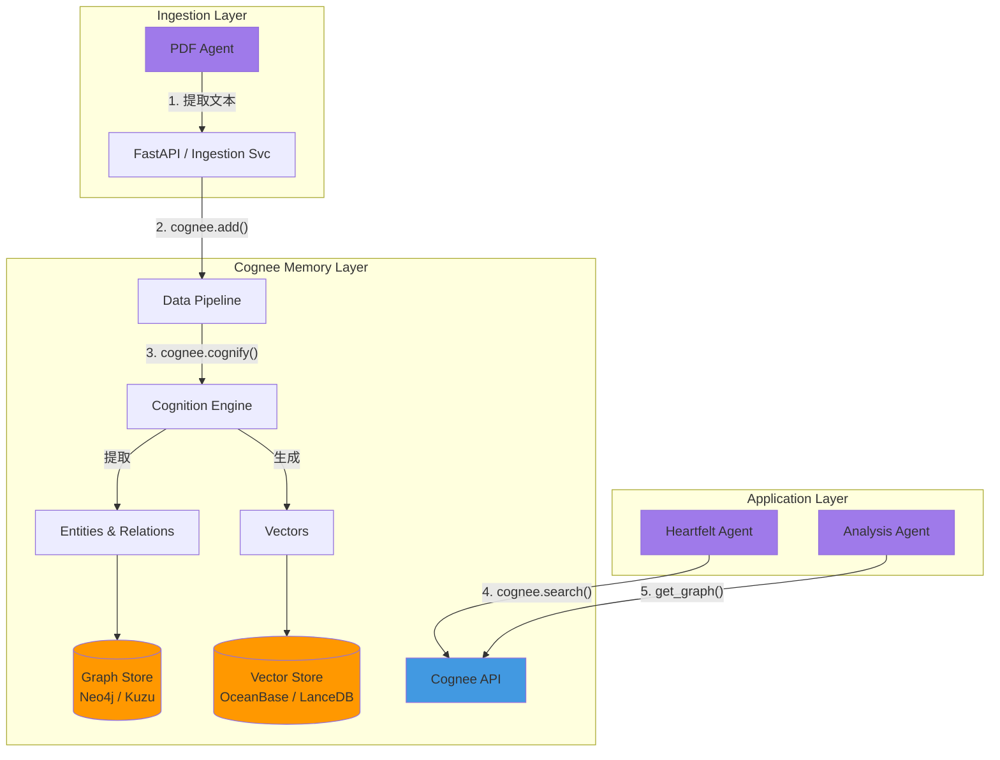

# 🧠 Cognee 集成方案

> **状态**: 📋 规划中 | **目标**: 构建论文库的"认知记忆" (Cognitive Memory)

[Cognee](https://docs.cognee.ai/) 是一个旨在为 AI 应用构建确定性记忆和知识图谱的开源框架。通过将非结构化数据转化为结构化的知识图谱，并结合向量检索 (GraphRAG)，Cognee 能够显著提升 Agent 对复杂关系的理解和推理能力。

## 1. 为什么引入 Cognee？

在当前的 Agentic AI Papers 平台中，我们也面临着 LLM 应用的典型痛点：

- **孤立的上下文**：每篇论文被独立处理，Agent 难以感知论文之间的引用关系、共同作者或相似的方法论。
- **浅层检索**：基于单纯 Vector Search 的 RAG 容易丢失结构化信息（例如："A 论文反驳了 B 论文的观点" 这种关系很难仅靠向量相似度捕捉）。
- **幻觉风险**：缺乏确定性的知识锚点。

引入 Cognee 旨在解决上述问题，通过 **GraphRAG** 技术构建一个互联的论文知识网络。

## 2. 核心价值

1.  **确定性图谱 (Deterministic Graph)**：自动提取论文中的实体（作者、机构、核心概念、数据集）并构建关系网。
2.  **上下文记忆 (Contextual Memory)**：为 Agent 提供跨会话、跨文档的长期记忆。
3.  **GraphRAG**：结合图遍历和向量检索，支持复杂的多跳推理（Multi-hop Reasoning）。

## 3. 集成架构

我们将在现有的 `StorageLayer` 和 `ServiceLayer` 之间引入 Cognee 作为 **记忆中间件**。

### 3.1 架构图



### 3.2 关键流程

1.  **数据摄入 (Ingestion)**：

    - 当 `PDF Agent` 完成解析后，将清洗后的 Markdown/Text 内容投递给 Cognee。
    - 调用 `cognee.add(data)` 进行存储。

2.  **认知化 (Cognify)**：

    - 调用 `cognee.cognify()`。
    - Cognee 利用 LLM 自动提取节点（Node）和边（Edge）。
    - _示例节点_：`Paper`, `Author`, `Method`, `Metric`.
    - _示例关系_：`AUTHORED_BY`, `CITES`, `USES_METHOD`.

3.  **语义增强 (Memify)**：

    - (可选) 针对特定领域逻辑，进一步丰富图谱。例如，建立 "Methodology Hierarchy"（这一方法论属于哪一类）。

4.  **检索与增强 (Retrieval)**：
    - 在 `Heartfelt Agent` 进行深度分析时，不仅检索相似文本，还查询图谱：
    - _"找出所有使用了 Chain-of-Thought 方法的论文，并总结其效果差异。"_

## 4. 技术栈选型

| 组件                | 选型                       | 理由                                                   |
| :------------------ | :------------------------- | :----------------------------------------------------- |
| **Orchestration**   | Python (Async)             | 原生支持，契合现有 FastAPI 栈                          |
| **Graph Database**  | **KuzuDB** (Local) / Neo4j | Kuzu 适合单机高性能嵌入式图库，适合 MVP                |
| **Vector Database** | **OceanBase** / LanceDB    | 复用规划中的 Vector 设施，或使用 Cognee 默认的 LanceDB |
| **LLM Provider**    | Anthropic Claude 3.5       | 利用 Claude 强大的指令遵循能力进行图谱构建             |

## 5. 实施路线图

### 第一阶段：PoC (Proof of Concept)

- **目标**：在本地跑通 3-5 篇论文的图谱构建。
- **行动**：
  1.  安装 `cognee` 依赖。
  2.  编写脚本：读取 `papers/source` 下的 PDFs。
  3.  定义基础 Data Model (Pydantic)。
  4.  生成并可视化简单的 Knowledge Graph。

### 第二阶段：服务集成 (Service Integration)

- **目标**：将 Cognee 封装为 SDK/API，供 Agent 调用。
- **行动**：
  1.  集成到 `agents/core/memory.py` (新建模块)。
  2.  在 `Workflow Agent` 的 Pipeline 中加入 "Memory Step"。
  3.  配置持久化存储 (Postgres + Neo4j/Kuzu)。

### 第三阶段：高级应用 (Advanced RAG)

- **目标**：支持基于图谱的复杂问答。
- **行动**：
  1.  在 Web UI 中开发 "论文关系图谱" 可视化组件。
  2.  实现 "Citation Network" 分析。
  3.  Heartfelt Agent 支持 Graph-enhanced generation。

## 6. 示例代码 (PoC 预研)

```python
import cognee
import os
from cognee.models import DataPoint

# 1. 配置
cognee.config.set_llm_provider("anthropic")
cognee.config.set_graph_db("kuzu")

# 2. 定义数据并添加
text = "Agentic AI is a subfield of AI focused on autonomous agents..."
await cognee.add(text, "agentic_overview")

# 3. 认知化 (构建图谱)
await cognee.cognify()

# 4. 搜索
results = await cognee.search("What is Agentic AI?")
print(results)
```

---

_文档创建于 2025 年 12 月_
