> [!IMPORTANT] > 执行摘要：
>
> **Context Engineering（上下文工程）** 是构建可靠、可扩展 AI Agent 系统的核心学科。它从传统的"写 Prompt"演进为**系统性地设计和优化 AI 系统运行时所需的整个动态信息生态系统**——涵盖上下文的收集（Collection）、管理（Management）和使用（Usage）。

> [!IMPORTANT] > 核心洞察：
>
> Context Engineering 不仅仅是 Prompt 设计，更是一个涵盖记忆系统（**Memory**）、会话管理（**Session**）、状态持久化（**Persistence**）、知识检索（**RAG**）的完整架构问题。

> [!IMPORTANT] > 本调研基于：
>
> - **学术论文**：
>   - 《Context Engineering 2.0: The Context of Context Engineering》<sup>[[1]](#ref1)</sup>
>   - 《Understanding and Using Context》<sup>[[2]](#ref2)</sup>
> - **主流框架**：
>   - Google ADK<sup>[[4]](#ref4)</sup><sup>[[5]](#ref5)</sup>
>   - Agno<sup>[[6]](#ref6)</sup><sup>[[7]](#ref7)</sup>
>   - LangChain<sup>[[8]](#ref8)</sup>
>   - LangGraph<sup>[[9]](#ref9)</sup>

> [!IMPORTANT] > 系统性梳理：
>
> - **理论框架与核心定义**
> - **主流框架的落地方案**
> - **项目实施指引**

---

## 1. Context Engineering 的学术定义

### 1.1 历史溯源：从 HCI 到 HAI

Context Engineering 并非 Agent 时代的新发明。根据 Dey (2001) 的开创性工作<sup>[[2]](#ref2)</sup>，早在 2000 年代初期，研究者就已经在探索"上下文感知计算"（Context-Aware Computing）。

> [!NOTE] > Context-Aware Computing
>
> "Context is a poorly used source of information in our computing environments. As a result, we have an impoverished understanding of what context is and how it can be used." — Dey<sup>[[2]](#ref2)</sup>
>
> ---
>
> 在我们的计算环境中，上下文这一信息来源被使用得不够充分。因此，我们对于“上下文”究竟是什么以及如何运用它，都缺乏深入的理解。

> [!NOTE] > Dey 的定义 (2001)
>
> **Context** is any information that can be used to characterize the situation of an entity. An entity is a person, place, or object that is considered relevant to the interaction between a user and an application, including the user and applications themselves.
>
> ---
>
> 上下文是任何可以用来描述实体情况的信息。实体可以是人、地点或对象，这些实体被认为与用户和应用程序间的交互是相关的，包括用户和应用程序本身。

### 1.2 核心定义

SII-GAIR 论文《Context Engineering 2.0: The Context of Context Engineering》<sup>[[1]](#ref1)</sup> 提供了严谨的形式化定义：

> [!NOTE] > Context
>
> 对于给定的用户 - 应用的交互，上下文 $C$ 定义为：
>
> $$C = \bigcup_{e \in E_{rel}} Char(e)$$
>
> 其中：
>
> - $E_{rel} \subseteq E$ 是与交互相关的实体集合
> - $Char(e)$ 返回描述实体 $e$ 的信息集合
>
> **解读**: 上下文是"可用于描述与用户和应用之间交互相关的实体情况的任何信息"。这包括用户输入、应用配置、环境状态、外部工具、记忆模块等。

> [!NOTE] > Context Engineering
>
> $$CE: (C, T) \rightarrow f_{context}$$
>
> 其中：
>
> - $C$ 是原始上下文信息
> - $T$ 是目标任务或应用领域
> - $f_{context}$ 是优化后的上下文处理函数
>
> $$f_{context}(C) = F(\phi_1, \phi_2, \ldots, \phi_n)(C)$$
>
> $F$ 是组合各种上下文工程操作 $\phi_i$ 的函数，可能包括：
>
> 1. 通过传感器或其他渠道**收集**相关上下文信息
> 2. 高效地**存储和管理**上下文
> 3. 以一致且可互操作的格式**表示**上下文
> 4. 处理来自文本、音频、视觉的**多模态**输入
> 5. **集成和复用**过去的上下文（"Self-baking"）
> 6. **选择**最相关的上下文元素
> 7. 跨 Agent 或系统**共享**上下文
> 8. 基于反馈或学习模式**动态调整**上下文

### 1.3 发展阶段

论文 [[1]](#ref1) 将 Context Engineering 划分为四个时代：



| 时代        | 时间范围   | 智能水平      | Context Engineering 特征                 |
| :---------- | :--------- | :------------ | :--------------------------------------- |
| **Era 1.0** | 1990s-2020 | 原始计算      | 刚性、预定义格式（菜单选择、传感器输入） |
| **Era 2.0** | 2020-至今  | Agent-Centric | 自然语言理解、推断隐含意图、动态上下文   |
| Era 3.0     | 未来       | Human-Level   | 深度意图理解、最小显式上下文需求         |
| Era 4.0     | 遥远未来   | Superhuman    | 机器引导人类、人机角色反转               |

> [!TIP] 当前阶段
> 我们当前处于 **Era 2.0**，核心挑战是让 Agent 能够：
>
> - 理解自然语言输入
> - 推断隐含意图
> - 处理不完整信息
> - 在有限的 Context Window 中做出最优选择

## 2. Context Engineering 的三大核心维度

根据论文 [[1]](#ref1) 和主流框架实践，Context Engineering 可分解为三大核心维度：



### 2.1 Context Collection（上下文收集）

论文 [[1]](#ref1) 指出：

> [!TIP] "Context engineering aims to **collect** relevant context information through sensors or other channels."
>
> ---
>
> 上下文工程旨在通过传感器或其它渠道**收集**相关的上下文信息。

上下文收集是指从各种来源获取 Agent 运行所需的信息，比如：

| 来源               | 描述                           | 框架实现示例                                                |
| :----------------- | :----------------------------- | :---------------------------------------------------------- |
| **用户输入**       | 当前任务或查询                 | ADK `user message`, Agno `input`                            |
| **系统指令**       | 规则、角色、行为准则           | ADK `system_instruction`, Agno `description`+`instructions` |
| **对话历史**       | 当前会话的短期记忆             | ADK `session.events`, Agno `chat_history`                   |
| **长期记忆**       | 跨会话的持久信息               | ADK `MemoryService`, Agno `enable_user_memories`            |
| **外部数据 (RAG)** | 实时获取的知识                 | LangChain `VectorStoreRetriever`, Agno `Knowledge`          |
| **工具定义**       | 可用工具的描述和格式           | ADK `FunctionTool`, Agno `tools`                            |
| **输出格式**       | 响应结构规范（如 JSON Schema） | ADK `expected_output`, Agno `response_model`                |

### 2.2 Context Management（上下文管理）

#### 2.2.1 Layered Memory Architecture（分层记忆架构）

上下文管理关注的是如何组织、压缩和存储上下文。论文 [[1]](#ref1) 提出了关键的**分层记忆架构（Layered Memory Architecture）**，Google ADK<sup>[[5]](#ref5)</sup> 等框架的设计与此架构高度一致：

> [!NOTE] 定义 1：短期记忆 (Short-term Memory)
>
> $$M_s = f_{short}(c \in C : w_{temporal}(c) > \theta_s)$$
>
> - 高时间相关性
> - 快速检索，但可能快速变得不相关
>
> **解读**：对应各框架的**对话历史 (Chat History)** 和 **会话状态 (Session State)**

> [!NOTE] 定义 2：长期记忆 (Long-term Memory)
>
> $$M_l = f_{long}(c \in C : w_{importance}(c) > \theta_l \land w_{temporal}(c) \leq \theta_s)$$
>
> - 高重要性
> - 经过抽象和压缩处理
>
> **解读**：对应各框架 **Memory Service** 中的 **持久化存储 (Persistent Storage)**

> [!NOTE] 定义 3：记忆迁移 (Memory Transfer)
>
> $$f_{transfer}: M_s \rightarrow M_l$$
>
> - 巩固过程：高频访问或高重要性的短期记忆经处理后成为长期记忆
> - 受重复频率、情感意义、与现有知识结构的相关性等因素影响
>
> **解读**：对应 Google Memory Bank 中 **"Session → Insight" 的异步记忆提炼（巩固）过程**。

#### 2.2.2 Context Compression Strategies（上下文压缩策略）

| 策略                              | 描述                               | 优缺点                             | 框架支持             |
| :-------------------------------- | :--------------------------------- | :--------------------------------- | :------------------- |
| **Trimming**                      | 保留最近 K 条消息                  | ✅ 简单；❌ 丢失早期重要信息       | LangGraph, Agno      |
| **Summarization（人类可读摘要）** | 将历史摘要为精简自然语言           | ✅ 保留语义；❌ 丢失细节；计算开销 | ADK, Agno, LangGraph |
| **Tagging (标签化)**              | 从多维度标记信息（优先级、来源等） | ✅ 高效检索；❌ 可能过于刚性       |
| **Sliding Window**                | 滑动窗口摘要老旧事件               | ✅ 平衡保留与压缩                  | ADK                  |
| **Semantic Filter**               | 基于相关性过滤                     | ✅ 保留重要信息；❌ 可能遗漏       | 自定义实现           |
| **层次化笔记**                    | 树状结构组织信息                   | ✅ 清晰展示；❌ 不捕捉逻辑关联     |
| **QA 对压缩**                     | 将上下文转换为问答对               | ✅ 检索友好；❌ 破坏信息流         | 自定义实现           |

#### 2.2.3 上下文隔离（Context Isolation）

通过 **Sub-Agent 架构** 解决上下文窗口限制：

- 每个 Sub-Agent 拥有独立的、聚焦的上下文窗口
- 主 Agent 通过高效通信协调各 Sub-Agent
- 减少单一 Agent 的上下文负载

> [!IMPORTANT] > **架构启示**：这解释了为什么 Google ADK 支持 Multi-Agent 和 Agent-to-Agent Protocol，以及为什么 LangGraph 的 Subgraph 设计如此重要。

### 2.3 Context Usage（上下文使用）

使用阶段关注如何在推理时选择和应用上下文：

#### 2.3.1 Retrieval and Selection（记忆检索与选择）

| 检索依据                 | 描述                                 |
| :----------------------- | :----------------------------------- |
| **语义相似度**           | 基于向量嵌入的相似度搜索             |
| **逻辑依赖**             | 追踪推理步骤之间的依赖关系（依赖图） |
| **时间邻近性 (Recency)** | 最近使用的信息优先级更高             |
| **访问频率 (Frequency)** | 高频访问的信息保持高可用性           |
| **信息去重**             | 过滤传达相同含义的重复信息           |
| **用户偏好**             | 根据用户反馈和习惯调整               |

#### 2.3.2 主动用户需求推断

论文强调 Context Engineering 应使 Agent 能够**主动推断**用户未明确表达的需求：

- **学习用户偏好**：分析对话历史和个人数据，识别沟通风格、兴趣和决策模式
- **从相关问题推断隐藏目标**：分析查询序列，预测更广泛的目标
- **主动提供帮助**：检测用户困境（犹豫、多次尝试），主动提供工具或建议

## 4. 主流 Agent 框架的 Context Engineering 实现对比

### 4.1 Google ADK (Agent Development Kit) <sup>[[4]](#ref4)</sup><sup>[[5]](#ref5)</sup>

#### 4.1.1 核心概念体系

```mermaid
graph TD
    IC[InvocationContext] --> S[Session]
    IC --> ST[State]
    IC --> M[Memory]

    S --> SE[Events<br>时间序列消息/操作]
    S --> SS[session.state<br>会话级临时数据]

    ST --> ST1[No Prefix: Session Scope]
    ST --> ST2["user: User Scope"]
    ST --> ST3["app: App Scope"]
    ST --> ST4["temp: Invocation Scope"]

    M --> MM[MemoryService]
    MM --> MM1[InMemoryMemoryService]
    MM --> MM2[VertexAiMemoryBankService]
```



| 概念         | 定义                        | 作用域   | 持久性                 |
| :----------- | :-------------------------- | :------- | :--------------------- |
| **Session**  | 单次进行中的用户-Agent 交互 | 当前会话 | 取决于 SessionService  |
| **State**    | 会话内的 Key-Value 数据     | 见前缀   | 见前缀                 |
| **Memory**   | 跨会话的可搜索知识库        | 跨会话   | 持久                   |
| **Event**    | 交互中的原子操作记录        | 当前会话 | 取决于 SessionService  |
| **Artifact** | 与会话关联的文件/数据块     | 当前会话 | 取决于 ArtifactService |

#### 4.1.2 State 前缀系统

ADK 通过键前缀实现精细的作用域控制：

| 前缀    | 作用域               | 持久性                 | 用例               |
| :------ | :------------------- | :--------------------- | :----------------- |
| 无前缀  | 当前 Session         | 取决于 SessionService  | 任务进度、临时标志 |
| `user:` | 跨该用户所有 Session | Database/VertexAI 持久 | 用户偏好、配置     |
| `app:`  | 跨该应用所有用户     | Database/VertexAI 持久 | 全局设置、模板     |
| `temp:` | 当前 Invocation      | 不持久                 | 中间计算、临时数据 |

#### 4.1.3 Context Caching 与 Compression

**Context Caching**：减少重复发送大型指令集或数据集

```python
from google.adk.agents.context_cache_config import ContextCacheConfig

app = App(
    name='my-agent',
    root_agent=root_agent,
    context_cache_config=ContextCacheConfig(
        min_tokens=2048,      # 触发缓存的最小 token 数
        ttl_seconds=600,      # 缓存存活时间 (10分钟)
        cache_intervals=5,    # 刷新间隔（使用次数）
    ),
)
```

**Context Compaction (Compression)**：通过滑动窗口摘要老旧事件

```python
from google.adk.apps.app import EventsCompactionConfig

app = App(
    name='my-agent',
    root_agent=root_agent,
    events_compaction_config=EventsCompactionConfig(
        compaction_interval=3,  # 每 3 次调用触发压缩
        overlap_size=1,         # 保留前一窗口的 1 个事件
    ),
)
```

### 4.2 Agno Framework <sup>[[6]](#ref6)</sup><sup>[[7]](#ref7)</sup>

#### 4.2.1 Context 组成要素

Agno 的 Context Engineering 围绕四个核心组件构建：

| 组件                 | 描述                                                      | 配置方式                      |
| :------------------- | :-------------------------------------------------------- | :---------------------------- |
| **System Message**   | 主上下文，包含 description, instructions, expected_output | Agent 参数                    |
| **User Message**     | 用户输入                                                  | `Agent.run(input)`            |
| **Chat History**     | 对话历史                                                  | `add_history_to_context=True` |
| **Additional Input** | Few-shot 示例或其他补充                                   | `additional_context` 参数     |

#### 4.2.2 System Message 构建示例

```python
from agno.agent import Agent

agent = Agent(
    name="Helpful Assistant",
    role="Assistant",
    description="You are a helpful assistant",
    instructions=["Help the user with their question"],
    additional_context="""
    Here is an example:
    Request: What is the capital of France?
    Response: The capital of France is Paris.
    """,
    expected_output="Format response with `Response: <response>`",

    # Context 增强选项
    add_datetime_to_context=True,
    add_location_to_context=True,
    add_name_to_context=True,
    add_session_summary_to_context=True,  # 添加历史摘要
    add_memories_to_context=True,          # 添加长期记忆
    add_session_state_to_context=True,     # 添加会话状态
)
```

#### 4.2.3 Memory 系统

Agno 提供两种 Memory 模式：

| 模式                 | 配置                         | 行为                            |
| :------------------- | :--------------------------- | :------------------------------ |
| **Automatic Memory** | `enable_user_memories=True`  | 自动从对话中提取和召回记忆      |
| **Agentic Memory**   | `enable_agentic_memory=True` | Agent 自主决定何时创建/更新记忆 |

```python
from agno.agent import Agent
from agno.db.sqlite import SqliteDb

agent = Agent(
    db=SqliteDb(db_file="agno.db"),
    enable_user_memories=True,  # 启用自动记忆
)
# 记忆自动从对话中提取
agent.print_response("My name is Sarah and I prefer email over phone calls.")
# 记忆自动召回
agent.print_response("What's the best way to reach me?")  # Agent 会记住偏好
```

#### 4.2.4 Knowledge 系统

Agno 将 Knowledge（知识库/RAG）与 Memory（记忆）区分：

- **Knowledge**: 外部知识源（文档、数据库），用于增强 Agent 能力
- **Memory**: 从交互中学习的用户偏好和上下文

### 4.3 LangChain / LangGraph <sup>[[8]](#ref8)</sup><sup>[[9]](#ref9)</sup>

#### 4.3.1 Memory 类型体系

| Memory 类型                         | 描述                            | 适用场景       |
| :---------------------------------- | :------------------------------ | :------------- |
| **ConversationBufferMemory**        | 存储完整对话历史                | 短对话         |
| **ConversationBufferWindowMemory**  | 滑动窗口，仅保留最近 K 条       | 中等对话       |
| **ConversationSummaryMemory**       | 摘要历史对话                    | 长对话         |
| **ConversationSummaryBufferMemory** | 混合：摘要旧对话 + 完整保留近期 | 平衡场景       |
| **VectorStoreRetrieverMemory**      | 向量存储，基于相似度检索        | 跨会话持久记忆 |

#### 4.3.2 LangGraph 的 Context Engineering 策略

根据 LangChain 官方博客，Context Engineering 的四大策略：

```mermaid
graph LR
    CE[Context Engineering] --> W[Writing<br>写入外部存储]
    CE --> S[Selecting<br>动态检索]
    CE --> C[Compressing<br>压缩摘要]
    CE --> I[Isolating<br>上下文隔离]

    W --> W1["Scratchpad<br>外部记事本"]
    W --> W2["LangGraph State<br>图状态持久化"]

    S --> S1["Vector Search<br>向量检索"]
    S --> S2["Just-in-Time RAG<br>实时 RAG"]

    C --> C1["Summarization<br>对话摘要"]
    C --> C2["Token Pruning<br>Token 修剪"]

    I --> I1["Sub-Agent<br>子 Agent"]
    I --> I2["Subgraph<br>子图"]
```



## 5. 框架对比总结

### 5.1 核心概念映射

| 概念           | Google ADK             | Agno                          | LangChain/LangGraph       |
| :------------- | :--------------------- | :---------------------------- | :------------------------ |
| **会话容器**   | Session                | Session (session_id)          | Thread (checkpointer)     |
| **临时状态**   | session.state          | session_state                 | State (graph state)       |
| **对话历史**   | session.events         | chat_history                  | messages / Memory         |
| **长期记忆**   | MemoryService          | Memory (enable_user_memories) | Long-term Memory Store    |
| **知识库/RAG** | (需自行实现)           | Knowledge                     | VectorStore / Retriever   |
| **上下文缓存** | ContextCacheConfig     | 依赖 LLM Provider             | 依赖 LLM Provider         |
| **上下文压缩** | EventsCompactionConfig | session_summary               | ConversationSummaryMemory |

### 5.2 各框架优劣势

| 框架           | 优势                                                                                                                        | 劣势                                              |
| :------------- | :-------------------------------------------------------------------------------------------------------------------------- | :------------------------------------------------ |
| **Google ADK** | ✅ 清晰的 Service 抽象（SessionService, MemoryService）<br>✅ 与 Vertex AI 深度集成<br>✅ 多语言支持 (Python, Go, Java, TS) | ❌ MemoryBank 强依赖 Vertex AI<br>❌ 社区生态较新 |
| **Agno**       | ✅ 开发体验极佳（配置驱动）<br>✅ Memory 开箱即用<br>✅ Team/Workflow 多 Agent 支持                                         | ❌ 相对封闭的生态<br>❌ 文档深度有限              |
| **LangChain**  | ✅ 最成熟的生态系统<br>✅ 丰富的 Memory 类型<br>✅ 与各种 Vector DB 集成                                                    | ❌ 抽象层多，学习曲线陡<br>❌ Memory 碎片化       |
| **LangGraph**  | ✅ 状态管理优秀（checkpointer）<br>✅ 复杂工作流支持<br>✅ Context Engineering 策略完备                                     | ❌ 配置复杂度高<br>❌ 调试困难                    |

## 6. 与 Agentic AI Engine Roadmap 的结合建议

### 6.1 Phase 2: Memory Management

**论文指导**：记忆分层架构 + 记忆迁移机制

**行动建议**：

1. **短期记忆 (Session Log)**

   - 使用 OceanBase 表存储 `session_events`（append-only）
   - 利用 OceanBase 事务保证 `state_delta` 的原子应用

2. **长期记忆 (Insights)**

   - 设计 `agent_memories` 表，包含向量列
   - 实现 Memory Transfer 函数：
     ```python
     def consolidate_memory(session: Session) -> List[Memory]:
         # 1. 提取 session.events 中的关键信息
         # 2. 使用 LLM 生成 Insight
         # 3. 向量化 Insight
         # 4. 原子写入 agent_memories 表
     ```

3. **记忆选择策略**
   - 实现基于 Recency + Frequency + Semantic Similarity 的混合检索
   - 利用 `DBMS_HYBRID_SEARCH` 实现 SQL 层面的混合检索

### 6.2 Phase 3: Context Engineering (RAG & Assembler)

**论文指导**：Context Compression + Context Isolation + Proactive Inference

**行动建议**：

1. **统一检索链路**

   - 在单次 SQL 查询中同时检索 Session Context + Long-term Memory
   - 实现 `OceanBaseMemoryService.search_memory()` 返回 Fused Context

2. **上下文压缩**

   - 参考 ADK 的 EventsCompactionConfig 设计
   - 在 OceanBase 中可通过 Stored Procedure 或应用层实现滑动窗口摘要

3. **动态上下文组装 (Context Budgeting)**
   - 在数据库层估算 Token 大小
   - 实现 Top-K 截断，确保不超过 Context Window

### 6.3 Phase 4: Framework Integration

**论文指导**：上下文共享 + 跨 Agent 通信

**行动建议**：

1. **ADK Adapter 优先**

   - 实现 `OceanBaseSessionService` 和 `OceanBaseMemoryService`
   - 遵循 ADK 的 Service 抽象，确保与 Google 生态的兼容性

2. **多框架支持**

   - 为 LangGraph 实现 `Checkpointer` + `VectorStore` 双角色
   - 为 Agno 实现 `Database` 接口

3. **A2A Protocol 预研**
   - 关注 Google 的 Agent-to-Agent 开放协议
   - 考虑 OceanBase 作为 Agent 间上下文共享的中央存储

## 7. 技术架构建议

### 7.1 OceanBase Unified Context Store

基于调研，建议以下统一 Schema 设计：


### 7.2 记忆检索 SQL 示例

```sql
-- 混合检索：语义相似度 + 时间邻近性 + 访问频率
SELECT
    memory_id,
    content,
    -- 综合评分
    (0.5 * vec_l2_distance(embedding, ?) +
     0.3 * DATEDIFF(NOW(), created_at) / 30 +
     0.2 * (1.0 / (1 + access_count))) AS relevance_score
FROM agent_memories
WHERE user_id = ?
  AND app_name = ?
  AND vec_l2_distance(embedding, ?) < 0.5
ORDER BY relevance_score ASC
LIMIT 10;
```

## 8. 趋势与挑战

### 8.1 Era 3.0 挑战

根据论文预测，未来的 Context Engineering 将面临：

1. **终身上下文保存**：如何可靠存储用户一生的交互上下文？
2. **语义一致性**：随着数据规模膨胀，如何保持语义的准确性？
3. **动态更新**：如何处理过时信息和知识冲突？

### 8.2 OceanBase 的潜在优势

1. **强一致性 (ACID)**：事务级保证避免"记忆分裂"
2. **HTAP 能力**：高频写入 + 复杂分析查询的统一处理
3. **多地多活 (Paxos)**：跨区域记忆一致性
4. **Hybrid Search**：SQL + Vector 的原生混合检索

## References

<a id="ref1"></a>[1] SII-GAIR, "Context Engineering 2.0: The Context of Context Engineering," _SII-GAIR Technical Report_, 2025.

<a id="ref2"></a>[2] A. K. Dey, "Understanding and Using Context," _Pers. Ubiquitous Comput._, vol. 5, no. 1, pp. 4–7, 2001.

<a id="ref3"></a>[3] Google, "Google ADK - Context," 2024. [Online]. Available: https://google.github.io/adk-docs/context/

<a id="ref4"></a>[4] Google, "Google ADK - Sessions, State, Memory Overview," 2024. [Online]. Available: https://google.github.io/adk-docs/sessions/

<a id="ref5"></a>[5] Google, "Google ADK - State," 2024. [Online]. Available: https://google.github.io/adk-docs/sessions/state/

<a id="ref6"></a>[6] Google, "Google ADK - Memory," 2024. [Online]. Available: https://google.github.io/adk-docs/sessions/memory/

<a id="ref7"></a>[7] Agno, "Agno - Context Engineering," 2024. [Online]. Available: https://docs.agno.com/basics/context/overview

<a id="ref8"></a>[8] Agno, "Agno - Memory," 2024. [Online]. Available: https://docs.agno.com/basics/memory/overview

<a id="ref9"></a>[9] Agno, "Agno - Knowledge," 2024. [Online]. Available: https://docs.agno.com/basics/knowledge/overview

<a id="ref10"></a>[10] Agno, "Agno - Sessions," 2024. [Online]. Available: https://docs.agno.com/basics/sessions

<a id="ref11"></a>[11] LangChain, "LangChain - Context Engineering," 2024. [Online]. Available: https://docs.langchain.com/oss/python/langchain/context-engineering

<a id="ref12"></a>[12] LangChain, "LangGraph - Memory," 2024. [Online]. Available: https://docs.langchain.com/oss/python/langgraph/add-memory
