> [!IMPORTANT] **调研范围**：Google Agent Development Kit (ADK) 与 Anthropic Claude Agent SDK（含 Agent Skills）
> **目标读者**：AI Agent 开发者、架构师、技术决策者

---

## 1. 调研概述

### 1.1 调研背景

随着大语言模型（LLM）能力的快速发展，AI Agent 已成为实现复杂自动化任务的关键技术方向。Google 和 Anthropic 作为 AI 领域的领先企业，分别推出了各自的 Agent 开发框架：

- **Google Agent Development Kit (ADK)**：一个开源的、模块化的框架，支持构建、评估和部署复杂的 AI Agent 应用<sup>[[1]](#ref1)</sup>
- **Claude Agent SDK**：基于 Claude Code 的编程接口，提供与 Claude Code 相同的工具和上下文管理能力<sup>[[2]](#ref2)</sup>
- **Agent Skills**：Claude 的模块化能力扩展系统，通过文件系统架构实现渐进式内容加载<sup>[[3]](#ref3)</sup>

### 1.2 调研目标

1. 全面理解两个框架的架构设计和核心概念
2. 深入分析各自的功能特性和技术实现
3. 对比两者的优势和适用场景
4. 提供本项目的集成实施指引

### 1.3 核心发现摘要

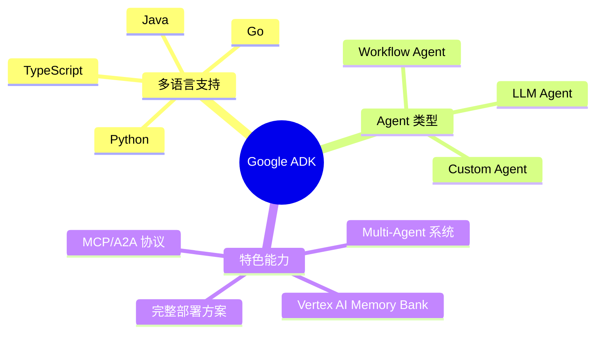

---

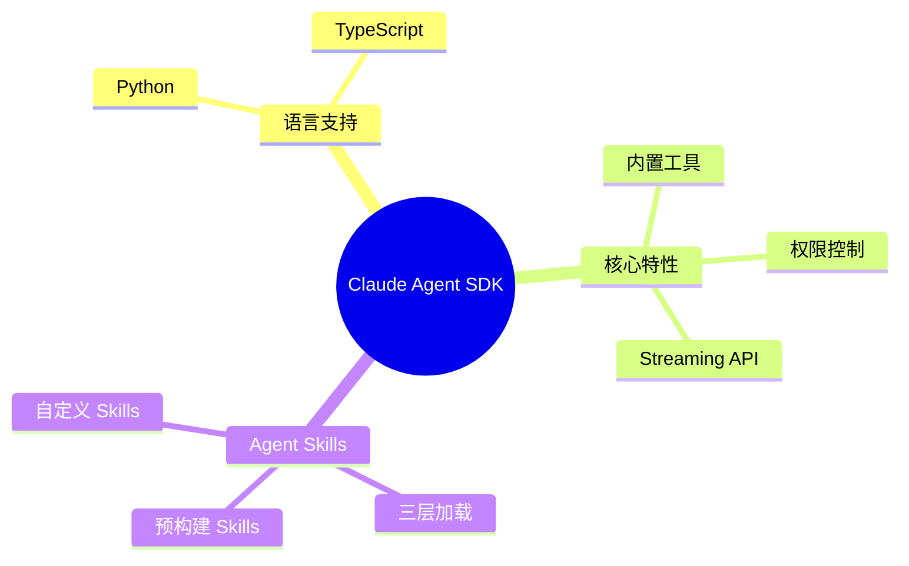

---

## 2. Google ADK 深度分析

### 2.1 架构概览

Google Agent Development Kit (ADK) 是一个灵活的、模块化的框架，专为构建和部署 AI Agent 而设计<sup>[[1]](#ref1)</sup>。ADK 的核心设计理念包括：

- **模块化架构**：各组件可独立使用和组合
- **多语言支持**：Python（主要）、TypeScript、Go、Java
- **生产就绪**：完整的部署、评估和安全方案
- **生态整合**：与 Google Cloud 服务深度集成

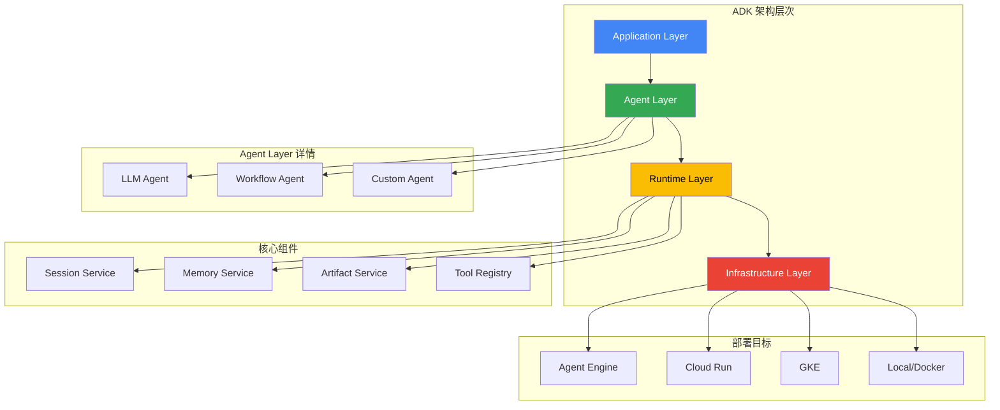

### 2.2 Agent 类型体系

ADK 提供三种核心 Agent 类型，每种类型针对不同的使用场景<sup>[[4]](#ref4)</sup>：

#### 2.2.1 LLM Agent（LlmAgent / Agent）

LLM Agent 是 ADK 的核心组件，使用大语言模型作为"思考引擎"，进行推理、决策和生成响应<sup>[[5]](#ref5)</sup>。

**核心特性**：

- **非确定性行为**：基于 LLM 动态决定执行路径
- **工具调用**：根据上下文自主选择使用哪些工具
- **任务委托**：可将控制权转移给其他 Agent

**关键配置**：

| 参数                             | 说明                                     |
| -------------------------------- | ---------------------------------------- |
| `name`                           | Agent 唯一标识符                         |
| `model`                          | 使用的 LLM 模型（如 `gemini-2.0-flash`） |
| `instruction`                    | 指导 Agent 行为的系统指令                |
| `tools`                          | 可用工具列表                             |
| `generate_content_config`        | LLM 生成参数配置                         |
| `input_schema` / `output_schema` | 输入输出结构定义                         |

**代码示例**：

```python
from google.adk.agents import LlmAgent

# 定义工具函数
def get_capital_city(country: str) -> str:
    """获取指定国家的首都城市"""
    capitals = {"france": "Paris", "japan": "Tokyo", "canada": "Ottawa"}
    return capitals.get(country.lower(), f"未知国家: {country}")

# 创建 LLM Agent
capital_agent = LlmAgent(
    model="gemini-2.0-flash",
    name="capital_agent",
    description="回答关于国家首都的问题",
    instruction="""你是一个地理知识专家。
    当用户询问某个国家的首都时，使用 get_capital_city 工具获取答案。
    如果工具返回未知，礼貌地告知用户并建议其他获取信息的方式。""",
    tools=[get_capital_city]
)
```

#### 2.2.2 Workflow Agent（Sequential / Parallel / Loop）

Workflow Agent 是专门用于编排子 Agent 执行流程的控制器，本身不使用 LLM 进行决策，而是遵循预定义的执行模式<sup>[[6]](#ref6)</sup>。

**三种工作流模式**：

| 类型              | 执行模式 | 适用场景           |
| ----------------- | -------- | ------------------ |
| `SequentialAgent` | 顺序执行 | 有依赖关系的任务链 |
| `ParallelAgent`   | 并行执行 | 独立任务批处理     |
| `LoopAgent`       | 循环执行 | 迭代优化、轮询检查 |

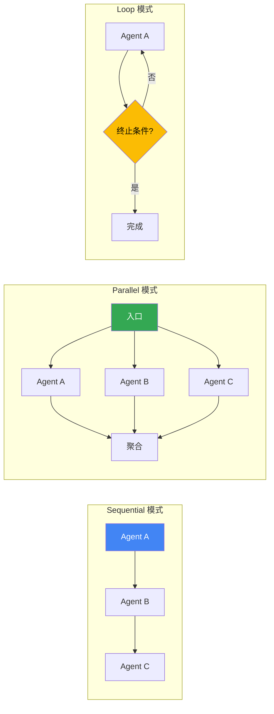

#### 2.2.3 Custom Agent

通过继承 `BaseAgent` 类，可以实现自定义的 Agent 逻辑，满足特殊需求<sup>[[4]](#ref4)</sup>。

```python
from google.adk.agents import BaseAgent

class ValidationAgent(BaseAgent):
    """自定义验证 Agent"""

    async def run(self, context):
        # 实现自定义逻辑
        data = context.state.get("pending_data")
        is_valid = self._validate(data)
        context.state["validation_result"] = is_valid
        return {"validated": is_valid}

    def _validate(self, data):
        # 验证逻辑
        return data is not None and len(data) > 0
```

### 2.3 Tools 生态系统

ADK 提供丰富的工具生态系统，支持多种工具类型<sup>[[7]](#ref7)</sup>：

```mermaid
graph TB
    subgraph "Tools 分类"
        direction TB
        T[Tools for Agents]

        subgraph "Gemini API Tools"
            G1[Code Execution]
            G2[Google Search]
            G3[Computer Use]
        end

        subgraph "Google Cloud Tools"
            C1[BigQuery]
            C2[Spanner]
            C3[Vertex AI Search]
            C4[RAG Engine]
            C5[Bigtable]
            C6[Application Integration]
        end

        subgraph "Third-party Tools"
            P1[GitHub]
            P2[GitLab]
            P3[Atlassian]
            P4[Notion]
            P5[Qdrant]
            P6[n8n]
        end

        subgraph "Custom Tools"
            U1[Function Tools]
            U2[MCP Tools]
            U3[OpenAPI Tools]
        end
    end

    T --> G1 & G2 & G3
    T --> C1 & C2 & C3 & C4 & C5 & C6
    T --> P1 & P2 & P3 & P4 & P5 & P6
    T --> U1 & U2 & U3

    style T fill:#4285f4,color:white
    style G1 fill:#34a853,color:white
    style C1 fill:#fbbc04,color:black
    style P1 fill:#ea4335,color:white
    style U1 fill:#9c27b0,color:white
```

#### 工具定义方式

**1. 函数工具（推荐）**：

```python
def search_database(query: str, limit: int = 10) -> list:
    """在数据库中搜索记录

    Args:
        query: 搜索关键词
        limit: 返回结果数量限制

    Returns:
        匹配的记录列表
    """
    # Python ADK 自动将函数包装为 FunctionTool
    return db.search(query, limit=limit)

agent = LlmAgent(
    model="gemini-2.0-flash",
    name="search_agent",
    tools=[search_database]  # 直接传入函数
)
```

**2. MCP 工具**：

```python
from google.adk.tools.mcp import MCPToolset

# 连接 MCP 服务器
mcp_tools = MCPToolset.from_server("my-mcp-server")

agent = LlmAgent(
    model="gemini-2.0-flash",
    name="mcp_agent",
    tools=mcp_tools.get_tools()
)
```

### 2.4 Session、State 与 Memory

ADK 提供完整的上下文管理体系，包含三个层次<sup>[[8]](#ref8)</sup>：

#### 2.4.1 概念层次

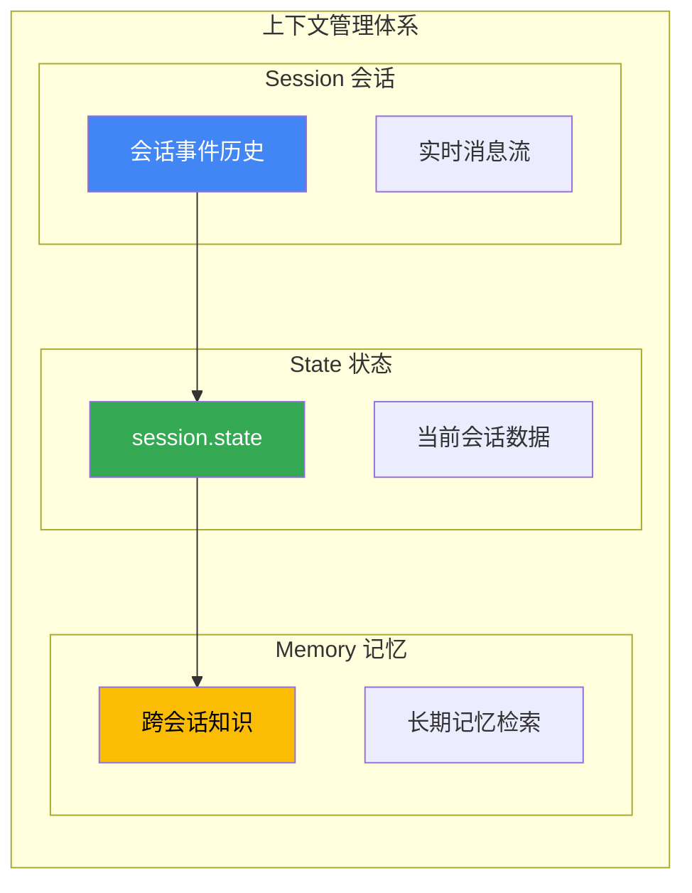

| 层次        | 作用域   | 生命周期 | 典型用途             |
| ----------- | -------- | -------- | -------------------- |
| **Session** | 单次对话 | 会话期间 | 消息历史、事件序列   |
| **State**   | 当前会话 | 会话期间 | 购物车、用户偏好     |
| **Memory**  | 跨会话   | 持久化   | 知识库检索、历史记忆 |

#### 2.4.2 Memory Service 实现

ADK 支持多种 Memory Service 实现<sup>[[9]](#ref9)</sup>：

| 服务类型                    | 适用场景  | 特点                 |
| --------------------------- | --------- | -------------------- |
| `InMemoryMemoryService`     | 开发/测试 | 简单、无持久化       |
| `VertexAiMemoryBankService` | 生产环境  | 托管服务、自动向量化 |
| 自定义实现                  | 特殊需求  | 灵活集成             |

**Vertex AI Memory Bank 集成**：

```python
from google.adk.memory import VertexAiMemoryBankService

# 配置 Memory Bank
memory_service = VertexAiMemoryBankService(
    project_id="my-gcp-project",
    location="us-central1"
)

# 在 Agent 中使用
agent = LlmAgent(
    model="gemini-2.0-flash",
    name="memory_agent",
    memory_service=memory_service
)
```

### 2.5 Context 管理

ADK 提供四种 Context 类型，用于不同场景<sup>[[10]](#ref10)</sup>：

| Context 类型        | 使用场景       | 主要能力                |
| ------------------- | -------------- | ----------------------- |
| `InvocationContext` | Agent 实现内部 | 完整访问                |
| `ReadonlyContext`   | 指令提供器     | 只读访问                |
| `CallbackContext`   | 回调函数       | 事件处理                |
| `ToolContext`       | 工具函数       | 状态读写、Artifact 操作 |

```python
from google.adk.context import ToolContext

def process_document(file_path: str, ctx: ToolContext) -> str:
    """处理文档并保存结果"""

    # 读取状态
    user_id = ctx.state.get("user_id")

    # 处理文档
    content = read_file(file_path)
    summary = summarize(content)

    # 保存 Artifact
    ctx.save_artifact("document_summary", summary.encode())

    # 更新状态
    ctx.state["last_processed"] = file_path

    return summary
```

### 2.6 Multi-Agent 系统

ADK 原生支持构建复杂的多 Agent 系统<sup>[[11]](#ref11)</sup>：

#### 2.6.1 Agent 层级结构

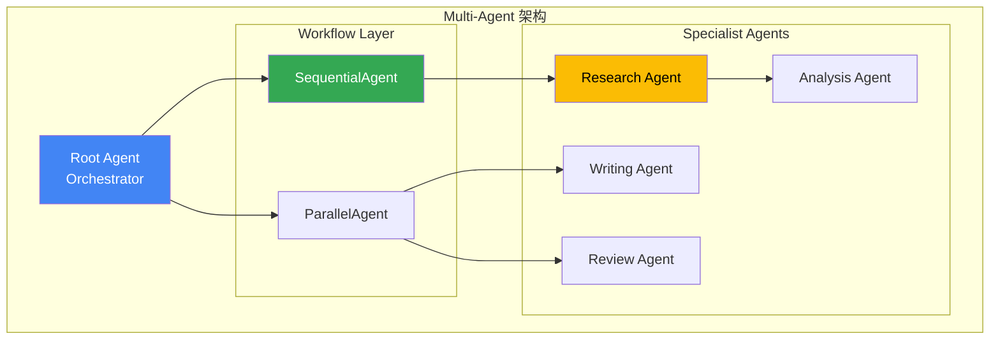

#### 2.6.2 Agent 委托模式

```python
from google.adk.agents import LlmAgent, SequentialAgent

# 定义专家 Agent
researcher = LlmAgent(
    model="gemini-2.0-flash",
    name="researcher",
    instruction="你是一个研究专家，负责收集和整理信息..."
)

analyst = LlmAgent(
    model="gemini-2.0-flash",
    name="analyst",
    instruction="你是一个数据分析师，负责分析研究数据..."
)

writer = LlmAgent(
    model="gemini-2.0-flash",
    name="writer",
    instruction="你是一个技术写作专家，负责撰写报告..."
)

# 组合为工作流
report_pipeline = SequentialAgent(
    name="report_pipeline",
    sub_agents=[researcher, analyst, writer]
)
```

### 2.7 MCP 与 A2A 协议支持

#### 2.7.1 Model Context Protocol (MCP)

MCP 是一个开放标准，用于标准化 LLM 与外部应用、数据源和工具之间的通信<sup>[[12]](#ref12)</sup>。

**ADK 支持两种 MCP 模式**：

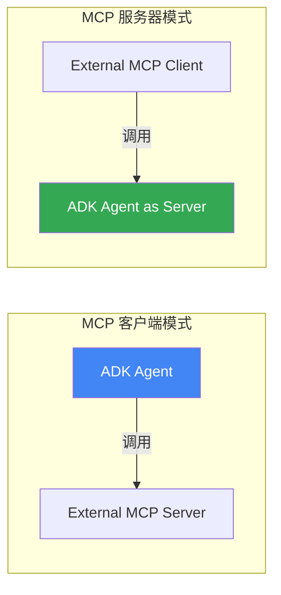

**MCP Toolbox for Databases**：

支持的数据源包括 Cloud SQL、AlloyDB、Spanner、Bigtable、Firestore 等<sup>[[12]](#ref12)</sup>。

#### 2.7.2 Agent2Agent (A2A) Protocol

A2A 是 Agent 间安全通信的协议标准<sup>[[13]](#ref13)</sup>：

```python
# 暴露 Agent 为 A2A 服务
from google.adk.a2a import A2AServer

a2a_server = A2AServer(agent=my_agent)
a2a_server.serve(port=8080)

# 消费远程 A2A Agent
from google.adk.a2a import A2AClient

remote_agent = A2AClient("https://remote-agent.example.com")
result = await remote_agent.invoke("帮我分析这份数据")
```

### 2.8 部署选项

ADK 提供灵活的部署选项<sup>[[14]](#ref14)</sup>：

| 部署方式                     | 特点               | 适用场景         |
| ---------------------------- | ------------------ | ---------------- |
| **Agent Engine (Vertex AI)** | 托管服务、自动扩展 | 生产环境首选     |
| **Cloud Run**                | 容器化、按需扩展   | 自定义运行时需求 |
| **GKE**                      | Kubernetes 集成    | 复杂编排需求     |
| **本地 / Docker**            | 快速开发测试       | 开发环境         |

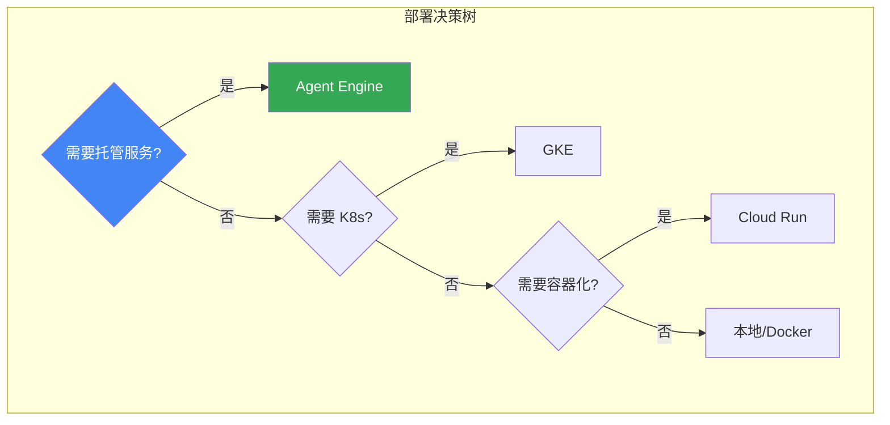

### 2.9 评估与安全

#### 2.9.1 评估框架

ADK 内置评估能力，支持<sup>[[15]](#ref15)</sup>：

- **轨迹评估**：评估 Agent 的决策路径
- **工具使用评估**：验证工具调用的正确性
- **最终输出评估**：检验结果质量

**评估运行方式**：

- `adk web`：Web UI 可视化评估
- `pytest`：程序化测试集成
- `adk eval`：CLI 命令行评估

#### 2.9.2 安全最佳实践

ADK 安全框架涵盖<sup>[[16]](#ref16)</sup>：

| 安全层面       | 实践建议            |
| -------------- | ------------------- |
| **身份认证**   | OAuth 2.0 / API Key |
| **Guardrails** | 输入输出内容筛查    |
| **沙箱执行**   | 代码执行隔离        |
| **网络控制**   | VPC-SC 边界         |

---

## 3. Claude Agent SDK 深度分析

### 3.1 SDK 概述

Claude Agent SDK（原 Claude Code SDK）是 Anthropic 提供的 Agent 开发框架，允许开发者以编程方式使用 Claude Code 的全部能力<sup>[[2]](#ref2)</sup>。

**核心定位**：

- 将 Claude Code 的能力以 SDK 形式提供
- 支持构建自主 Agent 应用
- 内置工具执行、上下文管理和重试机制

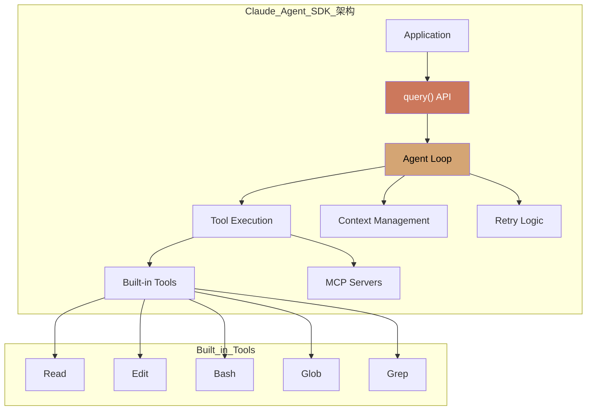

### 3.2 核心 API

#### 3.2.1 query() 函数

`query()` 是 SDK 的核心入口，返回异步迭代器<sup>[[17]](#ref17)</sup>：

```python
import asyncio
from claude_agent_sdk import query, ClaudeAgentOptions

async def main():
    async for message in query(
        prompt="在 auth.py 中找到并修复 bug",
        options=ClaudeAgentOptions(
            allowed_tools=["Read", "Edit", "Bash"],
            permission_mode="acceptEdits"
        )
    ):
        print(message)  # 实时流式输出

asyncio.run(main())
```

**TypeScript 版本**：

```typescript
import { query, ClaudeAgentOptions } from "@anthropic-ai/agent-sdk";

async function main() {
  for await (const message of query({
    prompt: "Find and fix the bug in auth.py",
    options: {
      allowedTools: ["Read", "Edit", "Bash"],
      permissionMode: "acceptEdits",
    },
  })) {
    console.log(message);
  }
}

main();
```

#### 3.2.2 ClaudeAgentOptions

| 配置项            | 说明                 | 类型        |
| ----------------- | -------------------- | ----------- |
| `allowed_tools`   | 允许使用的工具列表   | `List[str]` |
| `permission_mode` | 权限控制模式         | `str`       |
| `system_prompt`   | 自定义系统提示       | `str`       |
| `mcp_servers`     | MCP 服务器配置       | `Dict`      |
| `setting_sources` | 配置源（如 project） | `List[str]` |

### 3.3 内置工具

Claude Agent SDK 提供以下内置工具<sup>[[17]](#ref17)</sup>：

| 工具     | 功能            | 权限需求 |
| -------- | --------------- | -------- |
| **Read** | 读取文件内容    | 文件访问 |
| **Edit** | 编辑文件内容    | 文件修改 |
| **Bash** | 执行 Shell 命令 | 命令执行 |
| **Glob** | 文件模式匹配    | 文件访问 |
| **Grep** | 内容搜索        | 文件访问 |

**工具组合示例**：

```python
# 只读分析模式
analysis_options = ClaudeAgentOptions(
    allowed_tools=["Read", "Glob", "Grep"]
)

# 代码修改模式
edit_options = ClaudeAgentOptions(
    allowed_tools=["Read", "Edit", "Glob"]
)

# 完整开发模式
dev_options = ClaudeAgentOptions(
    allowed_tools=["Read", "Edit", "Bash", "Glob", "Grep"]
)
```

### 3.4 权限控制

SDK 提供三种权限模式<sup>[[17]](#ref17)</sup>：

| 模式                | 行为             | 适用场景   |
| ------------------- | ---------------- | ---------- |
| `default`           | 需要用户确认     | 交互式应用 |
| `acceptEdits`       | 自动批准文件操作 | 自动化脚本 |
| `bypassPermissions` | 跳过所有权限检查 | 受控环境   |

**自定义权限回调**：

```python
async def can_use_tool(tool_name: str, args: dict) -> bool:
    """自定义工具使用权限逻辑"""
    if tool_name == "Bash":
        # 限制危险命令
        command = args.get("command", "")
        dangerous = ["rm -rf", "sudo", "chmod 777"]
        return not any(d in command for d in dangerous)
    return True

options = ClaudeAgentOptions(
    permission_mode="default",
    can_use_tool=can_use_tool
)
```

### 3.5 配置与扩展

#### 3.5.1 项目级配置

通过 `.claude/` 目录结构实现项目级配置<sup>[[2]](#ref2)</sup>：

```
my-project/
├── .claude/
│   ├── skills/
│   │   └── SKILL.md
│   ├── commands/
│   │   └── custom-command.md
│   └── CLAUDE.md
├── CLAUDE.md
└── ...
```

#### 3.5.2 MCP 服务器集成

```python
options = ClaudeAgentOptions(
    mcp_servers={
        "database": {
            "command": "npx",
            "args": ["@modelcontextprotocol/server-postgres"]
        }
    }
)
```

---

## 4. Agent Skills 深度分析

### 4.1 Skills 概念与价值

Agent Skills 是 Claude 的模块化能力扩展系统，提供可复用的领域专业知识<sup>[[3]](#ref3)</sup>：

**核心价值**：

- **专业化**：将通用 Agent 转变为领域专家
- **减少重复**：一次创建，自动复用
- **能力组合**：多个 Skills 组合实现复杂工作流

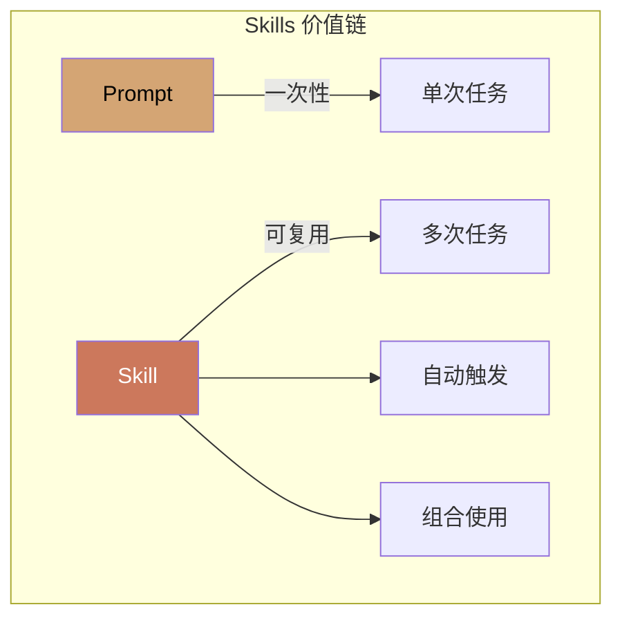

### 4.2 三层渐进加载架构

Skills 采用独特的三层渐进加载机制，优化上下文使用<sup>[[3]](#ref3)</sup>：

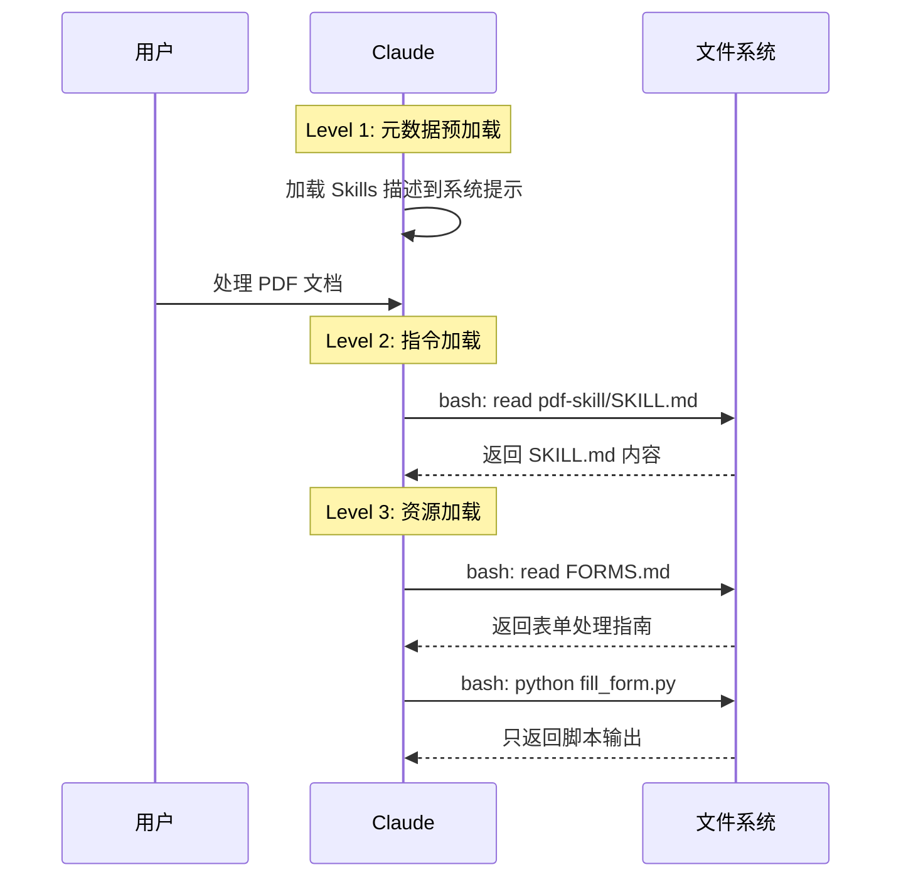

#### 三层详解

| 层级           | 内容类型         | 加载时机 | Context 消耗 |
| -------------- | ---------------- | -------- | ------------ |
| **L1: 元数据** | YAML frontmatter | 启动时   | 极小         |
| **L2: 指令**   | SKILL.md 正文    | 触发时   | 按需         |
| **L3: 资源**   | 附加文件、脚本   | 引用时   | 仅输出       |

**Level 1 示例**：

```yaml
---
name: pdf-processing
description: 从 PDF 文件中提取文本和表格，填写表单，合并文档。
  在处理 PDF 文件或用户提到 PDF、表单、文档提取时使用。
---
```

**Level 2 + Level 3 结构**：

```
pdf-skill/
├── SKILL.md           # L2: 主指令
├── FORMS.md           # L3: 表单填写指南
├── REFERENCE.md       # L3: API 参考
└── scripts/
    └── fill_form.py   # L3: 可执行脚本
```

### 4.3 预构建 Skills

Anthropic 提供以下预构建 Skills<sup>[[3]](#ref3)</sup>：

| Skill          | 能力                     | 文件格式 |
| -------------- | ------------------------ | -------- |
| **PowerPoint** | 创建演示、编辑幻灯片     | .pptx    |
| **Excel**      | 创建表格、数据分析、图表 | .xlsx    |
| **Word**       | 创建文档、格式化         | .docx    |
| **PDF**        | 生成格式化 PDF 报告      | .pdf     |

**使用方式**：

```python
# 在 API 中使用 Skills
response = client.messages.create(
    model="claude-sonnet-4-20250514",
    messages=[{
        "role": "user",
        "content": "根据销售数据创建一个 Excel 报表，包含图表"
    }],
    # Skills 自动触发，无需显式配置
)
```

### 4.4 自定义 Skills

#### 4.4.1 Skill 结构

每个 Skill 必须包含 `SKILL.md` 文件<sup>[[3]](#ref3)</sup>：

````md
---
name: code-review
description: 执行代码审查，检查代码质量、安全问题和最佳实践。
  当用户请求代码审查或提到代码质量检查时使用。
---

# Code Review Skill

## 检查清单

1. **代码风格**

   - 命名约定是否一致
   - 缩进和格式是否正确

2. **安全性**

   - 是否存在 SQL 注入风险
   - 是否正确处理用户输入

3. **性能**
   - 是否存在不必要的循环
   - 是否有优化空间

## 输出格式

使用以下模板输出审查结果：

```md
## 代码审查报告

### 问题总结

### 具体建议

### 风险评级
```
````

#### 4.4.2 字段约束

| 字段          | 约束                                   |
| ------------- | -------------------------------------- |
| `name`        | 最长 64 字符，仅小写字母、数字、连字符 |
| `description` | 非空，最长 1024 字符                   |
| 禁止内容      | XML 标签、保留词（anthropic、claude）  |

### 4.5 安全考虑

Skills 安全最佳实践<sup>[[3]](#ref3)</sup>：

> [!CAUTION] > **仅使用可信来源的 Skills**
> Skills 可以指导 Claude 执行代码和调用工具。恶意 Skill 可能导致数据泄露或系统损害。

**安全检查清单**：

- [ ] 审查所有 Skill 文件（SKILL.md、脚本、资源）
- [ ] 检查异常网络调用模式
- [ ] 验证文件访问范围
- [ ] 审计外部 URL 依赖

---

## 5. 功能对比分析

### 5.1 核心能力矩阵

| 能力维度        | Google ADK                    | Claude Agent SDK            |
| --------------- | ----------------------------- | --------------------------- |
| **语言支持**    | Python, TS, Go, Java          | Python, TypeScript          |
| **Agent 类型**  | LLM, Workflow, Custom         | 单一 Agent Loop             |
| **Multi-Agent** | ✅ 原生支持                   | ❌ 需自行实现               |
| **内置工具**    | 需集成                        | ✅ Read/Edit/Bash/Glob/Grep |
| **Memory 系统** | ✅ Vertex AI Memory Bank      | 通过 Skills/配置            |
| **MCP 支持**    | ✅ 客户端 + 服务器            | ✅ 客户端                   |
| **评估框架**    | ✅ 内置                       | ❌ 无                       |
| **部署方案**    | ✅ Agent Engine/Cloud Run/GKE | 需自行实现                  |
| **Skills 系统** | ❌ 无                         | ✅ 三层渐进加载             |

### 5.2 架构设计对比

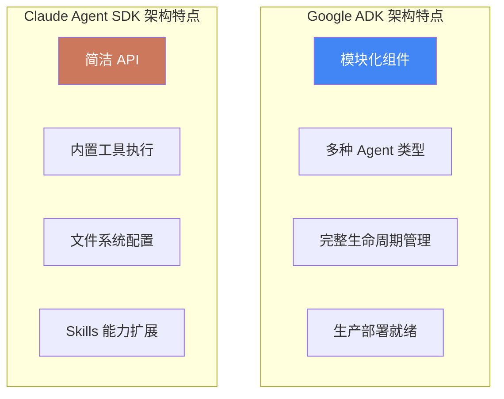

### 5.3 适用场景分析

| 场景                  | 推荐方案         | 理由                  |
| --------------------- | ---------------- | --------------------- |
| **复杂多 Agent 系统** | Google ADK       | 原生 Multi-Agent 支持 |
| **代码编辑任务**      | Claude Agent SDK | 内置 Read/Edit 工具   |
| **企业级部署**        | Google ADK       | Agent Engine 托管服务 |
| **快速原型开发**      | Claude Agent SDK | 简洁 API，即开即用    |
| **文档处理任务**      | Claude + Skills  | 预构建 Office Skills  |
| **跨会话记忆需求**    | Google ADK       | Vertex AI Memory Bank |

---

## 6. Demo 实施指引

### 6.1 Google ADK 集成指南

#### 6.1.1 环境准备

```bash
# 创建项目目录
mkdir adk-demo && cd adk-demo

# 创建虚拟环境
python -m venv .venv
source .venv/bin/activate

# 安装 ADK
pip install google-adk

# 配置 Google Cloud 认证
gcloud auth application-default login
```

#### 6.1.2 基础 Agent 实现

```python
# agents/research_agent.py
from google.adk.agents import LlmAgent
from google.adk.tools import google_search

def create_research_agent():
    """创建研究 Agent"""
    return LlmAgent(
        model="gemini-2.0-flash",
        name="research_agent",
        description="研究并总结特定主题的信息",
        instruction="""你是一个专业的研究助手。

任务流程：
1. 使用 google_search 工具搜索相关信息
2. 分析搜索结果，提取关键事实
3. 组织信息，生成结构化摘要

输出要求：
- 包含信息来源
- 标注关键数据点
- 提供进一步研究建议""",
        tools=[google_search]
    )
```

#### 6.1.3 Multi-Agent 工作流

```python
# agents/report_pipeline.py
from google.adk.agents import LlmAgent, SequentialAgent, ParallelAgent

def create_report_pipeline():
    """创建报告生成工作流"""

    # 研究 Agent
    researcher = LlmAgent(
        model="gemini-2.0-flash",
        name="researcher",
        instruction="收集和整理主题相关信息..."
    )

    # 分析 Agent
    analyst = LlmAgent(
        model="gemini-2.0-flash",
        name="analyst",
        instruction="分析研究数据，提取洞见..."
    )

    # 并行处理：图表生成和文本写作
    chart_maker = LlmAgent(
        model="gemini-2.0-flash",
        name="chart_maker",
        instruction="基于分析结果生成可视化..."
    )

    writer = LlmAgent(
        model="gemini-2.0-flash",
        name="writer",
        instruction="撰写报告正文..."
    )

    # 组合工作流
    parallel_stage = ParallelAgent(
        name="content_generation",
        sub_agents=[chart_maker, writer]
    )

    return SequentialAgent(
        name="report_pipeline",
        sub_agents=[researcher, analyst, parallel_stage]
    )
```

#### 6.1.4 运行与测试

```python
# main.py
import asyncio
from google.adk.runner import Runner
from agents.report_pipeline import create_report_pipeline

async def main():
    pipeline = create_report_pipeline()
    runner = Runner(agent=pipeline)

    result = await runner.run(
        prompt="生成一份关于 AI Agent 发展趋势的研究报告"
    )

    print(result)

if __name__ == "__main__":
    asyncio.run(main())
```

### 6.2 Claude Agent SDK 集成指南

#### 6.2.1 环境准备

```bash
# 创建项目目录
mkdir claude-agent-demo && cd claude-agent-demo

# 安装 Claude Code（必需运行时）
# macOS/Linux
curl -fsSL https://code.claude.com/install.sh | sh

# 运行 claude 进行认证
claude

# 安装 SDK
pip install claude-agent-sdk

# 或使用 uv
uv add claude-agent-sdk
```

#### 6.2.2 基础 Agent 实现

```python
# agent.py
import asyncio
from claude_agent_sdk import query, ClaudeAgentOptions

async def code_review_agent(file_path: str):
    """代码审查 Agent"""

    prompt = f"""请审查 {file_path} 文件的代码：

1. 检查代码风格和命名约定
2. 识别潜在的安全问题
3. 评估代码可维护性
4. 提供改进建议

输出结构化的审查报告。"""

    options = ClaudeAgentOptions(
        allowed_tools=["Read", "Glob", "Grep"],
        permission_mode="default"
    )

    result = []
    async for message in query(prompt=prompt, options=options):
        if hasattr(message, 'content'):
            result.append(message.content)
            print(message.content)

    return "\n".join(result)

if __name__ == "__main__":
    asyncio.run(code_review_agent("src/main.py"))
```

#### 6.2.3 带 Skills 的 Agent

```python
# agent_with_skills.py
import asyncio
from claude_agent_sdk import query, ClaudeAgentOptions

async def document_processor():
    """文档处理 Agent（使用 Skills）"""

    options = ClaudeAgentOptions(
        allowed_tools=["Read", "Edit", "Bash"],
        setting_sources=["project"],  # 启用项目级配置（包括 Skills）
        permission_mode="acceptEdits"
    )

    prompt = """读取 data/sales_report.csv 文件，然后：
1. 分析销售数据趋势
2. 创建一个 Excel 报表，包含月度汇总和图表
3. 生成一份 PDF 格式的管理层摘要"""

    async for message in query(prompt=prompt, options=options):
        print(message)

if __name__ == "__main__":
    asyncio.run(document_processor())
```

#### 6.2.4 自定义 Skill 创建

````bash
# 创建 Skill 目录结构
mkdir -p .claude/skills/data-analysis

# 创建 SKILL.md
cat > .claude/skills/data-analysis/SKILL.md << 'EOF'
---
name: data-analysis
description: 执行数据分析任务，包括统计分析、可视化和报告生成。
             当用户请求数据分析、统计或可视化时使用。
---

# Data Analysis Skill

## 分析流程

1. **数据加载**
   - 使用 pandas 读取数据文件
   - 检查数据质量

2. **探索性分析**
   - 计算描述性统计
   - 识别异常值

3. **可视化**
   - 使用 matplotlib/seaborn 创建图表
   - 保存为 PNG 文件

## 代码模板

```python
import pandas as pd
import matplotlib.pyplot as plt

def analyze(file_path):
    df = pd.read_csv(file_path)
    print(df.describe())
    # ... 更多分析
```

EOF

````

### 6.3 混合架构方案

对于复杂场景，可以考虑混合使用两个框架：

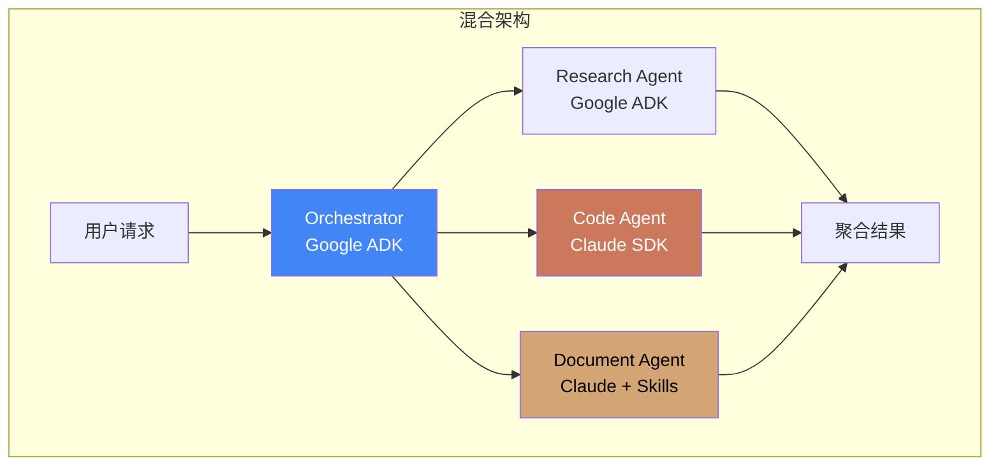

**实现思路**：

1. 使用 ADK 作为顶层编排器
2. 代码相关任务委托给 Claude Agent SDK
3. 文档处理使用 Claude + Skills
4. 通过 API 或 MCP 进行跨框架通信

---

## 7. 结论与建议

### 7.1 框架选择建议

| 需求场景                    | 推荐方案                               |
| --------------------------- | -------------------------------------- |
| 需要复杂的 Multi-Agent 协作 | **Google ADK**                         |
| 以代码编辑为主的任务        | **Claude Agent SDK**                   |
| 需要 Office 文档处理        | **Claude + Agent Skills**              |
| 需要企业级部署和监控        | **Google ADK + Agent Engine**          |
| 快速构建原型                | **Claude Agent SDK**                   |
| 需要跨会话记忆              | **Google ADK + Vertex AI Memory Bank** |

### 7.2 本项目集成建议

基于本项目（AI Agent 研究库）的特点，建议：

1. **短期**：使用 Claude Agent SDK 实现代码分析和文档处理功能
2. **中期**：引入 Google ADK 构建多 Agent 研究工作流
3. **长期**：采用混合架构，发挥两者优势

### 7.3 未来发展趋势

1. **标准化**：MCP 和 A2A 等协议将促进跨框架互操作
2. **专业化**：Skills 类模块化能力扩展将成为主流
3. **托管化**：云端托管 Agent 服务将降低运维门槛

---

## 8. References

<a id="ref1"></a>[1] Google, "Agent Development Kit (ADK) Documentation," 2024. [Online]. Available: https://google.github.io/adk-docs/

<a id="ref2"></a>[2] Anthropic, "Claude Agent SDK Overview," 2024. [Online]. Available: https://platform.claude.com/docs/en/agent-sdk/overview

<a id="ref3"></a>[3] Anthropic, "Agent Skills Overview," 2024. [Online]. Available: https://platform.claude.com/docs/en/agents-and-tools/agent-skills/overview

<a id="ref4"></a>[4] Google, "Google ADK - Agents Documentation," 2024. [Online]. Available: https://google.github.io/adk-docs/agents/

<a id="ref5"></a>[5] Google, "Google ADK - LLM Agents," 2024. [Online]. Available: https://google.github.io/adk-docs/agents/llm-agents/

<a id="ref6"></a>[6] Google, "Google ADK - Workflow Agents," 2024. [Online]. Available: https://google.github.io/adk-docs/agents/workflow-agents/

<a id="ref7"></a>[7] Google, "Google ADK - Tools for Agents," 2024. [Online]. Available: https://google.github.io/adk-docs/tools/

<a id="ref8"></a>[8] Google, "Google ADK - Sessions & Memory," 2024. [Online]. Available: https://google.github.io/adk-docs/sessions/

<a id="ref9"></a>[9] Google, "Google ADK - Memory Service," 2024. [Online]. Available: https://google.github.io/adk-docs/sessions/memory/

<a id="ref10"></a>[10] Google, "Google ADK - Context Management," 2024. [Online]. Available: https://google.github.io/adk-docs/context/

<a id="ref11"></a>[11] Google, "Google ADK - Multi-Agent Systems," 2024. [Online]. Available: https://google.github.io/adk-docs/agents/multi-agents/

<a id="ref12"></a>[12] Google, "Google ADK - MCP Protocol Support," 2024. [Online]. Available: https://google.github.io/adk-docs/mcp/

<a id="ref13"></a>[13] Google, "Google ADK - A2A Protocol Support," 2024. [Online]. Available: https://google.github.io/adk-docs/a2a/

<a id="ref14"></a>[14] Google, "Google ADK - Deployment Guide," 2024. [Online]. Available: https://google.github.io/adk-docs/deploy/

<a id="ref15"></a>[15] Google, "Google ADK - Evaluation Framework," 2024. [Online]. Available: https://google.github.io/adk-docs/evaluate/

<a id="ref16"></a>[16] Google, "Google ADK - Safety Best Practices," 2024. [Online]. Available: https://google.github.io/adk-docs/safety/

<a id="ref17"></a>[17] Anthropic, "Claude Agent SDK Quickstart," 2024. [Online]. Available: https://platform.claude.com/docs/en/agent-sdk/quickstart
