# OceanBase 三位一体数据库深度调研报告

> **报告版本**：v1.0
> **调研日期**：2025-12
> **调研对象**：OceanBase Database V4.5.0
> **调研范围**：TP（事务处理）、AP（分析处理）、Vector DB（向量数据库）三位一体能力

---

## 1. 产品概述与定位

### 1.1 产品简介

OceanBase 是由蚂蚁集团自主研发的企业级原生分布式关系数据库，于 2010 年开始研发，至今已有超过 15 年的发展历程<sup>[[1]](#ref1)</sup>。它是中国首个自主研发的通用关系型数据库，具备完全自主知识产权，被广泛应用于金融、电信、政务、零售等核心业务场景<sup>[[2]](#ref2)</sup>。

### 1.2 核心定位

OceanBase 的核心定位是**三位一体**的数据库解决方案：

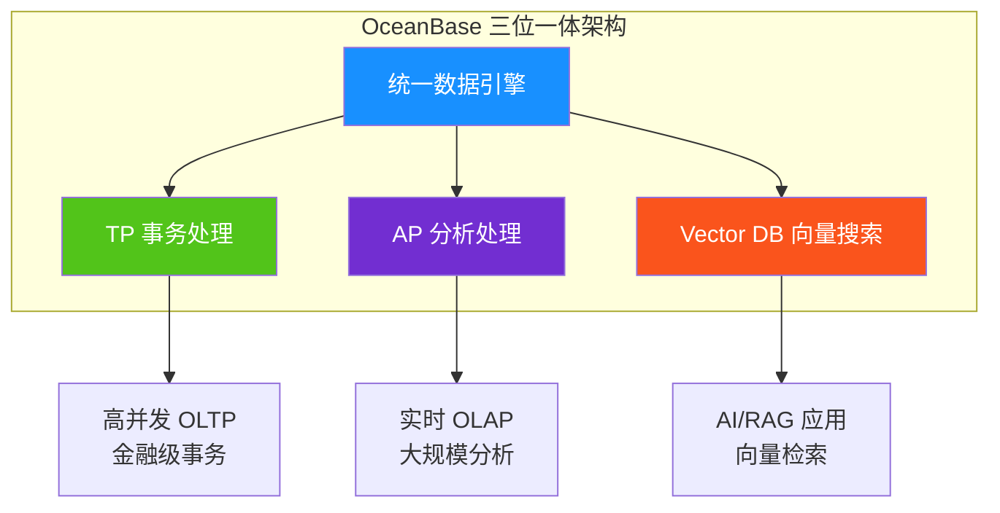

| 能力维度           | 描述                             | 典型场景                     |
| ------------------ | -------------------------------- | ---------------------------- |
| **TP（事务处理）** | 高并发、低延迟的联机事务处理能力 | 支付交易、订单处理、账户管理 |
| **AP（分析处理）** | 大规模数据的实时分析处理能力     | 报表统计、风控分析、商业智能 |
| **Vector DB**      | 高维向量的存储与相似性搜索能力   | RAG 应用、语义搜索、推荐系统 |

### 1.3 版本演进

| 版本     | 发布时间 | 重要特性                         |
| -------- | -------- | -------------------------------- |
| V1.0     | 2014     | 首个正式版本，支付宝核心系统上线 |
| V2.0     | 2017     | 金融级高可用，RPO=0              |
| V3.0     | 2020     | 兼容 MySQL/Oracle，开源社区版    |
| V4.0     | 2022     | HTAP 能力增强，列存引擎          |
| V4.3     | 2024     | 向量搜索能力，AI 原生支持        |
| **V4.5** | 2024     | 向量索引优化、AI 生态集成增强    |

---

## 2. 核心架构与技术原理

### 2.1 整体架构

OceanBase 采用 **Shared-Nothing** 分布式架构，各节点完全对等，通过 Paxos 协议保证数据强一致性<sup>[[3]](#ref3)</sup>。

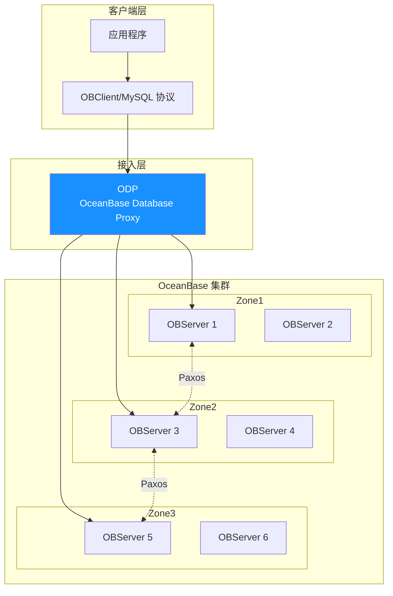

#### 架构层次说明

| 层次       | 组件                           | 功能                         |
| ---------- | ------------------------------ | ---------------------------- |
| **接入层** | ODP (OceanBase Database Proxy) | SQL 路由、读写分离、连接管理 |
| **计算层** | SQL Engine                     | SQL 解析、优化、执行         |
| **存储层** | LSM-Tree Engine                | 数据存储、索引管理           |
| **事务层** | Paxos-based                    | 分布式事务、强一致性保证     |

### 2.2 LSM-Tree 存储引擎

OceanBase 采用**基于 LSM-Tree（Log-Structured Merge-Tree）** 的存储引擎，这是其高性能写入和 HTAP 能力的核心基础<sup>[[4]](#ref4)</sup><sup>[[5]](#ref5)</sup>。

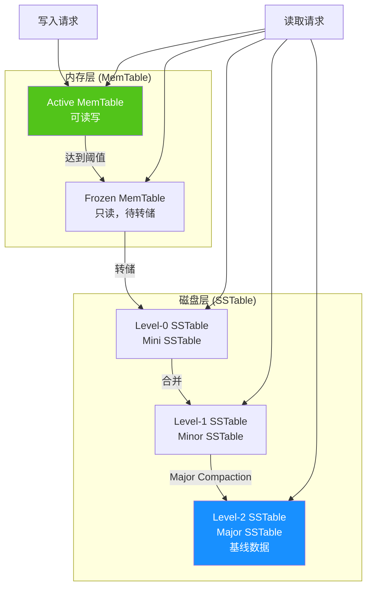

#### LSM-Tree 核心机制

| 机制               | 描述                                        | 优势                     |
| ------------------ | ------------------------------------------- | ------------------------ |
| **随机写转顺序写** | 所有 DML 操作先写入内存 MemTable            | 写入性能提升 10-100 倍   |
| **多级存储**       | MemTable → Mini → Minor → Major SSTable     | 分层管理，平衡读写性能   |
| **宏块/微块设计**  | 2MB 宏块 + 变长微块                         | 减少写放大，提升合并效率 |
| **多级缓存**       | Block Cache + Row Cache + Bloomfilter Cache | 加速读取，减少 I/O       |
| **数据校验**       | 微块级校验和 + 定期巡检                     | 数据完整性保证           |

### 2.3 分布式一致性

OceanBase 采用 **Multi-Paxos** 协议保证数据强一致性<sup>[[6]](#ref6)</sup>：

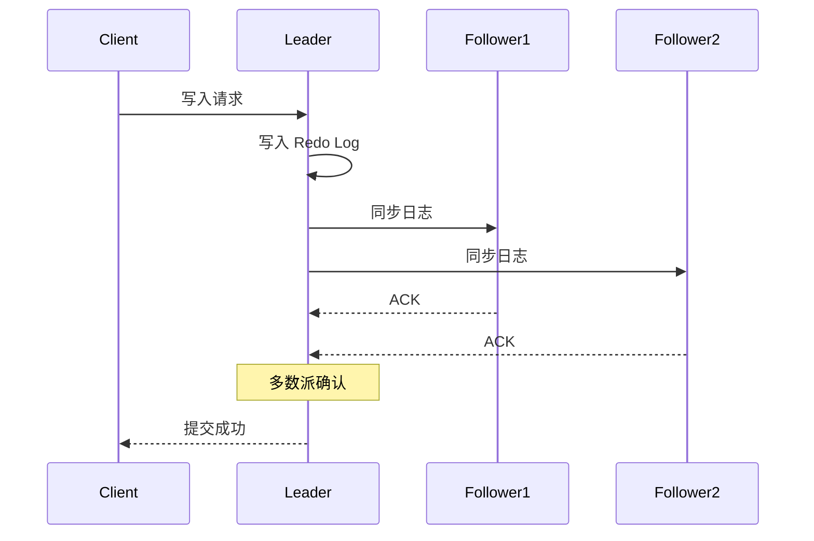

- **RPO = 0**：数据零丢失，满足金融级要求
- **RTO < 30s**：故障自动切换，业务快速恢复
- **三副本部署**：同城三机房或两地三中心

---

## 3. TP（事务处理）能力分析

### 3.1 事务处理特性

OceanBase 在事务处理方面具备金融级能力，已在支付宝核心交易链路验证超过 10 年<sup>[[7]](#ref7)</sup>。

#### 核心事务特性

| 特性              | 描述                           | 技术实现            |
| ----------------- | ------------------------------ | ------------------- |
| **ACID 完整支持** | 原子性、一致性、隔离性、持久性 | 两阶段提交 + Paxos  |
| **分布式事务**    | 跨分区、跨节点事务自动处理     | 全局事务协调器      |
| **隔离级别**      | 支持 RC、RR、Serializable      | MVCC + 行级锁       |
| **高并发**        | 单集群支持百万级 TPS           | 无锁并发 + 异步日志 |

### 3.2 MVCC 多版本并发控制

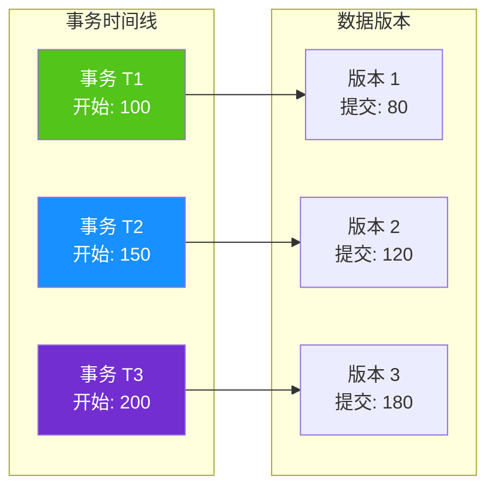

### 3.3 高可用架构

| 部署模式       | 副本分布              | RPO | RTO   | 适用场景     |
| -------------- | --------------------- | --- | ----- | ------------ |
| **同城三机房** | 3 Zone × 3 副本       | 0   | < 30s | 金融核心系统 |
| **两地三中心** | 城市 A(2) + 城市 B(1) | 0   | < 30s | 异地容灾     |
| **三地五中心** | 3 城市 × 5 副本       | 0   | < 60s | 极致容灾     |

---

## 4. AP（分析处理）能力分析

### 4.1 HTAP 混合负载架构

OceanBase 的 HTAP 能力基于**行列混合存储**和**资源隔离**技术实现<sup>[[8]](#ref8)</sup><sup>[[9]](#ref9)</sup>。

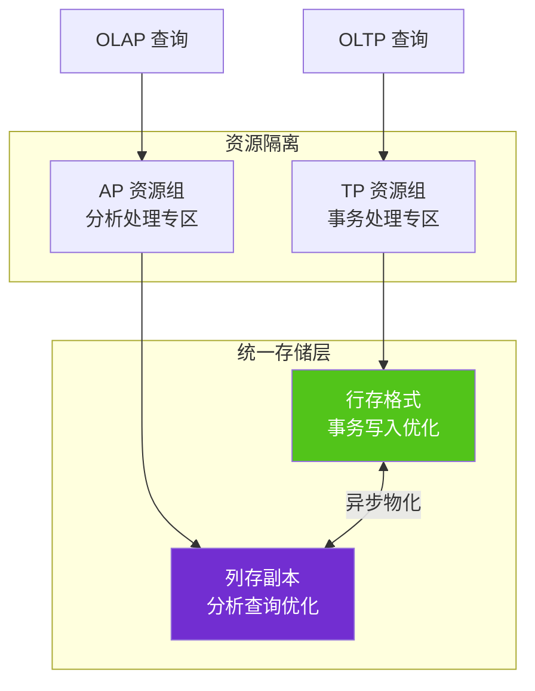

### 4.2 列存引擎特性

| 特性           | 描述               | 性能提升         |
| -------------- | ------------------ | ---------------- |
| **列式存储**   | 按列存储，高压缩比 | 存储节省 3-10 倍 |
| **向量化执行** | SIMD 指令批量处理  | 计算提升 5-10 倍 |
| **MPP 并行**   | 多节点并行查询     | 线性扩展         |
| **智能路由**   | 自动选择行存/列存  | 透明优化         |

### 4.3 分析处理能力

#### 支持的分析场景

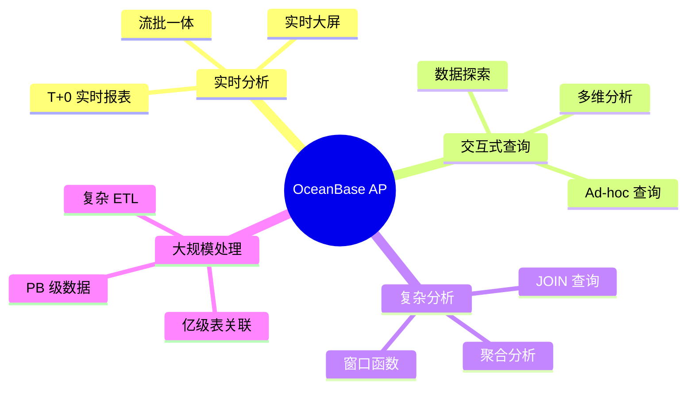

---

## 5. Vector DB 向量搜索能力分析

### 5.1 向量能力概述

OceanBase 从 V4.3.3 版本开始原生支持向量数据类型和向量索引，V4.5 版本进一步增强了向量搜索能力<sup>[[10]](#ref10)</sup><sup>[[11]](#ref11)</sup>。

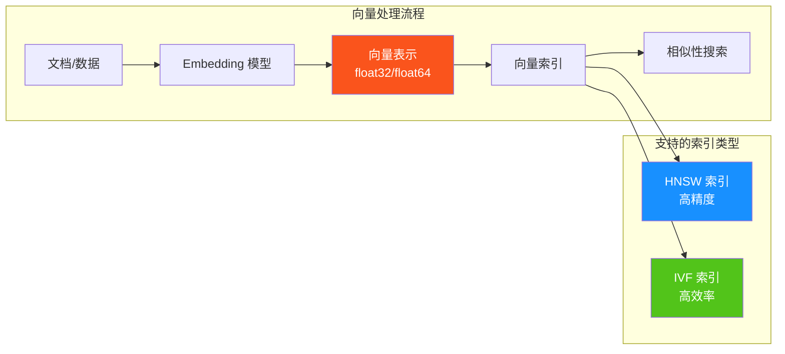

### 5.2 向量数据类型

```sql
-- 创建包含向量列的表
CREATE TABLE articles (
    id INT PRIMARY KEY,
    title VARCHAR(255),
    content TEXT,
    embedding VECTOR(1536)  -- 1536 维向量（OpenAI Ada 模型）
);

-- 插入向量数据
INSERT INTO articles (id, title, content, embedding)
VALUES (1, 'AI 技术发展', '...', '[0.1, 0.2, ..., 0.3]');
```

### 5.3 向量索引算法

#### HNSW（Hierarchical Navigable Small World）

HNSW 是一种基于图的近似最近邻（ANN）算法，通过构建多层导航图实现高效搜索<sup>[[12]](#ref12)</sup>。

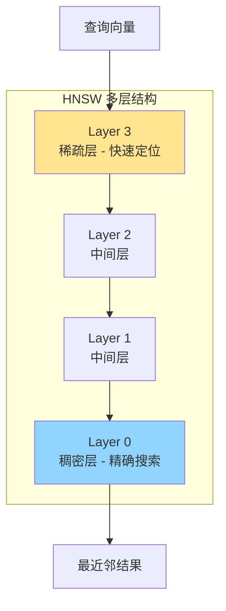

```sql
-- 创建 HNSW 索引
CREATE INDEX idx_embedding_hnsw ON articles
USING HNSW (embedding vector_cosine_ops)
WITH (m = 16, ef_construction = 128);
```

| 参数              | 描述                 | 建议值  |
| ----------------- | -------------------- | ------- |
| `m`               | 每个节点的最大邻居数 | 16-64   |
| `ef_construction` | 构建时的搜索宽度     | 100-200 |
| `ef_search`       | 查询时的搜索宽度     | 40-100  |

#### IVF（Inverted File Flat）

IVF 通过聚类将向量划分到不同的桶中，查询时只搜索最相关的桶<sup>[[13]](#ref13)</sup>。

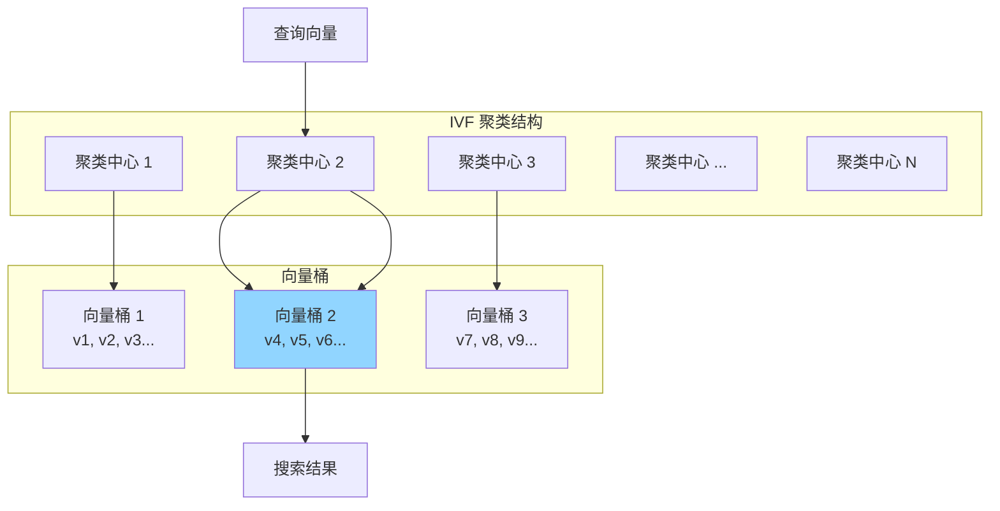

```sql
-- 创建 IVF 索引
CREATE INDEX idx_embedding_ivf ON articles
USING IVF (embedding vector_l2_ops)
WITH (nlist = 100);
```

### 5.4 距离度量方式

| 度量方式          | 函数                | 适用场景           |
| ----------------- | ------------------- | ------------------ |
| **欧氏距离 (L2)** | `vector_l2_ops`     | 物理相似度         |
| **余弦相似度**    | `vector_cosine_ops` | 语义相似度（推荐） |
| **内积**          | `vector_ip_ops`     | 归一化向量         |
| **曼哈顿距离**    | `vector_l1_ops`     | 特定场景           |

### 5.5 向量搜索查询

```sql
-- 最近邻搜索 (KNN)
SELECT id, title,
       embedding <-> query_vector AS distance
FROM articles
ORDER BY embedding <-> '[0.1, 0.2, ...]'::vector
LIMIT 10;

-- 带过滤条件的混合搜索
SELECT id, title, distance
FROM articles
WHERE category = 'technology'
  AND created_at > '2024-01-01'
ORDER BY embedding <=> query_vector
LIMIT 10;
```

### 5.6 向量能力对比

| 特性         | OceanBase V4.5 | PostgreSQL + pgvector | Milvus             |
| ------------ | -------------- | --------------------- | ------------------ |
| **向量维度** | 16,000         | 16,000                | 32,768             |
| **索引类型** | HNSW, IVF      | HNSW, IVF             | HNSW, IVF_FLAT, 等 |
| **混合查询** | ✅ 原生支持    | ✅ 支持               | ⚠️ 需要外部处理    |
| **事务支持** | ✅ 完整 ACID   | ✅ 完整 ACID          | ❌ 不支持          |
| **分析能力** | ✅ HTAP        | ⚠️ 有限               | ❌ 不支持          |
| **分布式**   | ✅ 原生分布式  | ❌ 单机               | ✅ 分布式          |

---

## 6. 三位一体融合优势

### 6.1 统一数据平台

传统架构需要多个独立系统处理不同类型的工作负载，而 OceanBase 三位一体架构实现了真正的统一<sup>[[14]](#ref14)</sup>。

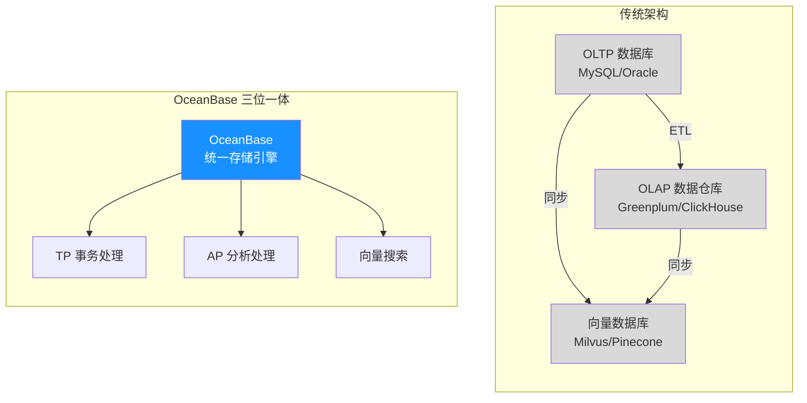

### 6.2 核心融合优势

| 优势           | 描述                      | 业务价值           |
| -------------- | ------------------------- | ------------------ |
| **数据一致性** | 单一数据源，无需 ETL 同步 | 消除数据不一致风险 |
| **实时分析**   | T+0 实时数据分析          | 支持实时决策       |
| **运维简化**   | 一套系统替代多套          | 降低 50%+ 运维成本 |
| **资源共享**   | 弹性资源调度              | 提升资源利用率     |
| **AI 原生**    | 向量与结构化数据融合      | 简化 AI 应用开发   |

### 6.3 典型融合场景

#### 场景 1：智能客服系统

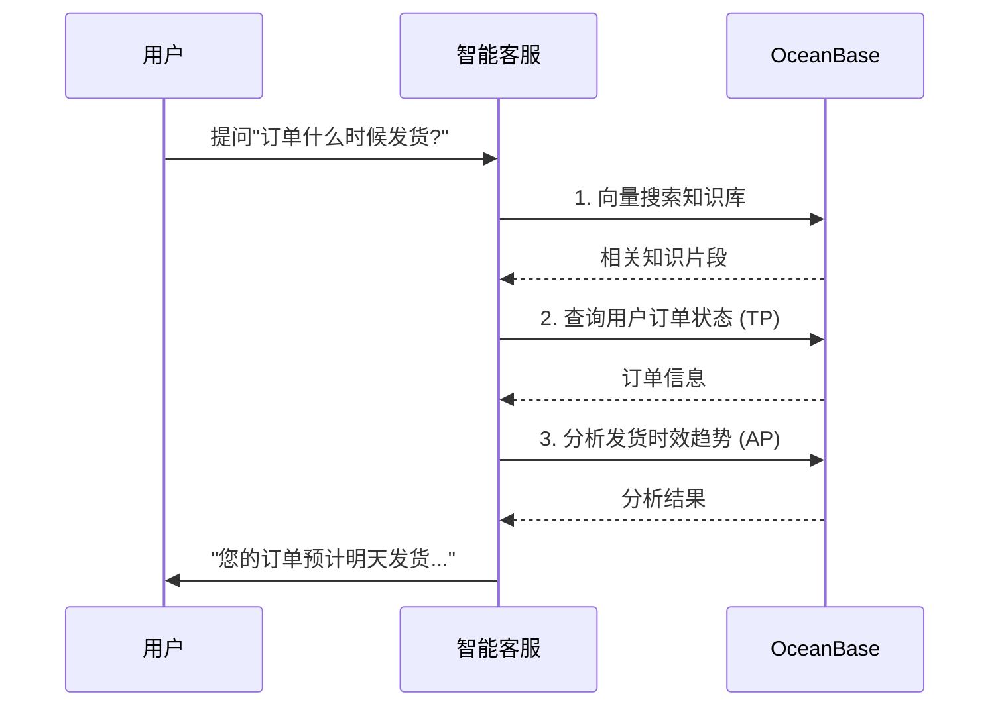

#### 场景 2：实时风控系统

```sql
-- 单一查询融合三种能力
SELECT
    t.order_id,
    t.amount,
    t.user_id,
    -- AP: 聚合分析
    SUM(h.amount) OVER (PARTITION BY t.user_id
                        ORDER BY t.created_at
                        ROWS BETWEEN 7 PRECEDING AND CURRENT ROW) as week_total,
    -- Vector: 行为模式匹配
    (t.behavior_vec <-> reference_vec) as anomaly_score
FROM transactions t
JOIN transaction_history h ON t.user_id = h.user_id
WHERE t.created_at > NOW() - INTERVAL '1 hour'
  AND (t.behavior_vec <-> reference_vec) < 0.3  -- 向量相似度过滤
ORDER BY anomaly_score
LIMIT 100;
```

---

## 7. 性能基准与对比分析

### 7.1 TPC-C 性能 (OLTP)

OceanBase 在 TPC-C 基准测试中创造了多项世界纪录<sup>[[15]](#ref15)</sup><sup>[[16]](#ref16)</sup>。

| 测试项         | OceanBase | MySQL 企业版 | 对比倍数 |
| -------------- | --------- | ------------ | -------- |
| **最高 tpmC**  | 7.07 亿   | -            | 世界纪录 |
| **同配置性能** | 基准      | 基准 × 0.53  | **1.9x** |
| **线性扩展**   | ✅        | ❌           | -        |

### 7.2 TPC-H 性能 (OLAP)

| 测试项       | OceanBase V4.0 | Greenplum 6.22.1 | 对比倍数 |
| ------------ | -------------- | ---------------- | -------- |
| **综合性能** | 基准           | 基准 × 0.17      | **5-6x** |
| **最优场景** | 基准           | 基准 × 0.11      | **9x**   |

### 7.3 向量搜索性能

基于 VectorDBBench 基准测试数据<sup>[[17]](#ref17)</sup>：

| 指标          | OceanBase | pgvector | 说明           |
| ------------- | --------- | -------- | -------------- |
| **QPS**       | ★★★★☆     | ★★★☆☆    | 高并发场景优势 |
| **Recall@10** | ★★★★★     | ★★★★★    | 相当           |
| **构建时间**  | ★★★★☆     | ★★★☆☆    | 分布式并行优势 |

---

## 8. 生态集成与工具链

### 8.1 AI 框架集成

#### LlamaIndex 集成

OceanBase 提供官方 LlamaIndex 集成包 `llama-index-vector-stores-oceanbase`<sup>[[18]](#ref18)</sup>。

```python
# 安装
pip install llama-index-vector-stores-oceanbase

# 使用示例
from llama_index.vector_stores.oceanbase import OceanBaseVectorStore
from llama_index import VectorStoreIndex

# 配置 OceanBase 连接
vector_store = OceanBaseVectorStore(
    host="127.0.0.1",
    port=2881,
    user="root@test",
    password="",
    database="test_db",
    table_name="documents",
    embedding_dimension=1536
)

# 创建索引
index = VectorStoreIndex.from_vector_store(vector_store)

# RAG 查询
query_engine = index.as_query_engine()
response = query_engine.query("什么是 OceanBase?")
```

#### LangChain 集成

OceanBase 提供官方 LangChain 集成包 `langchain-oceanbase`<sup>[[19]](#ref19)</sup>。

```python
# 安装
pip install langchain-oceanbase

# 使用示例
from langchain_oceanbase.vectorstores import OceanBaseVectorStore
from langchain_openai import OpenAIEmbeddings

# 配置
embeddings = OpenAIEmbeddings()
vector_store = OceanBaseVectorStore(
    connection_string="mysql+pymysql://root@test:@127.0.0.1:2881/test_db",
    embedding_function=embeddings,
    table_name="langchain_docs"
)

# 添加文档
vector_store.add_documents(documents)

# 相似性搜索
results = vector_store.similarity_search("查询内容", k=5)
```

### 8.2 开发语言支持

| 语言        | 驱动/SDK                        | 说明       |
| ----------- | ------------------------------- | ---------- |
| **Python**  | pymysql, mysql-connector-python | MySQL 兼容 |
| **Java**    | JDBC, OceanBase Client          | 官方驱动   |
| **Go**      | go-sql-driver/mysql             | MySQL 兼容 |
| **Node.js** | mysql2, sequelize               | MySQL 兼容 |
| **Rust**    | sqlx                            | MySQL 兼容 |

### 8.3 生态工具

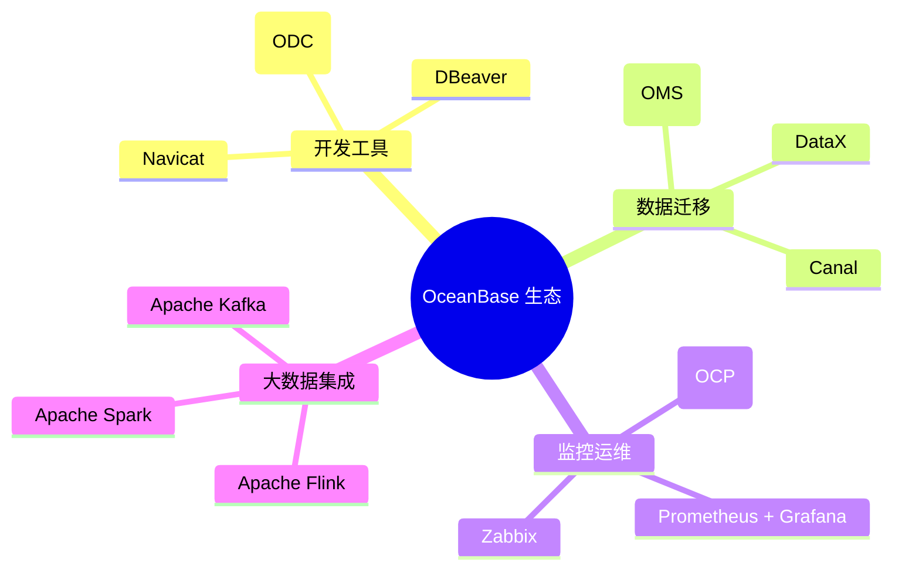

---

## 9. 可行性分析与评估

### 9.1 技术可行性

| 评估维度       | 评分  | 说明                               |
| -------------- | ----- | ---------------------------------- |
| **功能完备性** | ★★★★★ | TP/AP/Vector 三位一体，功能全面    |
| **性能表现**   | ★★★★★ | TPC-C/TPC-H 世界纪录，向量搜索优秀 |
| **生态成熟度** | ★★★★☆ | AI 框架集成完善，社区活跃          |
| **运维复杂度** | ★★★☆☆ | 分布式架构需要专业运维             |
| **学习曲线**   | ★★★★☆ | MySQL 兼容，易于上手               |

### 9.2 成本分析

| 部署模式                     | 成本预估 | 适用场景       |
| ---------------------------- | -------- | -------------- |
| **Docker 单节点**            | 免费     | 开发测试       |
| **OCP 社区版**               | 免费     | 小规模生产     |
| **云服务 (OceanBase Cloud)** | 按量付费 | 弹性业务       |
| **企业版**                   | 商业授权 | 大规模核心业务 |

### 9.3 风险评估

| 风险           | 等级 | 缓解措施                            |
| -------------- | ---- | ----------------------------------- |
| 运维复杂度高   | 中   | 使用 OCP 管理平台，参考官方最佳实践 |
| 向量功能相对新 | 低   | V4.5 已稳定，持续关注版本更新       |
| 社区资源相对少 | 低   | 官方文档完善，技术支持响应快        |

---

## 10. 本项目集成方案

### 10.1 应用场景分析

本项目（Agentic AI Papers 研究项目）可以利用 OceanBase 的三位一体能力实现：

| 场景             | 使用能力  | 具体应用                            |
| ---------------- | --------- | ----------------------------------- |
| **论文知识库**   | Vector DB | 论文摘要/内容的向量化存储与语义搜索 |
| **研究数据管理** | TP        | 论文元数据、引用关系的事务性管理    |
| **研究分析**     | AP        | 论文趋势分析、引用网络分析          |
| **RAG 问答系统** | 三位一体  | 基于论文知识库的智能问答            |

### 10.2 架构设计

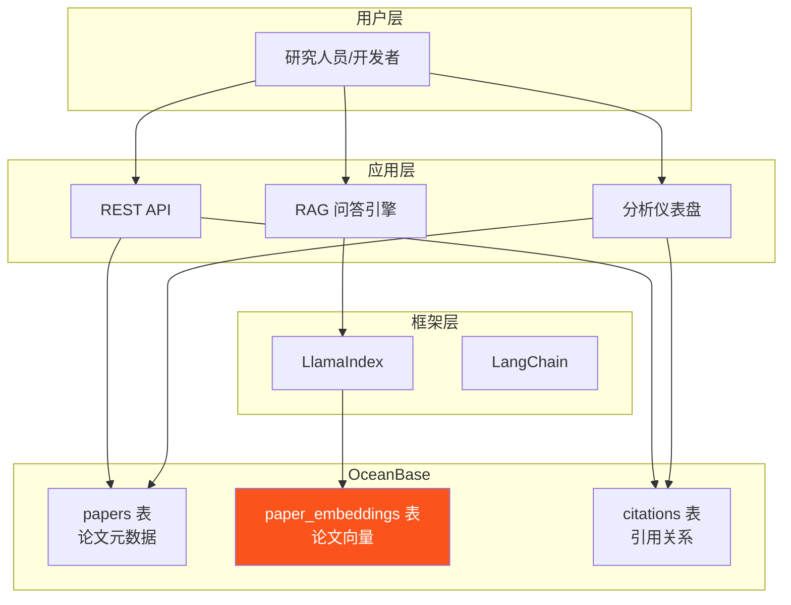

### 10.3 数据模型设计

```sql
-- 论文元数据表 (TP 场景)
CREATE TABLE papers (
    id BIGINT PRIMARY KEY AUTO_INCREMENT,
    title VARCHAR(500) NOT NULL,
    abstract TEXT,
    authors JSON,
    publication_date DATE,
    venue VARCHAR(200),
    arxiv_id VARCHAR(50) UNIQUE,
    pdf_url VARCHAR(500),
    category VARCHAR(100),
    created_at TIMESTAMP DEFAULT CURRENT_TIMESTAMP,
    updated_at TIMESTAMP DEFAULT CURRENT_TIMESTAMP ON UPDATE CURRENT_TIMESTAMP,
    INDEX idx_category (category),
    INDEX idx_date (publication_date)
);

-- 论文向量表 (Vector DB 场景)
CREATE TABLE paper_embeddings (
    id BIGINT PRIMARY KEY AUTO_INCREMENT,
    paper_id BIGINT NOT NULL,
    chunk_index INT DEFAULT 0,
    chunk_text TEXT,
    embedding VECTOR(1536),  -- OpenAI text-embedding-3-small
    FOREIGN KEY (paper_id) REFERENCES papers(id)
);

-- 创建 HNSW 向量索引
CREATE INDEX idx_paper_embedding_hnsw
ON paper_embeddings USING HNSW (embedding vector_cosine_ops)
WITH (m = 16, ef_construction = 128);

-- 引用关系表 (分析场景)
CREATE TABLE citations (
    id BIGINT PRIMARY KEY AUTO_INCREMENT,
    citing_paper_id BIGINT NOT NULL,
    cited_paper_id BIGINT NOT NULL,
    citation_context TEXT,
    FOREIGN KEY (citing_paper_id) REFERENCES papers(id),
    FOREIGN KEY (cited_paper_id) REFERENCES papers(id),
    INDEX idx_citing (citing_paper_id),
    INDEX idx_cited (cited_paper_id)
);
```

---

## 11. Demo 实施指引

### 11.1 环境准备

#### 方式一：Docker 快速部署（推荐开发测试）

```bash
# 拉取 OceanBase 镜像
docker pull oceanbase/oceanbase-ce:4.5.0

# 启动容器（最小配置）
docker run -d \
  --name oceanbase \
  -p 2881:2881 \
  -e MODE=mini \
  -e OB_TENANT_PASSWORD=your_password \
  oceanbase/oceanbase-ce:4.5.0

# 等待启动完成（约 2-5 分钟）
docker logs -f oceanbase

# 当看到 "boot success!" 表示启动成功
```

#### 方式二：使用 OBD 部署

```bash
# 安装 OBD (OceanBase Deployer)
curl -o /tmp/oceanbase-all-in-one.sh \
  https://obbusiness-private.oss-cn-shanghai.aliyuncs.com/download-center/opensource/oceanbase-all-in-one/7.1.1/oceanbase-all-in-one.sh

bash /tmp/oceanbase-all-in-one.sh

# 部署单节点集群
obd cluster deploy demo -c mini.yaml
obd cluster start demo
```

### 11.2 连接数据库

```bash
# 使用 MySQL 客户端连接
mysql -h127.0.0.1 -P2881 -uroot@test -p your_password

# 或使用 obclient
obclient -h127.0.0.1 -P2881 -uroot@test -p your_password
```

### 11.3 完整 Demo 代码

#### Step 1: 安装依赖

```bash
pip install llama-index-vector-stores-oceanbase
pip install llama-index
pip install openai
pip install pymysql
```

#### Step 2: 创建数据表

```python
import pymysql

# 连接 OceanBase
conn = pymysql.connect(
    host='127.0.0.1',
    port=2881,
    user='root@test',
    password='your_password',
    database='test_db'
)

cursor = conn.cursor()

# 创建论文表
cursor.execute('''
CREATE TABLE IF NOT EXISTS papers (
    id BIGINT PRIMARY KEY AUTO_INCREMENT,
    title VARCHAR(500) NOT NULL,
    abstract TEXT,
    authors JSON,
    publication_date DATE,
    category VARCHAR(100),
    created_at TIMESTAMP DEFAULT CURRENT_TIMESTAMP
)
''')

# 创建向量表
cursor.execute('''
CREATE TABLE IF NOT EXISTS paper_embeddings (
    id BIGINT PRIMARY KEY AUTO_INCREMENT,
    paper_id BIGINT NOT NULL,
    chunk_index INT DEFAULT 0,
    chunk_text TEXT,
    embedding VECTOR(1536)
)
''')

# 创建 HNSW 索引
cursor.execute('''
CREATE INDEX IF NOT EXISTS idx_embedding_hnsw
ON paper_embeddings USING HNSW (embedding vector_cosine_ops)
WITH (m = 16, ef_construction = 128)
''')

conn.commit()
print("Tables created successfully!")
```

#### Step 3: 实现 RAG 问答系统

```python
from llama_index.vector_stores.oceanbase import OceanBaseVectorStore
from llama_index.core import VectorStoreIndex, Document, Settings
from llama_index.embeddings.openai import OpenAIEmbedding
from llama_index.llms.openai import OpenAI
import os

# 配置 OpenAI
os.environ["OPENAI_API_KEY"] = "your-api-key"

# 配置 LlamaIndex
Settings.embed_model = OpenAIEmbedding(model="text-embedding-3-small")
Settings.llm = OpenAI(model="gpt-4o-mini")

# 创建 OceanBase 向量存储
vector_store = OceanBaseVectorStore(
    host="127.0.0.1",
    port=2881,
    user="root@test",
    password="your_password",
    database="test_db",
    table_name="paper_embeddings",
    embedding_dimension=1536
)

# 准备示例文档
documents = [
    Document(
        text="OceanBase 是蚂蚁集团自主研发的企业级分布式关系数据库，具备 HTAP 能力。",
        metadata={"source": "oceanbase_intro", "category": "database"}
    ),
    Document(
        text="LlamaIndex 是一个用于构建 RAG 应用的框架，支持多种向量数据库集成。",
        metadata={"source": "llamaindex_intro", "category": "ai_framework"}
    ),
    Document(
        text="向量搜索通过计算向量之间的相似度来找到语义相关的内容。",
        metadata={"source": "vector_search_intro", "category": "technology"}
    )
]

# 创建索引并添加文档
index = VectorStoreIndex.from_documents(
    documents,
    vector_store=vector_store
)

# 创建查询引擎
query_engine = index.as_query_engine(similarity_top_k=3)

# 执行 RAG 查询
response = query_engine.query("什么是 OceanBase? 它有什么特点?")
print(f"回答: {response}")

# 混合查询示例：结合向量搜索与 SQL 过滤
from llama_index.core.vector_stores import MetadataFilters, ExactMatchFilter

filters = MetadataFilters(
    filters=[ExactMatchFilter(key="category", value="database")]
)

filtered_response = query_engine.query(
    "介绍一下数据库相关技术",
    filters=filters
)
print(f"过滤后回答: {filtered_response}")
```

#### Step 4: 分析查询示例

```python
import pymysql

conn = pymysql.connect(
    host='127.0.0.1',
    port=2881,
    user='root@test',
    password='your_password',
    database='test_db'
)

cursor = conn.cursor()

# 论文分类统计 (AP 场景)
cursor.execute('''
SELECT
    category,
    COUNT(*) as paper_count,
    AVG(LENGTH(abstract)) as avg_abstract_length
FROM papers
GROUP BY category
ORDER BY paper_count DESC
''')

for row in cursor.fetchall():
    print(f"分类: {row[0]}, 论文数: {row[1]}, 平均摘要长度: {row[2]:.0f}")

# 向量相似度搜索 + 分析 (三位一体)
cursor.execute('''
SELECT
    p.title,
    p.category,
    pe.embedding <-> %s AS distance
FROM papers p
JOIN paper_embeddings pe ON p.id = pe.paper_id
WHERE p.publication_date > '2024-01-01'
ORDER BY distance
LIMIT 10
''', (query_vector,))

print("\n最相关的论文:")
for row in cursor.fetchall():
    print(f"  - {row[0]} (分类: {row[1]}, 相似度距离: {row[2]:.4f})")
```

### 11.4 性能优化建议

| 优化项        | 建议配置                 | 说明             |
| ------------- | ------------------------ | ---------------- |
| **连接池**    | 最小 10，最大 100        | 避免频繁建连     |
| **向量维度**  | 根据模型选择 (1536/3072) | 平衡精度与性能   |
| **HNSW 参数** | m=16, ef=128             | 根据数据规模调整 |
| **批量插入**  | 每批 100-1000 条         | 减少事务开销     |
| **索引预热**  | 启动时加载常用索引       | 减少冷启动延迟   |

### 11.5 监控与运维

```sql
-- 查看向量索引状态
SELECT * FROM information_schema.INNODB_VECTOR_INDEXES;

-- 查看查询性能
SELECT
    query_sql,
    elapsed_time,
    queue_time,
    execute_time
FROM oceanbase.GV$OB_SQL_AUDIT
WHERE query_sql LIKE '%embedding%'
ORDER BY elapsed_time DESC
LIMIT 10;

-- 查看资源使用
SELECT
    svr_ip,
    cpu_capacity,
    mem_capacity,
    disk_capacity
FROM oceanbase.GV$OB_SERVERS;
```

---

## References

<a id="ref1"></a>**[1]** OceanBase. _OceanBase 简介_. [https://www.oceanbase.com/docs/common-oceanbase-database-cn-1000000004475486](https://www.oceanbase.com/docs/common-oceanbase-database-cn-1000000004475486)

<a id="ref2"></a>**[2]** OceanBase 数据库 V4.5.0. _OceanBase 简介_. PDF 文档.

<a id="ref3"></a>**[3]** OceanBase. _分布式架构_. [https://www.oceanbase.com/docs/common-oceanbase-database-cn-1000000004475689](https://www.oceanbase.com/docs/common-oceanbase-database-cn-1000000004475689)

<a id="ref4"></a>**[4]** OceanBase 技术博客. _LSM-Tree 存储引擎原理_. [https://open.oceanbase.com/blog/200126](https://open.oceanbase.com/blog/200126)

<a id="ref5"></a>**[5]** 墨天轮. _OceanBase 存储引擎深度解析_. [https://www.modb.pro/db/oceanbase](https://www.modb.pro/db/oceanbase)

<a id="ref6"></a>**[6]** OceanBase. _Paxos 一致性协议_. [https://www.oceanbase.com/docs](https://www.oceanbase.com/docs)

<a id="ref7"></a>**[7]** OceanBase 数据库 V4.5.0. _实践教程_. PDF 文档.

<a id="ref8"></a>**[8]** OceanBase. _HTAP 架构_. [https://www.oceanbase.com/docs/common-oceanbase-database-cn-1000000004475691](https://www.oceanbase.com/docs/common-oceanbase-database-cn-1000000004475691)

<a id="ref9"></a>**[9]** OceanBase 数据库 V4.5.0. _OceanBase AP_. PDF 文档.

<a id="ref10"></a>**[10]** OceanBase. _向量搜索概述_. [https://www.oceanbase.com/docs/common-oceanbase-database-cn-1000000004475693](https://www.oceanbase.com/docs/common-oceanbase-database-cn-1000000004475693)

<a id="ref11"></a>**[11]** OceanBase 数据库 V4.5.0. _向量搜索_. PDF 文档.

<a id="ref12"></a>**[12]** Wikipedia. _Hierarchical Navigable Small World graphs_. [https://en.wikipedia.org/wiki/HNSW](https://en.wikipedia.org/wiki/HNSW)

<a id="ref13"></a>**[13]** Milvus. _IVF 索引原理_. [https://milvus.io/docs/index.md](https://milvus.io/docs/index.md)

<a id="ref14"></a>**[14]** OceanBase. _三位一体架构_. [https://www.oceanbase.com/docs](https://www.oceanbase.com/docs)

<a id="ref15"></a>**[15]** TPC. _TPC-C 官方记录 - OceanBase 性能_. [https://www.tpc.org/tpcc/results/tpcc_results5.asp](https://www.tpc.org/tpcc/results/tpcc_results5.asp)

<a id="ref16"></a>**[16]** Medium. _OceanBase 性能对比分析_. [https://medium.com/@oceanbase](https://medium.com/@oceanbase)

<a id="ref17"></a>**[17]** Zilliz. _VectorDBBench - 向量数据库基准测试_. GitHub. [https://github.com/zilliztech/VectorDBBench](https://github.com/zilliztech/VectorDBBench)

<a id="ref18"></a>**[18]** LlamaHub. _OceanBase Vector Store_. [https://llamahub.ai/l/vector_stores/llama-index-vector-stores-oceanbase](https://llamahub.ai/l/vector_stores/llama-index-vector-stores-oceanbase)

<a id="ref19"></a>**[19]** LangChain. _OceanBase 集成_. [https://python.langchain.com/docs/integrations/vectorstores/oceanbase](https://python.langchain.com/docs/integrations/vectorstores/oceanbase)

<a id="ref20"></a>**[20]** OceanBase 数据库 V4.5.0. _部署数据库_. PDF 文档.

<a id="ref21"></a>**[21]** OceanBase. _GitHub 仓库_. [https://github.com/oceanbase/oceanbase](https://github.com/oceanbase/oceanbase)

---

> **调研结论**：OceanBase V4.5.0 的三位一体能力（TP/AP/Vector DB）已经成熟，能够有效支持本项目的论文知识库、RAG 问答系统和研究分析等场景。建议采用 Docker 部署方式进行原型验证，成功后可过渡到 OCP 管理的生产环境。
