# 向量数据库深度调研报告

> **报告版本**：v1.0  
> **调研日期**：2025-12  
> **调研对象**：PGVector、Vector Chord、Milvus、Weaviate、Pinecone  
> **调研范围**：产品设计、架构实现、索引算法、性能指标、集成方式、场景推荐

---

## 📋 目录

1. [调研概述](#1-调研概述)
2. [PostgreSQL + PGVector](#2-postgresql--pgvector)
3. [Vector Chord (VectorChord/pgvecto.rs)](#3-vector-chord)
4. [Milvus](#4-milvus)
5. [Weaviate](#5-weaviate)
6. [Pinecone](#6-pinecone)
7. [系统性对比分析](#7-系统性对比分析)
8. [场景推荐与选型指南](#8-场景推荐与选型指南)
9. [本项目集成方案 Demo](#9-本项目集成方案-demo)
10. [References](#references)

---

## 1. 调研概述

### 1.1 调研背景

随着大语言模型（LLM）和 RAG（Retrieval-Augmented Generation）技术的快速发展，向量数据库已成为 AI 应用的核心基础设施 [1]。本调研旨在深入分析当前主流向量数据库解决方案，为本项目的技术选型提供决策依据。

### 1.2 调研对象分类

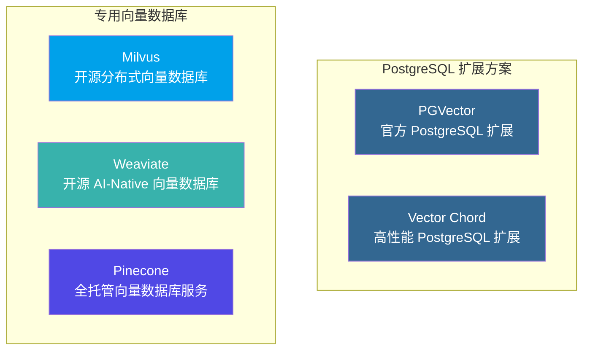

| 类型                | 产品         | 核心特点                             |
| ------------------- | ------------ | ------------------------------------ |
| **PostgreSQL 扩展** | PGVector     | 官方扩展，与现有 PostgreSQL 完美集成 |
| **PostgreSQL 扩展** | Vector Chord | 高性能扩展，突破 PGVector 性能瓶颈   |
| **专用向量数据库**  | Milvus       | 开源分布式，支持百亿级向量           |
| **专用向量数据库**  | Weaviate     | AI-Native，内置向量化模块            |
| **专用向量数据库**  | Pinecone     | 全托管 SaaS，零运维                  |

---

## 2. PostgreSQL + PGVector

### 2.1 产品概述

PGVector 是 PostgreSQL 的开源向量相似性搜索扩展，由社区开发维护 [2]。它允许用户在 PostgreSQL 中存储向量数据并执行相似性搜索，同时享受 PostgreSQL 的所有企业级特性。

**核心定位**：为已使用 PostgreSQL 的用户提供零迁移成本的向量搜索能力。

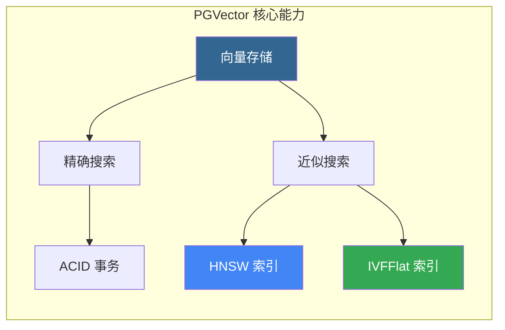

### 2.2 核心特性

| 特性          | 描述             | 技术规格                                      |
| ------------- | ---------------- | --------------------------------------------- |
| **向量类型**  | 支持多种向量格式 | vector (FP32)、halfvec (FP16)、bit、sparsevec |
| **最大维度**  | 单精度向量       | 2,000 维（HNSW）/ 16,000 维（存储）           |
| **距离函数**  | 6 种度量方式     | L2、内积、余弦、L1、汉明、Jaccard             |
| **索引类型**  | 近似最近邻       | HNSW、IVFFlat                                 |
| **ACID 支持** | 完整事务保证     | ✅ 支持                                       |

### 2.3 向量数据类型

```sql
-- 创建向量列表
CREATE TABLE items (
    id bigserial PRIMARY KEY,
    embedding vector(1536)  -- 1536 维向量（OpenAI Ada）
);

-- 插入向量数据
INSERT INTO items (embedding) VALUES ('[1,2,3,...]');

-- 支持的向量类型
-- vector(n)    - 单精度浮点，最多 2,000 维（HNSW 索引）
-- halfvec(n)   - 半精度浮点，最多 4,000 维（HNSW 索引）
-- bit(n)       - 二进制向量，最多 64,000 维
-- sparsevec(n) - 稀疏向量，最多 1,000 非零元素
```

### 2.4 距离度量操作符

| 操作符 | 距离类型     | 适用场景   | 说明              |
| ------ | ------------ | ---------- | ----------------- |
| `<->`  | L2 距离      | 物理相似度 | 欧氏距离          |
| `<#>`  | 负内积       | 归一化向量 | 返回负值，需乘 -1 |
| `<=>`  | 余弦距离     | 语义相似度 | 推荐用于文本嵌入  |
| `<+>`  | L1 距离      | 曼哈顿距离 | 特定场景          |
| `<~>`  | 汉明距离     | 二进制向量 | bit 类型专用      |
| `<%>`  | Jaccard 距离 | 二进制向量 | bit 类型专用      |

### 2.5 索引算法详解

#### 2.5.1 HNSW 索引

HNSW（Hierarchical Navigable Small World）是一种基于图的近似最近邻算法 [3]：

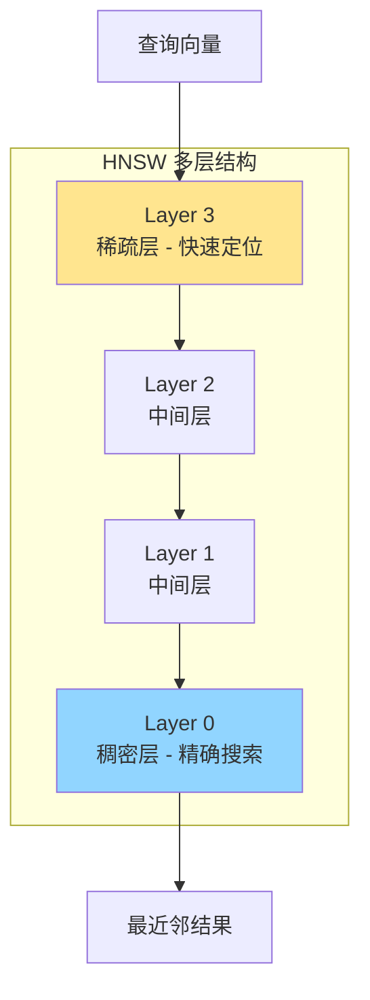

```sql
-- 创建 HNSW 索引
CREATE INDEX ON items USING hnsw (embedding vector_cosine_ops)
WITH (m = 16, ef_construction = 64);

-- 参数说明
-- m: 每层最大连接数（默认 16，建议 16-64）
-- ef_construction: 构建时搜索宽度（默认 64，建议 100-200）

-- 查询时调整搜索精度
SET hnsw.ef_search = 100;  -- 默认 40
```

**HNSW 特点**：

- ✅ 查询性能优于 IVFFlat（速度-召回权衡更优）
- ✅ 无需训练数据即可创建索引
- ❌ 构建时间较长，内存占用较高

#### 2.5.2 IVFFlat 索引

IVFFlat（Inverted File Flat）通过聚类划分向量空间 [4]：

```sql
-- 创建 IVFFlat 索引（需要先有数据）
CREATE INDEX ON items USING ivfflat (embedding vector_l2_ops)
WITH (lists = 100);

-- lists 参数建议
-- rows < 1M: lists = rows / 1000
-- rows >= 1M: lists = sqrt(rows)

-- 查询时调整探针数
SET ivfflat.probes = 10;  -- 建议 sqrt(lists)
```

**IVFFlat 特点**：

- ✅ 构建速度快，内存占用低
- ❌ 需要表中已有数据才能创建
- ❌ 查询性能稍逊于 HNSW

### 2.6 混合搜索与过滤

```sql
-- 带过滤条件的向量搜索
SELECT * FROM items
WHERE category_id = 123
ORDER BY embedding <-> '[3,1,2]'
LIMIT 5;

-- 混合搜索（向量 + 全文检索）
SELECT id, content
FROM items, plainto_tsquery('hello search') query
WHERE textsearch @@ query
ORDER BY ts_rank_cd(textsearch, query) DESC
LIMIT 5;

-- 迭代索引扫描（v0.8.0+）
SET hnsw.iterative_scan = strict_order;
```

### 2.7 性能调优指南

| 场景         | 优化策略              | 配置建议                                     |
| ------------ | --------------------- | -------------------------------------------- |
| **批量导入** | 使用 COPY，索引后创建 | `COPY items FROM STDIN WITH (FORMAT BINARY)` |
| **索引构建** | 增大维护内存          | `SET maintenance_work_mem = '8GB'`           |
| **并行构建** | 增加并行工作进程      | `SET max_parallel_maintenance_workers = 7`   |
| **查询优化** | 调整搜索宽度          | `SET hnsw.ef_search = 100`                   |
| **精确搜索** | 向量归一化 + 内积     | 使用 `<#>` 操作符                            |

---

## 3. Vector Chord

### 3.1 产品概述

Vector Chord（原 pgvecto.rs）是由 TensorChord 开发的高性能 PostgreSQL 向量搜索扩展 [5]。它采用 Rust 语言编写，提供比 PGVector 更优的性能表现。

> ⚠️ **注意**：TensorChord 推荐新用户使用 VectorChord（新一代实现），而非旧版 pgvecto.rs [6]。

**核心定位**：为 PostgreSQL 用户提供企业级高性能向量搜索能力。

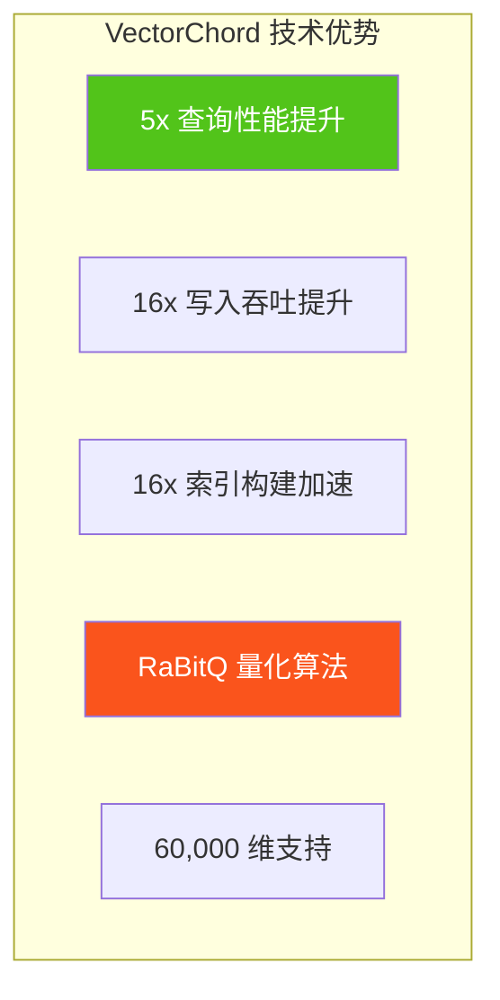

### 3.2 核心特性对比 PGVector

| 特性             | PGVector     | VectorChord | 提升倍数 |
| ---------------- | ------------ | ----------- | -------- |
| **查询性能**     | 基准         | 5x 更快     | 5x       |
| **写入吞吐**     | 基准         | 16x 更高    | 16x      |
| **索引构建**     | 基准         | 16x 更快    | 16x      |
| **最大维度**     | 2,000 (HNSW) | 60,000      | 30x      |
| **向量存储成本** | $6/400K      | $1/400K     | 6x       |

### 3.3 RaBitQ 量化算法

VectorChord 采用 RaBitQ（Randomized Bit Quantization）算法实现高效向量压缩 [7]：

```sql
-- 创建 VectorChord 索引（vchordrq）
CREATE INDEX ON items USING vchordrq (embedding vector_l2_ops);

-- 带量化选项
CREATE INDEX ON items USING vchordrq (embedding vector_cosine_ops)
WITH (options = $$
    residual_quantization = true
    [build.internal]
    lists = [1000]
    spherical_centroids = true
    build_threads = 8
$$);
```

### 3.4 索引调优指南

| 数据规模   | lists 配置   | probes 建议 |
| ---------- | ------------ | ----------- |
| < 1M       | `[]`（自动） | 默认        |
| 1M - 10M   | `[2000]`     | 10          |
| 10M - 100M | `[10000]`    | 30          |
| > 100M     | `[80000]`    | 100         |

```sql
-- 查询参数设置
SET vchordrq.probes TO '10';
SELECT * FROM items ORDER BY embedding <-> '[3,1,2]' LIMIT 10;
```

### 3.5 与 PGVector 兼容性

VectorChord 完全兼容 pgvector 的数据类型和语法 [8]：

```sql
-- 依赖 pgvector
CREATE EXTENSION IF NOT EXISTS vchord CASCADE;

-- 使用 pgvector 的 vector 类型
CREATE TABLE items (
    id bigserial PRIMARY KEY,
    embedding vector(3)
);

-- 无缝迁移
-- 只需将索引类型从 hnsw 改为 vchordrq
```

---

## 4. Milvus

### 4.1 产品概述

Milvus 是由 Zilliz 开发的开源、云原生分布式向量数据库 [9]。它是 LF AI & Data Foundation 的毕业项目，专为大规模向量相似性搜索设计，支持百亿级向量的高性能检索。

**核心定位**：企业级分布式向量数据库，为 AI 应用提供可扩展的向量检索基础设施。

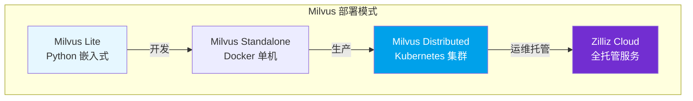

### 4.2 核心架构

Milvus 采用存储计算分离的云原生分布式架构 [10]：

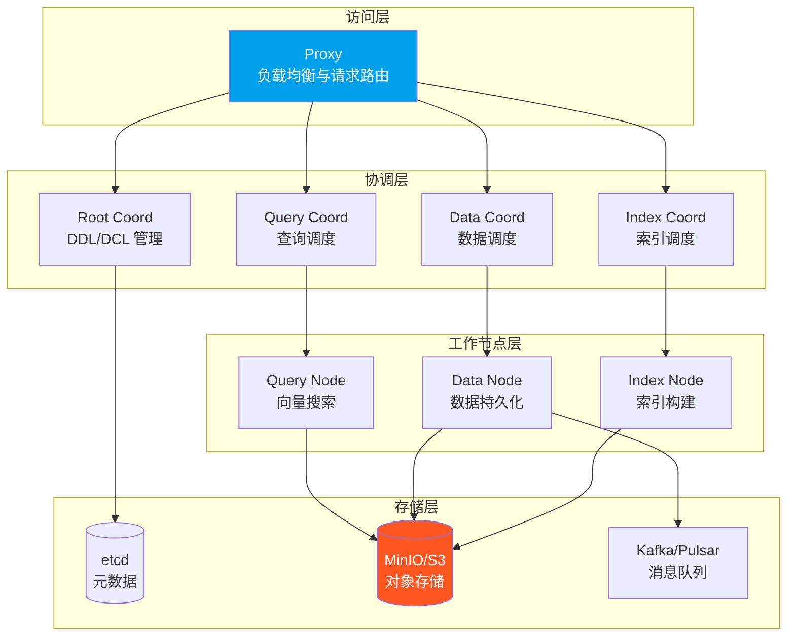

**四层架构说明**：

| 层级           | 组件              | 职责                                 |
| -------------- | ----------------- | ------------------------------------ |
| **访问层**     | Proxy             | 无状态代理，处理客户端请求与结果聚合 |
| **协调层**     | Coordinators      | 集群拓扑管理、任务调度、一致性控制   |
| **工作节点层** | Worker Nodes      | 向量搜索、数据持久化、索引构建       |
| **存储层**     | etcd + MinIO + MQ | 元数据、向量/索引存储、WAL 日志      |

### 4.3 索引算法体系

Milvus 支持丰富的向量索引类型 [11]：

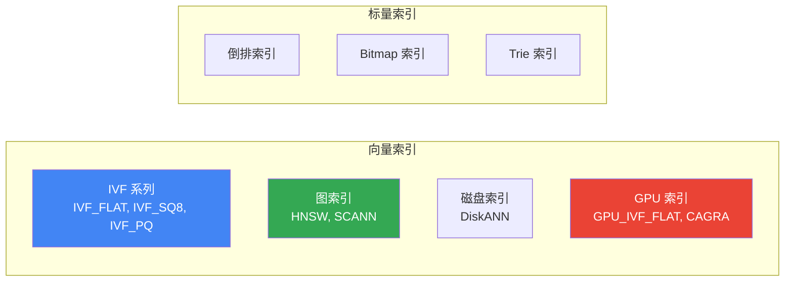

| 索引类型      | 算法            | 适用场景       | 内存要求 |
| ------------- | --------------- | -------------- | -------- |
| **IVF_FLAT**  | 聚类 + 精确搜索 | 高召回场景     | 中       |
| **IVF_SQ8**   | 聚类 + 标量量化 | 平衡性能与召回 | 低       |
| **IVF_PQ**    | 聚类 + 乘积量化 | 大规模低内存   | 极低     |
| **HNSW**      | 多层图搜索      | 低延迟高召回   | 高       |
| **DiskANN**   | 磁盘图索引      | 超大规模数据   | 极低     |
| **GPU_CAGRA** | GPU 优化图      | GPU 加速场景   | N/A      |

### 4.4 距离度量

| 度量类型     | 标识符    | 适用场景   |
| ------------ | --------- | ---------- |
| 欧氏距离     | `L2`      | 物理相似度 |
| 内积         | `IP`      | 归一化向量 |
| 余弦相似度   | `COSINE`  | 语义相似度 |
| 汉明距离     | `HAMMING` | 二进制向量 |
| Jaccard 距离 | `JACCARD` | 集合相似度 |

### 4.5 搜索能力

```python
from pymilvus import MilvusClient

# 初始化客户端
client = MilvusClient("demo.db")  # Milvus Lite

# 创建 Collection
client.create_collection(
    collection_name="demo_collection",
    dimension=768
)

# 插入数据
client.insert(
    collection_name="demo_collection",
    data=[{"id": 1, "vector": [...], "subject": "history"}]
)

# ANN 搜索
results = client.search(
    collection_name="demo_collection",
    data=[query_vector],
    limit=10,
    output_fields=["subject"]
)

# 带过滤的搜索
results = client.search(
    collection_name="demo_collection",
    data=[query_vector],
    filter='subject == "history"',
    limit=10
)
```

**搜索功能矩阵**：

| 功能           | 描述                | 支持情况 |
| -------------- | ------------------- | -------- |
| **ANN 搜索**   | 近似最近邻          | ✅       |
| **元数据过滤** | 标量条件过滤        | ✅       |
| **范围搜索**   | 指定半径内搜索      | ✅       |
| **混合搜索**   | 多向量字段联合搜索  | ✅       |
| **全文搜索**   | BM25 关键词搜索     | ✅       |
| **重排序**     | BGE/Cohere Reranker | ✅       |

### 4.6 性能基准

基于 Milvus 2.2 官方基准测试 [12]：

| 指标        | 数据规模      | 性能表现      |
| ----------- | ------------- | ------------- |
| **QPS**     | 1M 128D       | 10k - 30k     |
| **延迟**    | 标准集群      | < 10ms (P99)  |
| **扩展性**  | CPU 核数      | 线性扩展      |
| **vs 其他** | VectorDBBench | 2-5x 性能优势 |

### 4.7 部署模式对比

| 模式             | 适用场景          | 数据规模 | 运维复杂度 |
| ---------------- | ----------------- | -------- | ---------- |
| **Milvus Lite**  | 本地开发、Jupyter | < 100K   | ★☆☆☆☆      |
| **Standalone**   | 单机开发测试      | < 10M    | ★★☆☆☆      |
| **Distributed**  | 生产环境          | 百亿级   | ★★★★☆      |
| **Zilliz Cloud** | 全托管生产        | 百亿级   | ★☆☆☆☆      |

---

## 5. Weaviate

### 5.1 产品概述

Weaviate 是一款开源的 AI-Native 向量数据库，专为构建 AI 应用而设计 [13]。它的核心特点是内置向量化模块，可以自动将数据转化为向量嵌入。

**核心定位**：AI-Native 向量数据库，提供开箱即用的语义搜索和 RAG 能力。

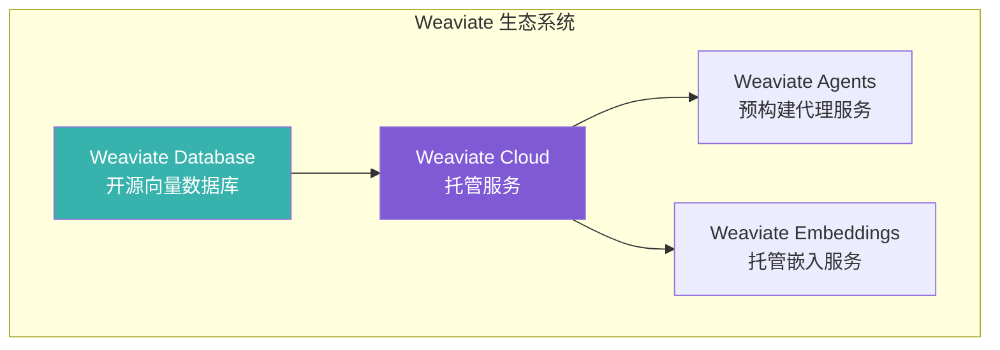

### 5.2 核心特性

| 特性           | 描述                 | 优势                    |
| -------------- | -------------------- | ----------------------- |
| **内置向量化** | 自动生成向量嵌入     | 无需外部 Embedding 服务 |
| **语义搜索**   | 基于含义的相似性搜索 | 超越关键词匹配          |
| **混合搜索**   | 向量 + BM25 结合     | 兼顾语义与关键词        |
| **RAG 支持**   | 内置生成式搜索       | 简化 RAG 流程           |
| **模块化架构** | 可插拔的向量化模块   | 灵活选择模型            |

### 5.3 向量索引类型

Weaviate 支持三种向量索引类型 [14]：

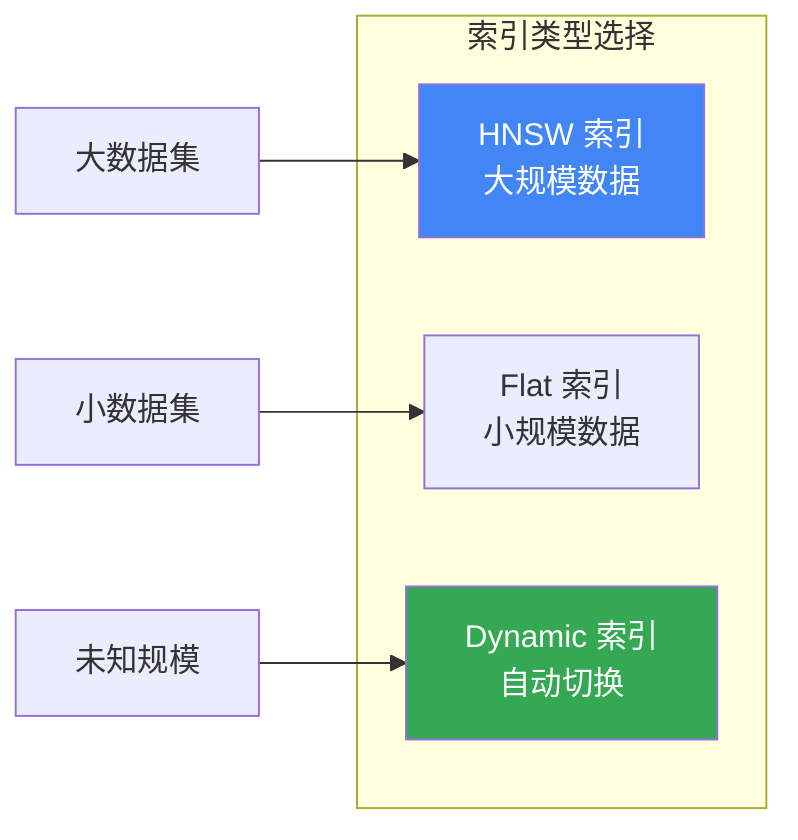

| 索引类型    | 算法     | 适用场景   | 特点                     |
| ----------- | -------- | ---------- | ------------------------ |
| **HNSW**    | 多层图   | 大规模数据 | 对数时间复杂度，高召回   |
| **Flat**    | 暴力搜索 | 小规模数据 | 完美召回，适合多租户     |
| **Dynamic** | 自动切换 | 未知规模   | 小时用 Flat，大时切 HNSW |

### 5.4 向量化模块

Weaviate 支持多种向量化模块 [15]：

| 模块类型                 | 模型提供商  | 支持模态    |
| ------------------------ | ----------- | ----------- |
| **text2vec-openai**      | OpenAI      | 文本        |
| **text2vec-cohere**      | Cohere      | 文本        |
| **text2vec-huggingface** | HuggingFace | 文本        |
| **multi2vec-clip**       | OpenAI CLIP | 图像 + 文本 |
| **multi2vec-bind**       | ImageBind   | 多模态      |

### 5.5 距离度量

| 度量类型   | 标识符       | 适用场景           |
| ---------- | ------------ | ------------------ |
| 余弦相似度 | `cosine`     | 语义相似度（默认） |
| 欧氏距离   | `l2-squared` | 物理相似度         |
| 点积       | `dot`        | 归一化向量         |
| 汉明距离   | `hamming`    | 二进制向量         |

### 5.6 搜索能力

```python
import weaviate

# 连接 Weaviate Cloud
client = weaviate.connect_to_wcs(
    cluster_url="YOUR_WCS_URL",
    auth_credentials=weaviate.auth.AuthApiKey("YOUR_API_KEY")
)

# 创建 Collection（自动向量化）
collection = client.collections.create(
    name="Article",
    vectorizer_config=weaviate.Configure.Vectorizer.text2vec_openai()
)

# 插入数据（自动生成向量）
collection.data.insert({
    "title": "AI 技术发展",
    "content": "人工智能正在改变世界..."
})

# 语义搜索
results = collection.query.near_text(
    query="机器学习的未来",
    limit=5
)

# 混合搜索（向量 + BM25）
results = collection.query.hybrid(
    query="AI applications",
    alpha=0.5,  # 0 = BM25, 1 = 向量
    limit=5
)
```

**搜索功能矩阵**：

| 功能           | 描述                  | 支持情况 |
| -------------- | --------------------- | -------- |
| **向量搜索**   | near_text/near_vector | ✅       |
| **BM25 搜索**  | 关键词搜索            | ✅       |
| **混合搜索**   | 向量 + BM25 融合      | ✅       |
| **生成式搜索** | RAG 内置支持          | ✅       |
| **过滤搜索**   | 属性条件过滤          | ✅       |
| **分组聚合**   | Group by              | ✅       |

### 5.7 部署选项

| 部署方式           | 适用场景   | 特点                   |
| ------------------ | ---------- | ---------------------- |
| **Weaviate Cloud** | 生产环境   | 完全托管，Sandbox 免费 |
| **Docker**         | 本地开发   | 支持本地推理容器       |
| **Kubernetes**     | 自托管生产 | 高可用，零停机更新     |
| **Embedded**       | 快速评估   | Python/JS 直接启动     |

---

## 6. Pinecone

### 6.1 产品概述

Pinecone 是一款全托管的向量数据库服务，专为生产环境中的 AI 应用设计 [16]。它提供 Serverless 架构，用户无需管理基础设施即可使用高性能向量搜索。

**核心定位**：零运维、高性能的全托管向量数据库 SaaS 服务。

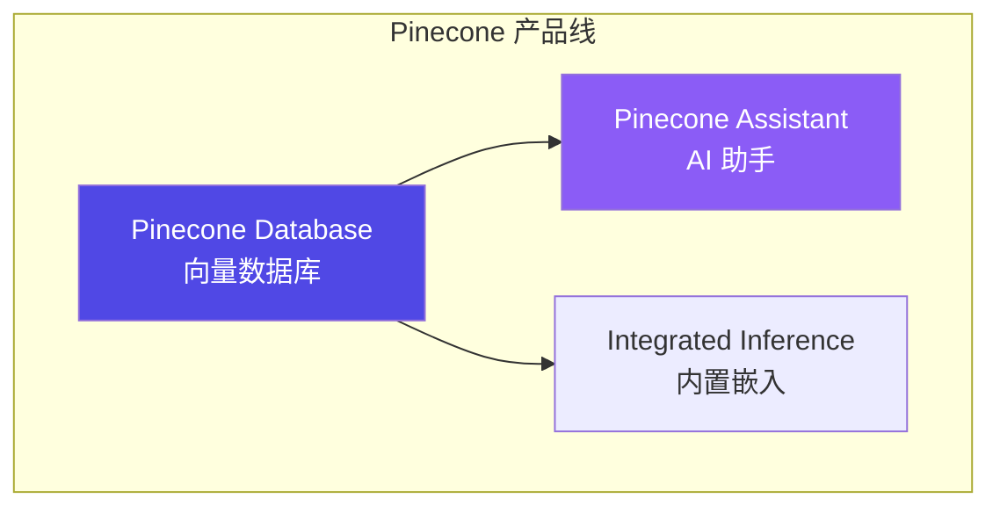

### 6.2 核心特性

| 特性           | 描述                | 优势              |
| -------------- | ------------------- | ----------------- |
| **全托管**     | Serverless 架构     | 零运维，按需扩展  |
| **集成嵌入**   | 内置 Embedding 模型 | 简化开发流程      |
| **命名空间**   | 多租户数据隔离      | 单索引多分区      |
| **元数据过滤** | 标量属性过滤        | 向量 + 结构化查询 |
| **重排序**     | 内置 Reranker       | 提升检索精度      |

### 6.3 索引类型

Pinecone 支持两种索引类型 [17]：

| 索引类型         | 描述         | 适用场景          |
| ---------------- | ------------ | ----------------- |
| **Dense Index**  | 稠密向量索引 | 语义搜索（主流）  |
| **Sparse Index** | 稀疏向量索引 | BM25 类关键词搜索 |

```python
from pinecone import Pinecone

# 初始化客户端
pc = Pinecone(api_key="YOUR_API_KEY")

# 创建 Dense Index（带集成嵌入）
pc.create_index_for_model(
    name="my-index",
    cloud="aws",
    region="us-east-1",
    embed={
        "model": "llama-text-embed-v2",
        "field_map": {"text": "chunk_text"}
    }
)

# 创建 Sparse Index
pc.create_index(
    name="sparse-index",
    dimension=None,  # Sparse 无需指定
    metric="dotproduct",
    spec=ServerlessSpec(cloud="aws", region="us-east-1")
)
```

### 6.4 命名空间与多租户

Pinecone 使用命名空间实现数据隔离 [18]：

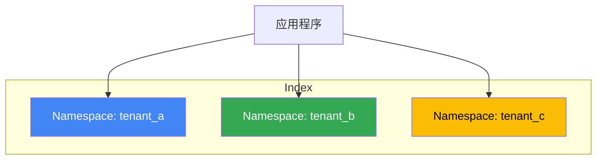

- 每个索引最多 **100,000** 个命名空间
- 查询和写入操作指定命名空间
- 实现多租户数据隔离

### 6.5 搜索与过滤

```python
# 连接索引
index = pc.Index("my-index")

# 文本搜索（集成嵌入）
results = index.query(
    data={"inputs": {"text": "What is machine learning?"}},
    top_k=10,
    include_metadata=True
)

# 带元数据过滤的搜索
results = index.query(
    vector=[0.1, 0.2, ...],
    top_k=10,
    filter={"genre": {"$eq": "technology"}}
)

# 混合搜索（需要同时使用 Dense + Sparse 索引）
```

**过滤操作符**：

| 操作符 | 描述   | 示例                             |
| ------ | ------ | -------------------------------- |
| `$eq`  | 等于   | `{"field": {"$eq": "value"}}`    |
| `$ne`  | 不等于 | `{"field": {"$ne": "value"}}`    |
| `$gt`  | 大于   | `{"field": {"$gt": 10}}`         |
| `$in`  | 包含于 | `{"field": {"$in": ["a", "b"]}}` |
| `$and` | 逻辑与 | `{"$and": [cond1, cond2]}`       |
| `$or`  | 逻辑或 | `{"$or": [cond1, cond2]}`        |

### 6.6 定价模式

| 计划           | 费用   | 特点     | 限制               |
| -------------- | ------ | -------- | ------------------ |
| **Starter**    | 免费   | 入门体验 | 1 个区域，有限额度 |
| **Standard**   | 按用量 | 生产级   | 更高限制           |
| **Enterprise** | 自定义 | 企业级   | 定制化支持         |

### 6.7 优劣势分析

**优势**：

- ✅ 零运维，开箱即用
- ✅ 高可用，自动扩展
- ✅ 集成嵌入和重排序
- ✅ 企业级 SLA 保障

**劣势**：

- ❌ 仅 SaaS，无法私有部署
- ❌ 成本较高（大规模场景）
- ❌ 数据需传输到云端
- ❌ 功能相对简单

---

## 7. 系统性对比分析

### 7.1 核心能力对比矩阵

| 维度          | PGVector     | VectorChord | Milvus           | Weaviate     | Pinecone    |
| ------------- | ------------ | ----------- | ---------------- | ------------ | ----------- |
| **开源协议**  | PostgreSQL   | AGPLv3/ELv2 | Apache 2.0       | BSD-3        | 商业        |
| **部署模式**  | 单机/集群    | 单机/集群   | 分布式/托管      | 分布式/托管  | 仅托管      |
| **最大维度**  | 2,000 (HNSW) | 60,000      | 32,768           | 无限制       | 20,000      |
| **向量索引**  | HNSW/IVF     | RaBitQ/HNSW | IVF/HNSW/DiskANN | HNSW/Flat    | 专有算法    |
| **ACID 事务** | ✅ 完整      | ✅ 完整     | ❌ 不支持        | ❌ 不支持    | ❌ 不支持   |
| **混合搜索**  | ✅ 全文检索  | ✅ 全文检索 | ✅ BM25          | ✅ BM25+向量 | ⚠️ 需双索引 |
| **内置嵌入**  | ❌           | ❌          | ⚠️ pymilvus      | ✅ 多模块    | ✅ 集成     |
| **GPU 加速**  | ❌           | ❌          | ✅ CAGRA         | ❌           | ❌          |

### 7.2 性能对比

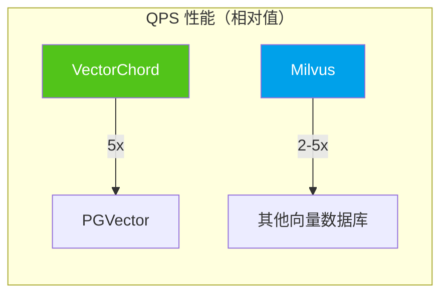

| 产品            | 1M 768D QPS | 召回率@95% | 索引构建 | 内存效率 |
| --------------- | ----------- | ---------- | -------- | -------- |
| **PGVector**    | ~1,000      | ★★★★☆      | ★★★☆☆    | ★★★☆☆    |
| **VectorChord** | ~5,000      | ★★★★☆      | ★★★★★    | ★★★★★    |
| **Milvus**      | ~10,000+    | ★★★★★      | ★★★★☆    | ★★★★☆    |
| **Weaviate**    | ~5,000      | ★★★★☆      | ★★★★☆    | ★★★★☆    |
| **Pinecone**    | ~5,000      | ★★★★☆      | N/A      | N/A      |

### 7.3 成本对比

| 产品            | 100K 向量    | 1M 向量      | 10M 向量        | 100M 向量        |
| --------------- | ------------ | ------------ | --------------- | ---------------- |
| **PGVector**    | $0（自托管） | $0（自托管） | $0（自托管）    | $0（自托管）     |
| **VectorChord** | $0.25        | $2.5         | $25             | $250             |
| **Milvus**      | $0（自托管） | $0（自托管） | Zilliz: ~$50/月 | Zilliz: ~$500/月 |
| **Weaviate**    | 免费 Sandbox | WCS: ~$25/月 | WCS: ~$100/月   | 自定义           |
| **Pinecone**    | 免费 Starter | ~$70/月      | ~$300/月        | 企业定价         |

> ⚠️ 以上价格为估算参考，实际价格请以官方定价为准。

### 7.4 运维复杂度对比

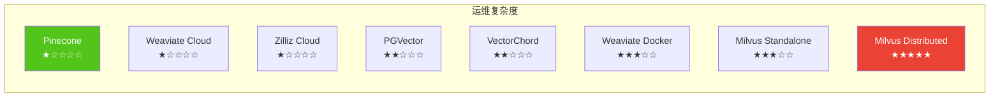

### 7.5 生态集成对比

| 框架/工具      | PGVector | VectorChord | Milvus   | Weaviate        | Pinecone |
| -------------- | -------- | ----------- | -------- | --------------- | -------- |
| **LangChain**  | ✅       | ✅          | ✅       | ✅              | ✅       |
| **LlamaIndex** | ✅       | ✅          | ✅       | ✅              | ✅       |
| **Haystack**   | ✅       | ⚠️          | ✅       | ✅              | ✅       |
| **AutoGPT**    | ⚠️       | ⚠️          | ✅       | ✅              | ✅       |
| **Cognee**     | ✅       | ⚠️          | ✅       | ✅              | ✅       |
| **Python SDK** | psycopg2 | psycopg2    | pymilvus | weaviate-client | pinecone |

---

## 8. 场景推荐与选型指南

### 8.1 决策流程图

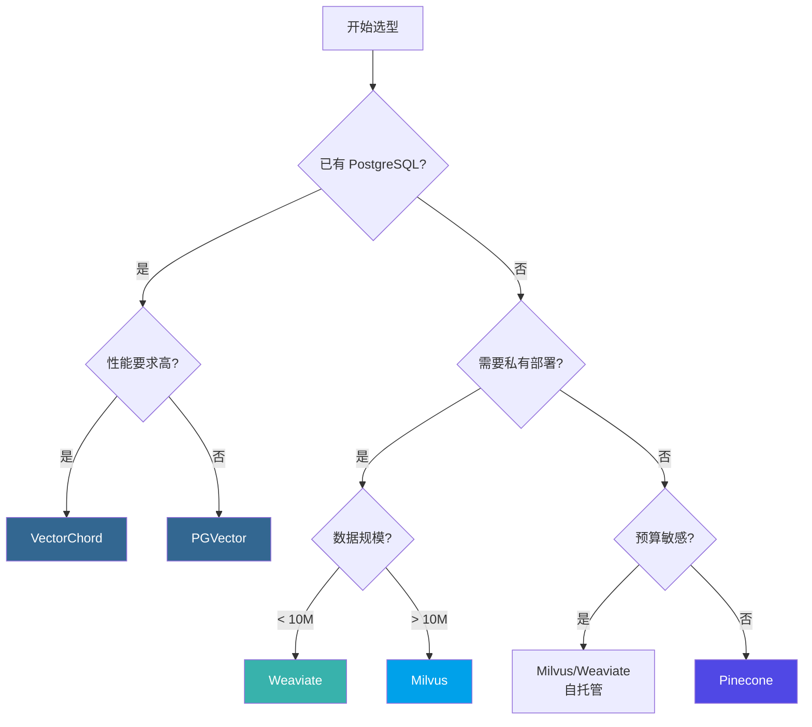

### 8.2 场景推荐矩阵

| 场景                     | 首选方案        | 备选方案       | 理由                   |
| ------------------------ | --------------- | -------------- | ---------------------- |
| **已有 PostgreSQL 系统** | VectorChord     | PGVector       | 零迁移成本，数据一致性 |
| **快速原型开发**         | Pinecone        | Weaviate Cloud | 零运维，快速上手       |
| **大规模生产系统**       | Milvus          | Weaviate       | 分布式架构，高可扩展   |
| **AI-Native 应用**       | Weaviate        | Milvus         | 内置向量化，RAG 支持   |
| **成本敏感型**           | PGVector/Milvus | VectorChord    | 开源免费，自托管       |
| **企业合规要求**         | Milvus/Weaviate | VectorChord    | 私有部署，数据主权     |
| **多租户 SaaS**          | Pinecone        | Weaviate Cloud | 命名空间隔离           |

### 8.3 本项目推荐方案

基于本项目（Agentic AI 学术研究与工程应用方案定制）的需求分析：

| 需求维度              | 本项目要求         | 推荐方案             |
| --------------------- | ------------------ | -------------------- |
| **数据规模**          | 初期 < 1M 向量     | PGVector/VectorChord |
| **混合检索**          | 向量 + 全文 + 图谱 | PostgreSQL 扩展      |
| **事务支持**          | 需要 ACID          | PostgreSQL 扩展      |
| **与 OceanBase 集成** | 三位一体架构       | OceanBase Vector     |
| **运维复杂度**        | 希望简化           | 单库方案             |

> **推荐**：鉴于本项目已采用 OceanBase 作为核心存储（支持原生向量能力），建议以 OceanBase Vector 为主要向量存储方案，PGVector/VectorChord 作为开发测试的备选方案。

---

## 9. 本项目集成方案 Demo

### 9.1 技术架构概览

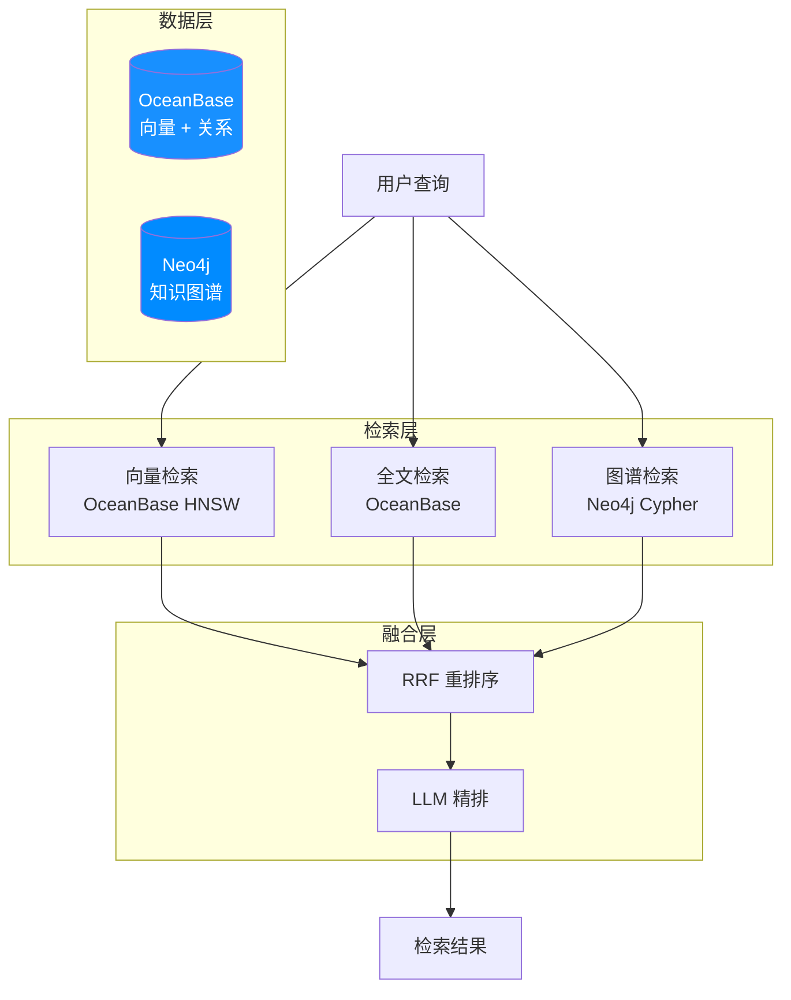

### 9.2 OceanBase 向量检索实现

#### 9.2.1 表结构设计

```sql
-- 内容元数据表
CREATE TABLE sources (
    id BIGINT PRIMARY KEY AUTO_INCREMENT,
    source_type ENUM('paper', 'article', 'document', 'code_repo') NOT NULL,
    title VARCHAR(500) NOT NULL,
    abstract TEXT,
    authors JSON,
    url VARCHAR(1000),
    status ENUM('pending', 'processing', 'translated', 'analyzed'),
    created_at TIMESTAMP DEFAULT CURRENT_TIMESTAMP,
    INDEX idx_source_type (source_type),
    INDEX idx_status (status)
);

-- 向量嵌入表
CREATE TABLE source_embeddings (
    id BIGINT PRIMARY KEY AUTO_INCREMENT,
    source_id BIGINT NOT NULL,
    chunk_index INT DEFAULT 0,
    chunk_text TEXT,
    embedding VECTOR(1536),  -- OpenAI text-embedding-3-small
    FOREIGN KEY (source_id) REFERENCES sources(id)
);

-- 创建 HNSW 向量索引
CREATE INDEX idx_source_embedding_hnsw
ON source_embeddings USING HNSW (embedding vector_cosine_ops)
WITH (m = 16, ef_construction = 128);
```

#### 9.2.2 向量检索查询

```sql
-- 语义相似度搜索
SELECT
    s.id,
    s.title,
    se.chunk_text,
    se.embedding <=> $query_vector AS distance
FROM source_embeddings se
JOIN sources s ON se.source_id = s.id
WHERE s.source_type = 'paper'
ORDER BY se.embedding <=> $query_vector
LIMIT 10;

-- 混合检索（向量 + 全文）
WITH vector_results AS (
    SELECT source_id, embedding <=> $query_vector AS v_score
    FROM source_embeddings
    ORDER BY v_score LIMIT 50
),
text_results AS (
    SELECT id, ts_rank(to_tsvector('english', abstract), query) AS t_score
    FROM sources, plainto_tsquery('english', $query_text) query
    WHERE to_tsvector('english', abstract) @@ query
    LIMIT 50
)
SELECT
    s.*,
    COALESCE(v.v_score, 1) AS vector_score,
    COALESCE(t.t_score, 0) AS text_score,
    -- RRF 融合分数
    1.0 / (60 + RANK() OVER (ORDER BY v.v_score)) +
    1.0 / (60 + RANK() OVER (ORDER BY t.t_score DESC)) AS rrf_score
FROM sources s
LEFT JOIN vector_results v ON s.id = v.source_id
LEFT JOIN text_results t ON s.id = t.id
WHERE v.source_id IS NOT NULL OR t.id IS NOT NULL
ORDER BY rrf_score DESC
LIMIT 10;
```

### 9.3 LlamaIndex 集成示例

```python
from llama_index.core import VectorStoreIndex, Document
from llama_index.vector_stores.oceanbase import OceanBaseVectorStore

# 配置 OceanBase 连接
vector_store = OceanBaseVectorStore(
    host="127.0.0.1",
    port=2881,
    user="root@test",
    password="your_password",
    database="agentic_ai",
    table_name="source_embeddings",
    embedding_dimension=1536
)

# 创建索引
index = VectorStoreIndex.from_vector_store(vector_store)

# RAG 查询
query_engine = index.as_query_engine(
    similarity_top_k=10,
    response_mode="tree_summarize"
)

response = query_engine.query(
    "ReAct 和 Chain-of-Thought 有什么区别？"
)
print(response)
```

### 9.4 LangChain 集成示例

```python
from langchain_oceanbase.vectorstores import OceanBaseVectorStore
from langchain_openai import OpenAIEmbeddings, ChatOpenAI
from langchain.chains import RetrievalQA

# 初始化嵌入模型
embeddings = OpenAIEmbeddings(model="text-embedding-3-small")

# 连接 OceanBase 向量存储
vector_store = OceanBaseVectorStore(
    connection_string="mysql+pymysql://root@test:password@127.0.0.1:2881/agentic_ai",
    embedding_function=embeddings,
    table_name="source_embeddings"
)

# 创建检索器
retriever = vector_store.as_retriever(
    search_type="similarity",
    search_kwargs={"k": 10}
)

# 构建 RAG 链
llm = ChatOpenAI(model="gpt-4o", temperature=0)
qa_chain = RetrievalQA.from_chain_type(
    llm=llm,
    chain_type="stuff",
    retriever=retriever,
    return_source_documents=True
)

# 执行查询
result = qa_chain.invoke({"query": "什么是 Agentic RAG？"})
print(result["result"])
```

### 9.5 Milvus 备选方案（开发测试）

```python
from pymilvus import MilvusClient

# 使用 Milvus Lite 进行本地开发
client = MilvusClient("./milvus_demo.db")

# 创建 Collection
client.create_collection(
    collection_name="papers",
    dimension=1536,
    metric_type="COSINE"
)

# 插入数据
client.insert(
    collection_name="papers",
    data=[
        {"id": 1, "vector": embedding, "title": "ReAct Paper", "abstract": "..."},
        # ...
    ]
)

# 创建索引
client.create_index(
    collection_name="papers",
    field_name="vector",
    index_type="HNSW",
    metric_type="COSINE",
    params={"M": 16, "efConstruction": 128}
)

# 搜索
results = client.search(
    collection_name="papers",
    data=[query_embedding],
    limit=10,
    output_fields=["title", "abstract"]
)
```

### 9.6 性能监控与调优

```sql
-- 查看索引使用情况
EXPLAIN (ANALYZE, BUFFERS)
SELECT * FROM source_embeddings
ORDER BY embedding <=> '[0.1, 0.2, ...]'::vector
LIMIT 10;

-- 调整 HNSW 搜索参数
SET hnsw.ef_search = 100;  -- 提升召回率

-- 批量数据导入后重建索引
REINDEX INDEX CONCURRENTLY idx_source_embedding_hnsw;

-- 清理碎片
VACUUM ANALYZE source_embeddings;
```

---

## References

[1] **Vector Databases in AI Applications** - LlamaIndex Documentation. https://docs.llamaindex.ai/

[2] **pgvector: Open-source vector similarity search for Postgres** - GitHub. https://github.com/pgvector/pgvector

[3] **Efficient and robust approximate nearest neighbor search using Hierarchical Navigable Small World graphs** - Yu. A. Malkov, D. A. Yashunin. https://arxiv.org/abs/1603.09320

[4] **Product Quantization for Nearest Neighbor Search** - Jégou, H., Douze, M., & Schmid, C. (2011). IEEE TPAMI.

[5] **pgvecto.rs: Scalable Vector Search in Postgres** - TensorChord. https://docs.vectorchord.ai/getting-started/overview.html

[6] **VectorChord: High-Performance Vector Search** - TensorChord. https://docs.vectorchord.ai/vectorchord/getting-started/overview.html

[7] **RaBitQ: Quantizing High-Dimensional Vectors with a Theoretical Error Bound** - Gao, J., & Long, C. (2024). Proceedings of the ACM on Management of Data.

[8] **pgvector vs. pgvecto.rs Comparison** - TensorChord. https://docs.vectorchord.ai/faqs/comparison-pgvector.html

[9] **Milvus: The World's Most Advanced Open-Source Vector Database** - Zilliz. https://milvus.io/docs/overview.md

[10] **Milvus Architecture Overview** - Zilliz. https://milvus.io/docs/architecture_overview.md

[11] **Milvus Index Explained** - Zilliz. https://milvus.io/docs/index-explained.md

[12] **Milvus Performance Benchmarks** - Zilliz. https://milvus.io/docs/benchmark.md

[13] **Weaviate: The AI-Native Vector Database** - Weaviate. https://docs.weaviate.io/weaviate/introduction

[14] **Weaviate Vector Indexing** - Weaviate. https://docs.weaviate.io/weaviate/concepts/vector-index

[15] **Weaviate Model Providers** - Weaviate. https://docs.weaviate.io/weaviate/model-providers

[16] **Pinecone: The Vector Database for AI** - Pinecone. https://docs.pinecone.io/guides/get-started/overview

[17] **Pinecone Indexing Overview** - Pinecone. https://docs.pinecone.io/guides/index-data/indexing-overview

[18] **Pinecone Namespaces** - Pinecone. https://docs.pinecone.io/guides/index-data/indexing-overview#namespaces

[19] **OceanBase Vector Database Capabilities** - OceanBase. https://www.oceanbase.com/docs/

[20] **LlamaIndex OceanBase Integration** - LlamaIndex. https://docs.llamaindex.ai/en/stable/examples/vector_stores/OceanBaseVectorStore/

[21] **LangChain OceanBase Integration** - LangChain. https://python.langchain.com/docs/integrations/vectorstores/oceanbase/

---

> **文档维护信息**  
> **创建日期**：2025-12-23  
> **最后更新**：2025-12-23  
> **维护者**：Agentic AI Research Team
