# BettaFish（微舆）深度调研报告

> 调研日期：2025-12-21  
> 项目地址：[https://github.com/666ghj/BettaFish](https://github.com/666ghj/BettaFish)  
> 版本：v2.1.0（截至 2025-12-09）  
> GitHub 数据：⭐ 33.2K Stars | 👁 190 Watching | 🍴 6.4K Forks | 👥 35+ 贡献者
>
> BettaFish（微舆）是一个设计精良、工程完整的开源多 Agent 舆情分析系统。其最大亮点在于：
>
> 1. **零框架依赖**：完全自主实现，代码清晰易懂，非常适合学习 Agent 系统设计
> 2. **论坛协作机制**：独创的多 Agent 辩论模式，避免单模型思维局限
> 3. **端到端解决方案**：从数据采集（爬虫）到分析（Agent）到输出（报告），完整闭环
> 4. **高度可定制**：支持自定义 LLM、情感分析模型、业务数据库
>
> 对于希望深入理解多 Agent 系统设计、或需要舆情分析能力的团队和个人，BettaFish 是非常值得学习和参考的项目。
>
> **项目许可证**：GPL-2.0

---

## 📋 目录

1. [产品概要](#1-产品概要)
2. [系统架构](#2-系统架构)
3. [工程介绍](#3-工程介绍)
4. [使用指引](#4-使用指引)
5. [技术亮点](#5-技术亮点)
6. [项目心得与启示](#6-项目心得与启示)
7. [与同类产品对比](#7-与同类产品对比)
8. [参考资料](#8-参考资料)

---

## 1. 产品概要

### 1.1 项目定位

**微舆（BettaFish）** 是一个从零实现的创新型**多智能体（Multi-Agent）舆情分析系统**。项目命名寓意深刻：「微舆」谐音「微鱼」，BettaFish（斗鱼）是一种体型小但非常好斗、漂亮的观赏鱼，象征着「**小而强大，不畏挑战**」的精神。

### 1.2 核心价值主张

```
输入要求 → 详细分析 → （未来）预测
```

用户只需像聊天一样提出分析需求，系统便自动触发多 Agent 协作，完成对**国内外 30+ 主流社媒**与**数百万条大众评论**的全自动分析。

### 1.3 六大核心优势

| 序号 | 优势                      | 说明                                                                     |
| :--: | :------------------------ | :----------------------------------------------------------------------- |
|  1   | **AI 驱动全域监控**       | AI 爬虫集群 7×24 小时作业，覆盖微博、小红书、抖音、快手等 10+ 国内外社媒 |
|  2   | **复合分析引擎**          | 5 类专业 Agent + 微调模型 + 统计模型协同工作，确保分析深度与准度         |
|  3   | **强大多模态能力**        | 支持短视频解析（抖音、快手）、结构化多模态信息卡片提取                   |
|  4   | **Agent「论坛」协作机制** | 独特的「论坛辩论」模式，避免单模型思维局限，催生集体智能                 |
|  5   | **公私域数据融合**        | 支持内部业务数据库接入，实现「外部趋势 + 内部洞察」融合分析              |
|  6   | **轻量化高扩展性**        | 纯 Python 模块化设计，一键部署，易于集成自定义模型与业务逻辑             |

### 1.4 目标愿景

> **始于舆情，而不止于舆情。**  
> 微舆的目标是成为驱动一切业务场景的**简洁通用数据分析引擎**。

---

## 2. 系统架构

### 2.1 整体架构概览

```mermaid
flowchart TB
    subgraph UserLayer["用户层"]
        UI[Flask Web UI]
        CLI[命令行工具]
    end

    subgraph AgentLayer["Agent 层"]
        QA["Query Agent<br/>精准信息搜索"]
        MA["Media Agent<br/>多模态内容分析"]
        IA["Insight Agent<br/>私有数据库挖掘"]
        RA["Report Agent<br/>智能报告生成"]
    end

    subgraph CollaborationLayer["协作层"]
        FE[ForumEngine<br/>论坛协作引擎]
    end

    subgraph DataLayer["数据层"]
        MS[MindSpider<br/>AI 爬虫系统]
        DB[(PostgreSQL/MySQL)]
        SA[情感分析模型集合]
    end

    UI --> QA
    UI --> MA
    UI --> IA
    CLI --> RA

    QA <--> FE
    MA <--> FE
    IA <--> FE

    FE --> RA

    QA --> MS
    MA --> MS
    IA --> DB
    IA --> SA

    RA --> |HTML/PDF/MD| Output[报告输出]
```



### 2.2 核心 Agent 职责

| Agent             | 职责               | 核心能力                                         |
| :---------------- | :----------------- | :----------------------------------------------- |
| **Query Agent**   | 国内外新闻广度搜索 | 具备国内外网页搜索能力的 AI 代理                 |
| **Media Agent**   | 多模态内容分析     | 处理视频/图片等多模态内容，支持抖音快手解析      |
| **Insight Agent** | 私有数据库挖掘     | 私有舆情数据库深度分析，支持自定义业务数据库接入 |
| **Report Agent**  | 智能报告生成       | 内置模板的多轮报告生成，输出 HTML/PDF/Markdown   |
| **ForumEngine**   | Agent 协作机制     | 论坛主持人模型引导 Agent 辩论与协作              |

### 2.3 一次完整分析流程

```mermaid
sequenceDiagram
    participant U as 用户
    participant F as Flask 主应用
    participant Q as Query Agent
    participant M as Media Agent
    participant I as Insight Agent
    participant FE as ForumEngine
    participant R as Report Agent

    U->>F: 1. 提出查询需求

    par 并行启动
        F->>Q: 2. 启动搜索
        F->>M: 2. 启动多模态分析
        F->>I: 2. 启动数据库挖掘
    end

    Note over Q,I: 3. 各Agent使用专属工具进行概览搜索
    Note over Q,I: 4. 基于初步结果制定分块研究策略

    loop 循环阶段（多轮）
        Q->>FE: 5.1 发言与汇报
        M->>FE: 5.1 发言与汇报
        I->>FE: 5.1 发言与汇报
        FE->>FE: 5.2 LLM主持人生成引导
        FE-->>Q: 5.3 论坛引导
        FE-->>M: 5.3 论坛引导
        FE-->>I: 5.3 论坛引导
    end

    FE->>R: 6. 结果整合
    R->>R: 7. 动态选择模板,生成IR中间表示
    R->>R: 8. 分块质量检测,渲染HTML报告
    R-->>U: 9. 返回交互式报告
```



### 2.4 ForumEngine 论坛协作机制深度解析

ForumEngine 是 BettaFish 最具创新性的设计之一，其核心理念：

> 为不同 Agent 赋予独特的工具集与思维模式，引入**辩论主持人模型**，通过「论坛」机制进行链式思维碰撞与辩论，**避免单一模型的思维局限与交流导致的同质化**。

**工作原理：**

1. **日志监控（`monitor.py`）**：实时监控各 Agent 的发言与分析日志
2. **主持人引导（`llm_host.py`）**：LLM 担任论坛主持人，汇总各方观点并生成引导性问题
3. **交流融合**：各 Agent 通过 `forum_reader` 工具读取其他 Agent 的观点，调整研究方向

---

## 3. 工程介绍

### 3.1 目录结构

```
BettaFish/
├── QueryEngine/                 # 国内外新闻广度搜索 Agent
│   ├── agent.py                 # Agent 主逻辑
│   ├── llms/                    # LLM 接口封装
│   ├── nodes/                   # 处理节点：搜索、格式化、总结等
│   ├── tools/                   # 国内外新闻搜索工具集
│   └── prompts/                 # 提示词模板
│
├── MediaEngine/                 # 强大的多模态理解 Agent
│   ├── agent.py                 # 处理视频/图片等多模态内容
│   └── ...（结构同上）
│
├── InsightEngine/               # 私有数据库挖掘 Agent
│   ├── tools/
│   │   ├── keyword_optimizer.py # Qwen 关键词优化中间件
│   │   ├── search.py            # 数据库操作工具集
│   │   └── sentiment_analyzer.py# 情感分析集成工具
│   └── ...
│
├── ReportEngine/                # 多轮报告生成 Agent
│   ├── agent.py                 # 模板选择→布局→篇幅→章节→渲染
│   ├── core/                    # 模板解析、章节存储、文档装订
│   ├── ir/                      # 报告中间表示(IR)契约与校验
│   ├── graphrag/                # GraphRAG 知识图谱构建与检索
│   ├── renderers/               # HTML/PDF/Markdown 渲染器
│   └── report_template/         # Markdown 模板库
│
├── ForumEngine/                 # 论坛引擎：Agent 协作机制
│   ├── monitor.py               # 日志监控和论坛管理核心
│   └── llm_host.py              # 论坛主持人 LLM 模块
│
├── MindSpider/                  # 社交媒体 AI 爬虫系统
│   ├── BroadTopicExtraction/    # 话题提取模块
│   ├── DeepSentimentCrawling/   # 深度舆情爬取模块
│   └── schema/                  # 数据库结构定义
│
├── SentimentAnalysisModel/      # 情感分析模型集合
│   ├── WeiboSentiment_Finetuned/# 微调 BERT/GPT-2 模型
│   ├── WeiboMultilingualSentiment/# 多语言情感分析
│   ├── WeiboSentiment_SmallQwen/# 小参数 Qwen3 微调
│   └── WeiboSentiment_MachineLearning/# 传统机器学习方法
│
├── SingleEngineApp/             # 单独 Agent 的 Streamlit 应用
├── app.py                       # Flask 主应用入口
├── docker-compose.yml           # Docker 多服务编排配置
└── requirements.txt             # Python 依赖包清单
```

### 3.2 技术栈

| 层级         | 技术选型                                       |
| :----------- | :--------------------------------------------- |
| **编程语言** | Python 3.9+（98.6%）+ Jupyter Notebook（1.1%） |
| **Web 框架** | Flask（主应用）+ Streamlit（单 Agent 应用）    |
| **LLM 接口** | OpenAI 兼容 API 标准（支持任意 LLM 提供商）    |
| **爬虫框架** | Playwright（浏览器自动化）                     |
| **数据库**   | PostgreSQL（推荐）/ MySQL                      |
| **并发处理** | AsyncIO（异步并发）                            |
| **PDF 渲染** | WeasyPrint                                     |
| **知识图谱** | GraphRAG（可选）                               |

### 3.3 MindSpider 爬虫系统

MindSpider 是专为舆情分析设计的 AI 爬虫，采用**两步走**爬取策略：

```mermaid
flowchart LR
    subgraph Step1["模块一：BroadTopicExtraction"]
        A[13+社媒平台热搜采集] --> B[AI话题提取]
        B --> C[生成关键词列表]
        C --> D[保存每日话题表]
    end

    subgraph Step2["模块二：DeepSentimentCrawling"]
        E[加载当日关键词] --> F[选择爬取平台]
        F --> G[7大平台深度爬取]
        G --> H[内容解析与情感分析]
        H --> I[数据持久化存储]
    end

    Step1 --> Step2
```



**支持的平台：**

|  代码  |  平台  |  代码   | 平台 |
| :----: | :----: | :-----: | :--: |
| `xhs`  | 小红书 |  `wb`   | 微博 |
|  `dy`  |  抖音  | `tieba` | 贴吧 |
|  `ks`  |  快手  | `zhihu` | 知乎 |
| `bili` |  B 站  |         |      |

---

## 4. 使用指引

### 4.1 Docker 快速部署（推荐）

```bash
# 1. 复制环境变量配置
cp .env.example .env

# 2. 编辑 .env 配置 LLM API 和数据库

# 3. 启动所有服务
docker compose up -d
```

### 4.2 源码部署

#### 环境要求

- **操作系统**：Windows / Linux / MacOS
- **Python 版本**：3.9+
- **数据库**：PostgreSQL（推荐）或 MySQL
- **内存**：建议 2GB 以上

#### 安装步骤

```bash
# 1. 创建环境
conda create -n bettafish python=3.11
conda activate bettafish

# 2. 安装依赖
pip install -r requirements.txt

# 3. 安装 Playwright 浏览器驱动
playwright install chromium

# 4. 配置环境变量
cp .env.example .env
# 编辑 .env 文件配置 API Key 和数据库

# 5. 启动系统
python app.py
```

访问 http://localhost:5000 即可使用

### 4.3 单独使用模块

```bash
# QueryEngine 单独运行
streamlit run SingleEngineApp/query_engine_streamlit_app.py --server.port 8503

# MediaEngine 单独运行
streamlit run SingleEngineApp/media_engine_streamlit_app.py --server.port 8502

# InsightEngine 单独运行
streamlit run SingleEngineApp/insight_engine_streamlit_app.py --server.port 8501
```

### 4.4 命令行报告生成

```bash
# 基本使用（自动从文件名提取主题）
python report_engine_only.py

# 指定报告主题
python report_engine_only.py --query "土木工程行业分析"

# 按需开启 GraphRAG
python report_engine_only.py --graphrag-enabled true --graphrag-max-queries 3
```

### 4.5 爬虫系统使用

```bash
cd MindSpider

# 项目初始化
python main.py --setup

# 运行话题提取
python main.py --broad-topic

# 运行完整爬虫流程
python main.py --complete --date 2024-01-20

# 指定平台深度爬取
python main.py --deep-sentiment --platforms xhs dy wb
```

### 4.6 LLM 配置示例

```yml
# .env 文件

# Insight Agent
INSIGHT_ENGINE_API_KEY=your_api_key
INSIGHT_ENGINE_BASE_URL=https://api.openai.com/v1
INSIGHT_ENGINE_MODEL_NAME=gpt-4o

# Media Agent
MEDIA_ENGINE_API_KEY=your_api_key
MEDIA_ENGINE_BASE_URL=https://api.openai.com/v1
MEDIA_ENGINE_MODEL_NAME=gpt-4o

# Query Agent
QUERY_ENGINE_API_KEY=your_api_key
QUERY_ENGINE_BASE_URL=https://api.openai.com/v1
QUERY_ENGINE_MODEL_NAME=gpt-4o

# Report Agent
REPORT_ENGINE_API_KEY=your_api_key
REPORT_ENGINE_BASE_URL=https://api.openai.com/v1
REPORT_ENGINE_MODEL_NAME=gpt-4o
```

---

## 5. 技术亮点

### 5.1 多情感分析模型集成

BettaFish 提供了完整的情感分析模型谱系：

| 模型类型           | 路径                                                                | 特点                |
| :----------------- | :------------------------------------------------------------------ | :------------------ |
| **BERT 中文 LoRA** | `SentimentAnalysisModel/WeiboSentiment_Finetuned/BertChinese-Lora/` | 中文微博语料微调    |
| **GPT-2 LoRA**     | `SentimentAnalysisModel/WeiboSentiment_Finetuned/GPT2-Lora/`        | 生成式情感分析      |
| **多语言模型**     | `SentimentAnalysisModel/WeiboMultilingualSentiment/`                | 支持多语言          |
| **小参数 Qwen3**   | `SentimentAnalysisModel/WeiboSentiment_SmallQwen/`                  | 轻量级部署          |
| **传统 ML**        | `SentimentAnalysisModel/WeiboSentiment_MachineLearning/`            | SVM/RandomForest 等 |

### 5.2 报告生成 IR 中间表示

ReportEngine 采用创新的 **IR（Intermediate Representation）中间表示**架构：

```
原始数据 → 模板选择 → 布局设计 → 篇幅规划 → 章节生成 → IR JSON → 渲染输出
```

**优势：**

- 统一的中间表示层，支持多种输出格式（HTML/PDF/Markdown）
- 分块质量检测机制
- 支持 GraphRAG 知识图谱增强

### 5.3 自定义业务数据库接入

```python
# InsightEngine/tools/custom_db_tool.py
class CustomBusinessDBTool:
    """自定义业务数据库查询工具"""

    def search_business_data(self, query: str, table: str):
        """查询业务数据"""
        pass

    def get_customer_feedback(self, product_id: str):
        """获取客户反馈数据"""
        pass
```

这一设计使 BettaFish 能够实现**公域舆情 + 私域业务数据**的融合分析。

---

## 6. 项目心得与启示

### 6.1 架构设计启示

| 设计原则       | BettaFish 实践                                                          | 启示                                    |
| :------------- | :---------------------------------------------------------------------- | :-------------------------------------- |
| **模块化**     | 每个 Agent 独立成包，有自己的 `agent.py`、`llms/`、`tools/`、`prompts/` | 便于单独开发、测试、部署                |
| **协作机制**   | ForumEngine 论坛辩论模式                                                | 多 Agent 不是简单并行，而是有结构的协作 |
| **可配置性**   | 统一 `.env` 环境变量管理                                                | 降低部署复杂度                          |
| **零框架依赖** | 不依赖 LangChain/AutoGen 等框架                                         | 完全掌控代码，适合学习                  |

### 6.2 值得借鉴的实现

1. **论坛协作机制（ForumEngine）**：通过引入「主持人」角色引导多 Agent 辩论，避免同质化思维

2. **IR 中间表示**：报告生成采用 IR 层设计，解耦数据处理与渲染

3. **多模型情感分析**：提供从传统 ML 到微调 LLM 的完整谱系，适应不同场景

4. **两步走爬虫策略**：先广度话题提取，再深度定向爬取，提高数据质量

### 6.3 潜在改进方向

1. **舆情预测**：项目作者已规划使用时序模型、图神经网络进行趋势预测

2. **实时监控**：目前是查询驱动，可扩展为实时预警系统

3. **可视化增强**：当前输出为 HTML 报告，可增加交互式图表

### 6.4 适用场景

- **品牌声誉监测**：企业舆情分析
- **公共事件追踪**：热点事件演进分析
- **竞品分析**：行业舆情对比
- **学术研究**：社交媒体数据分析

---

## 7. 与同类产品对比

| 特性          | BettaFish | Manus | ChatGPT | Perplexity |
| :------------ | :-------: | :---: | :-----: | :--------: |
| 多 Agent 协作 |    ✅     |  ❌   |   ❌    |     ❌     |
| 舆情专属训练  |    ✅     |  ❌   |   ❌    |     ❌     |
| 社媒深度爬取  |    ✅     |  ❌   |   ❌    |    有限    |
| 多模态分析    |    ✅     |  ❌   |   ✅    |     ✅     |
| 私域数据融合  |    ✅     |  ❌   |   ❌    |     ❌     |
| 报告自动生成  |    ✅     |  ❌   |   ❌    |     ❌     |
| 开源可控      |    ✅     |  ❌   |   ❌    |     ❌     |

> 参考：[开源项目(微舆)与 manus|minimax|ChatGPT|Perplexity 对比](https://linux.do/t/topic/1148040)

---

## 8. 参考资料

### 8.1 官方资源

- **GitHub 仓库**：[666ghj/BettaFish](https://github.com/666ghj/BettaFish)
- **贡献指南**：[CONTRIBUTING.md](https://github.com/666ghj/BettaFish/blob/main/CONTRIBUTING.md)
- **爬虫文档**：[MindSpider/README.md](https://github.com/666ghj/BettaFish/blob/main/MindSpider/README.md)
- **FAQ**：[Issues #185](https://github.com/666ghj/BettaFish/issues/185)

### 8.2 示例报告

- [武汉大学品牌声誉深度分析报告](https://github.com/666ghj/BettaFish/blob/main/final_reports/final_report__20250827_131630.html)
- [视频演示](https://www.bilibili.com/video/BV1TH1WBxEWN/)

### 8.3 社区讨论

- [L 站项目讨论帖](https://linux.do/t/topic/1009280)
- [产品对比评测](https://linux.do/t/topic/1148040)

### 8.4 联系方式

- **邮箱**：hangjiang@bupt.edu.cn
- **QQ 群**：见项目 README 二维码
