# Neo4j 图数据库深度调研报告

> **报告版本**：v1.0
> **调研日期**：2025-12
> **调研对象**：Neo4j Database 2025.x / 5.x
> **调研范围**：图数据库核心能力、Cypher 查询语言、向量搜索、GenAI 集成、图算法

---

## 📋 目录

1. [产品概述与定位](#1-产品概述与定位)
2. [核心架构与技术原理](#2-核心架构与技术原理)
3. [Cypher 查询语言](#3-cypher-查询语言)
4. [数据建模与图模式](#4-数据建模与图模式)
5. [索引与性能优化](#5-索引与性能优化)
6. [集群与高可用](#6-集群与高可用)
7. [向量搜索与 GenAI](#7-向量搜索与-genai)
8. [图数据科学 (GDS)](#8-图数据科学-gds)
9. [生态集成](#9-生态集成)
10. [可行性分析与评估](#10-可行性分析与评估)
11. [本项目集成方案](#11-本项目集成方案)
12. [Demo 实施指引](#12-demo-实施指引)
13. [References](#references)

---

## 1. 产品概述与定位

### 1.1 产品简介

Neo4j 是全球领先的**原生图数据库**，专为存储和查询高度互联的数据而设计<sup>[[1]](#ref1)</sup>。它采用**属性图模型（Property Graph Model）**，将数据表示为节点（Nodes）、关系（Relationships）和属性（Properties）的集合，能够直观地映射现实世界中的实体和关联<sup>[[2]](#ref2)</sup>。

Neo4j 的核心优势在于其**原生图存储和处理能力**——数据在底层以图结构存储，查询时无需进行昂贵的 JOIN 操作，而是通过指针直接遍历关系，实现**常数时间复杂度**的关系查找<sup>[[3]](#ref3)</sup>。

### 1.2 核心定位

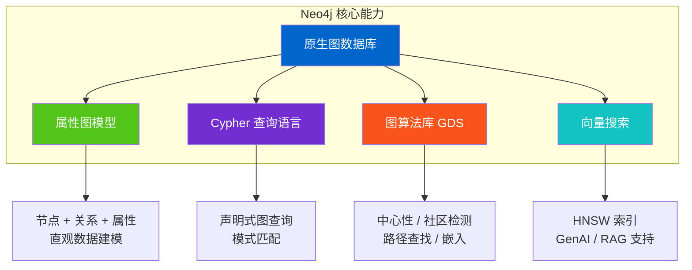

| 能力维度     | 描述                         | 典型场景               |
| ------------ | ---------------------------- | ---------------------- |
| **图存储**   | 原生图结构存储，关系一等公民 | 社交网络、知识图谱     |
| **图查询**   | Cypher 声明式查询语言        | 复杂关系查询、路径分析 |
| **图算法**   | 50+ 图分析算法（GDS 库）     | 推荐系统、欺诈检测     |
| **向量搜索** | HNSW 向量索引，最高 4096 维  | RAG、语义搜索          |

### 1.3 版本演进

| 版本             | 发布时间 | 重要特性                  |
| ---------------- | -------- | ------------------------- |
| Neo4j 4.x        | 2020     | 多数据库、Fabric 联邦查询 |
| Neo4j 5.0        | 2022     | 全新架构、改进的集群      |
| Neo4j 5.13+      | 2024     | 向量索引原生支持          |
| **Neo4j 2025.x** | 2025     | Cypher 25、日历版本命名   |

### 1.4 产品版本对比

| 功能          | Community Edition | Enterprise Edition | Aura (云服务) |
| ------------- | ----------------- | ------------------ | ------------- |
| **开源协议**  | GPL v3            | 商业授权           | SaaS          |
| **集群**      | ❌                | ✅                 | ✅            |
| **高可用**    | ❌                | ✅                 | ✅            |
| **RBAC 权限** | 基础              | 完整               | 完整          |
| **向量索引**  | ✅                | ✅                 | ✅            |
| **GDS 算法**  | 社区版            | 企业版             | ✅            |
| **并发限制**  | 4 核              | 无限制             | 按配置        |

---

## 2. 核心架构与技术原理

### 2.1 属性图模型

Neo4j 采用**属性图模型**，这是图数据库领域最广泛使用的数据模型<sup>[[2]](#ref2)</sup><sup>[[4]](#ref4)</sup>：

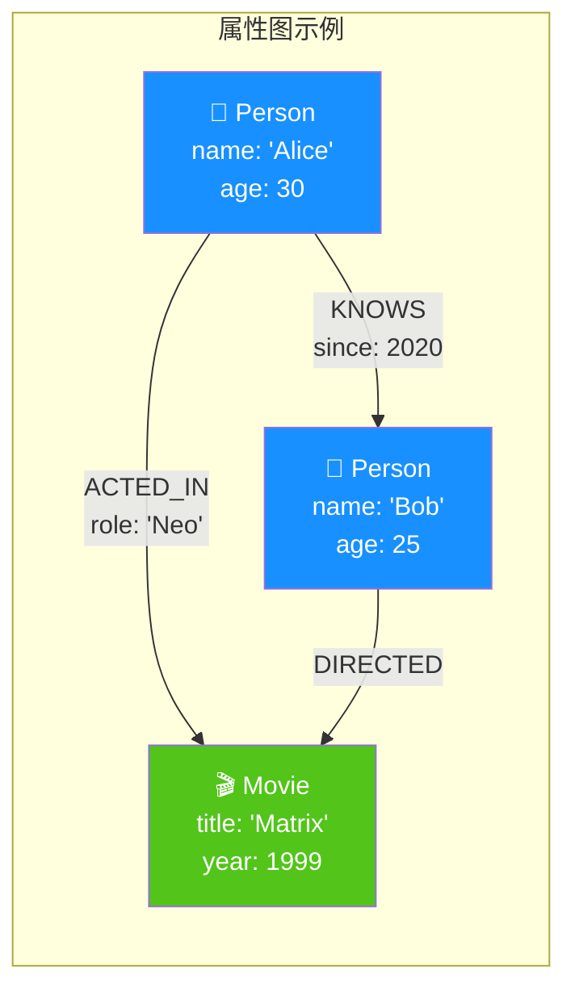

#### 核心概念

| 概念                    | 描述                       | 示例                        |
| ----------------------- | -------------------------- | --------------------------- |
| **节点 (Node)**         | 实体，可有标签和属性       | `(:Person {name: 'Alice'})` |
| **关系 (Relationship)** | 有向连接，必有类型和方向   | `-[:KNOWS {since: 2020}]->` |
| **标签 (Label)**        | 节点分类，支持多标签       | `:Person`, `:Employee`      |
| **属性 (Property)**     | 键值对，存储在节点或关系上 | `name: 'Alice'`             |

### 2.2 存储架构

Neo4j 采用**原生图存储引擎**，数据以图结构直接存储在磁盘上<sup>[[3]](#ref3)</sup><sup>[[5]](#ref5)</sup>：

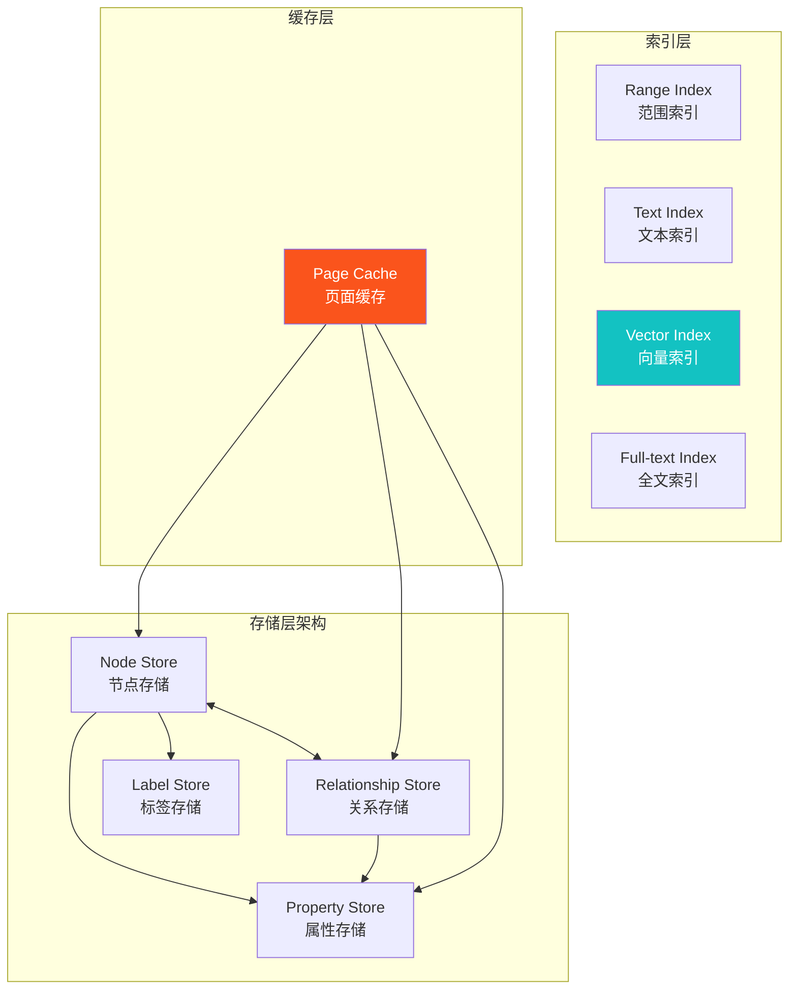

#### 存储特性

| 特性                     | 描述                                     |
| ------------------------ | ---------------------------------------- |
| **固定大小记录**         | 节点/关系使用固定大小记录，O(1) 随机访问 |
| **双向链表**             | 关系存储为双向链表，支持双向遍历         |
| **Property Chain**       | 属性以链式结构存储，支持动态属性         |
| **Index-free Adjacency** | 无需索引即可遍历邻接节点                 |

### 2.3 事务与 ACID

Neo4j 完全支持 **ACID 事务**<sup>[[5]](#ref5)</sup>：

| ACID 属性  | Neo4j 实现                             |
| ---------- | -------------------------------------- |
| **原子性** | 事务全部成功或全部回滚                 |
| **一致性** | 约束在事务提交时强制执行               |
| **隔离性** | 默认 Read-Committed，支持 Serializable |
| **持久性** | 事务日志 + 检查点机制                  |

```cypher
// 事务示例
BEGIN
CREATE (p:Person {name: 'Alice'})
CREATE (m:Movie {title: 'Matrix'})
CREATE (p)-[:ACTED_IN]->(m)
COMMIT
```

---

## 3. Cypher 查询语言

### 3.1 语言概述

**Cypher** 是 Neo4j 的声明式图查询语言，设计灵感来源于 SQL、SPARQL 和模式匹配<sup>[[6]](#ref6)</sup><sup>[[7]](#ref7)</sup>。其核心特点是使用 **ASCII Art** 语法直观表达图模式：

```
(node)-[relationship]->(node)
```

### 3.2 核心语法

#### 节点与关系模式

```cypher
// 节点模式
(p:Person {name: 'Alice'})

// 关系模式
-[:KNOWS]->           // 有向关系
-[:KNOWS]-            // 无向关系
-[:KNOWS*1..3]->      // 可变长度路径 (1-3 跳)

// 完整路径模式
(a:Person)-[:KNOWS]->(b:Person)-[:WORKS_AT]->(c:Company)
```

#### 基本查询操作

| 子句     | 用途          | 示例                              |
| -------- | ------------- | --------------------------------- |
| `MATCH`  | 模式匹配      | `MATCH (p:Person) RETURN p`       |
| `WHERE`  | 条件过滤      | `WHERE p.age > 30`                |
| `CREATE` | 创建节点/关系 | `CREATE (p:Person {name: 'Bob'})` |
| `MERGE`  | 匹配或创建    | `MERGE (p:Person {id: 1})`        |
| `SET`    | 更新属性      | `SET p.age = 31`                  |
| `DELETE` | 删除节点/关系 | `DELETE p`                        |
| `RETURN` | 返回结果      | `RETURN p.name, p.age`            |

#### 查询示例

```cypher
// 查找 Alice 的朋友
MATCH (alice:Person {name: 'Alice'})-[:KNOWS]->(friend:Person)
RETURN friend.name AS friendName

// 查找两人之间的最短路径
MATCH path = shortestPath(
  (alice:Person {name: 'Alice'})-[:KNOWS*]-(bob:Person {name: 'Bob'})
)
RETURN path

// 朋友的朋友推荐（排除已认识的人）
MATCH (me:Person {name: 'Alice'})-[:KNOWS]->(friend)-[:KNOWS]->(foaf)
WHERE NOT (me)-[:KNOWS]->(foaf) AND me <> foaf
RETURN foaf.name, count(*) AS mutualFriends
ORDER BY mutualFriends DESC
LIMIT 10
```

### 3.3 Cypher 25 新特性

Neo4j 2025.06 引入了 **Cypher 25** 版本<sup>[[1]](#ref1)</sup>：

| 新特性             | 描述                   |
| ------------------ | ---------------------- |
| **GQL 兼容**       | 与 ISO GQL 标准对齐    |
| **改进的类型系统** | 更严格的类型检查       |
| **新函数和操作符** | 增强的字符串、列表操作 |

```cypher
// 指定 Cypher 版本
CYPHER 25
MATCH (p:Person)
RETURN p.name
```

---

## 4. 数据建模与图模式

### 4.1 建模原则

Neo4j 的数据建模遵循**领域驱动设计**原则<sup>[[8]](#ref8)</sup>：

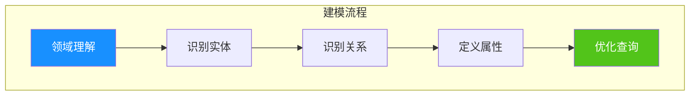

#### 建模最佳实践

| 原则              | 描述                 | 示例             |
| ----------------- | -------------------- | ---------------- |
| **实体 → 节点**   | 独立概念建模为节点   | Person, Product  |
| **动词 → 关系**   | 实体间动作建模为关系 | PURCHASED, KNOWS |
| **形容词 → 属性** | 描述性信息作为属性   | age, createdAt   |
| **多标签分类**    | 利用多标签实现继承   | :Person:Employee |

### 4.2 常见图模式

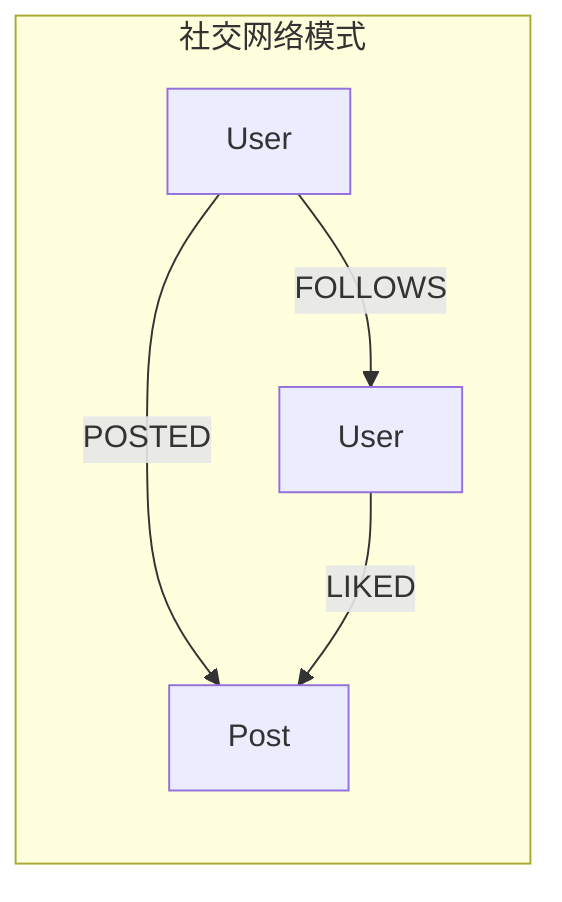

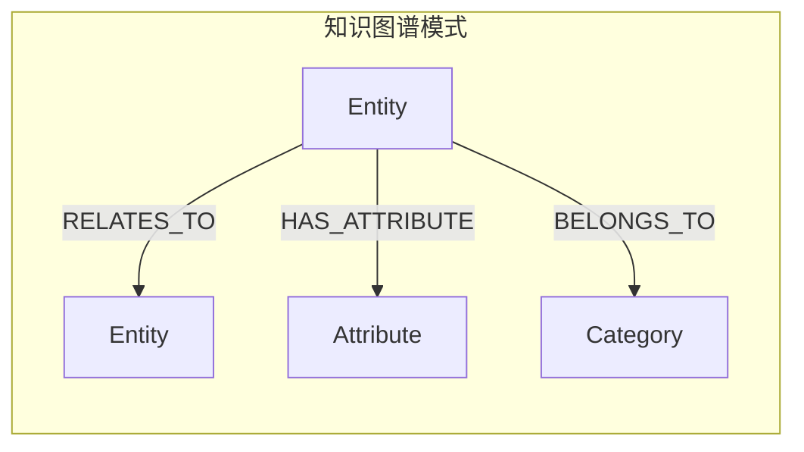

---

## 5. 索引与性能优化

### 5.1 索引类型

Neo4j 支持多种索引类型<sup>[[9]](#ref9)</sup><sup>[[10]](#ref10)</sup>：

| 索引类型            | 用途                | 适用场景         |
| ------------------- | ------------------- | ---------------- |
| **Range Index**     | 精确匹配、范围查询  | 数值、字符串属性 |
| **Text Index**      | 字符串前缀/包含查询 | 模糊搜索         |
| **Point Index**     | 地理空间查询        | 位置数据         |
| **Full-text Index** | 全文搜索（Lucene）  | 文档检索         |
| **Vector Index**    | 向量相似度搜索      | RAG、语义搜索    |
| **Token Lookup**    | 标签/类型快速查找   | 节点/关系类型    |

#### 创建索引

```cypher
// Range Index
CREATE INDEX person_name FOR (p:Person) ON (p.name)

// Composite Index
CREATE INDEX person_name_age FOR (p:Person) ON (p.name, p.age)

// Full-text Index
CREATE FULLTEXT INDEX movie_search FOR (m:Movie) ON EACH [m.title, m.plot]

// Vector Index (4096 维)
CREATE VECTOR INDEX doc_embedding FOR (d:Document) ON (d.embedding)
OPTIONS {
  indexConfig: {
    `vector.dimensions`: 1536,
    `vector.similarity_function`: 'cosine'
  }
}
```

### 5.2 约束

Neo4j 支持多种约束确保数据完整性<sup>[[11]](#ref11)</sup>：

```cypher
// 唯一性约束
CREATE CONSTRAINT person_id_unique FOR (p:Person) REQUIRE p.id IS UNIQUE

// 存在性约束 (Enterprise)
CREATE CONSTRAINT person_name_exists FOR (p:Person) REQUIRE p.name IS NOT NULL

// 类型约束 (Enterprise)
CREATE CONSTRAINT person_age_type FOR (p:Person) REQUIRE p.age IS :: INTEGER

// Key 约束 (Enterprise)
CREATE CONSTRAINT person_key FOR (p:Person) REQUIRE (p.id, p.email) IS NODE KEY
```

### 5.3 性能优化策略

| 策略                | 描述                     |
| ------------------- | ------------------------ |
| **Profile/Explain** | 分析查询执行计划         |
| **索引优化**        | 为频繁查询属性创建索引   |
| **参数化查询**      | 使用参数避免查询编译开销 |
| **批量操作**        | 使用 `UNWIND` 批量处理   |
| **内存配置**        | 适当配置 Page Cache      |

```cypher
// 查看执行计划
EXPLAIN MATCH (p:Person {name: 'Alice'}) RETURN p

// 详细执行统计
PROFILE MATCH (p:Person {name: 'Alice'}) RETURN p
```

---

## 6. 集群与高可用

### 6.1 集群架构

Neo4j Enterprise 支持**主从复制集群**架构<sup>[[12]](#ref12)</sup>：

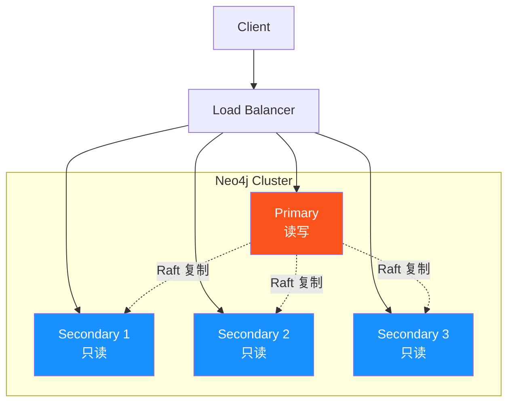

### 6.2 集群特性

| 特性             | 描述                                   |
| ---------------- | -------------------------------------- |
| **Raft 协议**    | 共识算法，保证数据一致性               |
| **自动故障转移** | Primary 故障时自动选举新 Primary       |
| **读写分离**     | 写入到 Primary，读取可分发到 Secondary |
| **在线扩容**     | 动态添加/移除集群成员                  |

### 6.3 备份与恢复

```bash
# 在线备份 (Enterprise)
neo4j-admin database backup --database=neo4j --to-path=/backup/

# 离线备份 (Community)
neo4j-admin database dump --database=neo4j --to-path=/backup/neo4j.dump

# 恢复数据库
neo4j-admin database restore --database=neo4j --from-path=/backup/
```

---

## 7. 向量搜索与 GenAI

### 7.1 向量索引概述

Neo4j 从 5.13 版本开始原生支持**向量索引**，用于高效的语义相似度搜索<sup>[[13]](#ref13)</sup><sup>[[14]](#ref14)</sup>：

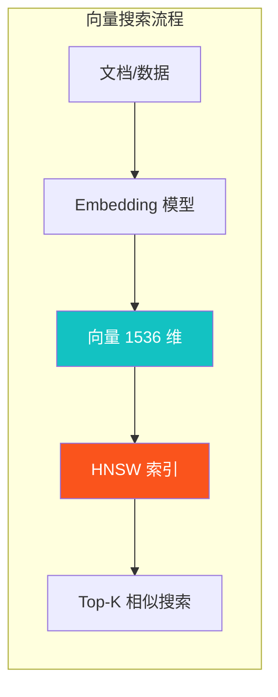

### 7.2 HNSW 算法

Neo4j 使用 **HNSW（Hierarchical Navigable Small World）** 算法实现近似最近邻搜索<sup>[[14]](#ref14)</sup>：

| 参数                          | 描述                  | 默认值 |
| ----------------------------- | --------------------- | ------ |
| `vector.dimensions`           | 向量维度（最大 4096） | -      |
| `vector.similarity_function`  | 相似度函数            | cosine |
| `vector.hnsw.m`               | 每层最大连接数        | 16     |
| `vector.hnsw.ef_construction` | 构建时搜索宽度        | 100    |

### 7.3 向量操作

```cypher
// 创建向量索引
CREATE VECTOR INDEX movie_plots FOR (m:Movie) ON (m.plotEmbedding)
OPTIONS {
  indexConfig: {
    `vector.dimensions`: 1536,
    `vector.similarity_function`: 'cosine'
  }
}

// 存储向量
MATCH (m:Movie {title: 'Matrix'})
SET m.plotEmbedding = $embedding  // 1536 维向量

// 向量相似度搜索
CALL db.index.vector.queryNodes('movie_plots', 10, $queryVector)
YIELD node, score
RETURN node.title, score
ORDER BY score DESC

// 混合查询：向量 + 图遍历
CALL db.index.vector.queryNodes('movie_plots', 10, $queryVector)
YIELD node AS movie, score
MATCH (movie)<-[:ACTED_IN]-(actor:Person)
RETURN movie.title, score, collect(actor.name) AS actors
```

### 7.4 GenAI 函数

Neo4j 提供内置的 GenAI 函数<sup>[[15]](#ref15)</sup>：

```cypher
// 生成嵌入向量
CALL genai.vector.encode('This is a sample text', 'OpenAI', {
  token: $apiKey,
  model: 'text-embedding-3-small'
}) YIELD vector
RETURN vector

// 批量生成嵌入
UNWIND $texts AS text
CALL genai.vector.encode(text, 'OpenAI', {token: $apiKey})
YIELD vector
RETURN text, vector
```

---

## 8. 图数据科学 (GDS)

### 8.1 GDS 库概述

**Neo4j Graph Data Science (GDS)** 是一个提供 50+ 图算法的库<sup>[[16]](#ref16)</sup>：

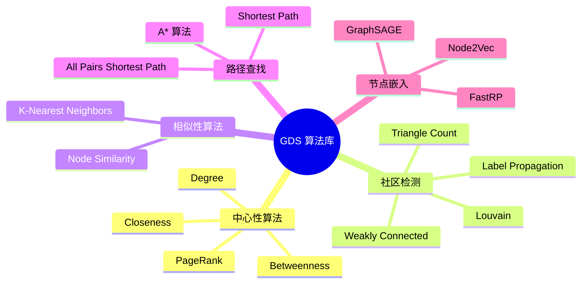

### 8.2 GDS 工作流

```cypher
// 1. 投影图到内存
CALL gds.graph.project('socialGraph', 'Person', 'KNOWS')

// 2. 运行 PageRank 算法
CALL gds.pageRank.stream('socialGraph')
YIELD nodeId, score
RETURN gds.util.asNode(nodeId).name AS name, score
ORDER BY score DESC
LIMIT 10

// 3. 清理投影
CALL gds.graph.drop('socialGraph')
```

### 8.3 常用算法示例

```cypher
// 社区检测 - Louvain
CALL gds.louvain.stream('socialGraph')
YIELD nodeId, communityId
RETURN gds.util.asNode(nodeId).name, communityId

// 节点相似性
CALL gds.nodeSimilarity.stream('productGraph')
YIELD node1, node2, similarity
RETURN gds.util.asNode(node1).name,
       gds.util.asNode(node2).name,
       similarity
ORDER BY similarity DESC

// 节点嵌入 - FastRP
CALL gds.fastRP.stream('socialGraph', {embeddingDimension: 128})
YIELD nodeId, embedding
MATCH (n) WHERE id(n) = nodeId
SET n.embedding = embedding
```

---

## 9. 生态集成

### 9.1 LangChain 集成

Neo4j 提供官方 LangChain 集成<sup>[[17]](#ref17)</sup>：

```python
from langchain_neo4j import Neo4jGraph, Neo4jVector
from langchain_openai import OpenAIEmbeddings

# 连接 Neo4j
graph = Neo4jGraph(
    url="bolt://localhost:7687",
    username="neo4j",
    password="password"
)

# 向量存储
embeddings = OpenAIEmbeddings()
vector_store = Neo4jVector.from_documents(
    documents,
    embeddings,
    url="bolt://localhost:7687",
    username="neo4j",
    password="password"
)

# 相似性搜索
results = vector_store.similarity_search("AI agents", k=5)

# GraphCypherQA Chain
from langchain_neo4j import GraphCypherQAChain
chain = GraphCypherQAChain.from_llm(llm, graph=graph)
response = chain.invoke({"query": "谁导演了 Matrix?"})
```

### 9.2 LlamaIndex 集成

Neo4j 与 LlamaIndex 的集成<sup>[[18]](#ref18)</sup>：

```python
from llama_index.graph_stores.neo4j import Neo4jPropertyGraphStore
from llama_index.core import PropertyGraphIndex

# 创建图存储
graph_store = Neo4jPropertyGraphStore(
    username="neo4j",
    password="password",
    url="bolt://localhost:7687"
)

# 创建索引
index = PropertyGraphIndex.from_documents(
    documents,
    property_graph_store=graph_store,
    embed_model=embed_model
)

# 查询
query_engine = index.as_query_engine()
response = query_engine.query("什么是知识图谱?")
```

### 9.3 GraphRAG Python

Neo4j 官方 GraphRAG 库<sup>[[19]](#ref19)</sup>：

```python
from neo4j_graphrag.retrievers import VectorRetriever
from neo4j_graphrag.generation import GraphRAG

# 创建检索器
retriever = VectorRetriever(
    driver=driver,
    index_name="document_embeddings",
    embedder=embedder
)

# 创建 GraphRAG 管道
rag = GraphRAG(retriever=retriever, llm=llm)
response = rag.search("AI agents 的核心组件是什么?")
```

### 9.4 驱动程序支持

| 语言           | 驱动              | 安装                                      |
| -------------- | ----------------- | ----------------------------------------- |
| **Python**     | neo4j (官方)      | `pip install neo4j`                       |
| **JavaScript** | neo4j-driver      | `npm install neo4j-driver`                |
| **Java**       | neo4j-java-driver | Maven/Gradle                              |
| **Go**         | neo4j-go-driver   | `go get github.com/neo4j/neo4j-go-driver` |
| **.NET**       | Neo4j.Driver      | NuGet                                     |

### 9.5 APOC 扩展库

**APOC (Awesome Procedures on Cypher)** 提供 450+ 扩展过程<sup>[[20]](#ref20)</sup>：

| 类别         | 功能                     |
| ------------ | ------------------------ |
| **导入导出** | JSON, CSV, GraphML, JDBC |
| **图重构**   | 节点合并、关系重构       |
| **数据转换** | 日期处理、字符串操作     |
| **触发器**   | 数据变更触发操作         |
| **元数据**   | Schema 检查、统计信息    |

```cypher
// 导入 JSON
CALL apoc.load.json('https://api.example.com/data')
YIELD value
CREATE (n:Data) SET n = value

// 批量创建关系
CALL apoc.periodic.iterate(
  'MATCH (a:Person), (b:Person) WHERE a.city = b.city RETURN a, b',
  'CREATE (a)-[:LIVES_NEAR]->(b)',
  {batchSize: 1000}
)
```

---

## 10. 可行性分析与评估

### 10.1 技术可行性

| 评估维度       | 评分  | 说明                          |
| -------------- | ----- | ----------------------------- |
| **图数据能力** | ★★★★★ | 原生图存储，关系遍历 O(1)     |
| **查询能力**   | ★★★★★ | Cypher 表达力强，易学习       |
| **向量搜索**   | ★★★★☆ | HNSW 索引，最高 4096 维       |
| **GenAI 集成** | ★★★★★ | LangChain/LlamaIndex 官方支持 |
| **图算法**     | ★★★★★ | GDS 50+ 算法，覆盖全面        |
| **生态成熟度** | ★★★★★ | 社区活跃，文档完善            |
| **运维复杂度** | ★★★★☆ | 单机简单，集群需专业运维      |

### 10.2 适用场景分析

| 场景          | 适合度      | 说明                     |
| ------------- | ----------- | ------------------------ |
| **知识图谱**  | ✅ 非常适合 | 原生图模型，关系表达自然 |
| **RAG 应用**  | ✅ 非常适合 | 向量 + 图结构结合        |
| **社交网络**  | ✅ 非常适合 | 关系遍历高效             |
| **推荐系统**  | ✅ 非常适合 | 协同过滤、图算法         |
| **欺诈检测**  | ✅ 非常适合 | 模式匹配、社区检测       |
| **OLAP 分析** | ⚠️ 一般     | 非主要设计目标           |
| **海量事务**  | ⚠️ 一般     | 需评估具体负载           |

### 10.3 与 OceanBase 对比

| 维度         | Neo4j             | OceanBase              |
| ------------ | ----------------- | ---------------------- |
| **数据模型** | 属性图            | 关系型 + 向量          |
| **查询语言** | Cypher            | SQL                    |
| **关系处理** | ✅ 原生图遍历     | JOIN 操作              |
| **向量搜索** | ✅ HNSW (4096 维) | ✅ HNSW/IVF (16000 维) |
| **事务能力** | ACID              | 金融级 ACID            |
| **分布式**   | 企业版集群        | 原生分布式             |
| **适用场景** | 图密集型          | TP/AP/Vector 三位一体  |

### 10.4 成本分析

| 部署模式               | 成本预估  | 适用场景           |
| ---------------------- | --------- | ------------------ |
| **Community Edition**  | 免费      | 开发测试、小型项目 |
| **Aura Free**          | 免费      | 学习、原型验证     |
| **Aura Professional**  | ~$65/月起 | 生产环境入门       |
| **Enterprise Edition** | 商业授权  | 大规模企业部署     |

---

## 11. 本项目集成方案

### 11.1 应用场景分析

本项目（Agentic AI Papers 研究项目）可利用 Neo4j 实现：

| 场景             | 使用能力  | 具体应用                         |
| ---------------- | --------- | -------------------------------- |
| **论文知识图谱** | 属性图    | 论文、作者、机构、概念的关系网络 |
| **引用网络分析** | GDS 算法  | PageRank 识别重要论文、社区检测  |
| **语义搜索**     | 向量索引  | 论文摘要/内容的语义检索          |
| **GraphRAG**     | 向量 + 图 | 基于知识图谱的智能问答           |

### 11.2 架构设计

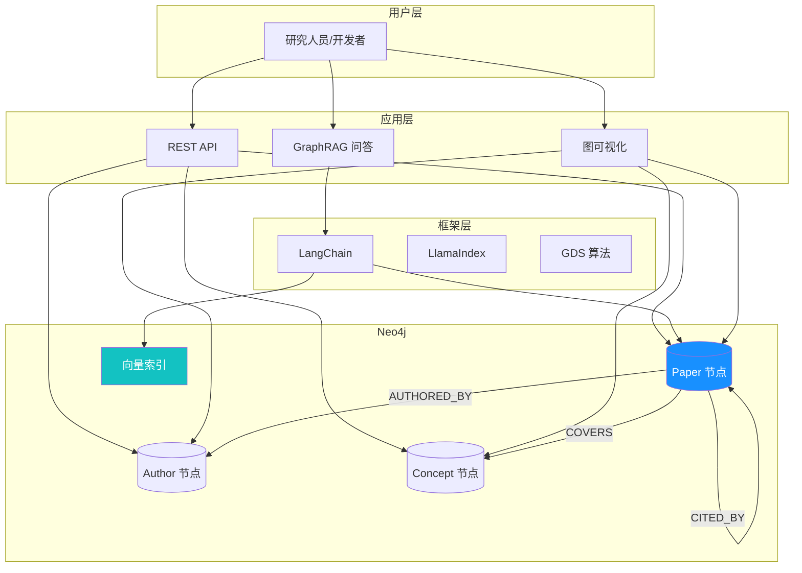

### 11.3 数据模型设计

```cypher
// 论文节点
(:Paper {
  id: STRING,
  title: STRING,
  abstract: TEXT,
  arxiv_id: STRING,
  published_date: DATE,
  embedding: LIST<FLOAT>  // 1536 维向量
})

// 作者节点
(:Author {
  id: STRING,
  name: STRING,
  affiliation: STRING
})

// 概念节点
(:Concept {
  id: STRING,
  name: STRING,
  description: STRING
})

// 关系
(:Paper)-[:AUTHORED_BY {order: INT}]->(:Author)
(:Paper)-[:CITED_BY]->(:Paper)
(:Paper)-[:COVERS {relevance: FLOAT}]->(:Concept)
(:Author)-[:AFFILIATED_WITH]->(:Institution)
```

### 11.4 与 OceanBase 互补方案

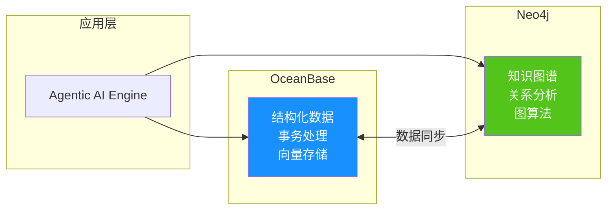

---

## 12. Demo 实施指引

### 12.1 环境准备

#### Docker 快速启动

```bash
# 拉取 Neo4j 镜像
docker pull neo4j:5.26.0

# 启动 Neo4j 容器
docker run -d \
  --name neo4j-demo \
  -p 7474:7474 \
  -p 7687:7687 \
  -e NEO4J_AUTH=neo4j/your_password \
  -e NEO4J_PLUGINS='["apoc", "graph-data-science"]' \
  -v $HOME/neo4j/data:/data \
  -v $HOME/neo4j/logs:/logs \
  neo4j:5.26.0

# 验证启动
curl http://localhost:7474
```

#### Python 环境

```bash
# 创建虚拟环境
python -m venv neo4j-env
source neo4j-env/bin/activate

# 安装依赖
pip install neo4j langchain-neo4j neo4j-graphrag openai
```

### 12.2 基础数据导入

```python
from neo4j import GraphDatabase

driver = GraphDatabase.driver(
    "bolt://localhost:7687",
    auth=("neo4j", "your_password")
)

def create_sample_data(tx):
    # 创建约束
    tx.run("CREATE CONSTRAINT paper_id IF NOT EXISTS FOR (p:Paper) REQUIRE p.id IS UNIQUE")
    tx.run("CREATE CONSTRAINT author_id IF NOT EXISTS FOR (a:Author) REQUIRE a.id IS UNIQUE")

    # 创建示例论文
    tx.run("""
        MERGE (p1:Paper {id: 'arxiv:2312.10997'})
        SET p1.title = 'Practices for Governing Agentic AI Systems',
            p1.abstract = 'Agentic AI systems are...',
            p1.published_date = date('2023-12-18')

        MERGE (p2:Paper {id: 'arxiv:2401.00001'})
        SET p2.title = 'Chain-of-Thought Prompting',
            p2.abstract = 'We explore...',
            p2.published_date = date('2024-01-01')

        MERGE (a1:Author {id: 'author-1'})
        SET a1.name = 'John Smith'

        MERGE (p1)-[:AUTHORED_BY]->(a1)
        MERGE (p1)-[:CITED_BY]->(p2)
    """)

with driver.session() as session:
    session.execute_write(create_sample_data)
```

### 12.3 向量索引与 RAG

```python
from langchain_neo4j import Neo4jVector
from langchain_openai import OpenAIEmbeddings
import os

os.environ["OPENAI_API_KEY"] = "your-api-key"

# 创建向量存储
embeddings = OpenAIEmbeddings(model="text-embedding-3-small")

vector_store = Neo4jVector.from_existing_graph(
    embeddings,
    url="bolt://localhost:7687",
    username="neo4j",
    password="your_password",
    node_label="Paper",
    text_node_properties=["title", "abstract"],
    embedding_node_property="embedding",
    index_name="paper_embeddings"
)

# 语义搜索
results = vector_store.similarity_search(
    "multi-agent collaboration in AI systems",
    k=5
)

for doc in results:
    print(f"- {doc.page_content[:100]}...")
```

### 12.4 GraphRAG 查询

```python
from neo4j_graphrag.retrievers import VectorCypherRetriever
from neo4j_graphrag.generation import GraphRAG
from neo4j_graphrag.llm import OpenAILLM

# 创建检索器（向量 + 图遍历）
retriever = VectorCypherRetriever(
    driver=driver,
    index_name="paper_embeddings",
    retrieval_query="""
        MATCH (paper:Paper)
        WHERE paper.id = node.id
        OPTIONAL MATCH (paper)-[:AUTHORED_BY]->(author:Author)
        OPTIONAL MATCH (paper)-[:CITED_BY]->(cited:Paper)
        RETURN paper.title AS title,
               paper.abstract AS content,
               collect(DISTINCT author.name) AS authors,
               count(cited) AS citation_count
    """,
    embedder=embeddings
)

# 创建 GraphRAG
llm = OpenAILLM(model_name="gpt-4o-mini")
rag = GraphRAG(retriever=retriever, llm=llm)

# 查询
response = rag.search("What are the key components of agentic AI systems?")
print(response.answer)
```

### 12.5 图算法分析

```cypher
// 投影引用网络
CALL gds.graph.project(
  'citation-network',
  'Paper',
  'CITED_BY'
)

// 计算 PageRank 识别重要论文
CALL gds.pageRank.stream('citation-network')
YIELD nodeId, score
WITH gds.util.asNode(nodeId) AS paper, score
RETURN paper.title, score
ORDER BY score DESC
LIMIT 10

// 社区检测
CALL gds.louvain.stream('citation-network')
YIELD nodeId, communityId
WITH gds.util.asNode(nodeId) AS paper, communityId
RETURN communityId, collect(paper.title) AS papers
ORDER BY size(papers) DESC
```

### 12.6 验证检查清单

| 检查项            | 验证方法                    |
| ----------------- | --------------------------- |
| ✅ Neo4j 服务启动 | 访问 http://localhost:7474  |
| ✅ 数据导入成功   | `MATCH (n) RETURN count(n)` |
| ✅ 向量索引创建   | `SHOW INDEXES`              |
| ✅ 语义搜索工作   | 执行相似性查询              |
| ✅ 图遍历正常     | 执行路径查询                |
| ✅ GDS 算法可用   | `CALL gds.list()`           |

---

## References

## References

<a id="ref1"></a>**[1]** Neo4j. (2025). _Introduction - Operations Manual_. [https://neo4j.com/docs/operations-manual/current/introduction/](https://neo4j.com/docs/operations-manual/current/introduction/)

<a id="ref2"></a>**[2]** Neo4j. _What is a graph database - Getting Started_. [https://neo4j.com/docs/getting-started/graph-database/](https://neo4j.com/docs/getting-started/graph-database/)

<a id="ref3"></a>**[3]** Neo4j. _Database internals and transactional behavior_. [https://neo4j.com/docs/operations-manual/current/database-internals/](https://neo4j.com/docs/operations-manual/current/database-internals/)

<a id="ref4"></a>**[4]** Neo4j. _Graph database concepts - Getting Started_. [https://neo4j.com/docs/getting-started/appendix/graphdb-concepts/](https://neo4j.com/docs/getting-started/appendix/graphdb-concepts/)

<a id="ref5"></a>**[5]** Neo4j. _Performance - Operations Manual_. [https://neo4j.com/docs/operations-manual/current/performance/](https://neo4j.com/docs/operations-manual/current/performance/)

<a id="ref6"></a>**[6]** Neo4j. _What is Cypher - Getting Started_. [https://neo4j.com/docs/getting-started/cypher/](https://neo4j.com/docs/getting-started/cypher/)

<a id="ref7"></a>**[7]** Neo4j. _Introduction - Cypher Manual_. [https://neo4j.com/docs/cypher-manual/current/introduction/](https://neo4j.com/docs/cypher-manual/current/introduction/)

<a id="ref8"></a>**[8]** Neo4j. _What is graph data modeling? - Getting Started_. [https://neo4j.com/docs/getting-started/data-modeling/](https://neo4j.com/docs/getting-started/data-modeling/)

<a id="ref9"></a>**[9]** Neo4j. _Indexes - Cypher Manual_. [https://neo4j.com/docs/cypher-manual/current/indexes/](https://neo4j.com/docs/cypher-manual/current/indexes/)

<a id="ref10"></a>**[10]** Neo4j. _Constraints - Cypher Manual_. [https://neo4j.com/docs/cypher-manual/current/constraints/](https://neo4j.com/docs/cypher-manual/current/constraints/)

<a id="ref11"></a>**[11]** Neo4j. _Authentication and authorization - Operations Manual_. [https://neo4j.com/docs/operations-manual/current/authentication-authorization/](https://neo4j.com/docs/operations-manual/current/authentication-authorization/)

<a id="ref12"></a>**[12]** Neo4j. _Clustering - Operations Manual_. [https://neo4j.com/docs/operations-manual/current/clustering/](https://neo4j.com/docs/operations-manual/current/clustering/)

<a id="ref13"></a>**[13]** Neo4j. _Vector indexes - Cypher Manual_. [https://neo4j.com/docs/cypher-manual/current/indexes/semantic-indexes/vector-indexes/](https://neo4j.com/docs/cypher-manual/current/indexes/semantic-indexes/vector-indexes/)

<a id="ref14"></a>**[14]** Neo4j. _Embeddings & Vector Indexes Tutorial_. [https://neo4j.com/docs/genai/tutorials/embeddings-vector-indexes/](https://neo4j.com/docs/genai/tutorials/embeddings-vector-indexes/)

<a id="ref15"></a>**[15]** Neo4j. _Neo4j GenAI Documentation_. [https://neo4j.com/docs/genai/](https://neo4j.com/docs/genai/)

<a id="ref16"></a>**[16]** Neo4j. _Introduction - Neo4j Graph Data Science_. [https://neo4j.com/docs/graph-data-science/current/introduction/](https://neo4j.com/docs/graph-data-science/current/introduction/)

<a id="ref17"></a>**[17]** Neo4j. _LangChain Neo4j Integration - Neo4j Labs_. [https://neo4j.com/labs/genai-ecosystem/langchain/](https://neo4j.com/labs/genai-ecosystem/langchain/)

<a id="ref18"></a>**[18]** Neo4j. _LlamaIndex - Neo4j Labs_. [https://neo4j.com/labs/genai-ecosystem/llamaindex/](https://neo4j.com/labs/genai-ecosystem/llamaindex/)

<a id="ref19"></a>**[19]** Neo4j. _GraphRAG for Python Documentation_. [https://neo4j.com/docs/neo4j-graphrag-python/current/](https://neo4j.com/docs/neo4j-graphrag-python/current/)

<a id="ref20"></a>**[20]** Neo4j. _APOC Core Documentation_. [https://neo4j.com/docs/apoc/current/](https://neo4j.com/docs/apoc/current/)

<a id="ref21"></a>**[21]** Neo4j. _Installation - Operations Manual_. [https://neo4j.com/docs/operations-manual/current/installation/](https://neo4j.com/docs/operations-manual/current/installation/)

<a id="ref22"></a>**[22]** Neo4j. _Neo4j Aura Documentation_. [https://neo4j.com/docs/aura/](https://neo4j.com/docs/aura/)

<a id="ref23"></a>**[23]** Neo4j. _Build applications with Neo4j and Python_. [https://neo4j.com/docs/python-manual/current/](https://neo4j.com/docs/python-manual/current/)

<a id="ref24"></a>**[24]** Neo4j. _Graph algorithms - Neo4j Graph Data Science_. [https://neo4j.com/docs/graph-data-science/current/algorithms/](https://neo4j.com/docs/graph-data-science/current/algorithms/)

<a id="ref25"></a>**[25]** Neo4j. _Backup and restore - Operations Manual_. [https://neo4j.com/docs/operations-manual/current/backup-restore/](https://neo4j.com/docs/operations-manual/current/backup-restore/)
