> [!IMPORTANT]
>
> 在前置调研中，我们已经对主流 **ANN 向量索引算法**（HNSW / IVF / PQ / DiskANN 等）建立了比较完整的认识，并对市场上主流向量数据库做过一次“从全景到分层”的宏观梳理。接下来需要回答的问题，会从“向量检索为什么能跑、怎么跑得快”，收束到“在我的真实业务里，选哪一个能长期跑得稳、迭代成本最低”。
>
> 因此，本文会把调研范围进一步聚焦到 6 个最具代表性的候选：**Milvus、Weaviate、Pinecone、PGVector、VectorChord、Google Cloud Spanner**，并从架构形态、能力边界、工程落地和 TCO 控制四个维度做更深入的对比。
>
> | 类型                            | 产品        | 核心特点                             |
> | ------------------------------- | ----------- | ------------------------------------ |
> | **PostgreSQL Extension**        | PGVector    | 官方扩展，与现有 PostgreSQL 完美集成 |
> |                                 | VectorChord | 高性能扩展，突破 PGVector 性能瓶颈   |
> | **Specialized Vector DataBase** | Milvus      | 开源分布式，支持百亿级向量           |
> |                                 | Weaviate    | AI-Native，内置向量化模块            |
> |                                 | Pinecone    | 全托管 SaaS，零运维                  |
> | **Multi-Model Cloud Database**  | Spanner     | 全球分布式 + ACID + 向量 + Graph     |

---

## 1. PostgreSQL + PGVector

### 1.1 产品概述

**核心定位**：**PostgreSQL 用户的首选“零迁移”方案，用架构的统一性换取绝大多数业务场景下的“够用”性能。**

作为“改良派”向量数据库的标杆，PGVector 走了一条与其他竞品截然不同的**原生融合**路线。如果将独立向量数据库（如 Milvus）比作**专为赛道打造的 F1 赛车**，那么 PGVector 就像是**为你现有的家用 SUV 加装了一套高性能导航系统**。

- **F1 赛车（独立库）**：为了极致的检索速度和规模而生，但你需要付出昂贵的“赛道维护费”（独立的运维成本与基础设施）。
- **SUV 升级（PGVector）**：它依然是你那辆皮实耐用、通过性极好的座驾（ACID 事务、复杂查询，以及 PostgreSQL 的所有企业级特性）。你不需要换车（数据迁移），只需一次简单的改装，它就能带你驶向“语义检索”的新领域。

```mermaid
graph LR
    subgraph "PGVector：传统数据库的 AI 进化"
        direction LR
        A[PostgreSQL] --> B[结构化数据<br/>（ACID）]
        A --> C[+ PGVector 扩展]
        C --> D[向量检索能力<br/>（HNSW、IVFFlat）]
        B & D --> E[统一 SQL 查询]

        style A fill:#336791,color:#fff
        style C fill:#e67e22,color:#fff
        style E fill:#27ae60,color:#fff
    end
```

### 1.2 核心特性

| 特性          | 描述             | 技术规格                                      |
| ------------- | ---------------- | --------------------------------------------- |
| **向量类型**  | 支持多种向量格式 | vector (FP32)、halfvec (FP16)、bit、sparsevec |
| **最大维度**  | 单精度向量       | 2,000 维（HNSW）/ 16,000 维（存储）           |
| **距离函数**  | 6 种度量方式     | L2、内积、余弦、L1、汉明、Jaccard             |
| **索引类型**  | 近似最近邻       | HNSW、IVFFlat                                 |
| **ACID 支持** | 完整事务保证     | ✅ 支持                                       |

### 1.3 向量数据类型

选择向量精度就像选择**图片格式**：

- **vector (FP32)**：**RAW 格式**。精度无损，细节最全，但体积最大。
- **halfvec (FP16)**：**高清 JPEG**。**推荐首选**。肉眼（模型）难以分辨差异，但空间节省一半，速度更快。
- **bit**：**黑白位图**。极致压缩，仅适用于特定二值化场景。
- **sparsevec**：**稀疏向量**。仅存储非零元素，适用于稀疏向量场景。

```sql
CREATE TABLE items (
    id bigserial PRIMARY KEY,
    -- 推荐：大多数 AI 场景使用 halfvec 平衡性能与成本
    embedding halfvec(1536)
);

-- 插入操作（PGVector 会自动处理类型转换）
INSERT INTO items (embedding) VALUES ('[1.1, 2.2, 3.3, ...]');
```

### 1.4 距离度量

计算相似度，取决于你手里拿的是哪把**尺子**：

- **Cosine (<=>)**：**指南针**。只看**方向**是否一致，不看长短。**语义搜索（NLP）的标准尺子**。
- **L2 (<->)**：**直尺**。测量两点间的绝对距离。常用于图像或音频的物理特征匹配。
- **Inner Product (<#>)**：**投影仪**。计算向量的投影强度。在向量归一化后，它是最高效的替代方案。

| 操作符 | 距离类型     | 核心场景       | 备注             |
| :----- | :----------- | :------------- | :--------------- |
| `<=>`  | 余弦距离     | 语义相似度     | 推荐用于文本嵌入 |
| `<->`  | L2 欧氏距离  | 图片/音频搜索  | 物理特征         |
| `<#>`  | 负内积       | 高性能推荐系统 | 需归一化         |
| `<+>`  | L1 距离      | 曼哈顿距离     | 特定场景         |
| `<~>`  | 汉明距离     | 二进制向量     | bit 类型专用     |
| `<%>`  | Jaccard 距离 | 二进制向量     | bit 类型专用     |

### 1.5 索引算法

> [!TIP]
>
> 索引是面对海量数据的**导航策略**：
>
> - **HNSW（Hierarchical Navigable Small World，分层导航小世界图）**：**立体交通网**（Graph）。利用高速公路和立体枢纽实现跨越式寻找。**性能最强（首选）**，但像修路一样成本高（构建慢）、占地大（吃内存）。
> - **IVFFlat（Inverted File with Flat Clustering，倒排文件与平面聚类）**：**行政区划图**（Cluster）。把城市划分为若干个方格（聚类列表），只去目标所在的方格里找。**简单省地（不仅省内存，还能快速构建）**，但前提是必须先有人（数据）才能划分区域。
>
> 💡 算法底层原理及技术细节请参阅 [003-vector-search-algorithm](./003-vector-search-algorithm.md)。

#### 1.5.1 HNSW 索引

HNSW 是目前综合性能最好的索引算法，实现了**速度与召回率的最佳平衡**。

```sql
-- 创建 HNSW 索引
-- m: 每层最大连接数（默认 16，建议 16-64），"路口"的分岔数。分岔越多搜索越快，但路也越宽（内存占用↑）。
-- ef_construction: 构建时搜索宽度（默认 64，建议 100-200）。建路时的探索范围。范围越大路网质量越好，但修路越慢。
CREATE INDEX ON items USING hnsw (embedding vector_cosine_ops)
WITH (m = 16, ef_construction = 64);

-- ef_search: 查询时搜索宽度（默认 40，建议 100-200）。
SET hnsw.ef_search = 100;
```

#### 1.5.2 IVFFlat 索引

IVFFlat 是一种基于聚类的倒排索引，构建速度快，内存占用低，适合**内存受限**的场景，但查询性能稍逊于 HNSW。

```sql
-- 创建 IVFFlat 索引
-- ⚠️ 必须表中已有数据（建议 >10万行）才能计算聚类中心
-- lists: 把数据划分成多少个“格子”。rows < 1M: lists = rows / 1000；rows >= 1M: lists = sqrt(rows)。
CREATE INDEX ON items USING ivfflat (embedding vector_l2_ops)
WITH (lists = 100);

-- probes: 探针数，每次查询要翻找最近的几个“格子”（查询时 SET ivfflat.probes）。
SET ivfflat.probes = 10;  -- 建议 sqrt(lists)
```

### 1.6 过滤与混合查询策略

现实查询往往带有条件（`WHERE`）。这就像在找人（相似度）的同时，要求他必须穿红衣服（过滤）：

- **先筛选（列索引）**：**按名单点名**。如果穿红衣服的人极少，直接把他们叫出来逐个比对长相最快。
- **先检索（向量索引）**：**广场扫视**。如果穿红衣服的人满大街都是，直接在广场上找长得像的人，大概率他正好穿红衣服。
- **专用分区（部分索引/分区）**：**VIP 包间**。如果经常只在“红衣俱乐部”里找人，干脆把他们单独关在一个房间搜，互不干扰，效率最高。

#### 1.6.1 策略选择指南

```sql
-- 混合查询：既要“长得像”，又要“满足条件”
SELECT * FROM items WHERE category_id = 123 ORDER BY embedding <-> '[3,1,2]' LIMIT 5;
```

| 策略              | 适用场景                             | 对应逻辑           | 建议                                                                                                                                              |
| :---------------- | :----------------------------------- | :----------------- | :------------------------------------------------------------------------------------------------------------------------------------------------ |
| **列索引优先**    | **强过滤**（符合条件的数据**很少**） | 精确找 -> 算距离   | 建立普通 B-Tree 索引。<br/>`CREATE INDEX ON items (category_id)`                                                                                  |
| **向量索引优先**  | **弱过滤**（符合条件的数据**很多**） | 近似搜 -> 剔除不符 | 适当增大 `ef_search` 防止搜不到                                                                                                                   |
| **部分/分区索引** | **固定高频**（特定业务域）           | 在子集中搜 HNSW    | 性能最佳，适合多租户/类别固定的场景。<br/>`CREATE INDEX ON items USING hnsw (...) WHERE (category_id = 123)`<br/>`PARTITION BY LIST(category_id)` |

#### 1.6.2 迭代索引扫描 (v0.8.0+)

这是为了解决“先检索后过滤”可能导致结果不足的问题。就像 **HR 招聘**：

- **普通模式**：你要求“招 5 个懂 Rust 的专家（Filter）”。猎头按技术排名找来前 5 名大牛（Vector），结果发现只有 1 个人懂 Rust。于是只给你 1 份简历，任务结束。
- **迭代扫描**：猎头发现前 5 名里只有 1 个符合，于是自动继续往下翻第 6-10 名、第 11-20 名... 直到凑齐 5 个懂 Rust 的专家给你。

```sql
-- 宽松顺序（Relaxed Order）：为了凑齐人数，允许稍微牺牲一点排序的严格性（性能更好）
SET hnsw.iterative_scan = relaxed_order;

-- 严格顺序（Strict Order）：必须严格按距离排序，哪怕要扫描更多数据
SET hnsw.iterative_scan = strict_order;
-- SET ivfflat.iterative_scan = relaxed_order;  -- IVFFlat 索引的迭代扫描模式

-- 使用物化 CTE 在宽松顺序下获取高频查询的严格排序
WITH relaxed_results AS MATERIALIZED (
    SELECT id, embedding <-> '[1,2,3]' AS distance
    FROM items WHERE category_id = 123
    ORDER BY distance LIMIT 5
) SELECT * FROM relaxed_results ORDER BY distance + 0;  -- +0 for PG17+
```

**迭代扫描参数**：

| 参数                   | 描述                   | 默认值 |
| ---------------------- | ---------------------- | ------ |
| `hnsw.max_scan_tuples` | HNSW 最大扫描元组数    | 20000  |
| `ivfflat.max_probes`   | IVFFlat 最大探测列表数 | 全部   |

#### 1.6.3 混合搜索（向量 + 全文）

这是 "Just use PostgreSQL" 的重要原因，比如 **刑侦破案**：

- **向量搜索**：拿着**嫌疑人素描**找长得像的人（模糊语义）。
- **全文搜索**：查**车牌号**包含 "888" 的记录（精确关键词）。
- **混合威力**：在同一个 SQL 里，既查“长得像素描”又查“车牌对得上”的人，无需拼接两个系统的结果。

```sql
-- 混合搜查令：结合“车牌号”与“素描画”
SELECT id, content,
    -- 综合嫌疑指数 = 车牌匹配度(30%) + 长相相似度(70%)
    ts_rank(to_tsvector('english', content), query) * 0.3  -- [车牌] 关键词匹配得分
    + (1 - (embedding <=> '[...]')) * 0.7                  -- [素描] 向量相似度得分
    AS final_score
FROM items, plainto_tsquery('english', 'machine learning') query
WHERE to_tsvector('english', content) @@ query  -- [初筛] 必须包含关键线索
ORDER BY final_score DESC
LIMIT 10;
```

### 1.7 性能调优

要想数据库跑得快，除了引擎好，还得会**保养和驾驶**：

- **数据导入**：像**搬家**。先把东西全搬进屋（COPY），最后再慢慢整理归位（建索引）。边搬边整最慢。
- **索引构建**：给工人准备**大工作台**（Memory）与**多帮手**（Workers），干活才能快。
- **查询精度**：像**寻宝**。搜得越细（ef_search 大），结果越准，但耗时越长。

| 关键动作     | 形象比喻         | 优化策略                                   | 核心配置                                     |
| :----------- | :--------------- | :----------------------------------------- | :------------------------------------------- |
| **批量导入** | **先搬家后整理** | 使用 `COPY` 协议，**先插入数据，后建索引** | `COPY items FROM STDIN WITH (FORMAT BINARY)` |
| **索引构建** | **加大工作台**   | 临时调大维护内存，避免频繁读写磁盘         | `SET maintenance_work_mem = '8GB'`           |
| **并行构建** | **多请几个工人** | 增加并行进程数，充分利用多核 CPU           | `SET max_parallel_maintenance_workers = 7`   |
| **查询优化** | **搜得更仔细**   | 增大搜索广度，用时间换召回率               | `SET hnsw.ef_search = 100`                   |
| **极致性能** | **抄近道**       | 归一化向量改用内积（投影）计算             | 替换 `<=>` 为 `<#>`                          |

```sql
-- 查看索引使用情况
EXPLAIN (ANALYZE, BUFFERS)
SELECT * FROM source_embeddings
ORDER BY embedding <=> '[0.1, 0.2, ...]'::vector
LIMIT 10;

-- 调整 HNSW 搜索参数
SET hnsw.ef_search = 100;  -- 提升召回率

-- 批量数据导入后重建索引
REINDEX INDEX CONCURRENTLY idx_source_embedding_hnsw;

-- 清理碎片
VACUUM ANALYZE source_embeddings;
```

---

## 2. VectorChord

### 2.1 产品概述

**核心定位**：**即便死守 PostgreSQL 生态，也不想在性能上向独立向量数据库（如 Milvus）低头的“极客方案”。**

如果说 PGVector 是 PostgreSQL 的“官方标配”，那么 VectorChord 就是追求极限性能的**第三方改装套件**。

还是那辆熟悉的 **PostgreSQL (SUV)**，但 VectorChord 为它换上了 **Rust 打造的涡轮增压引擎**：

- **原厂车 (PGVector)**：主打稳健兼容，适合绝大多数通用途径。
- **改装车 (VectorChord)**：主打**暴力性能**。不换车也能体验“推背感”——查询快 5 倍，写入快 16 倍，且能承载超大规格货物（60K 维）。

> ⚠️ **注意**：VectorChord 是由 TensorChord 开发的原 pgvecto.rs 的下一代重构版本，新项目请直接使用 VectorChord<sup>[[5]](#ref5)</sup>。

```mermaid
graph LR
    subgraph "VectorChord：Rust 驱动的性能怪兽"
        direction LR
        A[PostgreSQL]:::pg --> B("VectorChord 扩展<br/>(RaBitQ 量化算法)"):::vc
        B --> C[5x 查询速度]:::feat
        B --> D[16x 写入吞吐]:::feat
        B --> E[60K 维超宽向量]:::feat
    end

    classDef pg fill:#336791,color:#fff
    classDef vc fill:#e67e22,color:#fff
    classDef feat fill:#87d068,color:#fff
```

### 2.2 核心特性对比 PGVector

| 特性         | PGVector (原厂) | VectorChord (改装) | 提升幅度 |
| :----------- | :-------------- | :----------------- | :------- |
| **查询性能** | 基准            | **5x 更快**        | 🚀 5x    |
| **写入吞吐** | 基准            | **16x 更高**       | 🚀 16x   |
| **索引构建** | 基准            | **16x 更快**       | 🚀 16x   |
| **最大维度** | 2,000 (HNSW)    | **60,000**         | 📏 30x   |
| **存储成本** | $6/400K         | **$1/400K**        | 💰 省 6x |

### 2.3 RaBitQ 量化算法

**RaBitQ（Randomized Bit Quantization）**<sup>[[7]](#ref7)</sup> 就像是给每个向量拍了一张**超微缩略图**。在搜索时，先快速比对缩略图（二进制量化，体积仅为原始数据的 1/32）剔除绝大多数无关数据，再对剩下的候选者进行精细比对。这让它能在极低的内存占用下实现极速检索。

```sql
-- 标准创建（推荐）
CREATE INDEX ON items USING vchordrq (embedding vector_l2_ops);

-- 极客模式：通过 TOML 风格配置微调参数
CREATE INDEX ON items USING vchordrq (embedding vector_cosine_ops)
WITH (options = $$
    residual_quantization = true  -- [照片增强] 不仅存缩略图，还保留了和原图的差异细节，越看越清
    [build.internal]
    lists = [2000]                -- [城市规划] 强制划分为 2000 个行政区（若不填则 AI 自动规划）
    spherical_centroids = true    -- [球面投影] 适合 Cosine 距离，像在地球仪表面划分区域而不是平面地图
    build_threads = 8             -- [施工队] 8 个工人同时干活
$$);
```

### 2.4 索引调优

参数调优的核心是 **“分区管理”**，就像**城市规划**：

- **lists (分区数)**：城市越大，**行政区（Lists）** 就要划得越细，防止单区人口爆炸，检索变慢。
- **probes (探针数)**：找人时，需要排查多少个**相邻行政区**。排查越多越准，但越慢。

| 数据规模                | lists (规划建议) | probes (搜寻建议) |
| :---------------------- | :--------------- | :---------------- |
| **< 1M (小镇)**         | `[]` (自动)      | 默认              |
| **1M - 10M (城市)**     | `[2000]`         | 10                |
| **10M - 100M (大都会)** | `[10000]`        | 30                |
| **> 100M (巨型城市)**   | `[80000]`        | 100               |

```sql
-- 查询时调整搜索范围（即搜寻多少个相邻行政区）
SET vchordrq.probes TO '10';
SELECT * FROM items ORDER BY embedding <-> '[3,1,2]' LIMIT 10;
```

### 2.5 与 PGVector 兼容性

VectorChord 就像是能插进**标准插座（PGVector 接口）**的**超级充电器**。它沿用了 PGVector 的数据类型（插头形状一样）<sup>[[8]](#ref8)</sup>，你不需要修改表结构或业务代码，只需换个“内部引擎”（索引类型），就能瞬间获得性能提升。

```sql
-- 依赖 vchord
CREATE EXTENSION IF NOT EXISTS vchord CASCADE;
-- 1. 数据表还是原来的配方（使用 vector 类型）
CREATE TABLE items (embedding vector(1536));

-- 2. 只需要在创建索引时，悄悄将“引擎”名从 hnsw 改为 vchordrq
-- CREATE INDEX ON items USING hnsw ...  <-- 旧引擎
CREATE INDEX ON items USING vchordrq ...  -- <-- 新引擎
```

### 2.6 vchordg 图索引 (v0.5.0+)

相比 `vchordrq` 是全内存索引，飞快但贵；`vchordg` 则是基于磁盘的**离线地图包**（DiskANN 技术）：它允许你把庞大的向量数据存在便宜的 SSD 硬盘上，只把最关键的“路标”加载到内存。**适合数据量大到内存装不下的场景。**

```sql
/**
 * 离线地图模式 (Disk-Based Index)
 * 适合场景：内存有限，但有一块极速 SSD
 */
CREATE INDEX ON items USING vchordg (embedding vector_cosine_ops)
WITH (options = $$
    bits = 2                -- [地图缩放] 2x 缩放。值越小越省地，但地图越模糊（易指错路）；1 = 极省空间，2 = 兼顾准确；RaBitQ 量化比率，默认 2
    m = 32                  -- [交通枢纽] 规定每个路口最多连接 32 条路。路越多越精准，但路网越复杂；每顶点最大邻居数，默认 32
    ef_construction = 64    -- [勘测范围] 造地图时，先探索周边 64 个路标来确定最佳路线。探索越广，地图质量越高；构建时的搜索范围，默认 64
    alpha = [1.0, 1.2]      -- [绕路容忍度] 允许在建图时稍微绕点路（1.0-1.2倍），以发现潜在的捷径，防止陷入局部死胡同；剪枝时的 alpha 值，默认 [1.0, 1.2]
$$);
```

### 2.7 预过滤 Prefilter (v0.4.0+)

VectorChord 的 `vchordrq.prefilter` 参数允许向量索引利用过滤条件进行剪枝<sup>[[24]](#ref24)</sup>：

```sql
-- 启用预过滤
SET vchordrq.prefilter = on;

-- 适用于严格且低成本的过滤条件
-- 1% 选择率时可获得 200% QPS 提升
-- 10% 选择率时可获得 5% QPS 提升
```

> [!WARNING]
>
> **注意**：预过滤仅推荐用于**严格**（过滤大量行）且**低成本**（计算开销远低于向量距离计算）的过滤条件。

---

## 3. Milvus

### 3.1 产品概述

**核心定位**：**用（较高的）运维复杂度，换取（极高的）水平扩展能力。是“大厂”构建核心 AI 基础设施的首选。**

告别“插件化”的轻量级方案，我们进入**云原生分布式**的重工业领域。Milvus 是 LF AI & Data Foundation 基金会的毕业项目，专为 **十亿级（Billion-scale）** 向量检索而生。

Milvus 的部署模式就像**从“乐高积木”到“摩天大楼”**的进化：

- **Milvus Lite**：**乐高小人**。嵌入 Python 进程，零依赖，写 Demo 最快。
- **Standalone**：**单层平房**。一个 Docker 容器搞定，适合测试或中小规模。
- **Distributed**：**摩天大楼群**。基于 Kubernetes 的微服务架构，存算分离，专治各种“数据量大到存不下”的疑难杂症。

```mermaid
graph LR
    subgraph "Milvus：从玩具到摩天楼"
        direction LR
        L["Lite<br/>(嵌入式)"]:::lego
        S["Standalone<br/>(Docker)"]:::house
        D["Distributed<br/>(K8s)"]:::city
        Z["Zilliz Cloud<br/>(托管)"]:::cloud

        L --> |开发| S
        S --> |生产| D
        D -.-> |托管| Z
    end

    classDef lego fill:#b7eb8f,stroke:none,color:#000
    classDef house fill:#40a9ff,color:#fff,stroke:none
    classDef city fill:#003a8c,color:#fff,stroke:none
    classDef cloud fill:#722ed1,color:#fff,stroke:none
```

### 3.2 核心架构

Milvus 的运作机制就像一个繁忙的**国际机场**：

- **访问层 (Proxy)**：**值机大厅**。负责接待旅客（请求），本来不干重活，只管把人引导到正确的登机口。
- **协调层 (Coordinators)**：**塔台**。不亲自开飞机，但指挥所有飞机的起降顺序，确保航线不冲突（事务一致性）。
- **工作节点 (Worker Nodes)**：**地勤人员**。最苦最累的一线。有的搬行李（DataNode），有的修飞机（IndexNode），有的负责安检扫描（QueryNode）。
- **存储层 (etcd + MinIO + MQ)**：**停机坪与仓库**。真正的物资集散地。etcd 存航班表，MinIO 存行李，Kafka 是行李传送带。

```mermaid
graph TB
    subgraph "Milvus: 国际机场架构"
        direction TB
        subgraph "访问层(值机大厅)"
            Proxy[Proxy<br/>负载均衡与请求路由]:::proxy
        end

        subgraph "协调层(塔台)"
            RC[Root Coord<br/>DDL/DCL 管理]:::coord
            QC[Query Coord<br/>查询调度]:::coord
            DC[Data Coord<br/>数据调度]:::coord
            IC[Index Coord<br/>索引调度]:::coord
        end

        subgraph "工作节点层(地勤)"
            QN[Query Node<br/>向量搜索]:::work
            DN[Data Node<br/>数据持久化]:::work
            IN[Index Node<br/>索引构建]:::work
        end

        subgraph "存储层(仓库)"
            ETCD[(etcd<br/>元数据)]:::store
            MINIO[(MinIO/S3<br/>对象存储)]
            MQ[Kafka/Pulsar<br/>消息队列]:::store
        end

        Proxy --> RC & QC & DC & IC
        QC --> QN
        DC --> DN
        IC --> IN
        QN & DN & IN --> MINIO
        RC --> ETCD
        DN --> MQ
    end

    classDef proxy fill:#00A1EA,color:#fff,stroke:none
    classDef coord fill:#722ed1,color:#fff,stroke:none
    classDef work fill:#faad14,color:#fff,stroke:none
    classDef store fill:#52c41a,color:#fff,stroke:none

    style MINIO fill:#ff5722,color:#fff
```

**组件分工表**：

| 层级       | 组件              | 机场角色     | 核心职责                                                            | 扩展性                                   |
| :--------- | :---------------- | :----------- | :------------------------------------------------------------------ | :--------------------------------------- |
| **访问层** | Proxy             | **值机大厅** | 门面担当，聚合结果<br/>无状态代理，处理客户端请求与结果聚合         | 无状态，随便加机器                       |
| **协调层** | Coordinators      | **塔台**     | 发号施令，脑部中枢<br/>集群拓扑管理、任务调度、一致性控制           | 压力较小，通常不需要扩展                 |
| **工作层** | Worker Nodes      | **地勤**     | **算力黑洞**。搜索、建索引全靠它<br/>向量搜索、数据持久化、索引构建 | **弹性伸缩的核心**（忙时加人，闲时裁员） |
| **存储层** | etcd + MinIO + MQ | **仓库**     | 数据底座，持久化存储<br/>元数据、向量/索引存储、WAL 日志            | 依赖 S3/MinIO 的无限容量                 |

### 3.3 索引算法体系

拥有了能够无限扩展的**存储架构**后，Milvus 进一步提供了覆盖全场景的**索引分级体系**，让你在“速度、成本、精度”的不可能三角中自由裁决。

Milvus 的索引体系就像一个**多级物流网络**：

- **HNSW (内存索引)**：**前置仓（极速达）**。货物就在市中心（内存），下单即送达（延迟最低），但租金寸土寸金，适合热点数据。
- **IVF_PQ (压缩索引)**：**集约化货架（高密度）**。通过真空压缩（量化）技术，在同样的仓库里塞进 10 倍的货物，虽然取货多一道工序，但性价比极高。
- **DiskANN (磁盘索引)**：**郊区中心仓（海量）**。建在地皮便宜的郊区（SSD），通过高速公路（NVMe）临时调货，成本仅为前置仓的 1/10，适合百亿级数据兜底。
- **GPU Index (GPU 索引)**：**自动化流水线（高吞吐）**。遇到“双 11”海量订单（高 QPS），直接上机器臂集群（GPU），处理效率是人工的几十倍。

为了支撑上述多级物流体系，同时处理复杂的元数据过滤（如查找特定类别的商品），Milvus 构建了业界最全的**索引分类树**：

```mermaid
mindmap
  root((Milvus 索引全景))
    向量索引
      图索引(HNSW 前置仓)
        HNSW
        [HNSW_SQ|PQ|PRQ]
      IVF 系列(IVF 集约货架)
        [IVF_FLAT|SQ8|PQ|RABITQ]
      磁盘索引(DiskANN 中心仓)
      GPU 索引(GPU 自动化)
        [GPU_CAGRA|IVF_FLAT|IVF_PQ|BRUTE_FORCE]
    标量索引
      倒排索引：物品清单-查名称
      Bitmap 索引：状态看板-查库存
      Trie 索引：货号前缀-查批次
```

| 索引类型      | 物流角色     | 算法            | 适用场景                                       | 资源消耗    |
| ------------- | ------------ | --------------- | ---------------------------------------------- | ----------- |
| **HNSW**      | **前置仓**   | 多层图搜索      | **唯快不破**。低延迟高召回                     | 🧠 内存极高 |
| **IVF_FLAT**  | **集约货架** | 聚类 + 精确搜索 | 高召回场景                                     | 🧠 内存中   |
| **IVF_SQ8**   | **集约货架** | 聚类 + 标量量化 | **空间魔法**。通过量化压缩数据，平衡性能与召回 | 🧠 内存低   |
| **IVF_PQ**    | **集约货架** | 聚类 + 积量化   | **空间魔法**。通过量化压缩数据，大规模低内存   | 🧠 内存极低 |
| **DiskANN**   | **中心仓**   | 磁盘图索引      | **成本杀手**。使用 SSD 存储超大规模数据        | 💾 依赖 SSD |
| **GPU Index** | **自动化**   | GPU 优化图      | **暴力吞吐**。GPU 加速，适合超高并发场景       | 🎮 显存     |

### 3.4 向量检索实践

#### 3.4.1 pymilvus 开发模式

Milvus 的 `pymilvus` SDK 就是**智能仓储系统的“手持终端”**，简单几行指令就能调度底层的庞大算力。

```python
from pymilvus import MilvusClient

# 使用 Milvus Lite 进行本地开发
client = MilvusClient("./milvus_demo.db")

# 创建 Collection
client.create_collection(
    collection_name="papers",
    dimension=1536,
    metric_type="COSINE"
)

# 插入数据
client.insert(
    collection_name="papers",
    data=[
        {"id": 1, "vector": embedding, "title": "ReAct Paper", "abstract": "..."},
        # ...
    ]
)

# 创建索引
client.create_index(
    collection_name="papers",
    field_name="vector",
    index_type="HNSW",
    metric_type="COSINE",
    params={"M": 16, "efConstruction": 128}
)

# 搜索
results = client.search(
    collection_name="papers",
    data=[query_embedding],
    limit=10,
    output_fields=["title", "abstract"]
)
```

**全能检索矩阵**：

| 能力           | 描述          | 价值                                                        |
| :------------- | :------------ | :---------------------------------------------------------- |
| **ANN 搜索**   | 近似最近邻    | **核心能力**。亿级数据毫秒响应。                            |
| **元数据过滤** | 标量条件过滤  | **精准定位**。支持复杂的 boolean 表达式。                   |
| **混合搜索**   | 多路召回融合  | **全能视角**。同时利用向量、BM25 关键词、图片等多模态信息。 |
| **范围搜索**   | Radius Search | **画圈圈地**。只找特定相似度范围内的结果。                  |
| **重排序**     | Rerank        | **精修整备**。引入高精度模型对粗排结果进行二次精选。        |

#### 3.4.2 Collection 设计

```python
from pymilvus import MilvusClient, DataType, FieldSchema, CollectionSchema

# 使用 Milvus Lite（本地开发）或连接远程服务
client = MilvusClient("./agentic_ai.db")  # Lite 模式

# 定义 Schema
fields = [
    FieldSchema(name="id", dtype=DataType.INT64, is_primary=True, auto_id=True),
    FieldSchema(name="source_id", dtype=DataType.INT64),
    FieldSchema(name="source_type", dtype=DataType.VARCHAR, max_length=50),
    FieldSchema(name="title", dtype=DataType.VARCHAR, max_length=500),
    FieldSchema(name="chunk_text", dtype=DataType.VARCHAR, max_length=65535),
    FieldSchema(name="embedding", dtype=DataType.FLOAT_VECTOR, dim=1536),
]

# 创建 Collection
client.create_collection(
    collection_name="source_embeddings",
    schema=CollectionSchema(fields, description="学术资源向量嵌入"),
    index_params={
        "index_type": "HNSW",
        "metric_type": "COSINE",
        "params": {"M": 16, "efConstruction": 128}
    }
```

#### 3.4.3 向量检索与混合搜索

```python
from pymilvus import MilvusClient
from openai import OpenAI

client = MilvusClient("./agentic_ai.db")
openai_client = OpenAI()

def get_embedding(text: str) -> list:
    """生成文本嵌入向量"""
    response = openai_client.embeddings.create(
        model="text-embedding-3-small",
        input=text
    )
    return response.data[0].embedding

def semantic_search(query: str, source_type: str = None, top_k: int = 10):
    """语义相似度搜索"""
    query_embedding = get_embedding(query)

    # 构建过滤条件
    filter_expr = f'source_type == "{source_type}"' if source_type else ""

    results = client.search(
        collection_name="source_embeddings",
        data=[query_embedding],
        limit=top_k,
        filter=filter_expr,
        output_fields=["title", "chunk_text", "source_type"]
    )
    return results

def hybrid_search(query: str, top_k: int = 10):
    """混合搜索（向量 + BM25 全文）"""
    # Milvus 2.4+ 支持 BM25 全文搜索
    from pymilvus import AnnSearchRequest, RRFRanker

    query_embedding = get_embedding(query)

    # 向量搜索请求
    vector_req = AnnSearchRequest(
        data=[query_embedding],
        anns_field="embedding",
        param={"metric_type": "COSINE", "params": {"ef": 100}},
        limit=top_k * 2
    )

    # BM25 全文搜索请求（需要在 Collection 中启用 BM25）
    bm25_req = AnnSearchRequest(
        data=[query],
        anns_field="chunk_text",
        param={"metric_type": "BM25"},
        limit=top_k * 2
    )

    # 使用 RRF 融合结果
    results = client.hybrid_search(
        collection_name="source_embeddings",
        reqs=[vector_req, bm25_req],
        ranker=RRFRanker(k=60),
        limit=top_k,
        output_fields=["title", "chunk_text"]
    )
    return results
```

### 3.5 Agent Framework 集成

#### 3.5.1 LlamaIndex 集成示例

```python
from llama_index.core import VectorStoreIndex, Settings
from llama_index.vector_stores.milvus import MilvusVectorStore
from llama_index.embeddings.openai import OpenAIEmbedding

# 配置嵌入模型
Settings.embed_model = OpenAIEmbedding(model="text-embedding-3-small")

# 连接 Milvus（支持 Lite / Standalone / Distributed）
vector_store = MilvusVectorStore(
    uri="./agentic_ai.db",  # Milvus Lite
    # uri="http://localhost:19530",  # Milvus Standalone
    collection_name="source_embeddings",
    dim=1536,
    overwrite=False
)

# 创建索引
index = VectorStoreIndex.from_vector_store(vector_store)

# RAG 查询
query_engine = index.as_query_engine(
    similarity_top_k=10,
    response_mode="tree_summarize"
)

response = query_engine.query(
    "ReAct 和 Chain-of-Thought 有什么区别？"
)
print(response)
```

#### 3.5.2 LangChain 集成示例

```python
from langchain_milvus import Milvus
from langchain_openai import OpenAIEmbeddings, ChatOpenAI
from langchain.chains import RetrievalQA

# 初始化嵌入模型
embeddings = OpenAIEmbeddings(model="text-embedding-3-small")

# 连接 Milvus 向量存储
vector_store = Milvus(
    embedding_function=embeddings,
    collection_name="source_embeddings",
    connection_args={
        "uri": "./agentic_ai.db"  # Milvus Lite
        # "uri": "http://localhost:19530"  # Milvus Standalone
    }
)

# 创建检索器
retriever = vector_store.as_retriever(
    search_type="similarity",
    search_kwargs={"k": 10}
)

# 构建 RAG 链
llm = ChatOpenAI(model="gpt-4o", temperature=0)
qa_chain = RetrievalQA.from_chain_type(
    llm=llm,
    chain_type="stuff",
    retriever=retriever,
    return_source_documents=True
)

# 执行查询
result = qa_chain.invoke({"query": "什么是 Agentic RAG？"})
print(result["result"])
```

### 3.6 性能基准

基于 Milvus 2.2 官方基准测试<sup>[[12]](#ref12)</sup>，单 QueryNode（8 核 CPU、8GB 内存、1M 128D Dataset）性能表现：

| 指标        | 性能表现                        |
| ----------- | ------------------------------- |
| **QPS**     | 7153                            |
| **延迟**    | 127ms (P99)<br/> 83ms (P50)     |
| **扩展性**  | 线性扩展（CPU）                 |
| **vs 其他** | 2.5x Latency、4.5x QPS 性能优势 |

### 3.7 部署模式

| 模式             | 适用场景          | 数据规模 | 运维复杂度 |
| ---------------- | ----------------- | -------- | ---------- |
| **Milvus Lite**  | 本地开发、Jupyter | < 100K   | ★☆☆☆☆      |
| **Standalone**   | 单机开发测试      | < 10M    | ★★☆☆☆      |
| **Distributed**  | 生产环境          | 百亿级   | ★★★★☆      |
| **Zilliz Cloud** | 全托管生产        | 百亿级   | ★☆☆☆☆      |

---

## 4. Weaviate

### 4.1 产品概述

**核心定位**：AI-Native 向量数据库，提供开箱即用的语义搜索和 RAG 能力。

Weaviate 是一款开源的 AI-Native 向量数据库，专为构建 AI 应用而设计<sup>[[13]](#ref13)</sup>。它的核心特点是内置向量化模块，可以自动将数据转化为向量嵌入。

```mermaid
graph TB
    subgraph "Weaviate 生态系统"
        WDB[Weaviate Database<br/>开源向量数据库]
        WC[Weaviate Cloud<br/>托管服务]
        WA[Weaviate Agents<br/>预构建代理服务]
        WE[Weaviate Embeddings<br/>托管嵌入服务]
    end

    WDB --> WC
    WC --> WA & WE

    style WDB fill:#38b2ac,color:#fff
    style WC fill:#805ad5,color:#fff
```

### 4.2 核心特性

| 特性           | 描述                 | 优势                    |
| -------------- | -------------------- | ----------------------- |
| **内置向量化** | 自动生成向量嵌入     | 无需外部 Embedding 服务 |
| **语义搜索**   | 基于含义的相似性搜索 | 超越关键词匹配          |
| **混合搜索**   | 向量 + BM25 结合     | 兼顾语义与关键词        |
| **RAG 支持**   | 内置生成式搜索       | 简化 RAG 流程           |
| **模块化架构** | 可插拔的向量化模块   | 灵活选择模型            |

### 4.3 向量索引类型

Weaviate 支持三种向量索引类型<sup>[[14]](#ref14)</sup>：

```mermaid
graph BT
    subgraph "索引类型选择"
        direction LR
        HNSW[HNSW 索引<br/>大规模数据]
        Flat[Flat 索引<br/>小规模数据]
        Dynamic[Dynamic 索引<br/>自动切换]
    end

    Small[小数据集] --> Flat
    Large[大数据集] --> HNSW
    Unknown[未知规模] --> Dynamic

    style HNSW fill:#4285f4,color:#fff
    style Dynamic fill:#34a853,color:#fff
```

| 索引类型    | 算法     | 适用场景   | 特点                     |
| ----------- | -------- | ---------- | ------------------------ |
| **HNSW**    | 多层图   | 大规模数据 | 对数时间复杂度，高召回   |
| **Flat**    | 暴力搜索 | 小规模数据 | 完美召回，适合多租户     |
| **Dynamic** | 自动切换 | 未知规模   | 小时用 Flat，大时切 HNSW |

### 4.4 向量化模块

**搞定了底层存储（索引），接下来解决数据理解（向量化）。**

Weaviate 的向量化模块（Vectorizer）就像是数据库的**同声传译耳机**。它打破了“外部向量化 -> 存入数据库”的割裂流程，让数据库核心能直接“听懂”人类的文本或图像。你只需像**更换镜头**一样挂载不同的模型插件（OpenAI、HuggingFace 等），数据在入库瞬间就会被自动“翻译”成高维向量，真正实现**入库即索引**<sup>[[15]](#ref15)</sup>：

| 模块类型                 | 模型提供商  | 支持模态    |
| ------------------------ | ----------- | ----------- |
| **text2vec-openai**      | OpenAI      | 文本        |
| **text2vec-cohere**      | Cohere      | 文本        |
| **text2vec-huggingface** | HuggingFace | 文本        |
| **multi2vec-clip**       | OpenAI CLIP | 图像 + 文本 |
| **multi2vec-bind**       | ImageBind   | 多模态      |

### 4.5 搜索能力

Weaviate 的搜索接口设计得像一个**全能指挥台**，不仅能指挥向量寻找“意思相近”的内容，还能指挥倒排索引寻找“字面精确”的匹配，甚至能两手一起抓。

```python
import weaviate

# ... (连接与集合创建代码略) ...
client = weaviate.connect_to_wcs(
    cluster_url="YOUR_WCS_URL",
    auth_credentials=weaviate.auth.AuthApiKey("YOUR_API_KEY")
)

# 创建 Collection（自动向量化）
collection = client.collections.create(
    name="Article",
    vectorizer_config=weaviate.Configure.Vectorizer.text2vec_openai()
)

# 插入数据（自动生成向量）
collection.data.insert({
    "title": "AI 技术发展",
    "content": "人工智能正在改变世界..."
})

# 1. 语义搜索 (The Radar)
# "这就好比用雷达扫描，寻找‘意思’上接近的目标，不在乎用词是否完全一致"
results = collection.query.near_text(
    query="机器学习的未来",
    limit=5
)

# 2. 混合搜索 (The Fusion)
# "结合雷达与字典。alpha 参数就像‘混音台推杆’："
#  - alpha = 0.0 (纯理性): 完全依赖关键词匹配 (BM25)，就像传统的 SQL 搜索
#  - alpha = 1.0 (纯感性): 完全依赖语义理解 (Vector)，就像人类的直觉
#  - alpha = 0.5 (均衡): 理性与感性的完美融合，通常能获得最佳效果
results = collection.query.hybrid(
    query="AI applications",
    alpha=0.5,
    limit=5
)

# 3. 生成式搜索 (The Reader)
# "不仅帮你把相关书籍找出来(检索)，还当场读一遍并回答你的问题(生成)"
# 这就是内置的 RAG 能力，极大简化了应用开发流程
results = collection.generate.near_text(
    query="人工智能",
    grouped_task="请基于以下检索结果，总结 AI 的核心发展趋势",
    limit=3
)
```

**全能检索矩阵**：

| 功能模块                           | 类比           | 核心价值                                                   |
| :--------------------------------- | :------------- | :--------------------------------------------------------- |
| **Vector Search** (`near_text`)    | **模糊感知**。 | 穿透字面差异，捕捉潜在意图。适合“搜意思”。                 |
| **BM25 Search** (`bm25`)           | **精准定位**。 | 一字不差地匹配专有名词或特定短语。适合“搜名字”。           |
| **Hybrid Search** (`hybrid`)       | **刚柔并济**。 | 通过 `alpha` 推杆调节“理性(关键词)”与“感性(向量)”的比例。  |
| **Generative Search** (`generate`) | **即问即答**。 | 不仅提供链接，直接根据检索内容生成最终答案 (内置 RAG)。    |
| **Filters** (`filters`)            | **严格把关**。 | 在搜索前/后进行硬性条件过滤（如：必须是“2025 年”的文件）。 |
| **Group By** (`group_by`)          | **去重归类**。 | 避免搜索结果被同一来源刷屏，按字段聚合展示多样化内容。     |

### 4.6 部署选项

Weaviate 提供了从“轻量级背包”到“重型堡垒”的全套方案，适应不同阶段的需求：

| 部署方式           | 类比           | 适用场景      | 特点                                                                  |
| :----------------- | :------------- | :------------ | :-------------------------------------------------------------------- |
| **Embedded**       | **随身背包**   | 快速评估/测试 | **零依赖**。直接作为 Python 库运行，随身携带，代码即设施。            |
| **Docker**         | **集装箱**     | 本地开发      | **标准封装**。一条命令启动，环境一致，开发者的最爱。                  |
| **Kubernetes**     | **摩天大楼**   | 自托管生产    | **稳如泰山**。高可用集群，支持大规模水平扩展，适合企业级。            |
| **Weaviate Cloud** | **全服务酒店** | 生产环境      | **拎包入住**。官方全托管 Serverless，免去一切运维烦恼。Sandbox 免费。 |

### 4.7 向量量化技术<sup>[[25]](#ref25)</sup>

**为了在寸土寸金的内存里存下海量数据，我们需要“压缩魔法”。**

向量量化（Quantization）就像是给高清向量 **“拍缩略图”**。原始向量（float32）虽然精准但体积庞大，通过量化技术将其“压缩”为低精度数据，在损失极微小精度的情况下，让内存空间 **瞬间变大 4~32 倍**。

| 量化方法          | 原理类比                 | 压缩比 | 特点与建议                                                         |
| :---------------- | :----------------------- | :----- | :----------------------------------------------------------------- |
| **SQ** (Scalar)   | **降位深** (32 位 →8 位) | 4x     | **最稳健 (推荐)**。保留大部分细节，精度损失微乎其微，无需训练。    |
| **BQ** (Binary)   | **二值化** (0 和 1)      | 32x    | **最极致**。直接压成 0/1 字符串，搭配 OpenAI v3 等模型效果惊人。   |
| **PQ** (Product)  | **查字典** (切块聚类)    | ~24x   | **老牌强力**。把向量切碎了用“代号”存储，压缩高但需要基于数据训练。 |
| **RQ** (Rotation) | **空间变换**             | 4x/32x | **灵活多变**。通过旋转坐标系更好地对齐数据，无需训练即可即时启用。 |

```python
# 启用 SQ 压缩（兼顾速度与精度的最佳平衡点）
collection = client.collections.create(
    name="Article",
    vectorizer_config=weaviate.Configure.Vectorizer.text2vec_openai(),
    vector_index_config=weaviate.Configure.VectorIndex.hnsw(
        quantizer=weaviate.Configure.VectorIndex.Quantizer.sq()
    )
)
```

> [!TIP]
>
> 为了弥补“看缩略图”可能看走眼的问题，Weaviate 会自动采用 **“多拿点 + 再核对” (Over-fetch + Rescore)** 策略：先用缩略图快速圈出一批嫌疑人，再拿原始高清图进行复核，确保最终给你的结果依然精准无误。

### 4.8 集群架构<sup>[[26]](#ref26)</sup>

Weaviate 采用了一种**“大脑与肢体分工”**的混合架构，巧妙地结合了强一致性与高可用性：

- **控制面（大脑）**：使用 **Raft** 协议。就像**议会**，所有节点必须对“法律”（Schema/元数据）达成绝对一致。
- **数据面（肢体）**：使用 **Leaderless** 架构。就像**独立车间**，干活（写入/查询）时互不干扰，追求极致效率，允许短暂的信息滞后。

```mermaid
graph TB
    subgraph "Coordination: 协调过程"
        direction TB

        Client[客户端] --> |请求| Node2
        Node2 --> |协调| Node1 & Node3
    end

    subgraph "Cluster: 混合架构有机体"
        direction TB

        subgraph "Node 1"
            R1["🧠 Schema<br/>(Raft Follower)"]:::meta
            S1["📦 Shard 1<br/>(Data Leader)"]:::data
            S2r["📫 Shard 2<br/>(Replica)"]:::replica
        end

        subgraph "Node 2 (Leader)"
            R2["🧠 Schema<br/>(Raft Leader)"]:::meta_leader
            S2["📦 Shard 2<br/>(Data Leader)"]:::data
            S3r["📫 Shard 3<br/>(Replica)"]:::replica
        end

        subgraph "Node 3"
            R3["🧠 Schema<br/>(Raft Follower)"]:::meta
            S3["📦 Shard 3<br/>(Data Leader)"]:::data
            S1r["📫 Shard 1<br/>(Replica)"]:::replica
        end
    end

    classDef meta fill:#4285f4,color:#fff,stroke:none
    classDef meta_leader fill:#0d47a1,color:#fff,stroke:#ffeb3b,stroke-width:2px
    classDef data fill:#faad14,color:#fff,stroke:none
    classDef replica fill:#ffe58f,color:#666,stroke:dashed
```

| 组件                   | 协议           | 类比                  | 特点                                                                                     |
| :--------------------- | :------------- | :-------------------- | :--------------------------------------------------------------------------------------- |
| **元数据** (Schema)    | **Raft**       | **议会 (Parliament)** | **强一致性**。修改 Schema（如增加类）需要全体投票通过，确保大家遵守同一套规则。          |
| **数据对象** (Objects) | **Leaderless** | **车间 (Workshops)**  | **高可用性**。亦称 Dynamo 风格。读写像流水线一样并行，无需等待中央指挥，适合大规模吞吐。 |

> [!TIP]
>
> **关键机制**：
>
> 1. **协调节点 (Coordinator)**：任何接收到用户请求的节点自动成为“协调者”，它就像**工头**，负责去各个车间（分片）收集数据并组装结果。
> 2. **可调一致性**：通过 Replication Factor 和 Consistency Level，可以像调节**旋钮**一样控制读写策略（ONE/QUORUM/ALL）。想快就选 ONE（问一个人就行），想稳就选 QUORUM（问半数以上人）。

## 5. Pinecone

### 5.1 产品概述

**核心定位**：零运维、高性能的全托管向量数据库 SaaS 服务。

Pinecone 是一款全托管的向量数据库服务，专为生产环境中的 AI 应用设计<sup>[[16]](#ref16)</sup>。它提供 Serverless 架构，用户无需管理基础设施即可使用高性能向量搜索。

```mermaid
graph TB
    subgraph "Pinecone 产品线"
        DB[Pinecone Database<br/>向量数据库]
        AS[Pinecone Assistant<br/>AI 助手]
        INF[Integrated Inference<br/>内置嵌入]
    end

    DB --> AS
    DB --> INF

    style DB fill:#5048E5,color:#fff
    style AS fill:#8B5CF6,color:#fff
```

### 5.2 核心特性

| 特性           | 描述                | 优势              |
| -------------- | ------------------- | ----------------- |
| **全托管**     | Serverless 架构     | 零运维，按需扩展  |
| **集成嵌入**   | 内置 Embedding 模型 | 简化开发流程      |
| **命名空间**   | 多租户数据隔离      | 单索引多分区      |
| **元数据过滤** | 标量属性过滤        | 向量 + 结构化查询 |
| **重排序**     | 内置 Reranker       | 提升检索精度      |

### 5.3 索引类型

Pinecone 支持两种索引类型<sup>[[17]](#ref17)</sup>：

| 索引类型         | 描述         | 适用场景          |
| ---------------- | ------------ | ----------------- |
| **Dense Index**  | 稠密向量索引 | 语义搜索（主流）  |
| **Sparse Index** | 稀疏向量索引 | BM25 类关键词搜索 |

```python
from pinecone import Pinecone

# 初始化客户端
pc = Pinecone(api_key="YOUR_API_KEY")

# 创建 Dense Index（带集成嵌入）
pc.create_index_for_model(
    name="my-index",
    cloud="aws",
    region="us-east-1",
    embed={
        "model": "llama-text-embed-v2",
        "field_map": {"text": "chunk_text"}
    }
)

# 创建 Sparse Index
pc.create_index(
    name="sparse-index",
    dimension=None,  # Sparse 无需指定
    metric="dotproduct",
    spec=ServerlessSpec(cloud="aws", region="us-east-1")
)
```

### 5.4 命名空间与多租户

Pinecone 使用命名空间实现数据隔离<sup>[[18]](#ref18)</sup>：


- 每个索引最多 **100,000** 个命名空间
- 查询和写入操作指定命名空间
- 实现多租户数据隔离

### 5.5 搜索与过滤

```python
# 连接索引
index = pc.Index("my-index")

# 文本搜索（集成嵌入）
results = index.query(
    data={"inputs": {"text": "What is machine learning?"}},
    top_k=10,
    include_metadata=True
)

# 带元数据过滤的搜索
results = index.query(
    vector=[0.1, 0.2, ...],
    top_k=10,
    filter={"genre": {"$eq": "technology"}}
)

# 混合搜索（需要同时使用 Dense + Sparse 索引）
```

**过滤操作符**：

| 操作符 | 描述   | 示例                             |
| ------ | ------ | -------------------------------- |
| `$eq`  | 等于   | `{"field": {"$eq": "value"}}`    |
| `$ne`  | 不等于 | `{"field": {"$ne": "value"}}`    |
| `$gt`  | 大于   | `{"field": {"$gt": 10}}`         |
| `$in`  | 包含于 | `{"field": {"$in": ["a", "b"]}}` |
| `$and` | 逻辑与 | `{"$and": [cond1, cond2]}`       |
| `$or`  | 逻辑或 | `{"$or": [cond1, cond2]}`        |

### 5.6 定价模式

| 计划           | 费用   | 特点     | 限制               |
| -------------- | ------ | -------- | ------------------ |
| **Starter**    | 免费   | 入门体验 | 1 个区域，有限额度 |
| **Standard**   | 按用量 | 生产级   | 更高限制           |
| **Enterprise** | 自定义 | 企业级   | 定制化支持         |

### 5.7 优劣势分析

**优势**：

- ✅ 零运维，开箱即用
- ✅ 高可用，自动扩展
- ✅ 集成嵌入和重排序
- ✅ 企业级 SLA 保障

**劣势**：

- ❌ 仅 SaaS，无法私有部署
- ❌ 成本较高（大规模场景）
- ❌ 数据需传输到云端
- ❌ 功能相对简单

### 5.8 混合搜索<sup>[[27]](#ref27)</sup>

Pinecone 支持两种混合搜索实现方式：

| 方式                   | 优势                                 | 劣势                               |
| ---------------------- | ------------------------------------ | ---------------------------------- |
| **双索引方式**（推荐） | 灵活、支持单独 sparse 查询、多级重排 | 需管理两个索引                     |
| **单混合索引**         | 实现简单                             | 不支持 sparse-only、不支持集成嵌入 |

```python
# 双索引混合搜索
# 1. 创建 Dense + Sparse 索引
pc.create_index_for_model(
    name="dense-index",
    cloud="aws", region="us-east-1",
    embed={"model": "llama-text-embed-v2", "field_map": {"text": "chunk_text"}}
)
pc.create_index_for_model(
    name="sparse-index",
    cloud="aws", region="us-east-1",
    embed={"model": "pinecone-sparse-english-v0", "field_map": {"text": "chunk_text"}}
)

# 2. 分别查询后使用 RRF 融合结果
```

### 5.9 重排序<sup>[[28]](#ref28)</sup>

Pinecone 支持集成重排序和独立重排序：

```python
# 集成重排序 - 在 search 中直接使用
ranked_results = index.search(
    namespace="example-namespace",
    query={"inputs": {"text": "Disease prevention"}, "top_k": 4},
    rerank={
        "model": "bge-reranker-v2-m3",
        "top_n": 2,
        "rank_fields": ["chunk_text"]
    },
    fields=["category", "chunk_text"]
)
```

**可用重排序模型**：

| 模型                 | 最大 Token | 最大文档数 | 特点                  |
| -------------------- | ---------- | ---------- | --------------------- |
| `cohere-rerank-3.5`  | 40,000     | 200        | 高精度、多字段支持    |
| `bge-reranker-v2-m3` | 1,024      | 100        | 平衡性能与精度        |
| `pinecone-rerank-v0` | 512        | 100        | Pinecone 自研、低延迟 |

---

## 6. Google Cloud Spanner

### 6.1 产品概述

**核心定位**：**全球分布式关系型数据库 + AI 原生向量检索能力的"重型航母"方案，专为需要 ACID 事务、全球一致性与向量语义搜索三位一体的企业级 AI 应用而生。**

Google Cloud Spanner 是 Google 自研的全球分布式关系型数据库，以其独创的 **TrueTime** 技术实现跨洲际的强一致性而闻名<sup>[[29]](#ref29)</sup>。自 2024 年起，Spanner 全面拥抱 AI 时代，将向量检索能力、Graph 查询（ISO GQL）、以及与 Vertex AI 的深度集成纳入核心能力矩阵，成为业界首个将**关系型、图数据库、向量搜索、AI/ML 预测**融为一体的 **Multi-Model** 数据库<sup>[[30]](#ref30)</sup>。

如果将其他向量数据库比作**专项赛艇**（专精某一领域），那么 Spanner 就像一艘**核动力航空母舰**：

- **赛艇（Milvus/Weaviate 等）**：轻快敏捷，专为向量检索这条赛道而生，冲刺极快。
- **航空母舰（Spanner）**：体型庞大、造价昂贵，但能同时起降战斗机（向量搜索）、直升机（Graph 查询）、预警机（ML 预测），并在全球任意海域（跨区域）保持舰队协同（强一致性）。它不追求单一维度的极致，而是追求**全栈能力的统一与可靠**。

```mermaid
graph LR
    subgraph "Spanner：Multi-Model 航空母舰"
        direction LR
        Core[Spanner Core<br/>全球分布式<br/>强一致性 ACID]:::core
        Core --> Vec[向量检索<br/>ANN/KNN]:::ai
        Core --> Graph[Spanner Graph<br/>ISO GQL]:::ai
        Core --> ML[Vertex AI 集成<br/>ML.PREDICT]:::ai
        Core --> FTS[全文检索<br/>Full-Text Search]:::ai

        Vec & Graph & ML & FTS --> RAG[统一 RAG/GraphRAG<br/>工作流]:::rag
    end

    classDef core fill:#4285f4,color:#fff,stroke:none
    classDef ai fill:#34a853,color:#fff,stroke:none
    classDef rag fill:#ea4335,color:#fff,stroke:none
```

### 6.2 核心特性

| 特性               | 描述                   | 技术规格                                                   |
| ------------------ | ---------------------- | ---------------------------------------------------------- |
| **向量数据类型**   | 原生支持向量嵌入存储   | `ARRAY<FLOAT32>` / `ARRAY<FLOAT64>` + `vector_length` 注解 |
| **最大维度**       | 取决于存储配置         | 未明确限制，支持常见嵌入模型维度（768/1536 等）            |
| **距离函数**       | 3 种核心度量方式       | COSINE、EUCLIDEAN、DOT_PRODUCT                             |
| **索引类型**       | 基于树的近似最近邻索引 | Tree-based Vector Index（2 层/3 层配置）                   |
| **ACID 事务**      | 完整分布式事务保证     | ✅ 全局强一致性（TrueTime + Paxos）                        |
| **Graph 支持**     | 原生图数据库能力       | Spanner Graph + ISO GQL 标准                               |
| **ML 集成**        | 内置 AI 模型调用       | `ML.PREDICT` + Vertex AI 模型直连                          |
| **LangChain 集成** | 官方 Python 库支持     | SpannerVectorStore / SpannerGraphStore 等                  |

### 6.3 向量索引算法

Spanner 采用 **Tree-based Vector Index**（基于树的向量索引）作为其 ANN 搜索的核心算法<sup>[[31]](#ref31)</sup>。可以将其理解为一种**多级分区策略**：

- **tree_depth（树深度）**：决定索引的"层级数"。就像**行政区划**——层级越多，划分越细。
  - `tree_depth = 2`：适用于 < 1000 万行的数据集（省 → 市）
  - `tree_depth = 3`：适用于 ~ 100 亿行的数据集（省 → 市 → 区）
- **num_leaves（叶节点数）**：最底层的"分区数量"。推荐设置为 `sqrt(row_count)`。
- **num_leaves_to_search（搜索叶数）**：查询时扫描的分区数量。推荐设置为 `num_leaves` 的 1%，带过滤条件时应适当增大。

```sql
-- 创建向量列（必须指定 vector_length）
CREATE TABLE Documents (
    DocId INT64 NOT NULL,
    DocContents BYTES(MAX),
    DocEmbedding ARRAY<FLOAT32>(vector_length=>768) NOT NULL,
) PRIMARY KEY (DocId);

-- 创建 2 层向量索引（适用于 < 1000万行）
CREATE VECTOR INDEX DocEmbeddingIndex
ON Documents(DocEmbedding)
STORING (DocContents)
OPTIONS (
    distance_type = 'COSINE',
    tree_depth = 2,
    num_leaves = 1000
);

-- 创建 3 层向量索引（适用于大规模数据）
CREATE VECTOR INDEX DocEmbeddingIndexLarge
ON Documents(DocEmbedding)
OPTIONS (
    distance_type = 'COSINE',
    tree_depth = 3,
    num_branches = 1000,
    num_leaves = 1000000
);
```

**向量索引参数调优指南**：

| 数据规模         | tree_depth | num_leaves        | num_leaves_to_search |
| :--------------- | :--------- | :---------------- | :------------------- |
| **< 10M (小型)** | 2          | `sqrt(row_count)` | 1% of num_leaves     |
| **10M+ (大型)**  | 3          | `sqrt(row_count)` | 1% of num_leaves     |
| **带过滤查询**   | -          | -                 | 适当增大以保证召回   |

> [!TIP]
>
> **最佳实践**<sup>[[32]](#ref32)</sup>：
>
> 1. **先插入数据，后建索引**：向量索引的树结构在创建时基于现有数据优化，后续大量插入可能导致结构次优。
> 2. **使用 STORING 子句**：将过滤条件列存储在索引中，可在叶节点层面直接过滤，显著提升性能。
> 3. **定期重建索引**：当数据分布发生显著变化时，重建索引可恢复最佳召回率。

### 6.4 搜索能力

Spanner 同时支持 **ANN（近似最近邻）** 和 **KNN（精确最近邻）** 两种向量搜索模式<sup>[[33]](#ref33)</sup>：

| 搜索类型 | 函数                                                                              | 适用场景      | 特点                         |
| :------- | :-------------------------------------------------------------------------------- | :------------ | :--------------------------- |
| **ANN**  | `APPROX_COSINE_DISTANCE`<br/>`APPROX_EUCLIDEAN_DISTANCE`<br/>`APPROX_DOT_PRODUCT` | 大规模数据    | 利用向量索引加速，毫秒级响应 |
| **KNN**  | `COSINE_DISTANCE`<br/>`EUCLIDEAN_DISTANCE`<br/>`DOT_PRODUCT`                      | 小规模/高精度 | 暴力搜索，100% 召回          |

```sql
-- ANN 搜索（使用向量索引加速）
SELECT DocId, DocContents
FROM Documents
WHERE DocEmbedding IS NOT NULL
ORDER BY APPROX_COSINE_DISTANCE(
    ARRAY<FLOAT32>[0.1, 0.2, ...],  -- 查询向量
    DocEmbedding,
    options => JSON '{"num_leaves_to_search": 10}'  -- 搜索参数
)
LIMIT 10;

-- KNN 搜索（精确搜索，适用于小数据集）
SELECT DocId, DocContents
FROM Documents
ORDER BY COSINE_DISTANCE(
    ARRAY<FLOAT32>[0.1, 0.2, ...],
    DocEmbedding
)
LIMIT 10;

-- 带过滤条件的 ANN 搜索
SELECT DocId, DocContents
FROM Documents
WHERE DocEmbedding IS NOT NULL
  AND Category = 'Technology'  -- 标量过滤
ORDER BY APPROX_EUCLIDEAN_DISTANCE(
    ARRAY<FLOAT32>[0.1, 0.2, ...],
    DocEmbedding,
    options => JSON '{"num_leaves_to_search": 20}'  -- 带过滤时增大搜索范围
)
LIMIT 10;
```

**距离函数选择指南**<sup>[[34]](#ref34)</sup>：

| 数据特征           | 推荐函数             | 说明                              |
| :----------------- | :------------------- | :-------------------------------- |
| **归一化向量**     | `DOT_PRODUCT`        | 计算效率最高                      |
| **非归一化向量**   | `COSINE_DISTANCE`    | 自带归一化，适用于大多数文本嵌入  |
| **未知是否归一化** | `COSINE_DISTANCE`    | 最安全的选择                      |
| **物理距离场景**   | `EUCLIDEAN_DISTANCE` | 衡量绝对距离，适用于图像/音频特征 |

### 6.5 集群架构

Spanner 的分布式架构建立在 Google 自研的 **TrueTime** 和 **Paxos** 协议之上<sup>[[35]](#ref35)</sup>。可以将其理解为一个**全球协同的时钟同步网络**：

- **TrueTime**：Google 独有的全球原子钟 + GPS 授时系统。让分布在全球各个数据中心的服务器对"现在是几点"达成共识，误差控制在微秒级。这是实现跨区域强一致性的基石。
- **Paxos 复制**：每个数据分片（Split）都通过 Paxos 协议在多个副本之间同步。写入操作需要多数派（Quorum）确认才能提交。
- **副本类型**：
  - **Read-Write 副本**：参与投票和写入，可服务读写请求
  - **Read-Only 副本**：仅服务读请求，降低读延迟，不参与写入投票
  - **Witness 副本**：仅参与投票，不存储完整数据，用于跨区域仲裁

```mermaid
graph TB
    subgraph "Spanner 全球分布式架构"
        direction TB

        subgraph "Region A (美国)"
            RW1[Read-Write<br/>副本 1]:::rw
            RW2[Read-Write<br/>副本 2]:::rw
        end

        subgraph "Region B (欧洲)"
            RW3[Read-Write<br/>副本 3]:::rw
            RO1[Read-Only<br/>副本]:::ro
        end

        subgraph "Region C (亚洲)"
            W1[Witness<br/>副本]:::witness
            RO2[Read-Only<br/>副本]:::ro
        end

        TrueTime[🕐 TrueTime<br/>全球原子钟同步]:::truetime

        RW1 <--> |Paxos| RW2
        RW2 <--> |Paxos| RW3
        RW3 <--> |Paxos| RW1
        RW3 --> |复制| RO1
        RW1 --> |复制| RO2
        RW1 <--> |投票| W1

        TrueTime -.-> RW1 & RW2 & RW3
    end

    classDef rw fill:#4285f4,color:#fff,stroke:none
    classDef ro fill:#34a853,color:#fff,stroke:none
    classDef witness fill:#fbbc04,color:#000,stroke:none
    classDef truetime fill:#ea4335,color:#fff,stroke:none
```

**副本类型对比**：

| 副本类型       | 存储数据 | 参与投票 | 服务读请求 | 服务写请求 | 典型用途                 |
| :------------- | :------- | :------- | :--------- | :--------- | :----------------------- |
| **Read-Write** | ✅       | ✅       | ✅         | ✅         | 主力副本，完整能力       |
| **Read-Only**  | ✅       | ❌       | ✅         | ❌         | 降低读延迟，就近服务     |
| **Witness**    | ❌       | ✅       | ❌         | ❌         | 跨区域仲裁，降低存储成本 |

### 6.6 Vertex AI 与 ML 集成

Spanner 提供 `ML.PREDICT` 函数，可直接在 SQL 查询中调用 Vertex AI 模型生成嵌入向量<sup>[[36]](#ref36)</sup>，实现**数据不动、模型来算**的架构范式：

```sql
-- 1. 注册 Vertex AI 嵌入模型
CREATE MODEL TextEmbeddingModel
INPUT(content STRING(MAX))
OUTPUT(
    embeddings STRUCT<
        statistics STRUCT<truncated BOOL, token_count FLOAT64>,
        values ARRAY<FLOAT64>
    >
)
REMOTE OPTIONS (
    endpoint = '//aiplatform.googleapis.com/projects/my-project/locations/us-central1/publishers/google/models/text-embedding-004'
);

-- 2. 使用 ML.PREDICT 生成嵌入并存储
INSERT INTO Documents (DocId, Content, Embedding)
SELECT
    @DocId,
    @Content,
    ARRAY<FLOAT32>(embeddings.values)  -- 类型转换
FROM ML.PREDICT(
    MODEL TextEmbeddingModel,
    (SELECT @Content AS content)
);

-- 3. 查询时动态生成查询向量
SELECT DocId, Content
FROM Documents
WHERE Embedding IS NOT NULL
ORDER BY APPROX_COSINE_DISTANCE(
    (SELECT ARRAY<FLOAT32>(embeddings.values)
     FROM ML.PREDICT(MODEL TextEmbeddingModel, (SELECT @Query AS content))),
    Embedding
)
LIMIT 10;
```

### 6.7 Spanner Graph 与 GraphRAG

Spanner Graph 是 Spanner 的原生图数据库能力，采用 **ISO GQL** 标准查询语言<sup>[[37]](#ref37)</sup>。结合向量搜索，可构建强大的 **GraphRAG** 工作流：

- **传统 RAG**：仅依赖向量语义相似度检索上下文
- **GraphRAG**：向量搜索 + 图遍历，捕获数据中的隐式关系，生成更精准的答案

```mermaid
graph LR
    subgraph "GraphRAG 工作流"
        direction LR
        Query[用户查询] --> Vec[向量搜索<br/>语义相似]
        Query --> Graph[图遍历<br/>关系推理]
        Vec --> Fusion[结果融合]
        Graph --> Fusion
        Fusion --> LLM[LLM 生成答案]
    end

    style Vec fill:#4285f4,color:#fff
    style Graph fill:#34a853,color:#fff
    style Fusion fill:#ea4335,color:#fff
```

### 6.8 LangChain 集成

Spanner 提供完整的 LangChain 官方集成<sup>[[38]](#ref38)</sup>，包括：

| 组件                          | 功能                  | 典型用途                     |
| :---------------------------- | :-------------------- | :--------------------------- |
| **SpannerVectorStore**        | 向量存储与语义搜索    | RAG 应用的向量检索层         |
| **SpannerGraphStore**         | 图数据存储与 GQL 查询 | 知识图谱、GraphRAG           |
| **SpannerLoader**             | 数据加载与预处理      | 将 Spanner 数据加载到 LLM 链 |
| **SpannerChatMessageHistory** | 对话历史持久化        | 多轮对话 AI 应用             |

```python
from langchain_google_spanner import SpannerVectorStore
from langchain_google_vertexai import VertexAIEmbeddings

# 初始化嵌入模型
embeddings = VertexAIEmbeddings(model_name="text-embedding-004")

# 连接 Spanner Vector Store
vector_store = SpannerVectorStore(
    instance_id="my-instance",
    database_id="my-database",
    table_name="documents",
    embedding_service=embeddings,
)

# 语义搜索
results = vector_store.similarity_search(
    query="什么是 Agentic AI？",
    k=5
)

# 与 LLM 链集成
from langchain.chains import RetrievalQA
from langchain_google_vertexai import ChatVertexAI

llm = ChatVertexAI(model_name="gemini-1.5-pro")
qa_chain = RetrievalQA.from_chain_type(
    llm=llm,
    retriever=vector_store.as_retriever(search_kwargs={"k": 10}),
    chain_type="stuff"
)

answer = qa_chain.invoke({"query": "解释 GraphRAG 的工作原理"})
```

### 6.9 优劣势分析

**优势**：

- ✅ **全球强一致性**：TrueTime + Paxos 实现跨区域 ACID 事务
- ✅ **Multi-Model 统一**：关系型 + 向量 + 图 + ML 一体化，无需 ETL
- ✅ **GraphRAG 原生支持**：向量搜索与图遍历深度集成
- ✅ **Vertex AI 无缝对接**：SQL 内直接调用 AI 模型
- ✅ **企业级 SLA**：99.999% 可用性保障
- ✅ **自动扩展**：无需手动分片，透明水平扩展

**劣势**：

- ❌ **成本高昂**：全球分布式架构的代价，适合中大型企业
- ❌ **仅托管服务**：无法私有部署，必须使用 Google Cloud
- ❌ **向量索引相对简单**：仅支持 Tree-based Index，不如 HNSW 灵活
- ❌ **学习曲线**：GoogleSQL 扩展语法与标准 SQL 有差异
- ❌ **向量检索性能**：专为分布式一致性优化，单机向量检索性能不及专用库

### 6.10 适用场景

| 场景                          | 适合度     | 说明                                |
| :---------------------------- | :--------- | :---------------------------------- |
| **全球化 AI 应用**            | ⭐⭐⭐⭐⭐ | 跨区域低延迟 + 强一致性是核心需求   |
| **GraphRAG 知识系统**         | ⭐⭐⭐⭐⭐ | 向量 + 图一体化，无需多系统协调     |
| **金融/医疗等强监管行业**     | ⭐⭐⭐⭐⭐ | ACID + 合规审计 + 高可用            |
| **现有 Spanner 用户 AI 升级** | ⭐⭐⭐⭐⭐ | 零架构改造，原地 AI 化              |
| **中小规模 AI 原型**          | ⭐⭐       | 成本过高，推荐 PGVector/Milvus Lite |
| **极致向量检索性能**          | ⭐⭐       | 专用向量库（Milvus/Weaviate）更适合 |

---

## 7. 系统性对比（横向）

### 7.1 核心能力对比矩阵

| 维度          | PGVector     | VectorChord | Milvus           | Weaviate     | Pinecone    | Spanner           |
| ------------- | ------------ | ----------- | ---------------- | ------------ | ----------- | ----------------- |
| **开源协议**  | PostgreSQL   | AGPLv3/ELv2 | Apache 2.0       | BSD-3        | 商业        | 商业 (仅托管)     |
| **部署模式**  | 单机/集群    | 单机/集群   | 分布式/托管      | 分布式/托管  | 仅托管      | 全球分布式/托管   |
| **最大维度**  | 2,000 (HNSW) | 60,000      | 32,768           | 无限制       | 20,000      | 数千维 (768/1536) |
| **向量索引**  | HNSW/IVF     | RaBitQ/HNSW | IVF/HNSW/DiskANN | HNSW/Flat    | 专有算法    | Tree-based Index  |
| **ACID 事务** | ✅ 完整      | ✅ 完整     | ❌ 不支持        | ❌ 不支持    | ❌ 不支持   | ✅ 全球强一致性   |
| **混合搜索**  | ✅ 全文检索  | ✅ 全文检索 | ✅ BM25          | ✅ BM25+向量 | ⚠️ 需双索引 | ✅ 全文 + Graph   |
| **内置嵌入**  | ❌           | ❌          | ⚠️ pymilvus      | ✅ 多模块    | ✅ 集成     | ✅ Vertex AI      |
| **GPU 加速**  | ❌           | ❌          | ✅ CAGRA         | ❌           | ❌          | ❌                |

### 7.2 性能对比

```mermaid
graph LR
    subgraph "QPS 性能（相对值）"
        VC[VectorChord] --> |5x| PGV[PGVector]
        MV[Milvus] --> |2-5x| Others[其他向量数据库]
    end

    style VC fill:#52c41a,color:#fff
    style MV fill:#00A1EA,color:#fff
```

| 产品            | 1M 768D QPS | 召回率@95% | 索引构建 | 内存效率 |
| --------------- | ----------- | ---------- | -------- | -------- |
| **PGVector**    | ~1,000      | ★★★★☆      | ★★★☆☆    | ★★★☆☆    |
| **VectorChord** | ~5,000      | ★★★★☆      | ★★★★★    | ★★★★★    |
| **Milvus**      | ~10,000+    | ★★★★★      | ★★★★☆    | ★★★★☆    |
| **Weaviate**    | ~5,000      | ★★★★☆      | ★★★★☆    | ★★★★☆    |
| **Pinecone**    | ~5,000      | ★★★★☆      | N/A      | N/A      |

### 7.3 成本对比

| 产品            | 100K 向量    | 1M 向量      | 10M 向量        | 100M 向量        |
| --------------- | ------------ | ------------ | --------------- | ---------------- |
| **PGVector**    | $0（自托管） | $0（自托管） | $0（自托管）    | $0（自托管）     |
| **VectorChord** | $0.25        | $2.5         | $25             | $250             |
| **Milvus**      | $0（自托管） | $0（自托管） | Zilliz: ~$50/月 | Zilliz: ~$500/月 |
| **Weaviate**    | 免费 Sandbox | WCS: ~$25/月 | WCS: ~$100/月   | 自定义           |
| **Pinecone**    | 免费 Starter | ~$70/月      | ~$300/月        | 企业定价         |

> ⚠️ 以上价格为估算参考，实际价格请以官方定价为准。

### 7.4 运维复杂度对比

```mermaid
graph LR
    subgraph "运维复杂度"
        PC[Pinecone<br/>★☆☆☆☆]
        WCS[Weaviate Cloud<br/>★☆☆☆☆]
        ZC[Zilliz Cloud<br/>★☆☆☆☆]
        PGV[PGVector<br/>★★☆☆☆]
        VC[VectorChord<br/>★★☆☆☆]
        WD[Weaviate Docker<br/>★★★☆☆]
        MS[Milvus Standalone<br/>★★★☆☆]
        MD[Milvus Distributed<br/>★★★★★]
    end

    style PC fill:#52c41a,color:#fff
    style MD fill:#ea4335,color:#fff
```

### 7.5 生态集成对比

| 框架/工具      | PGVector | VectorChord | Milvus   | Weaviate        | Pinecone | Spanner                     |
| -------------- | -------- | ----------- | -------- | --------------- | -------- | --------------------------- |
| **LangChain**  | ✅       | ✅          | ✅       | ✅              | ✅       | ✅ langchain-google-spanner |
| **LlamaIndex** | ✅       | ✅          | ✅       | ✅              | ✅       | ✅                          |
| **Haystack**   | ✅       | ⚠️          | ✅       | ✅              | ✅       | ⚠️                          |
| **AutoGPT**    | ⚠️       | ⚠️          | ✅       | ✅              | ✅       | ⚠️                          |
| **Cognee**     | ✅       | ⚠️          | ✅       | ✅              | ✅       | ⚠️                          |
| **Python SDK** | psycopg2 | psycopg2    | pymilvus | weaviate-client | pinecone | google-cloud-spanner        |

### 7.6 场景推荐矩阵

| 场景                     | 首选方案        | 备选方案       | 理由                   |
| ------------------------ | --------------- | -------------- | ---------------------- |
| **已有 PostgreSQL 系统** | PGVector        | VectorChord    | 零迁移成本，数据一致性 |
| **大规模生产系统**       | Milvus          | Weaviate       | 分布式架构，高可扩展   |
| **AI-Native 应用**       | Weaviate        | Milvus         | 内置向量化，RAG 支持   |
| **成本敏感型**           | PGVector/Milvus | VectorChord    | 开源免费，自托管       |
| **企业合规要求**         | Milvus/Weaviate | VectorChord    | 私有部署，数据主权     |
| **快速原型开发**         | Pinecone        | Weaviate Cloud | 零运维，快速上手       |
| **多租户 SaaS**          | Pinecone        | Weaviate Cloud | 命名空间隔离           |

---

## References

<a id="ref1"></a>[1] LlamaIndex, "Vector Databases in AI Applications," 2024. [Online]. Available: https://docs.llamaindex.ai/

<a id="ref2"></a>[2] pgvector, "Open-source vector similarity search for Postgres," _GitHub Repository_, 2024. [Online]. Available: https://github.com/pgvector/pgvector

<a id="ref3"></a>[3] Y. A. Malkov and D. A. Yashunin, "Efficient and robust approximate nearest neighbor search using hierarchical navigable small world graphs," _IEEE Trans. Pattern Anal. Mach. Intell._, vol. 40, no. 11, pp. 2529–2542, Nov. 2018.

<a id="ref4"></a>[4] H. Jégou, M. Douze, and C. Schmid, "Product quantization for nearest neighbor search," _IEEE Trans. Pattern Anal. Mach. Intell._, vol. 33, no. 1, pp. 117–128, Jan. 2011.

<a id="ref5"></a>[5] TensorChord, "pgvecto.rs: Scalable Vector Search in Postgres," 2024. [Online]. Available: https://docs.vectorchord.ai/getting-started/overview.html

<a id="ref6"></a>[6] TensorChord, "VectorChord: High-Performance Vector Search," 2024. [Online]. Available: https://docs.vectorchord.ai/vectorchord/getting-started/overview.html

<a id="ref7"></a>[7] J. Gao and C. Long, "RaBitQ: Quantizing high-dimensional vectors with a theoretical error bound," _Proc. ACM Manag. Data_, vol. 2, no. 1, pp. 1–16, Jun. 2024.

<a id="ref8"></a>[8] TensorChord, "pgvector vs. pgvecto.rs Comparison," 2024. [Online]. Available: https://docs.vectorchord.ai/faqs/comparison-pgvector.html

<a id="ref9"></a>[9] Zilliz, "Milvus: The World's Most Advanced Open-Source Vector Database," 2024. [Online]. Available: https://milvus.io/docs/overview.md

<a id="ref10"></a>[10] Zilliz, "Milvus Architecture Overview," 2024. [Online]. Available: https://milvus.io/docs/architecture_overview.md

<a id="ref11"></a>[11] Zilliz, "Milvus Index Explained," 2024. [Online]. Available: https://milvus.io/docs/index-explained.md

<a id="ref12"></a>[12] Zilliz, "Milvus Performance Benchmarks," 2024. [Online]. Available: https://milvus.io/docs/benchmark.md

<a id="ref13"></a>[13] Weaviate, "The AI-Native Vector Database," 2024. [Online]. Available: https://docs.weaviate.io/weaviate/introduction

<a id="ref14"></a>[14] Weaviate, "Vector Indexing," 2024. [Online]. Available: https://docs.weaviate.io/weaviate/concepts/vector-index

<a id="ref15"></a>[15] Weaviate, "Model Providers," 2024. [Online]. Available: https://docs.weaviate.io/weaviate/model-providers

<a id="ref16"></a>[16] Pinecone, "The Vector Database for AI," 2024. [Online]. Available: https://docs.pinecone.io/guides/get-started/overview

<a id="ref17"></a>[17] Pinecone, "Indexing Overview," 2024. [Online]. Available: https://docs.pinecone.io/guides/index-data/indexing-overview

<a id="ref18"></a>[18] Pinecone, "Namespaces," 2024. [Online]. Available: https://docs.pinecone.io/guides/index-data/indexing-overview#namespaces

<a id="ref19"></a>[19] LlamaIndex, "Milvus Integration," 2024. [Online]. Available: https://docs.llamaindex.ai/en/stable/examples/vector_stores/MilvusIndexDemo/

<a id="ref20"></a>[20] LangChain, "Milvus Integration," 2024. [Online]. Available: https://python.langchain.com/docs/integrations/vectorstores/milvus/

<a id="ref21"></a>[21] Zilliz, "Milvus Lite: Lightweight Milvus for Local Development," 2024. [Online]. Available: https://milvus.io/docs/milvus_lite.md

<a id="ref22"></a>[22] pgvector, "Filtering and Iterative Scans," _GitHub Repository_, 2024. [Online]. Available: https://github.com/pgvector/pgvector#filtering

<a id="ref23"></a>[23] TensorChord, "VectorChord Graph Index," 2024. [Online]. Available: https://docs.vectorchord.ai/vectorchord/usage/graph-index.html

<a id="ref24"></a>[24] TensorChord, "VectorChord Prefilter," 2024. [Online]. Available: https://docs.vectorchord.ai/vectorchord/usage/prefilter.html

<a id="ref25"></a>[25] Weaviate, "Vector Quantization," 2024. [Online]. Available: https://docs.weaviate.io/weaviate/concepts/vector-quantization

<a id="ref26"></a>[26] Weaviate, "Cluster Architecture," 2024. [Online]. Available: https://docs.weaviate.io/weaviate/concepts/replication-architecture/cluster-architecture

<a id="ref27"></a>[27] Pinecone, "Hybrid Search," 2024. [Online]. Available: https://docs.pinecone.io/guides/search/hybrid-search

<a id="ref28"></a>[28] Pinecone, "Rerank Results," 2024. [Online]. Available: https://docs.pinecone.io/guides/search/rerank-results

<a id="ref29"></a>[29] J. C. Corbett, J. Dean, M. Epstein, et al., "Spanner: Google's Globally-Distributed Database," _Proc. 10th USENIX Symp. Oper. Syst. Des. Implement. (OSDI)_, pp. 251–264, 2012.

<a id="ref30"></a>[30] Google Cloud, "Spanner AI overview," 2024. [Online]. Available: https://cloud.google.com/spanner/docs/spanner-ai-overview

<a id="ref31"></a>[31] Google Cloud, "Create and manage vector indexes," 2024. [Online]. Available: https://cloud.google.com/spanner/docs/vector-indexes

<a id="ref32"></a>[32] Google Cloud, "Vector indexing best practices," 2024. [Online]. Available: https://cloud.google.com/spanner/docs/vector-index-best-practices

<a id="ref33"></a>[33] Google Cloud, "Find approximate nearest neighbors (ANN)," 2024. [Online]. Available: https://cloud.google.com/spanner/docs/find-approximate-nearest-neighbors

<a id="ref34"></a>[34] Google Cloud, "Choose a vector distance function," 2024. [Online]. Available: https://cloud.google.com/spanner/docs/choose-vector-distance-function

<a id="ref35"></a>[35] Google Cloud, "Replication in Spanner," 2024. [Online]. Available: https://cloud.google.com/spanner/docs/replication

<a id="ref36"></a>[36] Google Cloud, "Get Vertex AI text embeddings," 2024. [Online]. Available: https://cloud.google.com/spanner/docs/ml-tutorial-embeddings

<a id="ref37"></a>[37] Google Cloud, "Spanner Graph overview," 2024. [Online]. Available: https://cloud.google.com/spanner/docs/graph/overview

<a id="ref38"></a>[38] Google Cloud, "Build LLM-powered applications using LangChain," 2024. [Online]. Available: https://cloud.google.com/spanner/docs/langchain
