> [!IMPORTANT]
>
> 在前置调研中，我们已经对主流 **ANN 向量索引算法**（HNSW / IVF / PQ / DiskANN 等）建立了比较完整的认识，并对市场上主流向量数据库做过一次“从全景到分层”的宏观梳理。接下来需要回答的问题，会从“向量检索为什么能跑、怎么跑得快”，收束到“在我的真实业务里，选哪一个能长期跑得稳、迭代成本最低”。
>
> 因此，本文会把调研范围进一步聚焦到 5 个最具代表性的候选：**Milvus、Weaviate、Pinecone、PGVector、VectorChord**，并从架构形态、能力边界、工程落地和 TCO 控制四个维度做更深入的对比。
>
> | 类型                            | 产品        | 核心特点                             |
> | ------------------------------- | ----------- | ------------------------------------ |
> | **PostgreSQL Extension**        | PGVector    | 官方扩展，与现有 PostgreSQL 完美集成 |
> |                                 | VectorChord | 高性能扩展，突破 PGVector 性能瓶颈   |
> | **Specialized Vector DataBase** | Milvus      | 开源分布式，支持百亿级向量           |
> |                                 | Weaviate    | AI-Native，内置向量化模块            |
> |                                 | Pinecone    | 全托管 SaaS，零运维                  |

---

## 1. PostgreSQL + PGVector

### 1.1 产品概述

**核心定位**：**PostgreSQL 用户的首选“零迁移”方案，用架构的统一性换取绝大多数业务场景下的“够用”性能。**

作为“改良派”向量数据库的标杆，PGVector 走了一条与其他竞品截然不同的**原生融合**路线。如果将独立向量数据库（如 Milvus）比作**专为赛道打造的 F1 赛车**，那么 PGVector 就像是**为你现有的家用 SUV 加装了一套高性能导航系统**。

- **F1 赛车（独立库）**：为了极致的检索速度和规模而生，但你需要付出昂贵的“赛道维护费”（独立的运维成本与基础设施）。
- **SUV 升级（PGVector）**：它依然是你那辆皮实耐用、通过性极好的座驾（ACID 事务、复杂查询，以及 PostgreSQL 的所有企业级特性）。你不需要换车（数据迁移），只需一次简单的改装，它就能带你驶向“语义检索”的新领域。

```mermaid
graph LR
    subgraph "PGVector：传统数据库的 AI 进化"
        direction LR
        A[PostgreSQL] --> B[结构化数据<br/>（ACID）]
        A --> C[+ PGVector 扩展]
        C --> D[向量检索能力<br/>（HNSW、IVFFlat）]
        B & D --> E[统一 SQL 查询]

        style A fill:#336791,color:#fff
        style C fill:#e67e22,color:#fff
        style E fill:#27ae60,color:#fff
    end
```

### 1.2 核心特性

| 特性          | 描述             | 技术规格                                      |
| ------------- | ---------------- | --------------------------------------------- |
| **向量类型**  | 支持多种向量格式 | vector (FP32)、halfvec (FP16)、bit、sparsevec |
| **最大维度**  | 单精度向量       | 2,000 维（HNSW）/ 16,000 维（存储）           |
| **距离函数**  | 6 种度量方式     | L2、内积、余弦、L1、汉明、Jaccard             |
| **索引类型**  | 近似最近邻       | HNSW、IVFFlat                                 |
| **ACID 支持** | 完整事务保证     | ✅ 支持                                       |

### 1.3 向量数据类型

选择向量精度就像选择**图片格式**：

- **vector (FP32)**：**RAW 格式**。精度无损，细节最全，但体积最大。
- **halfvec (FP16)**：**高清 JPEG**。**推荐首选**。肉眼（模型）难以分辨差异，但空间节省一半，速度更快。
- **bit**：**黑白位图**。极致压缩，仅适用于特定二值化场景。
- **sparsevec**：**稀疏向量**。仅存储非零元素，适用于稀疏向量场景。

```sql
CREATE TABLE items (
    id bigserial PRIMARY KEY,
    -- 推荐：大多数 AI 场景使用 halfvec 平衡性能与成本
    embedding halfvec(1536)
);

-- 插入操作（PGVector 会自动处理类型转换）
INSERT INTO items (embedding) VALUES ('[1.1, 2.2, 3.3, ...]');
```

### 1.4 距离度量

计算相似度，取决于你手里拿的是哪把**尺子**：

- **Cosine (<=>)**：**指南针**。只看**方向**是否一致，不看长短。**语义搜索（NLP）的标准尺子**。
- **L2 (<->)**：**直尺**。测量两点间的绝对距离。常用于图像或音频的物理特征匹配。
- **Inner Product (<#>)**：**投影仪**。计算向量的投影强度。在向量归一化后，它是最高效的替代方案。

| 操作符 | 距离类型     | 核心场景       | 备注             |
| :----- | :----------- | :------------- | :--------------- |
| `<=>`  | 余弦距离     | 语义相似度     | 推荐用于文本嵌入 |
| `<->`  | L2 欧氏距离  | 图片/音频搜索  | 物理特征         |
| `<#>`  | 负内积       | 高性能推荐系统 | 需归一化         |
| `<+>`  | L1 距离      | 曼哈顿距离     | 特定场景         |
| `<~>`  | 汉明距离     | 二进制向量     | bit 类型专用     |
| `<%>`  | Jaccard 距离 | 二进制向量     | bit 类型专用     |

### 1.5 索引算法

> [!TIP]
>
> 索引是面对海量数据的**导航策略**：
>
> - **HNSW（Hierarchical Navigable Small World，分层导航小世界图）**：**立体交通网**（Graph）。利用高速公路和立体枢纽实现跨越式寻找。**性能最强（首选）**，但像修路一样成本高（构建慢）、占地大（吃内存）。
> - **IVFFlat（Inverted File with Flat Clustering，倒排文件与平面聚类）**：**行政区划图**（Cluster）。把城市划分为若干个方格（聚类列表），只去目标所在的方格里找。**简单省地（不仅省内存，还能快速构建）**，但前提是必须先有人（数据）才能划分区域。
>
> 💡 算法底层原理及技术细节请参阅 [003-vector-search-algorithm](./003-vector-search-algorithm.md)。

#### 1.5.1 HNSW 索引

HNSW 是目前综合性能最好的索引算法，实现了**速度与召回率的最佳平衡**。

```sql
-- 创建 HNSW 索引
-- m: 每层最大连接数（默认 16，建议 16-64），"路口"的分岔数。分岔越多搜索越快，但路也越宽（内存占用↑）。
-- ef_construction: 构建时搜索宽度（默认 64，建议 100-200）。建路时的探索范围。范围越大路网质量越好，但修路越慢。
CREATE INDEX ON items USING hnsw (embedding vector_cosine_ops)
WITH (m = 16, ef_construction = 64);

-- ef_search: 查询时搜索宽度（默认 40，建议 100-200）。
SET hnsw.ef_search = 100;
```

#### 1.5.2 IVFFlat 索引

IVFFlat 是一种基于聚类的倒排索引，构建速度快，内存占用低，适合**内存受限**的场景，但查询性能稍逊于 HNSW。

```sql
-- 创建 IVFFlat 索引
-- ⚠️ 必须表中已有数据（建议 >10万行）才能计算聚类中心
-- lists: 把数据划分成多少个“格子”。rows < 1M: lists = rows / 1000；rows >= 1M: lists = sqrt(rows)。
CREATE INDEX ON items USING ivfflat (embedding vector_l2_ops)
WITH (lists = 100);

-- probes: 探针数，每次查询要翻找最近的几个“格子”（查询时 SET ivfflat.probes）。
SET ivfflat.probes = 10;  -- 建议 sqrt(lists)
```

### 1.6 过滤与混合查询策略

现实查询往往带有条件（`WHERE`）。这就像在找人（相似度）的同时，要求他必须穿红衣服（过滤）：

- **先筛选（列索引）**：**按名单点名**。如果穿红衣服的人极少，直接把他们叫出来逐个比对长相最快。
- **先检索（向量索引）**：**广场扫视**。如果穿红衣服的人满大街都是，直接在广场上找长得像的人，大概率他正好穿红衣服。
- **专用分区（部分索引/分区）**：**VIP 包间**。如果经常只在“红衣俱乐部”里找人，干脆把他们单独关在一个房间搜，互不干扰，效率最高。

#### 1.6.1 策略选择指南

```sql
-- 混合查询：既要“长得像”，又要“满足条件”
SELECT * FROM items WHERE category_id = 123 ORDER BY embedding <-> '[3,1,2]' LIMIT 5;
```

| 策略              | 适用场景                             | 对应逻辑           | 建议                                                                                                                                              |
| :---------------- | :----------------------------------- | :----------------- | :------------------------------------------------------------------------------------------------------------------------------------------------ |
| **列索引优先**    | **强过滤**（符合条件的数据**很少**） | 精确找 -> 算距离   | 建立普通 B-Tree 索引。<br/>`CREATE INDEX ON items (category_id)`                                                                                  |
| **向量索引优先**  | **弱过滤**（符合条件的数据**很多**） | 近似搜 -> 剔除不符 | 适当增大 `ef_search` 防止搜不到                                                                                                                   |
| **部分/分区索引** | **固定高频**（特定业务域）           | 在子集中搜 HNSW    | 性能最佳，适合多租户/类别固定的场景。<br/>`CREATE INDEX ON items USING hnsw (...) WHERE (category_id = 123)`<br/>`PARTITION BY LIST(category_id)` |

#### 1.6.2 迭代索引扫描 (v0.8.0+)

这是为了解决“先检索后过滤”可能导致结果不足的问题。就像 **HR 招聘**：

- **普通模式**：你要求“招 5 个懂 Rust 的专家（Filter）”。猎头按技术排名找来前 5 名大牛（Vector），结果发现只有 1 个人懂 Rust。于是只给你 1 份简历，任务结束。
- **迭代扫描**：猎头发现前 5 名里只有 1 个符合，于是自动继续往下翻第 6-10 名、第 11-20 名... 直到凑齐 5 个懂 Rust 的专家给你。

```sql
-- 宽松顺序（Relaxed Order）：为了凑齐人数，允许稍微牺牲一点排序的严格性（性能更好）
SET hnsw.iterative_scan = relaxed_order;

-- 严格顺序（Strict Order）：必须严格按距离排序，哪怕要扫描更多数据
SET hnsw.iterative_scan = strict_order;
-- SET ivfflat.iterative_scan = relaxed_order;  -- IVFFlat 索引的迭代扫描模式

-- 使用物化 CTE 在宽松顺序下获取高频查询的严格排序
WITH relaxed_results AS MATERIALIZED (
    SELECT id, embedding <-> '[1,2,3]' AS distance
    FROM items WHERE category_id = 123
    ORDER BY distance LIMIT 5
) SELECT * FROM relaxed_results ORDER BY distance + 0;  -- +0 for PG17+
```

**迭代扫描参数**：

| 参数                   | 描述                   | 默认值 |
| ---------------------- | ---------------------- | ------ |
| `hnsw.max_scan_tuples` | HNSW 最大扫描元组数    | 20000  |
| `ivfflat.max_probes`   | IVFFlat 最大探测列表数 | 全部   |

#### 1.6.3 混合搜索（向量 + 全文）

这是 "Just use PostgreSQL" 的重要原因，比如 **刑侦破案**：

- **向量搜索**：拿着**嫌疑人素描**找长得像的人（模糊语义）。
- **全文搜索**：查**车牌号**包含 "888" 的记录（精确关键词）。
- **混合威力**：在同一个 SQL 里，既查“长得像素描”又查“车牌对得上”的人，无需拼接两个系统的结果。

```sql
-- 混合搜查令：结合“车牌号”与“素描画”
SELECT id, content,
    -- 综合嫌疑指数 = 车牌匹配度(30%) + 长相相似度(70%)
    ts_rank(to_tsvector('english', content), query) * 0.3  -- [车牌] 关键词匹配得分
    + (1 - (embedding <=> '[...]')) * 0.7                  -- [素描] 向量相似度得分
    AS final_score
FROM items, plainto_tsquery('english', 'machine learning') query
WHERE to_tsvector('english', content) @@ query  -- [初筛] 必须包含关键线索
ORDER BY final_score DESC
LIMIT 10;
```

### 1.7 性能调优指南

要想数据库跑得快，除了引擎好，还得会**保养和驾驶**：

- **数据导入**：像**搬家**。先把东西全搬进屋（COPY），最后再慢慢整理归位（建索引）。边搬边整最慢。
- **索引构建**：给工人准备**大工作台**（Memory）与**多帮手**（Workers），干活才能快。
- **查询精度**：像**寻宝**。搜得越细（ef_search 大），结果越准，但耗时越长。

| 关键动作     | 形象比喻         | 优化策略                                   | 核心配置                                     |
| :----------- | :--------------- | :----------------------------------------- | :------------------------------------------- |
| **批量导入** | **先搬家后整理** | 使用 `COPY` 协议，**先插入数据，后建索引** | `COPY items FROM STDIN WITH (FORMAT BINARY)` |
| **索引构建** | **加大工作台**   | 临时调大维护内存，避免频繁读写磁盘         | `SET maintenance_work_mem = '8GB'`           |
| **并行构建** | **多请几个工人** | 增加并行进程数，充分利用多核 CPU           | `SET max_parallel_maintenance_workers = 7`   |
| **查询优化** | **搜得更仔细**   | 增大搜索广度，用时间换召回率               | `SET hnsw.ef_search = 100`                   |
| **极致性能** | **抄近道**       | 归一化向量改用内积（投影）计算             | 替换 `<=>` 为 `<#>`                          |

---

## 2. VectorChord

### 2.1 产品概述

VectorChord（原 pgvecto.rs）是由 TensorChord 开发的高性能 PostgreSQL 向量搜索扩展<sup>[[5]](#ref5)</sup>。它采用 Rust 语言编写，提供比 PGVector 更优的性能表现。

> ⚠️ **注意**：TensorChord 推荐新用户使用 VectorChord（新一代实现），而非旧版 pgvecto.rs<sup>[[6]](#ref6)</sup>。

**核心定位**：为 PostgreSQL 用户提供企业级高性能向量搜索能力。

```mermaid
graph TB
    subgraph "VectorChord 技术优势"
        A[5x 查询性能提升]
        B[16x 写入吞吐提升]
        C[16x 索引构建加速]
        D[RaBitQ 量化算法]
        E[60,000 维支持]
    end

    style A fill:#52c41a,color:#fff
    style D fill:#fa541c,color:#fff
```

### 3.2 核心特性对比 PGVector

| 特性             | PGVector     | VectorChord | 提升倍数 |
| ---------------- | ------------ | ----------- | -------- |
| **查询性能**     | 基准         | 5x 更快     | 5x       |
| **写入吞吐**     | 基准         | 16x 更高    | 16x      |
| **索引构建**     | 基准         | 16x 更快    | 16x      |
| **最大维度**     | 2,000 (HNSW) | 60,000      | 30x      |
| **向量存储成本** | $6/400K      | $1/400K     | 6x       |

### 3.3 RaBitQ 量化算法

VectorChord 采用 RaBitQ（Randomized Bit Quantization）算法实现高效向量压缩<sup>[[7]](#ref7)</sup>：

```sql
-- 创建 VectorChord 索引（vchordrq）
CREATE INDEX ON items USING vchordrq (embedding vector_l2_ops);

-- 带量化选项
CREATE INDEX ON items USING vchordrq (embedding vector_cosine_ops)
WITH (options = $$
    residual_quantization = true
    [build.internal]
    lists = [1000]
    spherical_centroids = true
    build_threads = 8
$$);
```

### 3.4 索引调优指南

| 数据规模   | lists 配置   | probes 建议 |
| ---------- | ------------ | ----------- |
| < 1M       | `[]`（自动） | 默认        |
| 1M - 10M   | `[2000]`     | 10          |
| 10M - 100M | `[10000]`    | 30          |
| > 100M     | `[80000]`    | 100         |

```sql
-- 查询参数设置
SET vchordrq.probes TO '10';
SELECT * FROM items ORDER BY embedding <-> '[3,1,2]' LIMIT 10;
```

### 3.5 与 PGVector 兼容性

VectorChord 完全兼容 pgvector 的数据类型和语法<sup>[[8]](#ref8)</sup>：

```sql
-- 依赖 pgvector
CREATE EXTENSION IF NOT EXISTS vchord CASCADE;

-- 使用 pgvector 的 vector 类型
CREATE TABLE items (
    id bigserial PRIMARY KEY,
    embedding vector(3)
);

-- 无缝迁移
-- 只需将索引类型从 hnsw 改为 vchordrq
```

### 3.6 vchordg 图索引 (v0.5.0+)

VectorChord 还提供基于磁盘的图索引 `vchordg`，内存消耗更低<sup>[[23]](#ref23)</sup>：

```sql
-- 创建 vchordg 图索引
CREATE INDEX ON items USING vchordg (embedding vector_l2_ops);

-- 带参数配置
CREATE INDEX ON items USING vchordg (embedding vector_cosine_ops)
WITH (options = $$
    bits = 2
    m = 32
    ef_construction = 64
    alpha = [1.0, 1.2]
$$);
```

**vchordg 参数说明**：

| 参数              | 描述               | 默认值     | 建议                   |
| ----------------- | ------------------ | ---------- | ---------------------- |
| `bits`            | RaBitQ 量化比率    | 2          | 2 = 高召回，1 = 低内存 |
| `m`               | 每顶点最大邻居数   | 32         | 对应 HNSW/DiskANN 的 M |
| `ef_construction` | 构建时动态列表大小 | 64         | 越大越慢但质量越好     |
| `alpha`           | 剪枝时的 alpha 值  | [1.0, 1.2] | 对应 DiskANN 的 alpha  |

### 3.7 预过滤 Prefilter (v0.4.0+)

VectorChord 的 `vchordrq.prefilter` 参数允许向量索引利用过滤条件进行剪枝<sup>[[24]](#ref24)</sup>：

```sql
-- 启用预过滤
SET vchordrq.prefilter = on;

-- 适用于严格且低成本的过滤条件
-- 1% 选择率时可获得 200% QPS 提升
-- 10% 选择率时可获得 5% QPS 提升
```

> **注意**：预过滤仅推荐用于**严格**（过滤大量行）且**低成本**（计算开销远低于向量距离计算）的过滤条件。

---

## 4. Milvus

### 4.1 产品概述

Milvus 是由 Zilliz 开发的开源、云原生分布式向量数据库<sup>[[9]](#ref9)</sup>。它是 LF AI & Data Foundation 的毕业项目，专为大规模向量相似性搜索设计，支持百亿级向量的高性能检索。

**核心定位**：企业级分布式向量数据库，为 AI 应用提供可扩展的向量检索基础设施。

```mermaid
graph TB
    subgraph "Milvus 部署模式"
        L[Milvus Lite<br/>Python 嵌入式]
        S[Milvus Standalone<br/>Docker 单机]
        D[Milvus Distributed<br/>Kubernetes 集群]
        Z[Zilliz Cloud<br/>全托管服务]
    end

    L --> |开发| S
    S --> |生产| D
    D --> |运维托管| Z

    style L fill:#e6f7ff
    style D fill:#00A1EA,color:#fff
    style Z fill:#722ed1,color:#fff
```

### 4.2 核心架构

Milvus 采用存储计算分离的云原生分布式架构<sup>[[10]](#ref10)</sup>：

```mermaid
graph TB
    subgraph "访问层"
        Proxy[Proxy<br/>负载均衡与请求路由]
    end

    subgraph "协调层"
        RC[Root Coord<br/>DDL/DCL 管理]
        QC[Query Coord<br/>查询调度]
        DC[Data Coord<br/>数据调度]
        IC[Index Coord<br/>索引调度]
    end

    subgraph "工作节点层"
        QN[Query Node<br/>向量搜索]
        DN[Data Node<br/>数据持久化]
        IN[Index Node<br/>索引构建]
    end

    subgraph "存储层"
        ETCD[(etcd<br/>元数据)]
        MINIO[(MinIO/S3<br/>对象存储)]
        MQ[Kafka/Pulsar<br/>消息队列]
    end

    Proxy --> RC & QC & DC & IC
    QC --> QN
    DC --> DN
    IC --> IN
    QN & DN & IN --> MINIO
    RC --> ETCD
    DN --> MQ

    style Proxy fill:#00A1EA,color:#fff
    style MINIO fill:#ff5722,color:#fff
```

**四层架构说明**：

| 层级           | 组件              | 职责                                 |
| -------------- | ----------------- | ------------------------------------ |
| **访问层**     | Proxy             | 无状态代理，处理客户端请求与结果聚合 |
| **协调层**     | Coordinators      | 集群拓扑管理、任务调度、一致性控制   |
| **工作节点层** | Worker Nodes      | 向量搜索、数据持久化、索引构建       |
| **存储层**     | etcd + MinIO + MQ | 元数据、向量/索引存储、WAL 日志      |

### 4.3 索引算法体系

Milvus 支持丰富的向量索引类型<sup>[[11]](#ref11)</sup>：

```mermaid
graph LR
    subgraph "向量索引"
        IVF[IVF 系列<br/>IVF_FLAT, IVF_SQ8, IVF_PQ]
        Graph[图索引<br/>HNSW, SCANN]
        Disk[磁盘索引<br/>DiskANN]
        GPU[GPU 索引<br/>GPU_IVF_FLAT, CAGRA]
    end

    subgraph "标量索引"
        INV[倒排索引]
        BIT[Bitmap 索引]
        TRIE[Trie 索引]
    end

    style IVF fill:#4285f4,color:#fff
    style Graph fill:#34a853,color:#fff
    style GPU fill:#ea4335,color:#fff
```

| 索引类型      | 算法            | 适用场景       | 内存要求 |
| ------------- | --------------- | -------------- | -------- |
| **IVF_FLAT**  | 聚类 + 精确搜索 | 高召回场景     | 中       |
| **IVF_SQ8**   | 聚类 + 标量量化 | 平衡性能与召回 | 低       |
| **IVF_PQ**    | 聚类 + 乘积量化 | 大规模低内存   | 极低     |
| **HNSW**      | 多层图搜索      | 低延迟高召回   | 高       |
| **DiskANN**   | 磁盘图索引      | 超大规模数据   | 极低     |
| **GPU_CAGRA** | GPU 优化图      | GPU 加速场景   | N/A      |

### 4.4 距离度量

| 度量类型     | 标识符    | 适用场景   |
| ------------ | --------- | ---------- |
| 欧氏距离     | `L2`      | 物理相似度 |
| 内积         | `IP`      | 归一化向量 |
| 余弦相似度   | `COSINE`  | 语义相似度 |
| 汉明距离     | `HAMMING` | 二进制向量 |
| Jaccard 距离 | `JACCARD` | 集合相似度 |

### 4.5 搜索能力

```python
from pymilvus import MilvusClient

# 初始化客户端
client = MilvusClient("demo.db")  # Milvus Lite

# 创建 Collection
client.create_collection(
    collection_name="demo_collection",
    dimension=768
)

# 插入数据
client.insert(
    collection_name="demo_collection",
    data=[{"id": 1, "vector": [...], "subject": "history"}]
)

# ANN 搜索
results = client.search(
    collection_name="demo_collection",
    data=[query_vector],
    limit=10,
    output_fields=["subject"]
)

# 带过滤的搜索
results = client.search(
    collection_name="demo_collection",
    data=[query_vector],
    filter='subject == "history"',
    limit=10
)
```

**搜索功能矩阵**：

| 功能           | 描述                | 支持情况 |
| -------------- | ------------------- | -------- |
| **ANN 搜索**   | 近似最近邻          | ✅       |
| **元数据过滤** | 标量条件过滤        | ✅       |
| **范围搜索**   | 指定半径内搜索      | ✅       |
| **混合搜索**   | 多向量字段联合搜索  | ✅       |
| **全文搜索**   | BM25 关键词搜索     | ✅       |
| **重排序**     | BGE/Cohere Reranker | ✅       |

### 4.6 性能基准

基于 Milvus 2.2 官方基准测试<sup>[[12]](#ref12)</sup>：

| 指标        | 数据规模      | 性能表现      |
| ----------- | ------------- | ------------- |
| **QPS**     | 1M 128D       | 10k - 30k     |
| **延迟**    | 标准集群      | < 10ms (P99)  |
| **扩展性**  | CPU 核数      | 线性扩展      |
| **vs 其他** | VectorDBBench | 2-5x 性能优势 |

### 4.7 部署模式对比

| 模式             | 适用场景          | 数据规模 | 运维复杂度 |
| ---------------- | ----------------- | -------- | ---------- |
| **Milvus Lite**  | 本地开发、Jupyter | < 100K   | ★☆☆☆☆      |
| **Standalone**   | 单机开发测试      | < 10M    | ★★☆☆☆      |
| **Distributed**  | 生产环境          | 百亿级   | ★★★★☆      |
| **Zilliz Cloud** | 全托管生产        | 百亿级   | ★☆☆☆☆      |

---

## 5. Weaviate

### 5.1 产品概述

Weaviate 是一款开源的 AI-Native 向量数据库，专为构建 AI 应用而设计<sup>[[13]](#ref13)</sup>。它的核心特点是内置向量化模块，可以自动将数据转化为向量嵌入。

**核心定位**：AI-Native 向量数据库，提供开箱即用的语义搜索和 RAG 能力。

```mermaid
graph TB
    subgraph "Weaviate 生态系统"
        WDB[Weaviate Database<br/>开源向量数据库]
        WC[Weaviate Cloud<br/>托管服务]
        WA[Weaviate Agents<br/>预构建代理服务]
        WE[Weaviate Embeddings<br/>托管嵌入服务]
    end

    WDB --> WC
    WC --> WA & WE

    style WDB fill:#38b2ac,color:#fff
    style WC fill:#805ad5,color:#fff
```

### 5.2 核心特性

| 特性           | 描述                 | 优势                    |
| -------------- | -------------------- | ----------------------- |
| **内置向量化** | 自动生成向量嵌入     | 无需外部 Embedding 服务 |
| **语义搜索**   | 基于含义的相似性搜索 | 超越关键词匹配          |
| **混合搜索**   | 向量 + BM25 结合     | 兼顾语义与关键词        |
| **RAG 支持**   | 内置生成式搜索       | 简化 RAG 流程           |
| **模块化架构** | 可插拔的向量化模块   | 灵活选择模型            |

### 5.3 向量索引类型

Weaviate 支持三种向量索引类型<sup>[[14]](#ref14)</sup>：

```mermaid
graph LR
    subgraph "索引类型选择"
        HNSW[HNSW 索引<br/>大规模数据]
        Flat[Flat 索引<br/>小规模数据]
        Dynamic[Dynamic 索引<br/>自动切换]
    end

    Small[小数据集] --> Flat
    Large[大数据集] --> HNSW
    Unknown[未知规模] --> Dynamic

    style HNSW fill:#4285f4,color:#fff
    style Dynamic fill:#34a853,color:#fff
```

| 索引类型    | 算法     | 适用场景   | 特点                     |
| ----------- | -------- | ---------- | ------------------------ |
| **HNSW**    | 多层图   | 大规模数据 | 对数时间复杂度，高召回   |
| **Flat**    | 暴力搜索 | 小规模数据 | 完美召回，适合多租户     |
| **Dynamic** | 自动切换 | 未知规模   | 小时用 Flat，大时切 HNSW |

### 5.4 向量化模块

Weaviate 支持多种向量化模块<sup>[[15]](#ref15)</sup>：

| 模块类型                 | 模型提供商  | 支持模态    |
| ------------------------ | ----------- | ----------- |
| **text2vec-openai**      | OpenAI      | 文本        |
| **text2vec-cohere**      | Cohere      | 文本        |
| **text2vec-huggingface** | HuggingFace | 文本        |
| **multi2vec-clip**       | OpenAI CLIP | 图像 + 文本 |
| **multi2vec-bind**       | ImageBind   | 多模态      |

### 5.5 距离度量

| 度量类型   | 标识符       | 适用场景           |
| ---------- | ------------ | ------------------ |
| 余弦相似度 | `cosine`     | 语义相似度（默认） |
| 欧氏距离   | `l2-squared` | 物理相似度         |
| 点积       | `dot`        | 归一化向量         |
| 汉明距离   | `hamming`    | 二进制向量         |

### 5.6 搜索能力

```python
import weaviate

# 连接 Weaviate Cloud
client = weaviate.connect_to_wcs(
    cluster_url="YOUR_WCS_URL",
    auth_credentials=weaviate.auth.AuthApiKey("YOUR_API_KEY")
)

# 创建 Collection（自动向量化）
collection = client.collections.create(
    name="Article",
    vectorizer_config=weaviate.Configure.Vectorizer.text2vec_openai()
)

# 插入数据（自动生成向量）
collection.data.insert({
    "title": "AI 技术发展",
    "content": "人工智能正在改变世界..."
})

# 语义搜索
results = collection.query.near_text(
    query="机器学习的未来",
    limit=5
)

# 混合搜索（向量 + BM25）
results = collection.query.hybrid(
    query="AI applications",
    alpha=0.5,  # 0 = BM25, 1 = 向量
    limit=5
)
```

**搜索功能矩阵**：

| 功能           | 描述                  | 支持情况 |
| -------------- | --------------------- | -------- |
| **向量搜索**   | near_text/near_vector | ✅       |
| **BM25 搜索**  | 关键词搜索            | ✅       |
| **混合搜索**   | 向量 + BM25 融合      | ✅       |
| **生成式搜索** | RAG 内置支持          | ✅       |
| **过滤搜索**   | 属性条件过滤          | ✅       |
| **分组聚合**   | Group by              | ✅       |

### 5.7 部署选项

| 部署方式           | 适用场景   | 特点                   |
| ------------------ | ---------- | ---------------------- |
| **Weaviate Cloud** | 生产环境   | 完全托管，Sandbox 免费 |
| **Docker**         | 本地开发   | 支持本地推理容器       |
| **Kubernetes**     | 自托管生产 | 高可用，零停机更新     |
| **Embedded**       | 快速评估   | Python/JS 直接启动     |

### 5.8 向量量化技术<sup>[[25]](#ref25)</sup>

Weaviate 支持四种向量压缩方法：

| 量化方法                         | 压缩比 | 召回影响 | 特点                  |
| -------------------------------- | ------ | -------- | --------------------- |
| **PQ** (Product Quantization)    | ~24x   | 中等     | 需要训练，适用 HNSW   |
| **BQ** (Binary Quantization)     | 32x    | 较大     | 无训练，V3 模型效果好 |
| **SQ** (Scalar Quantization)     | 4x     | 较小     | 8-bit 压缩，256 个桶  |
| **RQ** (Rotational Quantization) | 4x/32x | 较小     | 无训练，即时启用      |

```python
# 启用 SQ 压缩（推荐）
collection = client.collections.create(
    name="Article",
    vectorizer_config=weaviate.Configure.Vectorizer.text2vec_openai(),
    vector_index_config=weaviate.Configure.VectorIndex.hnsw(
        quantizer=weaviate.Configure.VectorIndex.Quantizer.sq()
    )
)
```

> **提示**：Weaviate 使用**过度获取 + 重排序**策略来弥补量化导致的精度损失。

### 5.9 集群架构<sup>[[26]](#ref26)</sup>

Weaviate 采用 **Raft + Leaderless** 混合架构：

```mermaid
graph TB
    subgraph "元数据复制 - Raft 共识"
        Leader[Leader 节点]
        Follower1[Follower 节点]
        Follower2[Follower 节点]
    end

    subgraph "数据复制 - Leaderless"
        N1[Node 1]
        N2[Node 2]
        N3[Node 3]
    end

    Client[客户端] --> Coordinator[协调节点]
    Coordinator --> N1 & N2 & N3

    style Leader fill:#4285f4,color:#fff
    style Coordinator fill:#34a853,color:#fff
```

| 组件       | 协议                      | 特点                  |
| ---------- | ------------------------- | --------------------- |
| **元数据** | Raft                      | 强一致性，Leader 选举 |
| **数据**   | Leaderless (Dynamo-style) | 高可用，最终一致性    |

**一致性可调**：通过 Replication Factor 和 Consistency Level 平衡可用性与一致性。

## 6. Pinecone

### 6.1 产品概述

Pinecone 是一款全托管的向量数据库服务，专为生产环境中的 AI 应用设计<sup>[[16]](#ref16)</sup>。它提供 Serverless 架构，用户无需管理基础设施即可使用高性能向量搜索。

**核心定位**：零运维、高性能的全托管向量数据库 SaaS 服务。

```mermaid
graph TB
    subgraph "Pinecone 产品线"
        DB[Pinecone Database<br/>向量数据库]
        AS[Pinecone Assistant<br/>AI 助手]
        INF[Integrated Inference<br/>内置嵌入]
    end

    DB --> AS
    DB --> INF

    style DB fill:#5048E5,color:#fff
    style AS fill:#8B5CF6,color:#fff
```

### 6.2 核心特性

| 特性           | 描述                | 优势              |
| -------------- | ------------------- | ----------------- |
| **全托管**     | Serverless 架构     | 零运维，按需扩展  |
| **集成嵌入**   | 内置 Embedding 模型 | 简化开发流程      |
| **命名空间**   | 多租户数据隔离      | 单索引多分区      |
| **元数据过滤** | 标量属性过滤        | 向量 + 结构化查询 |
| **重排序**     | 内置 Reranker       | 提升检索精度      |

### 6.3 索引类型

Pinecone 支持两种索引类型<sup>[[17]](#ref17)</sup>：

| 索引类型         | 描述         | 适用场景          |
| ---------------- | ------------ | ----------------- |
| **Dense Index**  | 稠密向量索引 | 语义搜索（主流）  |
| **Sparse Index** | 稀疏向量索引 | BM25 类关键词搜索 |

```python
from pinecone import Pinecone

# 初始化客户端
pc = Pinecone(api_key="YOUR_API_KEY")

# 创建 Dense Index（带集成嵌入）
pc.create_index_for_model(
    name="my-index",
    cloud="aws",
    region="us-east-1",
    embed={
        "model": "llama-text-embed-v2",
        "field_map": {"text": "chunk_text"}
    }
)

# 创建 Sparse Index
pc.create_index(
    name="sparse-index",
    dimension=None,  # Sparse 无需指定
    metric="dotproduct",
    spec=ServerlessSpec(cloud="aws", region="us-east-1")
)
```

### 6.4 命名空间与多租户

Pinecone 使用命名空间实现数据隔离<sup>[[18]](#ref18)</sup>：


- 每个索引最多 **100,000** 个命名空间
- 查询和写入操作指定命名空间
- 实现多租户数据隔离

### 6.5 搜索与过滤

```python
# 连接索引
index = pc.Index("my-index")

# 文本搜索（集成嵌入）
results = index.query(
    data={"inputs": {"text": "What is machine learning?"}},
    top_k=10,
    include_metadata=True
)

# 带元数据过滤的搜索
results = index.query(
    vector=[0.1, 0.2, ...],
    top_k=10,
    filter={"genre": {"$eq": "technology"}}
)

# 混合搜索（需要同时使用 Dense + Sparse 索引）
```

**过滤操作符**：

| 操作符 | 描述   | 示例                             |
| ------ | ------ | -------------------------------- |
| `$eq`  | 等于   | `{"field": {"$eq": "value"}}`    |
| `$ne`  | 不等于 | `{"field": {"$ne": "value"}}`    |
| `$gt`  | 大于   | `{"field": {"$gt": 10}}`         |
| `$in`  | 包含于 | `{"field": {"$in": ["a", "b"]}}` |
| `$and` | 逻辑与 | `{"$and": [cond1, cond2]}`       |
| `$or`  | 逻辑或 | `{"$or": [cond1, cond2]}`        |

### 6.6 定价模式

| 计划           | 费用   | 特点     | 限制               |
| -------------- | ------ | -------- | ------------------ |
| **Starter**    | 免费   | 入门体验 | 1 个区域，有限额度 |
| **Standard**   | 按用量 | 生产级   | 更高限制           |
| **Enterprise** | 自定义 | 企业级   | 定制化支持         |

### 6.7 优劣势分析

**优势**：

- ✅ 零运维，开箱即用
- ✅ 高可用，自动扩展
- ✅ 集成嵌入和重排序
- ✅ 企业级 SLA 保障

**劣势**：

- ❌ 仅 SaaS，无法私有部署
- ❌ 成本较高（大规模场景）
- ❌ 数据需传输到云端
- ❌ 功能相对简单

### 6.8 混合搜索<sup>[[27]](#ref27)</sup>

Pinecone 支持两种混合搜索实现方式：

| 方式                   | 优势                                 | 劣势                               |
| ---------------------- | ------------------------------------ | ---------------------------------- |
| **双索引方式**（推荐） | 灵活、支持单独 sparse 查询、多级重排 | 需管理两个索引                     |
| **单混合索引**         | 实现简单                             | 不支持 sparse-only、不支持集成嵌入 |

```python
# 双索引混合搜索
# 1. 创建 Dense + Sparse 索引
pc.create_index_for_model(
    name="dense-index",
    cloud="aws", region="us-east-1",
    embed={"model": "llama-text-embed-v2", "field_map": {"text": "chunk_text"}}
)
pc.create_index_for_model(
    name="sparse-index",
    cloud="aws", region="us-east-1",
    embed={"model": "pinecone-sparse-english-v0", "field_map": {"text": "chunk_text"}}
)

# 2. 分别查询后使用 RRF 融合结果
```

### 6.9 重排序<sup>[[28]](#ref28)</sup>

Pinecone 支持集成重排序和独立重排序：

```python
# 集成重排序 - 在 search 中直接使用
ranked_results = index.search(
    namespace="example-namespace",
    query={"inputs": {"text": "Disease prevention"}, "top_k": 4},
    rerank={
        "model": "bge-reranker-v2-m3",
        "top_n": 2,
        "rank_fields": ["chunk_text"]
    },
    fields=["category", "chunk_text"]
)
```

**可用重排序模型**：

| 模型                 | 最大 Token | 最大文档数 | 特点                  |
| -------------------- | ---------- | ---------- | --------------------- |
| `cohere-rerank-3.5`  | 40,000     | 200        | 高精度、多字段支持    |
| `bge-reranker-v2-m3` | 1,024      | 100        | 平衡性能与精度        |
| `pinecone-rerank-v0` | 512        | 100        | Pinecone 自研、低延迟 |

---

## 7. 系统性对比分析

### 7.1 核心能力对比矩阵

| 维度          | PGVector     | VectorChord | Milvus           | Weaviate     | Pinecone    |
| ------------- | ------------ | ----------- | ---------------- | ------------ | ----------- |
| **开源协议**  | PostgreSQL   | AGPLv3/ELv2 | Apache 2.0       | BSD-3        | 商业        |
| **部署模式**  | 单机/集群    | 单机/集群   | 分布式/托管      | 分布式/托管  | 仅托管      |
| **最大维度**  | 2,000 (HNSW) | 60,000      | 32,768           | 无限制       | 20,000      |
| **向量索引**  | HNSW/IVF     | RaBitQ/HNSW | IVF/HNSW/DiskANN | HNSW/Flat    | 专有算法    |
| **ACID 事务** | ✅ 完整      | ✅ 完整     | ❌ 不支持        | ❌ 不支持    | ❌ 不支持   |
| **混合搜索**  | ✅ 全文检索  | ✅ 全文检索 | ✅ BM25          | ✅ BM25+向量 | ⚠️ 需双索引 |
| **内置嵌入**  | ❌           | ❌          | ⚠️ pymilvus      | ✅ 多模块    | ✅ 集成     |
| **GPU 加速**  | ❌           | ❌          | ✅ CAGRA         | ❌           | ❌          |

### 7.2 性能对比

```mermaid
graph LR
    subgraph "QPS 性能（相对值）"
        VC[VectorChord] --> |5x| PGV[PGVector]
        MV[Milvus] --> |2-5x| Others[其他向量数据库]
    end

    style VC fill:#52c41a,color:#fff
    style MV fill:#00A1EA,color:#fff
```

| 产品            | 1M 768D QPS | 召回率@95% | 索引构建 | 内存效率 |
| --------------- | ----------- | ---------- | -------- | -------- |
| **PGVector**    | ~1,000      | ★★★★☆      | ★★★☆☆    | ★★★☆☆    |
| **VectorChord** | ~5,000      | ★★★★☆      | ★★★★★    | ★★★★★    |
| **Milvus**      | ~10,000+    | ★★★★★      | ★★★★☆    | ★★★★☆    |
| **Weaviate**    | ~5,000      | ★★★★☆      | ★★★★☆    | ★★★★☆    |
| **Pinecone**    | ~5,000      | ★★★★☆      | N/A      | N/A      |

### 7.3 成本对比

| 产品            | 100K 向量    | 1M 向量      | 10M 向量        | 100M 向量        |
| --------------- | ------------ | ------------ | --------------- | ---------------- |
| **PGVector**    | $0（自托管） | $0（自托管） | $0（自托管）    | $0（自托管）     |
| **VectorChord** | $0.25        | $2.5         | $25             | $250             |
| **Milvus**      | $0（自托管） | $0（自托管） | Zilliz: ~$50/月 | Zilliz: ~$500/月 |
| **Weaviate**    | 免费 Sandbox | WCS: ~$25/月 | WCS: ~$100/月   | 自定义           |
| **Pinecone**    | 免费 Starter | ~$70/月      | ~$300/月        | 企业定价         |

> ⚠️ 以上价格为估算参考，实际价格请以官方定价为准。

### 7.4 运维复杂度对比

```mermaid
graph LR
    subgraph "运维复杂度"
        PC[Pinecone<br/>★☆☆☆☆]
        WCS[Weaviate Cloud<br/>★☆☆☆☆]
        ZC[Zilliz Cloud<br/>★☆☆☆☆]
        PGV[PGVector<br/>★★☆☆☆]
        VC[VectorChord<br/>★★☆☆☆]
        WD[Weaviate Docker<br/>★★★☆☆]
        MS[Milvus Standalone<br/>★★★☆☆]
        MD[Milvus Distributed<br/>★★★★★]
    end

    style PC fill:#52c41a,color:#fff
    style MD fill:#ea4335,color:#fff
```

### 7.5 生态集成对比

| 框架/工具      | PGVector | VectorChord | Milvus   | Weaviate        | Pinecone |
| -------------- | -------- | ----------- | -------- | --------------- | -------- |
| **LangChain**  | ✅       | ✅          | ✅       | ✅              | ✅       |
| **LlamaIndex** | ✅       | ✅          | ✅       | ✅              | ✅       |
| **Haystack**   | ✅       | ⚠️          | ✅       | ✅              | ✅       |
| **AutoGPT**    | ⚠️       | ⚠️          | ✅       | ✅              | ✅       |
| **Cognee**     | ✅       | ⚠️          | ✅       | ✅              | ✅       |
| **Python SDK** | psycopg2 | psycopg2    | pymilvus | weaviate-client | pinecone |

---

## 8. 场景推荐与选型指南

### 8.1 决策流程图

```mermaid
flowchart TD
    Start[开始选型] --> Q1{已有 PostgreSQL?}

    Q1 --> |是| Q2{性能要求高?}
    Q1 --> |否| Q3{需要私有部署?}

    Q2 --> |是| VC[VectorChord]
    Q2 --> |否| PGV[PGVector]

    Q3 --> |是| Q4{数据规模?}
    Q3 --> |否| Q5{预算敏感?}

    Q4 --> |< 10M| WV[Weaviate]
    Q4 --> |> 10M| MV[Milvus]

    Q5 --> |是| MV2[Milvus/Weaviate<br/>自托管]
    Q5 --> |否| PC[Pinecone]

    style VC fill:#336791,color:#fff
    style PGV fill:#336791,color:#fff
    style MV fill:#00A1EA,color:#fff
    style WV fill:#38b2ac,color:#fff
    style PC fill:#5048E5,color:#fff
```

### 8.2 场景推荐矩阵

| 场景                     | 首选方案        | 备选方案       | 理由                   |
| ------------------------ | --------------- | -------------- | ---------------------- |
| **已有 PostgreSQL 系统** | VectorChord     | PGVector       | 零迁移成本，数据一致性 |
| **快速原型开发**         | Pinecone        | Weaviate Cloud | 零运维，快速上手       |
| **大规模生产系统**       | Milvus          | Weaviate       | 分布式架构，高可扩展   |
| **AI-Native 应用**       | Weaviate        | Milvus         | 内置向量化，RAG 支持   |
| **成本敏感型**           | PGVector/Milvus | VectorChord    | 开源免费，自托管       |
| **企业合规要求**         | Milvus/Weaviate | VectorChord    | 私有部署，数据主权     |
| **多租户 SaaS**          | Pinecone        | Weaviate Cloud | 命名空间隔离           |

### 8.3 本项目推荐方案

基于本项目（Agentic AI 学术研究与工程应用方案定制）的需求分析：

| 需求维度        | 本项目要求                  | 匹配评估                 |
| --------------- | --------------------------- | ------------------------ |
| **数据规模**    | 初期 < 1M，长期 > 10M       | Milvus 支持百亿级扩展    |
| **混合检索**    | 向量 + 全文 + 图谱          | Milvus BM25 + Neo4j 图谱 |
| **多模态支持**  | 文本、代码、图像            | Milvus 多向量字段        |
| **AI 框架集成** | LangChain/LlamaIndex/Cognee | Milvus 全覆盖            |
| **开发便捷性**  | 本地开发快速迭代            | Milvus Lite 嵌入式       |
| **生产部署**    | 私有化、高可用              | Milvus Distributed       |

> **推荐方案**：选择 **Milvus** 作为本项目的向量数据库方案。

**选择理由**：

1. **开发测试便捷**：Milvus Lite 支持纯 Python 嵌入式运行，无需 Docker
2. **平滑扩展**：从 Lite → Standalone → Distributed 无缝升级
3. **生态完善**：LangChain/LlamaIndex/Cognee 全面支持
4. **性能优秀**：10k+ QPS，支持 GPU 加速
5. **Apache 2.0**：开源协议友好，可商用

---

## 9. 本项目集成方案

### 9.1 技术架构概览

```mermaid
graph TB
    subgraph "数据层"
        MV[(Milvus<br/>向量检索)]
        PG[(PostgreSQL<br/>关系数据)]
        Neo4j[(Neo4j<br/>知识图谱)]
    end

    subgraph "检索层"
        VEC[向量检索<br/>Milvus HNSW/IVF]
        FTS[全文检索<br/>Milvus BM25]
        GRAPH[图谱检索<br/>Neo4j Cypher]
    end

    subgraph "融合层"
        RRF[RRF 重排序]
        LLM[LLM 精排]
    end

    Query[用户查询] --> VEC & FTS & GRAPH
    VEC & FTS & GRAPH --> RRF
    RRF --> LLM
    LLM --> Result[检索结果]

    style MV fill:#00A1EA,color:#fff
    style PG fill:#336791,color:#fff
    style Neo4j fill:#018bff,color:#fff
```

### 9.2 Milvus 向量检索实现

#### 9.2.1 Collection 设计

```python
from pymilvus import MilvusClient, DataType, FieldSchema, CollectionSchema

# 使用 Milvus Lite（本地开发）或连接远程服务
client = MilvusClient("./agentic_ai.db")  # Lite 模式

# 定义 Schema
fields = [
    FieldSchema(name="id", dtype=DataType.INT64, is_primary=True, auto_id=True),
    FieldSchema(name="source_id", dtype=DataType.INT64),
    FieldSchema(name="source_type", dtype=DataType.VARCHAR, max_length=50),
    FieldSchema(name="title", dtype=DataType.VARCHAR, max_length=500),
    FieldSchema(name="chunk_text", dtype=DataType.VARCHAR, max_length=65535),
    FieldSchema(name="embedding", dtype=DataType.FLOAT_VECTOR, dim=1536),
]

# 创建 Collection
client.create_collection(
    collection_name="source_embeddings",
    schema=CollectionSchema(fields, description="学术资源向量嵌入"),
    index_params={
        "index_type": "HNSW",
        "metric_type": "COSINE",
        "params": {"M": 16, "efConstruction": 128}
    }
```

#### 9.2.2 向量检索与混合搜索

```python
from pymilvus import MilvusClient
from openai import OpenAI

client = MilvusClient("./agentic_ai.db")
openai_client = OpenAI()

def get_embedding(text: str) -> list:
    """生成文本嵌入向量"""
    response = openai_client.embeddings.create(
        model="text-embedding-3-small",
        input=text
    )
    return response.data[0].embedding

def semantic_search(query: str, source_type: str = None, top_k: int = 10):
    """语义相似度搜索"""
    query_embedding = get_embedding(query)

    # 构建过滤条件
    filter_expr = f'source_type == "{source_type}"' if source_type else ""

    results = client.search(
        collection_name="source_embeddings",
        data=[query_embedding],
        limit=top_k,
        filter=filter_expr,
        output_fields=["title", "chunk_text", "source_type"]
    )
    return results

def hybrid_search(query: str, top_k: int = 10):
    """混合搜索（向量 + BM25 全文）"""
    # Milvus 2.4+ 支持 BM25 全文搜索
    from pymilvus import AnnSearchRequest, RRFRanker

    query_embedding = get_embedding(query)

    # 向量搜索请求
    vector_req = AnnSearchRequest(
        data=[query_embedding],
        anns_field="embedding",
        param={"metric_type": "COSINE", "params": {"ef": 100}},
        limit=top_k * 2
    )

    # BM25 全文搜索请求（需要在 Collection 中启用 BM25）
    bm25_req = AnnSearchRequest(
        data=[query],
        anns_field="chunk_text",
        param={"metric_type": "BM25"},
        limit=top_k * 2
    )

    # 使用 RRF 融合结果
    results = client.hybrid_search(
        collection_name="source_embeddings",
        reqs=[vector_req, bm25_req],
        ranker=RRFRanker(k=60),
        limit=top_k,
        output_fields=["title", "chunk_text"]
    )
    return results
```

### 9.3 LlamaIndex 集成示例

```python
from llama_index.core import VectorStoreIndex, Settings
from llama_index.vector_stores.milvus import MilvusVectorStore
from llama_index.embeddings.openai import OpenAIEmbedding

# 配置嵌入模型
Settings.embed_model = OpenAIEmbedding(model="text-embedding-3-small")

# 连接 Milvus（支持 Lite / Standalone / Distributed）
vector_store = MilvusVectorStore(
    uri="./agentic_ai.db",  # Milvus Lite
    # uri="http://localhost:19530",  # Milvus Standalone
    collection_name="source_embeddings",
    dim=1536,
    overwrite=False
)

# 创建索引
index = VectorStoreIndex.from_vector_store(vector_store)

# RAG 查询
query_engine = index.as_query_engine(
    similarity_top_k=10,
    response_mode="tree_summarize"
)

response = query_engine.query(
    "ReAct 和 Chain-of-Thought 有什么区别？"
)
print(response)
```

### 9.4 LangChain 集成示例

```python
from langchain_milvus import Milvus
from langchain_openai import OpenAIEmbeddings, ChatOpenAI
from langchain.chains import RetrievalQA

# 初始化嵌入模型
embeddings = OpenAIEmbeddings(model="text-embedding-3-small")

# 连接 Milvus 向量存储
vector_store = Milvus(
    embedding_function=embeddings,
    collection_name="source_embeddings",
    connection_args={
        "uri": "./agentic_ai.db"  # Milvus Lite
        # "uri": "http://localhost:19530"  # Milvus Standalone
    }
)

# 创建检索器
retriever = vector_store.as_retriever(
    search_type="similarity",
    search_kwargs={"k": 10}
)

# 构建 RAG 链
llm = ChatOpenAI(model="gpt-4o", temperature=0)
qa_chain = RetrievalQA.from_chain_type(
    llm=llm,
    chain_type="stuff",
    retriever=retriever,
    return_source_documents=True
)

# 执行查询
result = qa_chain.invoke({"query": "什么是 Agentic RAG？"})
print(result["result"])
```

### 9.5 Milvus 备选方案（开发测试）

```python
from pymilvus import MilvusClient

# 使用 Milvus Lite 进行本地开发
client = MilvusClient("./milvus_demo.db")

# 创建 Collection
client.create_collection(
    collection_name="papers",
    dimension=1536,
    metric_type="COSINE"
)

# 插入数据
client.insert(
    collection_name="papers",
    data=[
        {"id": 1, "vector": embedding, "title": "ReAct Paper", "abstract": "..."},
        # ...
    ]
)

# 创建索引
client.create_index(
    collection_name="papers",
    field_name="vector",
    index_type="HNSW",
    metric_type="COSINE",
    params={"M": 16, "efConstruction": 128}
)

# 搜索
results = client.search(
    collection_name="papers",
    data=[query_embedding],
    limit=10,
    output_fields=["title", "abstract"]
)
```

### 9.6 性能监控与调优

```sql
-- 查看索引使用情况
EXPLAIN (ANALYZE, BUFFERS)
SELECT * FROM source_embeddings
ORDER BY embedding <=> '[0.1, 0.2, ...]'::vector
LIMIT 10;

-- 调整 HNSW 搜索参数
SET hnsw.ef_search = 100;  -- 提升召回率

-- 批量数据导入后重建索引
REINDEX INDEX CONCURRENTLY idx_source_embedding_hnsw;

-- 清理碎片
VACUUM ANALYZE source_embeddings;
```

---

## References

<a id="ref1"></a>[1] LlamaIndex, "Vector Databases in AI Applications," 2024. [Online]. Available: https://docs.llamaindex.ai/

<a id="ref2"></a>[2] pgvector, "Open-source vector similarity search for Postgres," _GitHub Repository_, 2024. [Online]. Available: https://github.com/pgvector/pgvector

<a id="ref3"></a>[3] Y. A. Malkov and D. A. Yashunin, "Efficient and robust approximate nearest neighbor search using hierarchical navigable small world graphs," _IEEE Trans. Pattern Anal. Mach. Intell._, vol. 40, no. 11, pp. 2529–2542, Nov. 2018.

<a id="ref4"></a>[4] H. Jégou, M. Douze, and C. Schmid, "Product quantization for nearest neighbor search," _IEEE Trans. Pattern Anal. Mach. Intell._, vol. 33, no. 1, pp. 117–128, Jan. 2011.

<a id="ref5"></a>[5] TensorChord, "pgvecto.rs: Scalable Vector Search in Postgres," 2024. [Online]. Available: https://docs.vectorchord.ai/getting-started/overview.html

<a id="ref6"></a>[6] TensorChord, "VectorChord: High-Performance Vector Search," 2024. [Online]. Available: https://docs.vectorchord.ai/vectorchord/getting-started/overview.html

<a id="ref7"></a>[7] J. Gao and C. Long, "RaBitQ: Quantizing high-dimensional vectors with a theoretical error bound," _Proc. ACM Manag. Data_, vol. 2, no. 1, pp. 1–16, Jun. 2024.

<a id="ref8"></a>[8] TensorChord, "pgvector vs. pgvecto.rs Comparison," 2024. [Online]. Available: https://docs.vectorchord.ai/faqs/comparison-pgvector.html

<a id="ref9"></a>[9] Zilliz, "Milvus: The World's Most Advanced Open-Source Vector Database," 2024. [Online]. Available: https://milvus.io/docs/overview.md

<a id="ref10"></a>[10] Zilliz, "Milvus Architecture Overview," 2024. [Online]. Available: https://milvus.io/docs/architecture_overview.md

<a id="ref11"></a>[11] Zilliz, "Milvus Index Explained," 2024. [Online]. Available: https://milvus.io/docs/index-explained.md

<a id="ref12"></a>[12] Zilliz, "Milvus Performance Benchmarks," 2024. [Online]. Available: https://milvus.io/docs/benchmark.md

<a id="ref13"></a>[13] Weaviate, "The AI-Native Vector Database," 2024. [Online]. Available: https://docs.weaviate.io/weaviate/introduction

<a id="ref14"></a>[14] Weaviate, "Vector Indexing," 2024. [Online]. Available: https://docs.weaviate.io/weaviate/concepts/vector-index

<a id="ref15"></a>[15] Weaviate, "Model Providers," 2024. [Online]. Available: https://docs.weaviate.io/weaviate/model-providers

<a id="ref16"></a>[16] Pinecone, "The Vector Database for AI," 2024. [Online]. Available: https://docs.pinecone.io/guides/get-started/overview

<a id="ref17"></a>[17] Pinecone, "Indexing Overview," 2024. [Online]. Available: https://docs.pinecone.io/guides/index-data/indexing-overview

<a id="ref18"></a>[18] Pinecone, "Namespaces," 2024. [Online]. Available: https://docs.pinecone.io/guides/index-data/indexing-overview#namespaces

<a id="ref19"></a>[19] LlamaIndex, "Milvus Integration," 2024. [Online]. Available: https://docs.llamaindex.ai/en/stable/examples/vector_stores/MilvusIndexDemo/

<a id="ref20"></a>[20] LangChain, "Milvus Integration," 2024. [Online]. Available: https://python.langchain.com/docs/integrations/vectorstores/milvus/

<a id="ref21"></a>[21] Zilliz, "Milvus Lite: Lightweight Milvus for Local Development," 2024. [Online]. Available: https://milvus.io/docs/milvus_lite.md

<a id="ref22"></a>[22] pgvector, "Filtering and Iterative Scans," _GitHub Repository_, 2024. [Online]. Available: https://github.com/pgvector/pgvector#filtering

<a id="ref23"></a>[23] TensorChord, "VectorChord Graph Index," 2024. [Online]. Available: https://docs.vectorchord.ai/vectorchord/usage/graph-index.html

<a id="ref24"></a>[24] TensorChord, "VectorChord Prefilter," 2024. [Online]. Available: https://docs.vectorchord.ai/vectorchord/usage/prefilter.html

<a id="ref25"></a>[25] Weaviate, "Vector Quantization," 2024. [Online]. Available: https://docs.weaviate.io/weaviate/concepts/vector-quantization

<a id="ref26"></a>[26] Weaviate, "Cluster Architecture," 2024. [Online]. Available: https://docs.weaviate.io/weaviate/concepts/replication-architecture/cluster-architecture

<a id="ref27"></a>[27] Pinecone, "Hybrid Search," 2024. [Online]. Available: https://docs.pinecone.io/guides/search/hybrid-search

<a id="ref28"></a>[28] Pinecone, "Rerank Results," 2024. [Online]. Available: https://docs.pinecone.io/guides/search/rerank-results
