## 1. 概述

在 Agentic AI 极速演进的浪潮中，我们正见证着软件开发范式从「功能实现」向「认知架构」的深刻变革。作为这一领域的领航者，Google 和 Anthropic 分别交出了自己的答卷，为开发者开辟了两条通往未来的不同路径。

**Google Agent Development Kit (ADK)** 与 **Claude Agent SDK** 的出现，标志着智能体开发正式进入了工程化与标准化的新纪元。它们不仅是工具集，更是两种截然不同的设计哲学的体现：

- **Google Agent Development Kit (ADK)**：**智能的工业化基石**。这是一个生产级、模块化的全栈框架，旨在解决复杂 AI Agent 在构建、评估与部署中的工程挑战，为企业级应用提供了坚实的架构支撑<sup>[[1]](#ref1)</sup>
- **Claude Agent SDK**：**认知的自然延伸**。基于 Claude Code 强大的编程接口，它将日常的工具使用与上下文管理无缝融合，让开发者在实践中以最符合直觉的方式构建具备自主能力的智能体，极大地加速了创新的验证过程<sup>[[2]](#ref2)</sup>
- **Agent Skills**：**能力的原子化封装**。作为 Claude 生态的点睛之笔，它通过创新的文件系统架构实现了「渐进式认知加载」，重新定义了智能体能力的扩展与复用方式<sup>[[3]](#ref3)</sup>

### 1.1 研究愿景

本调研旨在穿越技术细节的迷雾，还原框架设计的本质，为团队提供从认知到落地的全链路指引：

1. **架构解构 (Deconstruction)**：透视 Google ADK 的「积木式」模块化设计与 Claude Agent SDK 的「交互式」流式架构的底层逻辑。
2. **能力对齐 (Alignment)**：深度评估两者在记忆管理 (Memory)、工具调度 (Tooling) 及多智能体协作 (Multi-Agent) 上的能力边界。
3. **场景映射 (Mapping)**：明确「工业级生产」与「敏捷验证」的最佳适用领地，构建技术选型决策树。
4. **实战指引 (Practice)**：提炼从环境搭建、Skill 开发到生产部署的最佳实践路径。

### 1.2 核心特性图谱

通过深度解构，我们将两大框架的核心特性映射为以下双极能力图谱：

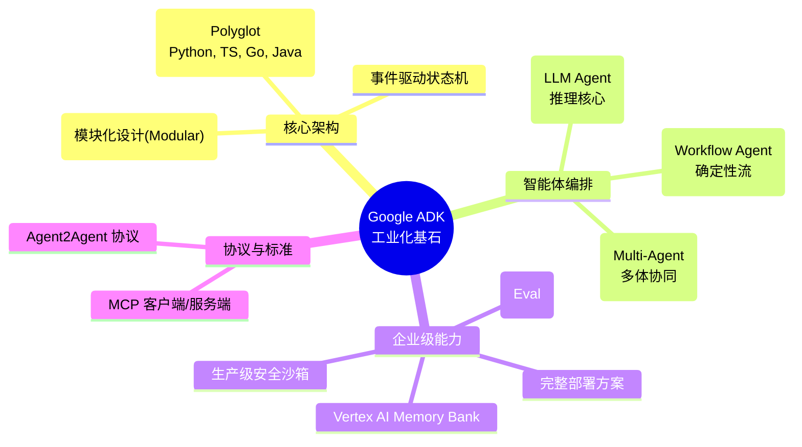

---

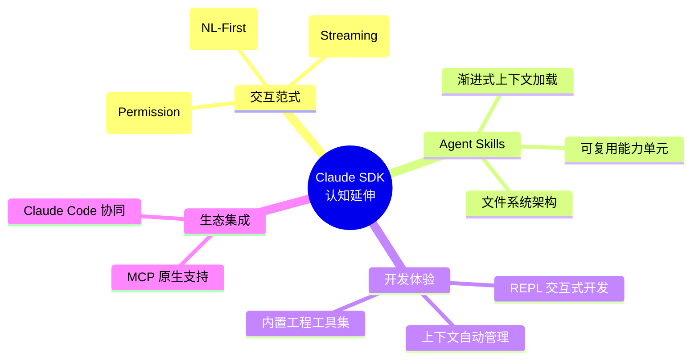

---

## 2. Google ADK

### 2.1 架构概览：智能的工业化堆栈

Google ADK 不需要被视为一个简单的 SDK，而是一套完整的**智能体工业化堆栈 (Industrial Stack for Agents)**。它采用分层解耦的架构设计，旨在消除从「原型 Demo」到「生产级应用」之间的鸿沟，让开发者能够像搭建乐高积木一样构建复杂的智能体系统。

其架构哲学可以概括为 **"Composable Intelligence" (可组合的智能)**：

- **多语言原生 (Polyglot Runtime)**：打破语言壁垒，提供 Python, TypeScript, Go, Java 的原生支持，让工程团队使用最熟悉的武器。
- **模块化组件 (Modular Components)**：将记忆(Memory)、工具(Tools)、状态(State)解耦为独立服务，既可单体运行，也可微服务化部署。
- **生产级基座 (Production Foundation)**：内置了企业级应用必须的安全沙箱、可观测性与弹性扩缩能力。

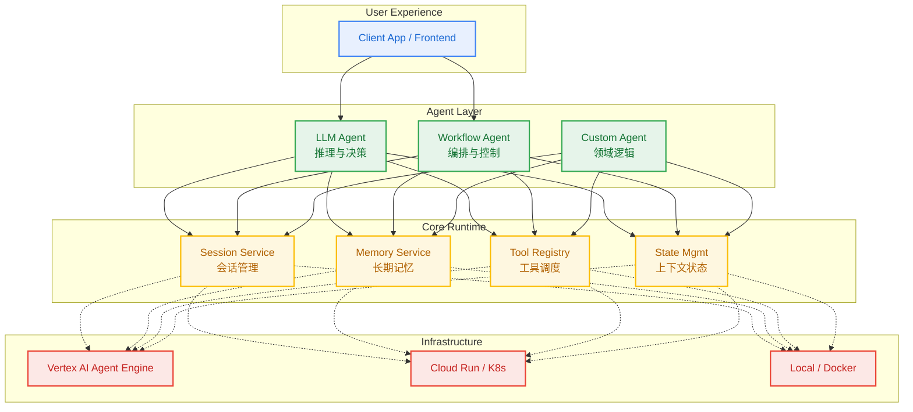

### 2.2 Agent Layer：从确定性到自主性

ADK 的 Agent Layer 并非简单的类别划分，而是一套覆盖了从 **"严格规则执行"** 到 **"开放式语义推理"** 的完整控制光谱。开发者可以根据任务的**熵（不确定性）**，灵活组合不同形态的智能体：

- **LlmAgent (概率性推理)**：处理高熵任务。基于语义理解进行动态决策，适用于复杂的意图识别与非结构化问题解决。
- **WorkflowAgent (确定性编排)**：处理低熵任务。基于预定义的 DAG 图或状态机执行，确保关键业务流程的绝对可控。
- **CustomAgent (领域特化)**：处理专用任务。封装传统的算法模型或遗留系统，作为连接新旧世界的桥梁。

#### 2.2.1 LLM Agent：概率性推理核心

LLM Agent 是系统的**语义大脑**。在 ADK 中，它被设计为一个具备完整 "Perception-Action Loop"（感知-行动循环）的自主实体，而非简单的 API 包装器。

**核心认知能力**：

- **Intention Routing (意图路由)**：基于语义理解而非关键词匹配来动态调整执行路径。
- **Tool Autonomy (工具自主)**：具备"自我修正"能力，能根据执行反馈（Feedback）调整工具参数。
- **Dynamic Delegation (动态委托)**：能够识别自身能力边界，将特定子任务主动转交（Handoff）给专家 Agent。

**定义一个"地理学家"智能体**：

```python
from google.adk.agents import LlmAgent

# 1. 定义感知工具：赋予 Agent 探索世界的能力
def get_capital_city(country: str) -> str:
    """查询指定国家的首都。

    Args:
        country: 国家名称（支持中文和英文）
    """
    capitals = {"france": "Paris", "中国": "北京", "japan": "Tokyo"}
    return capitals.get(country, f"数据库中未找到: {country}")

# 2. 构建认知模型：注入角色设定与思维链
geographer = LlmAgent(
    model="gemini-2.0-flash",  # 选择推理基座
    name="geographer_agent",   # 设定唯一身份标识
    description="专注于地理知识的查询与解答",

    # System Prompt 即 Agent 的"灵魂"
    instruction="""
    你是一个严谨的地理学家。
    1. 在回答问题前，先判断是否需要使用工具。
    2. 如果查询结果不存在，请诚实地告知用户，不要编造。
    3. 对于工具返回的数据，结合你的知识库进行补充说明（如人口、气候等）。
    """,

    tools=[get_capital_city]   # 挂载认知工具
)
```

**配置详解**：

| 核心参数      | 认知映射          | 作用说明                                     |
| :------------ | :---------------- | :------------------------------------------- |
| `instruction` | **长期记忆/性格** | 定义 Agent 的行为准则、思维方式和输出约束    |
| `tools`       | **手眼/效应器**   | 扩展 Agent 的能力边界，使其能与外部世界交互  |
| `model`       | **智商/算力**     | 决定 Agent 的推理深度和多模态理解能力        |
| `schemas`     | **沟通协议**      | 定义结构化的输入输出，确保与其他系统无缝对接 |

#### 2.2.2 Workflow Agent：确定性编排引擎

如果说 LLM Agent 是具有创造力的"员工"，那么 Workflow Agent 就是严格的**"工厂流水线"**。它不消耗 Token 进行推理，而是作为轻量级的**控制平面 (Control Plane)**，负责将多个 Agent 的无序思考收敛为有序的业务价值。

它解决了 Agent 系统中常被忽视的 **"可控性悖论"**：虽然我们需要 LLM 的灵活性，但在企业级应用中，我们需要执行流程是可预测、可调试且幂等的。

**三大编排模式 (Orchestration Patterns)**：

| 模式           | 工业隐喻                            | 核心逻辑                   | 典型场景                                                                                                      |
| :------------- | :---------------------------------- | :------------------------- | :------------------------------------------------------------------------------------------------------------ |
| **Sequential** | **接力赛 (Relay)**，顺序执行        | `Pipe(A -> B -> C)`        | **链式处理**：研究员搜集 -> 分析师总结 -> 翻译官润色。上游的输出严格作为下游的输入。<br/>有依赖关系的任务链。 |
| **Parallel**   | **集思广益 (MapReduce)**，并行执行  | `Fan-out / Fan-in`         | **并发生成**：同时让 3 个不同角色的 Critic Agent 评审同一份代码，最后聚合所有意见。<br/> 独立任务批处理。     |
| **Loop**       | **精细打磨 (Refinement)**，循环执行 | `While(!Satisfied) { Do }` | **自我修正**：生成代码 -> 运行单元测试 -> 失败则修复 -> 重试，直到测试通过。<br/>迭代优化、轮询检查。         |

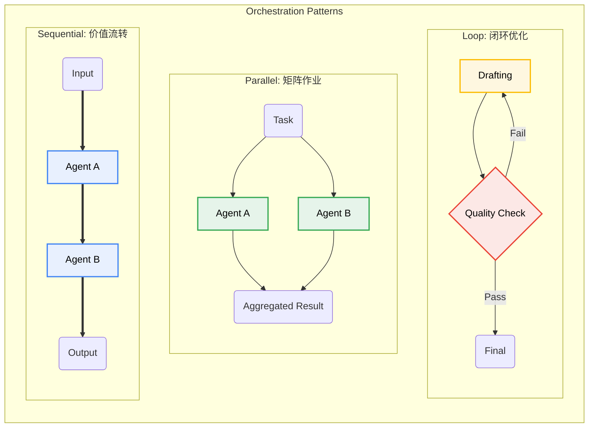

#### 2.2.3 Custom Agent：领域特化与混合智能

如果说 LlmAgent 代表了 **"神经网络"** 的直觉，那么 Custom Agent 则代表了 **"符号主义"** 的严谨。并非所有任务都需要 LLM 的介入，Custom Agent 允许开发者通过继承 `BaseAgent`，将传统的算法、规则引擎甚至遗留系统（Legacy Systems）封装为标准的智能体。

它是连接 **"概率性 AI 世界"** 与 **"确定性软件世界"** 的桥梁，实现了真正的 **混合智能 (Hybrid Intelligence)**。

**典型应用模式**：

- **The Gatekeeper (守门人)**：在 Workflow 中实施严格的输入/输出合规性检查（如 PII 过滤、格式验证）。
- **The Calculator (计算器)**：执行 LLM 不擅长的精确数学运算或复杂模拟。
- **The Bridge (连接器)**：将现有的微服务或 API 伪装成一个 Agent，使其能参与到 Multi-Agent 的协作中。

**定义一个"合规守门人" Agent**：

```python
from google.adk.agents import BaseAgent
from google.adk.model import ModelContext

class ComplianceAgent(BaseAgent):
    """一个不使用 LLM，但拥有『一票否决权』的规则智能体"""

    def __init__(self, name: str, strictly_mode: bool = True):
        super().__init__(name=name)
        self.strictly_mode = strictly_mode

    async def run(self, context: ModelContext) -> dict:
        # 1. 获取上下文中的"记忆"
        draft_content = context.state.get("draft_report", "")

        # 2. 执行确定性的逻辑 (Symbolic Logic)
        sensitives = self._scan_sensitive_words(draft_content)

        if sensitives:
            # 拒绝通过，并返回结构化的反馈
            return {
                "status": "REJECTED",
                "reason": f"Detect sensitive words: {sensitives}",
                "suggestion": "Please sanitize the content."
            }

        # 3. 更新状态，允许流程继续
        context.state["compliance_passed"] = True
        return {"status": "APPROVED"}

    def _scan_sensitive_words(self, text: str) -> list:
        # 实现高效的 AC 自动机或正则匹配
        return [w for w in ["机密", "Top Secret"] if w in text]
```

### 2.3 Tools Ecosystem：从感知到行动的触手

如果说 LLM 是大脑，那么 **Tools (工具)** 就是智能体的**感官与效应器 (Sensors & Effectors)**。ADK 的工具系统旨在解决大模型的 **Grounding (落地)** 问题，使其能够走出文本生成的“真空”，与真实世界的数据、API 和物理设备进行交互。

ADK 建立了一个层次分明的工具金字塔：

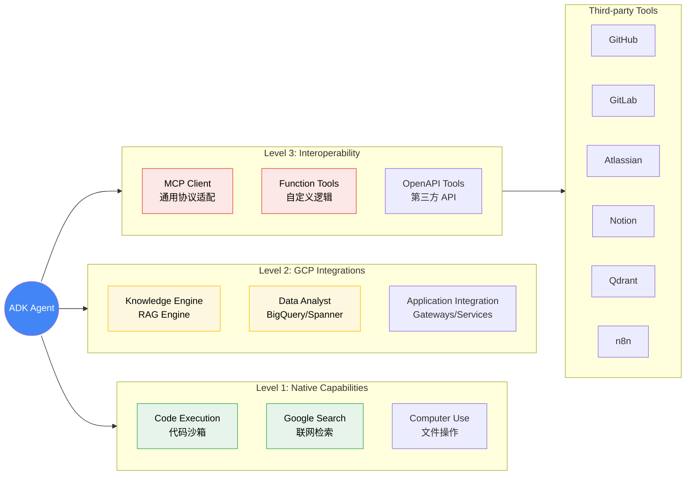

#### 2.3.1 Function-as-a-Tool (FaaT)

ADK 采用了极其优雅的 **"函数即工具"** 范式。开发者无需编写繁琐的 JSON Schema，只需遵循标准的 Python 类型提示和文档字符串规范，ADK 会自动将其编译为 LLM 可理解的工具描述。

**Docstring is the Prompt**:

```python
from google.adk.agents import LlmAgent

# ✅ 优雅定义：通过 Type Hints 和 Docstring 自动生成 Schema
def lookup_sales_data(region: str, quarter: str = "Q1") -> dict:
    """查询指定区域的季度销售数据。

    用于在回答财务相关问题时，获取准确的业务报表数据。

    Args:
        region: 目标区域代码 (如 'CN-NORTH', 'US-WEST')
        quarter: 财务季度 (如 '2025-Q1')

    Returns:
        包含 'revenue', 'cost', 'profit' 的字典
    """
    # 实际业务逻辑连接到 ERP 该系统
    return erp_client.query(region, quarter)

# ADK 自动处理转换
agent = LlmAgent(
    name="financial_assistant",
    tools=[lookup_sales_data]  # 直接挂载函数
)
```

#### 2.3.2 MCP：通用协议适配器

对于标准化的外部服务，ADK 拥抱 **Model Context Protocol (MCP)** 标准，将其作为通用的 **"万能适配器"**。这意味着任何支持 MCP 的工具服务器（如 PostgreSQL, GitHub, Slack）都可以一键接入 ADK Agent，无需编写额外的胶水代码。

```python
from google.adk.tools.mcp import MCPToolset

# 🔌 一键接入：连接现有的 MCP Server
git_tools = MCPToolset.from_server(
    command="npx",
    args=["-y", "@modelcontextprotocol/server-github"]
)

dev_agent = LlmAgent(
    model="gemini-2.0-flash",
    name="git_ops_agent",
    tools=git_tools.get_tools()  # 获得一系列 Git 操作工具
)
```

### 2.4 ADK Context Engineering：从瞬时状态到长期记忆

ADK 的上下文工程（Context Engineering）体系不仅是数据存储，更是模拟人类认知过程的精准实现。它将智能体的"记忆"划分为三个具有明确生命周期的层级，解决了传统 RAG 系统中"上下文窗口爆炸"与"信息检索迷失"的难题<sup>[[8]](#ref8)</sup>。

这种分层设计使得 Agent 既能保持对话的连贯性（Short-term），又能沉淀长期知识（Long-term）。

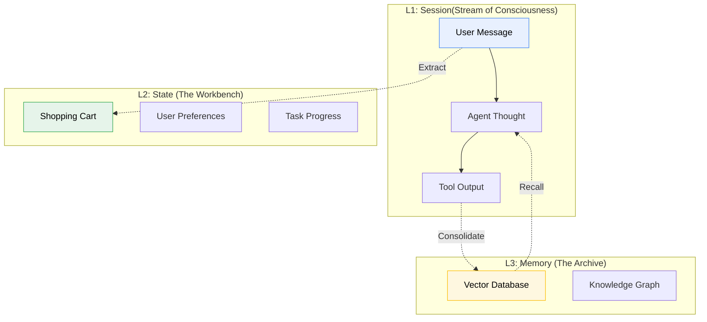

#### 2.4.1 认知三层级 (Cognitive Hierarchy)

| 记忆层级    | 认知隐喻               | 生命周期                | 核心职责                                                                                                         |
| :---------- | :--------------------- | :---------------------- | :--------------------------------------------------------------------------------------------------------------- |
| **Session** | **意识流 (Stream)**    | 瞬时 (Ephemeral)        | 记录完整的交互轨迹（Turns），作为 LLM 推理的直接上下文窗口。包含用户输入、思考过程、工具调用结果。               |
| **State**   | **工作台 (Workbench)** | 会话级 (Session-scoped) | 存储结构化的、易变的上下文变量。如同工作台上的草稿纸，用于由不同 Agent 共享关键参数（如 `order_id`）。           |
| **Memory**  | **图书馆 (Library)**   | 持久化 (Persistent)     | 跨越会话周期的长期记忆。通过向量化（Embedding）存储，仅在需要时通过语义检索（Retrieval）提取相关片段注入上下文。 |

#### 2.4.2 Vertex AI Memory Bank：云端海马体

在生产环境中，ADK 推荐使用 `VertexAiMemoryBankService`。它充当了 Agent 的 **"外挂海马体"**，自动处理记忆的存储、索引和遗忘。

相比于手动维护向量数据库，ADK 的 Memory Service 提供了开箱即用的**自动向量化**和**混合检索**能力。

```python
from google.adk.memory import VertexAiMemoryBankService

# 🧠 接驳云端海马体
hippocampus = VertexAiMemoryBankService(
    project_id="aurelius-agent-platform",
    location="us-central1",
    corpus_display_name="corporate_knowledge_base"
)

# 注入具备长期记忆的 Agent
consultant = LlmAgent(
    model="gemini-2.0-flash",
    name="senior_consultant",
    memory_service=hippocampus,  # 自动具备 RAG 能力
    instruction="在回答问题前，先从记忆库中回忆相关的历史案例..."
)
```

#### 2.4.3 Context Objects：通往世界的钥匙

在 ADK 中，Context 对象是连接 Agent 逻辑与底层 Runtime 的 **"万能钥匙"**。为了践行 **最小权限原则 (Principle of Least Privilege)**，ADK 根据使用场景提供了不同权限等级的 Context 对象，防止不安全的越权操作。

| Context 类型          | 权限等级 | 隐喻                     | 适用场景                                                                  |
| :-------------------- | :------- | :----------------------- | :------------------------------------------------------------------------ |
| **ToolContext**       | ⭐⭐⭐   | **特种装备 (Equipment)** | 供工具函数使用。除了读写 State，还能创建 Artifact（如生成的文件、图表）。 |
| **InvocationContext** | ⭐⭐⭐⭐ | **指挥棒 (Baton)**       | 供 Agent 内部逻辑使用。拥有控制流程、调用子 Agent 的最高权限。            |
| **ReadonlyContext**   | ⭐       | **查看器 (Viewer)**      | 供 Prompt 模板使用。仅允许读取 State 变量进行渲染，绝无副作用。           |
| **CallbackContext**   | ⭐⭐     | **传感器 (Sensor)**      | 供生命周期钩子使用。用于监听事件和记录日志。                              |

**实战：编写一个"上下文感知"的工具**：
传统的工具函数通常是无状态的（Stateless），但在 ADK 中，通过注入 `ToolContext`，工具可以变得"聪明"起来——它能记住之前的操作，甚至直接向用户发送多媒体文件。

```python
from google.adk.context import ToolContext

# 注入 ToolContext，让工具具备"记忆"和"创造"能力
def generate_analysis_report(data_id: str, ctx: ToolContext) -> str:
    """生成并保存数据分析报告。

    Args:
        data_id: 数据集 ID
        ctx: ADK 自动注入的上下文对象 (Magic Argument)
    """
    # 1. Access State: 获取用户的身份信息
    user_tier = ctx.state.get("user_tier", "standard")

    # 2. Side Effect: 生成 PDF 文件并作为 Artifact 保存
    report_content = _run_analysis(data_id, depth=user_tier)
    artifact_url = ctx.save_artifact(
        name=f"report_{data_id}.pdf",
        content=report_content,
        mime_type="application/pdf"
    )

    # 3. Mutate State: 更新任务进度
    ctx.state["last_report_url"] = artifact_url

    return f"报告已生成完毕，您可以点击此处下载: {artifact_url}"
```

### 2.5 Multi-Agent Systems：智能体的分形组织

ADK 的多智能体系统并非简单的扁平堆砌，而是一种**分形架构 (Fractal Architecture)**。这意味着每一个 Agent 内部都可以包含一个完整的子 Agent 系统，从而支持无限层级的嵌套与编排。

这种设计使得开发者可以像组建 **"一家公司"** 一样构建系统：

- **Root Agent (CEO)**：负责最高层级的意图拆解与任务分发。
- **Workflow Agent (Project Manager)**：负责特定业务线的流程管控。
- **Specialist Agent (Expert Employee)**：负责具体领域的执行。

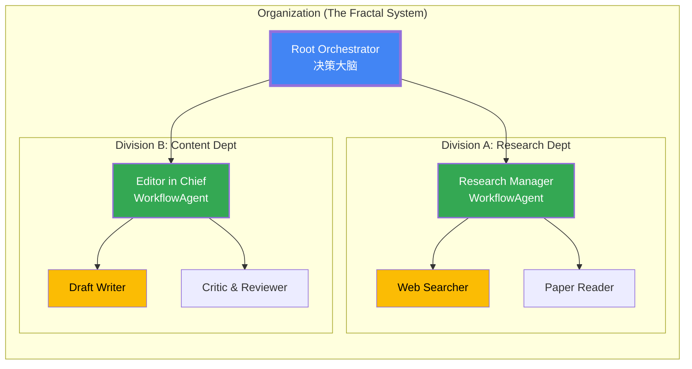

ADK 通过标准化的接口，将异构的智能体（LLM Agent, Workflow Agent, Custom Agent）编织成一个 **"有机整体"**。这种架构带来了两个核心优势：

1. **Complexity Encapsulation (复杂度封装)**：上层 Agent 无需知道下层的实现细节，只需关注接口契约。
2. **Cognitive Specialization (认知专业化)**：每个 Agent 可以使用不同的 Prompt、Tools 甚至不同的 LLM 模型（如 Researcher 用 Flash 模型，Writer 用 Pro 模型）。

#### 2.5.1 Collaboration Patterns：构建虚拟专案组

在 ADK 中，通过组合简单的原子智能体，我们可以构建出能够解决复杂问题的 **"虚拟专案组" (Virtual Task Force)**。这种模式将单体智能体的"全能压力"分散到了多个专用角色上，实现了 **Model-Task Fit (模型-任务匹配)**。

**实战案例：深度研究流水线 (Deep Research Pipeline)**

在这个案例中，我们组建了一个由三名专家组成的流水线。注意我们是如何为不同角色分配不同能力的模型（Flash vs Pro）以平衡成本与效果的。

```python
from google.adk.agents import LlmAgent, SequentialAgent

# 1. 组建专家团队 (The Specialists)
# 每一位专家都拥有独特的"人设"和"技能树"

# 🕵️ 研究员：追求速度与广度，使用 Flash 模型
researcher = LlmAgent(
    name="info_gatherer",
    model="gemini-2.0-flash",
    instruction="你的目标是广度优先地收集信息，确保覆盖所有相关事实，不放过任何细节。",
    tools=[google_search_tool, vector_db_query_tool]
)

# 🧠 分析师：追求逻辑与深度，使用 Pro 模型
analyst = LlmAgent(
    name="insight_extractor",
    model="gemini-2.0-pro",  # 使用更强的推理模型
    instruction="""
    你需要基于研究员提供的事实，进行深度思考：
    1. 识别数据背后的模式与反直觉的结论。
    2. 剔除噪音，提炼核心洞察。
    """,
)

# ✍️ 笔者：追求表达与风格，使用 Flash 模型
writer = LlmAgent(
    name="final_editor",
    model="gemini-2.0-flash",
    instruction="将枯燥的洞察转化为引人入胜的行业报告，保持客观、专业的语调。",
)

# 2. 定义协作协议 (The Protocol)
# 将专家串联为一条"深度研究流水线"
# 💡 关键点：这个 Pipeline 本身也是一个 Agent，可以被上层架构继续集成（分形特性）
deep_research_squad = SequentialAgent(
    name="deep_research_pipeline",
    description="自动执行从信息搜集到报告生成的端到端任务",
    sub_agents=[researcher, analyst, writer]
)
```

这种 **Compose-and-Forget** 的特性极其强大：上层调用者（如 Root Agent）无需关心 `deep_research_squad` 内部是由三个还是五个 Agent 组成的，只需像调用单个 Agent 一样给它下达指令即可。

### 2.6 Protocols & Standards：通用语与连接器

在通往通用人工智能 (AGI) 的道路上，孤岛式的 Agent 是没有未来的。ADK 通过拥抱两大开放协议，致力于构建一个互联互通的智能体互联网。

#### 2.6.1 MCP：智能时代的 USB 标准

**Model Context Protocol (MCP)** 正在成为 AI 领域的 USB 标准。正如 USB 统一了外设接口一样，MCP 旨在标准化 LLM 连接数据与工具的方式。

ADK 对 MCP 的支持是**双向 (Bi-directional)** 的：

1. **Consume (作为消费者)**：Agent 可以即插即用任意标准的 MCP Server（如连接 GitHub, Slack, PostgreSQL）。
2. **Serve (作为生产者)**：Agent 也可以将自身的能力暴露为 MCP Server，供其他 AI 系统（如 Claude Desktop 或 Cursor）调用。

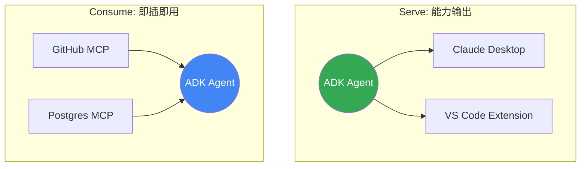

#### 2.6.2 Agent2Agent (A2A)：智能体微服务

如果说 MCP 解决了"人与工具"的连接，那么 **Agent2Agent (A2A)** 协议则定义了"智能体与智能体"之间的社交礼仪。它本质上是 **微服务架构 (Microservices)** 在 AI 时代的演进。

A2A 协议不仅传输数据，更传输 **上下文 (Context)** 和 **控制权 (Control)**。

**架构范式：Serverless Agent Mesh**

```python
# 🌍 Server Side: 将本地 Agent 暴露为 A2A 服务
from google.adk.a2a import A2AServer

# 启动一个专职的"数据分析服务"
a2a_server = A2AServer(
    agent=analyst_agent,
    # 🔒 开启安全门禁：仅允许持有特定 API Key 的客户端连接
    auth={"api_key": "sk-secret-key-123"}
)
a2a_server.serve(host="0.0.0.0", port=8080)

# 🚀 Client Side: 像调用本地函数一样调用远程智能体
from google.adk.a2a import A2AClient

# 连接远程专家 (自动处理握手与鉴权)
remote_analyst = A2AClient(
    url="https://analyst-agent.internal.corp",
    api_key="sk-secret-key-123"  # 🔑 客户端必须提供匹配的密钥
)

# 远程调用：包含完整的上下文传递
analysis = await remote_analyst.invoke(
    instruction="分析这份财报的异常点",
    context={"report_url": "s3://..."}
)
```

### 2.7 Deployment Topologies：从实验室到名利场

ADK 的部署哲学是 **"Write Once, Run Anywhere"**。由于 Agent 的逻辑（Cognition）与运行时环境（Runtime）是解耦的，你的代码可以在本地笔记本上通过 REPL 运行，也可以无缝迁移到 Google 的全球基础设施上。

可以将 ADK 应用的部署选项划分为三个战略层级：

| 战略层级            | 部署形态                | 隐喻                    | 核心优势                                                                                                           |
| :------------------ | :---------------------- | :---------------------- | :----------------------------------------------------------------------------------------------------------------- |
| **L1: Prototyping** | **Local / Docker**      | **实验室 (Lab)**        | **极速反馈**。改行代码就能跑，支持断点调试，完全免费。适合开发与单元测试。                                         |
| **L2: Production**  | **Vertex Agent Engine** | **发电厂 (Plant)**      | **Serverless 托管**。Google 负责底层的资源调度、自动扩缩容和容灾。只需上传代码，不仅省心，且具备生产级的高可用性。 |
| **L3: Custom**      | **Cloud Run / GKE**     | **定制车间 (Workshop)** | **全栈掌控**。适合需要自定义 CUDA 镜像、私有 VPC 网络或与其他微服务在同一 Kubernetes 集群中混合部署的场景。        |

#### 2.7.1 部署决策路径

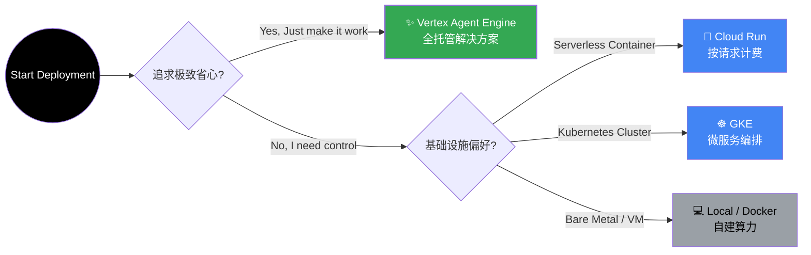

### 2.8 Evaluation & Security：智能的质检与免疫

在 LLM 应用中，**"It works"** 到 **"It works efficiently and safely"** 之间存在巨大的鸿沟。ADK 提供了一套完整的工具链，用于对智能体进行全方位的"体检"与"防护"。

#### 2.8.1 GenAI Eval：智能体的 CT 扫描

传统的软件测试关注 `Input -> Output` 的正确性，而 ADK 的评估框架则深入到了 `Input -> Thought -> Action -> Output` 的每一个环节。

- **Trajectory Inspection (轨迹透视)**：不仅看结果，更看过程。检测 Agent 是否陷入死循环，或者是否采取了最优路径。
- **Tool Usage Audit (工具审计)**：验证 Agent 是否在正确的时机、使用了正确的工具、传递了正确的参数。
- **Safety Check (安全验收)**：确保输出内容不包含有害信息或幻觉（Hallucinations）。

**开发者工具箱**：

- `adk web`：**可视化控制台**。像回放电影一样逐帧分析 Agent 的思考过程。
- `adk eval`：**命令行工具**。支持批量运行评估集，快速获取"智能体体检报告"。
- `pytest` 集成：**自动化流水线**。将智能体评估纳入 CI/CD，代码提交即触发回归测试。

#### 2.8.2 Defense in Depth：纵深防御体系

ADK 继承了 Google Cloud 的零信任安全架构，为智能体构建了四道防线：

| 防御层级             | 组件                   | 职责                                                               |
| :------------------- | :--------------------- | :----------------------------------------------------------------- |
| **L1: Border**       | **VPC-SC**             | **网络边界**。防止数据被偷运出企业内网。                           |
| **L2: Identity**     | **Workforce Identity** | **身份识别**。确保只有授权的员工或服务能唤醒 Agent。               |
| **L3: Input/Output** | **Guardrails**         | **内容过滤**。实时拦截 Prompt 注入攻击和 PII 隐私泄漏。            |
| **L4: Execution**    | **Secure Sandbox**     | **沙箱执行**。生成的 Python 代码在隔离环境中运行，防止危害宿主机。 |

---

## 3. Claude Agent SDK

### 3.1 Architecture Overview：认知的直接封装

Claude Agent SDK（原 Claude Code SDK）是 Anthropic 提供的 Agent 开发框架，允许开发者以编程方式复用 Claude Code CLI 的完整能力<sup>[[2]](#ref2)</sup>。

如果说 ADK 提供了构建工厂的组件，Claude Agent SDK 则提供了一台 **"开箱即用"的高性能引擎**。它将复杂的认知决策、工具调度和上下文窗口管理封装在极简的 API 之下。

**核心特性 (Core Features)**：

- **Headless Capability**：不仅是 Chat，而是将 Claude Code 强大的 **编码能力** 与 **系统操作能力**（Bash, File System）无缝集成。
- **Autonomous Loop**：内置了工业级的 **Agent Loop**，包含自动的工具执行、结果解析、以及针对工具报错的 **自我修正 (Auto-Retry)** 逻辑。
- **Native Toolset**：预装了一组经 AI 优化的系统工具（`Bash`, `Edit`, `Glob`, `Grep`, `Read`），无需额外配置即可操作复杂项目。

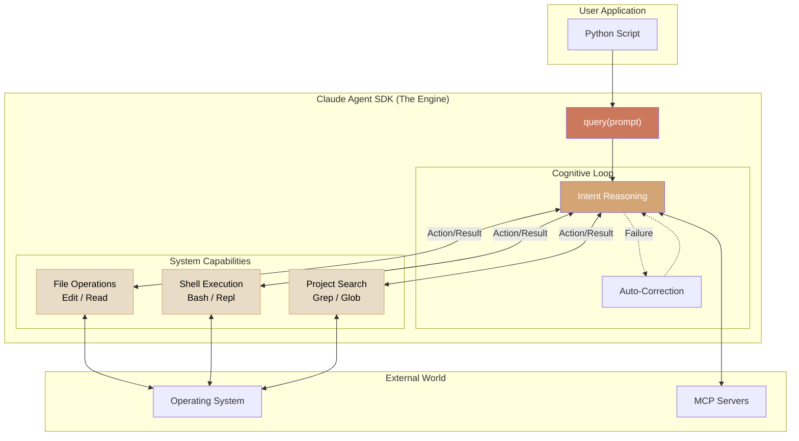

### 3.2 Core Interface：认知的流式接入

Claude Agent SDK 的设计极其克制，几乎所有的魔力都汇聚在一个核心函数 `query()` 之中。它不是一个简单的"请求-响应"接口，而是一个通往 Agent 思考过程的 **"意识流管道" (Thought Stream)**。

#### 3.2.1 The Query Loop

调用 `query()` 就像是启动了一个具有自主意识的子进程。通过 **异步流 (Async Stream)**，你可以实时捕获 Agent 的每一个念头、每一次工具调用和最终的决策结果。

**Python: 像流水一样处理思考**

```python
import asyncio
from claude_agent_sdk import query, ClaudeAgentOptions

async def main():
    # 🌊 建立连接：开启一段自主任务
    stream = query(
        prompt="在 auth.py 中找到并修复 bug",
        # 🎮 飞行控制：定义 Agent 的能力边界
        options=ClaudeAgentOptions(
            allowed_tools=["Read", "Edit", "Bash"], # 赋予系统权限
            permission_mode="acceptEdits"           # 授予自动修改权
        )
    )

    # 👁️ 实时观察：监听 Agent 的思考过程
    async for event in stream:
        # event 可能是：思考片段、工具执行日志、或者最终结果
        print(f"[{event.type}] {event.content}")

asyncio.run(main())
```

**TypeScript: 同构的开发体验**

```typescript
import { query, ClaudeAgentOptions } from "@anthropic-ai/agent-sdk";

async function main() {
  const stream = query({
    prompt: "Find and fix the bug in auth.py",
    options: {
      allowedTools: ["Read", "Edit", "Bash"],
      permissionMode: "acceptEdits",
    },
  });

  // 同样使用 for-await 语法处理流
  for await (const message of stream) {
    console.log(message);
  }
}

main();
```

#### 3.2.2 Control Knobs：飞行控制面板

`ClaudeAgentOptions` 是你对 Agent 进行约束的 **控制面板**。通过它，你可以精确地定义 Agent 的"能力"与"权力"<sup>[[17]](#ref17)</sup>。

| 控制维度        | 配置参数          | 隐喻                            | 核心作用                                                                               |
| :-------------- | :---------------- | :------------------------------ | :------------------------------------------------------------------------------------- |
| **Capability**  | `allowed_tools`   | **工具箱 (Toolbelt)**           | 指定 Agent 可以使用哪些内置工具（如 `Bash`）或 MCP 工具。未授权的工具对 Agent 不可见。 |
| **Autonomy**    | `permission_mode` | **授权书 (Mandate)**            | 决定 Agent 在执行敏感操作（如修改文件、运行命令）时是否需要人类审批。                  |
| **Extension**   | `mcp_servers`     | **感官与手脚 (Senses & Limbs)** | 挂载外部的数据源 (Senses) 和服务 (Limbs)，不仅拓展感知，更注入操作外部世界的能力。     |
| **Environment** | `setting_sources` | **环境配置 (Environment)**      | 指定从哪些来源（如项目根目录）加载特定的环境上下文与配置。                             |
| **Persona**     | `system_prompt`   | **潜意识 (Subconscious)**       | 注入系统级指令，设定 Agent 的行为准则和角色性格。                                      |

### 3.3 内置工具

Claude Agent SDK 提供以下内置工具<sup>[[17]](#ref17)</sup>：

| 工具     | 功能            | 权限需求 |
| -------- | --------------- | -------- |
| **Read** | 读取文件内容    | 文件访问 |
| **Edit** | 编辑文件内容    | 文件修改 |
| **Bash** | 执行 Shell 命令 | 命令执行 |
| **Glob** | 文件模式匹配    | 文件访问 |
| **Grep** | 内容搜索        | 文件访问 |

**工具组合示例**：

```python
# 只读分析模式
analysis_options = ClaudeAgentOptions(
    allowed_tools=["Read", "Glob", "Grep"]
)

# 代码修改模式
edit_options = ClaudeAgentOptions(
    allowed_tools=["Read", "Edit", "Glob"]
)

# 完整开发模式
dev_options = ClaudeAgentOptions(
    allowed_tools=["Read", "Edit", "Bash", "Glob", "Grep"]
)
```

### 3.4 权限控制

SDK 提供三种权限模式<sup>[[17]](#ref17)</sup>：

| 模式                | 行为             | 适用场景   |
| ------------------- | ---------------- | ---------- |
| `default`           | 需要用户确认     | 交互式应用 |
| `acceptEdits`       | 自动批准文件操作 | 自动化脚本 |
| `bypassPermissions` | 跳过所有权限检查 | 受控环境   |

**自定义权限回调**：

```python
async def can_use_tool(tool_name: str, args: dict) -> bool:
    """自定义工具使用权限逻辑"""
    if tool_name == "Bash":
        # 限制危险命令
        command = args.get("command", "")
        dangerous = ["rm -rf", "sudo", "chmod 777"]
        return not any(d in command for d in dangerous)
    return True

options = ClaudeAgentOptions(
    permission_mode="default",
    can_use_tool=can_use_tool
)
```

### 3.5 配置与扩展

#### 3.5.1 项目级配置

通过 `.claude/` 目录结构实现项目级配置<sup>[[2]](#ref2)</sup>：

```
my-project/
├── .claude/
│   ├── skills/
│   │   └── SKILL.md
│   ├── commands/
│   │   └── custom-command.md
│   └── CLAUDE.md
├── CLAUDE.md
└── ...
```

#### 3.5.2 MCP 服务器集成

```python
options = ClaudeAgentOptions(
    mcp_servers={
        "database": {
            "command": "npx",
            "args": ["@modelcontextprotocol/server-postgres"]
        }
    }
)
```

---

## 4. Agent Skills

### 4.1 Skills 概念与价值

Agent Skills 是 Claude 的模块化能力扩展系统，提供可复用的领域专业知识<sup>[[3]](#ref3)</sup>：

**核心价值**：

- **专业化**：将通用 Agent 转变为领域专家
- **减少重复**：一次创建，自动复用
- **能力组合**：多个 Skills 组合实现复杂工作流

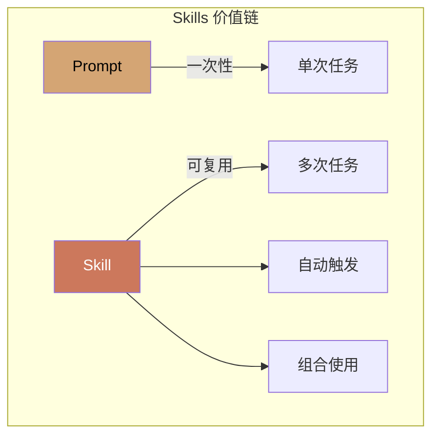

### 4.2 三层渐进加载架构

Skills 采用独特的三层渐进加载机制，优化上下文使用<sup>[[3]](#ref3)</sup>：

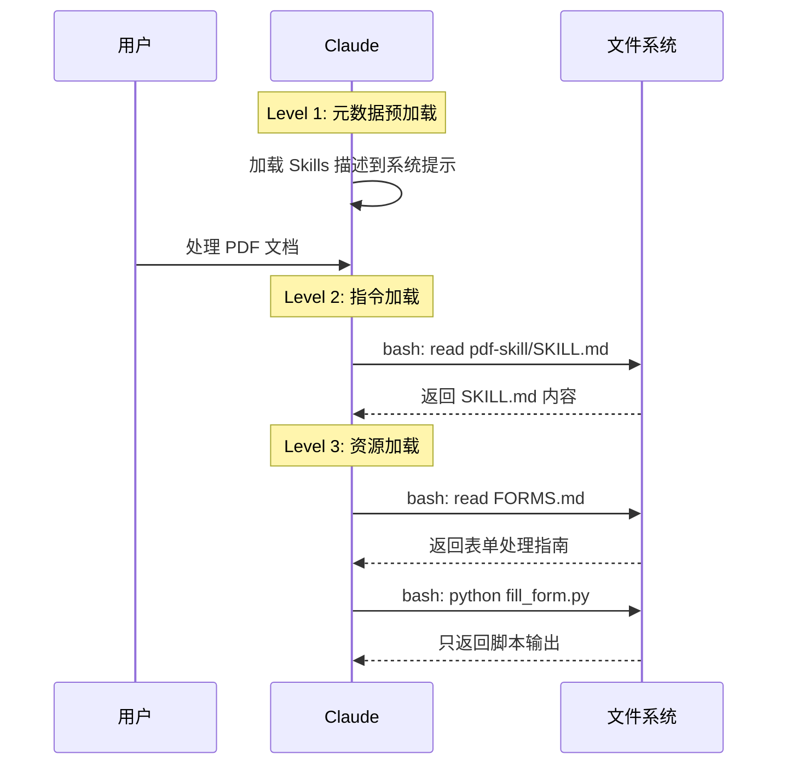

#### 三层详解

| 层级           | 内容类型         | 加载时机 | Context 消耗 |
| -------------- | ---------------- | -------- | ------------ |
| **L1: 元数据** | YAML frontmatter | 启动时   | 极小         |
| **L2: 指令**   | SKILL.md 正文    | 触发时   | 按需         |
| **L3: 资源**   | 附加文件、脚本   | 引用时   | 仅输出       |

**Level 1 示例**：

```yaml
---
name: pdf-processing
description: 从 PDF 文件中提取文本和表格，填写表单，合并文档。
  在处理 PDF 文件或用户提到 PDF、表单、文档提取时使用。
---
```

**Level 2 + Level 3 结构**：

```
pdf-skill/
├── SKILL.md           # L2: 主指令
├── FORMS.md           # L3: 表单填写指南
├── REFERENCE.md       # L3: API 参考
└── scripts/
    └── fill_form.py   # L3: 可执行脚本
```

### 4.3 预构建 Skills

Anthropic 提供以下预构建 Skills<sup>[[3]](#ref3)</sup>：

| Skill          | 能力                     | 文件格式 |
| -------------- | ------------------------ | -------- |
| **PowerPoint** | 创建演示、编辑幻灯片     | .pptx    |
| **Excel**      | 创建表格、数据分析、图表 | .xlsx    |
| **Word**       | 创建文档、格式化         | .docx    |
| **PDF**        | 生成格式化 PDF 报告      | .pdf     |

**使用方式**：

```python
# 在 API 中使用 Skills
response = client.messages.create(
    model="claude-sonnet-4-20250514",
    messages=[{
        "role": "user",
        "content": "根据销售数据创建一个 Excel 报表，包含图表"
    }],
    # Skills 自动触发，无需显式配置
)
```

### 4.4 自定义 Skills

#### 4.4.1 Skill 结构

每个 Skill 必须包含 `SKILL.md` 文件<sup>[[3]](#ref3)</sup>：

````md
---
name: code-review
description: 执行代码审查，检查代码质量、安全问题和最佳实践。
  当用户请求代码审查或提到代码质量检查时使用。
---

# Code Review Skill

## 检查清单

1. **代码风格**

   - 命名约定是否一致
   - 缩进和格式是否正确

2. **安全性**

   - 是否存在 SQL 注入风险
   - 是否正确处理用户输入

3. **性能**
   - 是否存在不必要的循环
   - 是否有优化空间

## 输出格式

使用以下模板输出审查结果：

```md
## 代码审查报告

### 问题总结

### 具体建议

### 风险评级
```
````

#### 4.4.2 字段约束

| 字段          | 约束                                   |
| ------------- | -------------------------------------- |
| `name`        | 最长 64 字符，仅小写字母、数字、连字符 |
| `description` | 非空，最长 1024 字符                   |
| 禁止内容      | XML 标签、保留词（anthropic、claude）  |

### 4.5 安全考虑

Skills 安全最佳实践<sup>[[3]](#ref3)</sup>：

> [!CAUTION]
>
> **仅使用可信来源的 Skills**
>
> Skills 可以指导 Claude 执行代码和调用工具。恶意 Skill 可能导致数据泄露或系统损害。

**安全检查清单**：

- [ ] 审查所有 Skill 文件（SKILL.md、脚本、资源）
- [ ] 检查异常网络调用模式
- [ ] 验证文件访问范围
- [ ] 审计外部 URL 依赖

---

## 5. 横向对比

### 5.1 核心能力矩阵

| 能力维度        | Google ADK                    | Claude Agent SDK            |
| --------------- | ----------------------------- | --------------------------- |
| **语言支持**    | Python, TS, Go, Java          | Python, TypeScript          |
| **Agent 类型**  | LLM, Workflow, Custom         | 单一 Agent Loop             |
| **Multi-Agent** | ✅ 原生支持                   | ❌ 需自行实现               |
| **内置工具**    | 需集成                        | ✅ Read/Edit/Bash/Glob/Grep |
| **Memory 系统** | ✅ Vertex AI Memory Bank      | 通过 Skills/配置            |
| **MCP 支持**    | ✅ 客户端 + 服务器            | ✅ 客户端                   |
| **评估框架**    | ✅ 内置                       | ❌ 无                       |
| **部署方案**    | ✅ Agent Engine/Cloud Run/GKE | 需自行实现                  |
| **Skills 系统** | ❌ 无                         | ✅ 三层渐进加载             |

### 5.2 架构设计对比

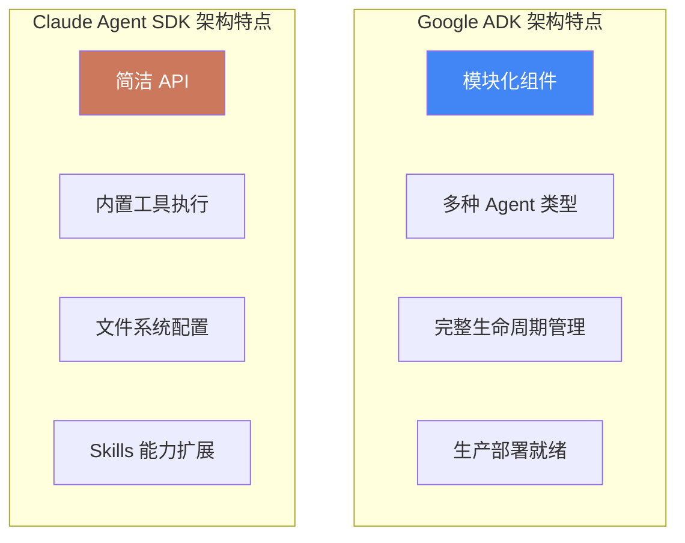

### 5.3 适用场景分析

| 场景                  | 推荐方案         | 理由                  |
| --------------------- | ---------------- | --------------------- |
| **复杂多 Agent 系统** | Google ADK       | 原生 Multi-Agent 支持 |
| **代码编辑任务**      | Claude Agent SDK | 内置 Read/Edit 工具   |
| **企业级部署**        | Google ADK       | Agent Engine 托管服务 |
| **快速原型开发**      | Claude Agent SDK | 简洁 API，即开即用    |
| **文档处理任务**      | Claude + Skills  | 预构建 Office Skills  |
| **跨会话记忆需求**    | Google ADK       | Vertex AI Memory Bank |

---

## 6. 实施指引

### 6.1 Google ADK 集成指南

#### 6.1.1 环境准备

```bash
# 创建项目目录
mkdir adk-demo && cd adk-demo

# 创建虚拟环境
python -m venv .venv
source .venv/bin/activate

# 安装 ADK
pip install google-adk

# 配置 Google Cloud 认证
gcloud auth application-default login
```

#### 6.1.2 基础 Agent 实现

```python
# agents/research_agent.py
from google.adk.agents import LlmAgent
from google.adk.tools import google_search

def create_research_agent():
    """创建研究 Agent"""
    return LlmAgent(
        model="gemini-2.0-flash",
        name="research_agent",
        description="研究并总结特定主题的信息",
        instruction="""你是一个专业的研究助手。

任务流程：
1. 使用 google_search 工具搜索相关信息
2. 分析搜索结果，提取关键事实
3. 组织信息，生成结构化摘要

输出要求：
- 包含信息来源
- 标注关键数据点
- 提供进一步研究建议""",
        tools=[google_search]
    )
```

#### 6.1.3 Multi-Agent 工作流

```python
# agents/report_pipeline.py
from google.adk.agents import LlmAgent, SequentialAgent, ParallelAgent

def create_report_pipeline():
    """创建报告生成工作流"""

    # 研究 Agent
    researcher = LlmAgent(
        model="gemini-2.0-flash",
        name="researcher",
        instruction="收集和整理主题相关信息..."
    )

    # 分析 Agent
    analyst = LlmAgent(
        model="gemini-2.0-flash",
        name="analyst",
        instruction="分析研究数据，提取洞见..."
    )

    # 并行处理：图表生成和文本写作
    chart_maker = LlmAgent(
        model="gemini-2.0-flash",
        name="chart_maker",
        instruction="基于分析结果生成可视化..."
    )

    writer = LlmAgent(
        model="gemini-2.0-flash",
        name="writer",
        instruction="撰写报告正文..."
    )

    # 组合工作流
    parallel_stage = ParallelAgent(
        name="content_generation",
        sub_agents=[chart_maker, writer]
    )

    return SequentialAgent(
        name="report_pipeline",
        sub_agents=[researcher, analyst, parallel_stage]
    )
```

#### 6.1.4 运行与测试

```python
# main.py
import asyncio
from google.adk.runner import Runner
from agents.report_pipeline import create_report_pipeline

async def main():
    pipeline = create_report_pipeline()
    runner = Runner(agent=pipeline)

    result = await runner.run(
        prompt="生成一份关于 AI Agent 发展趋势的研究报告"
    )

    print(result)

if __name__ == "__main__":
    asyncio.run(main())
```

### 6.2 Claude Agent SDK 集成指南

#### 6.2.1 环境准备

```bash
# 创建项目目录
mkdir claude-agent-demo && cd claude-agent-demo

# 安装 Claude Code（必需运行时）
# macOS/Linux
curl -fsSL https://code.claude.com/install.sh | sh

# 运行 claude 进行认证
claude

# 安装 SDK
pip install claude-agent-sdk

# 或使用 uv
uv add claude-agent-sdk
```

#### 6.2.2 基础 Agent 实现

```python
# agent.py
import asyncio
from claude_agent_sdk import query, ClaudeAgentOptions

async def code_review_agent(file_path: str):
    """代码审查 Agent"""

    prompt = f"""请审查 {file_path} 文件的代码：

1. 检查代码风格和命名约定
2. 识别潜在的安全问题
3. 评估代码可维护性
4. 提供改进建议

输出结构化的审查报告。"""

    options = ClaudeAgentOptions(
        allowed_tools=["Read", "Glob", "Grep"],
        permission_mode="default"
    )

    result = []
    async for message in query(prompt=prompt, options=options):
        if hasattr(message, 'content'):
            result.append(message.content)
            print(message.content)

    return "\n".join(result)

if __name__ == "__main__":
    asyncio.run(code_review_agent("src/main.py"))
```

#### 6.2.3 带 Skills 的 Agent

```python
# agent_with_skills.py
import asyncio
from claude_agent_sdk import query, ClaudeAgentOptions

async def document_processor():
    """文档处理 Agent（使用 Skills）"""

    options = ClaudeAgentOptions(
        allowed_tools=["Read", "Edit", "Bash"],
        setting_sources=["project"],  # 启用项目级配置（包括 Skills）
        permission_mode="acceptEdits"
    )

    prompt = """读取 data/sales_report.csv 文件，然后：
1. 分析销售数据趋势
2. 创建一个 Excel 报表，包含月度汇总和图表
3. 生成一份 PDF 格式的管理层摘要"""

    async for message in query(prompt=prompt, options=options):
        print(message)

if __name__ == "__main__":
    asyncio.run(document_processor())
```

#### 6.2.4 自定义 Skill 创建

````bash
# 创建 Skill 目录结构
mkdir -p .claude/skills/data-analysis

# 创建 SKILL.md
cat > .claude/skills/data-analysis/SKILL.md << 'EOF'
---
name: data-analysis
description: 执行数据分析任务，包括统计分析、可视化和报告生成。
             当用户请求数据分析、统计或可视化时使用。
---

# Data Analysis Skill

## 分析流程

1. **数据加载**
   - 使用 pandas 读取数据文件
   - 检查数据质量

2. **探索性分析**
   - 计算描述性统计
   - 识别异常值

3. **可视化**
   - 使用 matplotlib/seaborn 创建图表
   - 保存为 PNG 文件

## 代码模板

```python
import pandas as pd
import matplotlib.pyplot as plt

def analyze(file_path):
    df = pd.read_csv(file_path)
    print(df.describe())
    # ... 更多分析
```

EOF

````

### 6.3 混合架构方案

对于复杂场景，可以考虑混合使用两个框架：

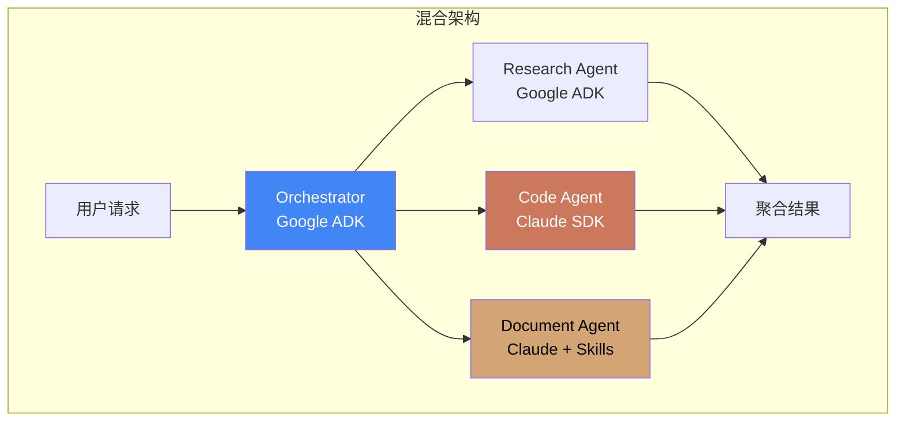

**实现思路**：

1. 使用 ADK 作为顶层编排器
2. 代码相关任务委托给 Claude Agent SDK
3. 文档处理使用 Claude + Skills
4. 通过 API 或 MCP 进行跨框架通信

---

## 7. 结论与建议

### 7.1 框架选择建议

| 需求场景                    | 推荐方案                               |
| --------------------------- | -------------------------------------- |
| 需要复杂的 Multi-Agent 协作 | **Google ADK**                         |
| 以代码编辑为主的任务        | **Claude Agent SDK**                   |
| 需要 Office 文档处理        | **Claude + Agent Skills**              |
| 需要企业级部署和监控        | **Google ADK + Agent Engine**          |
| 快速构建原型                | **Claude Agent SDK**                   |
| 需要跨会话记忆              | **Google ADK + Vertex AI Memory Bank** |

### 7.2 本项目集成建议

基于本项目（AI Agent 研究库）的特点，建议：

1. **短期**：使用 Claude Agent SDK 实现代码分析和文档处理功能
2. **中期**：引入 Google ADK 构建多 Agent 研究工作流
3. **长期**：采用混合架构，发挥两者优势

### 7.3 未来发展趋势

1. **标准化**：MCP 和 A2A 等协议将促进跨框架互操作
2. **专业化**：Skills 类模块化能力扩展将成为主流
3. **托管化**：云端托管 Agent 服务将降低运维门槛

---

## 8. References

<a id="ref1"></a>[1] Google, "Agent Development Kit (ADK) Documentation," 2024. [Online]. Available: https://google.github.io/adk-docs/

<a id="ref2"></a>[2] Anthropic, "Claude Agent SDK Overview," 2024. [Online]. Available: https://platform.claude.com/docs/en/agent-sdk/overview

<a id="ref3"></a>[3] Anthropic, "Agent Skills Overview," 2024. [Online]. Available: https://platform.claude.com/docs/en/agents-and-tools/agent-skills/overview

<a id="ref4"></a>[4] Google, "Google ADK - Agents Documentation," 2024. [Online]. Available: https://google.github.io/adk-docs/agents/

<a id="ref5"></a>[5] Google, "Google ADK - LLM Agents," 2024. [Online]. Available: https://google.github.io/adk-docs/agents/llm-agents/

<a id="ref6"></a>[6] Google, "Google ADK - Workflow Agents," 2024. [Online]. Available: https://google.github.io/adk-docs/agents/workflow-agents/

<a id="ref7"></a>[7] Google, "Google ADK - Tools for Agents," 2024. [Online]. Available: https://google.github.io/adk-docs/tools/

<a id="ref8"></a>[8] Google, "Google ADK - Sessions & Memory," 2024. [Online]. Available: https://google.github.io/adk-docs/sessions/

<a id="ref9"></a>[9] Google, "Google ADK - Memory Service," 2024. [Online]. Available: https://google.github.io/adk-docs/sessions/memory/

<a id="ref10"></a>[10] Google, "Google ADK - Context Management," 2024. [Online]. Available: https://google.github.io/adk-docs/context/

<a id="ref11"></a>[11] Google, "Google ADK - Multi-Agent Systems," 2024. [Online]. Available: https://google.github.io/adk-docs/agents/multi-agents/

<a id="ref12"></a>[12] Google, "Google ADK - MCP Protocol Support," 2024. [Online]. Available: https://google.github.io/adk-docs/mcp/

<a id="ref13"></a>[13] Google, "Google ADK - A2A Protocol Support," 2024. [Online]. Available: https://google.github.io/adk-docs/a2a/

<a id="ref14"></a>[14] Google, "Google ADK - Deployment Guide," 2024. [Online]. Available: https://google.github.io/adk-docs/deploy/

<a id="ref15"></a>[15] Google, "Google ADK - Evaluation Framework," 2024. [Online]. Available: https://google.github.io/adk-docs/evaluate/

<a id="ref16"></a>[16] Google, "Google ADK - Safety Best Practices," 2024. [Online]. Available: https://google.github.io/adk-docs/safety/

<a id="ref17"></a>[17] Anthropic, "Claude Agent SDK Quickstart," 2024. [Online]. Available: https://platform.claude.com/docs/en/agent-sdk/quickstart
