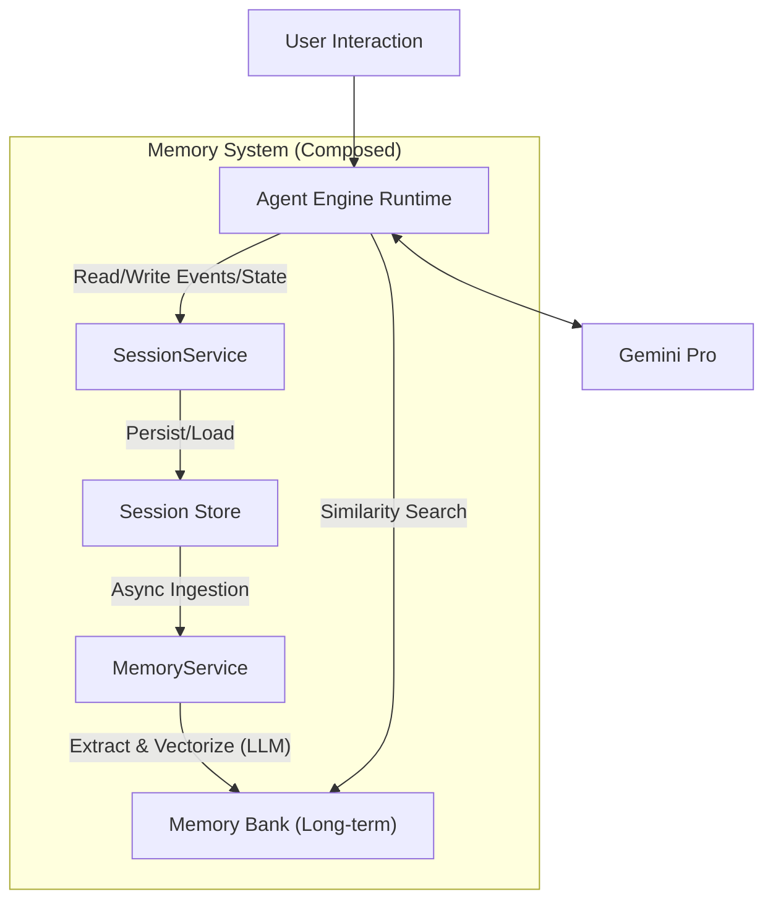
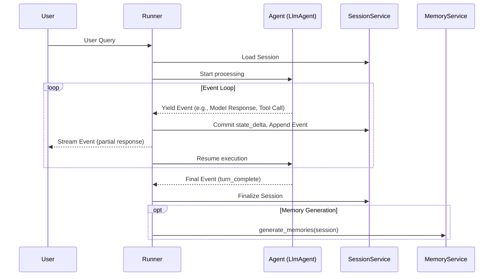

## 1. 概述与定位

**Google Vertex AI Agent Builder** 是 Google Cloud 推出的一站式智能体开发平台，其核心价值在于将 LLM 的推理能力与企业级的基础设施（Runtime, Memory, Integration）相结合。对于本项目而言，它是 **"Composed Architecture"**（组合式架构）的最佳参考范本，而我们的目标是 **复刻、甚至优化并验证 Agent Engine** 的能力。

---

## 2. Vertex AI Agent Engine 核心架构解析

Google 的架构设计体现了典型的 "Managed Service Mesh" 思路，将不同的复杂性剥离给专有的云服务。

### 2.1 核心服务 (Agent Engine Services)

| 服务                         | 官方说明                                                                                                                 | 验证目标                                                             |
| :--------------------------- | :----------------------------------------------------------------------------------------------------------------------- | :------------------------------------------------------------------- |
| **Runtime**                  | 托管式部署环境，支持 VPC-SC、IAM 认证、自动扩缩容。 兼容 LangChain, LangGraph, LlamaIndex, ADK, CrewAI, AG2 等框架。 | 不自建 Runtime，但需适配 Session 规范。                              |
| **Sessions**                 | 管理单次会话的交互历史（Events）、临时状态（State）。 上下文管理的核心数据结构。                                     | **Phase 1/2 核心**：用 PG 表结构模拟 Session 的 Events 和 State。    |
| **Memory Bank**              | 跨会话的长期记忆服务。 自动从 Session 中提取 Insights，支持相似度检索。                                              | **Phase 2 核心**：实现 PG 版本的 `MemoryService`。                   |
| **Code Execution (Preview)** | 安全沙箱执行代码。                                                                                                       | 超出本阶段范围。                                                     |
| **Example Store (Preview)**  | 存储和动态检索 Few-shot 示例以提升 Agent 性能。                                                                          | 可作为后续优化方向，存入 PG JSON 列。                                |
| **Observability**            | 集成 Cloud Trace (OpenTelemetry), Cloud Monitoring, Cloud Logging。                                                      | 参考其 Tracing 设计，计划在 `unified_agent_backend.py` 中集成 OTEL。 |

### 2.2 Session / State / Memory 概念解析 (官方定义)

根据官方文档，这三者是 ADK 中管理对话上下文的核心抽象：

1.  **Session (当前会话)**:

    - 代表用户与 Agent 之间 **单次、进行中的交互**。
    - 包含按时间顺序排列的消息与操作序列 (**Events**)。
    - 可持有仅与本次对话相关的临时数据 (**State**)。

2.  **State (`session.state`)**:

    - 存储在特定 `Session` **内部** 的数据。
    - 仅适用于当前活跃的对话线程（如本次聊天中的购物车项目、用户偏好）。

3.  **Memory (跨会话信息)**:
    - 代表 **可能跨越多个历史会话** 或包含外部数据源的信息存储。
    - 充当 Agent 可搜索的知识库，用于回忆即时对话之外的信息或上下文。

> [!IMPORTANT]
>
> `State` 是"单次会话内的临时变量"，而 `Memory` 是"跨会话的持久化知识"。这与 Context Engineering 中的 `Short-term (Session Log)` vs. `Episodic/Semantic (Long-term Memory)` 的划分完全对应。

### 2.3 关键架构流 (Architecture Flow)

**流程说明**：

1. **交互与执行**：用户请求进入 Runtime，Runtime 基于 Event Loop 编排与 LLM 的多轮交互。
2. **会话管理 (Session Path)**：
   - `SessionService` 负责 Session 的生命周期：Create, Get, Append Events, Update State, Delete。
   - 会话数据（Events, State）持久化到 `SessionStore`。
3. **记忆生成 (Memory Path)**：
   - `MemoryService` 负责将 Session 数据 **异步** 摄入长期记忆。
   - Memory Bank 使用 LLM 从 Session History 中 **提取 (Extraction)** 有意义的信息，并与现有记忆 **融合 (Consolidation)**。
4. **记忆检索 (Read Path)**：Runtime 在处理新请求时，通过 `MemoryService` 的相似度检索召回相关记忆。

**架构对比**: Google 的方案逻辑上涉及至少 3-4 个组件 (SessionService + SessionStore + MemoryService + MemoryBank)。OceanBase 的 **Unified Architecture** 试图将上述所有组件合并为一个 HTAP 数据库集群，通过表设计和事务来实现等效能力。

---

## 3. Google Agent Development Kit (ADK) 深度剖析

**ADK** 是 Google 提供的开源框架（支持 Python, TypeScript, Java, Go），用于构建可移植的 Agent。其设计理念是 **"让 Agent 开发感觉更像软件开发"**。

### 3.1 核心 Runtime 架构 (The Event Loop)

ADK Runtime 的核心是 **Event Loop**。它定义了 `Runner` 与执行逻辑（Agent, Tool, Callback）之间的交互模式：

**关键行为**:

- **State Commit Timing**: `state_delta` 仅在 Event 被 Runner 处理后才提交。执行逻辑在 yield Event **之后**才能看到其对 State 的更改生效（类似数据库事务的 "read-your-writes" 保证需要等待 commit）。
- **"Dirty Reads"**: 在同一 Invocation 内，后续的 Agent/Tool 可以看到之前修改但 **尚未最终 Commit** 的 State（这是一种乐观机制，但最终一致性由 Runner 保证）。

### 3.2 关键组件与服务接口 (Services)

| 组件/接口             | 职责                                                                                                                                   | 适配方案                                                                                                                   |
| :-------------------- | :------------------------------------------------------------------------------------------------------------------------------------- | :------------------------------------------------------------------------------------------------------------------------- |
| **`Runner`**          | 编排器，管理 Event Loop，协调 Services，处理 `event.actions`。                                                                         | 直接使用 ADK 的 `Runner`，无需修改。                                                                                       |
| **`SessionService`**  | 管理 `Session` 对象的生命周期：CRUD、`state_delta` 应用、Events 追加。提供 `InMemorySessionService`, `VertexAiSessionService` 等实现。 | **实现 `SessionService`**。将 `session.state` 存入 JSON 列，将 `events` 存入 append-only 日志表，利用 PG 事务保证一致性。  |
| **`MemoryService`**   | 管理长期记忆：将 Session 数据摄入 Memory Store，提供相似度检索。提供 `InMemoryMemoryService`, `VertexAiMemoryBankService` 实现。       | **实现 `MemoryService`**。利用 PG 向量列和 `DBMS_HYBRID_SEARCH` 实现 `add_session_to_memory()` 和 `search_memory()` 方法。 |
| **`ArtifactService`** | 管理二进制文件（如用户上传的图片）。                                                                                                   | 可通过 GCS 或 PG BLOB 列实现，优先级较低。                                                                                 |
| **Event**             | 传递原子操作：user input, model response, tool call/result, state change。                                                             | 直接使用 ADK 的 `Event` 结构，其 `actions.state_delta` 会被 `SessionService` 解析并应用到 PG。                             |
| **InvocationContext** | 封装单次用户请求周期的所有信息，包含 `invocation_id`，`temp:` 前缀的 State 仅在单次 Invocation 内有效。                                | 直接使用，无需特殊适配。                                                                                                   |

### 3.3 Callbacks (Guardrails & Logging)

ADK 提供了丰富的 Callback 钩子，用于在 Agent 执行流程的关键点插入自定义逻辑：

- `before_agent_callback`, `after_agent_callback`
- `before_model_callback`, `after_model_callback`
- `before_tool_callback`, `after_tool_callback`

**适配方案**: 利用 `after_tool_callback` 将工具调用结果和延迟等信息写入 PG 的审计日志表，实现完整的 **Traceability**。

---

## 4. 框架兼容性 (Supported Frameworks)

根据官方文档，Vertex AI Agent Engine 支持以下 Agent 框架：

| 框架             | 支持级别            | 备注                                                |
| :--------------- | :------------------ | :-------------------------------------------------- |
| **ADK**          | Native / Primary    | Google 自家框架，与 Agent Engine 集成度最高。       |
| **LangGraph**    | Supported           | 官方提供 Notebook 和文档。                          |
| **LangChain**    | Supported           | 官方提供 Notebook 和文档。                          |
| **LlamaIndex**   | Supported           | Query Engine 和 Agent 模式均可部署。                |
| **CrewAI**       | Supported           | 官方提供 Notebook。                                 |
| **AG2**          | Supported           | 官方提供文档。                                      |
| **Custom**       | Supported           | 任何 Python 框架均可通过自定义 `query()` 方法部署。 |
| **A2A Protocol** | Supported (Preview) | Agent-to-Agent 开放协议，允许跨框架 Agent 协作。    |

> [!TIP]
>
> 我们需要使用 PG、Weaviate 等介质来适配 **ADK**（或 **LangGraph**、**Agno** 等 Agent Framework），ADK 的 Service 抽象（`SessionService`, `MemoryService`）设计得非常干净，适合作为不同介质适配的标准接口。

---

## 附录：官方资源链接

| 资源                  | 链接                                                                          |
| :-------------------- | :---------------------------------------------------------------------------- |
| Agent Engine Overview | https://docs.cloud.google.com/agent-builder/agent-engine/overview             |
| Sessions Overview     | https://docs.cloud.google.com/agent-builder/agent-engine/sessions/overview    |
| Memory Bank Overview  | https://docs.cloud.google.com/agent-builder/agent-engine/memory-bank/overview |
| ADK Docs (Index)      | https://google.github.io/adk-docs/                                            |
| ADK Runtime           | https://google.github.io/adk-docs/runtime/                                    |
| ADK Sessions Concepts | https://google.github.io/adk-docs/sessions/                                   |
| ADK GitHub (Python)   | https://github.com/google/adk-python                                          |
| Agent Starter Pack    | https://github.com/GoogleCloudPlatform/agent-starter-pack                     |
