> [!IMPORTANT]
>
> **调研目标**：深入分析 RAGFlow、WeKnora 等主流 Knowledge Base 系统的 RAG Pipeline 与 Hybrid Search 实现，归纳最佳实践与技术选型指南。

---

## 目录

1. [概述](#1-概述)
2. [RAG 技术演进](#2-rag-技术演进)
3. [核心 Knowledge Base 系统深度分析](#3-核心-knowledge-base-系统深度分析)
4. [RAG Pipeline 完整流程](#4-rag-pipeline-完整流程)
5. [Hybrid Search 技术深度解析](#5-hybrid-search-技术深度解析)
6. [文档解析与 Chunking 策略](#6-文档解析与-chunking-策略)
7. [向量检索与重排序机制](#7-向量检索与重排序机制)
8. [Graph RAG 与 Agentic RAG](#8-graph-rag-与-agentic-rag)
9. [系统架构对比与选型指南](#9-系统架构对比与选型指南)
10. [可行性分析与实践建议](#10-可行性分析与实践建议)
11. [References](#references)

---

## 1. 概述

### 1.1 Knowledge Base 系统定义

Knowledge Base（知识库）系统是一种将结构化与非结构化数据转化为可检索知识的智能平台。现代 Knowledge Base 系统通过 **RAG（Retrieval-Augmented Generation）** 技术，将外部知识与大语言模型（LLM）深度融合，实现高质量的问答与知识服务<sup>[[1]](#ref1)</sup>。

> **核心价值**：就像一位博学的图书管理员，Knowledge Base 系统不仅知道书籍在哪里（检索），还能理解你的问题并给出精准答案（生成）。

### 1.2 调研范围

本报告深入调研以下 Knowledge Base 系统：

| 项目          | 开发者     | 定位                         | GitHub Stars |
| ------------- | ---------- | ---------------------------- | ------------ |
| **RAGFlow**   | Infiniflow | 深度文档理解 RAG 引擎        | 45K+         |
| **WeKnora**   | Tencent    | LLM 驱动的文档理解与检索框架 | 2K+          |
| **Dify**      | LangGenius | 生产级 Agentic 工作流平台    | 90K+         |
| **FastGPT**   | Labring    | 可视化 AI 工作流知识库       | 25K+         |
| **QAnything** | 网易有道   | 本地知识库问答系统           | 15K+         |
| **Quivr**     | QuivrHQ    | 个人知识助手                 | 40K+         |
| **Danswer**   | Danswer-AI | 企业搜索平台                 | 15K+         |
| **Haystack**  | Deepset    | 模块化 NLP 框架              | 20K+         |

---

## 2. RAG 技术演进

### 2.1 RAG 原论文与核心思想

RAG（Retrieval-Augmented Generation）由 Patrick Lewis 等人于 2020 年提出<sup>[[2]](#ref2)</sup>，其核心思想是将**检索（Retrieval）** 与**生成（Generation）** 相结合，让 LLM 能够访问外部知识库，从而生成更准确、更有依据的回答。

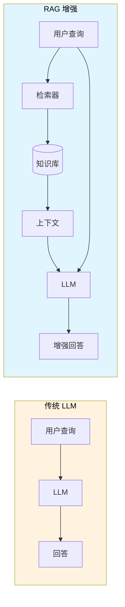

> **类比**：传统 LLM 就像一个闭卷考试的学生，只能依赖记忆作答；RAG 增强的 LLM 则像开卷考试，可以查阅资料后给出更准确的答案。

### 2.2 RAG 与 REALM 的关系

RAG 是 REALM（Retrieval-Augmented Language Model Pre-Training）的后继者<sup>[[3]](#ref3)</sup>。两者共享"将检索集成到预训练系统"的核心理念，但 RAG 将其扩展到了序列到序列生成任务，而 REALM 主要聚焦于开放域抽取式问答。

### 2.3 技术演进路线

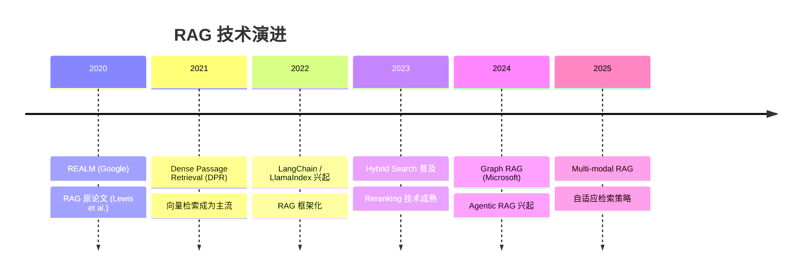

---

## 3. 核心 Knowledge Base 系统深度分析

### 3.1 RAGFlow

**定位**：领先的开源 RAG 引擎，专注于深度文档理解<sup>[[4]](#ref4)</sup>

#### 核心特性

1. **深度文档理解（DeepDoc）**

   - 基于视觉的文档布局分析
   - 支持复杂格式：PDF 表格、多栏布局、扫描件 OCR
   - 多模态模型处理图像内容

2. **模板化分块（Template-based Chunking）**

   - 智能且可解释的分块策略
   - 多种模板选项适配不同文档类型
   - 可视化分块结果，支持人工干预

3. **混合检索 + 融合重排序**

   - Multiple Recall（多路召回）
   - Fused Re-ranking（融合重排序）
   - 可配置的 LLM 和 Embedding 模型

4. **引用溯源**
   - 答案引用可追溯
   - 减少幻觉产生

#### 系统架构

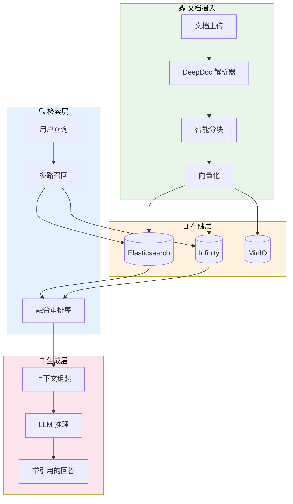

#### 技术栈

| 组件     | 技术选型                 |
| -------- | ------------------------ |
| 后端     | Python / FastAPI         |
| 前端     | React / TypeScript       |
| 文档引擎 | Elasticsearch / Infinity |
| 对象存储 | MinIO                    |
| 任务队列 | Celery / Redis           |
| 容器化   | Docker Compose           |

---

### 3.2 WeKnora

**定位**：腾讯开源的 LLM 驱动文档理解与检索框架<sup>[[5]](#ref5)</sup>

#### 核心特性

1. **ReACT Agent 模式**

   - 支持工具调用、MCP 工具、Web 搜索
   - 多轮迭代与反思机制
   - 生成综合性报告

2. **混合检索策略**

   - 关键词 + 向量 + 知识图谱
   - 跨知识库检索支持
   - 可配置检索阈值

3. **多类型知识库**

   - FAQ 与文档知识库
   - 文件夹导入、URL 导入
   - 标签管理与在线编辑

4. **MCP 工具集成**
   - 内置 uvx/npx 启动器
   - 多种传输方式支持
   - 扩展 Agent 能力

#### 系统架构

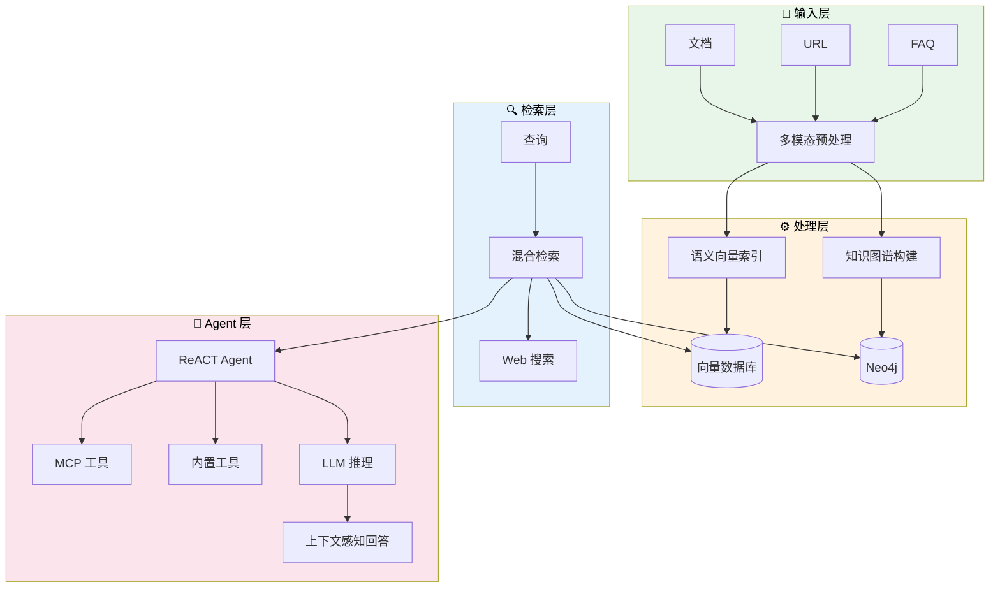

---

### 3.3 Dify

**定位**：生产级 Agentic 工作流开发平台<sup>[[6]](#ref6)</sup>

#### 核心特性

1. **可视化工作流编排**

   - 拖拽式 AI 工作流构建
   - 条件分支与循环支持
   - 工作流版本管理

2. **全面的模型支持**

   - 数百种 LLM 无缝集成
   - 自托管模型支持
   - OpenAI 兼容 API

3. **完整 RAG Pipeline**

   - 文档摄入到检索全流程
   - PDF/PPT 等格式开箱即用
   - 可配置的 Embedding 模型

4. **LLMOps 能力**
   - 应用日志监控与分析
   - 基于生产数据持续优化
   - Prompt 管理与版本控制

---

### 3.4 QAnything

**定位**：网易有道开源的本地知识库问答系统<sup>[[7]](#ref7)</sup>

#### 核心特性

1. **两阶段检索架构**

   - 第一阶段：Embedding 检索（高召回）
   - 第二阶段：Rerank 精排（高精度）
   - 数据量越大，效果越好

2. **BCEmbedding 双语检索**

   - 中英双语高性能
   - MTEB 语义表示评估领先
   - LlamaIndex RAG 评估 SOTA

3. **硬件友好**
   - 纯 CPU 环境可运行
   - 跨平台支持（Windows/Mac/Linux）
   - 一键安装部署

#### 两阶段检索优势

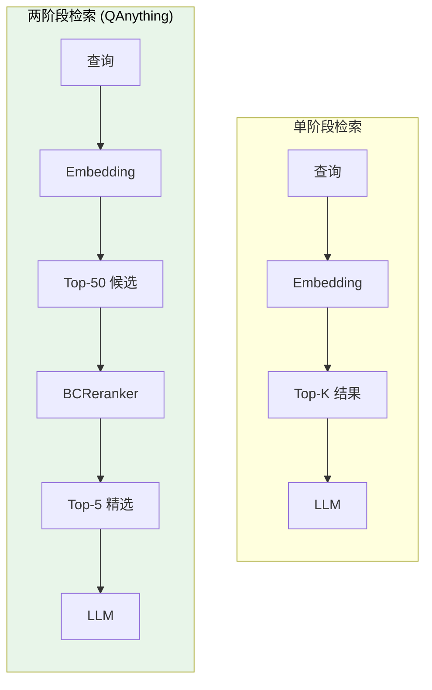

> **关键洞察**：随着知识库数据量增加，单阶段 Embedding 检索会出现退化，而两阶段检索通过 Rerank 可以保持稳定甚至提升的准确率。

---

### 3.5 其他系统概览

#### Quivr

- **定位**：个人知识助手（"第二大脑"）
- **核心组件**：Megaparse（文档摄入）、Quivr Core（RAG 引擎）、Le Juge（评估框架）
- **特点**：用户意图检测、动态 Chunk 检索、自托管数据主权

#### Danswer

- **定位**：企业搜索平台
- **特点**：
  - 丰富的企业连接器（Google Drive、Slack、Confluence 等）
  - 混合搜索（语义 + 关键词）
  - 多轮索引策略
  - 文档级权限控制

#### Haystack

- **定位**：模块化 NLP 框架
- **架构**：Nodes + Pipelines（DAG）
- **特点**：
  - 高度可定制的 RAG Pipeline
  - 支持 HyDE、Query Expansion 等高级技术
  - LLM 无关（支持多种模型）

---

## 4. RAG Pipeline 完整流程

### 4.1 标准 RAG Pipeline 架构

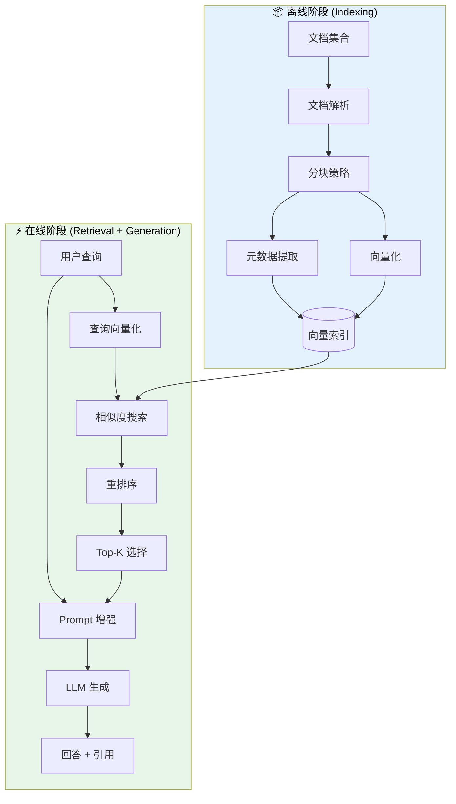

### 4.2 各阶段详解

#### 阶段一：文档解析（Parsing）

| 文档类型 | 解析技术       | 挑战               |
| -------- | -------------- | ------------------ |
| PDF      | OCR + 布局分析 | 表格、多栏、扫描件 |
| Word/PPT | 结构提取       | 嵌入式对象         |
| 网页     | HTML 解析      | 动态内容、噪声去除 |
| 图像     | 多模态模型     | 图文关联理解       |

#### 阶段二：分块策略（Chunking）

详见 [第 6 章](#6-文档解析与-chunking-策略)

#### 阶段三：向量化（Embedding）

- **Embedding 模型选择**：text-embedding-ada-002、BGE、BCE 等
- **维度平衡**：高维（更精确）vs 低维（更快速、更节省存储）
- **批处理优化**：大规模文档的并行处理

#### 阶段四：检索（Retrieval）

详见 [第 5 章](#5-hybrid-search-技术深度解析) 和 [第 7 章](#7-向量检索与重排序机制)

#### 阶段五：生成（Generation）

- **Prompt 模板设计**：系统提示 + 检索上下文 + 用户查询
- **上下文窗口管理**：Token 限制下的信息优先级
- **引用生成**：可追溯的答案来源

---

## 5. Hybrid Search 技术深度解析

### 5.1 为什么需要 Hybrid Search

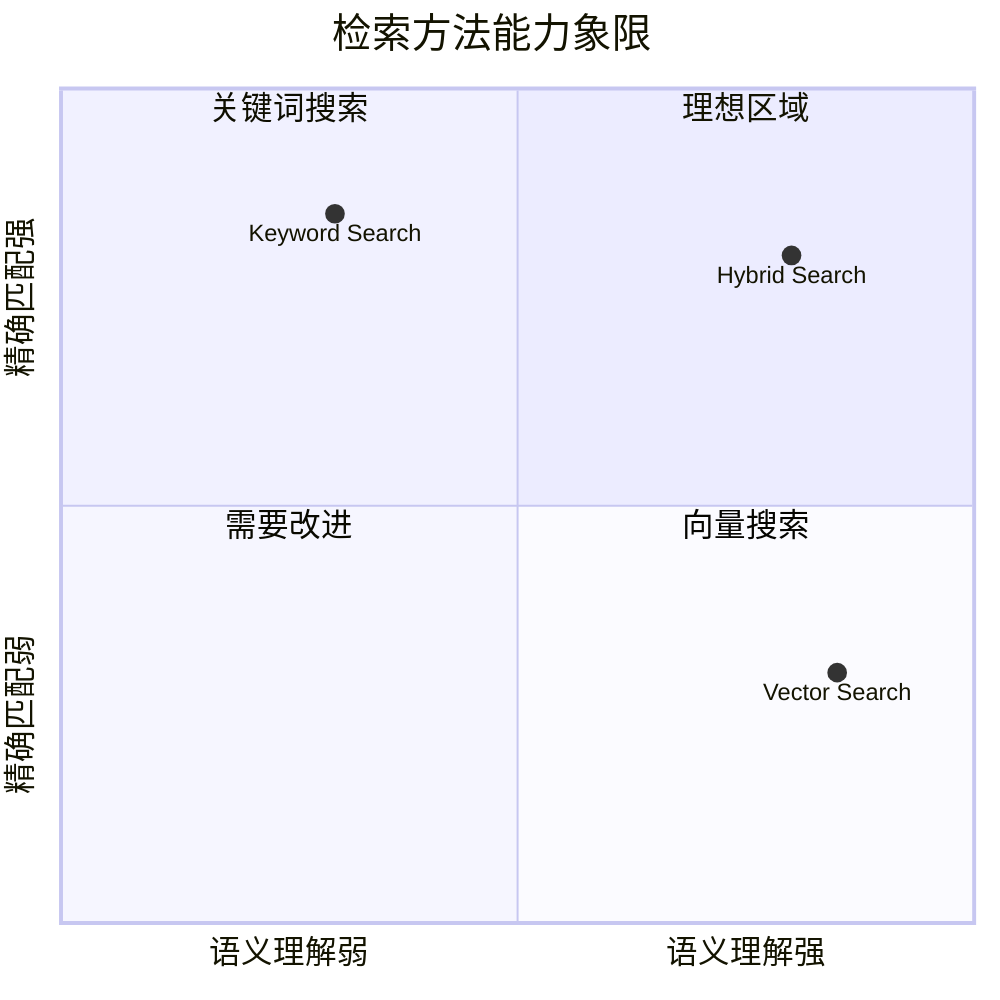

| 检索类型       | 优势                           | 劣势                     |
| -------------- | ------------------------------ | ------------------------ |
| **关键词搜索** | 精确匹配专有名词、代码、缩写   | 无法理解语义、同义词     |
| **向量搜索**   | 语义理解、处理同义词和拼写错误 | 可能稀释精确术语的匹配度 |
| **混合搜索**   | 兼顾精确性和语义理解           | 需要权重调优             |

### 5.2 Hybrid Search 实现方案

#### 方案一：并行检索 + 结果融合

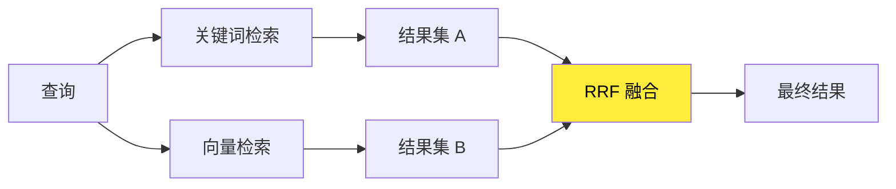

**Reciprocal Rank Fusion (RRF)** 公式：

$$RRF(d) = \sum_{r \in R} \frac{1}{k + rank_r(d)}$$

其中 $k$ 通常取 60，$rank_r(d)$ 是文档 $d$ 在结果集 $r$ 中的排名。

#### 方案二：加权评分

```python
# 典型权重配置
hybrid_score = 0.7 * semantic_score + 0.3 * keyword_score
```

> **最佳实践**：初始可采用 70% 语义 + 30% 关键词的配置，然后根据具体数据集和用例进行 A/B 测试调优<sup>[[8]](#ref8)</sup>。

### 5.3 主流系统的 Hybrid Search 实现

| 系统      | 实现方式                          | 特点               |
| --------- | --------------------------------- | ------------------ |
| RAGFlow   | Multiple Recall + Fused Reranking | 多路召回，融合重排 |
| WeKnora   | 关键词 + 向量 + 知识图谱          | 三路混合           |
| Danswer   | 语义 + 关键词 + 多轮索引          | 企业级优化         |
| QAnything | Embedding + Rerank 两阶段         | 专注双语场景       |

---

## 6. 文档解析与 Chunking 策略

### 6.1 Chunking 策略对比

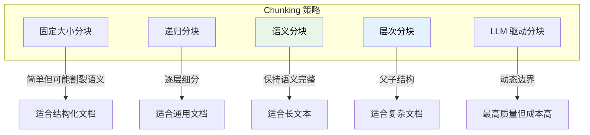

### 6.2 各策略详解

#### 固定大小分块（Fixed-size Chunking）

- **方法**：按固定字符数或 Token 数切分
- **优点**：简单、可预测
- **缺点**：可能割裂句子或段落

#### 递归分块（Recursive Chunking）

- **方法**：按优先级使用分隔符（段落 → 句子 → 单词）
- **优点**：尊重自然文本边界
- **缺点**：Chunk 大小不均匀

#### 语义分块（Semantic Chunking）

- **方法**：基于 Embedding 相似度判断分割点
- **优点**：保持语义完整性
- **缺点**：计算成本较高

```python
# 语义分块伪代码
def semantic_chunk(text, threshold=0.85):
    sentences = split_to_sentences(text)
    embeddings = embed(sentences)
    chunks = []
    current_chunk = [sentences[0]]

    for i in range(1, len(sentences)):
        similarity = cosine_sim(embeddings[i], embeddings[i-1])
        if similarity < threshold:
            chunks.append(' '.join(current_chunk))
            current_chunk = []
        current_chunk.append(sentences[i])

    return chunks
```

#### 层次分块（Hierarchical Chunking）

- **方法**：创建父子 Chunk 结构
- **应用**：检索子 Chunk，返回父 Chunk 提供更多上下文
- **Amazon Bedrock 2024** 重点推出的策略<sup>[[9]](#ref9)</sup>

### 6.3 最佳实践建议

| 场景      | 推荐策略        | Chunk 大小              |
| --------- | --------------- | ----------------------- |
| 技术文档  | 递归分块        | 256-512 tokens          |
| 长篇文章  | 语义分块        | 动态                    |
| 法律/合同 | 层次分块        | 父: 1024, 子: 256       |
| 对话记录  | 固定大小 + 重叠 | 128 tokens, 20% overlap |

---

## 7. 向量检索与重排序机制

### 7.1 Dense Passage Retrieval (DPR)

DPR 是现代向量检索的基石<sup>[[10]](#ref10)</sup>，采用双编码器架构：

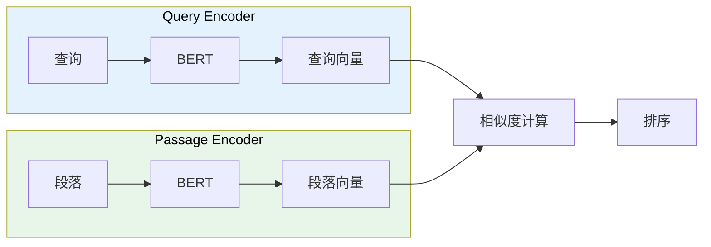

### 7.2 向量索引技术

| 索引类型 | 算法     | 特点               |
| -------- | -------- | ------------------ |
| **Flat** | 暴力搜索 | 100% 精确，但慢    |
| **IVF**  | 倒排索引 | 分区加速，精度可调 |
| **HNSW** | 图索引   | 高精度，内存占用大 |
| **PQ**   | 乘积量化 | 压缩存储，速度快   |

**FAISS**（Facebook AI Similarity Search）是最常用的向量索引库<sup>[[11]](#ref11)</sup>。

### 7.3 重排序（Reranking）

重排序是 RAG Pipeline 中提升精度的关键环节<sup>[[12]](#ref12)</sup>：

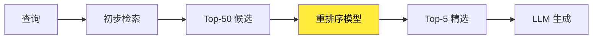

#### 重排序模型选择

| 模型                | 特点               | 适用场景 |
| ------------------- | ------------------ | -------- |
| **Cross-Encoder**   | 高精度，计算密集   | 精度优先 |
| **monoT5**          | 性能/效率平衡      | 通用场景 |
| **Cohere Reranker** | 商业 API，开箱即用 | 快速集成 |
| **BCE Reranker**    | 中英双语优秀       | 双语场景 |

### 7.4 Lost in the Middle 问题

研究表明，LLM 对长上下文中间部分的信息利用率较低。解决方案：

1. **Reverse Order**：按相关性升序排列（最相关在末尾）
2. **Sandwich Pattern**：最相关的放在开头和结尾

---

## 8. Graph RAG 与 Agentic RAG

### 8.1 Graph RAG

Microsoft Research 于 2024 年推出 GraphRAG<sup>[[13]](#ref13)</sup>，通过知识图谱增强 RAG 能力：

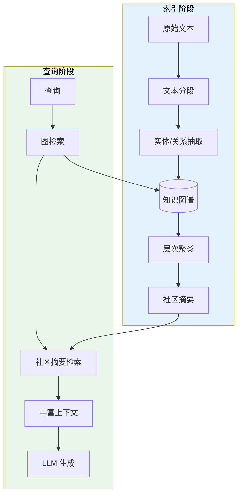

#### Graph RAG 优势

- **多跳推理**：连接分散的信息片段
- **全局理解**：生成跨文档的主题摘要
- **答案溯源**：提供结构化的推理路径

### 8.2 Agentic RAG

Agentic RAG 将 AI Agent 与 RAG 深度融合<sup>[[14]](#ref14)</sup>：

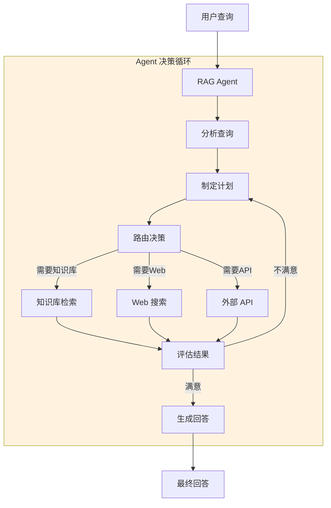

#### Agentic RAG 核心能力

| 能力         | 描述                       |
| ------------ | -------------------------- |
| **动态路由** | 智能选择检索来源           |
| **查询分解** | 将复杂查询拆解为子查询     |
| **自我验证** | 评估检索结果质量           |
| **迭代优化** | 多轮检索直到满意           |
| **工具调用** | 集成 API、计算器等外部工具 |

---

## 9. 系统架构对比与选型指南

### 9.1 全面对比矩阵

| 特性              | RAGFlow       | WeKnora      | Dify           | FastGPT      | QAnything         |
| ----------------- | ------------- | ------------ | -------------- | ------------ | ----------------- |
| **核心定位**      | 深度文档理解  | 企业文档检索 | Agentic 工作流 | 可视化知识库 | 本地问答          |
| **文档解析**      | DeepDoc (强)  | 多模态 (强)  | 通用 (中)      | 通用 (中)    | 通用 (中)         |
| **Hybrid Search** | ✅ 多路召回   | ✅ 三路混合  | ✅ 基础        | ✅ 基础      | ✅ 两阶段         |
| **知识图谱**      | ❌            | ✅ Neo4j     | ❌             | ❌           | ❌                |
| **Agent 能力**    | ✅ 基础       | ✅ ReACT     | ✅ 强          | ✅ 工作流    | ❌                |
| **MCP 支持**      | ✅            | ✅           | ✅             | ❌           | ❌                |
| **多语言**        | ✅ 跨语言查询 | ✅           | ✅             | ✅           | ✅ BCE 双语       |
| **部署复杂度**    | 中            | 中           | 低             | 低           | 低                |
| **资源需求**      | 高            | 中           | 中             | 低           | 低(纯 CPU 可运行) |

### 9.2 选型决策树

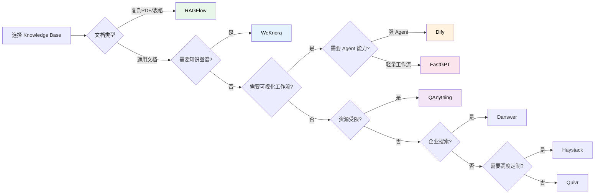

### 9.3 场景推荐

| 场景                  | 推荐系统          | 理由                  |
| --------------------- | ----------------- | --------------------- |
| **金融/法律文档处理** | RAGFlow           | 强大的 PDF 解析能力   |
| **企业知识管理**      | WeKnora / Danswer | 多源连接、知识图谱    |
| **快速原型验证**      | Dify / FastGPT    | 低代码、快速上手      |
| **本地隐私部署**      | QAnything         | 纯 CPU 运行、离线支持 |
| **复杂 NLP Pipeline** | Haystack          | 高度模块化、可定制    |
| **个人知识助手**      | Quivr             | 简单易用、自托管      |

---

## 10. 可行性分析与实践建议

### 10.1 技术可行性评估

#### 成熟度分析

| 技术            | 成熟度 | 风险等级 | 建议             |
| --------------- | ------ | -------- | ---------------- |
| 基础 RAG        | 高     | 低       | 可直接采用       |
| Hybrid Search   | 高     | 低       | 推荐作为标配     |
| 两阶段检索      | 高     | 低       | 大规模数据必备   |
| Graph RAG       | 中     | 中       | 复杂场景谨慎采用 |
| Agentic RAG     | 中     | 中       | 用于高级用例     |
| Multi-modal RAG | 低-中  | 中-高    | 实验性采用       |

### 10.2 实践建议

#### 渐进式实施路线

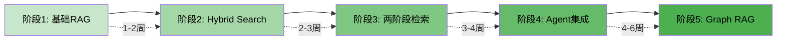

#### 关键成功因素

1. **数据质量**：垃圾进，垃圾出。文档解析质量直接决定 RAG 效果
2. **Chunking 调优**：针对具体文档类型优化分块策略
3. **Embedding 选择**：根据语言和领域选择合适的模型
4. **持续评估**：建立 RAG 质量评估体系（如 RAGAS）
5. **用户反馈闭环**：收集用户反馈持续优化

### 10.3 常见陷阱与规避

| 陷阱       | 症状           | 解决方案                       |
| ---------- | -------------- | ------------------------------ |
| 检索质量差 | 答案不相关     | 优化 Chunking + 引入 Reranking |
| 幻觉问题   | 编造信息       | 强化 System Prompt + 引用验证  |
| 上下文溢出 | Token 超限     | 压缩上下文 + 分层检索          |
| 延迟过高   | 响应慢         | 向量索引优化 + 缓存策略        |
| 扩展性问题 | 大规模数据退化 | 两阶段检索 + 分布式架构        |

---

## References

<a id="ref1"></a>[1] P. Lewis, E. Perez, A. Piktus, et al., "Retrieval-Augmented Generation for Knowledge-Intensive NLP Tasks," _Adv. Neural Inf. Process. Syst._, vol. 33, pp. 9459–9474, 2020.

<a id="ref2"></a>[2] P. Lewis, E. Perez, A. Piktus, et al., "Retrieval-Augmented Generation for Knowledge-Intensive NLP Tasks," _arXiv preprint arXiv:2005.11401_, 2020. [Online]. Available: https://arxiv.org/abs/2005.11401

<a id="ref3"></a>[3] K. Guu, K. Lee, Z. Tung, P. Pasupat, and M.-W. Chang, "REALM: Retrieval-Augmented Language Model Pre-Training," _arXiv preprint arXiv:2002.08909_, 2020.

<a id="ref4"></a>[4] Infiniflow, "RAGFlow: Open-source RAG Engine Based on Deep Document Understanding," GitHub, 2024. [Online]. Available: https://github.com/infiniflow/ragflow

<a id="ref5"></a>[5] Tencent, "WeKnora: LLM-powered Framework for Deep Document Understanding, Semantic Retrieval," GitHub, 2024. [Online]. Available: https://github.com/Tencent/WeKnora

<a id="ref6"></a>[6] LangGenius, "Dify: Production-ready Platform for Agentic Workflow Development," GitHub, 2024. [Online]. Available: https://github.com/langgenius/dify

<a id="ref7"></a>[7] Netease Youdao, "QAnything: Question and Answer based on Anything," GitHub, 2024. [Online]. Available: https://github.com/netease-youdao/QAnything

<a id="ref8"></a>[8] Meilisearch, "Hybrid Search Explained: Combining Semantic and Keyword Search," Meilisearch Blog, 2024. [Online]. Available: https://www.meilisearch.com/blog/hybrid-search

<a id="ref9"></a>[9] Amazon Web Services, "Advanced Parsing and Chunking in Amazon Bedrock Knowledge Bases," AWS Blog, Jul. 2024. [Online]. Available: https://aws.amazon.com/blogs/aws/amazon-bedrock-knowledge-bases-chunking

<a id="ref10"></a>[10] V. Karpukhin, B. Oğuz, S. Min, et al., "Dense Passage Retrieval for Open-Domain Question Answering," _arXiv preprint arXiv:2004.04906_, 2020.

<a id="ref11"></a>[11] Facebook AI, "FAISS: A Library for Efficient Similarity Search and Clustering of Dense Vectors," GitHub, 2024. [Online]. Available: https://github.com/facebookresearch/faiss

<a id="ref12"></a>[12] N. Reimers and I. Gurevych, "Sentence-BERT: Sentence Embeddings using Siamese BERT-Networks," _arXiv preprint arXiv:1908.10084_, 2019.

<a id="ref13"></a>[13] Microsoft Research, "GraphRAG: Unlocking LLM Discovery on Narrative Private Data," Microsoft Research Blog, Feb. 2024. [Online]. Available: https://www.microsoft.com/en-us/research/blog/graphrag

<a id="ref14"></a>[14] Weaviate, "Agentic RAG: The Next Evolution in Retrieval-Augmented Generation," Weaviate Blog, 2024. [Online]. Available: https://weaviate.io/blog/agentic-rag
