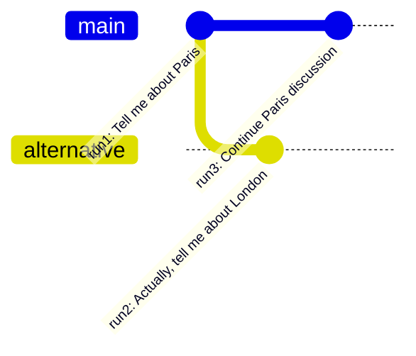

# AG-UI：Agent-User Interaction 协议深度调研报告

> **核心定位**：AG-UI 是连接 AI Agent 与用户界面的"最后一公里"协议，填补了 MCP（Agent-工具连接）和 A2A（Agent 间通信）在用户交互层的空白。

## 1. 协议概述与定位

### 1.1 什么是 AG-UI？

AG-UI（Agent-User Interaction Protocol）是一个**开放、轻量级、基于事件的协议**，专为 Agent-人类交互而设计<sup>[[1]](#ref1)</sup>。其核心理念是：

> 就像餐厅里的服务员（Agent）需要一套标准的沟通方式与顾客（User）互动，AG-UI 定义了 Agent 与前端应用之间的"菜单语言"和"下单流程"。

**协议核心特征**：

| 特征         | 描述                                         | 类比                           |
| ------------ | -------------------------------------------- | ------------------------------ |
| **事件驱动** | Agent 执行期间发射 ~16 种标准事件类型        | 餐厅厨房实时更新订单状态       |
| **双向交互** | Agent 接受用户输入，支持协作工作流           | 顾客可随时修改订单             |
| **传输无关** | 支持 SSE、WebSocket、Webhooks 等多种传输机制 | 电话、外卖 App、现场点餐都能用 |
| **灵活适配** | 事件格式无需完全匹配，只需 AG-UI 兼容        | 普通话、粤语都能听懂           |

### 1.2 AG-UI 在 Agentic 协议栈中的位置

```mermaid
graph TB
    subgraph "🔧 MCP - Model Context Protocol"
        MCP[Agent ↔ 工具/上下文]
    end

    subgraph "🤝 A2A - Agent to Agent"
        A2A[Agent ↔ Agent]
    end

    subgraph "👤 AG-UI - Agent User Interaction"
        AGUI[Agent ↔ 用户应用]
    end

    MCP --> Agent((AI Agent))
    A2A --> Agent
    AGUI --> Agent

    User((用户)) --> AGUI
    Tools((工具服务)) --> MCP
    OtherAgent((其他 Agent)) --> A2A

    style AGUI fill:#4ade80,stroke:#16a34a,stroke-width:3px,color:#000
    style MCP fill:#60a5fa,stroke:#2563eb,stroke-width:2px,color:#000
    style A2A fill:#f472b6,stroke:#db2777,stroke-width:2px,color:#000
    style Agent fill:#fbbf24,stroke:#d97706,stroke-width:2px,color:#000
```

AG-UI 与其他两大 Agentic 协议形成互补的"三角架构"<sup>[[2]](#ref2)</sup>：



**协议对比速查表**：

| 维度           | MCP                  | A2A                       | AG-UI                      |
| -------------- | -------------------- | ------------------------- | -------------------------- |
| **连接对象**   | Agent ↔ 工具/上下文  | Agent ↔ Agent             | Agent ↔ 用户应用           |
| **核心关注**   | 能力扩展             | Agent 协作                | 用户交互                   |
| **典型场景**   | 调用 API、访问数据库 | 多 Agent 协同解决复杂任务 | 实时聊天、表单填写、审批流 |
| **协议发起方** | Anthropic            | Google                    | CopilotKit                 |

### 1.3 设计原则

AG-UI 的设计遵循以下四大原则<sup>[[3]](#ref3)</sup>：

1. **事件驱动通信**：Agent 需要在执行期间发射 16 种标准化事件类型中的任意一种，创建供客户端处理的更新流
2. **双向交互**：Agent 接受用户输入，实现人机无缝协作工作流
3. **灵活事件结构**：事件无需完全匹配 AG-UI 格式——只需 AG-UI 兼容。这允许现有 Agent 框架以最小努力适配其原生事件格式
4. **传输无关**：AG-UI 不强制规定事件如何传递，支持 SSE、Webhooks、WebSockets 等多种传输机制

---

## 2. 核心架构设计

### 2.1 架构总览

```mermaid
flowchart TB
    subgraph "🖥️ Application Layer"
        App[用户应用<br/>Chat / AI-enabled App]
    end

    subgraph "📡 AG-UI Client Layer"
        Client[HttpAgent / 专用客户端]
        Middleware[中间件链]
    end

    subgraph "🔐 Secure Proxy Layer"
        Proxy[后端服务代理]
    end

    subgraph "🤖 Agent Layer"
        Agent[AI Agent<br/>LangGraph / CrewAI / ADK]
    end

    App --> Client
    Client --> Middleware
    Middleware --> Proxy
    Proxy --> Agent

    Agent -.->|事件流| Proxy
    Proxy -.->|事件流| Middleware
    Middleware -.->|事件流| Client
    Client -.->|事件流| App

    style App fill:#60a5fa,stroke:#2563eb,color:#000
    style Client fill:#4ade80,stroke:#16a34a,color:#000
    style Middleware fill:#a78bfa,stroke:#7c3aed,color:#000
    style Proxy fill:#fbbf24,stroke:#d97706,color:#000
    style Agent fill:#f472b6,stroke:#db2777,color:#000
```

AG-UI 的架构由四个核心层组成<sup>[[3]](#ref3)</sup>：



**各层职责**：

| 层级             | 职责                   | 关键组件                     |
| ---------------- | ---------------------- | ---------------------------- |
| **Application**  | 用户界面渲染、交互处理 | React/Vue 组件、CopilotKit   |
| **AG-UI Client** | 协议通信、事件订阅     | `HttpAgent`、`AbstractAgent` |
| **Middleware**   | 事件转换、认证、日志   | 自定义/内置中间件            |
| **Secure Proxy** | 安全代理、能力扩展     | 后端服务                     |
| **Agent**        | AI 推理、工具调用      | LangGraph、CrewAI、ADK       |

### 2.2 协议层实现

AG-UI 定义了统一的 Agent 执行接口<sup>[[3]](#ref3)</sup>：

```typescript
// 核心 Agent 执行接口
type RunAgent = () => Observable<BaseEvent>;

class MyAgent extends AbstractAgent {
  run(input: RunAgentInput): RunAgent {
    const { threadId, runId } = input;
    return () =>
      from([
        { type: EventType.RUN_STARTED, threadId, runId },
        {
          type: EventType.MESSAGES_SNAPSHOT,
          messages: [
            { id: "msg_1", role: "assistant", content: "Hello, world!" },
          ],
        },
        { type: EventType.RUN_FINISHED, threadId, runId },
      ]);
  }
}
```

**传输协议支持**：

| 传输方式        | 特点             | 适用场景             |
| --------------- | ---------------- | -------------------- |
| **HTTP SSE**    | 文本流、易于调试 | 开发调试、广泛兼容   |
| **HTTP Binary** | 高性能、空间高效 | 生产环境、大规模部署 |
| **WebSocket**   | 全双工、低延迟   | 实时交互、长连接     |

---

## 3. 事件系统详解

### 3.1 事件类型概览

AG-UI 定义了 **16 种标准事件类型**，分为五大类<sup>[[4]](#ref4)</sup>：


### 3.2 基础事件属性

所有事件共享以下基础属性<sup>[[4]](#ref4)</sup>：

```typescript
interface BaseEvent {
  type: EventType; // 事件类型枚举
  timestamp?: number; // 可选时间戳
  rawEvent?: any; // 可选原始事件（用于调试/兼容）
}
```

### 3.3 生命周期事件

生命周期事件追踪 Agent 运行的整体流程<sup>[[4]](#ref4)</sup>：

| 事件            | 描述     | 关键字段                                      |
| --------------- | -------- | --------------------------------------------- |
| `RUN_STARTED`   | 运行开始 | `runId`, `threadId`, `parentRunId?`, `input?` |
| `RUN_FINISHED`  | 运行完成 | `runId`, `threadId`, `result?`                |
| `RUN_ERROR`     | 运行出错 | `message`, `code`                             |
| `STEP_STARTED`  | 步骤开始 | `stepName`                                    |
| `STEP_FINISHED` | 步骤完成 | `stepName`                                    |

**典型生命周期流程**：

```mermaid
sequenceDiagram
    participant Client as AG-UI Client
    participant Agent as AI Agent

    Client->>Agent: runAgent(input)
    Agent-->>Client: RUN_STARTED

    loop 多个步骤
        Agent-->>Client: STEP_STARTED
        Agent-->>Client: TEXT_MESSAGE_CONTENT (流式)
        Agent-->>Client: STEP_FINISHED
    end

    Agent-->>Client: RUN_FINISHED
```



### 3.4 文本消息事件

用于流式传输 Assistant 消息<sup>[[4]](#ref4)</sup>：

```typescript
// 消息开始
{ type: EventType.TEXT_MESSAGE_START, messageId: "msg_123" }

// 内容流式传输（多次）
{ type: EventType.TEXT_MESSAGE_CONTENT, messageId: "msg_123", delta: "Hello" }
{ type: EventType.TEXT_MESSAGE_CONTENT, messageId: "msg_123", delta: ", world" }
{ type: EventType.TEXT_MESSAGE_CONTENT, messageId: "msg_123", delta: "!" }

// 消息结束
{ type: EventType.TEXT_MESSAGE_END, messageId: "msg_123" }
```

### 3.5 工具调用事件

支持流式工具调用，实现 Human-in-the-Loop<sup>[[4]](#ref4)</sup>：

```typescript
// 工具调用开始
{
  type: EventType.TOOL_CALL_START,
  toolCallId: "tool-123",
  toolCallName: "confirmAction",
  parentMessageId: "msg-456"  // 可选，关联消息
}

// 参数流式传输（JSON 片段）
{ type: EventType.TOOL_CALL_ARGS, toolCallId: "tool-123", delta: '{"act' }
{ type: EventType.TOOL_CALL_ARGS, toolCallId: "tool-123", delta: 'ion":"Depl' }
{ type: EventType.TOOL_CALL_ARGS, toolCallId: "tool-123", delta: 'oy the app"}' }

// 工具调用结束
{ type: EventType.TOOL_CALL_END, toolCallId: "tool-123" }
```

### 3.6 状态管理事件

支持 Agent 与前端之间的状态同步<sup>[[4]](#ref4)</sup>：

| 事件                | 描述                       | 使用场景                     |
| ------------------- | -------------------------- | ---------------------------- |
| `STATE_SNAPSHOT`    | 完整状态快照               | 初始化、连接恢复、大规模变更 |
| `STATE_DELTA`       | 增量状态更新（JSON Patch） | 频繁小更新、高效带宽利用     |
| `MESSAGES_SNAPSHOT` | 完整消息历史快照           | 对话恢复、历史同步           |

---

## 4. 消息结构与类型

### 4.1 基础消息结构

AG-UI 采用**厂商中立**的消息格式<sup>[[5]](#ref5)</sup>：

```typescript
interface BaseMessage {
  id: string; // 消息唯一标识
  role: string; // 发送者角色
  content?: string; // 可选文本内容
  name?: string; // 可选发送者名称
}
```

### 4.2 六种消息角色

```mermaid
graph TB
    subgraph "👤 Human Messages"
        User[user<br/>用户消息]
        Developer[developer<br/>开发者消息]
    end

    subgraph "🤖 AI Messages"
        Assistant[assistant<br/>助手消息]
        System[system<br/>系统消息]
    end

    subgraph "🔧 Functional Messages"
        Tool[tool<br/>工具结果]
        Activity[activity<br/>活动消息]
    end

    style User fill:#60a5fa,color:#000
    style Developer fill:#818cf8,color:#000
    style Assistant fill:#4ade80,color:#000
    style System fill:#fbbf24,color:#000
    style Tool fill:#f472b6,color:#000
    style Activity fill:#a78bfa,color:#000
```

AG-UI 定义了六种消息角色，覆盖各类交互场景<sup>[[5]](#ref5)</sup>：



**各角色详解**：

| 角色        | 描述                        | 特殊字段                                       |
| ----------- | --------------------------- | ---------------------------------------------- |
| `user`      | 用户输入（文本/多模态）     | `content: string \| InputContent[]`            |
| `assistant` | AI 助手回复                 | `toolCalls?: ToolCall[]`                       |
| `system`    | 系统指令/上下文             | -                                              |
| `tool`      | 工具执行结果                | `toolCallId: string`                           |
| `activity`  | 前端活动展示（非 LLM 可见） | `activityType`, `content: Record<string, any>` |
| `developer` | 开发者调试消息              | -                                              |

### 4.3 多模态输入支持

用户消息支持文本与二进制内容混合<sup>[[5]](#ref5)</sup>：

```typescript
interface UserMessage {
  id: string;
  role: "user";
  content: string | InputContent[]; // 支持多模态
  name?: string;
}

type InputContent = TextInputContent | BinaryInputContent;

interface BinaryInputContent {
  type: "binary";
  mimeType: string; // 如 "image/png"
  id?: string; // 引用 ID
  url?: string; // 远程 URL
  data?: string; // Base64 数据
  filename?: string; // 文件名
}
```

### 4.4 活动消息（Activity Messages）

活动消息是 AG-UI 的独特设计，用于前端 UI 展示而不发送给 LLM<sup>[[5]](#ref5)</sup>：

```typescript
interface ActivityMessage {
  id: string;
  role: "activity";
  activityType: string; // 如 "PLAN", "SEARCH", "SCRAPE"
  content: Record<string, any>; // 结构化 payload
}
```

**特点**：

- 通过 `ACTIVITY_SNAPSHOT` 和 `ACTIVITY_DELTA` 事件发射
- **仅前端可见**：不转发给 Agent，避免 LLM 混淆
- 可自定义 `activityType` 和 `content`，前端渲染匹配组件
- 支持流式更新：长时间操作的进度展示

---

## 5. 工具系统与 Human-in-the-Loop

### 5.1 工具定义

AG-UI 的工具采用 JSON Schema 定义参数<sup>[[6]](#ref6)</sup>：

```typescript
interface Tool {
  name: string         // 工具唯一标识
  description: string  // 人类可读描述（LLM 使用）
  parameters: {        // JSON Schema 参数定义
    type: "object"
    properties: { ... }
    required: string[]
  }
}
```

### 5.2 前端定义工具（Frontend-Defined Tools）

AG-UI 的关键创新是**前端定义工具**<sup>[[6]](#ref6)</sup>：

```typescript
// 前端定义确认工具
const confirmAction = {
  name: "confirmAction",
  description: "Ask the user to confirm a specific action before proceeding",
  parameters: {
    type: "object",
    properties: {
      action: {
        type: "string",
        description: "The action that needs user confirmation",
      },
      importance: {
        type: "string",
        enum: ["low", "medium", "high", "critical"],
        description: "The importance level of the action",
      },
    },
    required: ["action"],
  },
};

// 运行 Agent 时传入工具
agent.runAgent({
  tools: [confirmAction], // 前端控制工具可用性
  // ...
});
```

**设计优势**：

| 优势         | 说明                                  |
| ------------ | ------------------------------------- |
| **前端控制** | 前端决定 Agent 可用能力               |
| **动态能力** | 根据用户权限、上下文动态添加/移除工具 |
| **关注分离** | Agent 专注推理，前端处理工具实现      |
| **安全性**   | 敏感操作由应用控制，而非 Agent        |

### 5.3 工具调用生命周期

```mermaid
sequenceDiagram
    participant Agent as 🤖 AI Agent
    participant Client as 📱 AG-UI Client
    participant Frontend as 🖥️ Frontend
    participant User as 👤 User

    Agent->>Client: TOOL_CALL_START
    Agent->>Client: TOOL_CALL_ARGS (streaming)
    Agent->>Client: TOOL_CALL_END

    Client->>Frontend: 渲染工具 UI
    Frontend->>User: 显示确认对话框
    User->>Frontend: 用户输入/确认
    Frontend->>Client: 工具结果
    Client->>Agent: ToolMessage

    Agent->>Client: 继续处理...
```



### 5.4 Human-in-the-Loop 工作流

```mermaid
flowchart LR
    A[Agent 需要决策] --> B[调用 confirmAction]
    B --> C[前端显示对话框]
    C --> D[用户审核/修改]
    D --> E[返回结果给 Agent]
    E --> F[Agent 继续推理]

    style C fill:#60a5fa,color:#000
    style D fill:#4ade80,color:#000
```

AG-UI 原生支持人类参与的工作流<sup>[[6]](#ref6)</sup>：



**典型应用场景**：

| 场景           | 描述                       |
| -------------- | -------------------------- |
| **审批工作流** | AI 建议操作，人类审批执行  |
| **数据验证**   | 人类验证或修正 AI 生成数据 |
| **协作决策**   | AI 与人类共同解决复杂问题  |
| **监督学习**   | 人类反馈改进 AI 未来决策   |

---

## 6. 状态管理机制

### 6.1 共享状态架构

```mermaid
graph LR
    subgraph "🤖 Agent Side"
        AS[Agent State]
    end

    subgraph "📡 AG-UI Protocol"
        SS[STATE_SNAPSHOT]
        SD[STATE_DELTA]
    end

    subgraph "🖥️ Frontend Side"
        FS[Frontend State]
    end

    AS -->|完整同步| SS
    AS -->|增量更新| SD
    SS --> FS
    SD --> FS
    FS -.->|用户修改| AS

    style SS fill:#a78bfa,color:#000
    style SD fill:#a78bfa,color:#000
```

AG-UI 实现了 Agent 与前端之间的**双向状态共享**<sup>[[7]](#ref7)</sup>：



**共享状态特性**：

1. 跨交互持久化
2. Agent 和前端均可访问
3. 交互过程中实时更新
4. 为双方决策提供上下文

### 6.2 状态同步方法

#### State Snapshots（完整快照）

```typescript
interface StateSnapshotEvent {
  type: EventType.STATE_SNAPSHOT;
  snapshot: any; // 完整状态对象
}
```

**使用场景**：

- 交互开始时建立初始状态
- 连接中断后重新同步
- 发生需要完全刷新的重大状态变更

#### State Deltas（增量更新）

使用 **JSON Patch（RFC 6902）** 格式<sup>[[7]](#ref7)</sup>：

```typescript
interface StateDeltaEvent {
  type: EventType.STATE_DELTA;
  delta: JsonPatchOperation[];
}

interface JsonPatchOperation {
  op: "add" | "remove" | "replace" | "move" | "copy" | "test";
  path: string; // JSON Pointer (RFC 6901)
  value?: any; // add, replace 时使用
  from?: string; // move, copy 时使用
}
```

**操作示例**：

```json
// 添加用户偏好
{ "op": "add", "path": "/user/preferences", "value": { "theme": "dark" } }

// 替换对话状态
{ "op": "replace", "path": "/conversation_state", "value": "paused" }

// 移除临时数据
{ "op": "remove", "path": "/temporary_data" }

// 移动待办项到已完成
{ "op": "move", "path": "/completed_items", "from": "/pending_items/0" }
```

### 6.3 状态处理实现

AG-UI 使用 `fast-json-patch` 库处理状态更新<sup>[[7]](#ref7)</sup>：

```typescript
case EventType.STATE_DELTA: {
  const { delta } = event as StateDeltaEvent;
  try {
    // 原子性应用 JSON Patch，不修改原状态
    const result = applyPatch(state, delta, true, false);
    state = result.newDocument;
    return emitUpdate({ state });
  } catch (error: unknown) {
    console.warn(`Failed to apply state patch...`);
    return emitNoUpdate();
  }
}
```

**处理特性**：

- **原子性**：全部成功或全部失败
- **不可变性**：应用过程中不修改原状态
- **优雅降级**：错误被捕获并优雅处理

---

## 7. 序列化与持久化机制

AG-UI 提供了完整的事件流序列化支持，实现历史恢复、分支和压缩<sup>[[14]](#ref14)</sup>。

### 7.1 核心概念

> 就像 Git 管理代码版本一样，AG-UI 的序列化机制让你可以"保存"、"回溯"和"分支"对话历史。

| 概念                     | 描述                                          | 类比                    |
| ------------------------ | --------------------------------------------- | ----------------------- |
| **Stream Serialization** | 将完整事件历史转换为可移植格式（如 JSON）存储 | Git commit 保存代码快照 |
| **Event Compaction**     | 将冗余流压缩为快照，保留语义                  | Git squash 合并提交     |
| **Run Lineage**          | 使用 `parentRunId` 追踪对话分支               | Git branch 创建分支     |

### 7.2 RunStartedEvent 扩展

```typescript
type RunStartedEvent = BaseEvent & {
  type: EventType.RUN_STARTED;
  threadId: string;
  runId: string;
  /** 用于分支/时间旅行的父运行 ID */
  parentRunId?: string;
  /** 本次运行的精确 Agent 输入（可省略已在历史中的消息） */
  input?: AgentInput;
};
```

### 7.3 Event Compaction（事件压缩）

`compactEvents` 函数将冗余事件流压缩为精简形式<sup>[[15]](#ref15)</sup>：

```typescript
function compactEvents(events: BaseEvent[]): BaseEvent[];
```

**压缩规则**：

| 事件类型       | 压缩策略                                                               |
| -------------- | ---------------------------------------------------------------------- |
| **消息流**     | `TEXT_MESSAGE_START → *CONTENT → END` 合并为单个快照，拼接所有 `delta` |
| **工具调用**   | `TOOL_CALL_START → *ARGS → END` 合并，拼接参数片段                     |
| **状态更新**   | 连续 `STATE_DELTA` 合并为最终 `STATE_SNAPSHOT`                         |
| **输入规范化** | 从 `RunStarted.input.messages` 中移除已存在于历史的消息                |

**压缩示例**：

```typescript
// 压缩前：冗余的流式事件
[
  { type: "TEXT_MESSAGE_START", messageId: "m1", role: "assistant" },
  { type: "TEXT_MESSAGE_CONTENT", messageId: "m1", delta: "Hello" },
  { type: "TEXT_MESSAGE_CONTENT", messageId: "m1", delta: " " },
  { type: "CUSTOM", name: "thinking" },
  { type: "TEXT_MESSAGE_CONTENT", messageId: "m1", delta: "world" },
  { type: "TEXT_MESSAGE_END", messageId: "m1" },
]

// 压缩后：精简的快照
[
  { type: "TEXT_MESSAGE_START", messageId: "m1", role: "assistant" },
  { type: "TEXT_MESSAGE_CONTENT", messageId: "m1", delta: "Hello world" },
  { type: "TEXT_MESSAGE_END", messageId: "m1" },
  { type: "CUSTOM", name: "thinking" },  // 交错事件移到末尾
]
```

### 7.4 分支与时间旅行

通过 `parentRunId` 实现 Git 式的对话分支<sup>[[14]](#ref14)</sup>：



**分支示例**：

```typescript
// 原始运行
{
  type: "RUN_STARTED",
  threadId: "thread1",
  runId: "run1",
  input: { messages: ["Tell me about Paris"] }
}

// 从 run1 分支
{
  type: "RUN_STARTED",
  threadId: "thread1",
  runId: "run2",
  parentRunId: "run1",  // 关键：指向父运行
  input: { messages: ["Actually, tell me about London instead"] }
}
```

**使用场景**：

| 场景           | 描述                     |
| -------------- | ------------------------ |
| **持久化历史** | 存储更少帧，保留完整语义 |
| **分析导出**   | 准备快照用于数据分析     |
| **调试/测试**  | 减少输出中的噪音         |
| **时间旅行**   | 回溯到任意历史点重新开始 |

---

## 8. 中间件模式

### 8.1 中间件概念

AG-UI 中间件是事件管道中的拦截器，可用于<sup>[[8]](#ref8)</sup>：

| 功能           | 描述                     |
| -------------- | ------------------------ |
| **事件转换**   | 修改或增强流经管道的事件 |
| **事件过滤**   | 选择性允许或阻止特定事件 |
| **元数据注入** | 添加上下文或追踪信息     |
| **错误处理**   | 实现自定义错误恢复策略   |
| **监控执行**   | 添加日志、指标或调试功能 |

### 8.2 中间件链

```typescript
import { AbstractAgent } from "@ag-ui/client";

const agent = new MyAgent();

// 中间件链：logging -> auth -> filter -> agent
agent.use(loggingMiddleware, authMiddleware, filterMiddleware);

// 运行 Agent 时，事件流经所有中间件
await agent.runAgent();
```



```mermaid
flowchart LR
    Input[RunAgentInput] --> L[Logging]
    L --> A[Auth]
    A --> F[Filter]
    F --> Agent[Agent]

    Agent -.->|事件流| F
    F -.-> A
    A -.-> L
    L -.-> Output[事件输出]

    style L fill:#60a5fa,color:#000
    style A fill:#fbbf24,color:#000
    style F fill:#4ade80,color:#000
```

### 8.3 函数式中间件

```typescript
import { MiddlewareFunction } from "@ag-ui/client";
import { EventType } from "@ag-ui/core";

const prefixMiddleware: MiddlewareFunction = (input, next) => {
  return next.run(input).pipe(
    map((event) => {
      if (event.type === EventType.TEXT_MESSAGE_CHUNK) {
        return { ...event, delta: `[AI]: ${event.delta}` };
      }
      return event;
    })
  );
};

agent.use(prefixMiddleware);
```

### 8.4 类式中间件

```typescript
import { Middleware } from "@ag-ui/client";
import { Observable } from "rxjs";
import { tap, finalize } from "rxjs/operators";

class MetricsMiddleware extends Middleware {
  private eventCount = 0;

  constructor(private metricsService: MetricsService) {
    super();
  }

  run(input: RunAgentInput, next: AbstractAgent): Observable<BaseEvent> {
    const startTime = Date.now();

    return next.run(input).pipe(
      tap((event) => {
        this.eventCount++;
        this.metricsService.recordEvent(event.type);
      }),
      finalize(() => {
        const duration = Date.now() - startTime;
        this.metricsService.recordDuration(duration);
        this.metricsService.recordEventCount(this.eventCount);
      })
    );
  }
}

agent.use(new MetricsMiddleware(metricsService));
```

### 8.5 内置中间件

AG-UI 提供开箱即用的中间件<sup>[[8]](#ref8)</sup>：

| 中间件                      | 功能             |
| --------------------------- | ---------------- |
| `FilterToolCallsMiddleware` | 过滤特定工具调用 |
| _更多中间件持续扩展中..._   | -                |

---

## 9. 生态集成矩阵

AG-UI 拥有丰富的框架集成生态<sup>[[1]](#ref1)</sup>：

### 9.1 官方合作伙伴

| 框架          | 类型        | 文档                                            | Demo                                                                  |
| ------------- | ----------- | ----------------------------------------------- | --------------------------------------------------------------------- |
| **LangGraph** | Partnership | [Docs](https://docs.copilotkit.ai/langgraph/)   | [Demo](https://dojo.ag-ui.com/langgraph-fastapi/feature/shared_state) |
| **CrewAI**    | Partnership | [Docs](https://docs.copilotkit.ai/crewai-flows) | [Demo](https://dojo.ag-ui.com/crewai/feature/shared_state)            |

### 9.2 第一方集成

| 框架                          | 提供方     | 文档                                                         | Demo                                                                                 |
| ----------------------------- | ---------- | ------------------------------------------------------------ | ------------------------------------------------------------------------------------ |
| **Microsoft Agent Framework** | Microsoft  | [Docs](https://docs.copilotkit.ai/microsoft-agent-framework) | [Demo](https://dojo.ag-ui.com/microsoft-agent-framework-dotnet/feature/shared_state) |
| **Google ADK**                | Google     | [Docs](https://docs.copilotkit.ai/adk)                       | [Demo](https://dojo.ag-ui.com/adk-middleware/feature/shared_state)                   |
| **AWS Strands Agents**        | AWS        | [Docs](https://docs.copilotkit.ai/aws-strands)               | [Demo](https://dojo.ag-ui.com/aws-strands/feature/shared_state)                      |
| **Mastra**                    | Mastra     | [Docs](https://docs.copilotkit.ai/mastra/)                   | [Demo](https://dojo.ag-ui.com/mastra/feature/tool_based_generative_ui)               |
| **Pydantic AI**               | Pydantic   | [Docs](https://docs.copilotkit.ai/pydantic-ai/)              | [Demo](https://dojo.ag-ui.com/pydantic-ai/feature/shared_state)                      |
| **Agno**                      | Agno       | [Docs](https://docs.copilotkit.ai/agno/)                     | [Demo](https://dojo.ag-ui.com/agno/feature/tool_based_generative_ui)                 |
| **LlamaIndex**                | LlamaIndex | [Docs](https://docs.copilotkit.ai/llamaindex/)               | [Demo](https://dojo.ag-ui.com/llamaindex/feature/shared_state)                       |
| **AG2**                       | AG2        | [Docs](https://docs.copilotkit.ai/ag2/)                      | -                                                                                    |
| **AWS Bedrock Agents**        | AWS        | -                                                            | -                                                                                    |

### 9.3 社区集成

| 框架                  | 状态      |
| --------------------- | --------- |
| **OpenAI Agent SDK**  | Community |
| **Cloudflare Agents** | Community |

### 9.4 多语言 SDK

| SDK           | 语言       | 状态          |
| ------------- | ---------- | ------------- |
| `@ag-ui/core` | TypeScript | ✅ Production |
| `ag_ui.core`  | Python     | ✅ Production |
| Kotlin SDK    | Kotlin     | ✅ Available  |
| Go SDK        | Golang     | ✅ Available  |
| Dart SDK      | Dart       | ✅ Available  |
| Java SDK      | Java       | ✅ Available  |
| Rust SDK      | Rust       | ✅ Available  |
| .NET SDK      | C#         | 🔄 PR Open    |
| Nim SDK       | Nim        | 🔄 PR Open    |

### 9.5 客户端

| 客户端               | 平台      | 文档                                                                          |
| -------------------- | --------- | ----------------------------------------------------------------------------- |
| **CopilotKit**       | React Web | [Getting Started](https://docs.copilotkit.ai/direct-to-llm/guides/quickstart) |
| **Terminal + Agent** | CLI       | [Getting Started](https://docs.ag-ui.com/quickstart/clients)                  |
| **React Native**     | Mobile    | 🔄 Issue Open                                                                 |

---

## 10. Draft Proposals 前瞻

AG-UI 正在积极演进，以下是主要的 Draft Proposals<sup>[[9]](#ref9)</sup>：

### 10.1 Generative User Interfaces

**状态**：Draft

**核心思想**：让 Agent 动态生成 UI，无需预定义工具渲染器<sup>[[10]](#ref10)</sup>。

**两步生成流程**：

```mermaid
flowchart LR
    A[Agent 调用 generateUserInterface] --> B[Step 1: 定义 What]
    B --> C[description + data + output schema]
    C --> D[Step 2: 生成 How]
    D --> E[Secondary Model 生成 UI]
    E --> F[渲染 JSON/HTML/组件]

    style B fill:#60a5fa,color:#000
    style D fill:#4ade80,color:#000
```



**工具调用示例**：

```json
{
  "tool": "generateUserInterface",
  "arguments": {
    "description": "A form that collects a user's shipping address.",
    "data": {
      "firstName": "Ada",
      "lastName": "Lovelace",
      "city": "London"
    },
    "output": {
      "type": "object",
      "required": [
        "firstName",
        "lastName",
        "street",
        "city",
        "postalCode",
        "country"
      ],
      "properties": {
        "firstName": { "type": "string", "title": "First Name" },
        "lastName": { "type": "string", "title": "Last Name" },
        "street": { "type": "string", "title": "Street Address" },
        "city": { "type": "string", "title": "City" },
        "postalCode": { "type": "string", "title": "Postal Code" },
        "country": {
          "type": "string",
          "title": "Country",
          "enum": ["GB", "US", "DE", "AT"]
        }
      }
    }
  }
}
```

**应用场景**：

- 动态表单生成
- 数据可视化
- 交互式工作流
- 自适应界面

### 10.2 Interrupt-Aware Run Lifecycle

**状态**：Draft

**核心思想**：原生支持需要人类审批或输入的 Agent 暂停<sup>[[11]](#ref11)</sup>。

**RUN_FINISHED 事件扩展**：

```typescript
type RunFinishedOutcome = "success" | "interrupt";

type RunFinished = {
  type: "RUN_FINISHED";
  // ... existing fields

  outcome?: RunFinishedOutcome; // 可选，向后兼容

  // outcome === "success" 时存在
  result?: any;

  // outcome === "interrupt" 时存在
  interrupt?: {
    id?: string; // 中断 ID
    reason?: string; // 如 "human_approval", "upload_required", "policy_hold"
    payload?: any; // 任意 JSON（表单、提案、diff 等）
  };
};
```

**RunAgentInput 扩展**：

```typescript
type RunAgentInput = {
  // ... existing fields

  // 恢复中断的通道
  resume?: {
    interruptId?: string; // 回传中断 ID
    payload?: any; // 任意 JSON：审批结果、编辑内容、文件引用等
  };
};
```

**应用场景**：

- 人类审批流程
- 信息收集
- 策略执行
- 多步骤向导
- 错误恢复

### 10.3 Reasoning（推理可见性）

**状态**：Draft

**核心思想**：支持 LLM 推理过程的可视化和续传<sup>[[16]](#ref16)</sup>。

**6 个新事件类型**：

```typescript
// 推理开始
type ReasoningStartEvent = BaseEvent & {
  type: EventType.REASONING_START;
  messageId: string;
  encryptedContent?: string; // 可选加密内容（用于隐私保护）
};

// 推理消息开始
type ReasoningMessageStartEvent = BaseEvent & {
  type: EventType.REASONING_MESSAGE_START;
  messageId: string;
  role: "assistant";
};

// 推理内容流式传输
type ReasoningMessageContentEvent = BaseEvent & {
  type: EventType.REASONING_MESSAGE_CONTENT;
  messageId: string;
  delta: string; // 非空字符串
};

// 推理消息结束
type ReasoningMessageEndEvent = BaseEvent & {
  type: EventType.REASONING_MESSAGE_END;
  messageId: string;
};

// 推理消息 Chunk（便捷事件）
type ReasoningMessageChunkEvent = BaseEvent & {
  type: EventType.REASONING_MESSAGE_CHUNK;
  messageId?: string;
  delta?: string;
};

// 推理结束
type ReasoningEndEvent = BaseEvent & {
  type: EventType.REASONING_END;
  messageId: string;
};
```

**应用场景**：

| 场景             | 描述                     |
| ---------------- | ------------------------ |
| **思维链可视化** | 向用户展示 AI 的推理过程 |
| **推理摘要**     | 生成推理过程的精简摘要   |
| **状态续传**     | 跨请求保持推理上下文     |
| **合规与隐私**   | 加密敏感推理内容         |

### 10.4 Multi-modal Messages（多模态消息）

**状态**：Draft

**核心思想**：支持图像、音频、文件等多模态输入<sup>[[17]](#ref17)</sup>。

**InputContent 类型扩展**：

```typescript
interface TextInputContent {
  type: "text";
  text: string;
}

interface BinaryInputContent {
  type: "binary";
  mimeType: string; // 如 "image/jpeg", "audio/wav", "application/pdf"
  id?: string; // 预上传内容的引用 ID
  url?: string; // 远程 URL
  data?: string; // Base64 编码数据
  filename?: string; // 文件名
}

type InputContent = TextInputContent | BinaryInputContent;
```

**内容交付方式**：

| 方式              | 字段   | 适用场景              |
| ----------------- | ------ | --------------------- |
| **Inline Data**   | `data` | 小文件（Base64 编码） |
| **URL Reference** | `url`  | 大文件、CDN 托管      |
| **ID Reference**  | `id`   | 预上传内容引用        |

**实现示例**：

```json
// 图像 + 文本
{
  "id": "msg-002",
  "role": "user",
  "content": [
    { "type": "text", "text": "What's in this image?" },
    {
      "type": "binary",
      "mimeType": "image/jpeg",
      "data": "base64-encoded-image-data..."
    }
  ]
}

// 多图片对比
{
  "id": "msg-003",
  "role": "user",
  "content": [
    { "type": "text", "text": "What are the differences between these images?" },
    { "type": "binary", "mimeType": "image/png", "url": "https://example.com/image1.png" },
    { "type": "binary", "mimeType": "image/png", "url": "https://example.com/image2.png" }
  ]
}

// 文档分析
{
  "id": "msg-005",
  "role": "user",
  "content": [
    { "type": "text", "text": "Summarize the key points from this PDF" },
    {
      "type": "binary",
      "mimeType": "application/pdf",
      "filename": "quarterly-report.pdf",
      "url": "https://example.com/reports/q4-2024.pdf"
    }
  ]
}
```

### 10.5 其他 Draft Proposals

| Proposal        | 描述                          | 状态  |
| --------------- | ----------------------------- | ----- |
| **Meta Events** | 独立于 Agent 运行的注解和信号 | Draft |

---

## 11. 集成与应用 Demo 实施指引

### 11.1 快速开始：自动化脚手架

使用官方 CLI 快速创建 AG-UI 应用<sup>[[12]](#ref12)</sup>：

```bash
# 创建新项目
npx create-ag-ui-app@latest

# 启动开发服务器
npm run dev

# 访问应用
# http://localhost:3000/copilotkit
```

### 11.2 基础集成 Demo（TypeScript）

#### 11.2.1 安装依赖

```bash
npm install @ag-ui/client @ag-ui/core rxjs
```

#### 11.2.2 创建 HttpAgent 客户端

```typescript
import { HttpAgent } from "@ag-ui/client";
import { EventType } from "@ag-ui/core";

// 创建 HTTP Agent 客户端
const agent = new HttpAgent({
  url: "https://your-agent-endpoint.com/agent",
  agentId: "unique-agent-id",
  threadId: "conversation-thread",
});

// 定义前端工具
const confirmAction = {
  name: "confirmAction",
  description: "Ask the user to confirm a specific action",
  parameters: {
    type: "object",
    properties: {
      action: { type: "string", description: "The action to confirm" },
      importance: {
        type: "string",
        enum: ["low", "medium", "high", "critical"],
      },
    },
    required: ["action"],
  },
};

// 启动 Agent 并处理事件
agent
  .runAgent({
    tools: [confirmAction],
    context: [{ type: "text", text: "User is on the checkout page" }],
  })
  .subscribe({
    next: (event) => {
      switch (event.type) {
        case EventType.RUN_STARTED:
          console.log("Agent started:", event.runId);
          break;

        case EventType.TEXT_MESSAGE_CONTENT:
          console.log("Content:", event.delta);
          break;

        case EventType.TOOL_CALL_START:
          console.log("Tool call:", event.toolCallName);
          // 渲染确认对话框...
          break;

        case EventType.STATE_DELTA:
          console.log("State update:", event.delta);
          break;

        case EventType.RUN_FINISHED:
          console.log("Agent finished");
          break;
      }
    },
    error: (error) => console.error("Agent error:", error),
    complete: () => console.log("Agent run complete"),
  });
```

### 11.3 完整 OpenAI Server 实现（Python）

这是官方推荐的服务端实现模式<sup>[[18]](#ref18)</sup>：

```python
import os
import uuid
import uvicorn
from fastapi import FastAPI, Request
from fastapi.responses import StreamingResponse
from ag_ui.core import (
    RunAgentInput,
    EventType,
    RunStartedEvent,
    RunFinishedEvent,
    RunErrorEvent,
)
from ag_ui.encoder import EventEncoder
from openai import OpenAI

app = FastAPI(title="AG-UI OpenAI Server")

# 初始化 OpenAI 客户端（使用环境变量 OPENAI_API_KEY）
client = OpenAI()

@app.post("/")
async def agentic_chat_endpoint(input_data: RunAgentInput, request: Request):
    """AG-UI 兼容的 OpenAI 聊天端点"""

    # 获取客户端期望的编码格式
    accept_header = request.headers.get("accept")
    encoder = EventEncoder(accept=accept_header)

    async def event_generator():
        try:
            # 1. 发射 RUN_STARTED 事件
            yield encoder.encode(
                RunStartedEvent(
                    type=EventType.RUN_STARTED,
                    thread_id=input_data.thread_id,
                    run_id=input_data.run_id
                )
            )

            # 2. 调用 OpenAI API（启用流式传输）
            stream = client.chat.completions.create(
                model="gpt-4o",
                stream=True,
                # 转换 AG-UI 工具格式为 OpenAI 格式
                tools=[
                    {
                        "type": "function",
                        "function": {
                            "name": tool.name,
                            "description": tool.description,
                            "parameters": tool.parameters,
                        }
                    }
                    for tool in input_data.tools
                ] if input_data.tools else None,
                # 转换 AG-UI 消息为 OpenAI 消息格式
                messages=[
                    {
                        "role": message.role,
                        "content": message.content or "",
                        # 包含工具调用（如果是 assistant 消息）
                        **({"tool_calls": message.tool_calls}
                           if message.role == "assistant"
                           and hasattr(message, 'tool_calls')
                           and message.tool_calls else {}),
                        # 包含工具调用 ID（如果是 tool 消息）
                        **({"tool_call_id": message.tool_call_id}
                           if message.role == "tool"
                           and hasattr(message, 'tool_call_id') else {}),
                    }
                    for message in input_data.messages
                ],
            )

            message_id = str(uuid.uuid4())

            # 3. 流式转发 OpenAI 响应
            for chunk in stream:
                # 处理文本内容
                if chunk.choices[0].delta.content:
                    yield encoder.encode({
                        "type": EventType.TEXT_MESSAGE_CHUNK,
                        "message_id": message_id,
                        "delta": chunk.choices[0].delta.content,
                    })
                # 处理工具调用
                elif chunk.choices[0].delta.tool_calls:
                    tool_call = chunk.choices[0].delta.tool_calls[0]
                    yield encoder.encode({
                        "type": EventType.TOOL_CALL_CHUNK,
                        "tool_call_id": tool_call.id,
                        "tool_call_name": tool_call.function.name if tool_call.function else None,
                        "parent_message_id": message_id,
                        "delta": tool_call.function.arguments if tool_call.function else None,
                    })

            # 4. 发射 RUN_FINISHED 事件
            yield encoder.encode(
                RunFinishedEvent(
                    type=EventType.RUN_FINISHED,
                    thread_id=input_data.thread_id,
                    run_id=input_data.run_id
                )
            )

        except Exception as error:
            # 5. 发射 RUN_ERROR 事件
            yield encoder.encode(
                RunErrorEvent(
                    type=EventType.RUN_ERROR,
                    message=str(error)
                )
            )

    return StreamingResponse(
        event_generator(),
        media_type=encoder.get_content_type()
    )

def main():
    """启动 uvicorn 服务器"""
    port = int(os.getenv("PORT", "8000"))
    uvicorn.run("example_server:app", host="0.0.0.0", port=port, reload=True)

if __name__ == "__main__":
    main()
```

**实现要点**：

| 步骤 | 事件                                     | 说明                        |
| ---- | ---------------------------------------- | --------------------------- |
| 1    | `RUN_STARTED`                            | 标记 Agent 运行开始         |
| 2    | 调用 LLM                                 | 使用 `stream=True` 启用流式 |
| 3    | `TEXT_MESSAGE_CHUNK` / `TOOL_CALL_CHUNK` | 流式转发每个 chunk          |
| 4    | `RUN_FINISHED`                           | 标记成功完成                |
| 5    | `RUN_ERROR`                              | 处理异常情况                |

### 11.4 LangGraph 集成示例

#### 11.4.1 后端 Agent（Python + FastAPI）

```python
from fastapi import FastAPI
from fastapi.responses import StreamingResponse
from langgraph.prebuilt import create_react_agent
from langchain_openai import ChatOpenAI

app = FastAPI()

# 创建 LangGraph Agent
llm = ChatOpenAI(model="gpt-4")
agent = create_react_agent(llm, tools=[...])

@app.post("/agent")
async def run_agent(request: dict):
    """AG-UI 兼容的 Agent 端点"""

    async def event_stream():
        # 发射 RUN_STARTED
        yield f"data: {json.dumps({'type': 'RUN_STARTED', 'runId': request['runId']})}\n\n"

        # 运行 Agent
        async for event in agent.astream(request["messages"]):
            if "content" in event:
                # 流式文本消息
                yield f"data: {json.dumps({'type': 'TEXT_MESSAGE_CONTENT', 'delta': event['content']})}\n\n"
            elif "tool_calls" in event:
                # 工具调用
                for tc in event["tool_calls"]:
                    yield f"data: {json.dumps({'type': 'TOOL_CALL_START', 'toolCallId': tc['id'], 'toolCallName': tc['name']})}\n\n"

        # 发射 RUN_FINISHED
        yield f"data: {json.dumps({'type': 'RUN_FINISHED', 'runId': request['runId']})}\n\n"

    return StreamingResponse(event_stream(), media_type="text/event-stream")
```

#### 11.4.2 前端集成（React + CopilotKit）

```tsx
import { CopilotKit, useCopilotAction } from "@copilotkit/react-core";
import { CopilotChat } from "@copilotkit/react-ui";

function App() {
  return (
    <CopilotKit
      runtimeUrl="http://localhost:8000/agent"
      agent="langgraph-agent"
    >
      <MyChat />
    </CopilotKit>
  );
}

function MyChat() {
  // 定义前端工具
  useCopilotAction({
    name: "confirmAction",
    description: "Confirm an action",
    parameters: [
      { name: "action", type: "string", required: true },
      { name: "importance", type: "string", enum: ["low", "medium", "high"] },
    ],
    handler: async ({ action, importance }) => {
      // 显示确认对话框
      const confirmed = await showConfirmDialog(action, importance);
      return confirmed ? "User confirmed" : "User rejected";
    },
  });

  return <CopilotChat />;
}
```

### 11.5 Google ADK 集成示例

#### 11.5.1 ADK Agent + AG-UI 中间件

```python
from google.adk import Agent, Tool
from copilotkit.integrations.adk import ADKMiddleware

# 定义 ADK Agent
@Agent
class MyAgent:
    @Tool
    def search_web(self, query: str) -> str:
        """Search the web for information."""
        return f"Results for: {query}"

    @Tool
    def confirm_action(self, action: str, importance: str = "medium") -> str:
        """Ask user to confirm an action."""
        # 这将触发前端工具调用
        return "Awaiting user confirmation..."

# 使用 AG-UI 中间件包装
from fastapi import FastAPI
app = FastAPI()

middleware = ADKMiddleware(MyAgent())

@app.post("/agent")
async def run_agent(request: dict):
    return await middleware.handle(request)
```

### 11.6 自定义中间件示例

```typescript
import { Middleware, RunAgentInput, AbstractAgent } from "@ag-ui/client";
import { BaseEvent, EventType } from "@ag-ui/core";
import { Observable } from "rxjs";
import { map, tap } from "rxjs/operators";

// 日志中间件
class LoggingMiddleware extends Middleware {
  run(input: RunAgentInput, next: AbstractAgent): Observable<BaseEvent> {
    console.log(`[${new Date().toISOString()}] Agent run started`);

    return next.run(input).pipe(
      tap((event) => {
        console.log(`[${event.type}]`, event);
      })
    );
  }
}

// 认证中间件
class AuthMiddleware extends Middleware {
  constructor(private getToken: () => string) {
    super();
  }

  run(input: RunAgentInput, next: AbstractAgent): Observable<BaseEvent> {
    // 注入认证 token 到上下文
    const authenticatedInput = {
      ...input,
      context: [
        ...(input.context || []),
        { type: "text", text: `Bearer ${this.getToken()}` },
      ],
    };
    return next.run(authenticatedInput);
  }
}

// 事件转换中间件
class TransformMiddleware extends Middleware {
  run(input: RunAgentInput, next: AbstractAgent): Observable<BaseEvent> {
    return next.run(input).pipe(
      map((event) => {
        if (event.type === EventType.TEXT_MESSAGE_CONTENT) {
          // 添加前缀
          return { ...event, delta: `🤖 ${event.delta}` };
        }
        return event;
      })
    );
  }
}

// 组合使用
const agent = new HttpAgent({ url: "..." });
agent.use(
  new LoggingMiddleware(),
  new AuthMiddleware(() => localStorage.getItem("token")),
  new TransformMiddleware()
);
```

---

## 12. 可行性分析与最佳实践

### 12.1 适用性评估

| 场景                       | 适用度     | 说明          |
| -------------------------- | ---------- | ------------- |
| **实时 AI 聊天**           | ⭐⭐⭐⭐⭐ | 核心设计目标  |
| **Human-in-the-Loop 审批** | ⭐⭐⭐⭐⭐ | 原生支持      |
| **多 Agent 协作 UI**       | ⭐⭐⭐⭐   | 配合 A2A 使用 |
| **静态问答**               | ⭐⭐       | 过度设计      |
| **批处理任务**             | ⭐         | 非目标场景    |

### 12.2 性能考量

| 方面         | 建议                                                  |
| ------------ | ----------------------------------------------------- |
| **事件频率** | 使用 `STATE_DELTA` 而非 `STATE_SNAPSHOT` 进行频繁更新 |
| **传输选择** | 生产环境优先使用 HTTP Binary 或 WebSocket             |
| **中间件链** | 保持中间件链精简，避免性能瓶颈                        |
| **工具数量** | 控制前端工具数量，避免 LLM 上下文膨胀                 |

### 12.3 安全最佳实践

| 实践             | 说明                                |
| ---------------- | ----------------------------------- |
| **Secure Proxy** | 始终通过后端代理，不暴露 Agent 直连 |
| **前端工具审计** | 敏感操作使用 Human-in-the-Loop      |
| **认证中间件**   | 使用中间件注入认证信息              |
| **输入验证**     | 验证所有用户输入，防止注入攻击      |

---

## 13. 总结与展望

### 13.1 核心价值

AG-UI 填补了 Agentic 协议栈在用户交互层的关键空白：

```
MCP (工具)  +  A2A (协作)  +  AG-UI (用户)  =  完整 Agentic 架构
```

### 13.2 关键特性回顾

| 特性                  | 价值                   |
| --------------------- | ---------------------- |
| **16 种标准事件**     | 统一 Agent-UI 通信语义 |
| **前端定义工具**      | 安全、灵活的能力注入   |
| **Human-in-the-Loop** | 原生人机协作支持       |
| **状态同步**          | JSON Patch 高效同步    |
| **中间件**            | 可扩展事件管道         |
| **丰富生态**          | 15+ 框架、8+ 语言 SDK  |

### 13.3 未来演进

AG-UI 正在朝以下方向演进：

1. **Generative UI**：动态 UI 生成，无需预定义渲染器
2. **Interrupt-Aware Lifecycle**：原生暂停/恢复支持
3. **Multi-modal**：图像、音频、文件等多模态消息
4. **Reasoning Visibility**：LLM 推理过程可视化

---

## References

<a id="ref1"></a>[1] CopilotKit, "AG-UI: The Agent-User Interaction Protocol," _AG-UI Documentation_, 2025. [Online]. Available: https://docs.ag-ui.com/introduction

<a id="ref2"></a>[2] CopilotKit, "MCP, A2A, and AG-UI," _AG-UI Documentation_, 2025. [Online]. Available: https://docs.ag-ui.com/agentic-protocols

<a id="ref3"></a>[3] CopilotKit, "Core Architecture," _AG-UI Documentation_, 2025. [Online]. Available: https://docs.ag-ui.com/concepts/architecture

<a id="ref4"></a>[4] CopilotKit, "Events," _AG-UI Documentation_, 2025. [Online]. Available: https://docs.ag-ui.com/concepts/events

<a id="ref5"></a>[5] CopilotKit, "Messages," _AG-UI Documentation_, 2025. [Online]. Available: https://docs.ag-ui.com/concepts/messages

<a id="ref6"></a>[6] CopilotKit, "Tools," _AG-UI Documentation_, 2025. [Online]. Available: https://docs.ag-ui.com/concepts/tools

<a id="ref7"></a>[7] CopilotKit, "State Management," _AG-UI Documentation_, 2025. [Online]. Available: https://docs.ag-ui.com/concepts/state

<a id="ref8"></a>[8] CopilotKit, "Middleware," _AG-UI Documentation_, 2025. [Online]. Available: https://docs.ag-ui.com/concepts/middleware

<a id="ref9"></a>[9] CopilotKit, "Draft Proposals Overview," _AG-UI Documentation_, 2025. [Online]. Available: https://docs.ag-ui.com/drafts/overview

<a id="ref10"></a>[10] CopilotKit, "Generative User Interfaces," _AG-UI Documentation_, 2025. [Online]. Available: https://docs.ag-ui.com/drafts/generative-ui

<a id="ref11"></a>[11] CopilotKit, "Interrupt-Aware Run Lifecycle," _AG-UI Documentation_, 2025. [Online]. Available: https://docs.ag-ui.com/drafts/interrupts

<a id="ref12"></a>[12] CopilotKit, "Build Applications - Quickstart," _AG-UI Documentation_, 2025. [Online]. Available: https://docs.ag-ui.com/quickstart/applications

<a id="ref13"></a>[13] AG-UI Protocol, "ag-ui-protocol/ag-ui," _GitHub Repository_, 2025. [Online]. Available: https://github.com/ag-ui-protocol/ag-ui

<a id="ref14"></a>[14] CopilotKit, "Serialization," _AG-UI Documentation_, 2025. [Online]. Available: https://docs.ag-ui.com/concepts/serialization

<a id="ref15"></a>[15] CopilotKit, "Stream Compaction," _AG-UI Documentation_, 2025. [Online]. Available: https://docs.ag-ui.com/sdk/js/client/compaction

<a id="ref16"></a>[16] CopilotKit, "Reasoning," _AG-UI Documentation_, 2025. [Online]. Available: https://docs.ag-ui.com/drafts/reasoning

<a id="ref17"></a>[17] CopilotKit, "Multi-modal Messages," _AG-UI Documentation_, 2025. [Online]. Available: https://docs.ag-ui.com/drafts/multimodal-messages

<a id="ref18"></a>[18] CopilotKit, "Server Implementation," _AG-UI Documentation_, 2025. [Online]. Available: https://docs.ag-ui.com/quickstart/server
