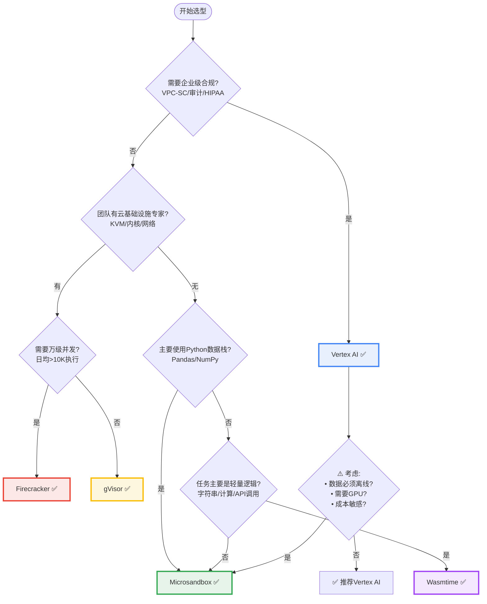

# Agent Sandbox 深度对比分析：五大技术路线的正交剖析

## 1. 核心摘要与战略综述

随着"代理式人工智能"（Agentic AI）从实验性的聊天机器人向具有自主推理、规划和工具执行能力的智能体演进，**安全代码执行**（Secure Code Execution）已从边缘的运维需求跃升为核心的架构支柱。

本报告对当前市场上最具代表性的五种安全代码执行环境进行详尽的**正交分析**：

| 项目             | 技术路线        | 隔离级别    | 启动延迟  | 核心优势           |
| ---------------- | --------------- | ----------- | --------- | ------------------ |
| **Wasmtime**     | WebAssembly     | 语言级      | **<5ms**  | 极致性能、跨平台   |
| **Firecracker**  | MicroVM         | 硬件级(KVM) | 125ms     | 生产验证、最高密度 |
| **Microsandbox** | MicroVM+libkrun | 硬件级(KVM) | 150-200ms | **最佳平衡点**     |
| **gVisor**       | App Kernel      | 用户态内核  | 200-500ms | K8s无缝集成        |
| **Vertex AI**    | 托管服务        | 托管级      | <1s(预热) | 零运维、企业级     |

### 1.1 三大技术阵营

```
┌─────────────────────────────────────────────────────────────┐
│                    Agent Sandbox 技术谱系                      │
├─────────────────────────────────────────────────────────────┤
│                                                             │
│  🔒 硬件虚拟化阵营                            │
│  ├── Firecracker (AWS Lambda底层)                           │
│  └── Microsandbox (开发者友好的MicroVM)                      │
│                                                             │
│  🛡️ 用户态内核阵营                              │
│  ├── gVisor (Google开源Sentry)                              │
│  └── Vertex AI (托管式企业级服务)                            │
│                                                             │
│  ⚡ 语言沙箱阵营                                  │
│  └── Wasmtime (WebAssembly组件模型)                          │
│                                                             │
└─────────────────────────────────────────────────────────────┘
```

### 1.2 核心发现

通过对架构内部机制、内核级交互、安全边界设计以及运行时性能特征的深入剖析，本报告揭示了：

1. **Python生态是决定性因素**：Wasmtime性能最优，但Pandas/NumPy支持是硬伤；MicroVM方案在AI Agent场景具有压倒性优势
2. **没有银弹，只有权衡**：安全性 vs 易用性，性能 vs 生态，成本 vs 灵活性
3. **综合排名**：
   - 🥇 **Microsandbox** (4.4/5) - 最佳平衡点
   - 🥈 **Firecracker** (4.1/5) - 规模化之王
   - 🥉 **gVisor** (3.7/5) - K8s最佳伴侣

---

## 2. 代理式AI的隔离技术演进

### 2.1 从静态生成到动态执行的安全跃迁

在传统的RAG（检索增强生成）架构中，LLM仅输出文本，风险主要集中在内容生成层面。然而，Agentic AI引入了"工具使用（Tool Use）"范式，其中最强大的工具莫过于通用代码解释器（Code Interpreter）。

#### 安全威胁模型

| 威胁类型     | 描述                         | 传统影响   | Agent影响              |
| ------------ | ---------------------------- | ---------- | ---------------------- |
| **提示注入** | 恶意指令诱导模型生成攻击代码 | 低风险     | 高风险（代码直接执行） |
| **无限循环** | 模型生成死循环代码           | 用户可中止 | 资源耗尽、影响多租户   |
| **数据泄露** | 代码读取敏感文件             | 需用户触发 | 自动执行、静默窃取     |
| **横向移动** | 容器逃逸攻击内网             | 单租户隔离 | 多租户共享资源         |

### 2.2 隔离技术的代际分化

```
隔离强度金字塔

       🔒 硬件虚拟化 (最高隔离)
          ├─ Firecracker: AWS Lambda底层
          └─ Microsandbox: 开发者友好
           ↓
      🛡️ 用户态内核 (平衡隔离)
          ├─ gVisor: Google生产验证
          └─ Vertex AI: 托管服务
           ↓
      ⚡ 语言沙箱 (轻量级隔离)
          └─ Wasmtime: 跨平台性能极致
```

#### 代际特征对比

| 特征           | 第一代：容器   | 第二代：MicroVM           | 第三代：App Kernel | 第四代：WASM |
| -------------- | -------------- | ------------------------- | ------------------ | ------------ |
| **隔离边界**   | 共享内核       | 独立内核                  | Syscall拦截        | 内存安全     |
| **启动延迟**   | 100-500ms      | 125-200ms                 | 200-500ms          | <5ms         |
| **攻击面**     | 大（内核漏洞） | 极小（仅VMM）             | 中等（Sentry）     | 小（运行时） |
| **Python支持** | ✅ 完美        | ✅ 完美                   | ✅ 完美            | ⚠️ 受限      |
| **代表项目**   | Docker         | Firecracker, Microsandbox | gVisor             | Wasmtime     |

---

## 3. 技术谱系全景图

### 3.1 五大项目关键指标对比

| 项目             | 技术路线   | 隔离级别     | 启动延迟    | 内存开销 | Python支持 | 运维复杂度 | 核心优势     |
| ---------------- | ---------- | ------------ | ----------- | -------- | ---------- | ---------- | ------------ |
| **Wasmtime**     | WASM沙箱   | 语言级       | **<5ms** 🚀 | KB级     | ⚠️ 困难    | 高         | 极致性能     |
| **Firecracker**  | MicroVM    | 硬件级(KVM)  | 125ms       | ~5MB     | ✅ 原生    | 极高       | 生产验证     |
| **Microsandbox** | MicroVM    | 硬件级(KVM)  | 150-200ms   | 5-10MB   | ✅ 原生    | 中         | **最佳平衡** |
| **gVisor**       | App Kernel | 内核级(拦截) | 200-500ms   | 15-20MB  | ✅ 原生    | 中         | K8s集成      |
| **Vertex AI**    | 托管服务   | 托管级       | <1s(预热)   | N/A      | ✅ 预装    | **零**     | 企业级       |

### 3.2 技术定位矩阵

```
         高隔离          中隔离          低隔离
高性能   [__________]    [Microsandbox] [Wasmtime]
中性能   [Firecracker]  [gVisor]       [__________]
低性能   [__________]    [Vertex AI*]  [__________]

图例:
- Microsandbox = 平衡区 (最佳综合表现)
- Firecracker = 安全区 (最高隔离,性能优)
- Wasmtime = 性能区 (极致性能,隔离稍弱)
- gVisor = 合规区 (企业级特性)
- Vertex AI = 易用区 (托管服务,受网络限制)

* Vertex AI性能受网络RTT影响,但预热池可缓解
```

### 3.3 Python生态支持能力热力图

```
         完美支持     受限支持      不支持
CPython   [Firecracker] [Microsandbox] [gVisor]   [Vertex AI*]
WASM      [_____________Wasmtime_____________]

* Vertex AI: 预装常用库,但无法动态安装
```

**关键结论**：对于AI Agent场景，Python兼容性是决定性因素。Wasmtime虽然在性能上占据绝对优势，但Pandas/NumPy等C扩展库的支持困难使其在数据科学场景中受限。

---

## 4. 深度剖析：按技术路线分组

### 4.1 硬件虚拟化阵营：Firecracker & Microsandbox

#### 4.1.1 技术共性：KVM硬件虚拟化原理

**架构原理**：

```
┌─────────────────────────────────────────────────────┐
│                 硬件虚拟化架构                        │
├─────────────────────────────────────────────────────┤
│                                                     │
│  [应用层] Agent代码 (Python/Pandas)                 │
│     ↓                                               │
│  [Guest OS] 独立Linux内核                            │
│     ↓                                               │
│  [VMM层] libkrun/Firecracker (Rust)                 │
│     ↓                                               │
│  [KVM/HVF] 硬件虚拟化指令集 (VT-x/AMD-V)            │
│     ↓                                               │
│  [Host OS] 宿主机内核                                │
│                                                     │
└─────────────────────────────────────────────────────┘

隔离边界: Ring -1/0 (硬件级)
攻击面: 仅VMM与Guest内核交互
内核关系: 每个沙箱拥有独立的Guest Kernel
```

**核心特征**：

- **硬件辅助虚拟化**：利用CPU的Intel VT-x或AMD-V指令集
- **独立内核空间**：每个沙箱运行独立的Guest Linux内核
- **物理级隔离**：即使Guest内核崩溃，不影响宿主机

#### 4.1.2 Firecracker：工业标准

**核心架构**：

| 特性               | 描述                             | 对AI Agent的影响          |
| ------------------ | -------------------------------- | ------------------------- |
| **极简设备模型**   | 仅virtio-net/block/vsock         | 无GPU直通，不适合本地推理 |
| **Jailer纵深防御** | Chroot + Cgroups + Seccomp       | 即使VMM逃逸也被限制       |
| **代码库规模**     | ~5万行(Rust) vs QEMU >100万行(C) | 攻击面极小，易审计        |
| **启动时间**       | ~125ms                           | 适合即时响应              |
| **内存开销**       | <5MB                             | 单机可运行数千实例        |

**生产验证**：

- AWS Lambda自2018年起大规模使用
- 支持每秒创建150个MicroVM（单服务器）
- 处理过数万亿次的函数调用

**运维痛点**：

- 需要手动构建rootfs（ext4格式）
- 不支持Docker镜像直接运行
- 网络配置复杂（TAP设备 + iptables）
- 需要强大的基础设施团队

#### 4.1.3 Microsandbox：开发者友好

**核心创新**：

**1. libkrun库级虚拟化**

```rust
// 传统Firecracker：独立进程
Firecracker Process
    ↓ (Unix Socket)
    VMM

// Microsandbox：进程内VMM
Application Process
    ↓ (dlopen)
    libkrun (VMM embedded)
```

**优势**：

- 减少IPC开销和上下文切换
- 启动时间 <200ms
- 进程内虚拟化体验

**2. OCI镜像兼容性**

| 对比项   | Firecracker | Microsandbox     |
| -------- | ----------- | ---------------- |
| 镜像格式 | ext4 rootfs | Docker/OCI镜像   |
| 构建流程 | 手动转换    | 直接运行         |
| 层存储   | 不支持      | ✅ virtio-fs DAX |
| 开发体验 | 复杂        | 类Docker         |

**virtio-fs DAX机制**：

```
┌─────────────────────────────────────────────┐
│         virtio-fs DAX 内存共享               │
├─────────────────────────────────────────────┤
│                                             │
│  Host: [Docker镜像层缓存]                    │
│           ↕ DAX映射 (零拷贝)                │
│  Guest: [直接内存访问]                       │
│                                             │
│  优势:                                       │
│  - 无需预先加载整个镜像                      │
│  - 多实例共享只读层内存                      │
│  - 文件按需分页(Page-in)                     │
│                                             │
└─────────────────────────────────────────────┘
```

**3. 透明套接字模拟(TSI)**

```
传统网络模型 (复杂):
  Guest VM → TAP设备 → 网桥 → iptables → 外部网络

TSI网络模型 (简单):
  Guest VM → libkrun拦截 → Host进程网络栈 → 外部网络

优势:
  - 零配置网络（无需Root权限）
  - 沙箱网络视图与宿主机一致
  - 安全：流量来自宿主机进程
```

**局限**：

- 当前主要支持IPv4的TCP/UDP
- 不支持ICMP（Ping）和原始套接字
- 仍处于实验性阶段

#### 4.1.4 对比：Firecracker vs Microsandbox

| 维度           | Firecracker        | Microsandbox | 赢家             |
| -------------- | ------------------ | ------------ | ---------------- |
| **启动速度**   | 125ms              | 150-200ms    | Firecracker      |
| **易用性**     | 需手动构建rootfs   | OCI兼容      | **Microsandbox** |
| **网络配置**   | 复杂(TAP+iptables) | TSI零配置    | **Microsandbox** |
| **内存密度**   | <5MB               | 5-10MB       | Firecracker      |
| **生产验证**   | AWS Lambda         | 实验性       | Firecracker      |
| **Python支持** | 完美               | 完美         | 平局             |

**深度洞察**：

- **Firecracker是"裸金属"**：适合云服务商，需要强大的基础设施团队
- **Microsandbox是"精装修公寓"**：适合应用开发者，开箱即用

---

### 4.2 用户态内核阵营：gVisor & Vertex AI

#### 4.2.1 技术共性：系统调用拦截

**架构原理**：

```
┌─────────────────────────────────────────────────────┐
│                 用户态内核架构                        │
├─────────────────────────────────────────────────────┤
│                                                     │
│  [应用层] Agent代码 (Python/Pandas)                 │
│     ↓ Syscall                                      │
│  [Sentry] 用户态内核 (Go) - 拦截所有系统调用         │
│     ↓                                              │
│  [Gofer] 文件系统代理 (9P协议)                      │
│     ↓                                              │
│  [Host OS] 宿主机内核（受限访问）                    │
│                                                     │
└─────────────────────────────────────────────────────┘

隔离边界: Ring 3 (用户态)
攻击面: Sentry逻辑实现
内核关系: 共享Host Kernel（由Sentry代理）
```

**核心特征**：

- **系统调用拦截**：不共享内核，但拦截所有Syscall
- **用户态实现**：Sentry用Go编写，内存安全
- **多层防御**：应用 → Sentry → Gofer → 宿主机内核

#### 4.2.2 gVisor：开源实现

**Sentry架构**：

```
系统调用拦截流程:

1. 应用程序调用 open("data.csv")
         ↓
2. Sentry拦截 (ptrace/KVM/Systrap)
         ↓
3. Sentry内部处理 (模拟Linux ABI)
         ↓
4. Gofer通过9P协议读取文件
         ↓
5. 返回文件描述符给应用
```

**拦截平台对比**：

| 平台        | 性能 | 兼容性 | 使用场景     |
| ----------- | ---- | ------ | ------------ |
| **ptrace**  | 极差 | 极好   | 调试、开发   |
| **KVM**     | 好   | 好     | 生产环境推荐 |
| **Systrap** | 极好 | 中等   | 最优性能     |

**性能代价**：

- **计算密集型**：接近原生（Syscall少）
- **I/O密集型**：性能下降50%+
  - pip install安装大量小文件
  - 高并发网络请求
  - 频繁的小文件读写

**GPU支持（nvproxy）**：

- 代理GPU驱动的ioctl调用
- 非直通（Passthrough）
- 支持特定CUDA功能子集
- 更新滞后，不支持所有视频编解码

#### 4.2.3 Vertex AI：托管服务

**架构推断**：

```
┌─────────────────────────────────────────────────────┐
│              Vertex AI 托管架构                       │
├─────────────────────────────────────────────────────┤
│                                                     │
│  [用户] API调用                                      │
│     ↓                                               │
│  [负载均衡]                                         │
│     ↓                                               │
│  [预热池] 预热的gVisor沙箱 (亚秒级响应)               │
│     ↓                                               │
│  [Borg集群] Google内部容器编排                       │
│     ↓                                               │
│  [VPC-SC] 企业安全边界                               │
│                                                     │
└─────────────────────────────────────────────────────┘
```

**核心特性**：

| 特性         | 描述               | 价值         |
| ------------ | ------------------ | ------------ |
| **预热池**   | 维护大量热实例     | 亚秒级响应   |
| **30秒超时** | 硬性执行时间限制   | 防止资源滥用 |
| **默认断网** | 无公网访问         | 防止数据泄露 |
| **预装库**   | Pandas/NumPy全家桶 | 开箱即用     |
| **14天会话** | 状态持久化         | 支持多轮对话 |

**企业级特性**：

- **VPC Service Controls (VPC-SC)**：构建虚拟安全边界
- **CMEK**：客户管理加密密钥
- **数据驻留**：支持区域策略
- **合规性**：HIPAA、SOC2、GDPR

**局限性**：

- 区域限制（仅us-central1）
- 供应商锁定
- 无法动态pip install
- 单文件100MB限制

#### 4.2.4 对比：gVisor自建 vs Vertex AI托管

| 维度           | gVisor自建   | Vertex AI      | 推荐       |
| -------------- | ------------ | -------------- | ---------- |
| **启动速度**   | 200-500ms    | <1s(预热)      | Vertex AI  |
| **运维复杂度** | 需配置节点   | **零**         | Vertex AI  |
| **定制能力**   | 完全控制     | 受限           | gVisor     |
| **企业合规**   | 需自建       | **原生VPC-SC** | Vertex AI  |
| **成本**       | 基础设施成本 | 按使用付费     | 取决于规模 |
| **数据主权**   | **完全本地** | 托管云端       | gVisor     |

**深度洞察**：

- **gVisor自建**：适合有K8s基础设施的团队，需要完全控制
- **Vertex AI托管**：适合快速上线、企业级合规、无运维资源

---

### 4.3 语言沙箱阵营：Wasmtime

#### 4.3.1 WASM安全模型

**线性内存模型**：

```
┌─────────────────────────────────────────────────────┐
│               WebAssembly 内存模型                    │
├─────────────────────────────────────────────────────┤
│                                                     │
│  [WASM模块] 线性内存空间                             │
│  ┌────────────────────────────────────┐            │
│  │ 0x0000: 代码段                     │            │
│  │ 0x1000: 数据段                     │            │
│  │ 0x2000: 堆 (Heap)                 │ ← 动态增长   │
│  │ 0xFFFF: 栈 (Stack)                │ ← 向下增长   │
│  └────────────────────────────────────┘            │
│           ↕                                         │
│  [运行时] 边界检查 + 内存保护单元                   │
│                                                     │
│  安全保证:                                         │
│  - 任何越界访问立即触发Trap                         │
│  - 数学级杜绝缓冲区溢出                             │
│                                                     │
└─────────────────────────────────────────────────────┘
```

**能力安全（Capability-based Security）**：

```
传统权限模型:
  进程 → root权限 → 读写任意文件

WASI能力模型:
  WASM模块 → 显式授予能力 → 只能访问授权资源
    ├── dir::/data/input (只读)
    ├── dir::/data/output (读写)
    └── https://api.example.com (HTTP)
```

#### 4.3.2 组件模型

**WIT接口类型**：

```
┌─────────────────────────────────────────────────────┐
│            WebAssembly 组件模型                       │
├─────────────────────────────────────────────────────┤
│                                                     │
│  [组件A: Rust逻辑]                                  │
│       ↕ WIT接口 (类型安全)                          │
│  [组件B: Python胶水代码]                            │
│       ↕ 无共享链接 (Shared-Nothing)                 │
│  [组件C: 数据处理]                                  │
│                                                     │
│  优势:                                             │
│  - 组件间不共享内存地址                             │
│  - 所有数据传递通过接口拷贝                         │
│  - 即使组件B被攻破，也无法读取组件A的内存           │
│                                                     │
└─────────────────────────────────────────────────────┘
```

**纳秒级实例化**：

- 无需启动操作系统内核
- 仅初始化内存结构
- 适合"纳进程（Nanoprocess）"架构
- 每次函数调用 = 全新沙箱

#### 4.3.3 Python生态困境

**编译难题**：

```
标准PyPI包:
  numpy-cp39-manylinux_x86_64.whl
        ↓ ❌ 无法在WASM中运行
  需要交叉编译为 wasm32-wasi 目标

工具链:
  Python代码 → componentize-py → WASM组件
        ↓
  [CPython解释器(WASM) + 用户代码 + 依赖库]
```

**性能双重惩罚**：

```
执行流程:
  WASM运行时 (JIT编译)
      ↓
  CPython解释器 (字节码分发)
      ↓
  Python代码

性能损失:
  - WASM JIT: 接近原生 (90%+)
  - CPython分发: 指令解释开销 (10-20倍)
  - 总体: 约原生速度的 20-40%
```

**C扩展的噩梦**：

| 库               | C扩展依赖          | WASM移植难度 | 现状        |
| ---------------- | ------------------ | ------------ | ----------- |
| **Pandas**       | NumPy + Cython     | 极难         | ❌ 不支持   |
| **NumPy**        | BLAS + LAPACK      | 极难         | ❌ 实验性   |
| **Scikit-learn** | NumPy + Cython     | 极难         | ❌ 不支持   |
| **Requests**     | urllib3 (纯Python) | 简单         | ✅ 支持     |
| **Matplotlib**   | NumPy + Agg        | 困难         | ⚠️ 部分支持 |

**网络栈缺失**：

- 标准Python socket库在WASI环境下功能受限
- wasi-sockets提案正在推进
- 当前许多网络库需大量魔改或依赖宿主机函数注入

#### 4.3.4 WASI-NN：AI推理的曙光

**未来方向**：

```
┌─────────────────────────────────────────────────────┐
│              WASI-NN 架构                            │
├─────────────────────────────────────────────────────┤
│                                                     │
│  [WASM模块] 轻量控制逻辑                            │
│       ↓ WASI-NN接口                                 │
│  [宿主机推理引擎]                                   │
│       ├── OpenVINO                                  │
│       ├── TensorFlow Lite                           │
│       └── ONNX Runtime                              │
│       ↓                                            │
│  [GPU] 硬件加速                                    │
│                                                     │
│  优势:                                             │
│  - 重型矩阵运算卸载给宿主机                         │
│  - 可利用宿主机GPU                                  │
│  - WASM仅运行轻量控制逻辑                           │
│                                                     │
└─────────────────────────────────────────────────────┘
```

**现状**：早期阶段，标准尚未稳定

---

## 5. 正交对比分析（六大维度）

### 5.1 维度一：隔离机制与攻击面

| 层级       | 技术原理     | 内核关系      | 攻击面           | 逃逸难度           | 代表项目                  | 适用场景   |
| ---------- | ------------ | ------------- | ---------------- | ------------------ | ------------------------- | ---------- |
| **硬件墙** | KVM虚拟化    | 独立Guest内核 | 极小(仅VMM)      | 极高(需CPU漏洞)    | Firecracker, Microsandbox | 金融、医疗 |
| **拦截墙** | Syscall拦截  | 共享Host内核  | 中等(Sentry逻辑) | 高(需穿透多层防御) | gVisor, Vertex AI         | 企业应用   |
| **语言墙** | 内存安全验证 | 共享Host内核  | 小(运行时Bug)    | 中(需JIT漏洞)      | Wasmtime                  | 边缘计算   |

**隔离强度金字塔**：

```
    🔒 硬件虚拟化
      Firecracker, Microsandbox
      最高隔离强度
         ↓
    🛡️ 用户态内核
      gVisor, Vertex AI
      平衡隔离与性能
         ↓
    ⚡ 语言沙箱
      Wasmtime
      轻量级隔离
```

**深度洞察**：

- **Firecracker/Microsandbox**：提供理论上最强的隔离性，硬件虚拟化的物理地址隔离是目前公认的最强防线
- **gVisor**：虽然Sentry是内存安全的Go代码，但理论上仍存在逻辑漏洞导致穿透的可能
- **Wasmtime**：安全性依赖数学证明和编译器实现，近期的CVE-2025-62711表明即使内存安全的运行时也可能存在Bug

### 5.2 维度二：性能动力学

| 性能指标     | Wasmtime    | Firecracker       | Microsandbox | gVisor    | Vertex AI  | 赢家        |
| ------------ | ----------- | ----------------- | ------------ | --------- | ---------- | ----------- |
| **冷启动**   | **<5ms** 🚀 | ~125ms            | 150-200ms    | 200-500ms | <1s(预热)  | Wasmtime    |
| **CPU吞吐**  | 原生90%+    | **原生99%+** ✅   | 原生99%+     | 原生95%   | 未知(配额) | FC/Micro    |
| **I/O性能**  | 优(WASI)    | **优(Virtio)** ✅ | 优(TSI)      | 差(-50%)  | 受限(API)  | FC/Micro    |
| **内存密度** | **KB级** 🚀 | ~5MB              | 5-10MB       | 15-20MB   | N/A        | Wasmtime    |
| **并发能力** | 极高        | 高                | 高           | 中        | 极高(云)   | Wasm/Vertex |

**深度洞察**：

- **Wasmtime是密度之王**：单机可运行万级实例，适合纯逻辑任务
- **gVisor是I/O短板**：I/O密集型任务性能下降50%+
- **MicroVM优势**：运行时性能接近原生，冷启动是唯一短板

### 5.3 维度三：Python生态兼容性（决定性维度）

| 库类型              | Wasmtime  | Firecracker | Microsandbox | gVisor  | Vertex AI | 说明         |
| ------------------- | --------- | ----------- | ------------ | ------- | --------- | ------------ |
| **纯Python**        | ✅ 完美   | ✅ 完美     | ✅ 完美      | ✅ 完美 | ✅ 完美   | 无C扩展      |
| **Pandas/NumPy**    | ❌ 极难   | ✅ 完美     | ✅ 完美      | ✅ 完美 | ✅ 预装   | **关键差异** |
| **Scikit-learn**    | ❌ 不支持 | ✅ 完美     | ✅ 完美      | ✅ 完美 | ✅ 预装   | C扩展复杂    |
| **动态pip install** | ❌ 不支持 | ✅ 支持     | ✅ 支持      | ✅ 支持 | ❌ 不支持 | 灵活性       |

**Python支持能力对比**：

```
┌─────────────────────────────────────────────────────┐
│            Python 生态支持完整度                      │
├─────────────────────────────────────────────────────┤
│                                                     │
│  Wasmtime: 20%  ████████░░░░░░░░░░░░░░             │
│  ├─ 纯Python: ✅ 完美                               │
│  └─ C扩展: ❌ 极难 (Pandas/NumPy)                   │
│                                                     │
│  Firecracker: 100% ████████████████████████        │
│  Microsandbox: 100% ████████████████████████        │
│  gVisor: 100% ████████████████████████             │
│  └─ 标准Linux环境，PyPI包完美支持                   │
│                                                     │
│  Vertex AI: 95% ███████████████████████░           │
│  └─ 预装常用库，但无法动态安装                      │
│                                                     │
└─────────────────────────────────────────────────────┘
```

**关键结论**：对于AI Agent场景，Python兼容性是决定性因素。Wasmtime虽然在性能上占据绝对优势，但Pandas/NumPy支持困难使其在数据科学场景中受限。

### 5.4 维度四：网络治理与合规

| 特性           | Microsandbox | Firecracker      | gVisor      | Vertex AI    | 分析       |
| -------------- | ------------ | ---------------- | ----------- | ------------ | ---------- |
| **网络模型**   | TSI用户态    | TAP桥接          | 原生容器    | VPC-SC       | 各有优势   |
| **配置复杂度** | 中(自动代理) | 高(手动iptables) | 低          | **极低**     | Vertex最优 |
| **企业合规**   | 需自建       | 需自建           | 需自建      | **原生支持** | Vertex优势 |
| **数据主权**   | ✅ 完全本地  | ✅ 完全本地      | ✅ 完全本地 | ⚠️ 托管云端  | 自建优势   |
| **VPC集成**    | 需手动配置   | 需手动配置       | K8s原生     | **深度集成** | Vertex优势 |

**场景映射**：

- **金融/医疗**：Vertex AI(VPC-SC)或自建gVisor
- **本地开发**：Microsandbox(TSI零配置)
- **公有云底层**：Firecracker(最高密度)

### 5.5 维度五：开发者体验与运维

| 项目         | 部署模式  | 学习曲线           | 定制能力 | 运维负担 | 适合团队     | DX评分     |
| ------------ | --------- | ------------------ | -------- | -------- | ------------ | ---------- |
| Wasmtime     | 自建      | 高(需编译WASM)     | 极高     | 高       | 基础设施团队 | ⭐⭐       |
| Firecracker  | 自建      | 极高(需构建rootfs) | 极高     | 极高     | 云厂商       | ⭐         |
| Microsandbox | 自建      | 中(类Docker)       | 高       | 中       | 创业公司     | ⭐⭐⭐⭐   |
| gVisor       | 自建/托管 | 中                 | 中       | 中       | K8s用户      | ⭐⭐⭐     |
| Vertex AI    | SaaS      | **极低**(API调用)  | 低       | **零**   | 企业应用     | ⭐⭐⭐⭐⭐ |

**开发者体验曲线**：

```
易用性
  ↑
5│               [Vertex AI]
4│           [Microsandbox]
3│       [gVisor]
2│   [Wasmtime]
1│ [Firecracker]
  └────────────────────────────→ 定制能力
  低                        高
```

### 5.6 维度六：TCO（总体拥有成本）

| 项目         | 硬件成本         | 人力成本         | 规模效应           | 适用阶段   | 月成本估算(1000执行/天) |
| ------------ | ---------------- | ---------------- | ------------------ | ---------- | ----------------------- |
| Wasmtime     | **极低**(密度高) | 高(需编译专家)   | 一般               | POC验证    | $50                     |
| Firecracker  | 中(需优化)       | 极高(需内核专家) | **极佳**(万级实例) | 规模化     | $200                    |
| Microsandbox | 中               | 中               | 良好               | MVP/成长期 | $150                    |
| gVisor       | 中低             | 中               | 良好               | 生产环境   | $120                    |
| Vertex AI    | 高(云溢价)       | **零**           | 极佳(弹性)         | 快速上线   | $500+                   |

**成本效益曲线**：

```
成本
  ↑
高│   [Vertex AI]
  │      [Firecracker]
中│         [Microsandbox]
 │            [gVisor]
低│                [Wasmtime]
  └────────────────────────────→ 规模
  小                        大
```

**深度洞察**：

- **小规模(<100执行/天)**：Vertex AI虽然单价高，但无运维成本
- **中等规模(100-10K)**：Microsandbox是最佳平衡点
- **大规模(>10K)**：Firecracker的规模效应显现

---

## 6. 可视化多维评估

### 6.1 六维雷达图对比

| 维度         | 权重 | Wasmtime  | Firecracker | Microsandbox | gVisor    | Vertex AI |
| ------------ | ---- | --------- | ----------- | ------------ | --------- | --------- |
| **安全性**   | 20%  | 3/5       | 5/5         | 5/5          | 4/5       | 5/5       |
| **性能**     | 20%  | 5/5       | 4/5         | 4/5          | 3/5       | 3/5       |
| **易用性**   | 15%  | 2/5       | 1/5         | 4/5          | 3/5       | 5/5       |
| **灵活性**   | 15%  | 5/5       | 5/5         | 4/5          | 3/5       | 2/5       |
| **生态**     | 20%  | 2/5       | 5/5         | 5/5          | 5/5       | 3/5       |
| **成本**     | 10%  | 5/5       | 4/5         | 4/5          | 4/5       | 2/5       |
| **加权总分** | 100% | **3.4/5** | **4.1/5**   | **4.4/5** ⭐ | **3.7/5** | **3.5/5** |

**综合排名**：

1. 🥇 **Microsandbox** (4.4/5) - 最佳平衡点
2. 🥈 **Firecracker** (4.1/5) - 规模化之王
3. 🥉 **gVisor** (3.7/5) - K8s最佳伴侣
4. **Vertex AI** (3.5/5) - 易用性最佳但灵活性不足
5. **Wasmtime** (3.4/5) - 性能极致但生态受限

### 6.2 性能/隔离热力图

```
         高隔离          中隔离          低隔离
高性能   [__________]    [Microsandbox] [Wasmtime]
中性能   [Firecracker]  [gVisor]       [__________]
低性能   [__________]    [Vertex AI*]  [__________]

图例:
- Microsandbox = 平衡区 (最佳综合表现)
- Firecracker = 安全区 (最高隔离,性能优)
- Wasmtime = 性能区 (极致性能,隔离稍弱)
- gVisor = 合规区 (企业级特性)
- Vertex AI = 易用区 (托管服务,受网络限制)

* Vertex AI性能受网络RTT影响,但预热池可缓解
```

### 6.3 场景适配度矩阵

| 场景           | Wasmtime | Firecracker | Microsandbox | gVisor | Vertex AI | 推荐度 |
| -------------- | -------- | ----------- | ------------ | ------ | --------- | ------ |
| 企业级数据分析 | ❌       | ⚠️          | ✅           | ⚠️     | ✅✅      | Vertex |
| 构建私有平台   | ❌       | ⚠️          | ✅✅         | ✅     | ❌        | Micro  |
| 大规模SaaS     | ❌       | ✅✅        | ✅           | ⚠️     | ⚠️        | FC     |
| 边缘计算       | ✅✅     | ❌          | ⚠️           | ❌     | ❌        | Wasm   |
| K8s集群加固    | ❌       | ❌          | ⚠️           | ✅✅   | ❌        | gVisor |
| 快速POC        | ⚠️       | ❌          | ✅           | ⚠️     | ✅✅      | Vertex |

**图例**: ✅✅ = 最佳, ✅ = 适合, ⚠️ = 可行但有局限, ❌ = 不推荐

---

## 7. 场景化决策树

### 7.1 核心决策流程



### 7.2 详细场景映射表

| 场景                  | 推荐方案     | 核心理由                        | 关键指标           | 替代方案                | 避免                |
| --------------------- | ------------ | ------------------------------- | ------------------ | ----------------------- | ------------------- |
| **企业级数据分析**    | Vertex AI    | 零运维、预装Pandas、VPC-SC合规  | 30s超时、预装库    | gVisor自建              | Wasmtime(Pandas难)  |
| **构建私有Agent平台** | Microsandbox | OCI兼容、强隔离、Python完美支持 | 150-200ms启动      | Firecracker(需更多工程) | Vertex AI(数据出域) |
| **大规模多租户SaaS**  | Firecracker  | 极致密度、AWS生产验证           | 125ms启动、5MB内存 | Microsandbox(更大开销)  | gVisor(I/O瓶颈)     |
| **边缘计算/IoT**      | Wasmtime     | 资源占用极低、跨平台            | <5ms启动、KB级内存 | Microsandbox(需KVM)     | Firecracker(太重)   |
| **K8s集群加固**       | gVisor       | 无缝集成、零应用改动            | 替换容器运行时     | Kata Containers         | -                   |
| **快速POC验证**       | Vertex AI    | API即用、零配置                 | 亚秒级响应         | Microsandbox(本地)      | Firecracker(太复杂) |
| **本地开发环境**      | Microsandbox | TSI零配置网络、类Docker         | 200ms启动          | Docker(不安全)          | Wasmtime(Pandas难)  |

### 7.3 决策检查清单

**选择 Vertex AI, 如果**:

- ✅ 团队规模<5人，无运维资源
- ✅ 需要HIPAA/SOC2合规
- ✅ 数据可上云，无离线要求
- ✅ 主要使用预装库(Pandas/NumPy)
- ❌ 避免如果: 需要动态pip install

**选择 Microsandbox, 如果**:

- ✅ 需要强隔离但不想管理Firecracker
- ✅ 熟悉Docker，希望平滑迁移
- ✅ 需要完整的Python生态
- ✅ 本地开发 + 生产部署统一栈
- ❌ 避免如果: 需要<100ms启动

**选择 Firecracker, 如果**:

- ✅ 有强大的基础设施团队
- ✅ 需要运行>10K并发实例
- ✅ 成本敏感(长期规模化)
- ✅ 需要极致的资源密度
- ❌ 避免如果: 团队<10人

**选择 gVisor, 如果**:

- ✅ 已有K8s集群
- ✅ 希望零应用改动
- ✅ 需要比容器更强的隔离
- ❌ 避免如果: I/O密集型任务

**选择 Wasmtime, 如果**:

- ✅ 任务主要是纯逻辑/算法
- ✅ 需要极高的启动速度
- ✅ 资源极度受限(边缘设备)
- ❌ 避免如果: 依赖Pandas/NumPy

---

## 8. 混合架构建议

### 8.1 渐进式架构演进路径

```mermaid
timeline
    title Agent平台架构演进路线图
    section 阶段1: MVP验证期
        Week 1-4   : Vertex AI<br/>(快速上线,验证需求)
        : 目标: 日均<100执行
    section 阶段2: 成长期
        Month 2-6  : Microsandbox<br/>(本地开发) + Vertex AI(生产)
        : 目标: 日均100-1K执行
    section 阶段3: 规模化期
        Month 6-12 : 混合架构<br/>(Wasmtime逻辑 + MicroVM计算)
        : 目标: 日均1K-10K执行
    section 阶段4: 成熟期
        Year 1+    : Firecracker底层<br/>+ 自建编排
        : 目标: 日均>10K执行
```

### 8.2 混合运行时架构（未来愿景）

**核心理念**: 根据任务特征动态选择最佳运行时

```
┌─────────────────────────────────────────────────────┐
│              混合运行时调度器                        │
├─────────────────────────────────────────────────────┤
│                                                     │
│  [Agent任务] → 任务特征分析 (LLM分类)                │
│       ↓                                             │
│  ┌─────────────────────────────────────┐           │
│  │ 类型1: 纯逻辑 (字符串/条件判断)      │           │
│  │ → Wasmtime Runtime                  │           │
│  │   ⚡ <5ms启动, 成本: $0.0001/次     │           │
│  └─────────────────────────────────────┘           │
│                                                     │
│  ┌─────────────────────────────────────┐           │
│  │ 类型2: Python数据分析               │           │
│  │ → Microsandbox Runtime              │           │
│  │   🛡️ 150-200ms启动, 成本: $0.01/次  │           │
│  └─────────────────────────────────────┘           │
│                                                     │
│  ┌─────────────────────────────────────┐           │
│  │ 类型3: 长时间运行 (模型训练)         │           │
│  │ → Firecracker Runtime               │           │
│  │   🔥 125ms启动, 成本: $0.05/次      │           │
│  └─────────────────────────────────────┘           │
│                                                     │
│  ┌─────────────────────────────────────┐           │
│  │ 类型4: 简单API调用                   │           │
│  │ → gVisor Runtime                    │           │
│  │   🔒 200-500ms启动, 成本: $0.005/次 │           │
│  └─────────────────────────────────────┘           │
│       ↓                                             │
│  [统一结果聚合] → 返回给Agent                      │
│                                                     │
└─────────────────────────────────────────────────────┘
```

### 8.3 成本优化策略

| 策略           | 适用场景     | 预期节省 | 实施难度 |
| -------------- | ------------ | -------- | -------- |
| **混合运行时** | 多种任务类型 | 30-50%   | 中       |
| **预热池优化** | 高频短任务   | 20-30%   | 低       |
| **Spot实例**   | 无状态任务   | 60-70%   | 低       |
| **冷热分离**   | 流量波动大   | 40-50%   | 中       |
| **本地缓存**   | 重复计算     | 50%+     | 低       |

---

## 9. 结论与战略建议

### 9.1 核心发现

1. **Python生态是决定性因素**
   - Wasmtime性能最优，但Pandas/NumPy支持是硬伤
   - MicroVM方案在AI Agent场景具有压倒性优势

2. **没有银弹，只有权衡**
   - 安全性 vs 易用性
   - 性能 vs 生态
   - 成本 vs 灵活性

3. **混合架构是未来趋势**
   - 单一运行时无法满足所有场景
   - 动态调度是终极方案

### 9.2 最终推荐

**按团队类型推荐**:

| 团队类型           | 首选方案     | 次选方案     | 避免        | 核心理由       |
| ------------------ | ------------ | ------------ | ----------- | -------------- |
| **企业IT团队**     | Vertex AI    | Microsandbox | Firecracker | 零运维、合规性 |
| **创业公司**       | Microsandbox | Vertex AI    | Firecracker | 最佳平衡点     |
| **云基础设施团队** | Firecracker  | Microsandbox | Vertex AI   | 长期规模化     |
| **边缘计算团队**   | Wasmtime     | Microsandbox | Vertex AI   | 资源占用极低   |
| **K8s重度用户**    | gVisor       | Microsandbox | Firecracker | 无缝集成       |

**按阶段推荐**:

```
POC阶段 → Vertex AI (快速验证)
         ↓
MVP阶段 → Microsandbox (本地+生产)
         ↓
成长期  → Microsandbox + gVisor混合
         ↓
成熟期  → Firecracker + 自建编排
```

### 9.3 未来展望

**短期(2026)**:

- WASI-NN标准成熟，Wasmtime可能通过宿主机调用解决Python困境
- GPU虚拟化突破(vfio-user)，MicroVM支持GPU直通

**中期(2027-2028)**:

- 混合运行时成为标配
- 统一的Agent沙箱抽象层(类似容器编排)

**长期(2029+)**:

- 硬件辅助隔离(TDX/SNP)普及
- 新一代沙箱技术(可能基于可信执行环境TEE)

---

## Works cited

1. zerocore-ai/microsandbox: opensource self-hosted sandboxes for ai agents - GitHub, accessed January 7, 2026, [https://github.com/zerocore-ai/microsandbox](https://github.com/zerocore-ai/microsandbox)
2. bytecodealliance/wasmtime: A lightweight WebAssembly runtime that is fast, secure, and standards-compliant - GitHub, accessed January 7, 2026, [https://github.com/bytecodealliance/wasmtime](https://github.com/bytecodealliance/wasmtime)
3. firecracker-microvm/firecracker: Secure and fast microVMs for serverless computing - GitHub, accessed January 7, 2026, [https://github.com/firecracker-microvm/firecracker](https://github.com/firecracker-microvm/firecracker)
4. google/gvisor: Application Kernel for Containers - GitHub, accessed January 7, 2026, [https://github.com/google/gvisor](https://github.com/google/gvisor)
5. Vertex AI Agent Engine overview - Google Cloud Documentation, accessed January 7, 2026, [https://docs.cloud.google.com/agent-builder/agent-engine/overview](https://docs.cloud.google.com/agent-builder/agent-engine/overview)
6. AI Sandboxes: Daytona vs microsandbox - Pixeljets, accessed January 7, 2026, [https://pixeljets.com/blog/ai-sandboxes-daytona-vs-microsandbox/](https://pixeljets.com/blog/ai-sandboxes-daytona-vs-microsandbox/)
7. A field guide to sandboxes for AI - Luis Cardoso, accessed January 7, 2026, [https://www.luiscardoso.dev/blog/sandboxes-for-ai](https://www.luiscardoso.dev/blog/sandboxes-for-ai)
8. Choosing a Workspace for AI Agents: The Ultimate Showdown Between gVisor, Kata, and Firecracker - DEV Community, accessed January 7, 2026, [https://dev.to/agentsphere/choosing-a-workspace-for-ai-agents-the-ultimate-showdown-between-gvisor-kata-and-firecracker-b10](https://dev.to/agentsphere/choosing-a-workspace-for-ai-agents-the-ultimate-showdown-between-gvisor-kata-and-firecracker-b10)
9. Firecracker: Lightweight Virtualization for Serverless Applications - USENIX NSDI 2020, accessed January 7, 2026, [https://www.usenix.org/system/files/nsdi20-paper-agache.pdf](https://www.usenix.org/system/files/nsdi20-paper-agache.pdf)
10. How AWS's Firecracker virtual machines work - Amazon Science, accessed January 7, 2026, [https://www.amazon.science/blog/how-awss-firecracker-virtual-machines-work](https://www.amazon.science/blog/how-awss-firecracker-virtual-machines-work)
11. Python - The WebAssembly Component Model, accessed January 7, 2026, [https://component-model.bytecodealliance.org/language-support/python.html](https://component-model.bytecodealliance.org/language-support/python.html)
12. WASI and the WebAssembly Component Model: Current Status - eunomia-bpf, accessed January 7, 2026, [https://eunomia.dev/blog/2025/02/16/wasi-and-the-webassembly-component-model-current-status/](https://eunomia.dev/blog/2025/02/16/wasi-and-the-webassembly-component-model-current-status/)
13. Security-Performance Trade-offs of Kubernetes Container Runtimes - Cristian Klein, accessed January 7, 2026, [https://cristian.kleinlabs.eu/publications/mascots2020_container_runtime_security.pdf](https://cristian.kleinlabs.eu/publications/mascots2020_container_runtime_security.pdf)
14. CVE-2025-62711 Detail - NVD, accessed January 7, 2026, [https://nvd.nist.gov/vuln/detail/CVE-2025-62711](https://nvd.nist.gov/vuln/detail/CVE-2025-62711)
15. WebAssembly/wasi-nn: Neural Network proposal for WASI - GitHub, accessed January 7, 2026, [https://github.com/WebAssembly/wasi-nn](https://github.com/WebAssembly/wasi-nn)
16. Introducing Code Execution: The code sandbox for your agents on Vertex AI Agent Engine, accessed January 7, 2026, [https://discuss.google.dev/t/introducing-code-execution-the-code-sandbox-for-your-agents-on-vertex-ai-agent-engine/264336](https://discuss.google.dev/t/introducing-code-execution-the-code-sandbox-for-your-agents-on-vertex-ai-agent-engine/264336)
17. Agent Engine Code Execution | Vertex AI Agent Builder - Google Cloud Documentation, accessed January 7, 2026, [https://docs.cloud.google.com/agent-builder/agent-engine/code-execution/overview](https://docs.cloud.google.com/agent-builder/agent-engine/code-execution/overview)
18. Code execution | Generative AI on Vertex AI - Google Cloud Documentation, accessed January 7, 2026, [https://docs.cloud.google.com/vertex-ai/generative-ai/docs/multimodal/code-execution](https://docs.cloud.google.com/vertex-ai/generative-ai/docs/multimodal/code-execution)
19. Code execution | Gemini API - Google AI for Developers, accessed January 7, 2026, [https://ai.google.dev/gemini-api/docs/code-execution](https://ai.google.dev/gemini-api/docs/code-execution)
20. Vertex AI networking access overview - Google Cloud Documentation, accessed January 7, 2026, [https://docs.cloud.google.com/vertex-ai/docs/general/netsec-overview](https://docs.cloud.google.com/vertex-ai/docs/general/netsec-overview)
