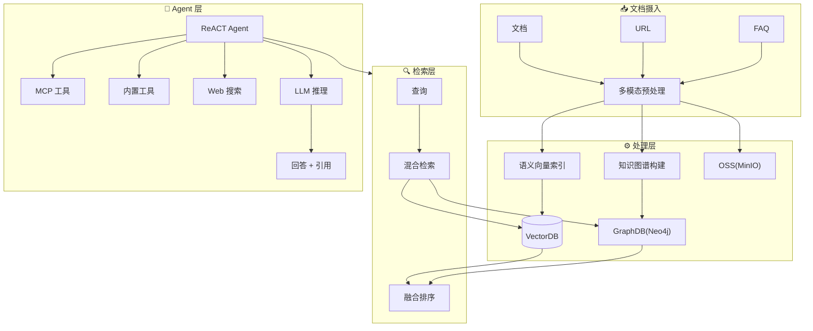
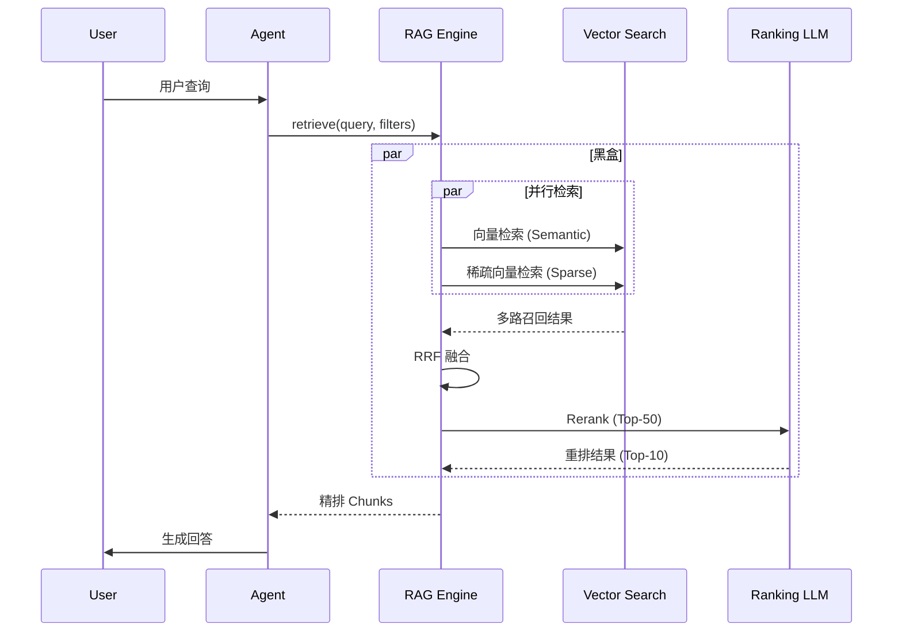
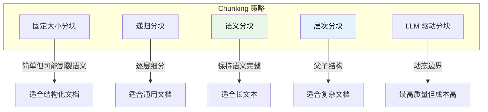
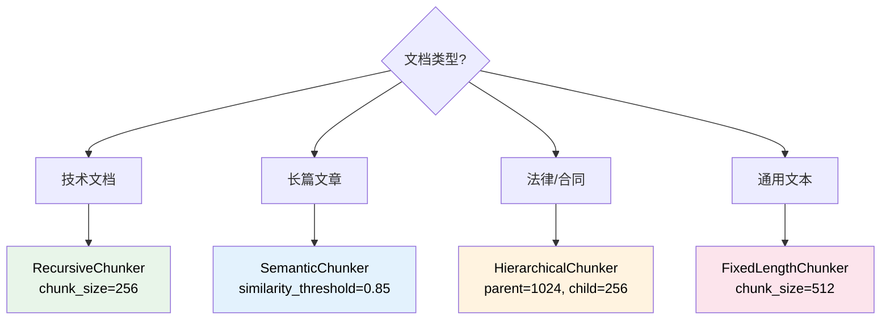
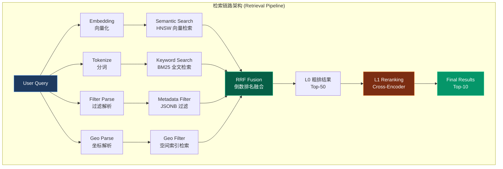
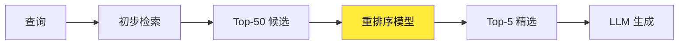
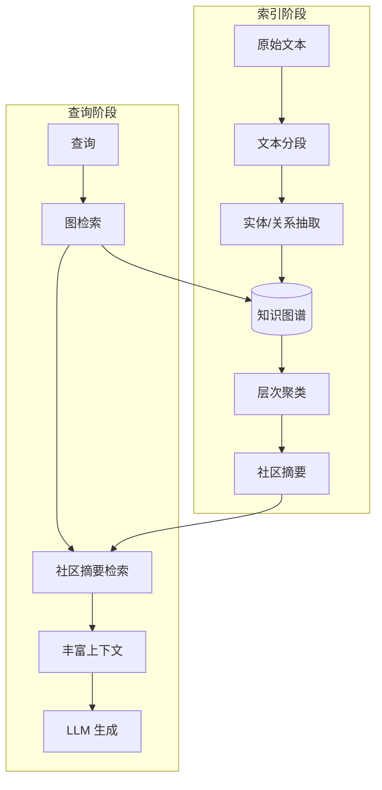
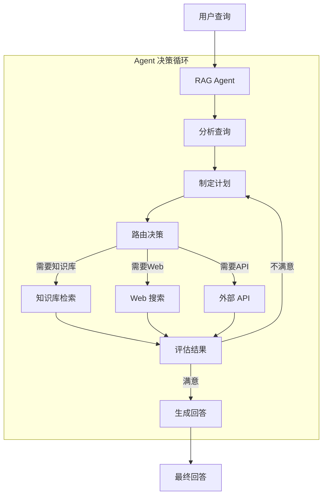

> [!NOTE]
>
> 本文档是从主架构文档中剥离的基础教学/理论部分，旨在解释 Knowledge Base 系统的通用原理与关键技术概念。

> [!IMPORTANT]
>
> **Self-Built vs. Google RAG Engine (战略决策)**：
>
> | 评估维度       | Google RAG Engine (托管)                         | Self-Built (本方案)                                      |
> | :------------- | :----------------------------------------------- | :------------------------------------------------------- |
> | **TCO**        | 按量付费，规模化后成本陡升                       | 固定成本，复用现有 RDS，**起步节省 60%+**                |
> | **数据主权**   | 数据经 Google 网络，需合规评估                   | **数据不出内网**，满足金融/医疗等强监管场景              |
> | **可观测性**   | Black-Box，仅返回结果，无法 Debug 召回逻辑       | **Glass-Box**，RRF 权重、Reranker 模型均可调优与观测     |
> | **定制灵活性** | 固定 Pipeline，Chunking/Embedding 策略不可自定义 | **全栈可控**，支持自定义 Parser、Chunker、Embedding 模型 |
> | **迁移成本**   | 深度绑定 Vertex AI 生态，迁移成本高              | **Adapter Pattern**，可平滑切换至 Weaviate/Milvus        |

## 1. Knowledge Base 系统架构

**Knowledge Base（知识库）** 系统是一种将结构化与非结构化数据转化为可检索知识的智能系统。现代 Knowledge Base 系统通过 **RAG（Retrieval-Augmented Generation，检索增强生成）** 技术，将外部知识与大语言模型（LLM）深度融合，实现高质量的问答与知识服务。



**RAG Engine UI Pipeline**



> [!TIP]
>
> **Glass-Box 复刻策略**：上图中的"黑盒"区域正是 Google RAG Engine 的核心价值所在，也是我们需要透明化复刻的目标。我们的 **Unified Retrieval Platform** 将这些封闭能力解构为可观测、可调试、可定制的白盒实现：
>
> | 黑盒能力         | Google 实现 (不可见)     | 我们的 Glass-Box 复刻 (可见)                                                               |
> | :--------------- | :----------------------- | :----------------------------------------------------------------------------------------- |
> | **并行召回**     | 内部向量与关键词并行调度 | PostgreSQL `UNION ALL` + 应用层 `asyncio.gather()`，性能可监控                             |
> | **RRF 融合**     | Ranking API 黑盒算法     | [`rrf_fusion.py`](src/cognizes/engine/perception/rrf_fusion.py) 开源实现，参数 `k` 可调优  |
> | **L1 Reranking** | LLM 驱动的托管重排服务   | [`reranker.py`](src/cognizes/engine/perception/reranker.py) 本地 Cross-Encoder，模型可替换 |

## 2. 关键处理阶段

### 2.1 阶段一：文档解析（Parsing）

| 文档类型 | 解析技术       | 挑战               |
| -------- | -------------- | ------------------ |
| Markdown | 结构提取       | 无                 |
| PDF      | OCR + 布局分析 | 表格、多栏、扫描件 |
| Word/PPT | 结构提取       | 嵌入式对象         |
| 网页     | HTML 解析      | 动态内容、噪声去除 |
| 图像     | 多模态模型     | 图文关联理解       |

### 2.2 阶段二：分块策略（Chunking）



- **固定大小分块（Fixed-size Chunking）**
  - **方法**：按固定字符数或 Token 数切分
  - **优点**：简单、可预测
  - **缺点**：可能割裂句子或段落

- **递归分块（Recursive Chunking）**
  - **方法**：按优先级使用分隔符（段落 → 句子 → 单词）
  - **优点**：尊重自然文本边界
  - **缺点**：Chunk 大小不均匀

- **语义分块（Semantic Chunking）**
  - **方法**：基于 Embedding 相似度判断分割点
  - **优点**：保持语义完整性
  - **缺点**：计算成本较高

- **层次分块（Hierarchical Chunking）**
  - **方法**：创建父子 Chunk 结构
  - **应用**：检索子 Chunk，返回父 Chunk 提供更多上下文
  - **Amazon Bedrock 2024** 重点推出的策略

**选型策略**：



```python
# 语义分块伪代码
def semantic_chunk(text, threshold=0.85):
    sentences = split_to_sentences(text)
    embeddings = embed(sentences)
    chunks = []
    current_chunk = [sentences[0]]

    for i in range(1, len(sentences)):
        similarity = cosine_sim(embeddings[i], embeddings[i-1])
        if similarity < threshold:
            chunks.append(' '.join(current_chunk))
            current_chunk = []
        current_chunk.append(sentences[i])

    return chunks
```

**最佳实践建议**：

| 场景      | 推荐策略        | Chunk 大小              |
| --------- | --------------- | ----------------------- |
| 技术文档  | 递归分块        | 256-512 tokens          |
| 长篇文章  | 语义分块        | 动态                    |
| 法律/合同 | 层次分块        | 父: 1024, 子: 256       |
| 对话记录  | 固定大小 + 重叠 | 128 tokens, 20% overlap |

### 2.3 阶段三：向量化（Embedding）

- **Embedding 模型选择**：OpenAI 的 text-embedding-003-small、text-embedding-003-large，Google 的 test-embedding-005、gemini-embedding-001，BGE、BCE 等
- **维度平衡**：高维（更精确）vs 低维（更快速、更节省存储）

### 2.4 阶段四：检索（Retrieval Pipeline）



**Reciprocal Rank Fusion (RRF)** 公式：

$$
  RRF(d) = \sum_{r \in R} \frac{1}{k + rank_r(d)}
$$

其中：

- $d$ 是文档
- $R$ 是所有检索器的排名列表
- $rank_r(d)$ 是文档 $d$ 在结果集 $r$ 中的排名 (从 1 开始)
- $k$ 是平滑常数 (通常取 60)

**Two-Stage Retrieval（两阶段检索）**：
| 阶段 | 定义 | 技术实现 | 目标 |
| :---------- | :--------------- | :------------------ | :-------------------------- |
| **L0 粗排** | 数据库层融合检索 | PostgreSQL One-Shot | 高召回率 (Recall@50 > 95%) |
| **L1 精排** | 应用层语义重排 | Cross-Encoder Model | 高精度 (Precision@10 > 90%) |

**向量索引技术**：

| 索引类型 | 算法     | 特点               |
| -------- | -------- | ------------------ |
| **Flat** | 暴力搜索 | 100% 精确，但慢    |
| **IVF**  | 倒排索引 | 分区加速，精度可调 |
| **HNSW** | 图索引   | 高精度，内存占用大 |
| **PQ**   | 乘积量化 | 压缩存储，速度快   |

**Reranking（重排序）**：

重排序是 RAG Pipeline 中提升精度的关键环节：



**Reranker 模型类型**：

| 模型                | 特点               | 适用场景 |
| ------------------- | ------------------ | -------- |
| **Cross-Encoder**   | 高精度，计算密集   | 精度优先 |
| **monoT5**          | 性能/效率平衡      | 通用场景 |
| **Cohere Reranker** | 商业 API，开箱即用 | 快速集成 |
| **BCE Reranker**    | 中英双语优秀       | 双语场景 |

**Reranker 模型推荐**：

| 模型                       | 参数量 | 语言支持 | 推理速度 | 推荐场景     |
| :------------------------- | :----- | :------- | :------- | :----------- |
| `BAAI/bge-reranker-base`   | 278M   | 中英     | 中等     | **推荐首选** |
| `BAAI/bge-reranker-v2-m3`  | 568M   | 多语言   | 较慢     | 多语言场景   |
| `cross-encoder/ms-marco-*` | 66M    | 英文     | 快       | 英文专用     |
| `jinaai/jina-reranker-v2`  | 137M   | 多语言   | 中等     | API 友好     |

**Lost in the Middle 问题**

研究表明，LLM 对长上下文中间部分的信息利用率较低。解决方案：

1. **Reverse Order**：按相关性升序排列（最相关在末尾）
2. **Sandwich Pattern**：最相关的放在开头和结尾

### 2.5 阶段五：生成（Generation）

- **Prompt 模板设计**：系统提示 + 检索上下文 + 用户查询
- **上下文窗口管理**：Token 限制下的信息优先级
- **引用生成**：可追溯的答案来源

## 3. 进阶 RAG 模式

### 3.1 Graph RAG

Microsoft Research 于 2024 年推出 GraphRAG，通过知识图谱增强 RAG 能力：



**优势**：

- **多跳推理**：连接分散的信息片段
- **全局理解**：生成跨文档的主题摘要
- **答案溯源**：提供结构化的推理路径

### 3.2 Agentic RAG

Agentic RAG 将 AI Agent 与 RAG 深度融合，具备 **动态路由**、**查询分解**、**自我验证** 等能力。



**Agentic RAG 核心能力**：

| 能力         | 描述                       |
| ------------ | -------------------------- |
| **动态路由** | 智能选择检索来源           |
| **查询分解** | 将复杂查询拆解为子查询     |
| **自我验证** | 评估检索结果质量           |
| **迭代优化** | 多轮检索直到满意           |
| **工具调用** | 集成 API、计算器等外部工具 |

## 4. 附录

> [!IMPORTANT]
>
> **Knowledge vs. Memory**
>
> | 维度         | **Knowledge (知识)**                                       | **Memory (记忆)**                                       |
> | :----------- | :--------------------------------------------------------- | :------------------------------------------------------ |
> | **来源**     | 预先导入的外部文档（PDF/Markdown/FAQ）                     | Agent 与用户交互动态生成                                |
> | **特点**     | 静态、共享、结构化/非结构化                                | 动态、个人化、情景化                                    |
> | **生命周期** | **持久化**，不会自动遗忘                                   | **有遗忘曲线**，低频访问会衰减                          |
> | **所有权**   | 全局/租户级别（多用户共享）                                | 用户级别（个人私有）                                    |
> | **典型场景** | 企业文档、FAQ、产品手册、政策法规<br>"公司年假政策是什么?" | 对话历史、用户偏好、情景记忆<br>"用户之前说过什么偏好?" |
> | **对标系统** | RAGFlow Corpus、Dify RAG Engine                            | LangGraph `Store`、ADK `MemoryBank`                     |
> | **存储表**   | `knowledge`                                                | `memories` + `facts`                                    |
> | **过滤条件** | `corpus_id`, `app_name`                                    | `user_id`, `app_name`                                   |
>
> 通过 RRF 等融合排序算法，可以将相关知识与用户记忆结合起来使用。
