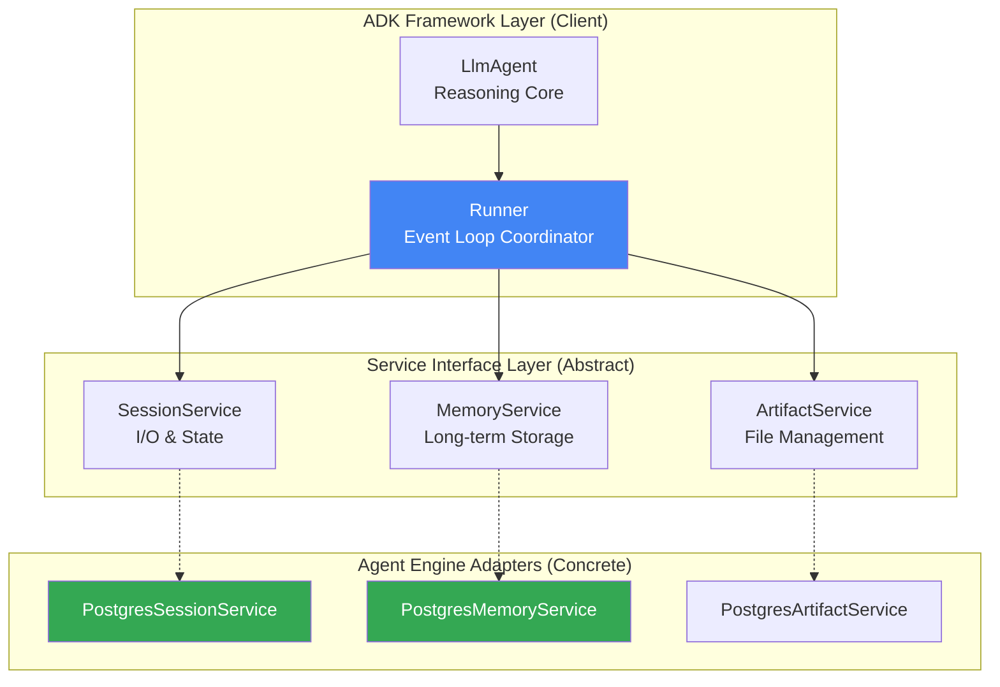
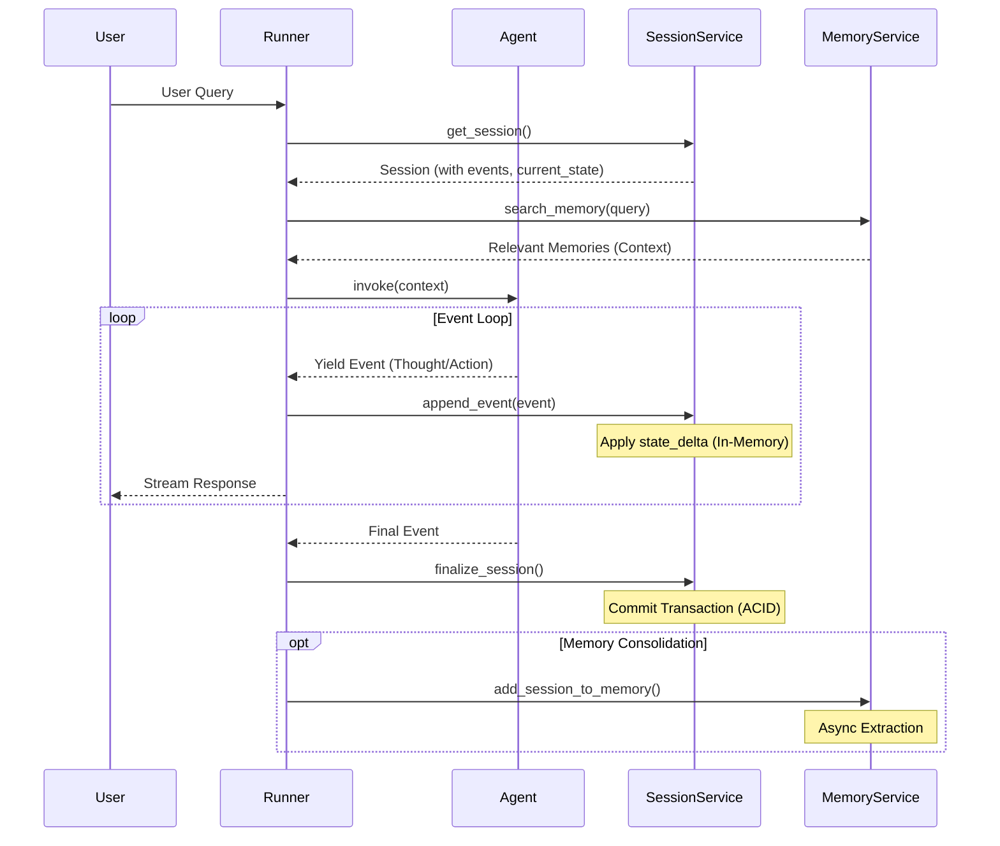
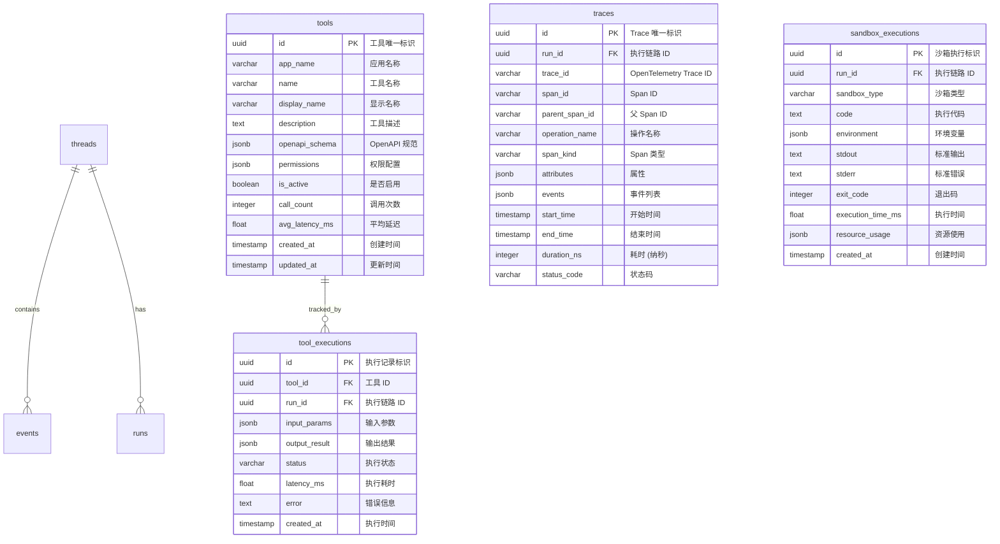

> **Target Audience**: Engineers & Architects
> **Prerequisites**: Familiarity with Google ADK, PostgreSQL, and Event Sourcing patterns.

This document serves as the "Deep Dive" companion to the [Main Technical Report](../../README.md). While the report focuses on _why_ we chose this architecture, this document explains _how_ it works at a granular level.

## 1. ADK 接口适配 (Interface Adaptation)

To achieve "De-Google" while remaining "Re-Google Compatible", we adhere strictly to the **Google ADK (Agent Development Kit)** interfaces. We separate **Logic** (ADK Runner) from **Storage** (PostgreSQL) using the Adapter Pattern.

### 1.1 核心架构 (Architecture Layering)

### 1.2 PostgreSQL 实现增强 (Enhancement Points)

ADK 默认的 InMemory 模式 MemoryBank 实现是不满足生存要求的，通过 PostgreSQL 实现可以强化这些生产所需的特性：

| ADK Default / In-Memory     | PostgreSQL 增强                                                                                    |
| :-------------------------- | :------------------------------------------------------------------------------------------------- |
| **Memory**: Simple List     | **Vector Search**: 使用 `PGVector` 进行真实的语义与关键字等融合检索、记忆巩固、权重衰减的遗忘机制  |
| **Search**: Naive Filtering | **Iterative Scan**: 使用 `hnsw.iterative_scan` 避免高过滤场景的 "Recall@0" 问题                    |
| **Concurrency**: None       | **Optimistic Locking**: 使用 `xmin` / `version` 的 CAS (Compare-And-Swap) 防止状态覆盖，实现高并发 |

## 2. ADK Runner 驱动与交互

The interaction between the **ADK Runner** (the brain's executive function) and our **PostgreSQL Services** (the body) follows a strict event-driven loop.

### 2.1 SessionService 关键行为 (P1)

| Behavior           | Description                                     | Implementation Detail                         |
| :----------------- | :---------------------------------------------- | :-------------------------------------------- |
| **State Commit**   | `state_delta` 仅在 Event 被 Runner 处理后才提交 | 需在 `append_event` / `finalize` 中原子更新   |
| **Dirty Reads**    | 同一 Invocation 内可见未提交的 State 变更       | 内存缓存 + 最终 PG 持久化                     |
| **Event Ordering** | Events 必须严格按序列号排序                     | 使用 `BIGSERIAL` / `UUIDv7` 保证 IDs 自增顺序 |
| **Prefix Routing** | 不同前缀路由到不同存储位置                      | 解析 Session ID 前缀后分发到对应表            |

### 2.2 MemoryService 关键行为 (P2)

| Behavior              | Description                             | Implementation Detail                                |
| :-------------------- | :-------------------------------------- | :--------------------------------------------------- |
| **Session Ingestion** | 将 Session Events 转化为可检索的 Memory | 调用 Phase 2 `consolidation_worker` 的 consolidate() |
| **Semantic Search**   | 基于向量相似度检索相关记忆              | 复用 Phase 3 的 `hybrid_search()`                    |
| **User Isolation**    | 不同用户的 Memory 严格隔离              | `WHERE user_id = $user_id`                           |

## 3. 核心模块

以下是 Agent Engine Adaptation 核心模块说明与代码关联（实际代码：`src/cognizes/adapters/postgres/`）。

| Tag     | Component Name            | Function                                                                                             | Code Path                                             |
| :------ | :------------------------ | :--------------------------------------------------------------------------------------------------- | :---------------------------------------------------- |
| Feature | **PostgreSessionService** | **P1**: 完全兼容 ADK `BaseSessionService` 接口的 PostgreSQL 适配器                                   | `src/cognizes/adapters/postgres/session_service.py`   |
|         | **PostgreMemoryService**  | **P2**: 完全兼容 ADK `BaseMemoryService` 接口的 PostgreSQL 适配器，提供记忆巩固等能力                | `src/cognizes/adapters/postgres/memory_service.py`    |
|         | _PostgreKnowledgeService_ | **P3**: RAG Pipeline 与 Hybrid Search 封装，通过 MCP Server 暴露                                     | `src/cognizes/adapters/postgres/knowledge_service.py` |
|         | **ToolRegistry**          | **P4**: 数据库驱动的动态工具注册表，支持 OpenAPI Schema 动态加载与热更新                             | `src/cognizes/adapters/postgres/tool_registry.py`     |
|         | **Tracing**               | **P4**: OpenTelemetry 双路导出集成 ，支持 Langfuse + PostgreSQL                                      | `src/cognizes/adapters/postgres/tracing.py`           |
|         | **AgentExecutor**         | **P4**: 与 ADK Runner 协同，Python 驱动的 Agent 执行器，管理 `Thought -> Action -> Observation` 循环 | `src/cognizes/engine/mind/agent_executor.py`          |
| Test    | SessionServiceTest        | PostgresSessionService 单元测试，覆盖 ADK BaseSessionService 接口所有方法                            | `tests/unittests/mind/test_session_service.py`        |
|         | ADKLlmAgentTest           | ADK Runner 集成示例，验证 `PostgresSessionService` 与 Google ADK `LlmAgent` + `Runner` 的完整协同    | `tests/integration/mind/test_adk_llmagent.py`         |
|         | ADKIntegrationTest        | 验证 adk-postgres 与 Google ADK LlmAgent 的完整集成                                                  | `tests/integration/mind/test_adk_integration.py`      |
|         | E2ETest                   | E2E 集成测试 - 完整对话流程，验证 Session -> Agent -> Tool -> Memory 全链路                          | `tests/integration/mind/test_e2e.py`                  |

## 4. Table Schema

以下是 Agent Engine Adaptation 底层存储所需 Table 的架构设计，以及其如何实现可观测性的相关说明。

**Table 职责 (Responsibilities)**:

| 表名                   | 职责                     | 对标概念              | 生命周期   |
| :--------------------- | :----------------------- | :-------------------- | :--------- |
| **tools**              | 工具注册表 (动态加载)    | ADK Function Registry | 持久化     |
| **tool_executions**    | 工具执行记录 (审计追踪)  | Tool Call Audit Log   | 按策略归档 |
| **traces**             | OpenTelemetry Trace 存储 | Langfuse/OTLP         | 按策略清理 |
| **sandbox_executions** | 沙箱执行记录             | Code Interpreter Log  | 按策略清理 |

## 3. 附录

- SessionStore: $0.25/1000 events;
- MemoryBank.MemoriesStoredPerMonth: $0.25/1000 memories;
- MemoryBank.MemoriesRetrieved: $0.25/1000 memories;
